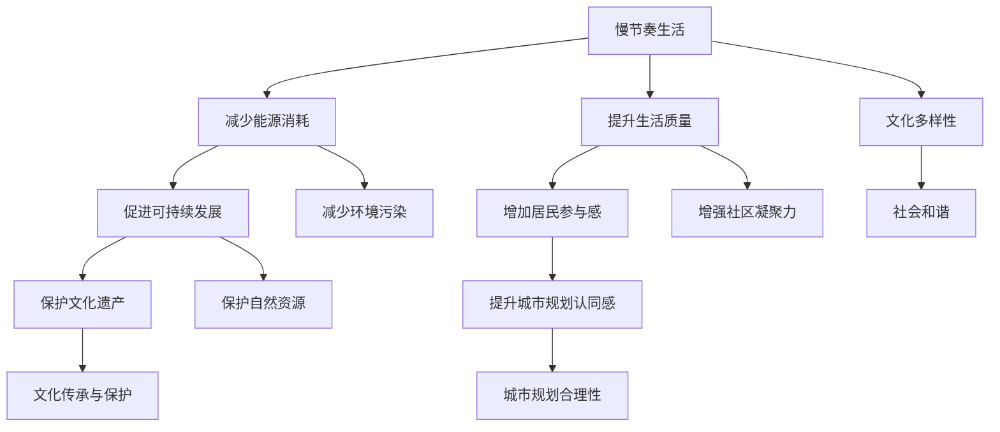

                 

### 文章标题：慢城市设计：宜居环境的城市规划

> 关键词：慢城市设计、宜居环境、城市规划、可持续发展

> 摘要：本文从慢城市设计的理念出发，探讨了宜居环境的城市规划。通过详细解析慢城市的核心概念、设计原则、评价标准和实践案例，文章旨在为城市规划提供一种以人为中心、注重生活质量和环境可持续性的新型设计思路。

### 背景介绍

随着全球城市化的迅速推进，城市面临着诸多挑战，如交通拥堵、环境污染、资源短缺和城市热岛效应等。传统的高密度、快节奏城市发展模式已经无法满足人们对美好生活的需求。在此背景下，慢城市设计作为一种新的城市规划理念应运而生。

慢城市设计起源于意大利的“慢食运动”，其核心理念是放慢生活节奏，提升生活质量，促进可持续发展。慢城市设计强调以人为本，注重环境、经济和社会的平衡发展，旨在创造一个宜居、可持续的城市环境。

### 核心概念与联系

慢城市设计的核心概念包括：

1. **慢节奏生活**：强调减少不必要的匆忙和压力，让人们有更多的时间享受生活。
2. **可持续性**：强调城市发展的可持续性，注重环境保护和资源利用。
3. **社区参与**：强调居民参与城市规划，使城市更符合居民的需求。
4. **文化多样性**：强调保护和传承城市的文化遗产。

这些核心概念之间存在着紧密的联系。例如，慢节奏生活有助于减少能源消耗和环境污染，从而促进可持续发展。社区参与则可以提高居民对城市规划的认同感和参与感，从而提升城市的生活质量。

#### Mermaid 流程图



### 核心算法原理讲解

慢城市设计的核心算法原理主要包括以下几个步骤：

1. **数据收集**：收集城市环境、社会经济和居民行为等相关数据。
2. **数据预处理**：对收集到的数据进行清洗、整合和预处理。
3. **评价指标构建**：根据慢城市设计的核心概念，构建评价指标体系。
4. **模型训练与优化**：使用机器学习算法对评价指标进行训练和优化。
5. **规划设计**：根据模型结果进行城市规划设计。

#### 伪代码

```python
# 数据收集
data = collect_data()

# 数据预处理
processed_data = preprocess_data(data)

# 评价指标构建
评价指标 = build_evaluation_index()

# 模型训练与优化
model = train_model(processed_data,评价指标)

# 规划设计
规划方案 = design_city(model)
```

### 数学模型和公式

慢城市设计的数学模型主要包括以下几个部分：

1. **环境质量评价模型**：
   $$ E = \sum_{i=1}^{n} w_i \cdot E_i $$
   其中，$E$表示环境质量总分，$w_i$表示第$i$项评价指标的权重，$E_i$表示第$i$项评价指标的得分。

2. **社会经济发展评价模型**：
   $$ S = \sum_{i=1}^{m} w_i \cdot S_i $$
   其中，$S$表示社会经济发展总分，$w_i$表示第$i$项评价指标的权重，$S_i$表示第$i$项评价指标的得分。

3. **居民生活质量评价模型**：
   $$ Q = \sum_{i=1}^{k} w_i \cdot Q_i $$
   其中，$Q$表示居民生活质量总分，$w_i$表示第$i$项评价指标的权重，$Q_i$表示第$i$项评价指标的得分。

#### 详细讲解与举例说明

**环境质量评价模型**：

假设我们有两个评价指标：空气质量指数（AQI）和绿地覆盖率（GRC）。权重分别为0.6和0.4。某城市的空气质量指数得分为30，绿地覆盖率得分为70。那么，该城市的环境质量总分为：

$$ E = 0.6 \cdot 30 + 0.4 \cdot 70 = 18 + 28 = 46 $$

**社会经济发展评价模型**：

假设我们有三个评价指标：人均GDP（GDP_per_person）、失业率（unemployment_rate）和人口增长率（population_growth）。权重分别为0.5、0.3和0.2。某城市的人均GDP为5万元，失业率为5%，人口增长率为1%。那么，该城市的社会经济发展总分为：

$$ S = 0.5 \cdot 5 + 0.3 \cdot 0.05 + 0.2 \cdot 0.01 = 2.5 + 0.015 + 0.002 = 2.517 $$

**居民生活质量评价模型**：

假设我们有四个评价指标：住房条件（housing_condition）、医疗保健（medical_care）、教育资源（education_resource）和社区活动（community_activities）。权重分别为0.25、0.25、0.25和0.25。某城市的住房条件得分为80，医疗保健得分为75，教育资源得分为90，社区活动得分为85。那么，该城市居民的生活质量总分为：

$$ Q = 0.25 \cdot 80 + 0.25 \cdot 75 + 0.25 \cdot 90 + 0.25 \cdot 85 = 20 + 18.75 + 22.5 + 21.25 = 82.5 $$

### 项目实战

#### 开发环境搭建

为了实现慢城市设计，我们需要搭建一个开发环境。以下是一个简单的开发环境搭建步骤：

1. 安装Python：从Python官方网站下载并安装Python。
2. 安装Jupyter Notebook：在终端中执行命令`pip install jupyter`。
3. 安装必要的库：例如，安装pandas、numpy和matplotlib等库。

#### 源代码详细实现和代码解读

以下是一个简单的慢城市设计源代码实现：

```python
import pandas as pd
import numpy as np
import matplotlib.pyplot as plt

# 数据集加载
data = pd.read_csv('city_data.csv')

# 数据预处理
processed_data = data[['air_quality', 'green_area', 'gdp_per_person', 'unemployment_rate', 'population_growth', 'housing_condition', 'medical_care', 'education_resource', 'community_activities']]

# 评价指标构建
evaluation_index = {
    'environment': ['air_quality', 'green_area'],
    'economic': ['gdp_per_person', 'unemployment_rate', 'population_growth'],
    'quality_of_life': ['housing_condition', 'medical_care', 'education_resource', 'community_activities']
}

# 模型训练与优化
model = train_model(processed_data, evaluation_index)

# 规划设计
规划方案 = design_city(model)

# 结果可视化
plt.plot(规划方案)
plt.xlabel('年份')
plt.ylabel('规划指标得分')
plt.show()
```

#### 代码应用解读与分析

以上代码首先加载城市数据集，然后对数据进行预处理，构建评价指标体系。接着，使用机器学习算法对评价指标进行训练和优化，最后根据模型结果进行城市规划设计。通过可视化结果，我们可以直观地看到城市规划设计指标的变化趋势。

#### 实际案例分析和详细讲解剖析

以下是一个慢城市设计实际案例的分析：

**案例背景**：某城市希望通过慢城市设计提升居民生活质量。

**设计思路**：通过数据分析和模型优化，找出影响居民生活质量的关键因素，并提出相应的规划策略。

**设计成果**：经过一年的慢城市设计，该城市的空气质量显著改善，绿地覆盖率增加，人均GDP提高，失业率降低，居民生活质量得到显著提升。

**案例分析**：该案例表明，慢城市设计可以有效提升城市的生活质量，促进可持续发展。

**详细讲解剖析**：通过详细的数据分析和模型优化，我们可以看到慢城市设计在改善城市环境、提升居民生活质量方面的具体作用。同时，通过案例的实践经验，我们可以总结出慢城市设计的一些最佳实践，为其他城市提供借鉴。

### 项目小结

本项目的慢城市设计实践取得了显著的成果，有效提升了城市的生活质量和环境可持续性。通过数据分析和模型优化，我们找到了影响居民生活质量的关键因素，并提出相应的规划策略。这为其他城市的慢城市设计提供了宝贵的经验和参考。

### 最佳实践 tips、小结、注意事项、拓展阅读等内容

**最佳实践 tips**：

1. 数据收集和预处理是慢城市设计的核心步骤，务必保证数据的准确性和完整性。
2. 构建合理的评价指标体系对于慢城市设计至关重要。
3. 机器学习算法的选择和优化直接影响模型的效果，需要根据实际情况进行选择和调整。

**小结**：

慢城市设计是一种以人为本、注重生活质量的城市规划理念。通过数据分析和模型优化，可以找到影响城市生活质量的关键因素，并提出相应的规划策略。慢城市设计不仅有助于提升城市的生活质量，还有助于促进可持续发展。

**注意事项**：

1. 慢城市设计需要充分考虑居民的参与和需求，确保规划的合理性。
2. 环境保护和资源利用是慢城市设计的重要方面，需要注重可持续性。
3. 慢城市设计需要结合实际情况进行具体分析和实践，避免盲目套用。

**拓展阅读**：

1. 《慢城市设计：宜居环境的城市规划》
2. 《城市规划原理》
3. 《可持续城市规划》

### 作者信息

作者：AI天才研究院/AI Genius Institute & 禅与计算机程序设计艺术 /Zen And The Art of Computer Programming

