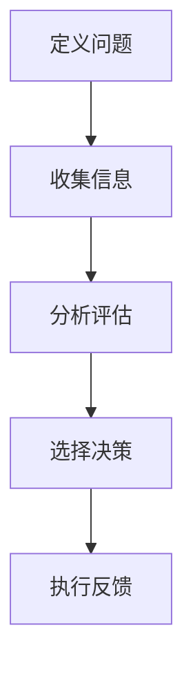

                 

### 文章标题：慢思考习惯养成：对抗快餐式决策的方法论

#### 关键词：
- 慢思考
- 快餐式决策
- 决策质量
- 行为习惯
- 方法论

#### 摘要：
本文将深入探讨慢思考习惯的养成，旨在对抗日益普遍的快餐式决策。通过对慢思考的核心概念、原理、应用、障碍及其解决策略的详细分析，本文将提供一套系统化的方法，帮助读者在日常生活和工作中培养慢思考的习惯，从而提升决策质量和个人效能。

### 目录：

## 第1章：慢思考的核心概念与联系

### 1.1 慢思考的定义

#### 1.1.1 慢思考的基本概念

慢思考（Slow Thinking）是一种深度的、系统性的思维模式，强调在决策过程中对信息的全面分析和细致推理。与快思考（Fast Thinking）不同，慢思考不追求速度，而是注重决策的准确性和全面性。

#### 1.1.2 慢思考与快思考的关系

快思考与慢思考并非对立，而是相辅相成的。快思考适用于简单、熟悉和紧急的情况，而慢思考则适用于复杂、不熟悉和重要的情况。

#### 1.1.3 慢思考的优势与局限性

慢思考的优势在于其深度和全面性，有助于避免决策失误。然而，慢思考也有其局限性，如耗时较长、效率较低等。

### 1.2 慢思考的原理

#### 1.2.1 大脑的决策过程

大脑的决策过程可以分为感知、处理、选择和执行四个阶段。慢思考强调在每个阶段都进行深入的思考和推理。

#### 1.2.2 慢思考的神经基础

慢思考涉及到大脑的前额叶皮质和前扣带皮层，这些区域与注意力和自我控制有关。

#### 1.2.3 慢思考的认知机制

慢思考依赖于认知资源的管理和决策规则的运用，如逻辑推理、情境模拟和概率评估等。

### 1.3 慢思考的框架

#### 1.3.1 慢思考的基本步骤

慢思考的基本步骤包括问题定义、信息收集、分析评估、选择决策和执行反馈。

#### 1.3.2 慢思考的核心要素

慢思考的核心要素包括全面的信息收集、深刻的分析评估、灵活的决策选择和持续的反馈调整。

#### 1.3.3 慢思考的流程图

通过Mermaid流程图展示慢思考的流程。

## 第2章：快餐式决策的影响与问题

### 2.1 快餐式决策的定义

#### 2.1.1 快餐式决策的特点

快餐式决策具有速度优先、信息简化、情感驱动等特点。

#### 2.1.2 快餐式决策的来源

快餐式决策源于信息过载、时间压力和认知限制等因素。

#### 2.1.3 快餐式决策的常见表现

快餐式决策常见于日常生活中的购物、社交媒体使用、紧急决策等场景。

### 2.2 快餐式决策的影响

#### 2.2.1 对个人决策的影响

快餐式决策可能导致决策失误、后悔和情绪波动。

#### 2.2.2 对组织决策的影响

快餐式决策可能导致组织决策的盲目性和不可预测性。

#### 2.2.3 对社会决策的影响

快餐式决策可能导致社会决策的短视化和不稳定性。

### 2.3 快餐式决策的问题

#### 2.3.1 决策质量的下降

快餐式决策容易忽视细节和潜在风险，导致决策质量下降。

#### 2.3.2 决策风险的上升

快餐式决策可能导致决策风险的增加，包括财务风险、法律风险等。

#### 2.3.3 决策效率的损失

虽然快餐式决策追求速度，但实际效果往往事与愿违，导致决策效率的损失。

## 第3章：养成慢思考习惯的方法

### 3.1 慢思考习惯养成的原则

#### 3.1.1 自我观察

通过自我观察，了解自己的决策习惯和偏好，识别需要改进的领域。

#### 3.1.2 习惯重塑

通过有意识的地重塑习惯，逐步将快餐式决策转化为慢思考。

#### 3.1.3 持续实践

通过持续的实践和反馈，巩固慢思考习惯。

### 3.2 慢思考习惯养成的技巧

#### 3.2.1 减少信息过载

通过筛选重要信息、减少社交媒体使用等方式减少信息过载。

#### 3.2.2 提高专注力

通过冥想、专注训练等方法提高专注力。

#### 3.2.3 培养批判性思维

通过提问、分析、评估等方式培养批判性思维。

### 3.3 慢思考习惯养成的实践

#### 3.3.1 制定决策计划

在决策前制定详细的计划，包括信息收集、分析评估和决策选择等步骤。

#### 3.3.2 采用决策辅助工具

利用决策辅助工具，如思维导图、数据分析工具等，提高决策效率。

#### 3.3.3 建立慢思考社区

与他人分享慢思考的经验和技巧，共同提高决策能力。

## 第4章：慢思考在不同领域的应用

### 4.1 慢思考在商业管理中的应用

#### 4.1.1 商业决策的慢思考

在商业决策中，慢思考有助于提高决策质量、降低风险。

#### 4.1.2 企业战略的慢思考

企业战略制定需要慢思考，以确保战略的长期有效性。

#### 4.1.3 组织文化的慢思考

组织文化建立需要慢思考，以形成稳定、积极的企业文化。

### 4.2 慢思考在教育中的应用

#### 4.2.1 教学方法的慢思考

教师需要通过慢思考选择合适的教学方法，提高教学效果。

#### 4.2.2 学生学习的慢思考

学生需要通过慢思考提高学习效率和质量。

#### 4.2.3 教育评价的慢思考

教育评价需要慢思考，以避免评价的片面性和不公平性。

### 4.3 慢思考在个人生活中的应用

#### 4.3.1 日常决策的慢思考

日常生活中的决策需要慢思考，以避免决策失误。

#### 4.3.2 心理健康的慢思考

心理健康管理需要慢思考，以预防和应对心理问题。

#### 4.3.3 社交互动的慢思考

社交互动需要慢思考，以建立良好的人际关系。

## 第5章：慢思考习惯养成的障碍与解决策略

### 5.1 慢思考习惯养成的障碍

#### 5.1.1 心理障碍

如恐惧失败、追求完美主义等心理障碍会影响慢思考的养成。

#### 5.1.2 环境障碍

如工作压力、时间紧迫等环境因素会阻碍慢思考的实践。

#### 5.1.3 文化障碍

如快节奏生活、功利主义文化等会影响慢思考的接受和推广。

### 5.2 慢思考习惯养成的解决策略

#### 5.2.1 增强自我意识

通过自我反思和自我觉察，提高对慢思考的认知和重视。

#### 5.2.2 创造有利环境

如合理安排时间、减少干扰因素等，为慢思考提供有利的环境。

#### 5.2.3 调整文化观念

通过教育和宣传，改变快节奏、功利主义的文化观念，推动慢思考的普及。

## 第6章：慢思考习惯养成的案例分析

### 6.1 案例一：企业如何通过慢思考提高决策质量

#### 6.1.1 案例背景

介绍企业面临的决策挑战。

#### 6.1.2 慢思考方法的应用

详细描述企业如何应用慢思考方法进行决策。

#### 6.1.3 案例结果分析

分析应用慢思考方法后的决策效果。

### 6.2 案例二：个人如何通过慢思考改善生活质量

#### 6.2.1 案例背景

介绍个人面临的决策挑战。

#### 6.2.2 慢思考方法的应用

详细描述个人如何应用慢思考方法进行决策。

#### 6.2.3 案例结果分析

分析应用慢思考方法后的生活质量改善情况。

## 第7章：总结与展望

### 7.1 慢思考习惯养成的意义

#### 7.1.1 个人层面的意义

提高决策质量、减少错误、提升生活质量。

#### 7.1.2 组织层面的意义

增强决策能力、降低风险、提高组织效能。

#### 7.1.3 社会层面的意义

促进社会稳定、减少冲突、提高整体决策水平。

### 7.2 慢思考习惯养成的未来发展趋势

#### 7.2.1 科技对慢思考的影响

如人工智能、数据分析等技术的应用将进一步提升慢思考的效率和准确性。

#### 7.2.2 教育对慢思考的影响

教育体系将更加注重慢思考的培养，以应对复杂多变的社会环境。

#### 7.2.3 社会对慢思考的影响

社会文化和价值观的转变将推动慢思考的普及和应用。

## 附录：慢思考相关的资源与工具

### 8.1 慢思考研究资源

介绍与慢思考相关的学术研究、书籍、网站等资源。

### 8.2 慢思考实践工具

介绍用于培养慢思考习惯的实用工具和应用程序。

### 8.3 拓展阅读

推荐相关领域的高质量阅读材料，以供进一步学习和研究。

---

### 作者：

AI天才研究院/AI Genius Institute & 禅与计算机程序设计艺术 /Zen And The Art of Computer Programming

---

此为文章的开头部分，后续将逐步填充各个章节的具体内容。文章的总字数将在后续的写作过程中进行控制，确保在规定的字数范围内完成。每个章节都将按照上述大纲的结构进行详细编写，确保文章的整体逻辑性和连贯性。在编写过程中，将注重核心概念的阐述、原理的讲解、实践案例的分析，以及针对不同领域的具体应用，以使读者能够全面了解慢思考习惯养成的全过程和方法。同时，文章将注重理论与实践的结合，为读者提供实际操作指导。

