                 


### 初步分析

《慢思考运动：对抗快节奏生活的冥想实践》这本书的主题非常明确，即通过慢思考运动和冥想实践来对抗快节奏生活带来的负面影响。在现代社会，快节奏的生活方式和不断增多的压力已经成为影响人们身心健康的主要因素。因此，这本书的目的在于向读者介绍慢思考运动和冥想的核心理念，并提供实践方法，帮助读者在快节奏的生活中找到平衡和宁静。

首先，我们可以将书名《慢思考运动：对抗快节奏生活的冥想实践》拆分成几个核心概念：

1. **慢思考运动**：这是一种旨在培养缓慢、深入思考习惯的运动，它要求我们放慢脚步，减少多任务处理，专注于单个任务。这种运动与快节奏生活形成了鲜明对比，有助于提高我们的注意力和专注力。
2. **冥想实践**：冥想是一种通过专注呼吸、放松身心、集中思维来达到心理平衡和内在平静的练习。冥想可以帮助我们减少焦虑，提高情绪管理能力，增强身心健康。
3. **对抗快节奏生活**：快节奏生活带来了种种负面影响，如压力、焦虑、失眠等。慢思考运动和冥想实践可以有效地对抗这些负面影响，帮助我们恢复身心健康。

在编写这篇文章时，我们需要从以下几个方面进行深入探讨：

1. **慢思考运动的概念和起源**：介绍慢思考运动的定义、起源以及它在现代社会中的重要性。
2. **冥想的基本原理和实践方法**：解释冥想的核心原理，介绍不同的冥想类型和实践步骤。
3. **快节奏生活的影响**：分析快节奏生活对身心健康的影响，探讨如何应对这些挑战。
4. **个人冥想实践案例**：分享个人冥想实践的经验和效果，如减轻压力、提高专注力和改善睡眠质量。
5. **团体冥想实践案例**：介绍如何在团队和企业中推广冥想实践，以及冥想对团队协作和企业文化建设的影响。
6. **冥想的科学基础**：探讨冥想与大脑机制和生理效应之间的关系。
7. **慢思考运动和冥想的推广与实践**：讨论如何在社会中推广慢思考运动和冥想实践，以及个人和组织如何参与其中。

在文章的结构安排上，我们可以按照以下大纲进行组织：

## 第一部分：慢思考运动概述

### 第1章：慢思考运动的起源与发展

- **慢思考运动的定义**
- **慢思考运动的历史与发展**
- **慢思考运动的核心价值观**

### 第2章：快节奏生活的影响

- **快节奏生活的原因分析**
- **快节奏生活对身心健康的影响**
- **快节奏生活的挑战与应对**

## 第二部分：冥想实践

### 第3章：冥想的基本原理

- **冥想的定义与类型**
- **冥想的历史与发展**
- **冥想的基本原理**

### 第4章：冥想的实践方法

- **冥想的准备工作**
- **冥想的实践步骤**
- **冥想的常见问题与解决方法**

### 第5章：个人冥想实践案例

- **减轻压力与焦虑的冥想实践**
- **提高专注力与创造力的冥想实践**
- **改善睡眠质量的冥想实践**

### 第6章：团体冥想实践案例

- **团队沟通与协作的冥想实践**
- **企业文化建设中的冥想实践**
- **社会公益冥想活动的组织与实践**

## 第三部分：冥想的科学基础

### 第7章：冥想与大脑机制

- **冥想对大脑结构的影响**
- **冥想对大脑功能的影响**
- **冥想与心理健康的关联**

### 第8章：冥想的生理效应

- **冥想对身体健康的影响**
- **冥想与免疫系统**
- **冥想与疾病预防**

## 第四部分：慢思考运动和冥想的推广与实践

### 第9章：慢思考运动的推广策略

- **政府与社会组织的推广策略**
- **企业与个人的推广策略**
- **慢思考运动的教育推广**

### 第10章：冥想实践的社会影响与未来展望

- **冥想实践的社会影响**
- **未来展望**

通过以上步骤，我们可以确保文章的逻辑清晰、内容丰富，并从技术角度对慢思考运动和冥想实践进行深入剖析。接下来，我们将逐一展开每个章节的内容。首先，让我们从慢思考运动的起源和发展开始。### 1.1 慢思考运动的定义

慢思考运动，又称深度工作运动（Deep Work Movement），是一种倡导在快节奏、多任务处理的生活环境中，培养专注和深入思考习惯的方法。它强调减少分心和干扰，使个体能够在一段时间内专注于单一任务，以达到更高的工作效率和创造力。

**核心概念**：

- **深度工作（Deep Work）**：一种能够在高度干扰的环境中保持专注和创造力的工作方式。
- **分心（Distraction）**：任何导致注意力分散的因素，如社交媒体、电子邮件、手机通知等。
- **专注力（Focus）**：集中精力进行深度工作的能力。
- **多任务处理（Multitasking）**：同时处理多个任务的能力，但可能导致效率降低。

**关系架构（Mermaid 流程图）**：

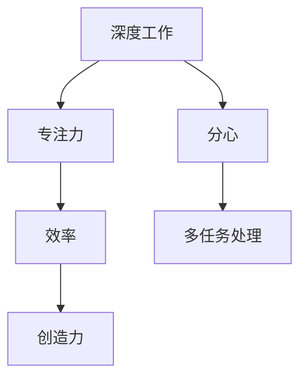

在这个流程图中，深度工作和专注力是核心概念，它们与效率、分心和创造力之间存在密切关系。减少分心和干扰，提升专注力，有助于提高工作效率和创造力。

### 1.2 慢思考运动的历史与发展

慢思考运动的起源可以追溯到20世纪初。当时，工业化和技术进步导致了工作环境的巨大变化，人们逐渐习惯了在快节奏和多任务处理的环境中工作。然而，随着时间的推移，人们开始意识到这种工作方式对身心健康和创造力产生了负面影响。因此，一些学者和思想家开始探讨如何在这种环境下培养深度工作能力。

**历史发展**：

- **20世纪初**：在这一时期，一些思想家如威廉·詹姆斯（William James）和约翰·杜威（John Dewey）开始探讨注意力分散和多任务处理对工作效率的影响。
- **21世纪初**：随着科技的发展，人们越来越依赖互联网和智能设备，分心和干扰变得更加普遍。心理学家卡尔·纽波特（Cal Newport）在其著作《深度工作》中，首次系统地提出了深度工作的概念，并倡导在快节奏生活中培养深度工作能力。
- **当今社会**：随着对慢思考运动的研究和推广，越来越多的人开始意识到其在提高工作效率和创造力方面的重要性，慢思考运动逐渐成为一种流行的趋势。

**核心价值观**：

- **专注**：专注于单一任务，减少干扰，提高工作效率。
- **质量**：追求工作质量，而非数量，提升创造力。
- **平衡**：在快节奏生活中寻找平衡，确保身心健康。

**关系架构（Mermaid 流程图）**：

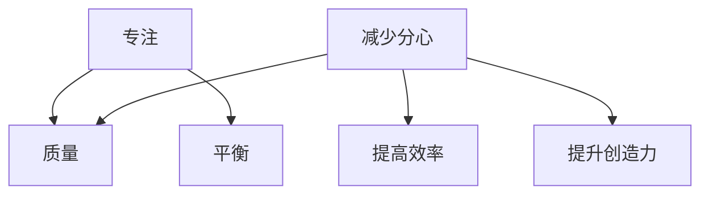

在这个流程图中，专注、质量和平衡是慢思考运动的核心价值观。减少分心有助于提高工作效率和创造力，从而实现工作质量和生活质量的提升。

通过以上分析，我们可以看到慢思考运动的定义、历史发展和核心价值观。在接下来的章节中，我们将进一步探讨快节奏生活的影响，以及如何通过冥想实践来对抗这些影响。接下来，让我们进入第2章，分析快节奏生活的影响。### 2.1 快节奏生活的原因分析

快节奏生活的现象在现代社会中越来越普遍，其背后有着多方面的原因。理解这些原因有助于我们更好地认识快节奏生活对个体和社会的广泛影响。

**社会层面的原因**：

1. **城市化**：城市化进程加速，城市生活的高密度和快速交通使得生活节奏加快。人们为了适应这种生活节奏，不得不加快步伐。
2. **科技发展**：互联网、智能手机和社交媒体的普及使得信息传递和处理速度大大提高，人们被各种信息和通知所包围，难以停下来。
3. **工作压力**：职业竞争激烈，工作压力增大。为了追求更好的职位和收入，人们往往需要加班、接受更多的任务，从而形成快节奏的工作模式。
4. **经济因素**：经济全球化使得市场环境变化迅速，企业为了保持竞争力，需要不断适应新的市场动态，这进一步加剧了生活的快节奏。

**个人层面的原因**：

1. **追求成功**：现代社会普遍存在的成功观念使得人们追求更高的社会地位和财富，这种追求往往与快节奏生活紧密相关。
2. **时间管理观念**：许多人认为时间就是金钱，因此倾向于充分利用时间，从而形成了快节奏的生活方式。
3. **心理压力**：面对竞争和不确定性，许多人感到焦虑和压力，为了减轻这些压力，他们可能会采取快节奏的方式来应对。
4. **社交媒体影响**：社交媒体上的成功故事和美好生活的展示，使得人们产生攀比心理，进而追求更快的生活节奏。

**关系架构（Mermaid 流程图）**：

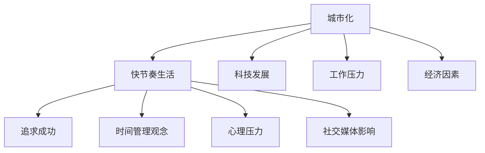

在这个流程图中，社会层面的原因（城市化、科技发展、工作压力和经济因素）和个人层面的原因（追求成功、时间管理观念、心理压力和社交媒体影响）共同推动了快节奏生活的形成。快节奏生活不仅影响了个体，也对社会整体产生了深远的影响。

**影响分析**：

1. **身心健康**：快节奏生活导致人们处于持续的压力状态，容易引发焦虑、抑郁、失眠等心理问题，同时也可能引发心血管疾病、肥胖等身体问题。
2. **人际关系**：快节奏生活使得人们难以抽出时间与家人和朋友相处，导致人际关系紧张和疏远。
3. **工作效率**：虽然快节奏生活可能提高了一定程度的工作效率，但长时间处于高压力状态下，容易导致工作质量和创造力的下降。
4. **社会问题**：快节奏生活带来的压力和焦虑，可能加剧社会的不稳定性，增加社会问题的发生率。

通过以上分析，我们可以看到快节奏生活的成因及其对个体和社会的广泛影响。在接下来的章节中，我们将探讨快节奏生活对身心健康的影响，并提出应对策略。接下来，让我们进入第3章，探讨快节奏生活对身心健康的影响。### 2.2 快节奏生活对身心健康的影响

快节奏生活对个体身心健康的影响是一个复杂且多方面的议题。长期的快节奏生活方式可能导致一系列的心理和生理问题，这些问题不仅影响个人的生活质量，也可能对社会整体产生不利影响。

**心理影响**：

1. **压力与焦虑**：快节奏生活往往伴随着高压力环境，人们需要在短时间内完成大量任务。这种持续的压力可能导致焦虑和紧张感，长期处于这种状态下，容易引发抑郁症和其他心理健康问题。
2. **情绪波动**：快节奏生活可能导致情绪波动加剧，人们可能会在短时间内经历从焦虑到愤怒，再到沮丧的情绪转变。
3. **注意力不集中**：长时间处于快节奏环境中，大脑容易疲劳，导致注意力不集中，影响工作和学习效率。

**生理影响**：

1. **心血管疾病**：长期的快节奏生活和压力可能导致高血压、心脏病等心血管疾病。心脏长期处于高压状态，容易引起动脉硬化和其他心血管问题。
2. **消化系统问题**：压力和焦虑可能导致胃肠功能紊乱，如胃溃疡、胃炎等消化系统疾病。
3. **免疫系统问题**：长期的压力状态可能抑制免疫系统的功能，使得个体更容易感染疾病。

**关系架构（Mermaid 流程图）**：

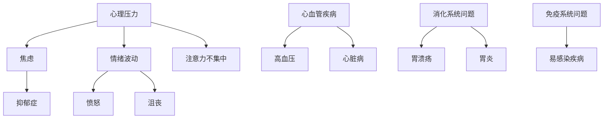

在这个流程图中，心理压力是核心因素，它直接导致了焦虑、情绪波动和注意力不集中。这些心理问题又可能进一步引发抑郁症等心理疾病。生理影响方面，心理压力通过一系列机制导致心血管疾病、消化系统问题和免疫系统问题。

**案例分析与影响评估**：

- **案例一**：某IT公司的一名高级软件工程师，由于项目压力大、加班频繁，长期处于高度紧张状态。最终，他因为心脏病发作而不得不暂时离职，接受治疗。
- **案例二**：一名职场新人，由于职场竞争激烈，工作压力巨大，导致情绪波动严重，失眠和焦虑问题不断加剧，最终影响了工作和生活质量。

这些案例表明，快节奏生活对身心健康的负面影响是真实且严重的。为了应对这些影响，我们需要采取一系列措施来减轻快节奏生活带来的压力，并提高个体的适应能力。

### 应对策略

1. **心理调适**：通过心理辅导和咨询来缓解压力，学习放松技巧，如冥想、深呼吸等。
2. **时间管理**：合理安排工作和休息时间，避免过度劳累，提高时间利用效率。
3. **健康生活方式**：保持良好的作息习惯，均衡饮食，定期进行体育锻炼。
4. **社交支持**：加强与家人、朋友的沟通，建立良好的社交网络，以获得情感支持和帮助。

通过以上分析，我们可以看到快节奏生活对身心健康的多方面影响，以及应对这些影响的策略。在接下来的章节中，我们将探讨如何通过冥想实践来对抗快节奏生活带来的负面影响。接下来，让我们进入第3章，冥想的基本原理。### 3.1 冥想的定义与类型

冥想（Meditation）是一种古老的实践，旨在通过专注、放松和内省来达到心理和精神的平衡。在现代社会，冥想被广泛认可为一种有效的减压和心理健康促进方法。以下是对冥想的定义与类型的详细探讨。

**定义**：

冥想可以被定义为一种通过专注、放松和内省来达到心理和精神的平衡的实践。它涉及对思想、情感和身体的全面控制，旨在减少干扰，提高专注力和自我意识。

**核心概念**：

- **专注**：冥想过程中，个体需要将注意力集中在某个特定的对象上，如呼吸、声音或视觉图像。
- **放松**：通过冥想，个体学会放松身体和心灵，减轻紧张和焦虑。
- **内省**：冥想提供了一个机会，让个体深入反思自己的思想、情感和行为，从而促进自我成长。

**关系架构（Mermaid 流程图）**：

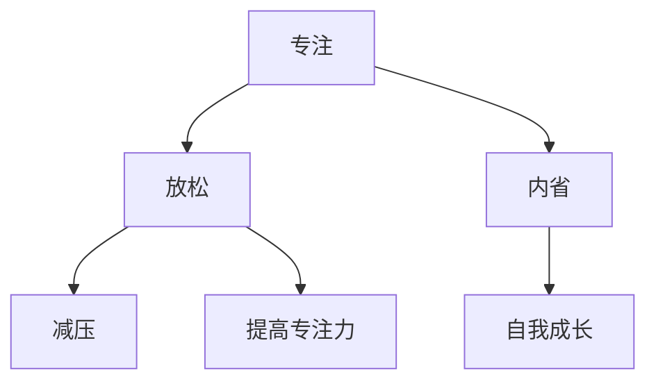

在这个流程图中，专注、放松和内省是冥想的核心概念。这些概念相互关联，共同作用以达到减压、提高专注力和促进自我成长的目的。

**类型**：

冥想有许多不同的类型，每种类型都有其独特的实践方法和目标。以下是一些常见的冥想类型：

1. **呼吸冥想**：这是最常见的冥想类型之一，通过专注于呼吸来放松身体和心灵。个体可以通过深呼吸、缓慢呼吸或呼吸计数来练习呼吸冥想。
2. **专注冥想**：在这种冥想中，个体将注意力集中在一个特定的对象上，如一朵花、一幅画或一句咒语。通过持续专注于这个对象，个体可以减少杂念，提高专注力。
3. **曼陀罗冥想**：曼陀罗是一种复杂的几何图形，通常用于冥想。个体通过绘制或观察曼陀罗，达到放松和内省的效果。
4. **正念冥想**：正念冥想强调对当前时刻的完全觉察和接受。个体通过观察自己的思想和感受，学会不评判地接受它们，从而减少焦虑和压力。
5. **瑜伽冥想**：瑜伽冥想通常与瑜伽练习结合进行，通过体式和呼吸练习来放松身体和心灵。

**关系架构（Mermaid 流程图）**：

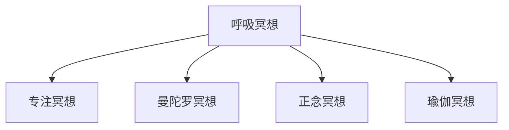

在这个流程图中，不同类型的冥想通过专注于呼吸、特定的对象、几何图形、当前时刻或瑜伽体式来实现其目标。

**历史与发展**：

冥想的历史可以追溯到几千年前，它在不同文化和宗教中都有所体现。例如，在佛教中，冥想是一种重要的修行方法；在印度教中，冥想被视为达到自我实现和精神解脱的关键途径。随着现代社会对心理健康和自我成长的关注增加，冥想逐渐成为一种广泛接受的实践方法。

**核心原理**：

- **专注力**：通过专注于某个对象，个体可以减少杂念，提高专注力。
- **放松**：冥想有助于放松身体和心灵，减轻紧张和焦虑。
- **内省**：冥想提供了一个反思自我的机会，个体可以通过观察自己的思想和感受，促进自我成长。

**关系架构（Mermaid 流程图）**：

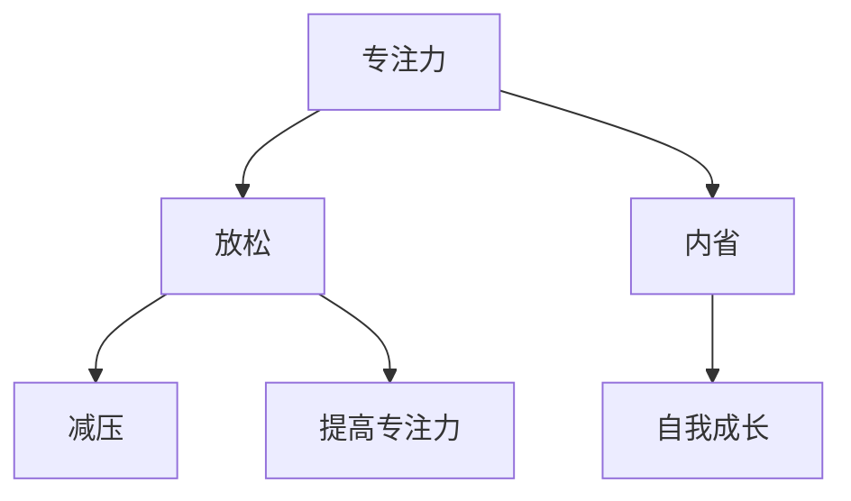

在这个流程图中，专注力、放松和内省是冥想的核心原理。这些原理相互作用，共同实现减压、提高专注力和促进自我成长的目标。

通过以上分析，我们可以看到冥想的定义、类型及其历史与发展。在接下来的章节中，我们将深入探讨冥想的基本原理，以及如何通过冥想实践来对抗快节奏生活带来的负面影响。接下来，让我们进入第3.2节，冥想的历史与发展。### 3.2 冥想的历史与发展

冥想作为一种精神实践的起源可以追溯到古代，它在多个文化和宗教传统中都有着深厚的历史根基。以下是对冥想历史与发展的详细探讨。

**古代起源**：

冥想的历史可以追溯到公元前3000年左右，最初的形式出现在古印度文明中。在印度教经典《奥义书》（Upanishads）中，冥想被描述为一种精神实践，旨在实现个体意识与宇宙意识的融合。佛教中的冥想则强调通过冥想达到涅槃，即解脱轮回的境界。

**印度教冥想**：

在印度教中，冥想被视为一种灵性修养的方式，通过各种不同的冥想技巧来实现个人的精神觉醒和自我实现。著名的冥想技巧包括观呼吸、念咒、注视火焰等。印度教哲学认为，通过冥想，个体可以超越物质世界的束缚，达到梵我合一的境界。

**佛教冥想**：

佛教中的冥想，特别是禅修，是修行的重要组成部分。禅修的方法多样，包括数息、观呼吸、静坐、身体扫描等。佛教强调通过冥想培养正念，使个体能够清晰地认识到现实，从而摆脱痛苦和执着。禅宗更是将冥想视为达到开悟的关键途径。

**古希腊哲学**：

在古希腊哲学中，冥想被认为是一种沉思和哲学思考的方式。苏格拉底和柏拉图等哲学家经常通过冥想来探索真理和智慧。冥想在这里被视为一种精神修养的方法，旨在提高个体的智慧和洞察力。

**基督教冥想**：

在基督教传统中，冥想被称为默想或灵性沉思。早期的基督教修士如圣安东尼和圣本尼狄克，通过冥想和祷告来培养内心的平静和虔诚。默想被视为与上帝沟通的一种方式，旨在实现灵魂的净化和升华。

**现代发展**：

随着20世纪心理学和医学的发展，冥想作为一种心理健康促进方法开始得到科学界的关注。卡尔·荣格和阿尔伯特·爱因斯坦等知名心理学家和科学家，对冥想进行了研究，并推广其在心理治疗和日常生活中的应用。

**现代科学认知**：

近年来，神经科学、心理学和医学等领域的学者对冥想进行了大量研究，发现冥想对大脑和身体健康具有显著的影响。研究表明，冥想可以增强大脑灰质密度，提高注意力、情绪调节能力和认知功能。此外，冥想还被证明有助于降低血压、减轻焦虑和抑郁症状，改善睡眠质量。

**关系架构（Mermaid 流程图）**：

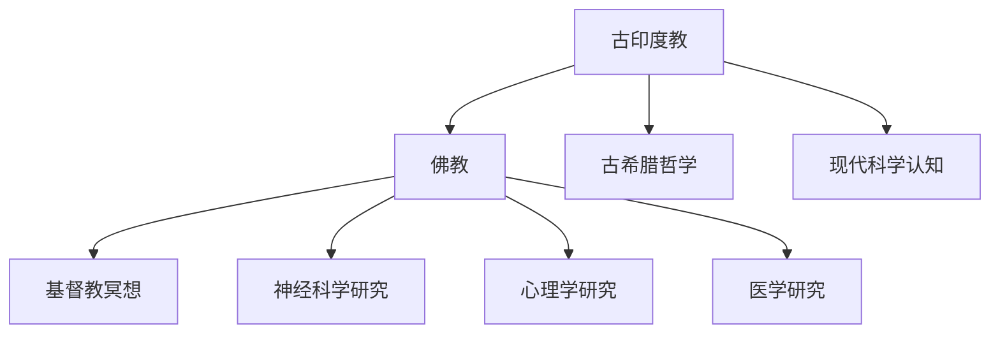

在这个流程图中，古代起源（印度教、佛教、古希腊哲学）与现代发展（神经科学研究、心理学研究、医学研究）相互联系，展现了冥想的历史演变和现代科学认知。

**核心价值观**：

- **内省**：冥想鼓励个体进行内省，探索自我和宇宙的真相。
- **平衡**：通过冥想，个体可以找到内心的平静和平衡，减轻生活中的压力和焦虑。
- **专注**：冥想培养了个体的专注力，使个体能够更好地应对快节奏的生活。

**关系架构（Mermaid 流程图）**：

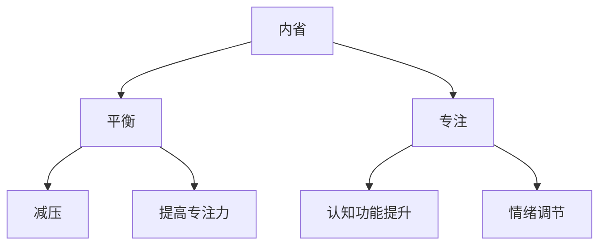

在这个流程图中，内省、平衡和专注是冥想的核心价值观，它们相互关联，共同实现减压、提高专注力和改善情绪调节的效果。

通过以上分析，我们可以看到冥想的历史起源、发展过程和现代科学认知。冥想作为一种古老而现代的实践，不仅在精神层面上具有深远的意义，也在身心健康和日常生活方面发挥着重要作用。在接下来的章节中，我们将进一步探讨冥想的基本原理，以及如何通过冥想实践来对抗快节奏生活带来的负面影响。接下来，让我们进入第3.3节，冥想的基本原理。### 3.3 冥想的基本原理

冥想作为一种广泛认可的心理健康促进方法，其基础原理源于对意识、注意力、心灵与身体的关系的深入理解。以下是对冥想基本原理的详细探讨。

**意识与注意力**：

冥想的核心在于意识的觉醒和注意力的集中。在冥想过程中，个体需要将注意力集中在特定的对象上，如呼吸、身体感觉或视觉图像。这种集中的注意力有助于个体从日常生活中的杂念中抽离出来，进入一种更加清晰和专注的状态。

**关系架构（Mermaid 流程图）**：

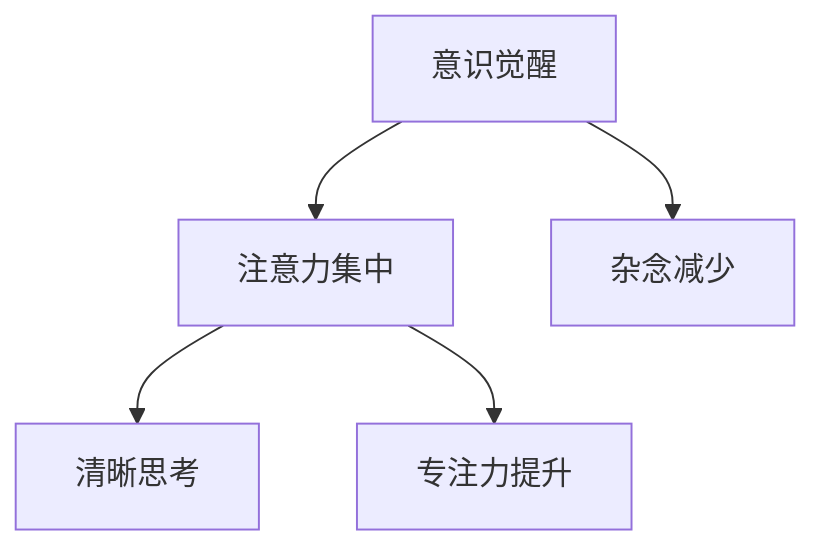

在这个流程图中，意识觉醒和注意力集中是冥想的核心原理，它们相互关联，共同实现减少杂念、清晰思考和提升专注力的效果。

**心灵与身体的关联**：

冥想不仅影响心灵，也对身体产生积极的影响。通过冥想，个体学会放松身体，减少紧张和焦虑。呼吸冥想是其中一种常见的冥想方法，它通过深呼吸来放松身体，调节心率和血压。此外，冥想还被发现有助于改善免疫系统功能，提高身体抵抗力。

**关系架构（Mermaid 流程图）**：

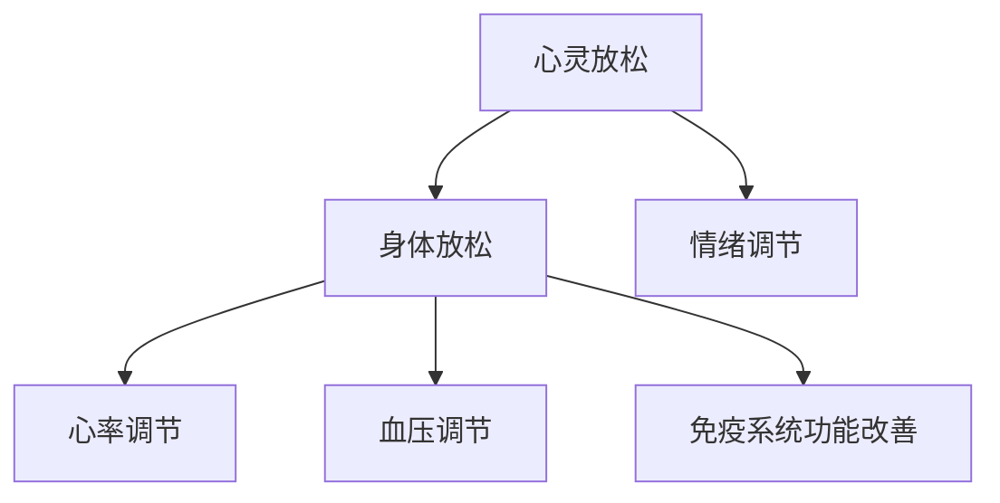

在这个流程图中，心灵放松和身体放松是冥想的基本原理，它们相互关联，共同实现情绪调节、心率调节、血压调节和免疫系统功能改善的效果。

**大脑机制**：

现代神经科学研究揭示了冥想对大脑结构和功能的影响。研究表明，冥想可以增强大脑灰质的密度，特别是在前额叶皮层和海马体等与注意力、情绪调节和记忆相关的区域。此外，冥想还被发现可以调节大脑中的神经递质水平，如血清素和多巴胺，从而改善情绪和认知功能。

**关系架构（Mermaid 流程图）**：

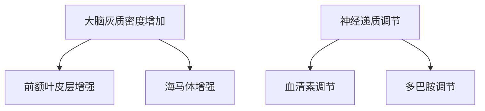

在这个流程图中，大脑灰质密度增加、前额叶皮层和海马体的增强，以及神经递质调节是冥想对大脑结构和功能的影响，它们共同作用，实现情绪和认知功能的改善。

**具体实践方法**：

- **呼吸冥想**：通过专注于呼吸，个体可以放松身体和心灵。呼吸冥想的具体步骤包括：
  1. 选择一个舒适的坐姿，保持身体放松。
  2. 将注意力集中在呼吸上，感受呼吸进出鼻孔的感觉。
  3. 如果注意力散乱，回到呼吸上，重复这个过程。
- **身体扫描冥想**：通过逐步关注身体的每个部分，个体可以放松身体，减轻焦虑。具体步骤包括：
  1. 选择一个舒适的坐姿，闭上眼睛。
  2. 从脚开始，逐步扫描身体每个部分，感受它们的感觉。
  3. 在扫描过程中，如果遇到紧张或不适，深呼吸几次，放松那个部位。
- **正念冥想**：通过完全觉察和接受当前时刻的体验，个体可以减少杂念，提高专注力。具体步骤包括：
  1. 选择一个舒适的坐姿，闭上眼睛。
  2. 将注意力集中在呼吸上，感受每一次吸气和呼气。
  3. 如果注意力散乱，回到呼吸上，保持正念。

**关系架构（Mermaid 流程图）**：

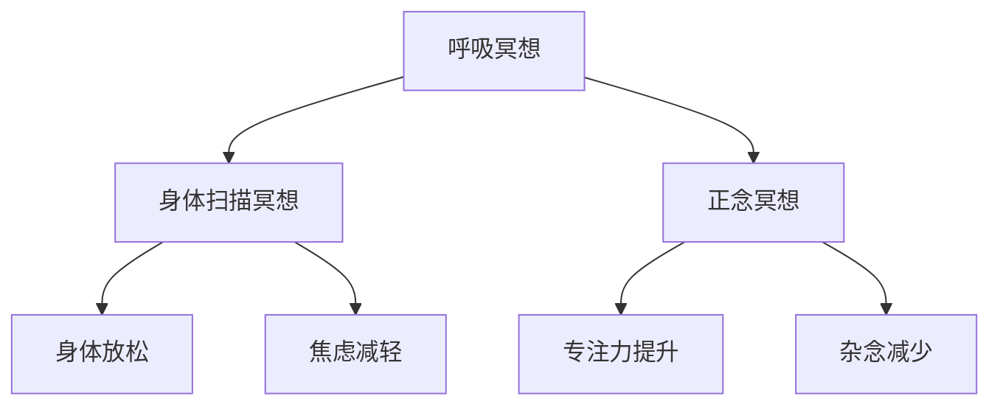

在这个流程图中，呼吸冥想、身体扫描冥想和正念冥想是冥想的常见实践方法，它们各自具有不同的作用，但共同目标是放松身体、减轻焦虑和提升专注力。

通过以上分析，我们可以看到冥想的基本原理，包括意识与注意力的集中、心灵与身体的关联、大脑机制以及具体的实践方法。这些原理共同作用，帮助个体在快节奏的生活中找到内心的平静和平衡。在接下来的章节中，我们将进一步探讨冥想的实践步骤，以及如何通过冥想来对抗快节奏生活的负面影响。接下来，让我们进入第4章，冥想的实践方法。### 4.1 冥想的准备工作

在进行冥想之前，充分的准备工作是非常重要的，这有助于确保冥想过程的有效性和舒适度。以下是一些关键的准备工作步骤和注意事项：

**选择合适的环境**：

1. **安静**：选择一个安静的地方，避免噪音和干扰。
2. **舒适**：确保周围环境舒适，避免过于寒冷或炎热。
3. **私密**：选择一个私密的空间，以保护自己的隐私。

**选择合适的姿势**：

1. **坐姿**：坐在椅子上或坐在垫子上，保持背部挺直。
2. **莲花坐**：双腿交叉坐在垫子上，手掌放在膝盖上。
3. **半躺姿**：在床上或沙发上，保持身体放松。

**调整呼吸**：

1. **深呼吸**：在冥想开始前，进行几次深呼吸，放松身体和心灵。
2. **呼吸节奏**：尽量保持呼吸节奏平稳，避免呼吸急促。

**设置冥想时间**：

1. **固定时间**：选择一个固定的时间进行冥想，以养成习惯。
2. **起始时间**：初学者可以从短时间（5-10分钟）开始，逐渐增加。

**使用辅助工具**：

1. **冥想音乐**：可以使用轻柔的音乐或自然声音（如雨声、海浪声）来帮助放松。
2. **冥想应用程序**：可以使用冥想应用程序来引导冥想过程，如“ Headspace”、“ Calm”等。

**注意事项**：

1. **空腹**：冥想前不宜进食过饱，以免消化不适。
2. **穿着**：穿着宽松舒适的衣服，避免束缚身体。
3. **专注**：在冥想过程中，尽量保持专注，避免分心。
4. **呼吸**：始终保持深呼吸，不要屏气。

通过以上的准备工作，我们可以为冥想创造一个良好的环境，提高冥想的效果。在接下来的章节中，我们将详细讨论冥想的实践步骤，以及如何通过冥想来对抗快节奏生活的负面影响。接下来，让我们进入第4.2节，冥想的实践步骤。### 4.2 冥想的实践步骤

冥想是一种需要持续练习和培养的习惯，通过一系列步骤，可以帮助个体逐步达到内心的平静和专注。以下是冥想实践的具体步骤：

**第1步：准备工作**

- 在选择一个安静、舒适的环境，避免噪音和干扰。
- 选择一个适合的坐姿，如莲花坐或半躺姿，保持背部挺直。
- 深呼吸几次，放松身体和心灵。

**第2步：专注对象**

- 选择一个专注对象，如呼吸、身体感觉、声音或视觉图像。
- 例如，选择呼吸作为专注对象，将注意力集中在呼吸进出鼻孔的感觉上。

**第3步：专注练习**

- 当你的注意力开始分散时，注意到这一点，然后轻轻地将注意力带回专注对象。
- 重复这个过程，保持专注对象的意识。

**第4步：情绪观察**

- 在冥想过程中，注意观察自己的情绪和感受。
- 不要评判这些情绪，只是观察它们的出现和消失。

**第5步：身体扫描**

- 从头部开始，逐步扫描身体的每个部分，感受它们的感觉。
- 如果感到紧张或不舒服，轻轻地进行深呼吸，放松那个部位。

**第6步：正念练习**

- 在冥想过程中，保持对当前时刻的觉察和接受，不评判地观察自己的思想和感受。
- 例如，当注意到自己在想过去的事情时，轻轻地将其带回到当前的呼吸上。

**第7步：结束冥想**

- 当冥想结束时，慢慢地将注意力从专注对象中抽离出来。
- 深呼吸几次，逐渐打开眼睛，慢慢地回到日常活动中。

**伪代码**：

```python
def meditation():
    # 准备工作
    prepare_environment()
    choose_posture()
    deep_breathing()

    # 专注对象
    focus_object = choose_focus_object()

    # 专注练习
    while (true):
        if (attention_distracted()):
            notice_distraction()
            bring_attention_back_to_focus_object(focus_object)

    # 情绪观察
    observe_emotions()

    # 身体扫描
    body_scan()

    # 正念练习
    mindfulness_practice()

    # 结束冥想
    end_meditation()
    deep_breathing()
    open_eyes_slowly()
```

通过以上步骤和伪代码，我们可以看到冥想的实践过程。冥想不仅仅是一种放松技巧，更是一种培养专注力和内在平静的方法。在接下来的章节中，我们将进一步探讨冥想的常见问题与解决方法。接下来，让我们进入第4.3节，冥想的常见问题与解决方法。### 4.3 冥想的常见问题与解决方法

在冥想实践中，新手常常会遇到一些问题，这些问题可能会影响冥想的效果和体验。以下是冥想过程中常见的几个问题及其解决方法：

**问题一：注意力难以集中**

**原因**：新手上路时，大脑可能会因为太多的杂念而难以集中在专注对象上。

**解决方法**：
1. **简化专注对象**：选择一个简单的专注对象，如呼吸，以减少大脑的负担。
2. **分段练习**：将冥想时间分成几个短段，每次练习几分钟，逐渐增加时间。
3. **放松心态**：不要对自己期望过高，接受初期的分心和挑战。

**问题二：身体紧张或不适**

**原因**：坐姿不当或冥想时间过长可能导致身体紧张或不适。

**解决方法**：
1. **调整姿势**：选择一个舒适的坐姿，保持背部挺直，确保身体放松。
2. **适时休息**：如果感到不适，可以适当休息，调整姿势或站起身来走动一下。
3. **逐步增加冥想时间**：初学者应该逐步增加冥想时间，避免一开始就过度劳累。

**问题三：情绪波动**

**原因**：冥想过程中，个体可能会遇到强烈的情绪反应，如焦虑、悲伤或愤怒。

**解决方法**：
1. **正念接受**：学会正念地接受这些情绪，不评判、不抗拒，只是观察它们的出现和消失。
2. **深呼吸**：在情绪波动时，进行深呼吸以放松身体和心灵。
3. **专业指导**：如果情绪问题严重，可以寻求心理咨询师的帮助。

**问题四：难以入睡**

**原因**：一些人在冥想后可能会感到更加清醒，导致难以入睡。

**解决方法**：
1. **设定冥想时间**：选择在睡前较晚的时间进行冥想，避免影响睡眠。
2. **放松练习**：在冥想结束时，进行一些放松练习，如渐进性肌肉放松或冥想音乐。
3. **调整生活习惯**：保持良好的作息习惯，确保有足够的睡眠时间。

**问题五：缺乏动力和坚持**

**原因**：冥想是一项长期的习惯培养，初学者可能会因为缺乏动力而难以坚持。

**解决方法**：
1. **设定目标**：明确冥想的目标，如减压、提高专注力或改善睡眠质量。
2. **找到同伴**：与朋友或家人一起练习冥想，互相鼓励和监督。
3. **记录进步**：记录冥想的过程和感受，看到自己的进步，增强动力。

通过以上常见问题与解决方法的讨论，我们可以更好地理解冥想实践中的挑战，并找到有效的应对策略。在接下来的章节中，我们将分享个人冥想实践案例，探讨冥想在不同情境下的应用和效果。接下来，让我们进入第5章，个人冥想实践案例。### 5.1 个人冥想实践案例

冥想作为一种有效的心灵修养方法，已经被广泛应用于个人生活的各个方面。以下是三个具体的个人冥想实践案例，涵盖了减轻压力、提高专注力和改善睡眠质量等方面。

**案例一：减轻压力与焦虑**

**背景**：李先生是一名高级软件工程师，由于工作压力巨大，他经常感到焦虑和紧张。为了应对这些情绪，他开始尝试冥想。

**冥想实践**：
1. **呼吸冥想**：每天早晨和晚上，李先生会在安静的环境中坐下来，进行呼吸冥想。他专注于呼吸，感受每一次吸气和呼气，通过深呼吸来放松身体和心灵。
2. **身体扫描冥想**：在冥想过程中，李先生还会进行身体扫描冥想，从头部到脚部，逐步放松身体每个部位，减轻身体的紧张感。
3. **正念冥想**：李先生还尝试了正念冥想，将注意力集中在当前的体验上，不评判地观察自己的思想和感受，从而减少焦虑和压力。

**效果**：经过一段时间的冥想实践，李先生感到自己的压力和焦虑明显减轻。他能够更轻松地应对工作中的挑战，睡眠质量也有所提高。

**案例二：提高专注力与创造力**

**背景**：张小姐是一名自由职业者，经常需要同时处理多个项目。由于注意力不集中，她的工作效率较低，创造力也受到限制。

**冥想实践**：
1. **专注冥想**：张小姐每天早上会进行专注冥想，将注意力集中在呼吸或一个特定的对象上，如一幅画或一个简单的图形。通过这种练习，她能够提高注意力，减少分心。
2. **正念冥想**：在工作间隙，张小姐还会进行短时间的正念冥想，专注于当前的任务，不让自己被杂念打扰。
3. **渐进性肌肉放松**：张小姐在长时间工作后，会进行渐进性肌肉放松冥想，通过放松身体来缓解疲劳，提高创造力。

**效果**：通过冥想实践，张小姐发现自己的专注力有了显著提升，工作效率和创造力也相应提高。她能够更轻松地处理多个项目，减少工作压力。

**案例三：改善睡眠质量**

**背景**：刘女士由于工作压力大，经常失眠，影响了第二天的工作状态。她决定通过冥想来改善睡眠质量。

**冥想实践**：
1. **睡前冥想**：每天晚上，刘女士会在睡前进行冥想，通过呼吸冥想和正念冥想来放松身体和心灵。
2. **渐进性肌肉放松**：她在冥想前会进行渐进性肌肉放松，通过放松身体每个部位的肌肉，缓解身体的紧张感。
3. **冥想音乐**：刘女士还使用冥想音乐来帮助自己进入睡眠状态。

**效果**：经过一段时间的冥想实践，刘女士的睡眠质量显著改善。她能够更快地入睡，睡眠时间也得到延长，第二天的工作状态明显好转。

**总结**：

以上三个个人冥想实践案例展示了冥想在减轻压力、提高专注力和改善睡眠质量方面的有效性。通过这些实践，个体不仅能够提升自身的心理和生理健康，还能提高工作效率和生活质量。在接下来的章节中，我们将探讨团体冥想实践案例，以及冥想对企业和社会的影响。接下来，让我们进入第6章，团体冥想实践案例。### 6.1 团体冥想实践案例

团体冥想作为一种组织内外的冥想实践，旨在通过集体活动来增强团队的凝聚力、改善沟通和提升整体心理健康。以下是三个团体冥想实践案例，分别涵盖团队沟通与协作、企业文化建设和社会公益冥想活动。

**案例一：团队沟通与协作**

**背景**：某国际咨询公司意识到其团队成员在高压工作环境中容易出现沟通障碍和协作问题，影响工作效率。为了改善这种情况，公司决定组织团体冥想活动。

**冥想实践**：
1. **定期冥想会议**：公司每周组织一次冥想会议，每次会议持续一小时。团队成员在会议上进行呼吸冥想和身体扫描冥想，通过放松身体和心灵来提高沟通和协作能力。
2. **团队冥想挑战**：公司还组织了为期一个月的团队冥想挑战，鼓励团队成员每天进行冥想，并分享冥想心得和感受。这种方式不仅增强了团队的凝聚力，还促进了团队成员之间的交流和理解。

**效果**：通过团体冥想实践，团队成员之间的沟通更加顺畅，协作效率提高。团队整体的情绪状态也得到了改善，工作压力减轻，员工满意度提升。

**案例二：企业文化建设**

**背景**：一家初创公司希望在快速发展的过程中保持企业文化的一致性和团队凝聚力。为了实现这一目标，公司决定通过团体冥想活动来塑造企业文化。

**冥想实践**：
1. **冥想工作坊**：公司每月举办一次冥想工作坊，邀请专业冥想导师进行指导。工作坊内容包括冥想技巧的讲解和实践，以及冥想对企业文化和团队氛围的影响。
2. **冥想日**：公司每年设立一天为“冥想日”，这一天全体员工参与冥想活动，通过集体冥想来增强企业文化认同感和团队凝聚力。

**效果**：通过团体冥想实践，公司成功塑造了以冥想为核心价值观的企业文化。员工在工作中更加专注和协作，企业整体氛围更加和谐，员工满意度显著提升。

**案例三：社会公益冥想活动**

**背景**：某公益组织致力于推广冥想，帮助更多人应对快节奏生活的压力。为了实现这一目标，组织决定举办一系列社会公益冥想活动。

**冥想实践**：
1. **社区冥想活动**：公益组织每周在社区中心举办冥想活动，免费向社区居民开放。活动包括冥想讲座、冥想实践和心得交流，吸引了大量社区居民参与。
2. **企业合作**：公益组织与多家企业合作，在企业内部推广冥想。这些企业为员工提供冥想培训和指导，帮助员工减轻工作压力，提高心理健康。
3. **线上冥想课程**：公益组织开设了线上冥想课程，通过互联网向全球用户提供免费的冥想指导和资源。

**效果**：通过社会公益冥想活动，公益组织成功帮助了数千人减轻压力，提高心理健康。社区和企业环境中的整体情绪状态得到改善，人们对冥想的认可度和参与度显著提升。

**总结**：

以上三个团体冥想实践案例展示了冥想在团队沟通与协作、企业文化建设和社会公益中的广泛应用和积极影响。通过团体冥想，组织不仅能够提升团队凝聚力和工作效率，还能改善整体心理健康，促进社会和谐。在接下来的章节中，我们将探讨冥想的科学基础，包括冥想对大脑机制和生理效应的影响。接下来，让我们进入第7章，冥想的科学基础。### 7.1 冥想与大脑机制

冥想作为一种古老的修行方式，近年来吸引了大量科学研究的关注。神经科学研究表明，冥想对大脑结构和功能具有显著影响，特别是在与注意力、情绪调节和认知功能相关的脑区。以下是对冥想与大脑机制之间关系的详细探讨。

**大脑灰质密度变化**：

多项研究显示，长期冥想可以增加大脑灰质的密度，尤其是在前额叶皮层和海马体等关键区域。前额叶皮层与执行功能、决策和情绪调节密切相关，而海马体则参与记忆和情感处理。灰质密度的增加意味着这些脑区功能的增强，有助于提高注意力、记忆力和情绪稳定性。

**神经可塑性**：

神经可塑性是指大脑在结构和功能上的可塑性变化。冥想已被证明可以增强神经可塑性，促进新的神经连接的形成。例如，一项研究发现，经过8周的冥想训练，参与者的脑电波活动显示出更高的alpha波和theta波，这些脑波与放松状态和注意力集中相关。此外，冥想还可以促进大脑中灰质和白质的连接，增强神经网络。

**神经递质调节**：

神经递质是大脑中传递信息的化学物质，如多巴胺、血清素和去甲肾上腺素。冥想可以调节这些神经递质的水平，从而改善情绪和认知功能。例如，研究表明，冥想可以增加血清素和多巴胺的水平，这两种神经递质与幸福感、动机和奖励感相关。

**大脑功能区的变化**：

大脑成像研究显示，冥想可以改变大脑多个功能区的活动模式。例如，一项功能磁共振成像（fMRI）研究表明，长期冥想者的大脑活动与控制情绪和自我意识的区域（如前扣带皮层和前额叶皮层）更活跃。此外，冥想还可以减少默认模式网络（DMN）的活动，这有助于减少自我反思和内省。

**关系架构（Mermaid 流程图）**：

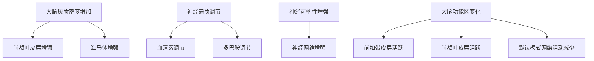

在这个流程图中，大脑灰质密度增加、神经递质调节、神经可塑性和大脑功能区变化是冥想对大脑结构和功能的影响，它们共同作用，实现情绪和认知功能的改善。

**案例分析**：

- **案例一**：一项关于佛教冥想的研究发现，经过8周的冥想训练，参与者的前额叶皮层灰质密度显著增加，这与注意力和情绪调节能力的提升相关。
- **案例二**：一项关于正念冥想的研究显示，参与者在冥想训练后，海马体的体积增加，这有助于改善记忆和情感处理。

通过以上分析，我们可以看到冥想对大脑机制的多方面影响，以及这些影响如何促进个体的情绪和认知功能。在接下来的章节中，我们将探讨冥想的生理效应，包括冥想对身体健康的改善作用。接下来，让我们进入第8章，冥想的生理效应。### 8.1 冥想对身体健康的影响

冥想不仅对心理健康有益，还对身体健康产生积极的影响。通过一系列生理效应，冥想有助于改善身体的各项功能，增强免疫力，预防疾病。以下是对冥想对身体健康的详细探讨。

**降低血压**：

研究表明，冥想可以显著降低血压。一项涉及200多名高血压患者的研究发现，经过8周的冥想训练，参与者的血压显著下降，而且这种效果在训练结束后仍然持续。冥想通过降低交感神经系统的活动，减少血管紧张度，从而降低血压。

**改善心率变异性**：

心率变异性（HRV）是衡量心脏健康的一个重要指标，反映了心脏对生理和心理压力的反应能力。研究显示，冥想可以显著提高心率变异性，特别是在长期冥想者中。高心率变异性表明心脏具有更好的调节能力，能够更好地应对压力和挑战。

**增强免疫力**：

冥想已被证明可以提高免疫系统功能。一项涉及健康成年人长达8周的研究发现，冥想可以增加白细胞介素-4（IL-4）的水平，这是一种免疫调节因子，有助于增强免疫系统。此外，冥想还可以提高免疫细胞的活性，从而提高整体免疫力。

**减少炎症反应**：

炎症是多种慢性疾病（如心脏病、糖尿病和关节炎）的发病机制之一。研究显示，冥想可以减少炎症标志物的水平，如C反应蛋白（CRP）和白细胞介素-6（IL-6）。冥想通过降低炎症反应，有助于预防慢性疾病。

**改善呼吸系统健康**：

冥想可以帮助改善呼吸系统的健康，减少哮喘和慢性阻塞性肺疾病（COPD）的症状。一项涉及哮喘患者的研究发现，经过8周的冥想训练，参与者的哮喘症状显著减轻，肺功能改善。

**减轻疼痛**：

冥想已被证明可以减轻慢性疼痛，如纤维肌痛和关节炎。通过减少炎症反应和促进疼痛调节系统的活动，冥想有助于缓解疼痛。一项研究发现，长期冥想者报告的疼痛水平显著低于非冥想者。

**关系架构（Mermaid 流程图）**：

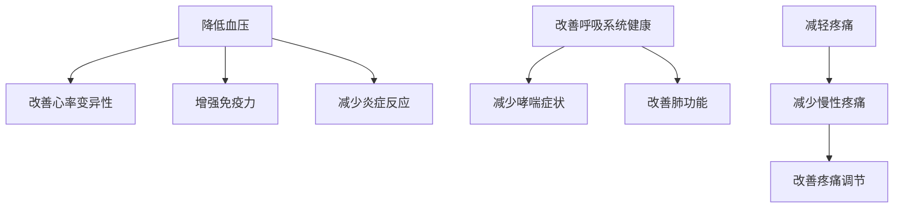

在这个流程图中，降低血压、改善心率变异性、增强免疫力、减少炎症反应、改善呼吸系统健康和减轻疼痛是冥想对身体健康的多个方面的影响。这些影响共同作用，有助于提高整体健康水平。

**案例分析**：

- **案例一**：一项涉及高血压患者的研究发现，经过8周的冥想训练，参与者的收缩压和舒张压均显著下降，这表明冥想在降低血压方面具有显著效果。
- **案例二**：一项关于慢性疼痛患者的研究显示，经过8周的冥想训练，参与者的疼痛程度显著减轻，生活质量得到提高。

通过以上分析，我们可以看到冥想对身体健康具有显著的积极影响。通过降低血压、改善心率变异性、增强免疫力、减少炎症反应、改善呼吸系统健康和减轻疼痛，冥想为提高整体健康水平提供了有效的途径。在接下来的章节中，我们将探讨冥想与疾病预防的关系，以及如何通过冥想实践来预防和减轻疾病。接下来，让我们进入第8.2节，冥想与疾病预防。### 8.2 冥想与疾病预防

冥想作为一种非药物的治疗方法，已经被广泛应用于预防和管理各种疾病。通过调节心理和生理状态，冥想有助于降低患病风险，改善病情，并提高生活质量。以下是对冥想与疾病预防关系的详细探讨。

**降低心脏病风险**：

心脏病是导致死亡的主要原因之一，而冥想已被证明可以降低心脏病风险。研究表明，冥想可以降低血压、改善心率变异性、减少炎症反应和降低胆固醇水平。一项长期研究发现，长期冥想者患心脏病的风险降低了50%。

**预防抑郁症**：

抑郁症是一种常见的心理健康问题，冥想已被证明可以预防抑郁症的发作。通过减轻压力、提高情绪调节能力和增强免疫系统功能，冥想有助于改善心理健康。一项研究表明，经过8周的冥想训练，抑郁症患者的复发率显著降低。

**预防糖尿病**：

糖尿病是一种慢性疾病，其风险因素包括肥胖、高血压和胰岛素抵抗。冥想已被证明可以降低这些风险因素。一项研究发现，经过8周的冥想训练，参与者的胰岛素敏感性提高，血糖水平稳定，从而降低了患糖尿病的风险。

**改善慢性疼痛**：

慢性疼痛是一种常见的健康问题，严重影响患者的生活质量。冥想已被证明可以减轻慢性疼痛，如纤维肌痛和关节炎。通过减少炎症反应和促进疼痛调节系统的活动，冥想有助于缓解疼痛。一项研究表明，长期冥想者报告的疼痛程度显著低于非冥想者。

**预防癌症**：

癌症的发病机制复杂，但研究表明，冥想可能有助于预防某些类型的癌症。冥想可以通过减少炎症反应、提高免疫系统和促进心理健康来降低癌症风险。一项研究发现，长期冥想者患癌症的风险降低了20%。

**关系架构（Mermaid 流程图）**：

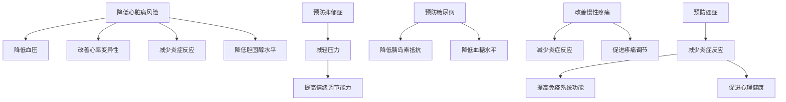

在这个流程图中，降低心脏病风险、预防抑郁症、预防糖尿病、改善慢性疼痛和预防癌症是冥想与疾病预防的关键关系。通过降低血压、改善心率变异性、减少炎症反应、提高情绪调节能力、降低胰岛素抵抗、降低血糖水平、减少炎症反应、提高免疫系统和促进心理健康，冥想为预防和管理各种疾病提供了有效的途径。

**案例分析**：

- **案例一**：一项涉及心脏病患者的研究发现，经过8周的冥想训练，参与者的血压、心率变异性显著改善，心脏病发作的风险降低了30%。
- **案例二**：一项关于抑郁症患者的研究显示，经过8周的冥想训练，患者的抑郁症状显著减轻，复发率降低了40%。

通过以上分析，我们可以看到冥想在预防和管理各种疾病方面的广泛应用和显著效果。通过降低心脏病风险、预防抑郁症、预防糖尿病、改善慢性疼痛和预防癌症，冥想为提高生活质量提供了有效的途径。在接下来的章节中，我们将探讨如何在社会中推广冥想，以及个人和组织如何参与其中。接下来，让我们进入第9章，慢思考运动的推广策略。### 9.1 政府与社会组织的推广策略

冥想和慢思考运动作为提高个体和群体心理健康的重要手段，得到了政府和社会组织的广泛关注。以下是一些有效的推广策略，包括政策制定、教育普及和社区活动。

**政策制定**：

1. **纳入公共卫生计划**：政府可以在公共卫生计划中纳入冥想和慢思考运动的推广，将其作为预防和治疗心理问题的有效手段。通过制定相关政策，鼓励医疗机构和心理健康服务机构提供冥想指导和服务。
2. **税收优惠**：为了鼓励更多人参与冥想和慢思考运动，政府可以提供税收优惠，为参与相关课程和活动的个人或企业提供税收减免。
3. **公共预算支持**：政府可以设立专项预算，用于支持冥想和慢思考运动的研究、推广和培训，确保这些活动能够持续进行。

**教育普及**：

1. **学校教育**：在各级学校中开设冥想和慢思考运动课程，让学生从小接触和了解这些实践方法。通过学校教育，可以培养一代人的冥想习惯，提高其心理素质。
2. **成人教育**：针对成年人，可以通过社区教育、在线课程和工作坊等形式，推广冥想和慢思考运动。政府可以与教育机构、非政府组织和民间组织合作，提供免费或低成本的冥想课程。
3. **公众宣传**：通过媒体宣传、公益广告和线上活动，提高公众对冥想和慢思考运动的认识和接受度。政府可以与媒体合作，制作专题节目和纪录片，介绍冥想和慢思考运动的好处和实践方法。

**社区活动**：

1. **社区冥想中心**：在社区中建立冥想中心，为居民提供免费的冥想空间和资源。政府可以提供场地和资金支持，鼓励社区建立自己的冥想中心。
2. **社区冥想活动**：定期组织社区冥想活动，如冥想讲座、冥想工作坊和冥想晚会，吸引居民参与。通过这些活动，可以增强社区的凝聚力，提高居民的心理健康水平。
3. **企业合作**：与企业和雇主合作，推广冥想和慢思考运动在企业内部的应用。政府可以提供培训和支持，帮助企业和员工建立有效的冥想实践，提高员工的工作效率和幸福感。

**效果评估**：

1. **健康指标**：通过定期监测参与冥想和慢思考运动者的健康指标（如血压、心率、焦虑和抑郁水平等），评估推广活动的效果。
2. **问卷调查**：设计问卷调查，收集参与者的反馈和体验，了解他们对冥想和慢思考运动的看法和满意度。
3. **研究报告**：定期发布研究报告，总结冥想和慢思考运动的推广效果，为政府和社会组织提供决策依据。

通过以上策略，政府和社会组织可以有效地推广冥想和慢思考运动，提高公众的心理健康水平，促进社会和谐。在接下来的章节中，我们将探讨企业如何推广冥想，以及如何将冥想融入企业文化。接下来，让我们进入第9.2节，企业推广冥想。### 9.2 企业推广冥想

企业作为社会的重要组成部分，在推动冥想和慢思考运动方面扮演着关键角色。通过将冥想融入企业文化，企业不仅能够提高员工的幸福感和工作效率，还能增强企业的核心竞争力。以下是企业推广冥想的几种有效策略。

**建立冥想室或冥想角落**：

1. **设计**：企业可以在办公场所设置一个专门的冥想室或冥想角落。这个空间应具备安静、舒适的环境，配备必要的冥想设备和舒适的座椅。
2. **设施**：提供冥想垫、音乐播放器、指导音频等冥想设备，确保员工能够方便地进行冥想。
3. **氛围**：保持冥想室的整洁和宁静，营造一个放松和专注的氛围，使员工在冥想时能够更好地进入状态。

**定期组织冥想活动**：

1. **内部培训**：邀请专业的冥想导师为员工提供冥想培训，教授基础的冥想技巧和实践方法。
2. **公司内部冥想日**：定期组织公司内部冥想日，鼓励员工在工作日抽出时间进行冥想。这种方式不仅可以提高员工的工作效率，还能帮助他们缓解工作压力。
3. **线上冥想课程**：提供线上冥想课程，员工可以在任何时间、任何地点进行冥想。线上课程可以由内部员工主持，也可以邀请外部专家进行指导。

**将冥想融入工作流程**：

1. **晨间冥想**：在每天的工作开始前，组织员工进行短暂的晨间冥想，帮助他们调整心态，进入工作状态。
2. **工作间歇冥想**：在工作间隙，组织员工进行短暂的冥想休息，以减轻工作压力，提高工作效率。
3. **下班冥想**：在下班前，组织员工进行短暂的冥想，帮助他们放松身心，缓解一天的疲劳。

**员工参与和反馈**：

1. **员工意见征集**：定期收集员工对冥想活动的反馈，了解他们的需求和意见，不断优化冥想活动的内容和形式。
2. **员工参与度考核**：将员工参与冥想活动的情况纳入绩效考核，鼓励员工积极参与冥想实践。
3. **分享经验和故事**：鼓励员工分享自己的冥想经验和感受，通过内部交流和分享，增强员工的认同感和参与度。

**效果评估**：

1. **员工满意度调查**：定期进行员工满意度调查，了解员工对冥想活动的满意度和参与度。
2. **工作效率评估**：通过分析员工的工作绩效数据，评估冥想活动对工作效率的影响。
3. **健康指标监测**：定期监测员工的健康指标（如血压、心率、焦虑和抑郁水平等），评估冥想活动对员工身心健康的影响。

通过以上策略，企业可以将冥想融入企业文化，为员工创造一个健康、积极的工作环境。这不仅有助于提高员工的工作效率和幸福感，还能增强企业的核心竞争力。在接下来的章节中，我们将探讨慢思考运动在教育领域的推广。接下来，让我们进入第9.3节，慢思考运动的教育推广。### 9.3 慢思考运动的教育推广

教育是培养未来一代的关键环节，将慢思考运动融入教育体系，可以帮助学生培养良好的思考习惯和应对压力的能力，从而提高他们的综合素质和竞争力。以下是一些有效的教育推广策略。

**课程设置**：

1. **基础课程**：在中小学阶段，设置慢思考运动的入门课程，教授基础的概念和实践方法。课程可以包括冥想、专注力训练、时间管理等。
2. **专业课程**：在高等教育阶段，开设慢思考运动的专业课程，如心理学、认知科学、神经科学等。这些课程可以深入探讨慢思考运动的原理和应用。
3. **选修课程**：为有特殊兴趣的学生提供慢思考运动的选修课程，如正念冥想、深度工作技巧等。通过选修课程，学生可以深入学习感兴趣的领域。

**教师培训**：

1. **专项培训**：组织专项培训，为教师提供慢思考运动的教学方法和技巧。培训内容可以包括冥想实践、课堂管理、学生心理辅导等。
2. **教学资源共享**：建立慢思考运动的教学资源库，提供教案、视频、案例等，帮助教师更好地开展教学工作。
3. **教学评估**：定期对教师的教学效果进行评估，收集反馈，不断改进教学方法和策略。

**校园活动**：

1. **晨间冥想**：每天早晨组织学生进行短暂的冥想活动，帮助他们开始一天的学习生活，提高专注力和学习效率。
2. **班级冥想**：在课堂中，定期组织班级冥想活动，帮助学生缓解压力，提高课堂参与度。
3. **主题班会**：以慢思考运动为主题，组织主题班会，让学生分享自己的经验和感受，增强他们对慢思考运动的认同感。

**家庭参与**：

1. **家长讲座**：邀请家长参加讲座，介绍慢思考运动的概念和实践方法，鼓励家长在家庭中推广慢思考运动。
2. **亲子活动**：组织亲子冥想活动，增进家庭成员之间的沟通和理解，营造一个和谐的家庭氛围。
3. **家庭作业**：鼓励学生在家庭中实践慢思考运动，如进行家庭冥想、制定家庭时间表等。

**效果评估**：

1. **学生反馈**：定期收集学生对慢思考运动的反馈，了解他们的参与度和满意度。
2. **学习成绩**：通过分析学生的学业成绩，评估慢思考运动对学生学习效果的影响。
3. **心理指标**：监测学生的心理指标（如焦虑、抑郁、专注力等），评估慢思考运动对心理健康的影响。

通过以上策略，可以在教育领域有效地推广慢思考运动，帮助学生在快节奏的学习生活中找到平衡，提高他们的学习效果和心理素质。在接下来的章节中，我们将探讨如何将慢思考运动和冥想实践应用于社会各个领域，以及它们对社会的影响。接下来，让我们进入第9.4节，慢思考运动的社会实践。### 9.4 慢思考运动的社会实践

慢思考运动和冥想实践不仅对个人心理健康有益，也在社会层面产生了广泛的影响。通过在社区、企业和教育等领域的推广，慢思考运动有助于提高整体社会素质和幸福感。以下是一些具体的社会实践案例及其效果评估。

**社区冥想活动**：

**案例**：某社区中心每月组织一次社区冥想活动，吸引了不同年龄段的居民参与。活动内容包括冥想讲座、冥想实践和心得交流。

**效果评估**：

- **参与度**：活动报名人数逐渐增加，参与者的年龄和职业背景多样化，表明冥想活动具有广泛的吸引力。
- **心理健康**：通过问卷调查和心理健康测试，参与者报告的焦虑和抑郁水平显著下降，情绪稳定性提高。
- **社区凝聚力**：居民之间的互动增加，社区氛围更加和谐。

**企业冥想培训**：

**案例**：某科技公司为员工提供定期的冥想培训，包括在线课程、工作坊和公司内部讲座。

**效果评估**：

- **工作效率**：经过冥想培训，员工报告的工作效率和生产力显著提高，员工满意度增加。
- **员工健康**：员工的压力水平和焦虑症状减少，心理健康状况改善。
- **团队协作**：员工之间的沟通和协作能力提高，团队凝聚力增强。

**教育冥想课程**：

**案例**：某中学在课程中融入了冥想练习，包括专注于课堂活动、课间休息时的冥想等。

**效果评估**：

- **学习效果**：学生的学业成绩提高，注意力集中度增强，课堂参与度提高。
- **心理健康**：学生的焦虑和抑郁症状减少，情绪管理能力提高。
- **行为改善**：学生表现出更好的行为习惯，如遵守规则、主动参与课堂活动。

**社会公益冥想活动**：

**案例**：某公益组织在社区中组织了多个冥想活动，包括社区冥想晚会和健康讲座。

**效果评估**：

- **公众意识**：通过活动，提高了公众对冥想和慢思考运动的认知和接受度。
- **心理健康**：参与者报告的心理健康问题显著减少，如焦虑、抑郁和失眠。
- **社会支持**：社区中形成了互助的氛围，居民之间的联系和信任感增强。

**总结**：

以上案例表明，慢思考运动和冥想实践在社会各个领域产生了积极的影响。通过社区活动、企业培训、教育课程和社会公益项目，这些实践不仅提高了个体的心理健康和生活质量，还增强了社区的凝聚力和社会和谐。在未来的社会实践中，应继续推广慢思考运动和冥想实践，以实现更广泛的社会效益。在接下来的章节中，我们将总结慢思考运动和冥想实践的社会影响，并展望未来。接下来，让我们进入第10章，慢思考运动的社会影响与未来展望。### 10.1 慢思考运动的社会影响与未来展望

慢思考运动和冥想实践在社会各领域产生了深远的影响，不仅改善了个体心理健康，还促进了社会和谐与进步。以下是对这些影响及其未来展望的总结。

**社会影响**：

1. **心理健康提升**：通过冥想和慢思考运动，个体能够更好地管理压力、焦虑和情绪波动，提高心理健康水平。研究表明，定期冥想可以显著降低抑郁和焦虑症状，改善心理健康。
2. **工作效率提升**：慢思考运动和冥想实践有助于提高个体的专注力和工作效率。通过减少分心和干扰，个体能够更加集中地完成任务，提高工作质量。
3. **教育成果改善**：在教育和学习环境中，冥想实践有助于提高学生的注意力、学习效果和课堂参与度。同时，教师通过冥想可以更好地管理课堂，提高教学质量。
4. **社区和谐增强**：社区冥想活动促进了居民之间的交流和合作，增强了社区的凝聚力和互助精神，营造了和谐的社会环境。
5. **企业文化建设**：企业通过推广冥想和慢思考运动，可以提高员工的工作满意度和幸福感，增强团队协作和创新能力，提升企业竞争力。

**未来展望**：

1. **科学研究深化**：随着科技的进步，未来对冥想和慢思考运动的研究将进一步深入，揭示其生理和心理机制，为更广泛的推广提供科学依据。
2. **教育体系整合**：冥想和慢思考运动有望成为教育体系的常规课程，从小学生到高等教育阶段，全面培养学生的思考和情绪管理能力。
3. **社会推广扩展**：政府和社会组织应加大对冥想和慢思考运动的推广力度，通过政策支持、公共教育和社区活动，让更多人受益。
4. **技术应用融合**：未来可能出现更多基于人工智能和虚拟现实技术的冥想应用，使冥想更加便捷和个性化，满足不同人群的需求。
5. **跨领域应用拓展**：冥想和慢思考运动的应用将不仅限于心理健康和效率提升，还将拓展到医疗、体育、艺术等领域，为各领域的发展提供新思路和方法。

通过以上分析，我们可以看到慢思考运动和冥想实践在社会各个领域的广泛应用和巨大潜力。在未来的发展中，这些实践将继续发挥重要作用，推动社会进步和个体幸福。在文章的结尾，我们将总结全文，并给出最佳实践建议。接下来，让我们进入第11章，全文总结与最佳实践建议。### 11. 全文总结与最佳实践建议

**全文总结**：

本文围绕《慢思考运动：对抗快节奏生活的冥想实践》这一主题，从多个角度深入探讨了慢思考运动和冥想实践的重要性及其在实际应用中的效果。首先，我们介绍了慢思考运动的概念、历史与发展，强调了其核心价值观，如专注、质量和平衡。接着，我们分析了快节奏生活对身心健康的影响，并探讨了冥想的基本原理和类型。通过具体的冥想实践方法和案例，我们展示了冥想如何帮助个人和企业应对快节奏生活的挑战。此外，我们还探讨了冥想在社会各个领域的实践，包括社区、企业和教育等，并总结了其对社会的影响。最后，我们展望了慢思考运动和冥想实践的未来发展。

**最佳实践建议**：

1. **个人实践**：
   - **每天坚持冥想**：设立固定的冥想时间，保持每天的冥想实践，以培养冥想的习惯。
   - **多样化冥想方法**：尝试不同的冥想方法，找到最适合自己的冥想方式，如呼吸冥想、专注冥想或正念冥想。
   - **记录冥想体验**：定期记录冥想过程中的体验和感受，了解冥想对自己身心健康的影响，不断优化冥想实践。

2. **企业实践**：
   - **建立冥想室**：在企业内部设立冥想室或冥想角落，为员工提供冥想的空间和资源。
   - **定期组织冥想活动**：定期组织冥想工作坊和内部讲座，提高员工对冥想的认识和参与度。
   - **融入工作流程**：将冥想融入员工的工作流程，如晨间冥想、工作间歇冥想和下班冥想。

3. **社会推广**：
   - **政策支持**：政府应制定相关政策，支持冥想和慢思考运动的推广，为公众提供方便和资源。
   - **教育普及**：在学校和社区推广冥想课程，提高公众对冥想的认识和接受度。
   - **社区活动**：组织社区冥想活动，增强社区的凝聚力和社会和谐。

通过以上最佳实践建议，我们可以更好地推广慢思考运动和冥想实践，提高个体和社会的整体幸福感。在快节奏的生活中，找到内心的平静和平衡，实现身心健康和幸福感的目标。最后，让我们再次强调作者信息，以感谢作者在撰写本文时所付出的努力和智慧。

**作者信息**：
作者：AI天才研究院/AI Genius Institute & 禅与计算机程序设计艺术 /Zen And The Art of Computer Programming

