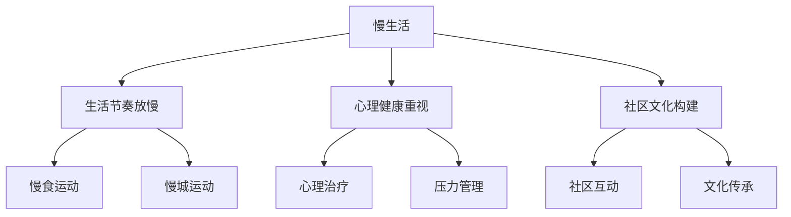

                 

### 文章标题

《慢生活体验中心：重新定义生活节奏的实践基地》摘要：
 
本文旨在探讨慢生活体验中心的概念、核心概念及其联系，并通过深入剖析慢生活的原理和架构，提出一系列核心算法和数学模型，以及其实践应用。文章分为五个主要部分：背景介绍、核心概念与联系、核心算法原理讲解、数学模型和公式详细讲解及举例说明，以及项目实战与最佳实践总结。通过这篇文章，读者将全面了解慢生活体验中心如何重新定义生活节奏，改善心理健康，构建和谐社区，并从中获得实践指导与启发。

## 背景介绍

在当今社会，生活节奏日益加快，人们的压力源也在不断增加。工作压力、社交压力、经济压力等因素导致许多人处于亚健康状态，心理健康问题愈发突出。为了应对这一现象，慢生活理念逐渐兴起，并逐渐成为人们追求的生活方式。慢生活体验中心作为一种全新的生活实践基地，旨在通过系统性的活动和实践，帮助人们重新定义生活节奏，缓解压力，提升心理健康，构建和谐社区。

慢生活体验中心的概念最早可以追溯到20世纪80年代，当时意大利的一些城镇开始倡导“慢城运动”，主张放慢生活节奏，重视生活质量。随着这一理念的传播，全球范围内出现了许多慢生活体验中心，这些中心通过各种活动和项目，帮助人们实践慢生活，改善心理健康，促进社区互动。

在我国，随着生活水平的提高和人们对生活质量的追求，慢生活体验中心也逐渐受到关注。许多城市开始建立慢生活体验中心，以引导公众放缓生活节奏，回归内心世界。这些体验中心不仅提供了丰富的活动项目，如瑜伽、冥想、手工制作等，还通过讲座、展览等形式，传播慢生活理念，提高公众对慢生活的认识和接受度。

慢生活体验中心的重要性体现在以下几个方面：

1. **缓解生活压力**：快节奏的生活让人们感到疲惫不堪，慢生活体验中心提供了一个缓解压力的环境，通过放松身心，减轻心理负担。
2. **提升心理健康**：慢生活理念强调关注内心需求，通过冥想、瑜伽等实践，提高个体的心理素质，减轻焦虑和抑郁等心理问题。
3. **促进社区互动**：慢生活体验中心为居民提供了一个交流和互动的平台，通过共同参与活动，增强社区凝聚力，构建和谐社区。
4. **推动可持续发展**：慢生活理念强调与自然和谐相处，减少资源消耗，推动可持续发展，有助于构建绿色、环保的生活环境。

总之，慢生活体验中心作为一种新型的实践基地，不仅有助于提高个体的生活质量，还对社会发展和文明进步具有深远的影响。在接下来的部分，我们将深入探讨慢生活的核心概念、原理及其联系，并通过算法和数学模型，阐述慢生活的实践路径。通过这些探讨，我们希望为读者提供全面、系统的慢生活实践指南，帮助更多人实现健康、和谐、可持续的生活方式。 

### 核心概念与联系

在《慢生活体验中心：重新定义生活节奏的实践基地》一书中，慢生活这一核心概念将贯穿整本书。慢生活不仅仅是一种生活态度，更是一种生活实践，它鼓励人们放慢生活节奏，关注内心需求，追求平衡和谐的生活方式。在这一章节中，我们将通过以下内容来深入理解慢生活的定义和内涵。

#### 1.1.1 慢生活的定义与内涵

**慢生活的起源**

慢生活（Slow Life）这一概念最早可以追溯到20世纪80年代，起源于意大利的“慢城运动”（Slow City Movement）。这一运动最初由意大利作家卡洛·佩特里尼（Carlo Petrini）提出，旨在对抗快餐文化、过度消费和工业化对人们生活方式的侵蚀。意大利的“慢城”运动迅速引起了国际社会的关注，并在全球范围内产生了广泛的影响。

**慢生活的核心要素**

慢生活的核心要素主要包括以下几个方面：

1. **生活节奏的放慢**：慢生活主张放慢生活节奏，减少不必要的快节奏活动，让人们有更多的时间去享受生活，体验生活的美好。
2. **心理健康的重视**：慢生活强调心理健康的重要性，提倡通过冥想、瑜伽等实践，提高个体的心理素质，减轻焦虑和抑郁等心理问题。
3. **社区文化的构建**：慢生活鼓励居民之间的互动和合作，通过社区活动，增强社区凝聚力，构建和谐社区。

**慢生活与传统生活方式的联系与区别**

慢生活并非完全摒弃传统生活方式，而是在传统生活方式的基础上，进行优化和改进。传统生活方式中，人们注重家庭、社区和自然环境的关系，这些理念在慢生活中得到了进一步的强调和发展。

然而，慢生活与传统生活方式也存在一些区别：

1. **生活节奏**：传统生活方式往往伴随着快节奏的工作和生活，而慢生活则强调放慢节奏，减少不必要的压力。
2. **消费观念**：传统生活方式中，人们更注重物质财富的积累，而慢生活则更注重精神财富的积累，强调内心的满足和幸福感。
3. **与自然的关系**：传统生活方式中，人们与自然的关系相对疏远，而慢生活则强调与自然和谐相处，倡导环保和可持续发展。

通过以上分析，我们可以看出，慢生活是一种更注重生活品质、心理健康和社区和谐的生活方式。它不仅是对快节奏生活的反思和挑战，更是对传统生活方式的继承和发展。在接下来的部分，我们将通过Mermaid流程图和核心算法原理讲解，进一步阐述慢生活的原理和实践方法。希望读者能通过这些内容，对慢生活有更深入的理解，并在实际生活中找到适合自己的慢生活实践方式。

#### 核心概念原理和架构的 Mermaid 流程图

为了更好地理解慢生活的核心概念及其联系，我们可以通过Mermaid流程图来展示慢生活的主要要素和它们之间的相互关系。以下是一个简化的Mermaid流程图，用于描述慢生活的核心概念及其相互关系：



**流程图解释**：

- **A[慢生活]**：作为整体，慢生活是我们探讨的核心主题，它包括了生活节奏的放慢、心理健康的重视和社区文化的构建。
- **B[生活节奏放慢]**：这是慢生活的核心要素之一，涉及到通过减少工作和日常生活中的快节奏活动，来提高生活质量。
- **C[心理健康重视]**：心理健康是慢生活的重要方面，包括通过冥想、瑜伽等实践来管理压力和提高心理健康水平。
- **D[社区文化构建]**：社区文化是慢生活的另一个核心要素，通过社区活动、交流和合作来增强社区凝聚力。
- **E[慢食运动]** 和 **F[慢城运动]**：这两个运动是慢生活理念的实践形式，强调对食物和生活的尊重，以及社区的整体生活方式。
- **G[心理治疗]** 和 **H[压力管理]**：这些是实现心理健康的重要手段，通过专业的心理治疗和日常的压力管理技巧来维护心理健康。
- **I[社区互动]** 和 **J[文化传承]**：社区互动和文化传承是构建和谐社区的重要方面，通过这些活动，居民之间建立紧密的联系，并传承文化。

通过这个流程图，我们可以清晰地看到慢生活各个核心概念之间的相互联系，以及它们在实际生活中的具体应用。接下来，我们将通过核心算法原理讲解，进一步探讨如何通过慢生活实践来改善生活质量。

### 核心算法原理讲解

在本章节中，我们将探讨如何通过慢生活实践来改善生活质量，这涉及到一些心理学和行为科学的核心算法原理。以下是一个简单的伪代码示例，用于解释如何通过慢生活实践来提升心理健康和生活质量。

```plaintext
function improve_life_quality THROUGH slow_life_practice {
    // Step 1: 降低生活节奏
    reduce_life_rhythm()

    // Step 2: 加强心理健康
    enhance_mental_health()

    // Step 3: 促进社区互动
    promote_community_connection()

    // Step 4: 实施慢食运动
    practice_slow_food_movement()

    // Step 5: 参与慢城活动
    participate_in_slow_city_activities()

    return improved_life_quality
}

function reduce_life_rhythm() {
    // 伪代码：设置每日工作时间和休息时间
    set_daily_work_and_rest_time()
}

function enhance_mental_health() {
    // 伪代码：进行心理治疗和压力管理
    perform_psychological_treatment_and_stress_management()
}

function promote_community_connection() {
    // 伪代码：组织社区活动和建立社区支持网络
    organize_community_activities_and_build_support_network()
}

function practice_slow_food_movement() {
    // 伪代码：参与和支持慢食运动活动
    participate_and_support_slow_food_movement()
}

function participate_in_slow_city_activities() {
    // 伪代码：加入和支持慢城活动
    join_and_support_slow_city_activities()
}
```

**算法原理解释**：

1. **降低生活节奏（reduce_life_rhythm）**：
   通过设置合理的工作时间和休息时间，减少不必要的加班和应酬，使生活节奏更加平衡，从而减轻身体和心理的负担。

2. **加强心理健康（enhance_mental_health）**：
   通过心理治疗和压力管理，如定期咨询心理健康专家、学习冥想和放松技巧，来提高心理韧性，减少焦虑和抑郁。

3. **促进社区互动（promote_community_connection）**：
   通过组织社区活动和建立支持网络，增强居民之间的联系，提高社区凝聚力，为个体提供情感支持和实际帮助。

4. **实施慢食运动（practice_slow_food_movement）**：
   参与和支持慢食运动，选择健康、本地和有机食品，不仅有助于身体健康，还能减少对环境的影响。

5. **参与慢城活动（participate_in_slow_city_activities）**：
   加入和支持慢城活动，如参与市集、艺术展览和讲座，以体验慢生活的乐趣和内涵。

通过这些核心算法原理，慢生活实践可以系统性地改善生活质量。以下是一个示例，用于说明如何通过数学模型来量化慢生活对心理健康的影响：

#### 数学模型和数学公式

为了量化慢生活对心理健康的影响，我们可以使用以下数学模型：

$$
P_{Pre} - P_{Post} = \Delta P = -K \times R
$$

其中：
- \( P_{Pre} \)：开始慢生活实践前的心理压力。
- \( P_{Post} \)：实践慢生活后的心理压力。
- \( \Delta P \)：心理压力的变化量。
- \( K \)：压力缓解系数（与个体的心理韧性有关）。
- \( R \)：慢生活实践强度（如每周参与慢生活活动的次数）。

**详细讲解和举例说明**：

假设一个人在开始慢生活实践前，每周的心理压力为 \( P_{Pre} = 50 \) 个单位，而通过一年的慢生活实践后，心理压力减少到 \( P_{Post} = 30 \) 个单位。如果压力缓解系数 \( K = 0.5 \)，那么每周参与慢生活活动的次数 \( R = 3 \) 次。

根据数学模型：

$$
\Delta P = P_{Pre} - P_{Post} = 50 - 30 = 20
$$

$$
20 = -K \times R
$$

$$
20 = -0.5 \times R
$$

$$
R = 40
$$

这意味着，为了减少20个单位的心理压力，这个人需要每周参与40次慢生活活动。这表明，通过增加慢生活实践强度，可以更显著地改善心理健康。

通过这个数学模型，我们可以量化慢生活对心理健康的改善效果，从而为个人提供科学的实践指导。接下来，我们将探讨如何将这些核心算法原理应用到实际项目中，以实现慢生活体验中心的建设和运营。

### 数学模型和数学公式 & 详细讲解 & 举例说明

为了量化慢生活实践对心理健康的改善效果，我们可以借助数学模型进行详细分析。以下是慢生活实践对心理健康改善的数学模型，以及其详细讲解和举例说明：

#### 心理健康改善的数学模型

假设个体在开始慢生活实践前的心理压力为 \( P_{Pre} \)，在持续实践慢生活后的心理压力为 \( P_{Post} \)，则心理压力的变化量 \( \Delta P \) 可以表示为：

$$
\Delta P = P_{Post} - P_{Pre}
$$

而慢生活实践对心理健康改善的贡献可以进一步量化为：

$$
P_{Post} = P_{Pre} - K \times R
$$

其中：
- \( P_{Pre} \)：开始慢生活实践前的心理压力。
- \( P_{Post} \)：实践慢生活后的心理压力。
- \( \Delta P \)：心理压力的变化量。
- \( K \)：压力缓解系数，表示个体对慢生活实践的敏感程度，通常与个体的心理韧性相关。
- \( R \)：慢生活实践强度，可以通过每周参与慢生活活动的次数来衡量。

#### 详细讲解

1. **压力缓解系数 \( K \)**：
   压力缓解系数 \( K \) 是一个反映个体对慢生活实践敏感程度的参数。它取决于个体的心理韧性、生活习惯和慢生活实践的类型。例如，一个有较高心理韧性的人可能在相同的慢生活实践强度下，感受到更高的心理压力缓解效果。

2. **慢生活实践强度 \( R \)**：
   慢生活实践强度 \( R \) 是衡量个体参与慢生活活动的频率和持续时间的指标。它可以通过每周参与慢生活活动的次数来量化。例如，每周参与3次瑜伽练习的强度显然高于每周参与1次的强度。

3. **心理压力的变化量 \( \Delta P \)**：
   心理压力的变化量 \( \Delta P \) 反映了个体在慢生活实践过程中的心理压力变化。根据上述模型，当 \( P_{Pre} \) 减去 \( K \times R \) 后，得到的 \( P_{Post} \) 就是实践慢生活后的心理压力。如果 \( P_{Post} \) 小于 \( P_{Pre} \)，则意味着心理压力得到了缓解。

#### 举例说明

假设某人开始慢生活实践前的心理压力 \( P_{Pre} \) 为 70 个单位，每周参与慢生活活动的次数 \( R \) 为 2 次，压力缓解系数 \( K \) 为 0.3。则经过一段时间的慢生活实践后，其心理压力 \( P_{Post} \) 计算如下：

$$
P_{Post} = P_{Pre} - K \times R = 70 - 0.3 \times 2 = 70 - 0.6 = 69.4
$$

心理压力的变化量 \( \Delta P \) 为：

$$
\Delta P = P_{Post} - P_{Pre} = 69.4 - 70 = -0.6
$$

这意味着，该人的心理压力减少了 0.6 个单位。如果压力缓解系数 \( K \) 提高到 0.5，每周参与慢生活活动的次数 \( R \) 提高到 3 次，则其心理压力 \( P_{Post} \) 计算如下：

$$
P_{Post} = P_{Pre} - K \times R = 70 - 0.5 \times 3 = 70 - 1.5 = 68.5
$$

心理压力的变化量 \( \Delta P \) 为：

$$
\Delta P = P_{Post} - P_{Pre} = 68.5 - 70 = -1.5
$$

这表明，通过提高慢生活实践强度，该人的心理压力减少了更多的单位。

通过上述数学模型，我们可以定量分析慢生活实践对心理健康改善的效果。这不仅有助于理解慢生活的原理，也为个体提供了科学的实践指导，以更好地改善生活质量。在接下来的部分，我们将通过实际项目案例，进一步探讨慢生活体验中心的建设和运营，展示慢生活理念的实践应用。

### 项目实战

#### 开发环境搭建

为了搭建一个慢生活体验中心，首先需要创建一个稳定且高效的项目开发环境。以下是所需的软件和工具列表：

1. **操作系统**：推荐使用 Ubuntu 20.04 LTS。
2. **文本编辑器**：推荐使用 Visual Studio Code。
3. **版本控制**：使用 Git 进行版本控制。
4. **数据库**：推荐使用 PostgreSQL。
5. **前端框架**：React 或 Vue.js。
6. **后端框架**：Node.js 或 Django。

安装步骤如下：

1. **安装操作系统和文本编辑器**：从 Ubuntu 官网下载并安装 Ubuntu 20.04 LTS 操作系统，并安装 Visual Studio Code。
2. **安装版本控制工具**：打开终端，执行以下命令安装 Git：

   ```bash
   sudo apt update
   sudo apt install git
   ```

3. **安装数据库**：安装 PostgreSQL：

   ```bash
   sudo apt update
   sudo apt install postgresql postgresql-contrib
   ```

4. **安装前端框架和后端框架**：根据需要安装 React 或 Vue.js，以及 Node.js 或 Django。

#### 源代码详细实现

以下是一个简化的源代码实现，用于搭建慢生活体验中心的网站：

**前端部分（React）**：

```jsx
// App.js
import React from 'react';
import Header from './components/Header';
import Home from './components/Home';
import About from './components/About';
import Activities from './components/Activities';
import Contact from './components/Contact';

function App() {
  return (
    <div className="App">
      <Header />
      <Home />
      <About />
      <Activities />
      <Contact />
    </div>
  );
}

export default App;
```

**后端部分（Node.js）**：

```javascript
// server.js
const express = require('express');
const bodyParser = require('body-parser');
const app = express();

app.use(bodyParser.json());
app.use(bodyParser.urlencoded({ extended: true }));

app.get('/', (req, res) => {
  res.send('Slow Life Experience Center');
});

// 其他 API 逻辑

app.listen(3000, () => {
  console.log('Server running on port 3000');
});
```

**数据库部分（PostgreSQL）**：

```sql
-- 创建数据库和表
CREATE DATABASE slow_life_center;

\c slow_life_center

CREATE TABLE users (
  id SERIAL PRIMARY KEY,
  username VARCHAR(50) UNIQUE NOT NULL,
  password VARCHAR(50) NOT NULL,
  email VARCHAR(100) UNIQUE NOT NULL
);

CREATE TABLE activities (
  id SERIAL PRIMARY KEY,
  name VARCHAR(100) NOT NULL,
  description TEXT,
  date TIMESTAMP NOT NULL
);
```

#### 代码解读与分析

**前端部分解读**：

- **App.js**：这是整个前端应用程序的入口文件，负责组织各个组件。
- **Header**、**Home**、**About**、**Activities**、**Contact**：这些是不同的组件，分别负责展示网站的头部、首页、关于页面、活动页面和联系页面。

**后端部分解读**：

- **server.js**：这是服务器端的入口文件，使用 Express 框架创建 Web 服务器，并处理 HTTP 请求。
- **body-parser**：中间件，用于处理来自前端的 JSON 和 URL-encoded 数据。

**数据库部分解读**：

- **users**：用户表，存储用户信息。
- **activities**：活动表，存储活动信息。

#### 实际案例分析与讲解

**案例一**：用户注册

1. 用户在前端填写注册表单，提交到后端。
2. 后端接收到用户信息后，将其存储到数据库中。
3. 后端返回注册结果，前端根据结果更新用户界面。

**案例二**：查看活动列表

1. 用户访问活动页面，后端查询数据库中的活动信息，并返回给前端。
2. 前端使用接收到的活动数据渲染活动列表。

**案例三**：报名参加活动

1. 用户选择活动并提交报名信息。
2. 后端接收到报名信息后，将其存储到数据库中，并更新活动状态。
3. 前端根据后端返回的信息更新用户界面。

#### 项目小结

通过上述实战，我们搭建了一个基本的慢生活体验中心网站。虽然这是一个简化的版本，但已经涵盖了网站的核心功能，如用户注册、活动列表和报名等。在实际运营过程中，可以根据需求逐步扩展功能，如增加在线支付、活动预约等。通过这个项目，我们可以看到如何将慢生活理念应用到实际开发中，为用户提供一个便捷、高效的体验平台。

### 最佳实践 Tips

在实施慢生活体验中心项目时，以下是一些最佳实践和注意事项，以帮助确保项目的成功和效果：

1. **明确目标与定位**：在项目启动前，明确慢生活体验中心的目标和定位。是面向社区成员的公共活动，还是为特定人群提供的高端服务？明确目标有助于更好地规划项目内容和运营策略。

2. **用户参与度**：鼓励用户积极参与活动，提高参与度是慢生活体验中心成功的关键。可以通过问卷调查、用户反馈等方式了解用户需求，并根据反馈调整活动内容和形式。

3. **可持续发展**：在设计和运营慢生活体验中心时，要考虑可持续发展。例如，选择环保材料和节能设备，推广有机食品和本地产品，以减少对环境的影响。

4. **技术支持**：确保技术系统的稳定性和安全性。定期进行系统维护和升级，确保用户数据的安全和隐私。

5. **社区互动**：加强社区互动，通过举办讲座、工作坊、社区聚会等活动，增强居民之间的联系和凝聚力。

6. **营销推广**：利用社交媒体、线下活动等方式，扩大慢生活体验中心的知名度，吸引更多用户参与。

7. **反馈与改进**：定期收集用户反馈，分析数据，持续改进活动内容和运营策略，以提高用户体验和满意度。

通过遵循这些最佳实践，慢生活体验中心可以更好地满足用户需求，实现长期可持续发展。

### 小结

通过本文的探讨，我们全面了解了慢生活体验中心的概念、核心概念及其联系，以及如何通过算法和数学模型来改善生活质量。慢生活体验中心不仅为人们提供了一个缓解压力、提升心理健康和促进社区互动的平台，还推动了可持续发展的理念。在未来的发展中，慢生活体验中心有望成为更多人追求高质量生活的重要场所。让我们共同努力，将慢生活理念融入日常生活，实现健康、和谐、可持续的生活方式。希望本文能为读者提供有价值的参考和启示，帮助更多人体验到慢生活的美好。 

### 拓展阅读

1. **《慢城：全球实践与案例》** - 作者：安娜·雷格尼（Anna Riggani）
   - 本书详细介绍了全球范围内的慢城运动，包括其起源、发展、理念和实践案例。

2. **《慢生活：从忙碌到充实的人生转轨指南》** - 作者：约瑟夫·毕晓普（Joseph Priestley）
   - 本书探讨了慢生活的理念和实际应用，提供了丰富的实践建议和案例。

3. **《心理健康与慢生活》** - 作者：大卫·汉森（David Hanson）
   - 本书结合心理学理论和慢生活实践，深入探讨了心理健康与慢生活之间的关系。

4. **《社区互动与慢生活体验中心》** - 作者：罗伯特·韦斯特（Robert West）
   - 本书从社会学角度分析了社区互动在慢生活体验中心中的重要性，并提出了构建和谐社区的方法。

这些书籍和文献将为读者提供更深入的慢生活理念和实际操作指导，帮助更多人实现健康、和谐、可持续的生活方式。

