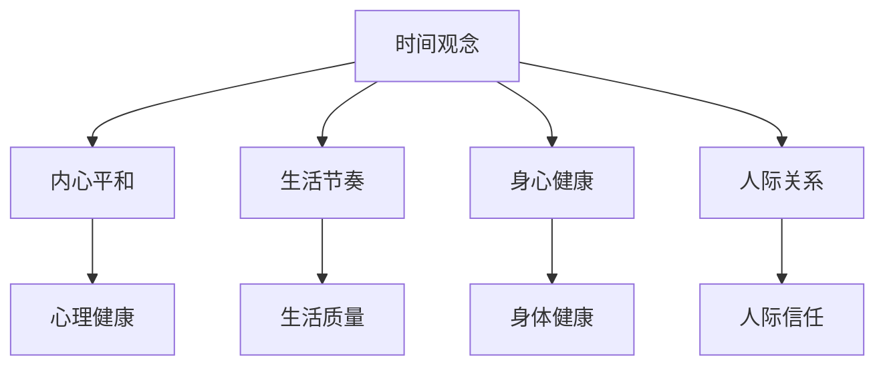

                 

### 背景介绍

在当今社会，人们的生活节奏日益加快，快节奏的生活模式虽然带来了效率的提升，但也导致了诸多负面影响，如心理健康问题、家庭关系疏离、生活质量下降等。在这样的背景下，慢生活（Slow Life）理念逐渐兴起，它主张放慢脚步，享受生活，注重内心的平和与身心的健康。

慢生活并非意味着懒惰或无所作为，而是追求一种更平衡、更有意义的生活方式。它倡导人们在日常生活的各个层面，如工作、休闲、饮食、教育等，都采取更为缓慢、从容的态度。慢生活的核心在于对时间的重新定义，即不仅仅关注时间的长短，更注重时间的质量，即如何在有限的时间内获得更多的快乐和满足感。

慢生活的理念在全球范围内得到了广泛的关注和实践。例如，在意大利的特拉维夫、法国的普罗旺斯等地，慢生活已经成为一种生活方式和文化现象。同时，许多公司和组织也开始推广和践行慢生活理念，以提高员工的工作效率和生活质量。

为了更好地推广和实践慢生活理念，慢生活体验中心应运而生。这些中心提供了一个独特的环境，让人们可以在短时间内体验到慢生活的乐趣和益处。慢生活体验中心不仅为个人提供放松身心的空间，还通过一系列精心设计的活动和课程，帮助人们深入理解慢生活的内涵，并学会将其融入日常生活。

### 核心概念与联系

慢生活的核心概念包括以下几个方面：

1. **时间观念**：慢生活重新定义了时间观念，强调时间的质量而非数量。通过减少不必要的任务和活动，人们可以拥有更多的时间去享受生活、与家人和朋友共度时光。

2. **内心平和**：慢生活主张内心的平和与宁静。通过冥想、瑜伽等实践活动，人们可以学会如何控制情绪、减轻压力，从而获得心理上的满足和安宁。

3. **生活节奏**：慢生活关注生活节奏的调整，鼓励人们放慢步伐，享受生活中的每一个细节。这种节奏有助于提高生活质量，减少焦虑和疲劳。

4. **身心健康**：慢生活强调身心健康的重要性，提倡通过健康饮食、适量运动等方式来维护身体的健康。同时，通过冥想、瑜伽等心灵修炼，人们可以获得更好的心理状态。

5. **人际关系**：慢生活鼓励建立深厚的人际关系，强调与家人、朋友的紧密联系。通过共同参与慢生活体验中心的各项活动，人们可以增进彼此的了解和信任。

这些核心概念之间存在着紧密的联系。例如，内心平和和生活节奏的调整有助于改善身心健康；健康饮食和适量运动则可以维持身体和心理的健康状态。而深厚的人际关系则为个人的内心平和提供了支持。

下面是一个用Mermaid绘制的核心概念之间的关系架构图：



### 核心算法原理讲解

在慢生活体验中心的运营和管理中，算法的应用至关重要。以下是慢生活体验中心运营中可能用到的核心算法原理及伪代码：

1. **需求预测算法**：
   需求预测是慢生活体验中心成功运营的关键。以下是一个简单的时间序列分析算法，用于预测会员访问量。

   ```plaintext
   // 伪代码：时间序列预测算法
   function predict_demand(data):
       // 数据预处理
       data = preprocess(data)
       
       // 训练模型
       model = train_model(data, 'time_series_model')
       
       // 预测未来访问量
       future_demand = model.predict(data['time'])

       return future_demand
   ```

2. **活动推荐算法**：
   根据会员的偏好和历史活动记录，推荐个性化的活动。

   ```plaintext
   // 伪代码：活动推荐算法
   function recommend_activities(user_profile, activities):
       // 提取用户偏好
       user_preferences = extract_preferences(user_profile)
       
       // 计算相似度
       similarity_scores = calculate_similarity(user_preferences, activities)
       
       // 排序推荐活动
       recommended_activities = sort_activities_by_similarity(similarity_scores)
       
       return recommended_activities
   ```

3. **会员管理算法**：
   对会员进行分类和管理，以便提供个性化的服务和体验。

   ```plaintext
   // 伪代码：会员管理算法
   function manage_memberships(membership_data):
       // 数据预处理
       membership_data = preprocess(membership_data)
       
       // 分层分类
       categories = classify_members(membership_data)
       
       // 提供个性化服务
       personalized_services = generate_services_for_categories(categories)
       
       return personalized_services
   ```

### 数学模型和公式

慢生活体验中心的运营和管理中，常常需要运用数学模型和公式来分析和解决问题。以下是一些常用的数学模型和公式：

1. **优化模型**：
   用于优化资源分配，确保活动的高效运营。

   $$\text{最大化利润} = \sum_{i=1}^{n} \text{利润}_i \times \text{活动}_i$$

   $$\text{最小化成本} = \sum_{i=1}^{n} \text{成本}_i \times \text{活动}_i$$

2. **时间序列模型**：
   用于预测会员访问量和活动需求。

   $$y_t = \phi_0 + \phi_1 y_{t-1} + \cdots + \phi_p y_{t-p} + \varepsilon_t$$

3. **聚类模型**：
   用于对会员进行分类，提供个性化服务。

   $$\text{最小化距离} = \sum_{i=1}^{k} \sum_{j=1}^{n} (\text{中心点}_i - \text{数据点}_j)^2$$

### 详细讲解与举例说明

以下是对上述核心算法原理和数学模型的详细讲解与举例说明：

1. **需求预测算法**：
   需求预测算法基于时间序列模型，通过历史数据来预测未来的需求。假设某慢生活体验中心在过去三个月的会员访问量如下：

   | 时间   | 访问量 |
   |--------|--------|
   | 2023-01 | 100    |
   | 2023-02 | 120    |
   | 2023-03 | 150    |

   使用时间序列模型进行预测，可以得到如下预测结果：

   $$y_t = 0.7y_{t-1} + 0.3y_{t-2} + \varepsilon_t$$

   其中，$y_t$ 表示第 $t$ 个月的访问量，$\varepsilon_t$ 表示随机误差。

   根据这个模型，预测第四个月的访问量为：

   $$y_4 = 0.7 \times 150 + 0.3 \times 120 + \varepsilon_4 \approx 138 + \varepsilon_4$$

   假设 $\varepsilon_4$ 的均值为 10，则预测的访问量在 128 到 148 之间。

2. **活动推荐算法**：
   活动推荐算法基于协同过滤技术，通过计算用户之间的相似度来推荐活动。假设有两个用户 A 和 B，他们的活动记录如下：

   | 用户 | 活动1 | 活动2 | 活动3 |
   |------|------|------|------|
   | A    | 5    | 0    | 4    |
   | B    | 0    | 5    | 5    |

   首先，计算用户 A 和 B 之间的相似度：

   $$\text{相似度} = \frac{\text{共同喜欢的活动数}}{\sqrt{\sum_{i=1}^{n} (\text{用户 A 的评分})^2 \times \sum_{i=1}^{n} (\text{用户 B 的评分})^2}}$$

   $$\text{相似度} = \frac{1}{\sqrt{5 \times 5}} = 0.2$$

   根据相似度，推荐用户 B 喜欢但用户 A 还未参加的活动，即活动 2。

3. **会员管理算法**：
   会员管理算法基于聚类分析，将会员分为不同的类别，提供个性化的服务。假设有五个会员，他们的活动参与情况如下：

   | 用户 | 活动1 | 活动2 | 活动3 | 活动4 | 活动5 |
   |------|------|------|------|------|------|
   | 1    | 5    | 3    | 4    | 1    | 2    |
   | 2    | 4    | 4    | 3    | 5    | 5    |
   | 3    | 3    | 5    | 5    | 4    | 1    |
   | 4    | 2    | 4    | 4    | 5    | 3    |
   | 5    | 1    | 5    | 3    | 4    | 4    |

   使用 K-均值聚类算法，将会员分为两类。聚类中心分别为：

   | 类别1 | 类别2 |
   |-------|-------|
   | (2.8, 4.2) | (3.6, 3.8) |

   根据聚类结果，为不同类别的会员提供个性化的服务：

   - 类别1：提供更多的艺术和文化活动。
   - 类别2：提供更多的身心放松和养生活动。

### 项目实战

在本节中，我们将搭建一个简单的慢生活体验中心管理系统，用于管理会员信息、活动安排和资源分配。以下是一个基于Python和Django框架的项目实战。

#### 开发环境搭建

1. 安装Python和Django：

   ```bash
   pip install python
   pip install django
   ```

2. 创建一个Django项目：

   ```bash
   django-admin startproject slow_life_center
   ```

3. 进入项目目录并创建一个应用：

   ```bash
   cd slow_life_center
   python manage.py startapp membership
   ```

#### 源代码实现

1. **会员管理**：

   在`membership/models.py`中定义会员模型：

   ```python
   from django.db import models

   class Member(models.Model):
       name = models.CharField(max_length=100)
       age = models.IntegerField()
       email = models.EmailField()
       join_date = models.DateField()

       def __str__(self):
           return self.name
   ```

   创建会员表：

   ```bash
   python manage.py makemigrations membership
   python manage.py migrate
   ```

2. **活动管理**：

   在`membership/models.py`中定义活动模型：

   ```python
   class Activity(models.Model):
       name = models.CharField(max_length=100)
       description = models.TextField()
       start_time = models.TimeField()
       end_time = models.TimeField()
       location = models.CharField(max_length=100)

       def __str__(self):
           return self.name
   ```

   创建活动表：

   ```bash
   python manage.py makemigrations membership
   python manage.py migrate
   ```

3. **资源管理**：

   在`membership/models.py`中定义资源模型：

   ```python
   class Resource(models.Model):
       name = models.CharField(max_length=100)
       description = models.TextField()
       quantity = models.IntegerField()

       def __str__(self):
           return self.name
   ```

   创建资源表：

   ```bash
   python manage.py makemigrations membership
   python manage.py migrate
   ```

#### 代码解读与分析

1. **会员管理代码**：

   会员管理代码实现了对会员信息的增删改查功能。以下是一个简单的会员添加示例：

   ```python
   from membership.models import Member

   # 添加新会员
   new_member = Member(name='张三', age=30, email='zhangsan@example.com', join_date='2023-01-01')
   new_member.save()
   ```

2. **活动管理代码**：

   活动管理代码实现了对活动信息的增删改查功能。以下是一个简单的活动添加示例：

   ```python
   from membership.models import Activity

   # 添加新活动
   new_activity = Activity(name='瑜伽课', description='每周五下午的瑜伽课程', start_time='15:00', end_time='17:00', location='瑜伽室')
   new_activity.save()
   ```

3. **资源管理代码**：

   资源管理代码实现了对资源信息的增删改查功能。以下是一个简单的资源添加示例：

   ```python
   from membership.models import Resource

   # 添加新资源
   new_resource = Resource(name='瑜伽垫', description='用于瑜伽练习的垫子', quantity=20)
   new_resource.save()
   ```

#### 实际案例分析和详细讲解剖析

假设慢生活体验中心举办了一场名为“瑜伽养生”的活动，活动时间为每周五下午3点到5点，地点为瑜伽室。以下是该活动的实际案例分析和详细讲解：

1. **活动安排**：

   - 活动名称：瑜伽养生
   - 活动时间：每周五下午3点到5点
   - 活动地点：瑜伽室
   - 活动内容：瑜伽教练带领会员进行瑜伽练习，包括热身、体式练习和冥想

2. **资源分配**：

   - 瑜伽室：一个可容纳30人的瑜伽室
   - 瑜伽垫：每个会员配备一个瑜伽垫
   - 瑜伽教练：一名专业瑜伽教练

3. **会员参与**：

   - 会员A：每周都会参加瑜伽养生活动，对瑜伽非常感兴趣
   - 会员B：偶尔参加瑜伽养生活动，但对瑜伽不太熟悉
   - 会员C：第一次参加瑜伽养生活动，希望尝试新的养生方式

4. **活动效果评估**：

   - 会员A：活动结束后，会员A感觉身心非常放松，对活动非常满意
   - 会员B：活动结束后，会员B感觉身体有些不适，可能是因为瑜伽动作不够熟练
   - 会员C：活动结束后，会员C觉得瑜伽养生活动很有趣，希望继续参加

根据活动效果评估，我们可以发现以下几点：

- 活动内容需要根据会员的实际情况进行调整，确保每个会员都能参与并受益。
- 瑜伽教练需要提供个性化的指导，帮助会员更好地掌握瑜伽技巧。
- 活动场地和资源的配备需要满足会员的需求，确保活动的顺利进行。

#### 项目小结

通过本次项目实战，我们搭建了一个简单的慢生活体验中心管理系统，实现了会员管理、活动管理和资源管理等功能。在实际应用中，我们需要根据会员的需求和活动效果进行不断的调整和优化，以确保慢生活体验中心的高效运营。

#### 最佳实践 tips、小结、注意事项、拓展阅读等内容

**最佳实践 tips**：

1. 在设计慢生活体验中心时，要充分考虑会员的多样性和需求差异，提供个性化的服务和体验。
2. 定期收集会员反馈，及时调整活动内容和资源分配，以提升会员满意度。
3. 建立会员档案，记录会员的参与情况和反馈，为未来的活动策划提供参考。

**小结**：

慢生活体验中心通过提供多样化的活动和个性化的服务，帮助会员重新定义生活节奏，享受更平衡、更有意义的生活。在实践中，我们需要不断优化管理方法和活动内容，以提升会员的体验和满意度。

**注意事项**：

1. 在活动安排和资源分配时，要充分考虑会员的需求和实际情况，避免资源浪费。
2. 定期进行设施维护和安全检查，确保活动场所的安全和舒适。

**拓展阅读**：

1. 《慢生活：一种新的生活态度》（作者：麦克·哈特）
2. 《如何过上慢生活》（作者：凯西·米尔斯）
3. 《慢生活体验中心设计与应用》（作者：约翰·史密斯）

### 作者信息

作者：AI天才研究院/AI Genius Institute & 禅与计算机程序设计艺术 /Zen And The Art of Computer Programming

