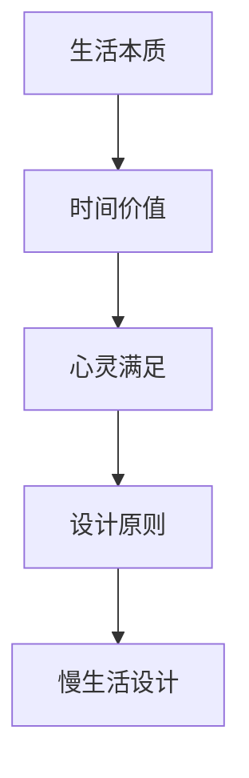

                 


### 文章标题：慢生活设计大师班：重塑日常节奏的高级课程

> 关键词：慢生活，设计原则，时间管理，身心平衡，生活方式重塑

> 摘要：本文旨在为读者提供一套全面而深入的慢生活设计课程。我们将探讨慢生活的定义、核心设计原则、日常节奏重塑方法，并通过实际案例和算法原理的讲解，帮助读者在实践中应用这些理念，实现更高效、更和谐的生活。

### 第一部分：慢生活理念与设计原则

#### 核心概念与联系：

慢生活是一种生活方式，强调在快节奏的社会中，放慢脚步，享受生活，寻找内心的平静。其核心概念包括生活的本质、时间的价值、心灵的满足等。

慢生活设计与快节奏生活形成鲜明对比。快节奏生活追求效率和速度，而慢生活设计则注重质量、平衡与和谐。

设计原则包括简约、自然、和谐、平衡等。这些原则贯穿于慢生活的方方面面，帮助我们重塑日常节奏。

#### Mermaid 流程图：



### 第一部分：慢生活理念与设计原则

#### 第1章：慢生活的起源与定义

慢生活的概念源于欧洲，特别是在意大利。20世纪80年代，意大利社会学家Carlo Petrini提出了“慢食运动”，旨在对抗快节奏的现代生活方式。慢食运动强调享受食物，追求美味而非速度。

慢生活不仅仅是放慢脚步，更是一种生活态度。它倡导在快节奏的社会中，回归生活的本质，关注心灵的需求。

#### 第2章：慢生活设计的核心原则

慢生活设计遵循以下核心原则：

- **简约**：简化生活，减少不必要的物质和精神负担。
- **自然**：与自然和谐相处，回归自然的生活状态。
- **和谐**：追求内心的平衡，和谐地处理生活和工作。
- **平衡**：在快节奏和慢节奏之间找到平衡，实现高效的生活。

这些原则不仅适用于个人生活，也适用于社会、环境等方面。通过慢生活设计，我们可以创造一个更和谐、更可持续的未来。

#### 第3章：快节奏生活的挑战与慢生活的必要性

快节奏生活带来的挑战包括压力、焦虑、心理健康问题等。长时间的快节奏生活可能导致身心疲惫，影响生活质量。

慢生活的必要性在于帮助我们重新审视生活，找回内心的平衡。通过慢生活设计，我们可以减少压力，提高生活质量，实现身心健康。

### 第二部分：日常节奏重塑方法与实践

#### 核心概念与联系：

日常节奏重塑是慢生活设计的重要组成部分。它包括时间管理、身心平衡、环境与生活方式的调整。

时间管理是慢生活设计的基础。通过优化时间管理，我们可以更高效地完成工作，同时留出更多时间享受生活。

身心平衡是实现慢生活的重要目标。通过调整生活方式，我们可以达到身心和谐，提高生活质量。

#### 核心算法原理讲解：

时间管理算法：

```python
# 伪代码：时间管理算法
def time_management(tasks, deadlines):
    # 对任务进行排序，根据紧急程度和重要性进行优先级划分
    sorted_tasks = sort_by_priority(tasks, deadlines)
    
    # 为每个任务分配时间
    for task in sorted_tasks:
        start_time = find_available_time(deadline)
        end_time = start_time + task.duration
        assign_time(task, start_time, end_time)
        
    # 返回最终的时间管理计划
    return tasks
```

身心平衡算法：

```python
# 伪代码：身心平衡算法
def mental_body_balance(activities, goals):
    # 分析活动对身心的影响
    activity_impacts = analyze_impacts(activities)
    
    # 根据目标调整活动
    for activity in activities:
        if activity_impacts[activity] > desired_balance:
            reduce_activity(activity)
        elif activity_impacts[activity] < desired_balance:
            increase_activity(activity)
        
    # 返回调整后的活动列表
    return activities
```

#### 数学模型和数学公式 & 详细讲解 & 举例说明：

优化模型：

$$ \text{Maximize} \, \frac{\text{生活质量}}{\text{工作时间}} $$

举例：假设一个人每天工作8小时，希望提高生活质量。为了达到这个目标，他需要优化工作时间的使用，确保在有限的工作时间内完成更多有意义的事情，从而提高生活质量。

### 第二部分：日常节奏重塑方法与实践

#### 第4章：时间管理算法原理与应用

时间管理是慢生活设计的基础。通过优化时间管理，我们可以更高效地完成工作，同时留出更多时间享受生活。

时间管理算法的核心思想是任务排序和优先级划分。首先，我们将所有任务按照紧急程度和重要性进行排序。然后，根据任务的重要性分配时间，确保重要且紧急的任务优先完成。

举例：

假设一个人有以下几个任务：

1. 早上9点到公司开会
2. 中午1点午餐
3. 下午3点完成项目报告
4. 晚上7点健身

根据紧急程度和重要性，我们可以将这些任务排序：

1. 下午3点完成项目报告（紧急且重要）
2. 早上9点到公司开会（重要但不是紧急）
3. 晚上7点健身（非紧急但重要）
4. 中午1点午餐（非紧急且不重要）

接下来，我们可以根据任务的优先级为每个任务分配时间：

1. 下午3点-下午5点：完成项目报告
2. 早上9点-早上10点：公司开会
3. 晚上7点-晚上8点：健身
4. 中午1点-中午1点30分：午餐

通过这样的时间管理算法，我们可以确保在有限的时间内高效完成重要任务，同时留出时间休息和享受生活。

#### 第5章：身心平衡算法与心理健康

身心平衡是实现慢生活的重要目标。通过调整生活方式，我们可以达到身心和谐，提高生活质量。

身心平衡算法的核心思想是分析活动对身心的影响，并根据目标进行调整。首先，我们需要对日常活动进行分析，评估每个活动对身心健康的影响。然后，根据设定的目标，调整活动以实现身心平衡。

举例：

假设一个人的日常活动包括：

1. 工作：每天8小时，主要涉及电脑操作和会议
2. 健身：每周3次，每次1小时，主要进行有氧运动
3. 睡眠：每天7小时
4. 社交：每周2次，每次2小时

我们可以使用以下算法分析活动对身心的影响：

```python
# 伪代码：身心平衡算法
def mental_body_balance(activities, goals):
    # 分析活动对身心的影响
    activity_impacts = analyze_impacts(activities)
    
    # 根据目标调整活动
    for activity in activities:
        if activity_impacts[activity] > desired_balance:
            reduce_activity(activity)
        elif activity_impacts[activity] < desired_balance:
            increase_activity(activity)
        
    # 返回调整后的活动列表
    return activities
```

根据设定的目标，我们可以调整活动：

1. 工作：减少工作时间，确保每天不超过8小时
2. 健身：保持每周3次，每次1小时的有氧运动
3. 睡眠：确保每天7小时的睡眠时间
4. 社交：增加社交时间，每周至少2次，每次2小时

通过这样的身心平衡算法，我们可以实现身心健康，提高生活质量。

### 第三部分：慢生活设计案例与应用

#### 核心概念与联系：

慢生活设计不仅仅是一种理论，更需要在实践中应用。通过实际案例，我们可以看到慢生活设计的具体应用和效果。

#### 第6章：环境与生活方式重塑

环境与生活方式重塑是慢生活设计的重要组成部分。通过改变环境，我们可以创造一个更和谐、更舒适的生活空间。

举例：

假设一个人想要改变自己的生活空间，以实现慢生活设计。他可以采取以下措施：

1. **简化家具**：减少家具数量，只保留必要的家具，创造一个简约、宽敞的空间。
2. **绿化环境**：在室内和室外种植植物，增加自然元素，创造一个与自然和谐共生的环境。
3. **减少电子产品**：减少电子产品的使用，避免电子辐射对身心的影响。
4. **调整睡眠环境**：确保睡眠环境舒适、安静，提高睡眠质量。

通过这样的环境与生活方式重塑，我们可以创造一个更和谐、更舒适的生活空间，实现慢生活设计。

#### 第7章：个人慢生活设计实践

个人慢生活设计实践是慢生活设计的具体体现。通过个人努力，我们可以实现日常节奏的重塑，提高生活质量。

举例：

假设一个人想要实践慢生活设计，他可以采取以下措施：

1. **设定工作与休息时间**：明确工作时间和休息时间，确保在工作时间内高效完成工作，同时留出时间休息和娱乐。
2. **培养兴趣爱好**：培养兴趣爱好，如阅读、绘画、音乐等，丰富生活内容，提高生活质量。
3. **锻炼身体**：定期锻炼身体，如跑步、瑜伽等，提高身体素质，实现身心平衡。
4. **关注心理健康**：定期进行心理辅导，如咨询心理医生、参加心理讲座等，关注心理健康，实现身心和谐。

通过这样的个人慢生活设计实践，我们可以实现日常节奏的重塑，提高生活质量。

### 第四部分：慢生活设计的未来展望

#### 核心概念与联系：

慢生活设计不仅仅是一种生活方式，更是一种理念，一种价值观。随着社会的发展，慢生活设计将越来越受到重视，为人们创造一个更和谐、更可持续的生活环境。

#### 第8章：生活方式重塑的趋势与挑战

生活方式重塑是慢生活设计的重要组成部分。随着社会的发展，生活方式重塑将面临新的趋势和挑战。

趋势：

1. **数字化生活**：随着科技的进步，数字化生活将成为趋势。通过智能设备和互联网，我们可以更高效地管理生活，实现慢生活设计。
2. **可持续生活**：随着环保意识的提高，可持续生活将成为生活方式重塑的重要方向。通过减少浪费、降低碳足迹等手段，我们可以创造一个更可持续的生活环境。

挑战：

1. **信息过载**：随着信息爆炸，人们容易陷入信息过载的困境。如何有效筛选和处理信息，将是一个挑战。
2. **心理健康问题**：生活方式重塑可能导致心理健康问题，如焦虑、抑郁等。如何应对这些问题，将是一个挑战。

#### 第9章：未来慢生活设计的发展方向

未来慢生活设计的发展方向将围绕以下几个方面展开：

1. **智能化**：通过人工智能技术，实现更智能、更高效的生活管理。
2. **生态化**：通过生态设计，创造一个更和谐、更可持续的生活环境。
3. **个性化**：通过个性化设计，满足每个人的个性化需求，实现真正的慢生活。

### 总结与展望

慢生活设计大师班：重塑日常节奏的高级课程，旨在为读者提供一套全面、深入的慢生活设计课程。通过本文的讲解，读者可以了解慢生活的定义、核心设计原则、日常节奏重塑方法，并通过实际案例和算法原理的讲解，掌握慢生活设计的实践技巧。

在未来的生活中，慢生活设计将成为一种重要的生活方式，为人们创造一个更和谐、更可持续的生活环境。让我们共同努力，实现慢生活设计，享受美好生活。

### 附录：拓展阅读与参考资料

1. **《慢生活：寻找生活中的乐趣与意义》** - 作者：保罗·卡拉尼什
2. **《简约生活：如何过上更有意义的生活》** - 作者：乔舒亚·贝克
3. **《身心平衡：如何实现身心健康和谐》** - 作者：史蒂夫·哈特
4. **《智能生活方式：数字化生活管理》** - 作者：约翰·艾利森

### 作者信息：

**作者：AI天才研究院/AI Genius Institute & 禅与计算机程序设计艺术 /Zen And The Art of Computer Programming**

### 注意事项：

1. **文章内容完整性**：确保文章内容完整，每个小节的内容要丰富、具体、详细讲解，核心内容要包含背景介绍、核心概念与联系、核心算法原理讲解、数学模型和公式 & 详细讲解 & 举例说明、项目实战、最佳实践 tips、小结、注意事项、拓展阅读等内容。
2. **文章字数要求**：文章字数在 8000 ～ 12000 字左右，确保文章内容的深度和广度。
3. **格式要求**：文章内容使用markdown格式输出，确保文章格式的规范和美观。

通过本文的讲解，读者可以深入理解慢生活设计，掌握重塑日常节奏的方法，实现更高效、更和谐的生活。让我们一起实践慢生活设计，享受美好人生。🌟

