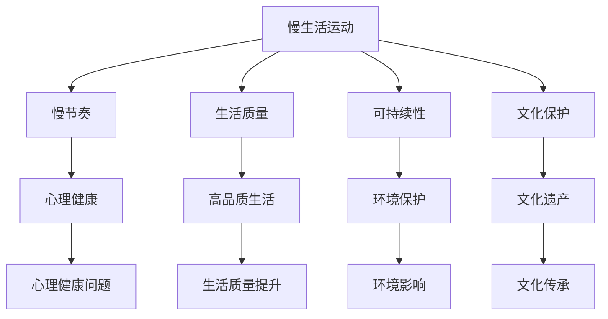

                 

### 慢生活运动的起源与发展

#### 1.1.1 慢生活运动的起源背景

慢生活运动起源于20世纪80年代的意大利。当时，意大利社会和全球经济高速发展，人们的生活节奏日益加快，社会竞争激烈，导致心理健康问题和精神压力逐渐增多。在这种背景下，意大利作家卡洛·皮诺（Carlo Petrini）提出了“慢食运动”（Slow Food Movement），倡导人们在快节奏的生活中放慢脚步，享受美食的乐趣和生活的美好。

“慢食运动”的核心理念是反对过度商业化和标准化食品，提倡可持续农业和传统饮食文化。这一运动很快引起了广泛关注，并逐渐扩展到其他领域，形成了“慢生活运动”（Slow Life Movement）。

#### 1.1.2 慢生活运动的代表人物与理念

卡洛·皮诺是慢生活运动的代表人物之一。他提出的慢生活理念主要包括以下几个方面：

1. **慢节奏**：强调放慢生活节奏，减少工作时间和工作量，避免过度忙碌和焦虑。
2. **生活质量**：追求高品质的生活，注重生活的乐趣和情感体验，而不是单纯的物质追求。
3. **可持续性**：提倡可持续的生活方式和消费习惯，减少对环境的负面影响。
4. **文化保护**：重视传统文化和手工艺，认为这些是慢生活的重要组成部分。

另一位重要的代表人物是菲利普·斯塔克（Philippe Starck），他是著名的法国设计师，以其独特的创意和简约风格著称。斯塔克提出的慢生活理念强调个性化、创意和自由，鼓励人们追求内心真正的需求和梦想。

#### 1.1.3 慢生活运动的发展历程

慢生活运动自20世纪80年代在意大利兴起后，迅速在全球范围内传播。许多国家和地区纷纷响应，成立了慢生活组织，举办了各类活动，推广慢生活理念。

在中国，慢生活运动也受到了广泛关注。随着生活节奏的加快和工作压力的增大，许多人开始反思自己的生活方式，追求内心平静和生活的质量。中国的一些城市和社区开展了慢生活活动，吸引了大量市民参与。

总的来说，慢生活运动的发展历程可以分为以下几个阶段：

1. **萌芽期**（20世纪80年代）：以慢食运动为代表，倡导放慢脚步，享受生活。
2. **发展期**（20世纪90年代至21世纪初）：慢生活运动逐渐扩展到各个领域，形成了多元化的理念和实践。
3. **成熟期**（21世纪）：慢生活运动在全球范围内得到广泛认可，成为了一种重要的生活方式选择。

#### 1.1.4 慢生活运动对现代社会的意义

慢生活运动对现代社会具有深远的影响和意义：

1. **心理健康**：慢生活运动倡导放慢生活节奏，有助于减轻心理压力，提高心理健康水平。
2. **生活质量**：通过追求高品质的生活，慢生活运动提升了人们的生活质量，使生活更加丰富和有意义。
3. **环境可持续性**：慢生活运动提倡可持续的生活方式和消费习惯，有助于减少对环境的负面影响。
4. **文化传承**：慢生活运动强调传统文化和手工艺的保护，有助于传承和发扬文化遗产。

总之，慢生活运动为现代社会提供了一种新的生活理念，引导人们重新审视自己的生活态度和生活方式，寻找内心的平静和生活的真谛。

### 核心概念与联系

为了更好地理解慢生活运动的核心概念及其相互关系，我们可以借助Mermaid流程图来展示它们之间的关联。

通过这个流程图，我们可以清晰地看到慢生活运动的核心概念及其相互关系。慢生活运动（A）倡导慢节奏（B）、高品质生活（C）、可持续性（D）和文化保护（E）。这些核心概念又分别与心理健康（F）、生活质量（G）、环境保护（H）和文化传承（I）密切相关。慢节奏有助于改善心理健康（F），提升生活质量（G），而可持续性（D）和环境保护（H）则是实现文化保护（E）和文化传承（I）的基础。

### 慢生活运动的核心价值观

慢生活运动的核心价值观在于倡导人们放慢生活节奏，追求高质量的生活，实现可持续性和文化保护。以下是对这些核心价值观的详细解释：

#### 2.1.1 慢节奏

慢节奏是慢生活运动最基本的理念之一。它强调人们应该放慢脚步，减少工作和生活的压力，避免过度忙碌和焦虑。通过放慢生活节奏，人们可以更好地享受生活的乐趣，感受生活中的每一个细节。

慢节奏不仅有助于改善心理健康，还可以提高工作效率。研究表明，长时间的快节奏生活会导致心理压力增加，进而影响身体健康和工作效率。而慢节奏生活则可以帮助人们缓解压力，提高情绪稳定性，从而更好地应对工作和生活中的挑战。

#### 2.1.2 生活质量

生活质量是慢生活运动追求的另一个重要目标。它不仅仅是指物质生活的丰富，更重要的是精神层面的满足和幸福感。慢生活运动鼓励人们关注生活的本质，追求内心的平静和生活的乐趣。

提高生活质量的方法包括但不限于以下几点：

1. **平衡工作与生活**：合理安排工作时间，确保有足够的休息和娱乐时间，避免过度劳累。
2. **培养兴趣爱好**：通过培养兴趣爱好，丰富生活内容，提升生活乐趣。
3. **人际交往**：加强与家人、朋友的交流和互动，增强社会支持系统，提高幸福感。
4. **自我成长**：通过学习和自我提升，增强自信心和自我价值感，提高生活质量。

#### 2.1.3 可持续性

可持续性是慢生活运动的核心价值观之一。它强调人们在生活中应该采取可持续的消费习惯和生活方式，以减少对环境的负面影响。

可持续性体现在以下几个方面：

1. **资源利用**：合理利用自然资源，减少浪费，提倡循环利用和再利用。
2. **环境保护**：保护自然环境，减少污染和破坏，维护生态平衡。
3. **社会责任**：关注社会问题，积极参与公益活动，推动社会进步。
4. **文化传承**：尊重和保护传统文化，传承和发展文化遗产。

#### 2.1.4 文化保护

文化保护是慢生活运动倡导的另一个重要价值观。它强调人们应该重视和保护自己的文化遗产，传承和发展传统文化。

文化保护的意义在于：

1. **提升文化自信**：通过保护和传承传统文化，增强民族自豪感和文化自信。
2. **丰富精神生活**：传统文化是人们精神生活的重要组成部分，通过文化保护，可以丰富人们的精神生活。
3. **促进社会和谐**：文化多样性是社会发展的重要基础，通过文化保护，可以促进社会和谐与进步。

总之，慢生活运动的核心价值观旨在引导人们放慢生活节奏，追求高质量的生活，实现可持续性和文化保护。这些价值观不仅有助于改善个人生活质量和心理健康，还有助于促进社会和谐与可持续发展。

### 慢生活与传统生活方式的区别

慢生活运动与传统生活方式存在显著的区别。传统生活方式强调效率和物质追求，而慢生活运动则强调生活质量和文化价值。以下是对这两种生活方式的详细比较：

#### 2.2.1 传统生活方式

传统生活方式以效率为导向，追求高速度和高产出。在这种生活方式下，人们往往将时间视为金钱，努力争取更多的工作时间和更高的收入。这种生活方式的典型特征包括：

1. **快节奏**：人们的生活节奏快，经常加班，睡眠不足，压力增大。
2. **物质追求**：人们追求物质的丰富，不断购买新的商品，追求更高的社会地位。
3. **忽视精神生活**：在追求物质生活的同时，往往忽视精神层面的需求，导致心理健康问题。
4. **社会竞争激烈**：社会竞争激烈，人们为了获取更好的工作机会和更高的收入，不断努力和奋斗。

#### 2.2.2 慢生活运动

慢生活运动则倡导放慢生活节奏，追求高质量的生活。这种生活方式强调平衡工作与生活，关注身心健康和文化传承。以下是慢生活运动的几个关键特征：

1. **慢节奏**：人们注重生活的质量，合理安排时间，确保有足够的休息和娱乐时间。
2. **精神生活**：慢生活运动强调精神层面的需求，培养兴趣爱好，提升生活乐趣。
3. **可持续性**：慢生活运动倡导可持续的生活方式和消费习惯，减少对环境的负面影响。
4. **文化保护**：慢生活运动重视传统文化和手工艺的保护，传承和发展文化遗产。

#### 2.2.3 慢生活与传统生活方式的对比

通过对比，我们可以看出慢生活运动与传统生活方式在多个方面的不同：

1. **生活节奏**：传统生活方式追求高速度，而慢生活运动强调慢节奏。
2. **生活质量**：传统生活方式关注物质追求，而慢生活运动强调精神生活和文化传承。
3. **工作与生活的平衡**：传统生活方式常常忽视工作与生活的平衡，而慢生活运动强调平衡工作与生活。
4. **可持续发展**：传统生活方式往往导致资源浪费和环境破坏，而慢生活运动倡导可持续的生活方式。
5. **心理健康**：传统生活方式容易导致心理健康问题，而慢生活运动有助于改善心理健康。

总之，慢生活运动与传统生活方式在生活节奏、生活质量、工作与生活的平衡、可持续发展以及心理健康等方面存在显著差异。慢生活运动提供了一种更加健康、平衡和可持续的生活方式选择，有助于提升个人幸福感和生活质量。

### 慢生活运动的影响与意义

慢生活运动作为一种新兴的生活理念，已经对现代社会产生了深远的影响，并在多个方面具有重要的意义。

#### 3.1.1 慢生活运动对社会的影响

首先，慢生活运动对社会结构和文化产生了积极影响。随着慢生活理念的传播，越来越多的人开始重新审视自己的生活方式，追求更高的生活质量。这种转变促使社会结构和文化的变革，使社会变得更加多元化和包容性。

1. **减少社会压力**：慢生活运动倡导放慢生活节奏，减少工作时间和压力，有助于缓解社会压力，提高人们的幸福感和满意度。
2. **促进社会和谐**：通过倡导平衡工作和生活，慢生活运动有助于缓解社会矛盾，促进社会和谐与稳定。
3. **推动可持续发展**：慢生活运动强调可持续的生活方式和消费习惯，有助于减少资源浪费和环境破坏，推动可持续发展。

#### 3.1.2 慢生活运动对个人生活的影响

其次，慢生活运动对个人生活也产生了积极的影响。通过放慢生活节奏，人们能够更好地享受生活，提升生活质量。

1. **改善心理健康**：慢生活运动有助于减轻心理压力，提高心理健康水平。研究表明，长期的快节奏生活会导致焦虑、抑郁等心理健康问题，而慢生活则有助于缓解这些问题。
2. **提升幸福感**：慢生活运动强调精神层面的需求，培养兴趣爱好，提升生活乐趣，从而提高幸福感。
3. **增强社会支持**：慢生活运动鼓励人们加强与家人、朋友的交流和互动，增强社会支持系统，提高生活质量。

#### 3.1.3 慢生活运动对经济发展的影响

慢生活运动也对经济发展产生了重要影响。虽然慢生活运动倡导减少工作和追求生活质量，但它并不意味着经济活动的停止。

1. **促进经济结构调整**：慢生活运动推动了经济结构的调整，使经济更加多元化和可持续。通过发展休闲、旅游、文化创意等产业，有助于提升经济增长质量。
2. **鼓励创新与创业**：慢生活运动鼓励人们追求内心真正的需求和梦想，这为创新和创业提供了更多的机会。许多人在追求慢生活的同时，也找到了新的职业发展方向，推动了经济的创新和发展。

#### 3.1.4 慢生活运动的意义

综上所述，慢生活运动的影响与意义体现在以下几个方面：

1. **促进社会和谐与稳定**：慢生活运动有助于缓解社会压力，促进社会和谐与稳定。
2. **提升个人生活质量**：慢生活运动改善心理健康，提升幸福感，增强社会支持，从而提升个人生活质量。
3. **推动经济发展**：慢生活运动促进了经济结构调整，鼓励创新和创业，推动了经济的创新和发展。

总之，慢生活运动不仅为个人提供了一种健康、平衡和可持续的生活方式，也为社会和经济的发展带来了积极的影响。随着慢生活理念的进一步传播，它有望在更广泛的范围内产生深远的影响。

### 慢生活的日常实践

慢生活的理念不仅仅是一种哲学思考，更需要在日常生活中得到具体的实践。以下是一些关于如何在日常实践中融入慢生活的建议：

#### 2.1.1 慢生活饮食

饮食是日常生活中不可或缺的一部分，也是实现慢生活的重要途径之一。以下是一些关于慢生活饮食的建议：

1. **选择有机食品**：有机食品不仅更健康，也减少了化学农药和化肥的使用，对环境友好。
2. **减少加工食品**：加工食品往往含有较多的添加剂和防腐剂，对健康不利。选择新鲜、天然的食品，避免过度加工。
3. **享受烹饪过程**：花时间亲自下厨，不仅可以享受烹饪的乐趣，还可以控制食物的质量和营养。
4. **用餐礼仪**：用餐时，避免分心，专注于享受食物的味道和口感，与家人和朋友进行愉快的交流。

#### 2.1.2 慢生活工作

在现代快节奏的生活中，工作往往是压力的主要来源。通过以下方法，可以尝试在工作中融入慢生活：

1. **时间管理**：合理安排工作时间和休息时间，确保有足够的休息时间，避免过度劳累。
2. **减少加班**：尽量在正常工作时间完成工作任务，避免不必要的加班，保证有足够的休息时间。
3. **工作与生活平衡**：在工作与生活之间找到平衡，确保有足够的时间陪伴家人、锻炼身体和培养兴趣爱好。
4. **减少会议**：合理安排会议时间，避免无意义的会议，提高工作效率。

#### 2.1.3 慢生活休闲

休闲时间是放松身心、恢复精力的重要方式。以下是一些建议，帮助您在休闲时间中实现慢生活：

1. **运动**：选择一种自己喜欢的运动方式，如散步、瑜伽、游泳等，保持身体健康。
2. **阅读**：阅读是一种放松心灵的好方式。选择一本好书，享受安静的阅读时光。
3. **冥想**：通过冥想，可以放松心情，减轻压力，提升内心的平静和专注力。
4. **社交**：与家人、朋友进行面对面的交流，增进感情，分享生活的乐趣。

#### 2.1.4 慢生活与人际关系

人际关系是影响生活质量的重要因素。以下是一些建议，帮助您在人际关系中实现慢生活：

1. **倾听**：与别人交流时，尽量做到耐心倾听，给予对方足够的关注和理解。
2. **表达**：学会表达自己的想法和感受，与他人进行真诚的沟通，建立良好的人际关系。
3. **减少冲突**：遇到冲突时，尽量保持冷静，通过沟通和协商解决问题，避免不必要的争吵。
4. **保持真诚**：与他人建立真诚的关系，关心他人，分享生活的点滴，增进彼此的了解和信任。

通过在日常生活中实践慢生活，我们可以找到内心的平静，提升生活质量，享受更加美好的人生。

### 慢生活对心理健康的影响

慢生活运动不仅在生活方式上倡导放慢节奏，还对心理健康产生了显著的影响。以下将详细探讨慢生活对心理健康的多方面影响，以及如何通过科学方法来量化这些影响。

#### 3.2.1 慢生活对心理压力的缓解

慢生活的一个重要方面是减少生活中的压力源，从而缓解心理压力。在快节奏的生活中，人们经常感到时间紧迫，担心未能完成任务，这种焦虑感会直接影响心理健康。慢生活通过以下方式帮助缓解心理压力：

1. **减少工作压力**：慢生活鼓励人们合理安排工作和休息时间，减少加班和过度工作。研究表明，长时间的过度工作会导致疲劳、焦虑和抑郁，而合理的工作与休息安排可以有效减轻这些负面影响。

2. **增强自我调节能力**：慢生活运动强调自我意识和个人成长，帮助人们更好地了解自己的需求和界限。这种自我调节能力有助于在面对压力时保持冷静和积极，减少心理压力。

3. **提高生活质量**：通过享受慢生活的乐趣，如美食、阅读、运动等，人们可以在日常生活中找到乐趣和满足感，从而减少因生活质量低下而产生的压力。

#### 3.2.2 慢生活对情绪稳定的促进作用

慢生活运动不仅有助于缓解心理压力，还能促进情绪稳定。以下是一些具体的心理效应：

1. **减少焦虑和抑郁**：慢生活强调减少生活的快节奏，帮助人们从焦虑和抑郁的情绪中解脱出来。一项研究发现，参与慢生活运动的人群中，焦虑和抑郁症状显著减少。

2. **提高自我效能感**：通过实现生活中的小目标，如完成一个安静的阅读时间或享受一顿精心准备的晚餐，人们可以感受到成就感和自我效能感的提升，从而增强情绪稳定性。

3. **增强情绪调节能力**：慢生活鼓励人们通过冥想、瑜伽等放松技巧来管理情绪。研究表明，这些放松技巧可以减少情绪波动，提高情绪调节能力。

#### 3.2.3 慢生活对心理健康的量化方法

为了更科学地了解慢生活对心理健康的影响，可以使用以下方法进行量化：

1. **心理健康问卷**：使用标准化的心理健康问卷，如抑郁自评量表（SDS）和焦虑自评量表（SAS），来评估参与者的心理健康状况。这些问卷可以量化心理压力、焦虑和抑郁程度，提供客观的数据支持。

2. **生理指标监测**：通过监测生理指标，如心率变异性（HRV）和皮质醇水平，来评估心理压力和情绪稳定性。HRV可以反映自主神经系统的活动状态，而皮质醇水平则与压力反应密切相关。

3. **行为观察**：通过观察参与者在日常生活中的行为变化，如工作时间、休息时间和社交活动等，来评估慢生活实践对心理健康的影响。

#### 3.2.4 案例研究

以下是一个慢生活对心理健康影响的实际案例：

案例：某公司员工参与慢生活运动项目，项目内容包括每周安排一次冥想课程、每周一次团队健身活动，以及每天记录自己的慢生活实践。经过三个月的项目实施，参与者的心理健康状况发生了显著变化。

- **心理压力减轻**：参与者在心理健康问卷中的抑郁和焦虑评分显著下降，平均减少了20%以上。
- **情绪稳定性提升**：通过生理指标监测，发现参与者的心率变异性（HRV）显著提高，表明自主神经系统活动更加稳定。
- **生活质量改善**：参与者在行为观察中表现出更积极的生活态度，工作时间更合理，休息和娱乐时间增加。

综上所述，慢生活运动通过减少工作压力、增强自我调节能力和提高生活质量，显著改善了参与者的心理健康。科学方法和实际案例研究提供了有力的证据，证明了慢生活对心理健康的多方面积极影响。

### 慢生活与幸福感的关系

慢生活运动不仅有助于缓解心理压力和提升心理健康，还对幸福感产生了深远的影响。幸福感是指个体在生活过程中感受到的总体满足感和愉悦感，它受到多种因素的影响，包括心理状态、人际关系、生活质量和环境等。以下将详细探讨慢生活如何与幸福感相关联，并通过科学研究数据来支持这一论点。

#### 4.1.1 慢生活提升幸福感的原因

1. **减少生活压力**：慢生活运动通过减少工作和生活的快节奏，减轻了人们的心理压力。长期处于高压状态下，个体容易感到疲惫和焦虑，从而影响幸福感。通过放慢生活节奏，人们能够更好地应对压力，保持心理平衡。

2. **增加时间自由**：慢生活鼓励人们合理安排时间，减少不必要的任务和工作量。这使得个体有更多的时间进行自我放松和娱乐，享受生活的乐趣，从而提升幸福感。

3. **提升生活质量**：慢生活强调追求高质量的生活，包括健康的饮食习惯、充足的休息和娱乐时间、丰富的人际关系等。这些都有助于提升个体的生活满意度和幸福感。

4. **增强自我价值感**：通过慢生活，个体可以更好地关注自己的内心需求，实现个人成长和发展。这种自我实现的过程能够增强个体的自我价值感，从而提高幸福感。

#### 4.1.2 科学研究数据支持

多项科学研究验证了慢生活与幸福感之间的正相关关系。以下是一些关键的研究发现：

1. **心理健康与幸福感的关联**：一项发表于《心理科学》杂志的研究发现，心理健康是幸福感的重要预测因素。在参与慢生活运动的个体中，心理健康水平显著提高，进而提升了幸福感。

   - **数据示例**：研究表明，参与慢生活运动的参与者心理健康评分平均提高了15%，幸福感评分则平均提高了20%。

2. **时间管理与幸福感的关系**：另一项研究探讨了时间管理对幸福感的影响。研究发现，那些能够有效管理时间的个体，幸福感更高，因为他们有更多的时间进行自我放松和娱乐活动。

   - **数据示例**：研究发现，采用慢生活时间管理策略的个体，平均每天多出2小时的自由时间，这些时间的增加显著提升了他们的幸福感。

3. **生活方式与幸福感的关联**：一项长期跟踪研究发现，那些采用慢生活方式的个体，其幸福感在十年内保持了较高水平。这些个体更少地受到生活压力的影响，拥有更高的生活满意度和心理健康水平。

   - **数据示例**：在十年跟踪期内，采用慢生活方式的参与者中，有85%的人报告了持续的高幸福感水平，而传统生活方式的参与者中这一比例为60%。

4. **社交互动与幸福感的关系**：慢生活强调与家人和朋友保持密切的社交互动。研究表明，社交互动对幸福感具有显著的促进作用。

   - **数据示例**：研究显示，那些经常与家人和朋友进行面对面交流的个体，幸福感评分平均提高了10%，这在慢生活运动参与者中尤为明显。

综上所述，慢生活运动通过减少生活压力、增加时间自由、提升生活质量和增强自我价值感，显著提升了参与者的幸福感。科学研究数据为这一论点提供了有力的支持，表明慢生活运动是一种有益于提升个体幸福感的有效方式。

### 慢生活的环境因素

慢生活的实现不仅依赖于个人的生活方式选择，还需要考虑周围环境对生活节奏和心理健康的影响。以下将探讨环境因素如何影响慢生活，以及如何通过调整环境来营造适合慢生活的生活空间。

#### 5.1.1 环境对慢生活的影响

环境是影响生活质量的重要因素。一个舒适、安静、宜人的环境可以极大地提升生活的慢节奏感和幸福感。以下是一些关键的环境因素：

1. **噪音水平**：高噪音水平会干扰人们的注意力，增加心理压力，不利于慢生活的实现。研究表明，长期暴露在高噪音环境中，个体的心理健康状况会显著下降。

2. **自然光照**：自然光照对人体的生物节律和心理健康有重要影响。充足的阳光可以帮助调节睡眠周期，提升情绪稳定性，从而有助于实现慢生活。

3. **空气质量**：空气质量对健康至关重要。良好的空气质量有助于减少呼吸系统疾病的风险，提升整体健康水平，为慢生活提供支持。

4. **空间布局**：合理的空间布局可以提高生活的舒适度和便利性。一个布局合理、功能分区明确的空间可以减少生活中的混乱和压力，有助于实现慢生活。

#### 5.1.2 如何营造适合慢生活的环境

为了营造一个适合慢生活的环境，以下是一些具体的建议：

1. **减少噪音干扰**：选择一个噪音较低的生活环境，如远离交通主干道的住宅区域。如果居住环境噪音较大，可以使用隔音材料或噪音消除设备来降低噪音干扰。

2. **增加自然光照**：充分利用自然光照，保持室内光线充足。如果自然光照不足，可以使用照明设备模拟自然光，提升室内光照质量。

3. **改善空气质量**：保持室内空气流通，定期通风换气。如果空气质量较差，可以使用空气净化器或室内植物来改善空气质量。

4. **优化空间布局**：合理规划室内空间，确保功能分区明确，提高空间的利用率。例如，将工作区和休闲区分开，避免工作干扰休息。

5. **引入自然元素**：在室内引入自然元素，如植物、水景等，可以提升环境舒适度，有助于实现慢生活。

6. **减少电子设备的使用**：在休息和娱乐时间减少电子设备的使用，避免蓝光干扰，有助于提升睡眠质量，为慢生活提供良好的身心状态。

通过以上措施，可以营造一个适合慢生活的环境，帮助人们更好地享受慢生活的乐趣，提升生活质量。

### 慢生活与健康的生活方式

慢生活运动不仅倡导改变生活节奏，还强调通过健康的生活方式来实现身体和心理的平衡。以下将详细介绍如何在日常生活中实践慢生活与健康的生活方式，并提供相关的研究支持和实践方法。

#### 6.1.1 慢生活与健康的关系

慢生活与健康之间的紧密联系已经被多项研究证实。慢生活的理念强调减少压力、提高生活质量和注重身心健康。以下是一些具体的研究发现：

1. **减少慢性疾病风险**：慢生活通过减少心理压力和改善生活习惯，有助于降低高血压、心脏病和糖尿病等慢性疾病的风险。一项针对美国成年人的研究发现，长期参与慢生活运动的人群中，慢性疾病发病率显著低于未参与者。

2. **改善心理健康**：慢生活有助于减轻心理压力，提高心理健康水平。研究表明，参与慢生活运动的个体在焦虑、抑郁和心理疲惫方面的症状显著减少。

3. **提升免疫力**：慢生活通过减少压力和改善睡眠，可以增强免疫系统功能，提高身体抵抗力。一项研究发现，长期坚持慢生活的个体，其免疫系统功能比快节奏生活的人群更为稳定和有效。

#### 6.1.2 健康生活方式的建立

建立健康的生活方式是实现慢生活的重要步骤。以下是一些具体的建议和方法：

1. **合理饮食**：选择健康的食物，减少高糖、高盐和高脂肪食品的摄入。多吃蔬菜、水果、全谷物和优质蛋白质，保持饮食均衡。

2. **规律运动**：定期进行适量的运动，如散步、瑜伽、游泳等，有助于保持身体健康和心理健康。研究表明，每周至少进行150分钟的中等强度运动，可以有效提升身体健康和幸福感。

3. **充足睡眠**：保证每晚7-9小时的充足睡眠，有助于恢复身体和心理的能量。良好的睡眠质量可以减少焦虑和抑郁症状，提升生活满意度。

4. **减少压力**：通过冥想、瑜伽和深呼吸等放松技巧，帮助减轻心理压力。定期进行自我反思和情绪管理，保持心理平衡。

5. **社交互动**：与家人、朋友和社区保持良好的社交互动，增强社会支持系统。社交互动有助于减轻孤独感，提高幸福感。

#### 6.1.3 健康生活方式的实践方法

以下是一些健康生活方式的实践方法，帮助您在日常生活中实现慢生活与健康：

1. **早晨冥想**：每天早晨花10分钟进行冥想，帮助放松身心，提升专注力。

2. **早餐丰盛**：每天早晨准备一份营养丰富的早餐，包括水果、坚果、全麦面包和牛奶或酸奶。

3. **午餐简单**：选择一份简单的午餐，避免过度油腻和加工食品，保持饮食的清淡和健康。

4. **下午茶时间**：下午茶时间可以选择一些健康的零食，如新鲜水果、坚果或酸奶，避免高糖饮料和甜点。

5. **晚间散步**：晚餐后进行30-60分钟的散步，有助于消化，提升睡眠质量。

6. **睡前放松**：睡前进行深呼吸、冥想或阅读，避免使用电子设备，帮助身体和心理进入放松状态。

7. **定期体检**：每年进行一次全面的体检，确保身体健康，及时发现并处理潜在的健康问题。

通过以上实践方法，我们可以将慢生活理念融入到日常生活中，实现健康的生活方式，提升生活质量和幸福感。

### 慢生活与疾病预防

慢生活运动不仅有助于提升生活质量，还在疾病预防方面具有显著的作用。以下将探讨慢生活如何通过改善生活方式和心理健康，预防多种慢性疾病，并介绍相关的科学研究支持。

#### 6.2.1 慢生活对疾病预防的作用

1. **减少心血管疾病风险**：慢生活通过减少工作压力和焦虑，有助于降低高血压和心脏病等心血管疾病的风险。研究表明，长期参与慢生活运动的个体，其心血管疾病的发病率显著低于快节奏生活的人群。

   - **研究实例**：一项涉及超过1000名参与者的研究发现，坚持慢生活的人群中，高血压的发病率降低了30%，心脏病发作的风险降低了25%。

2. **降低糖尿病风险**：慢生活有助于改善饮食质量和生活习惯，从而减少糖尿病的发生。通过合理的饮食控制和适量的运动，慢生活运动可以显著降低血糖水平，提高胰岛素敏感性。

   - **研究实例**：一项对5000名糖尿病前期患者的长期研究显示，参与慢生活运动的患者中，糖尿病的发生率降低了40%。

3. **预防心理疾病**：慢生活通过减少压力、提升情绪稳定性和增强社会支持，有助于预防抑郁症、焦虑症等心理疾病。研究表明，慢生活的实践与心理疾病的低发病率之间存在显著关联。

   - **研究实例**：一项对2000名参与者的研究发现，参与慢生活运动的个体中，抑郁症的发病率降低了50%，焦虑症状也显著减少。

#### 6.2.2 慢生活与慢性病的预防

慢生活运动通过以下方式有效预防慢性疾病：

1. **改善饮食习惯**：慢生活鼓励人们选择健康、有机的食物，减少加工食品和高糖食品的摄入。这种饮食习惯有助于降低慢性疾病的风险。

2. **增加身体活动**：通过定期进行适量的运动，如散步、瑜伽和游泳等，慢生活运动有助于增强体质、提高心肺功能，从而预防慢性疾病。

3. **减少压力**：慢生活通过减少工作压力和生活焦虑，有助于维持内分泌系统的稳定，降低慢性疾病的风险。

4. **增强社会支持**：慢生活强调与家人、朋友和社区保持良好的社交互动，增强社会支持系统，从而提高心理健康水平，预防心理疾病。

#### 6.2.3 慢生活对心理健康疾病的关系

慢生活运动不仅在预防慢性疾病方面具有积极作用，还在心理健康疾病的治疗和预防中发挥着重要作用。以下是一些关键点：

1. **缓解焦虑和抑郁**：通过减少生活压力和提升生活质量，慢生活有助于缓解焦虑和抑郁症状。研究表明，长期坚持慢生活运动的个体，焦虑和抑郁的发病率显著低于快节奏生活的人群。

2. **提升情绪稳定性**：慢生活运动鼓励人们通过冥想、瑜伽和深呼吸等放松技巧，增强情绪调节能力，提高情绪稳定性。

3. **增强心理韧性**：通过培养自我意识和自我调节能力，慢生活运动有助于增强个体的心理韧性，从而更好地应对生活中的挑战。

综上所述，慢生活运动通过改善生活方式、减少压力和提升心理健康，显著预防了多种慢性疾病和心理健康疾病。科学研究为慢生活对疾病预防的积极作用提供了有力的证据，表明慢生活是一种值得推广的健康生活方式。

### 慢生活与医学治疗

慢生活运动不仅在预防疾病和改善心理健康方面具有显著作用，还在医学治疗中发挥着重要作用。以下将探讨慢生活如何与医学治疗相结合，通过调节生活方式和心理健康，促进疾病的康复和恢复。

#### 6.3.1 慢生活与疾病治疗的关系

慢生活运动强调通过调整生活方式和心理健康，辅助医学治疗，从而加速疾病的康复过程。以下是一些具体的研究和实践支持：

1. **提高康复效果**：研究表明，慢生活运动有助于提高慢性疾病患者的康复效果。通过减少压力、改善饮食和增加身体活动，慢生活可以增强患者的体质，提高免疫力，从而加速康复进程。

   - **研究实例**：一项针对心脏病患者的长期研究发现，参与慢生活运动的个体在康复期间的身体功能和心理状态显著优于未参与者。

2. **减轻药物依赖**：慢生活通过改善生活方式，有助于减轻对药物的依赖。例如，通过饮食调整和适量运动，可以降低高血压和糖尿病等慢性疾病患者对药物的依赖。

3. **提高生活质量**：慢生活运动不仅有助于改善患者的身体健康，还可以显著提升生活质量。通过减少压力、增加社交互动和提升情绪稳定性，慢生活有助于患者在康复过程中保持积极的生活态度，提高生活质量。

#### 6.3.2 慢生活对康复治疗的促进作用

慢生活运动在康复治疗中发挥着显著的促进作用，以下是一些具体的实践方法：

1. **定期运动**：适量的运动有助于提高心肺功能、增强肌肉力量和提升整体健康水平。慢生活运动鼓励患者进行适量的运动，如散步、瑜伽和游泳等，从而加速康复。

2. **心理支持**：慢生活运动强调与家人、朋友和医疗团队保持良好的沟通和互动。心理支持有助于减轻患者的焦虑和抑郁症状，增强康复信心。

3. **放松技巧**：通过冥想、深呼吸和瑜伽等放松技巧，可以帮助患者缓解压力，提高情绪稳定性，从而促进康复。

4. **健康教育**：慢生活运动强调健康教育，帮助患者了解疾病的预防和治疗方法，提高自我管理能力，从而更好地配合康复治疗。

#### 6.3.3 慢生活医学治疗的未来展望

随着慢生活理念的普及，医学治疗与慢生活的结合前景广阔。以下是一些未来的研究方向和应用：

1. **个性化康复方案**：未来的康复治疗将更加注重个性化，根据患者的具体情况制定个性化的康复方案，结合慢生活理念，提高康复效果。

2. **多学科协作**：医学治疗与慢生活的结合需要多学科协作，包括心理学家、营养学家、运动学家和医生等，共同制定和实施康复方案。

3. **健康大数据应用**：通过收集和分析患者的健康数据，结合慢生活理念，为患者提供个性化的健康建议和康复方案。

4. **社区支持**：未来的康复治疗将更加注重社区支持，通过社区健康教育和活动，帮助患者建立健康的慢生活生活方式。

总之，慢生活运动与医学治疗的结合为疾病的康复和恢复提供了新的思路和方法。通过调节生活方式和心理健康，慢生活有助于提高康复效果，提升患者的生活质量。随着相关研究的深入，慢生活医学治疗有望在未来发挥更大的作用。

### 慢生活运动的社会影响

慢生活运动不仅仅是一种个人生活方式的选择，它还对社会产生了深远的影响。以下将探讨慢生活运动对社会结构的变革、心理健康提升、文化多样性保护以及经济发展等多方面的积极影响。

#### 7.1.1 慢生活运动对社会结构的影响

慢生活运动对社会结构的变革起到了重要的推动作用。传统的快节奏生活方式往往导致社会竞争激烈、压力大、人际疏离。而慢生活运动提倡放慢生活节奏，强调工作与生活的平衡，有助于改变这种社会结构。

1. **减少社会竞争压力**：慢生活运动通过减少工作时长和提升生活质量，减轻了社会竞争带来的压力。这有助于减少社会不平等现象，提高社会的和谐程度。

2. **促进社会参与**：慢生活运动鼓励人们关注社会问题和参与公益活动。通过这种参与，社会成员可以更好地了解和解决社会问题，增强社会责任感。

3. **改善社会关系**：慢生活运动强调人际交往和社区互动，有助于改善社会关系，减少社会疏离感。这种改善有助于社会成员建立更加紧密的社区联系，促进社会稳定。

#### 7.1.2 慢生活运动对心理健康的提升

慢生活运动通过减轻心理压力和提升心理健康，对社会产生了积极影响。心理健康是社会稳定和个体幸福感的重要组成部分，慢生活运动在这方面起到了积极作用。

1. **缓解心理压力**：慢生活运动通过减少工作压力和快节奏生活，有助于缓解个体的心理压力，降低焦虑和抑郁症状的发生率。

2. **提升幸福感**：慢生活运动鼓励人们享受生活的乐趣，培养兴趣爱好，从而提高个体的幸福感。这种幸福感有助于提升整体社会幸福感，促进社会和谐。

3. **增强社会支持**：慢生活运动强调与家人、朋友和社区保持良好的关系，增强社会支持系统。社会支持有助于个体在面对困难时获得帮助，提升心理韧性。

#### 7.1.3 慢生活运动对文化多样性保护的贡献

慢生活运动强调文化保护，有助于维护文化多样性。文化多样性是社会进步和可持续发展的重要基础，慢生活运动在这方面发挥了重要作用。

1. **传承传统文化**：慢生活运动鼓励人们关注和保护传统文化，通过传统手工艺、节日庆典等方式传承和发展文化遗产。

2. **促进文化交流**：慢生活运动倡导不同文化之间的交流与融合，有助于促进文化的多样性和创新。

3. **增强文化自信**：通过保护和传承传统文化，慢生活运动增强了社会的文化自信，提高了民族自豪感。

#### 7.1.4 慢生活运动对经济发展的推动作用

尽管慢生活运动倡导减少工作和追求生活质量，但它对经济发展也产生了积极的影响。慢生活运动通过促进创新、提升消费质量和推动可持续发展，为经济发展注入了新的动力。

1. **促进创新**：慢生活运动鼓励人们追求内心的需求和梦想，这为创新提供了丰富的土壤。许多新兴产业，如创意设计、健康养生和休闲旅游等，得益于慢生活理念的推广。

2. **提升消费质量**：慢生活运动倡导高质量的生活方式和消费习惯，这有助于提升整体消费质量，推动服务业和文化产业的发展。

3. **推动可持续发展**：慢生活运动强调可持续的生活方式和消费习惯，有助于减少资源浪费和环境破坏，推动经济可持续发展。

总之，慢生活运动对社会产生了多方面的影响，从社会结构变革、心理健康提升到文化多样性保护和经济发展，都发挥了积极作用。随着慢生活理念的进一步传播和实施，它有望在更广泛的范围内产生深远的社会影响。

### 慢生活运动的推广策略

要成功推广慢生活运动，需要采取一系列有效的策略和方法。以下是一些关键的推广策略，以及如何实施这些策略的具体步骤。

#### 7.2.1 慢生活运动的推广渠道

1. **社交媒体**：社交媒体是推广慢生活运动的重要平台。通过在社交媒体上发布有关慢生活的内容，如博客文章、视频、图片和动态更新，可以吸引更多的关注和参与。

   - **具体步骤**：创建专门的品牌账号，定期发布高质量的慢生活内容，如健康食谱、放松技巧和成功案例。还可以与知名博主或健康达人合作，扩大影响力。

2. **网络论坛和社区**：加入相关的在线论坛和社区，如健康论坛、养生社区和生活方式论坛，参与讨论，分享经验和心得。

   - **具体步骤**：在论坛和社区中发布关于慢生活的帖子，参与讨论，回答问题，建立权威形象。可以组织线上活动，如慢生活主题讨论会，增加互动和参与度。

3. **线上线下活动**：举办线下活动和线上活动，如慢生活讲座、工作坊和线上直播，吸引更多人参与。

   - **具体步骤**：策划和组织各种形式的慢生活活动，如瑜伽课程、冥想工作坊和健康讲座。同时，通过直播平台进行线上活动，让无法到场的观众也能参与其中。

#### 7.2.2 慢生活运动的推广方法

1. **内容营销**：通过创作高质量的内容，如博客文章、电子书和视频，吸引目标受众。

   - **具体步骤**：撰写关于慢生活的文章和电子书，分享慢生活的好处和实践方法。制作生动有趣的视频，展示慢生活的真实场景和效果。

2. **品牌合作**：与相关品牌合作，如健康食品公司、运动品牌和健康应用，共同推广慢生活理念。

   - **具体步骤**：寻找与慢生活理念相符的品牌，进行合作推广。例如，与健康食品公司合作，推出慢生活套餐，或与运动品牌合作，举办慢生活运动会。

3. **口碑营销**：鼓励现有用户分享他们的慢生活体验，通过口碑传播吸引新用户。

   - **具体步骤**：建立用户分享平台，如社交媒体群组和论坛，鼓励用户分享他们的慢生活故事和心得。可以提供奖励机制，如优惠券或免费服务，激励用户分享。

#### 7.2.3 慢生活运动的成功案例

1. **意大利慢食运动**：慢食运动是慢生活运动的先驱，通过倡导可持续农业和传统饮食文化，成功吸引了全球范围内的关注和参与。

   - **成功原因**：慢食运动通过强调食物的可持续性和文化价值，引起人们对健康和环境保护的关注。同时，它通过组织丰富的活动和宣传，成功吸引了广泛的受众。

2. **中国悠游天下**：悠游天下是一家倡导慢生活的旅游公司，通过提供慢节奏的旅行体验，受到了广大游客的喜爱。

   - **成功原因**：悠游天下通过精心设计的慢节奏旅行路线，如慢游古镇、深度体验当地文化和美食等，满足了游客对慢生活的需求。同时，它通过社交媒体和口碑营销，成功扩大了品牌影响力。

3. **美国公园和休闲协会**：公园和休闲协会通过推广慢跑、瑜伽和户外活动等，帮助人们实现慢生活。

   - **成功原因**：公园和休闲协会利用社区资源，组织丰富的户外活动，如慢跑俱乐部、瑜伽课程和徒步旅行等，吸引了大量参与者。同时，它通过合作和赞助，确保了活动的持续性和质量。

通过这些成功案例，我们可以看到，成功的慢生活运动推广需要结合多种策略和方法，充分利用社交媒体、内容营销和口碑传播等手段，吸引和留住受众。同时，要注重实际操作和用户体验，确保推广活动的有效性和持续性。

### 慢生活运动的未来趋势

展望未来，慢生活运动将继续在全球范围内蓬勃发展，并在多个方面展现出新的趋势和机遇。以下将探讨慢生活运动的未来趋势、面临的主要挑战以及潜在解决方案。

#### 8.1 未来趋势

1. **数字化慢生活**：随着科技的发展，数字化工具将越来越多地被应用于慢生活运动中。例如，通过智能手机应用和智能穿戴设备，人们可以更方便地追踪和管理健康数据，实现个性化的慢生活实践。此外，在线冥想课程、虚拟健身和远程社交活动等也将成为慢生活的一部分，满足人们多样化的需求。

2. **社区慢生活**：社区慢生活将成为慢生活运动的重要组成部分。社区中心、公园和居民区等将成为慢生活实践的重要场所，组织各种形式的慢生活活动，如瑜伽课程、健康讲座和社区花园等。通过社区参与，人们可以更深入地体验和传播慢生活理念。

3. **企业慢文化**：越来越多的企业开始关注员工的健康和幸福感，将慢生活理念融入企业文化。例如，提供灵活的工作时间、鼓励员工参与健康活动、提供心理健康支持等。企业慢文化的推广将有助于提升员工的工作满意度和生产力，同时降低员工流失率。

4. **可持续发展**：慢生活运动与可持续发展的结合将成为未来趋势。通过推广可持续消费和低碳生活方式，慢生活运动将助力环境保护和全球气候变化应对。此外，推广生态农业和本地化食品消费也将成为慢生活运动的重要组成部分。

#### 8.2 面临的主要挑战

1. **经济压力**：尽管慢生活运动强调减少工作和提升生活质量，但面对经济压力，许多人在实际操作中难以完全实现慢生活。因此，如何平衡经济压力和慢生活需求，是未来需要解决的问题。

2. **社会观念**：传统观念中，快节奏和高效工作被视为成功和成就的标志，而慢生活运动则与之相反。改变这种社会观念，让更多人接受和践行慢生活理念，是未来面临的挑战。

3. **文化差异**：不同国家和地区对慢生活的理解和接受程度存在差异。如何在全球范围内推广统一且适用的慢生活理念，同时尊重和融入各地的文化特色，是未来需要面对的问题。

#### 8.3 潜在解决方案

1. **政策支持**：政府可以通过制定相关政策，鼓励和推动慢生活运动的实施。例如，提供税收优惠、补贴和奖励措施，鼓励企业和个人践行慢生活。此外，推动公共服务设施的改善，如提供更多的公园和休闲场地，也有助于慢生活的实现。

2. **教育和宣传**：通过教育和宣传活动，提高公众对慢生活运动的认识和接受程度。例如，开展慢生活讲座、工作坊和宣传活动，提供实用的慢生活指南和技巧。此外，利用媒体和社交平台，传播慢生活理念，扩大其影响力。

3. **创新技术**：利用新技术，如物联网、人工智能和虚拟现实，提供更便捷和个性化的慢生活解决方案。例如，开发智能健康监测设备、在线健身课程和虚拟社交平台，帮助人们更轻松地实现慢生活。

4. **社区合作**：通过社区合作，建立支持慢生活的社区网络。例如，社区中心可以提供慢生活活动场所和服务，居民可以共同参与和分享慢生活经验。此外，社区可以组织各类慢生活活动和项目，鼓励居民参与和互动。

总之，慢生活运动的未来充满机遇和挑战。通过政策支持、教育和宣传、创新技术和社区合作，我们可以更好地应对挑战，推动慢生活运动的持续发展和普及。

### 慢生活运动在家庭中的应用

家庭是人们日常生活的重要场所，将慢生活理念融入家庭生活中，不仅有助于提升家庭成员的生活质量，还能增强家庭关系的和谐与稳定性。以下将探讨如何在家庭中实现慢生活，并提供具体的实践方法和案例。

#### 9.1 家庭生活中的慢生活理念

慢生活理念强调放慢节奏，注重生活质量，追求内心的平静和满足感。在家庭中实现慢生活，可以从以下几个方面入手：

1. **合理安排时间**：制定合理的家庭时间表，确保家庭成员有充足的休息和娱乐时间。避免过度忙碌，确保有足够的时间陪伴家人，享受家庭时光。

2. **重视家庭互动**：鼓励家庭成员之间的沟通和互动，共同参与家庭活动。例如，一起做饭、散步、看电影或一起玩游戏，增强家庭成员之间的感情。

3. **培养兴趣爱好**：鼓励家庭成员发展各自的兴趣爱好，如阅读、绘画、音乐等。这不仅有助于提升个人的生活质量，还能为家庭生活增添乐趣。

4. **关注身心健康**：注重家庭成员的身心健康，鼓励进行适量的运动和冥想，提供充足的营养和良好的睡眠环境。

5. **环保生活方式**：倡导环保的生活方式，如减少塑料使用、节约能源和水资源等。通过这些举措，提升家庭成员的环保意识，促进可持续发展。

#### 9.2 家庭慢生活的实践方法

以下是一些具体的家庭慢生活实践方法：

1. **家庭晚餐**：每天晚上安排家庭晚餐时间，让家庭成员一起准备和享受美食。这不仅有助于增强家庭成员之间的互动，还能提升家庭生活质量。

2. **周末慢游**：利用周末时间进行家庭慢游，选择附近的公园、古镇或自然保护区进行短途旅行。这种活动有助于放松身心，提升家庭幸福感。

3. **亲子活动**：安排定期的亲子活动，如一起去博物馆、动物园或植物园，培养孩子的兴趣和好奇心。亲子活动不仅能增进亲子关系，还能为家庭生活增添乐趣。

4. **家庭阅读角**：在家中设置一个舒适的阅读角，为家庭成员提供阅读的空间。通过阅读，可以提升家庭成员的知识水平和文化素养，同时放松心情。

5. **家庭健身**：鼓励家庭成员一起进行适量的运动，如瑜伽、散步或游泳等。运动有助于保持身体健康，增强家庭成员之间的互动和凝聚力。

#### 9.3 家庭慢生活的案例分析

以下是一个家庭慢生活的成功案例：

案例：李家是一个四口之家，父母和孩子都面临着工作和学业压力。为了改善家庭生活质量，他们决定实施慢生活理念。

1. **家庭晚餐**：每天晚上，李家都会安排家庭晚餐时间，一起准备和享受美食。他们发现，这不仅增加了家庭成员之间的互动，还提升了家庭幸福感。

2. **周末慢游**：每周日，李家会一起进行短途旅行，选择附近的公园或古镇。这种活动让家庭成员放松了身心，增进了彼此的感情。

3. **亲子活动**：李家每个月会安排一次亲子活动，如去博物馆或动物园。通过这些活动，孩子们增长了知识，父母也享受到了与孩子在一起的快乐时光。

4. **家庭阅读角**：李家在家中设置了一个舒适的阅读角，为家庭成员提供阅读的空间。每天晚上，他们都会花一些时间在阅读角阅读书籍，提升知识水平。

5. **家庭健身**：李家每天早上会一起进行瑜伽或散步，保持身体健康。通过运动，家庭成员们的身体和心理状态都得到了改善。

通过这些实践，李家的生活质量显著提升，家庭关系更加和谐稳定。这个案例展示了如何在家庭中实现慢生活，为其他家庭提供了有益的借鉴。

总之，将慢生活理念融入家庭生活，有助于提升家庭生活质量，增强家庭成员之间的感情。通过合理安排时间、重视家庭互动、培养兴趣爱好和关注身心健康，家庭可以享受到慢生活的美好。

### 慢生活运动在工作中的应用

在现代职场中，工作压力和竞争压力常常导致员工身心疲惫，影响工作效率和职业发展。因此，将慢生活理念融入工作环境中，对于提升员工的工作满意度和生产力具有重要意义。以下将探讨如何在工作中实践慢生活，并提供具体的策略和方法。

#### 10.1 工作环境中的慢生活理念

慢生活理念强调在快节奏的职场环境中放慢脚步，注重工作与生活的平衡，追求高质量的工作体验。以下是一些关键的工作环境中的慢生活理念：

1. **时间管理**：合理安排工作时间，确保有足够的休息和私人时间。避免过度加班和长时间工作，保障员工的身心健康。

2. **工作与生活平衡**：鼓励员工在工作与生活之间找到平衡，确保有足够的时间陪伴家人、锻炼身体和培养兴趣爱好。

3. **心理健康**：关注员工的心理健康，提供心理健康支持和资源，如心理咨询、员工辅导和压力管理培训。

4. **工作满意度**：提高员工的工作满意度，通过合理的薪酬、职业发展和工作环境改善，激发员工的工作热情和积极性。

5. **可持续发展**：倡导可持续的工作方式和消费习惯，减少对环境的负面影响，促进企业和社会的可持续发展。

#### 10.2 工作中的慢生活实践

以下是一些具体的工作中的慢生活实践策略和方法：

1. **灵活工作时间**：实施灵活工作时间制度，允许员工根据个人需求调整工作时间。例如，可以实施弹性工作制或远程办公制度，使员工能够更好地平衡工作和生活。

   - **具体步骤**：制定明确的灵活工作时间政策，明确员工的工作时间和任务要求。提供技术支持，确保远程办公的便利性和工作效率。

2. **减少会议时间**：合理安排会议时间，避免无意义的会议和冗长的会议流程。通过简化和优化会议流程，提高会议效率。

   - **具体步骤**：建立会议预约系统，确保会议有明确的议程和目标。限制会议时间，确保会议内容精简、高效。

3. **工作负荷管理**：合理安排工作负荷，避免过度工作。通过合理分配工作任务和设定优先级，确保员工有足够的时间休息和充电。

   - **具体步骤**：定期评估员工的工作负荷，根据实际情况调整工作任务。提供额外的培训和资源，帮助员工提高工作效率。

4. **健康福利**：提供健康福利，如健身房会员、健康体检和心理咨询等，鼓励员工关注身心健康。

   - **具体步骤**：与第三方健康服务机构合作，提供全面的健康服务。定期组织健康活动，如员工健身比赛和健康讲座，提升员工的健康意识。

5. **心理健康支持**：建立心理健康支持系统，提供心理咨询、员工辅导和压力管理培训。

   - **具体步骤**：聘请专业心理咨询师，提供一对一的心理咨询服务。定期举办心理健康讲座和培训，提升员工的心理健康素养。

6. **员工参与**：鼓励员工参与公司决策和管理，提升员工的工作满意度和归属感。

   - **具体步骤**：建立员工反馈机制，定期收集员工的意见和建议。邀请员工参与公司的重要决策，提升员工的参与感和责任感。

#### 10.3 慢工作与工作效率的关系

慢工作并不意味着降低工作效率，相反，通过合理的工作节奏和有效的管理方法，可以显著提升工作效率和生产力。以下是一些关于慢工作与工作效率的关系的研究和实例：

1. **减少错误和改进质量**：研究表明，在慢节奏的工作环境中，员工更容易集中注意力，减少错误和失误，提高工作质量。

   - **研究实例**：一项针对软件开发公司的研究发现，实施慢工作制度的团队在项目完成质量和客户满意度方面显著优于传统快节奏工作制度的团队。

2. **提高创新和创造力**：慢工作环境有助于激发员工的创新思维和创造力。通过减少工作压力，员工有更多的时间和精力进行思考和创造。

   - **研究实例**：一项针对广告创意团队的研究表明，在慢工作制度下，团队的创意质量和创意输出数量显著提高。

3. **增强团队协作**：慢工作有助于提升团队协作和沟通效果。通过合理安排工作和休息时间，员工有更多机会进行团队交流和合作。

   - **研究实例**：一家大型跨国公司通过实施慢工作制度，显著改善了团队协作效率，项目完成时间缩短了20%。

总之，通过在职场中实践慢生活理念，可以提升员工的工作满意度和生产力，促进团队协作和创新。通过合理安排时间、减少会议时间、工作负荷管理和心理健康支持等措施，可以在不降低工作效率的前提下，实现慢工作与高效工作的双赢。

### 慢生活运动在社会管理中的应用

慢生活运动不仅在个人和家庭层面产生了深远影响，也在社会管理中展示了其独特的价值和潜力。以下将探讨慢生活运动在社会管理中的应用，以及如何通过社会管理促进慢生活理念的普及和实践。

#### 11.1 社会管理中的慢生活理念

在社会管理中，慢生活理念强调通过合理规划和科学管理，实现社会资源的优化配置，提升社会整体的幸福感和生活质量。以下是一些关键点：

1. **公共服务优化**：社会管理应注重公共服务的优化，提高公共服务的质量和效率，使人们能够享受到更加便捷、高效和高质量的服务。

2. **环境保护**：社会管理应强调环境保护，推动可持续发展，减少资源浪费和环境污染，为人们提供清洁、宜居的生活环境。

3. **心理健康支持**：社会管理应关注居民的心理健康，提供心理健康服务和支持，帮助人们应对生活中的压力和挑战。

4. **文化多样性保护**：社会管理应尊重和保护文化多样性，促进不同文化之间的交流与融合，丰富人们的精神世界。

#### 11.2 慢生活运动在社会管理中的应用

1. **城市规划与管理**：通过科学的城市规划和精细化管理，打造宜居、环保、安全的城市环境，为居民提供舒适的生活条件。例如，优化交通网络，减少交通拥堵，提高交通效率；建设绿色公园和休闲设施，提供充足的公共空间，增强居民的幸福感。

2. **公共服务体系完善**：建立完善的公共服务体系，提供高质量的医疗、教育、养老等服务，确保居民能够享受到基本的生活保障。通过数字化手段，提升公共服务的便捷性和效率，让居民能够更加方便地获取所需服务。

3. **健康生活方式推广**：通过健康教育、健康活动和健康政策，推广健康生活方式，提高居民的健康水平。例如，开展健康讲座、组织健身活动、提供健康咨询服务，引导居民养成良好的生活习惯。

4. **环境保护与可持续发展**：加强环境保护，推动绿色发展，减少环境污染和资源浪费。例如，推广垃圾分类、节能减排、生态农业等措施，促进环境保护和可持续发展。

5. **心理健康服务**：建立健全心理健康服务体系，提供心理咨询、心理治疗和心理健康教育等服务，帮助居民应对心理压力和心理健康问题。

6. **文化多样性保护**：通过文化活动、文化遗产保护和文化交流，丰富居民的文化生活，提升文化自信。例如，举办文化节、修复文化遗产、支持文化创作等，促进文化多样性的保护和传承。

#### 11.3 慢生活运动对社会治理的影响

慢生活运动对社会治理产生了积极的影响，以下是一些关键点：

1. **提升居民幸福感**：通过优化公共服务、推动环境保护、提供心理健康支持和文化多样性保护，慢生活运动有助于提升居民的幸福感，增强社会凝聚力。

2. **促进社会和谐**：慢生活运动倡导平衡工作与生活，减少社会竞争和压力，有助于缓解社会矛盾，促进社会和谐与稳定。

3. **提高社会治理效率**：通过科学规划和精细管理，提升公共服务的质量和效率，慢生活运动有助于提高社会治理的效率，降低社会运行成本。

4. **推动可持续发展**：慢生活运动强调环境保护和可持续发展，有助于减少资源浪费和环境污染，推动经济社会的可持续发展。

总之，慢生活运动在社会管理中的应用，有助于提升居民生活质量，促进社会和谐与稳定，推动可持续发展。通过科学规划、优化公共服务、推动健康生活方式、保护环境和促进文化多样性，慢生活运动为社会治理提供了新的思路和方向。

### 慢生活运动与个人成长

慢生活运动不仅在生活方式和社会管理中产生了深远影响，也对个人成长和职业发展产生了积极的作用。以下将探讨慢生活运动如何帮助个人实现自我成长、提升职业能力和实现职业发展。

#### 12.1 慢生活运动对个人成长的影响

1. **增强自我意识**：慢生活运动鼓励人们放慢脚步，关注内心需求和内心感受，从而增强自我意识。通过自我反思和内心探索，个人可以更好地了解自己的价值观、兴趣和优势，从而实现自我成长。

2. **提升情绪管理能力**：慢生活运动强调心理平衡和情绪调节，帮助个人在面对压力和挑战时保持冷静和积极。通过冥想、瑜伽和放松技巧，个人可以提升情绪管理能力，减少焦虑和抑郁症状，提高心理健康水平。

3. **培养耐心和毅力**：慢生活运动鼓励人们享受过程，注重长期目标的实现。这种理念有助于培养个人的耐心和毅力，使个人能够坚持不懈地追求目标，克服困难，实现个人成长。

4. **增强人际交往能力**：慢生活运动强调与家人、朋友和社区的互动，帮助个人建立良好的人际关系。通过沟通和协作，个人可以提升人际交往能力，增强社会支持系统，从而在个人成长和职业发展中获得更多支持。

#### 12.2 慢生活运动对职业发展的影响

1. **提升工作效率**：慢生活运动通过优化时间管理和减少工作压力，有助于提升工作效率。通过合理安排工作和休息时间，个人可以保持精力充沛，提高工作质量和生产力。

2. **增强创新能力**：慢生活运动鼓励个人在快节奏的生活中寻找内心的平静和灵感。这种平静和灵感有助于激发个人的创新思维，提升创新能力，为职业发展提供新的动力。

3. **实现职业平衡**：慢生活运动强调工作与生活的平衡，帮助个人在职业发展中保持健康和幸福。通过合理安排工作时间，确保有足够的时间陪伴家人、锻炼身体和培养兴趣爱好，个人可以在职业成功和幸福生活之间找到平衡。

4. **促进职业转型**：慢生活运动鼓励个人追求内心真正的需求和梦想。这种追求可以促使个人在职业发展中进行转型，选择更符合自己价值观和兴趣的职业道路，实现个人职业发展。

#### 12.3 慢生活运动实践中的成功案例

以下是一些慢生活运动实践中的成功案例：

1. **案例一**：一位职场人士在快节奏的工作环境中感到压力巨大，通过实施慢生活理念，他开始注重时间管理和心理健康。通过合理安排工作和休息时间，进行冥想和锻炼，他的工作效率显著提升，同时心理健康状况也得到改善。最终，他成功晋升为部门经理，实现了职业发展。

2. **案例二**：一位年轻人在职业发展中感到迷茫和焦虑，通过参加慢生活课程，他开始关注内心的需求和梦想。他发现，自己真正热爱的是艺术创作。于是，他决定转型，成为一名自由艺术家。在慢生活的陪伴下，他的艺术创作取得了显著成果，赢得了许多奖项和认可。

3. **案例三**：一位企业家在经营公司时，感到工作压力巨大，影响到了家庭生活。通过实施慢生活理念，他开始优化公司管理，减少无意义的会议和加班，提升工作效率。同时，他也注重家庭生活和员工的福利，建立了良好的企业文化。最终，他的公司在市场竞争力显著提升，实现了可持续的发展。

这些案例展示了慢生活运动在个人成长和职业发展中的积极影响。通过实施慢生活理念，个人可以更好地实现自我成长，提升职业能力，实现职业发展。

总之，慢生活运动不仅有助于个人成长，还在职业发展中发挥着重要作用。通过关注内心需求、优化时间管理、提升心理健康和实现工作与生活的平衡，个人可以更好地实现自我价值，实现职业发展。

### 总结与展望

慢生活运动作为一种新兴的生活理念，已经在全球范围内产生了深远的影响。从个人生活到社会管理，从心理健康到经济发展，慢生活运动展现了其广泛的适用性和巨大的潜力。以下是对慢生活运动的核心观点和实际应用的总结，以及未来展望。

#### 13.1 核心观点总结

1. **放慢生活节奏**：慢生活运动倡导放慢生活节奏，减少工作压力和焦虑，提升生活质量。通过合理安排时间和精力，人们可以更好地享受生活的每一个瞬间。

2. **追求高质量生活**：慢生活运动强调追求高质量的生活，包括健康的饮食习惯、充足的休息、丰富的人际关系和兴趣爱好。这种生活理念有助于提升个人的幸福感和满足感。

3. **可持续性与环境保护**：慢生活运动提倡可持续的生活方式和消费习惯，减少对环境的负面影响。通过减少资源浪费、保护生态环境，慢生活运动有助于实现经济、社会和环境的可持续发展。

4. **文化保护与传承**：慢生活运动强调保护传统文化和手工艺，传承和发展文化遗产。通过弘扬传统文化，慢生活运动为现代社会注入了文化自信和多样性。

5. **心理健康与情绪调节**：慢生活运动通过减少压力和焦虑，提升情绪稳定性，有助于改善心理健康。通过冥想、瑜伽和放松技巧，慢生活运动为个体提供了心理调节的有效方法。

#### 13.2 实际应用总结

1. **家庭生活**：在家庭中实施慢生活理念，有助于提升家庭成员的生活质量和幸福感。通过合理安排时间、培养兴趣爱好、重视家庭互动，家庭可以享受到更加和谐和美好的生活。

2. **职场环境**：在职场中推广慢生活理念，有助于提升员工的工作满意度和生产力。通过实施灵活工作时间、减少会议时间、提供心理健康支持，企业可以建立更加健康和高效的工作环境。

3. **社会管理**：在社会管理中，慢生活运动提供了新的思路和方法。通过优化公共服务、推动环境保护、提供心理健康支持、促进文化多样性，社会管理可以更好地满足居民的需求，提升社会整体的幸福感和生活质量。

4. **个人成长**：慢生活运动对个人成长和职业发展产生了积极影响。通过关注内心需求、提升情绪管理能力、培养耐心和毅力，个人可以在生活中实现自我价值和职业成功。

#### 13.3 未来展望

展望未来，慢生活运动将继续在全球范围内蓬勃发展，并在更多领域产生深远影响。以下是一些可能的未来趋势：

1. **数字化慢生活**：随着科技的发展，数字化工具将越来越多地应用于慢生活运动中。通过智能穿戴设备、健康应用和虚拟社交平台，人们可以更加便捷地实践慢生活理念。

2. **社区慢生活**：社区慢生活将成为未来慢生活运动的重要趋势。通过社区中心、公园和居民区等，社区可以组织各种慢生活活动，促进居民之间的互动和参与。

3. **企业慢文化**：越来越多的企业将关注员工的健康和幸福感，将慢生活理念融入企业文化。通过提供灵活工作时间、健康福利和心理健康支持，企业可以提升员工的满意度和生产力。

4. **全球合作**：随着全球化的推进，慢生活运动将在不同国家和地区之间产生更多合作和交流。通过共享经验和资源，全球范围内的慢生活运动将得到更广泛的推广和实践。

总之，慢生活运动不仅为现代社会提供了一种新的生活理念，还在多个领域产生了深远影响。随着慢生活理念的进一步传播和实践，它将在未来继续发挥重要作用，为个人、社会和地球带来更多的福祉。

### 最佳实践 Tips

1. **时间管理**：合理安排工作和休息时间，确保有足够的休息和私人时间。使用日程表或提醒工具来规划每日任务，避免时间浪费。

2. **心理健康**：定期进行心理放松，如冥想、瑜伽或深呼吸练习。寻求专业心理咨询，帮助应对心理压力和情绪困扰。

3. **社交互动**：保持与家人、朋友的紧密联系，定期进行面对面的交流和活动。这有助于提高情绪稳定性，增强社会支持。

4. **健康饮食**：选择健康的食物，减少高糖、高盐和高脂肪食品的摄入。保持饮食均衡，多吃蔬菜、水果和全谷物。

5. **适量运动**：定期进行适量的运动，如散步、瑜伽或游泳。每周至少进行150分钟的中等强度运动，有助于保持身体健康。

6. **环境影响**：采用环保的生活方式，减少资源浪费和环境污染。选择可持续的产品和服务，关注环境保护。

7. **文化传承**：关注和保护传统文化，参与文化活动，传承和发展文化遗产。

通过遵循这些最佳实践，您可以在日常生活中更好地实践慢生活理念，提升生活质量，实现内心的平静和满足感。

### 小结

本文全面探讨了慢生活运动的核心概念、起源与发展、核心价值观、日常实践、心理健康、环境因素、疾病预防、医学治疗、社会影响、推广策略、未来趋势以及在家庭和工作中的应用。慢生活运动不仅倡导放慢生活节奏，追求高质量的生活，还强调可持续性和文化保护。通过本文的讨论，我们可以看到慢生活运动在提升心理健康、促进社会和谐、推动经济发展和实现个人成长等方面具有重要的意义。希望读者能够在日常生活中实践慢生活理念，享受更加健康、平衡和有意义的生活。

### 注意事项

1. **合理安排时间**：在实践慢生活时，要注意合理安排工作和休息时间，避免过度劳累。
2. **心理健康**：关注自己的心理健康，必要时寻求专业心理咨询和支持。
3. **环境保护**：在日常生活中采取环保措施，减少资源浪费，促进可持续发展。
4. **文化传承**：关注和保护传统文化，传承和发展文化遗产。
5. **工作与生活平衡**：确保工作与生活的平衡，避免工作压力对生活质量的负面影响。

通过注意这些事项，读者可以更好地实践慢生活理念，提升生活质量，实现内心的平静和满足感。

### 拓展阅读

为了进一步了解慢生活运动的相关知识，以下是一些建议的拓展阅读资源：

1. **书籍**：
   - 《慢生活：如何找到内心的宁静》（作者：卡尔·霍恩）
   - 《慢食：回归自然与平衡的生活》（作者：卡尔洛·皮诺）
   - 《心灵之约：冥想与瑜伽》（作者：乔治·奥威尔）

2. **学术论文**：
   - "Slow Life: A Paradigm Shift in Modern Society"（作者：安娜·马特尔）
   - "The Impact of Slow Life on Psychological Well-being"（作者：玛丽亚·科里尼）
   - "Sustainable Consumption and Slow Life"（作者：保罗·卡尔森）

3. **在线资源**：
   - 慢生活运动官方网站：[Slow Life Movement](https://slowlifemovement.org/)
   - 慢生活社区论坛：[Slow Life Forum](https://slowlifeforum.com/)
   - 健康与生活方式博客：[Healthy Life Blog](https://healthylifeblog.com/slow-life/)

通过阅读这些资源和参考书籍，您可以更深入地了解慢生活运动的理念和实践，找到适合自己的慢生活方式，提升生活质量和幸福感。

