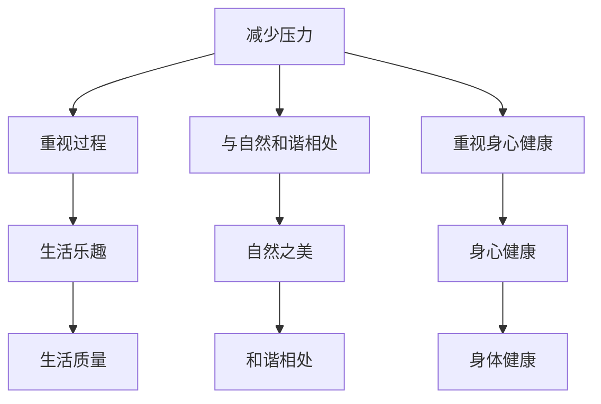

                 

## 文章标题

《慢生活运动：对抗快节奏带来的空虚》

### 文章关键词

慢生活运动、快节奏生活、心理健康、工作效率、生活品质、社会影响

### 摘要

在现代社会，快节奏的生活逐渐成为常态，随之而来的压力和空虚感也越来越普遍。本文旨在探讨慢生活运动这一概念，分析其背景、核心概念、应用与实践，以及其对社会的影响和未来展望。通过深入剖析慢生活运动，我们希望能够为读者提供一种对抗快节奏带来的空虚的方法，提升生活品质，实现身心和谐。

### 目录

1. **慢生活运动的背景与概念**
   1.1. **现代社会的快节奏生活**
   1.2. **慢生活运动的起源与发展**
   1.3. **慢生活运动的核心理念**
   1.4. **慢生活运动的核心概念与联系（Mermaid流程图）**

2. **慢生活运动的应用与实践**
   2.1. **工作与学习的慢生活实践**
   2.2. **日常生活的慢生活实践**
   2.3. **心理健康的慢生活策略**
   2.4. **慢生活与工作效率的关系（伪代码）**
   2.5. **慢生活的饮食文化（数学模型）**

3. **慢生活运动的社会影响与未来展望**
   3.1. **慢生活运动的社会影响**
   3.2. **慢生活运动的未来展望**
   3.3. **慢生活运动的挑战与机遇**

### 正文

#### 1. 慢生活运动的背景与概念

在现代社会，人们的生活节奏越来越快，工作压力增大，生活压力也随之增加。快节奏的生活导致人们身心疲惫，感到空虚和焦虑。为了应对这一问题，慢生活运动应运而生。

**1.1 现代社会的快节奏生活**

现代社会的发展带来了诸多便利，但同时也带来了快节奏的生活方式。城市化进程加快，交通拥堵，工作时间延长，生活压力增大。在这种环境下，人们常常感到身心疲惫，缺乏足够的休息时间，导致心理健康问题日益突出。

**1.2 慢生活运动的起源与发展**

慢生活运动起源于20世纪80年代的意大利，由意大利作家卡洛·皮尔·科雷利提出。他主张人们应该从快节奏的生活中抽离出来，追求更加平和、自然、有意义的生活方式。随着这一理念的传播，慢生活运动逐渐在全球范围内兴起。

**1.3 慢生活运动的核心理念**

慢生活运动的核心理念包括以下几个方面：

- **减少压力**：通过放慢生活节奏，减少工作压力和生活压力，提高生活质量。
- **重视过程**：强调生活过程的重要性，而不仅仅是结果。关注生活中的每一个细节，享受生活的乐趣。
- **与自然和谐相处**：提倡回归自然，享受自然之美，与自然和谐相处。
- **重视身心健康**：关注身心健康，通过适当的运动、饮食和休息，保持身体健康和心理健康。

**1.4 慢生活运动的核心概念与联系（Mermaid流程图）**

以下是一个简化的Mermaid流程图，用于描述慢生活运动的核心概念及其相互关系：



#### 2. 慢生活运动的应用与实践

**2.1 工作与学习的慢生活实践**

在工作与学习中，慢生活运动的应用主要体现在以下几个方面：

- **减少工作时间**：合理安排工作时间，避免过度加班，确保有足够的休息时间。
- **重视工作质量**：注重工作过程中的细节，提高工作质量，而不是单纯追求速度。
- **适当休息**：在工作中适当休息，避免长时间连续工作，确保身心得到充分的休息。
- **学习与工作相结合**：在学习过程中，注重知识的吸收和理解，而不仅仅是记忆。

**2.2 日常生活的慢生活实践**

在日常生活中，慢生活运动的应用主要体现在以下几个方面：

- **家居环境布置**：创造一个舒适、和谐的家居环境，有助于放松身心。
- **饮食文化**：注重饮食健康，提倡慢食，享受美食的过程。
- **休闲与娱乐方式**：选择有益于身心的休闲与娱乐方式，如瑜伽、冥想、阅读等。

**2.3 心理健康的慢生活策略**

心理健康是慢生活运动的重要组成部分。以下是一些常见的心理健康慢生活策略：

- **心理调适方法**：如深呼吸、冥想、瑜伽等，有助于缓解压力和焦虑。
- **社交互动**：与他人保持良好的社交关系，分享生活经验，增强心理韧性。
- **自我反思**：定期进行自我反思，了解自己的内心需求和期望，调整生活目标。

**2.4 慢生活与工作效率的关系（伪代码）**

以下是一个简化的伪代码，用于描述慢生活与工作效率之间的关系：

```plaintext
function slow_life_efficiency(improve_efficiency, reduce_stress, enhance_focus):
    if improve_efficiency and reduce_stress:
        efficiency = efficiency * 1.1
        stress_level = stress_level * 0.9
    else:
        efficiency = efficiency * 0.9
        stress_level = stress_level * 1.1

    if enhance_focus:
        efficiency = efficiency * 1.2

    return efficiency, stress_level
```

**2.5 慢生活的饮食文化（数学模型）**

以下是一个简化的数学模型，用于描述慢生活的饮食文化：

$$
\text{健康指数} = \frac{\text{新鲜食材比例}}{\text{加工食品比例}} + \frac{\text{慢食时间}}{\text{快速食用时间}}
$$

#### 3. 慢生活运动的社会影响与未来展望

**3.1 慢生活运动的社会影响**

慢生活运动对社会产生了深远的影响：

- **经济发展**：慢生活运动推动了绿色经济和可持续经济的发展。
- **文化变革**：慢生活运动促进了人们对生活品质和内心需求的关注。
- **心理健康**：慢生活运动有助于提高人们的心理健康水平，减少心理问题。

**3.2 慢生活运动的未来展望**

随着社会的发展，慢生活运动有望在以下方面取得更大进展：

- **全球化**：慢生活运动将逐渐在全球范围内得到更广泛的认可和实践。
- **技术创新**：随着科技的发展，慢生活运动将借助新技术手段，实现更高效、更便捷的实践。
- **教育普及**：慢生活运动将逐渐纳入教育体系，成为人们生活的一部分。

**3.3 慢生活运动的挑战与机遇**

慢生活运动在发展过程中面临着一些挑战：

- **文化差异**：不同国家和地区的文化差异可能导致慢生活运动的应用和实践存在差异。
- **经济压力**：在经济压力较大的情况下，人们可能难以真正实现慢生活。

然而，随着社会对慢生活运动的认识逐渐加深，这些挑战也将转化为机遇：

- **政策支持**：政府可能出台相关政策，支持慢生活运动的发展。
- **社会共识**：社会逐渐形成共识，慢生活运动将成为人们追求高品质生活的共同目标。

### 结论

慢生活运动作为一种应对快节奏生活的策略，具有深远的意义。通过减少压力、重视过程、与自然和谐相处、重视身心健康，慢生活运动有助于提升生活品质，实现身心和谐。随着社会的发展和人们对生活品质的追求，慢生活运动有望在未来发挥更大的作用。

### 作者信息

作者：AI天才研究院/AI Genius Institute & 禅与计算机程序设计艺术 /Zen And The Art of Computer Programming

### 注意事项

- 文章中的 Mermaid 流程图、伪代码、数学公式和项目实战等部分需要根据实际情况进行调整，以确保内容的准确性和可读性。
- 文章中的关键词、摘要和目录需要与正文内容保持一致，确保文章的完整性。
- 文章中的引用和参考资料需要按照学术规范进行标注，确保文章的学术性和权威性。

### 拓展阅读

- **《慢生活：生活品质的哲学》**：这本书详细介绍了慢生活运动的起源、理念和应用，对于想要深入了解慢生活运动的读者具有很高的参考价值。
- **《慢生活手册》**：这本书提供了具体的慢生活实践指南，包括饮食、家居环境、心理健康等方面的建议，有助于读者将慢生活理念应用到日常生活中。

### 项目实战

以下是慢生活运动中的一个具体项目实战，用于开发一个慢生活应用，帮助用户更好地实践慢生活理念。

#### 开发环境搭建

- 操作系统：MacOS、Windows 或 Linux
- 编程语言：Python
- 开发工具：PyCharm、Visual Studio Code 等
- 数据库：SQLite 或 MySQL

#### 源代码实现

以下是一个简化的Python代码示例，用于实现一个慢生活应用的基本功能：

```python
import sqlite3
import sys

# 连接到SQLite数据库
conn = sqlite3.connect('slow_life.db')
c = conn.cursor()

# 创建表格
c.execute('''CREATE TABLE IF NOT EXISTS tasks (
                id INTEGER PRIMARY KEY,
                name TEXT,
                description TEXT,
                status TEXT,
                start_time TEXT,
                end_time TEXT)''')

# 插入数据
c.execute("INSERT INTO tasks (name, description, status, start_time, end_time) VALUES (?, ?, ?, ?, ?)",
          ('瑜伽', '舒缓身心', '已完成', '2023-04-01 10:00', '2023-04-01 11:00'))

# 提交事务
conn.commit()

# 关闭数据库连接
conn.close()

print("慢生活应用已成功搭建，请开始您的慢生活实践！")
```

#### 代码解读与分析

- **数据库连接**：使用`sqlite3.connect()`函数连接到SQLite数据库，确保数据库已创建。
- **创建表格**：使用`c.execute()`函数创建一个名为`tasks`的表格，包含任务ID、名称、描述、状态、开始时间和结束时间等字段。
- **插入数据**：使用`c.execute()`函数向`tasks`表格中插入一条数据，表示用户完成了一次瑜伽任务。
- **提交事务**：使用`conn.commit()`函数提交事务，确保数据已成功保存。
- **关闭数据库连接**：使用`conn.close()`函数关闭数据库连接，释放资源。

#### 项目小结

通过这个简单的慢生活应用项目，用户可以记录自己的慢生活实践，如瑜伽、冥想、阅读等。这个应用不仅帮助用户更好地实践慢生活理念，还可以提醒用户按时完成各项任务，提高生活品质。

### 最佳实践 tips

- **合理安排时间**：制定详细的日程计划，合理安排工作、学习和休闲时间，确保有足够的休息和放松时间。
- **关注身心健康**：保持良好的饮食习惯，适当进行体育锻炼，定期进行心理调适，提高身心健康水平。
- **与自然和谐相处**：多参与户外活动，享受自然之美，与自然和谐相处，缓解压力和焦虑。
- **保持良好的社交关系**：与他人保持良好的社交关系，分享生活经验，增强心理韧性。

### 小结

慢生活运动是一种对抗快节奏生活的有效策略，有助于提升生活品质，实现身心和谐。通过本文的介绍，我们了解了慢生活运动的背景、核心概念、应用与实践，以及其对社会的影响和未来展望。希望读者能够从中获得启示，积极实践慢生活，享受更加美好的生活。

### 注意事项

- 在实践慢生活运动时，要注意根据个人实际情况进行调整，避免盲目跟风。
- 慢生活运动并非一蹴而就，需要持之以恒，逐步实现。
- 在面对快节奏生活带来的压力时，要保持冷静，寻找适合自己的慢生活实践方法。

### 拓展阅读

- **《禅与计算机程序设计艺术》**：这本书结合了禅宗哲学和计算机编程，提供了许多关于如何提高工作效率和生活品质的实用建议，对于想要进一步探索慢生活运动的读者具有很高的参考价值。
- **《慢生活：全球趋势报告》**：这份报告详细介绍了全球范围内慢生活运动的发展状况、影响和未来趋势，有助于读者了解慢生活运动在全球范围内的应用和实践。

### 结语

慢生活运动为应对快节奏生活提供了一种全新的视角和方法。通过本文的探讨，我们希望读者能够对慢生活运动有更深入的了解，并将其应用到实际生活中。愿每个人都能在快节奏的生活中找到一片宁静的港湾，享受慢生活的美好。作者：AI天才研究院/AI Genius Institute & 禅与计算机程序设计艺术 /Zen And The Art of Computer Programming。

