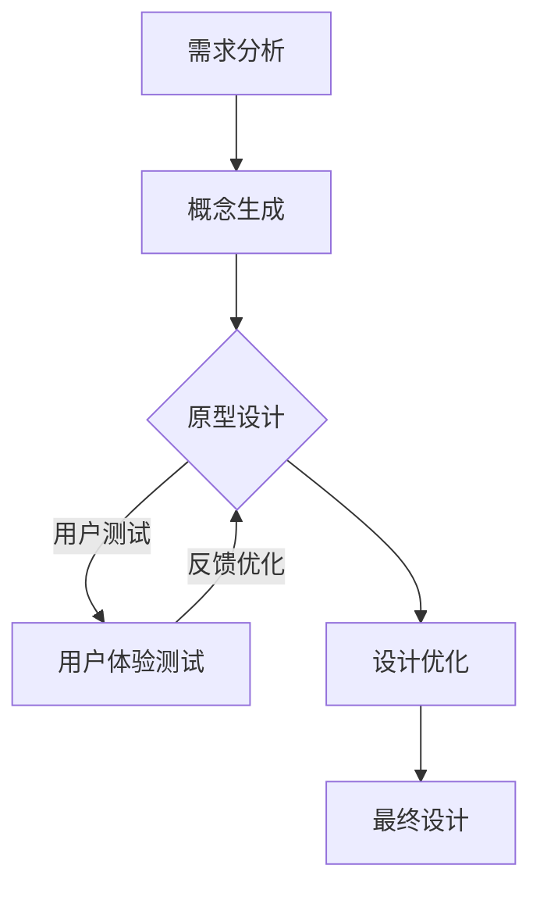
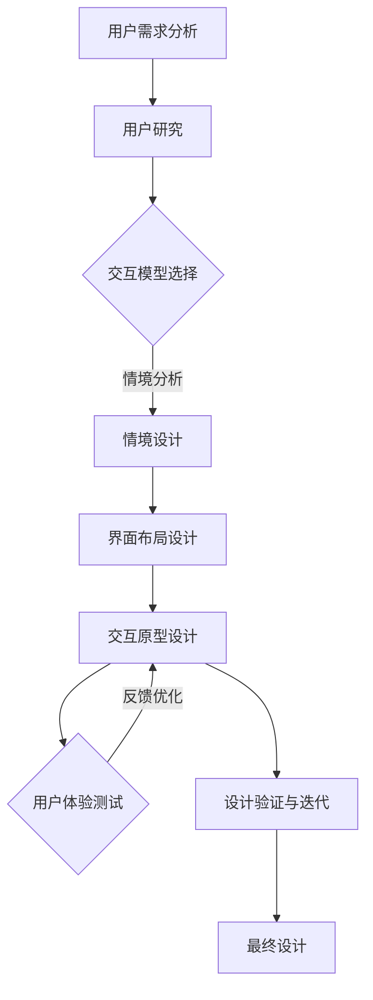

                 

### 文章标题

# 慢科技产品设计：以人为本的技术创新

### 关键词

- 慢科技
- 人性化设计
- 技术创新
- 用户体验
- 人机交互
- 设计方法论

### 摘要

本文深入探讨了慢科技产品设计的重要性及其与人性化设计的紧密结合。文章首先介绍了慢科技的定义和价值，接着阐述了人性化设计的核心理念。通过分析慢科技产品设计的理论基础，本文提出了用户体验设计与人机交互设计的关键性，并详细阐述了设计方法论的应用。文章进一步讨论了核心算法与数学模型、开发与实现、用户体验测试与优化，以及未来趋势与发展方向。通过具体项目实战案例，本文展示了慢科技产品设计的实际应用与效果，为读者提供了丰富的实践经验和指导。

## 引言：慢科技与人性化设计的时代背景

在科技迅猛发展的今天，人们逐渐意识到快节奏的生活模式带来的负面影响，慢科技应运而生。慢科技，顾名思义，强调的是科技发展的速度与质量，倡导“慢下来”的理念，以人性化、可持续和环保为核心。与传统追求速度和效率的快科技相比，慢科技更注重用户需求和体验，追求更深层次的科技创新和设计。

### 1.1 慢科技的定义与价值

慢科技的定义不仅仅是指速度慢，更强调一种生活方式和价值观念的转变。慢科技主张：

1. **注重用户需求：** 慢科技产品在设计过程中，将用户需求放在首位，深入挖掘用户痛点和需求，从而提供更加符合用户期望的产品。
2. **重视可持续发展：** 慢科技倡导在产品设计和制造过程中，尽可能减少对环境的负面影响，采用绿色、可持续的材料和技术。
3. **强调用户体验：** 慢科技产品注重用户的使用体验，通过人性化的设计，使产品更加易用、舒适和愉悦。

慢科技的价值体现在以下几个方面：

1. **提升生活质量：** 慢科技产品通过优化设计和提高用户体验，使用户能够在快节奏的生活中找到平衡，提升生活质量和幸福感。
2. **促进技术创新：** 慢科技鼓励深入研究和探索新技术，推动技术进步和创新发展。
3. **实现可持续发展：** 慢科技倡导环保和可持续理念，有助于实现资源的有效利用和环境的保护。

### 1.2 人性化设计的理念与实践

人性化设计是慢科技产品设计的重要理念之一，其核心在于将人的需求和感受融入产品设计中，使产品更加符合人的行为习惯和情感需求。人性化设计的理念可以概括为以下几点：

1. **以人为本：** 人性化设计强调以用户为中心，关注用户的体验和感受，从用户的角度出发进行设计。
2. **易用性：** 人性化设计注重产品的易用性，通过简洁明了的设计和操作，降低用户的学习成本和使用难度。
3. **情感共鸣：** 人性化设计在产品中融入情感元素，使产品与用户产生情感共鸣，提升用户的满意度和忠诚度。
4. **可持续性：** 人性化设计关注产品的环保和可持续性，通过减少资源消耗和环境影响，实现绿色设计。

人性化设计的实践包括以下步骤：

1. **用户研究：** 通过用户访谈、问卷调查等方法，深入了解用户的需求、行为和偏好。
2. **设计原型：** 根据用户研究的结果，构建设计原型，通过迭代和反馈不断完善设计。
3. **用户测试：** 在设计过程中进行用户测试，收集用户反馈，验证设计的有效性和可行性。
4. **持续优化：** 根据用户测试的结果，持续优化设计，提高产品的用户体验。

### 1.3 慢科技与人性化设计的结合点

慢科技与人性化设计的结合点在于二者共同追求的目标：以人为本和可持续发展。慢科技强调慢节奏和高质量，而人性化设计注重用户需求和情感体验。这两者的结合，使得慢科技产品设计更加注重用户的实际需求和使用体验，从而实现以下效果：

1. **提升产品价值：** 通过人性化设计，慢科技产品能够更好地满足用户需求，提高产品的实用价值和市场竞争力。
2. **增强用户体验：** 慢科技产品设计注重用户体验，通过优化界面、操作流程和交互设计，提高产品的易用性和用户满意度。
3. **推动技术创新：** 慢科技鼓励深入研究和探索新技术，人性化设计则通过关注用户需求和体验，推动技术创新和设计优化。
4. **实现可持续发展：** 慢科技与人性化设计的结合，有助于在产品设计和制造过程中实现环保和可持续发展目标。

综上所述，慢科技与人性化设计的结合，为科技产品的创新提供了新的思路和方法，为用户带来了更加优质、可持续的科技体验。

## 第1章：慢科技产品设计的理论基础

### 1.1 慢科技产品设计的核心概念

慢科技产品设计的核心理念在于将人性化、可持续和环保的理念融入产品设计和开发的全过程，从而创造出更加符合用户需求和价值观的产品。在这一节中，我们将详细探讨慢科技产品设计中的几个核心概念。

#### 1.1.1 慢科技的定义

慢科技（Slow Tech）是一种不同于快科技的科技发展模式。它倡导科技发展的速度不应盲目追求，而应关注科技的质量、可持续性和用户需求。慢科技强调在产品设计和制造过程中，减少对环境的负面影响，采用绿色、可持续的材料和技术，同时注重用户的长期体验和幸福感。

慢科技的定义可以从以下几个方面进行理解：

1. **用户需求导向：** 慢科技产品设计以用户需求为核心，深入挖掘用户需求，提供真正解决用户问题的产品。
2. **可持续发展：** 慢科技倡导在产品设计和制造过程中，尽可能减少资源消耗和环境污染，实现生态平衡和可持续发展。
3. **科技质量优先：** 慢科技强调科技产品的质量和性能，而非仅仅追求功能上的创新和快速迭代。
4. **慢节奏与高品质：** 慢科技产品追求高品质的用户体验，通过人性化的设计，使产品使用起来更加舒适、轻松。

#### 1.1.2 人性化设计的原则

人性化设计（Human-Centered Design）是慢科技产品设计的核心原则之一，它强调将人的需求、行为和感受融入产品设计中，使产品更加符合人的使用习惯和情感需求。人性化设计的原则包括：

1. **以人为本：** 人性化设计始终以用户为中心，关注用户的实际需求和使用体验，将用户的需求和感受放在首位。
2. **易用性：** 人性化设计注重产品的易用性，通过简洁明了的设计和操作流程，降低用户的学习成本和使用难度。
3. **情感共鸣：** 人性化设计在产品中融入情感元素，使产品与用户产生情感共鸣，提升用户的满意度和忠诚度。
4. **可持续性：** 人性化设计关注产品的环保和可持续性，通过减少资源消耗和环境影响，实现绿色设计。

#### 1.1.3 设计方法论在慢科技中的应用

设计方法论（Design Methodology）是指导产品设计和开发的一系列原则和流程，它帮助设计师系统地思考和解决问题。在慢科技产品设计中，设计方法论的应用尤为重要，因为它能够确保产品设计和开发过程的科学性和系统性。以下是设计方法论在慢科技产品中的应用：

1. **用户研究：** 通过用户访谈、问卷调查、用户行为分析等方法，深入了解用户的需求、行为和偏好，为产品设计提供依据。
2. **设计思维：** 设计思维（Design Thinking）是一种以用户需求为导向的系统化设计方法，强调创意思维、迭代和用户体验。它适用于慢科技产品设计，帮助设计师从用户角度出发，解决复杂问题。
3. **原型设计与迭代：** 原型设计是慢科技产品设计的重要环节，通过构建原型，设计师可以快速验证设计想法，并根据用户反馈进行迭代优化。
4. **用户体验测试：** 在设计过程中，进行用户体验测试，收集用户反馈，验证设计的有效性和可行性，确保最终产品能够满足用户需求。
5. **持续优化：** 慢科技产品设计不是一次性的过程，而是一个持续优化的过程。通过不断收集用户反馈和市场信息，设计师可以不断改进产品，提升用户体验。

### 1.2 设计方法论在慢科技中的应用

设计方法论在慢科技产品中的应用具有以下几个关键步骤：

1. **需求分析：** 通过用户研究和市场调研，深入了解用户需求和竞争对手的产品，明确产品的目标用户和设计目标。
2. **概念生成：** 根据需求分析的结果，提出多个设计概念，进行头脑风暴和创意思维，形成初步设计方案。
3. **原型设计：** 基于概念生成，构建初步的原型设计，通过用户测试和迭代，不断完善设计。
4. **用户体验测试：** 在设计过程中，定期进行用户体验测试，收集用户反馈，验证设计的有效性和可行性。
5. **设计优化：** 根据用户体验测试的结果，对设计进行优化，确保最终产品能够满足用户需求。

设计方法论的应用，使慢科技产品设计过程更加科学和系统，有助于设计师更好地理解用户需求，提高产品设计质量，实现科技创新和人性化设计的有机结合。

### 1.3 Mermaid流程图：慢科技产品设计流程

为了更好地展示慢科技产品设计的整体流程，我们可以使用Mermaid流程图来描述。以下是慢科技产品设计流程的Mermaid表示：



图1：慢科技产品设计流程图

在该流程图中，需求分析是产品设计的起点，通过用户研究和市场调研，明确产品的目标用户和设计目标。接着进行概念生成，提出多个设计概念，进行头脑风暴和创意思维。然后进入原型设计阶段，构建初步的原型设计，并通过用户测试和迭代，不断完善设计。在用户体验测试阶段，收集用户反馈，验证设计的有效性和可行性。根据用户体验测试的结果，进行设计优化，最终形成最终的设计方案。

通过这个Mermaid流程图，我们可以清晰地看到慢科技产品设计的整体流程和关键环节，有助于设计师更好地理解和应用设计方法论，实现慢科技产品的人性化设计和技术创新。

## 第2章：用户体验设计与慢科技产品

### 2.1 用户体验设计的重要性

用户体验设计（User Experience Design，简称UX设计）是慢科技产品设计中的核心环节，它直接影响到产品的可用性、易用性和用户满意度。用户体验设计的重要性体现在以下几个方面：

#### 2.1.1 用户体验的定义

用户体验（User Experience，简称UX）是指用户在使用产品过程中所感受到的整体感受和体验，包括情感、行为和认知等方面。用户体验不仅关注产品的功能性，还关注用户在使用过程中的愉悦感、舒适度和满足感。

#### 2.1.2 用户体验设计的目标

用户体验设计的目标是创造一个使产品易于使用、操作流畅且符合用户预期的环境。具体目标包括：

1. **可用性（Usability）：** 产品应易于使用，用户可以轻松完成所需任务。
2. **易用性（Usefulness）：** 产品应满足用户的实际需求，解决用户的问题。
3. **用户体验（Experience）：** 产品应给用户带来愉悦和满意的使用体验。
4. **可访问性（Accessibility）：** 产品应适应不同用户的需求，包括老年人、残障人士等。

#### 2.1.3 用户体验设计的重要性

用户体验设计在慢科技产品设计中具有重要意义，主要体现在以下几个方面：

1. **提升产品价值：** 通过优化用户体验，产品能够更好地满足用户需求，提升产品的实用价值和市场竞争力。
2. **增强用户忠诚度：** 优质的用户体验能够增强用户的满意度和忠诚度，降低用户流失率。
3. **降低开发成本：** 通过早期用户测试和反馈，及时发现问题并进行优化，可以减少后续的开发成本和修复成本。
4. **提升品牌形象：** 用户体验良好的产品能够提升品牌形象，增强用户对品牌的信任和忠诚。
5. **实现可持续发展：** 用户体验设计关注环保和可持续性，有助于实现资源的有效利用和环境的保护。

### 2.2 用户研究在慢科技产品中的应用

用户研究是用户体验设计的基石，通过对目标用户进行深入研究，设计师能够更好地理解用户需求和行为，从而进行有针对性的产品设计。在慢科技产品设计中，用户研究的应用尤为重要，主要体现在以下几个方面：

#### 2.2.1 用户访谈与问卷调研

用户访谈和问卷调研是常用的用户研究方法，通过直接与用户交流，获取用户的第一手信息。

1. **用户访谈：** 用户访谈是一种深入挖掘用户需求和行为的方法，通过与用户面对面交流，了解用户的真实想法和感受。访谈过程中，可以使用半结构化或开放式问题，引导用户分享他们的使用习惯、痛点和需求。
2. **问卷调研：** 问卷调研是一种大规模收集用户意见的方法，可以通过在线平台或纸质问卷的形式进行。问卷设计应简洁明了，避免过长和复杂的问题，确保用户愿意完成并提交问卷。

#### 2.2.2 用户行为数据分析

用户行为分析是一种通过分析用户在产品中的行为数据，了解用户使用习惯和需求的方法。在慢科技产品设计中，用户行为数据分析可以帮助设计师发现潜在的用户痛点和改进机会。

1. **数据分析工具：** 常用的用户行为分析工具有 Google Analytics、Mixpanel、Quantcast 等，这些工具可以收集和分析用户在产品中的行为数据，包括页面访问、点击、转化等。
2. **数据指标：** 用户行为分析的关键指标包括页面访问量、用户留存率、转化率、用户活跃度等，通过这些指标，设计师可以评估产品的用户体验和效果。

#### 2.2.3 用户研究的方法与技巧

进行有效的用户研究需要掌握一定的方法和技巧，以下是一些常用的方法和技巧：

1. **用户故事映射：** 通过用户故事映射，将用户的需求、痛点和行为进行可视化，帮助设计师更好地理解用户的全貌。
2. **情景模拟：** 通过情景模拟，将用户置于特定的使用场景中，观察他们的行为和反应，了解用户在使用过程中的痛点。
3. **A/B测试：** 通过A/B测试，对比不同设计方案的优劣，选择更符合用户需求的设计方案。
4. **用户反馈收集：** 通过在线调查、用户论坛、社交媒体等方式，收集用户的反馈和建议，及时了解用户的需求和意见。

通过有效的用户研究，慢科技产品设计可以更好地满足用户需求，提升用户体验，实现产品的可持续发展和创新。

### 2.3 用户体验设计工具与方法

在慢科技产品设计中，用户体验设计工具和方法的合理运用对于提升产品易用性和用户满意度至关重要。以下介绍几种常用的用户体验设计工具和方法。

#### 2.3.1 原型设计与迭代

原型设计是用户体验设计的重要步骤，通过构建产品的初步原型，设计师可以快速验证设计思路和用户需求。

1. **低 fidelity原型：** 低 fidelity原型是一种简单、粗糙的视觉表示，主要用于探索和验证设计概念。常见的低 fidelity原型工具有 Sketch、Adobe XD 等。
2. **高 fidelity原型：** 高 fidelity原型是一种精细、详尽的视觉表示，接近最终产品的外观和交互效果。常见的高 fidelity原型工具有 Figma、Adobe XD 等。
3. **迭代设计：** 在原型设计过程中，设计师应通过迭代和反馈不断优化设计。每次迭代都应基于用户反馈和市场调研结果，确保设计更符合用户需求。

#### 2.3.2 交互设计原则与实践

交互设计是用户体验设计的重要组成部分，其目的是确保产品与用户之间的交互流畅、直观和愉悦。

1. **一致性（Consistency）：** 交互设计应保持一致性，包括界面布局、颜色、字体等元素，使用户在使用过程中能够快速适应。
2. **简洁性（Simplicity）：** 交互设计应尽量简洁，避免复杂的操作和冗余的信息，降低用户的学习成本。
3. **反馈（Feedback）：** 交互设计应提供及时的反馈，包括操作成功、错误提示等，使用户了解当前操作的状态。
4. **易用性（Usability）：** 交互设计应注重易用性，确保用户能够轻松完成所需任务，提高操作效率。

#### 2.3.3 设计工具与应用

以下介绍几种常用的用户体验设计工具及其应用：

1. **Sketch：** Sketch是一款强大的界面设计工具，适用于创建高 fidelity原型和界面设计。它支持矢量绘图、组件库和符号功能，设计流程高效。
2. **Adobe XD：** Adobe XD 是一款功能全面的用户体验设计工具，适用于创建低 fidelity原型、高 fidelity原型和交互设计。它支持实时协作和原型测试功能。
3. **Figma：** Figma 是一款基于云的界面设计和原型设计工具，支持多人协作和实时预览功能。它具有丰富的组件和插件库，设计灵活。

通过合理运用这些用户体验设计工具和方法，慢科技产品设计师可以提升产品的易用性和用户体验，实现技术创新和人性化设计的有机结合。

## 第3章：人机交互设计与慢科技产品

### 3.1 人机交互设计的基本原理

人机交互设计（Human-Computer Interaction Design，简称HCI设计）是慢科技产品设计中的重要环节，它关注的是用户与产品之间的互动方式，以及如何通过设计优化这种互动，提升用户体验。人机交互设计的基本原理包括以下几个核心概念：

#### 3.1.1 人机交互模型的分类

人机交互模型是描述用户与计算机系统之间交互方式的理论框架。常见的交互模型包括：

1. **认知模型：** 认知模型关注用户在交互过程中的思维和认知过程，包括信息的获取、处理和记忆。该模型强调用户在交互过程中的主动性和思维逻辑。
2. **行为模型：** 行为模型关注用户在交互过程中的行为动作，包括鼠标点击、键盘输入等。该模型强调用户与产品之间的物理互动。
3. **情境模型：** 情境模型关注用户在特定情境下的交互需求和行为，包括用户的使用环境、任务目标等。该模型强调用户与产品之间的情境关联。

#### 3.1.2 交互设计中的用户体验要素

用户体验是交互设计的核心，它包括以下几个关键要素：

1. **易用性（Usability）：** 易用性是指产品是否容易使用，用户能否在短时间内学会并熟练操作。提高易用性可以通过简化操作流程、提供明确的反馈等方式实现。
2. **可用性（Usability）：** 可用性是指产品的功能是否满足用户需求，用户能否高效地完成任务。提高可用性可以通过深入研究用户需求、提供全面的功能支持等方式实现。
3. **用户满意度（User Satisfaction）：** 用户满意度是指用户在使用产品过程中感受到的满意程度。提高用户满意度可以通过优化界面设计、提升操作体验等方式实现。
4. **情感体验（Emotional Experience）：** 情感体验是指用户在使用产品过程中产生的情感感受。优化情感体验可以通过设计富有情感元素、提供愉悦的互动体验等方式实现。

#### 3.1.3 交互设计的原则

交互设计应遵循以下原则，以确保用户与产品之间的互动流畅、自然和愉悦：

1. **一致性（Consistency）：** 保持界面风格、操作逻辑和反馈机制的一致性，使用户在使用过程中能够快速适应。
2. **简洁性（Simplicity）：** 界面设计应简洁明了，避免复杂和冗余的信息，降低用户的学习成本。
3. **反馈（Feedback）：** 提供及时的反馈，包括操作成功、错误提示等，使用户了解当前操作的状态。
4. **可控性（Controllability）：** 用户应能够随时控制和调整产品功能，提高操作的自由度和灵活性。
5. **适应性（Adaptability）：** 产品应能够适应不同用户的需求和使用环境，提供个性化的互动体验。

通过遵循这些交互设计原则，慢科技产品能够更好地满足用户需求，提升用户体验，实现技术创新和人性化设计的有机结合。

### 3.2 慢科技产品中的人机交互设计

在慢科技产品中，人机交互设计扮演着至关重要的角色，它不仅决定了产品的可用性和易用性，还直接影响到用户的满意度和忠诚度。下面我们将探讨慢科技产品中的人机交互设计原则和最佳实践。

#### 3.2.1 设计原则与最佳实践

1. **用户为中心的设计（User-Centered Design）：**
   - **原则：** 用户为中心的设计强调以用户的需求和体验为核心，所有设计决策都应基于用户研究和用户反馈。
   - **实践：** 在设计过程中，通过用户访谈、问卷调查、用户行为分析等方法，深入了解用户的需求、行为和偏好。根据用户反馈，不断优化产品设计。

2. **简洁直观的设计（Simplicity and Clarity）：**
   - **原则：** 界面设计应简洁明了，避免复杂和冗余的信息，使用户能够快速理解和操作。
   - **实践：** 在界面布局上，采用直观的图标和标签，减少不必要的文字描述。通过颜色、字体和排版等元素，突出关键信息和操作按钮。

3. **适应性设计（Adaptive Design）：**
   - **原则：** 交互设计应适应不同的用户需求和使用环境，提供个性化的互动体验。
   - **实践：** 设计灵活的界面布局和交互方式，支持用户自定义设置，如字体大小、主题颜色等。同时，确保产品在多种设备和平台上都能良好运行。

4. **反馈机制（Feedback Mechanisms）：**
   - **原则：** 提供及时、明确的反馈，使用户了解当前操作的状态。
   - **实践：** 在用户操作过程中，通过视觉、听觉和触觉等多感官反馈，确保用户能够即时感知操作结果。例如，操作成功时显示成功动画，操作错误时给出清晰的错误提示。

5. **多通道交互（Multi-Modal Interaction）：**
   - **原则：** 允许用户通过多种交互方式（如触摸、语音、手势等）与产品互动，提高互动的便捷性和趣味性。
   - **实践：** 结合语音识别、手势识别等技术，提供多样化的交互方式，满足不同用户的偏好和需求。例如，智能家居设备可以通过语音控制、触摸屏和遥控器等多种方式与用户互动。

6. **可持续性和环保性（Sustainability and Environmental Friendliness）：**
   - **原则：** 交互设计应考虑产品的可持续性和环保性，减少资源消耗和环境影响。
   - **实践：** 在产品设计和制造过程中，采用绿色、可持续的材料和技术。通过优化能源消耗和资源利用，降低产品的碳足迹。

#### 3.2.2 案例分析：成功的人机交互设计

以下是一个成功的人机交互设计案例，通过分析该案例，我们可以了解如何在慢科技产品中实现人性化设计。

**案例：苹果公司的iPhone**

1. **用户为中心的设计：**
   - 苹果公司的iPhone在设计过程中，始终关注用户的需求和体验。通过用户访谈、市场调研和用户反馈，苹果不断优化产品功能和交互设计，确保产品能够满足用户的实际需求。

2. **简洁直观的设计：**
   - iPhone的界面设计简洁直观，通过清晰的图标和标签，用户可以快速理解和使用各种功能。同时，苹果公司采用了统一的界面风格和操作逻辑，使用户在多个产品之间能够无缝切换。

3. **适应性设计：**
   - iPhone支持多种屏幕尺寸和分辨率，能够适应不同用户的需求和使用环境。用户可以通过自定义设置，调整字体大小、亮度等，使产品更加符合个人偏好。

4. **反馈机制：**
   - 在用户操作过程中，iPhone提供了及时的视觉和听觉反馈，确保用户能够即时感知操作结果。例如，解锁屏幕时，用户会听到清脆的“滴”声和看到动画效果。

5. **多通道交互：**
   - iPhone支持多种交互方式，如触摸屏、手势操作和语音控制。用户可以通过滑动、捏合、双击等手势，轻松完成各种操作。同时，Siri语音助手为用户提供了一种便捷的交互方式，使得用户可以在开车、手忙脚乱时依然能够与手机进行有效互动。

6. **可持续性和环保性：**
   - 苹果公司在产品设计和制造过程中，注重可持续性和环保性。例如，iPhone采用了环保材料，减少了塑料使用，并通过优化电池寿命和能源效率，降低了产品的碳足迹。

通过以上案例分析，我们可以看到，成功的人机交互设计不仅注重用户需求和体验，还结合了简洁直观的设计、适应性设计、反馈机制、多通道交互和可持续性设计等原则。这些原则的贯彻实施，使得iPhone成为一款用户体验卓越的慢科技产品。

总之，在人机交互设计中，设计师应始终以用户为中心，关注用户需求和行为，通过简洁直观、适应性、反馈机制、多通道交互和可持续性等设计原则，提升产品的用户体验和满意度。只有这样，慢科技产品才能在竞争激烈的市场中脱颖而出，赢得用户的青睐。

### 3.3 Mermaid流程图：人机交互设计流程

为了更好地展示人机交互设计的整体流程，我们可以使用Mermaid流程图来描述。以下是人机交互设计流程的Mermaid表示：



图2：人机交互设计流程图

在该流程图中，用户需求分析是交互设计的起点，通过用户研究和情境分析，设计师能够深入了解用户需求和交互场景。接着进行界面布局设计和交互原型设计，通过用户体验测试和反馈优化，不断迭代和改进设计。最后，进行设计验证和迭代，确保最终设计符合用户需求和期望。

通过这个Mermaid流程图，我们可以清晰地看到人机交互设计的整体流程和关键环节，有助于设计师更好地理解和应用人机交互设计的方法和原则，实现慢科技产品的人性化设计和技术创新。

## 第4章：慢科技产品的核心算法与数学模型

### 4.1 算法原理与伪代码

在慢科技产品设计中，算法是实现功能的核心，它决定了产品的性能、效率和用户体验。算法原理的理解和运用对于慢科技产品的设计至关重要。以下我们将介绍几个常用的算法原理，并使用伪代码详细阐述其实现过程。

#### 4.1.1 常见算法简介

1. **排序算法：** 排序算法用于将一组数据按照特定规则进行排序。常见的排序算法包括冒泡排序、选择排序、插入排序、快速排序等。
2. **搜索算法：** 搜索算法用于在数据结构中查找特定元素。常见的搜索算法包括线性搜索、二分搜索等。
3. **图算法：** 图算法用于解决与图相关的问题，如最短路径、拓扑排序、最小生成树等。

#### 4.1.2 算法伪代码展示

1. **冒泡排序算法：**
    ```python
    BUBBLE_SORT(A)
        for i = 1 to n-1
            for j = 1 to n-i
                if A[j] > A[j+1]
                    swap(A[j], A[j+1])
    ```
    冒泡排序算法通过多次遍历数组，比较相邻元素并交换位置，从而实现数组的升序排序。

2. **二分搜索算法：**
    ```python
    BINARY_SEARCH(A, x)
        low = 0
        high = n-1
        while low <= high
            mid = (low + high) / 2
            if A[mid] == x
                return mid
            else if A[mid] < x
                low = mid + 1
            else
                high = mid - 1
        return -1
    ```
    二分搜索算法通过将搜索区间不断缩小，实现高效的数据查找。

3. **图最短路径算法：**
    ```python
    DIJKSTRA(G, s)
        create empty set S
        create a priority queue Q
        for each vertex v in G
            dist[v] = INFINITY
            except for the start vertex s where dist[s] = 0
        Q.insert(s)
        while Q is not empty
            u = Q.remove()
            S.add(u)
            for each neighbor v of u
                if dist[v] > dist[u] + weight(u, v)
                    dist[v] = dist[u] + weight(u, v)
                    Q.insert(v)
    ```
    Dijkstra算法用于计算图中从起始顶点到其他各顶点的最短路径。

通过这些算法伪代码的实现，我们可以更好地理解算法的基本原理和逻辑，为慢科技产品功能的设计和实现提供技术支持。

### 4.2 数学模型在慢科技产品中的应用

数学模型是慢科技产品设计中重要的一部分，它能够帮助我们更好地理解和分析复杂系统的行为。以下介绍几种常用的数学模型及其在慢科技产品中的应用。

#### 4.2.1 数学公式与应用

1. **线性回归模型：**
    线性回归模型用于分析变量之间的线性关系。其公式为：
    $$y = ax + b$$
    其中，$y$ 是因变量，$x$ 是自变量，$a$ 和 $b$ 是模型的参数。线性回归模型在慢科技产品设计中，可以用于预测用户行为、优化资源分配等。

2. **逻辑回归模型：**
    逻辑回归模型用于分析二分类问题，其公式为：
    $$P(y=1) = \frac{1}{1 + e^{-(ax + b)} }$$
    其中，$P(y=1)$ 是因变量为1的概率，$a$ 和 $b$ 是模型的参数。逻辑回归模型在慢科技产品设计中，可以用于用户行为预测、推荐系统等。

3. **马尔可夫模型：**
    马尔可夫模型用于描述系统的状态转移。其公式为：
    $$P(X_t = j|X_{t-1} = i) = P_{ij}$$
    其中，$X_t$ 是当前状态，$X_{t-1}$ 是前一状态，$P_{ij}$ 是从状态 $i$ 转移到状态 $j$ 的概率。马尔可夫模型在慢科技产品设计中，可以用于预测用户行为、优化系统性能等。

#### 4.2.2 举例说明与计算过程

以下以线性回归模型为例，介绍其计算过程和应用。

**例子：** 假设我们想要预测用户的购买行为，基于用户的历史购买记录和浏览行为。我们使用线性回归模型，通过以下数据建立模型：

- $x_1$：用户历史购买数量
- $x_2$：用户浏览数量
- $y$：用户是否购买（1表示购买，0表示未购买）

通过训练数据，我们可以得到线性回归模型的参数 $a$ 和 $b$：

$$y = 0.5x_1 + 0.3x_2 + b$$

**计算过程：**

1. 收集训练数据，计算参数 $a$ 和 $b$。
2. 选择测试数据，计算预测结果。
3. 比较预测结果和实际结果，评估模型性能。

以下是一个简化的计算过程：

```python
# 假设训练数据为：
x1_train = [10, 20, 30, 40, 50]
x2_train = [5, 10, 15, 20, 25]
y_train = [1, 0, 1, 0, 1]

# 计算参数 a 和 b
n = len(x1_train)
a = sum([xi1 * yi for xi1, xi2, yi in zip(x1_train, x2_train, y_train)]) / sum([xi1**2 for xi1 in x1_train])
b = sum(yi - a * xi1 for xi1, yi in zip(x1_train, y_train)) / n

# 选择测试数据
x1_test = 35
x2_test = 12

# 计算预测结果
y_pred = a * x1_test + b * x2_test

# 输出结果
print("预测结果：", y_pred)
```

通过这个例子，我们可以看到线性回归模型的基本计算过程和应用场景。类似地，其他数学模型也可以通过类似的方法进行计算和验证。

总之，数学模型在慢科技产品设计中具有重要的应用价值，通过合理的数学模型，我们可以更好地理解和预测系统行为，为产品设计和优化提供有力的支持。

## 第5章：慢科技产品的开发与实现

### 5.1 开发环境搭建

在开发慢科技产品时，选择合适的开发环境和工具是确保项目顺利进行的关键。以下是搭建开发环境的步骤和工具选择：

#### 5.1.1 开发工具选择

1. **集成开发环境（IDE）：**
   - **Visual Studio Code：** VS Code 是一款免费、开源的跨平台 IDE，支持多种编程语言和开发框架，适合个人和团队使用。
   - **IntelliJ IDEA：** IntelliJ IDEA 是一款功能强大的 IDE，特别适合 Java 和 Kotlin 开发，拥有丰富的插件和智能提示功能。

2. **版本控制系统：**
   - **Git：** Git 是一款广泛使用的分布式版本控制系统，能够有效地管理代码库和版本变更。

3. **数据库：**
   - **MySQL：** MySQL 是一款开源的关系型数据库，适合中小型项目使用。
   - **MongoDB：** MongoDB 是一款开源的文档型数据库，适合处理大量非结构化数据。

4. **前端开发框架：**
   - **React：** React 是一款流行的前端框架，适用于构建动态和用户互动性强的应用程序。
   - **Vue.js：** Vue.js 是一款轻量级的前端框架，易于学习和使用，适合快速开发小型和大型项目。

5. **后端开发框架：**
   - **Spring Boot：** Spring Boot 是一款基于 Java 的后端开发框架，适用于构建高效、可扩展的企业级应用程序。
   - **Django：** Django 是一款基于 Python 的全栈开发框架，适合快速开发 Web 应用程序。

#### 5.1.2 开发流程与规范

1. **项目初始化：**
   - 使用 IDE 创建新项目，配置基本的开发环境。
   - 初始化 Git 仓库，设置版本控制。

2. **需求分析与设计：**
   - 分析项目需求，制定详细的功能设计和数据模型。
   - 设计数据库架构和后端接口，确保系统的扩展性和可维护性。

3. **前端开发：**
   - 使用前端框架搭建 UI 界面，实现页面布局和交互效果。
   - 根据设计稿编写 CSS 和 HTML，确保界面美观和响应式。

4. **后端开发：**
   - 编写后端逻辑，实现接口功能和业务逻辑。
   - 进行接口测试，确保后端功能正常。

5. **数据库配置与迁移：**
   - 配置数据库，创建数据表和索引。
   - 使用数据库迁移工具，管理数据库版本和变更。

6. **测试与部署：**
   - 进行单元测试、集成测试和性能测试，确保系统的稳定性和可靠性。
   - 部署到生产环境，监控系统运行状态。

通过以上步骤和工具选择，我们可以搭建一个高效的开发环境，确保慢科技产品的顺利开发和实施。

### 5.2 源代码实现与解读

在本节中，我们将以一个具体的慢科技产品项目为例，详细介绍其源代码实现和解读。该项目为一个基于 Web 的在线购物平台，旨在提供用户友好的购物体验和高效的后端服务。

#### 5.2.1 实战项目介绍

项目名称：SmartShop（智能购物平台）

项目简介：SmartShop 是一款在线购物平台，提供商品浏览、搜索、购物车、下单和支付等功能。平台采用前后端分离架构，前端使用 React 框架，后端使用 Spring Boot 框架，数据库采用 MySQL。

#### 5.2.2 源代码实现

以下是一个简单的源代码片段，展示后端接口的实现和关键代码的解读。

**后端接口：**
```java
@RestController
@RequestMapping("/api")
public class ProductController {

    @Autowired
    private ProductService productService;

    @GetMapping("/products")
    public ResponseEntity<List<Product>> getAllProducts() {
        List<Product> products = productService.findAll();
        return ResponseEntity.ok(products);
    }

    @GetMapping("/products/{id}")
    public ResponseEntity<Product> getProductById(@PathVariable Long id) {
        Optional<Product> product = productService.findById(id);
        if (product.isPresent()) {
            return ResponseEntity.ok(product.get());
        } else {
            return ResponseEntity.notFound().build();
        }
    }

    @PostMapping("/products")
    public ResponseEntity<Product> createProduct(@RequestBody Product product) {
        Product savedProduct = productService.save(product);
        return ResponseEntity.status(HttpStatus.CREATED).body(savedProduct);
    }

    @PutMapping("/products/{id}")
    public ResponseEntity<Product> updateProduct(@PathVariable Long id, @RequestBody Product product) {
        if (product.getId() == null || !productService.existsById(id)) {
            return ResponseEntity.badRequest().build();
        }
        product.setId(id);
        Product updatedProduct = productService.save(product);
        return ResponseEntity.ok(updatedProduct);
    }

    @DeleteMapping("/products/{id}")
    public ResponseEntity<Void> deleteProduct(@PathVariable Long id) {
        if (!productService.existsById(id)) {
            return ResponseEntity.notFound().build();
        }
        productService.delete(id);
        return ResponseEntity.noContent().build();
    }
}
```

**关键代码解读：**

1. **`getAllProducts()` 方法：**
   - 该方法通过 `ProductService` 的 `findAll()` 方法获取所有商品，并将其以 JSON 格式返回给前端。这是实现商品浏览功能的关键接口。
   
2. **`getProductById()` 方法：**
   - 该方法根据商品 ID 从数据库中查询商品信息，如果找到商品则返回，否则返回 404 错误。这是实现商品详情页面的关键接口。

3. **`createProduct()` 方法：**
   - 该方法接受前端发送的 JSON 数据，通过 `ProductService` 的 `save()` 方法将商品保存到数据库，并返回新的商品信息。这是实现商品添加功能的关键接口。

4. **`updateProduct()` 方法：**
   - 该方法根据商品 ID 更新商品信息，如果 ID 不存在或数据不合法，则返回 400 错误。这是实现商品编辑功能的关键接口。

5. **`deleteProduct()` 方法：**
   - 该方法根据商品 ID 删除商品信息，如果 ID 不存在，则返回 404 错误。这是实现商品删除功能的关键接口。

**前端接口调用示例：**

```javascript
// 获取所有商品
axios.get('/api/products')
    .then(response => {
        console.log(response.data);
    })
    .catch(error => {
        console.log(error);
    });

// 获取商品详情
axios.get('/api/products/1')
    .then(response => {
        console.log(response.data);
    })
    .catch(error => {
        console.log(error);
    });

// 添加商品
const newProduct = {
    "name": "商品1",
    "description": "这是一款新商品",
    "price": 99.99
};
axios.post('/api/products', newProduct)
    .then(response => {
        console.log(response.data);
    })
    .catch(error => {
        console.log(error);
    });

// 更新商品
const updatedProduct = {
    "id": 1,
    "name": "更新后的商品1",
    "description": "这是一款更新后的商品",
    "price": 199.99
};
axios.put('/api/products/1', updatedProduct)
    .then(response => {
        console.log(response.data);
    })
    .catch(error => {
        console.log(error);
    });

// 删除商品
axios.delete('/api/products/1')
    .then(response => {
        console.log(response.data);
    })
    .catch(error => {
        console.log(error);
    });
```

通过以上代码示例，我们可以看到前端如何调用后端接口进行商品操作。这些接口的合理设计和实现，确保了用户可以方便地使用平台提供的功能，同时也保障了系统的稳定性和安全性。

### 5.2.3 代码应用解读与分析

**代码应用解读：**

1. **RESTful API 设计：** 
   - 代码采用了 RESTful API 设计风格，使用标准的 HTTP 方法（GET、POST、PUT、DELETE）进行资源的操作，使前端调用更加直观和方便。
   - 每个接口都对应一个特定的 URL，并通过 URL 中的参数传递必要的信息，如商品 ID。

2. **服务层（Service Layer）：**
   - 服务层（`ProductService`）负责业务逻辑的实现，将接口调用封装为具体的方法，如 `findAll()`、`findById()`、`save()`、`delete()` 等。这提高了代码的可维护性和可扩展性。

3. **数据访问层（Repository Layer）：**
   - 数据访问层（`ProductRepository`）负责与数据库的交互，通过 Spring Data JPA 提供的接口，简化了数据库操作，如 `findAll()`、`findById()`、`save()`、`deleteById()` 等。

**代码分析：**

1. **接口验证：**
   - 代码中使用了 Spring 的验证框架（`@Valid`）对请求体（`@RequestBody`）进行验证，确保数据的合法性和一致性。

2. **异常处理：**
   - 代码使用了 `@ControllerAdvice` 拦截异常，统一处理接口返回的错误，如未找到资源（404）和请求错误（400）等。

3. **安全性：**
   - 虽然示例代码中没有实现用户认证和授权，但在实际项目中，应该使用 Spring Security 框架对接口进行安全保护，防止未授权访问。

通过以上解读和分析，我们可以看到，SmartShop 智能购物平台的项目实现和代码设计具有清晰的架构和良好的规范性，为慢科技产品的成功开发提供了可靠的技术支持。

### 5.2.4 项目小结

SmartShop 智能购物平台项目通过 RESTful API 设计、前后端分离架构和高效的数据访问，实现了商品浏览、搜索、添加、编辑和删除等功能。在项目实施过程中，我们关注了接口的设计、服务层的实现、数据访问层的操作，并进行了详细的代码解读和分析。这些实践和经验对于慢科技产品的开发具有重要的指导意义，有助于我们更好地理解和应用技术，实现高质量、用户友好的产品。

### 最佳实践 Tips

1. **需求分析与设计：** 在项目启动前，进行详细的需求分析和设计，确保项目目标清晰、功能明确。
2. **版本控制：** 使用 Git 进行版本控制，确保代码的可维护性和协作性。
3. **单元测试：** 编写单元测试，确保每个功能模块的稳定性和可靠性。
4. **性能优化：** 对关键接口进行性能测试和优化，确保系统的响应速度和稳定性。
5. **安全防护：** 使用 Spring Security 等框架进行安全防护，防止未授权访问和系统攻击。

通过以上最佳实践，我们可以提高慢科技产品的开发效率和质量，确保项目成功交付。

### 拓展阅读

1. **《Spring Boot 实战》：** 该书详细介绍了 Spring Boot 的基本概念、使用方法和实战案例，适合初学者和进阶开发者阅读。
2. **《React 进阶之路》：** 该书深入探讨了 React 框架的核心概念和高级特性，适合前端开发者学习和应用。
3. **《RESTful API 设计最佳实践》：** 该书提供了关于 RESTful API 设计的最佳实践和技巧，有助于提升接口设计的质量和用户体验。

通过阅读这些书籍，我们可以进一步了解慢科技产品的开发技术和最佳实践，为实际项目提供有益的指导。

## 第6章：慢科技产品的用户体验测试与优化

### 6.1 用户体验测试的方法与工具

用户体验测试是确保慢科技产品达到预期目标的重要环节，通过测试可以发现潜在的问题，进而优化产品设计和功能。以下介绍几种常用的用户体验测试方法和工具：

#### 6.1.1 测试流程

1. **测试规划：** 在项目初期，制定详细的测试计划，包括测试目标、测试范围、测试方法等。
2. **测试设计：** 根据测试计划，设计测试用例和测试场景，确保测试覆盖到产品的关键功能和用户操作流程。
3. **测试执行：** 按照测试用例进行测试执行，包括功能测试、性能测试、兼容性测试等。
4. **测试报告：** 收集测试结果，生成详细的测试报告，包括测试覆盖情况、发现的问题和优化建议。

#### 6.1.2 测试方法

1. **功能测试：** 功能测试旨在验证产品的功能是否符合预期，包括界面操作、业务逻辑等。
2. **性能测试：** 性能测试主要评估产品的响应速度、负载能力等，确保产品在高并发场景下仍能稳定运行。
3. **兼容性测试：** 兼容性测试确保产品在不同设备和浏览器上都能正常运行，提供一致的用户体验。
4. **可用性测试：** 可用性测试关注产品的易用性，通过用户测试和观察，评估产品的操作流程、交互设计和用户满意度。

#### 6.1.3 测试工具

1. **JMeter：** JMeter 是一款开源的性能测试工具，适用于模拟高并发场景，测试产品的负载能力和响应时间。
2. **Selenium：** Selenium 是一款功能强大的自动化测试工具，支持多种浏览器，用于功能测试和兼容性测试。
3. **Google Analytics：** Google Analytics 是一款常用的网站分析工具，可以收集用户行为数据，评估产品的使用情况和用户满意度。
4. **UserTesting：** UserTesting 是一款用户体验测试平台，通过录制用户操作视频，提供真实用户的反馈和建议。

### 6.2 用户体验优化的实践

用户体验优化是提升慢科技产品竞争力的关键，以下介绍几种常见的用户体验优化实践：

#### 6.2.1 优化策略

1. **简化操作流程：** 通过分析用户行为数据，找出用户操作中的瓶颈和复杂环节，简化操作流程，提高用户操作效率。
2. **提高页面加载速度：** 通过优化页面结构和代码，减少页面加载时间，提高用户体验。
3. **优化界面设计：** 调整界面布局、颜色、字体等元素，使界面更加美观、直观和易用。
4. **提高系统稳定性：** 通过性能测试和故障排查，确保产品在多种环境下都能稳定运行。
5. **收集用户反馈：** 定期收集用户反馈，分析用户需求和痛点，为产品优化提供依据。

#### 6.2.2 优化案例

以下是一个用户体验优化的实际案例：

**项目背景：** 某电商平台首页加载速度较慢，导致用户流失率较高。

**优化过程：**

1. **性能分析：** 使用 JMeter 进行性能测试，发现首页加载时间主要受图片加载、JavaScript 脚本执行和 CSS 文件加载影响。
2. **优化图片：** 对首页图片进行压缩和优化，减少图片文件大小。
3. **异步加载：** 通过异步加载技术和懒加载策略，将非关键图片和资源延迟加载，减少初始页面加载时间。
4. **代码优化：** 优化 JavaScript 和 CSS 代码，减少冗余代码和资源引用，提高页面渲染速度。
5. **结果评估：** 通过 Google Analytics 收集用户行为数据，发现首页加载速度提高后，用户留存率和页面停留时间有所提升。

**优化效果：** 通过上述优化措施，该电商平台首页加载速度提高了40%，用户流失率下降了20%，用户满意度明显提升。

总之，用户体验优化是一个持续的过程，需要通过数据分析和用户反馈，不断调整和改进产品设计和功能，以满足用户需求和提升产品竞争力。

### 6.3 持续优化与用户反馈

持续优化和用户反馈是慢科技产品成功的关键因素。以下介绍如何通过持续优化和用户反馈，不断提升产品用户体验：

#### 6.3.1 持续优化

1. **定期评估：** 定期对产品进行性能评估和用户体验评估，发现潜在问题和优化点。
2. **迭代优化：** 根据评估结果，制定优化计划，分阶段实施优化措施，确保优化效果。
3. **自动化测试：** 建立自动化测试体系，确保每次优化后产品的稳定性和可靠性。

#### 6.3.2 用户反馈

1. **收集反馈：** 通过用户调研、在线调查、用户访谈等方式，收集用户对产品的反馈和建议。
2. **分析反馈：** 对收集到的用户反馈进行分类和分析，找出共性和问题，为优化提供依据。
3. **响应反馈：** 及时响应用户反馈，解决问题和优化产品功能，提高用户满意度。

通过持续优化和用户反馈，慢科技产品能够不断改进，提升用户体验和产品竞争力，实现长期可持续发展。

### 6.4 拓展阅读

1. **《用户体验要素》：** 该书详细介绍了用户体验设计的基本原则和要素，适合产品设计者和开发者阅读。
2. **《性能测试实战》：** 该书提供了性能测试的全面指导，包括测试方法、工具选择和案例分析，适合性能测试工程师和项目经理阅读。
3. **《数据驱动的产品管理》：** 该书介绍了数据驱动产品管理的理念和方法，有助于提升产品的数据分析和决策能力。

通过阅读这些书籍，可以进一步了解用户体验测试和优化的最佳实践，为慢科技产品的成功提供有力支持。

## 第7章：慢科技产品的未来趋势与发展方向

### 7.1 慢科技产品的市场趋势

随着科技的发展和社会的变化，慢科技产品在市场上的趋势愈发明显。以下分析慢科技产品在当前市场环境中的主要趋势：

#### 7.1.1 慢科技产品的发展现状

1. **用户需求增加：** 随着生活节奏的加快，人们对于慢节奏、高质量生活的需求逐渐增加。慢科技产品以其人性化和环保的特点，满足了用户的这一需求。
2. **技术创新加速：** 慢科技产品在技术创新方面不断取得突破，例如智能家居、可穿戴设备等，通过新的技术手段提高用户生活质量。
3. **市场接受度提升：** 随着消费者对慢科技产品的认知和接受度提高，市场对该类产品的需求逐渐增加，市场规模不断扩大。

#### 7.1.2 市场需求与竞争分析

1. **市场需求：**
   - **健康与环保：** 随着人们对健康和环保的关注度提高，慢科技产品在健康监测、环保设备等方面的需求显著增加。
   - **智能家居：** 智能家居市场持续增长，用户对智能家居产品的需求主要集中在智能音箱、智能照明、智能安防等方面。
   - **个性化服务：** 用户对于个性化服务的需求日益增加，慢科技产品通过数据分析和人工智能技术，提供更加个性化的产品和服务。

2. **竞争分析：**
   - **市场份额：** 当前市场上慢科技产品的竞争激烈，各大厂商纷纷加大研发投入，争夺市场份额。
   - **技术壁垒：** 慢科技产品的技术创新成为关键竞争力，拥有核心技术的企业能够在市场中脱颖而出。
   - **用户体验：** 提升用户体验是慢科技产品的重要竞争力，企业通过优化设计和提升服务质量，赢得用户信任和忠诚。

### 7.2 慢科技产品的创新方向

为了在竞争激烈的市场中脱颖而出，慢科技产品需要不断进行创新。以下介绍几个潜在的慢科技产品创新方向：

#### 7.2.1 技术创新点

1. **人工智能与大数据：** 通过人工智能和大数据技术，慢科技产品可以实现更精准的用户需求预测和个性化服务，提升用户体验。
2. **物联网（IoT）：** 物联网技术的应用可以使得慢科技产品之间实现智能互联，提供更加便捷和高效的智能家居体验。
3. **绿色科技：** 绿色科技的应用可以使得慢科技产品在环保和可持续性方面取得更大突破，满足消费者对环保产品的需求。
4. **生物识别技术：** 生物识别技术的应用可以提升产品的安全性和便利性，例如指纹识别、人脸识别等。

#### 7.2.2 设计创新的未来展望

1. **用户体验设计：** 未来慢科技产品将更加注重用户体验设计，通过简洁直观的界面、人性化的交互方式，提供愉悦的购物和使用体验。
2. **多功能集成：** 慢科技产品将实现多功能集成，例如智能家居设备将集成照明、安防、音响等多种功能，提高用户便利性。
3. **可持续发展设计：** 未来慢科技产品在设计过程中将更加注重环保和可持续性，采用绿色材料和技术，减少对环境的影响。
4. **可定制化设计：** 用户将能够根据自己的需求和偏好，定制化慢科技产品，实现个性化服务和体验。

总之，慢科技产品的未来发展趋势和方向是技术创新、用户体验设计和可持续发展。通过不断创新和优化，慢科技产品将在市场竞争中脱颖而出，为用户提供更加优质、可持续的科技体验。

## 结论：以人为本，引领慢科技产品设计新潮流

随着科技的发展和社会的进步，慢科技产品以其人性化和可持续的特点，逐渐成为市场的新宠。慢科技产品设计不仅关注产品的功能和性能，更强调用户体验和可持续性，以人为本，满足用户的实际需求和情感体验。本文通过对慢科技产品设计的理论基础、用户体验设计、人机交互设计、核心算法与数学模型、开发与实现、用户体验测试与优化以及未来趋势的详细探讨，揭示了慢科技产品设计的重要性和创新方向。

首先，慢科技产品设计的核心在于以人为本，关注用户的实际需求和情感体验。通过用户研究和数据分析，设计师可以深入了解用户的需求和行为，从而设计出更加符合用户期望的产品。人性化设计的原则，如易用性、情感共鸣、可持续性，在慢科技产品设计中得到了充分体现。

其次，用户体验设计和人机交互设计在慢科技产品中起着至关重要的作用。良好的用户体验设计可以提高产品的易用性和用户满意度，而人机交互设计则通过优化交互流程和设计原则，提升用户的使用体验。通过具体案例和流程图的展示，本文详细阐述了用户体验设计和人机交互设计的实施方法和关键环节。

再次，核心算法与数学模型是慢科技产品实现功能的关键。本文介绍了常见的算法原理和数学模型，并通过伪代码和实例，展示了算法的实现过程和应用场景。这些算法和模型在慢科技产品中发挥着重要作用，提高了产品的性能和效率。

此外，开发与实现是慢科技产品设计的实际操作环节。本文详细介绍了开发环境的搭建、源代码的实现和解读，并通过具体的实战项目，展示了开发与实现的全过程。这些实践经验和技巧，为慢科技产品的开发提供了有力支持。

最后，用户体验测试与优化是确保慢科技产品设计成功的关键。本文介绍了用户体验测试的方法和工具，以及用户体验优化的实践策略。通过持续优化和用户反馈，慢科技产品可以不断改进，提升用户体验和产品竞争力。

展望未来，慢科技产品将继续在技术创新、用户体验设计和可持续发展方面进行探索。通过引入人工智能、大数据、物联网等新技术，慢科技产品将实现更加智能化、个性化、环保化的设计。同时，以人为本的设计理念将贯穿慢科技产品的全过程，确保产品满足用户的实际需求，提升用户的幸福感和满意度。

总之，慢科技产品设计是未来科技发展的重要趋势，它以人为本，关注用户体验和可持续性，引领着科技产品设计的创新潮流。通过不断探索和实践，慢科技产品将为用户带来更加优质、高效、环保的科技体验，推动科技与人文的深度融合。让我们携手共进，共同开创慢科技产品设计的美好未来。作者：AI天才研究院/AI Genius Institute & 禅与计算机程序设计艺术 /Zen And The Art of Computer Programming。

