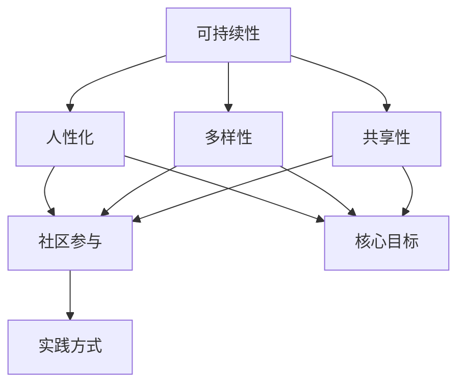

                 

## 文章标题：慢科技运动：以人为本的技术发展

### 关键词：
- 慢科技运动
- 以人为本
- 技术发展
- 社会变革
- 可持续发展
- 教育与推广

### 摘要：
本文旨在探讨慢科技运动的理念、发展历程、核心概念及其在社会各个领域的应用。通过分析慢科技运动的哲学基础和实践案例，本文揭示了其如何以人为本，促进可持续发展，并在信息技术、农业、制造业等领域产生深远影响。文章还展望了慢科技运动的未来发展趋势，以及其在教育和推广方面的策略。

## 引言

在当今快速发展的科技时代，人们越来越意识到技术进步带来的负面影响。从环境污染到社会不平等，快速的技术发展似乎在某些方面加剧了人类面临的问题。为了解决这一矛盾，慢科技运动应运而生。慢科技运动倡导一种以人为中心的技术发展理念，强调技术的可持续性、人性化和生态友好性。本文将深入探讨慢科技运动的起源、哲学基础及其在不同领域的应用，旨在为读者提供一个全面理解慢科技运动的机会。

### 慢科技运动的概念与起源

慢科技运动（Slow Technology Movement）起源于20世纪90年代，其理念源于慢生活运动（Slow Life Movement）。慢生活运动提倡放慢生活节奏，追求高质量的生活体验，强调人与自然和谐共生。慢科技运动则将这一理念应用于技术领域，主张技术发展应以人为本，关注人的需求和生活质量。

慢科技运动的核心概念包括：

1. **可持续性**：技术发展应遵循生态原则，减少对环境的负面影响。
2. **人性化**：技术设计应考虑到人的感受和需求，提供更加舒适和便捷的体验。
3. **多样性**：技术发展不应单一化，而应鼓励多样性和创新。
4. **共享性**：技术资源应实现共享，减少资源浪费。

慢科技运动的起源可以追溯到20世纪90年代，当时一些科技专家和思想家开始质疑快速科技进步带来的负面影响。他们呼吁重新审视技术发展的方向，提出了一种更加注重可持续性和人性化的技术发展模式。随着时间的推移，慢科技运动逐渐在全球范围内传播，吸引了越来越多的支持者。

### 慢科技运动的历史背景

慢科技运动的历史背景可以追溯到20世纪60年代和70年代，当时科技发展迅速，带来了许多前所未有的机会。然而，快速的技术进步也带来了一系列问题，如资源消耗、环境污染和社会不平等。这些问题引起了公众和科技界的广泛关注，一些思想家开始思考技术发展的可持续性。

1. **环境问题**：随着工业化和城市化的发展，环境污染问题日益严重。许多科学家和环保人士开始呼吁采取行动，保护地球的生态环境。

2. **社会问题**：快速的技术进步带来了社会不平等，贫富差距扩大，工作失业问题加剧。这导致社会动荡和不稳定，引发了人们对社会问题的反思。

3. **科技伦理**：随着科技的发展，人们开始关注科技伦理问题。例如，人工智能的发展引发了对隐私保护和人工智能伦理的讨论。

在这个背景下，慢科技运动应运而生。它不仅是对快速技术进步的反思，更是一种对可持续发展和人类福祉的关注。慢科技运动提倡通过放慢技术发展的速度，减少对环境的负面影响，同时关注人的需求和福祉。

### 慢科技运动的核心价值观

慢科技运动的核心价值观可以概括为以下几个原则：

1. **可持续性**：技术发展应遵循生态原则，减少对环境的负面影响。这包括使用可再生能源、减少碳排放和推广环保技术等。

2. **人性化**：技术设计应考虑到人的感受和需求，提供更加舒适和便捷的体验。这意味着在技术设计过程中，应注重用户体验，确保技术易于使用，并能满足人的基本需求。

3. **多样性**：技术发展不应单一化，而应鼓励多样性和创新。这意味着技术发展应包容各种观点和需求，促进技术的多元化和创新。

4. **共享性**：技术资源应实现共享，减少资源浪费。这包括共享知识、技术和资源，以实现更高效和公平的资源利用。

5. **社区参与**：技术发展应鼓励社区参与，使人们能够更好地理解和参与技术决策过程。这有助于提高公众对技术的理解和信任，促进技术的可持续发展。

通过这些核心价值观，慢科技运动试图实现技术发展与人、自然和社会的和谐共生。这些价值观不仅是对技术发展的重新审视，更是一种对人类未来的深刻思考。

### 慢科技运动与社会变革

慢科技运动的理念不仅关注技术本身，更关注技术对社会的影响。通过倡导可持续性、人性化和共享性，慢科技运动在社会变革中发挥了重要作用。

首先，慢科技运动倡导可持续性，推动社会向绿色、低碳的方向发展。例如，在能源领域，慢科技运动鼓励使用可再生能源，减少对化石燃料的依赖。这有助于减少碳排放，缓解全球变暖问题。此外，慢科技运动还提倡资源循环利用，减少资源浪费，推动社会的可持续发展。

其次，慢科技运动强调人性化，关注人的需求和福祉。在信息技术领域，慢科技运动推动更加人性化的界面设计和交互方式，使技术更加易于使用，更好地满足人的需求。例如，智能手机和平板电脑的普及，使得人们可以随时随地访问信息，提高了生活质量。

最后，慢科技运动强调共享性，促进社会资源的公平分配。通过共享知识、技术和资源，慢科技运动有助于缩小贫富差距，提高社会的公平性。例如，共享经济模式的出现，使得资源可以更加高效地利用，为更多人提供了就业机会和创业机会。

总之，慢科技运动通过倡导可持续性、人性化和共享性，推动了社会变革，促进了社会的可持续发展。这些理念不仅为技术发展提供了新的方向，也为社会进步提供了有力的支持。

### 慢科技运动与可持续发展

慢科技运动强调技术的可持续性，这与可持续发展理念高度契合。可持续发展是指在不损害未来世代满足自身需求能力的前提下，满足当前世代的需求。慢科技运动通过以下几方面推动可持续发展：

首先，慢科技运动倡导使用可再生能源，减少对化石燃料的依赖。这有助于降低碳排放，缓解全球变暖问题。例如，太阳能和风能等可再生能源的使用，不仅可以减少对环境的负面影响，还可以提高能源的可持续性。

其次，慢科技运动提倡资源循环利用，减少资源浪费。通过推广回收和再利用技术，慢科技运动有助于减少对自然资源的消耗，提高资源的利用效率。例如，电子废弃物的回收再利用，不仅减少了环境污染，还节约了资源。

最后，慢科技运动强调技术的共享性，促进资源的公平分配。通过共享知识、技术和资源，慢科技运动有助于缩小贫富差距，提高社会的公平性。例如，共享经济模式的出现，使得资源可以更加高效地利用，为更多人提供了就业机会和创业机会。

总之，慢科技运动通过倡导可持续性、循环利用和共享性，推动了可持续发展。这些理念不仅有助于保护环境，提高生活质量，还为社会的可持续发展提供了有力的支持。

### 慢科技运动与数字化生活的平衡

在现代社会，数字化生活已成为人们日常生活的一部分。然而，过度依赖数字化技术也带来了一系列问题，如信息过载、隐私泄露和社会隔离等。慢科技运动提倡在数字化生活中寻找平衡，以实现技术与人性的和谐共生。

首先，慢科技运动强调信息过滤和筛选，帮助人们避免信息过载。通过智能算法和用户界面设计，慢科技运动致力于为用户提供定制化的信息推送，减少无关信息的干扰，提高信息利用效率。

其次，慢科技运动关注隐私保护，提高数字化生活的安全性。通过加强数据加密和安全协议，慢科技运动旨在保护用户的隐私，防止信息泄露。

最后，慢科技运动倡导数字化生活的多样化，减少社会隔离。通过促进线上线下的互动和交流，慢科技运动鼓励人们积极参与社会活动，增强社会联系。

总之，慢科技运动通过提倡信息过滤、隐私保护和多样化，帮助人们在数字化生活中找到平衡，实现技术与人性的和谐共生。

### 慢科技运动的哲学基础

慢科技运动的理念和价值观背后有着深厚的哲学基础。这些哲学基础不仅影响了慢科技运动的形成和发展，也为其在实际应用中提供了理论支持。

首先，慢科技运动与生态中心主义有着密切的关系。生态中心主义是一种哲学观点，认为自然和生物具有内在价值，不应仅仅被视为人类利用的工具。慢科技运动倡导可持续性，强调保护自然环境，减少对生态系统的破坏。这一理念与生态中心主义相呼应，体现了对自然和生态的尊重。

其次，慢科技运动与后现代主义哲学有着一定的联系。后现代主义批判现代性中的理性主义和科学主义，强调多元性和相对性。慢科技运动倡导多样性和创新，反对单一化和标准化，这与后现代主义的观点相契合。

此外，慢科技运动还受到人类中心主义的影响。人类中心主义认为人类是宇宙的中心，其他生物和自然都应服务于人类的利益。虽然慢科技运动强调人与自然的和谐共生，但它并不完全否定人类中心主义的观点。慢科技运动认为，人类应在尊重自然的前提下，发挥自己的智慧和能力，推动技术和社会的可持续发展。

总的来说，慢科技运动的哲学基础涵盖了生态中心主义、后现代主义和人类中心主义等多种观点。这些哲学基础为慢科技运动提供了理论支持，使其在实践中具有科学性和可行性。

### 慢科技运动的核心概念与联系

慢科技运动的核心概念包括可持续性、人性化、多样性、共享性和社区参与。这些概念之间相互关联，共同构成了慢科技运动的理论框架。

首先，可持续性是慢科技运动的基础。可持续性强调技术在发展过程中应遵循生态原则，减少对环境的负面影响。可持续性不仅关注当前的需求，还考虑未来世代的利益。例如，使用可再生能源、推广环保技术和减少碳排放都是实现可持续性的重要手段。

其次，人性化是慢科技运动的核心目标。人性化强调技术在设计过程中应考虑人的需求和感受，提供舒适和便捷的体验。人性化技术不仅关注功能，还关注用户体验。例如，智能界面设计、便捷的交互方式和可访问性都是人性化的体现。

多样性是慢科技运动的重要原则。多样性鼓励技术在发展过程中保持多元化和创新。多样性不仅体现在技术类型上，还包括技术解决方案和文化背景。通过鼓励多样性和创新，慢科技运动旨在避免单一化和标准化，推动技术和社会的进步。

共享性是慢科技运动的重要价值观。共享性强调技术资源应实现共享，减少资源浪费。共享性包括共享知识、技术和资源，以实现更高效和公平的资源利用。共享经济模式的出现，如共享单车和共享住宿，就是共享性的具体体现。

最后，社区参与是慢科技运动的实践方式。社区参与强调技术在发展过程中应鼓励公众参与，提高公众对技术的理解和信任。社区参与有助于技术的透明性和民主性，使技术决策更加科学和公正。

通过这些核心概念，慢科技运动构建了一个以人为中心、注重可持续性和人性化的技术发展模式。这些概念之间相互联系，共同推动了慢科技运动的发展。以下是一个简化的 Mermaid 流程图，展示了这些核心概念之间的关系：

在这个流程图中，可持续性是慢科技运动的基础，人性化、多样性、共享性和社区参与是其核心目标和实践方式。这些概念相互关联，共同构成了慢科技运动的理论框架和实践路径。

### 慢科技运动的实践应用

慢科技运动的理念不仅在理论上具有重要意义，更在实际应用中展示了其独特的价值。以下是在信息技术、农业和制造业等领域的具体实践案例：

#### 信息技术领域的应用

在信息技术领域，慢科技运动倡导简化技术，减少冗余功能，使技术更加易于使用。例如，诺基亚手机以其耐用性和简洁的设计赢得了广泛认可。这种以实用为核心的设计理念，不仅降低了用户的学习成本，还提高了设备的可靠性。此外，一些编程语言如Python也以其简洁和易于学习的特性，成为初学者和专业人士的流行选择。

#### 农业领域的应用

在农业领域，慢科技运动强调有机农业和可持续农业实践。例如，日本的稻作文化强调人与自然的和谐共生，通过稻田养鱼和水稻轮作等传统方法，实现了生态农业的可持续发展。这种慢科技的农业实践不仅提高了农作物的产量和质量，还保护了土壤和水资源。

#### 制造业领域的应用

在制造业领域，慢科技运动推动精益生产和智能制造的结合。例如，德国的“工业4.0”战略通过引入物联网和人工智能，实现了生产过程的自动化和智能化。这种慢科技的应用不仅提高了生产效率，还降低了资源消耗和环境污染。

总之，慢科技运动在信息技术、农业和制造业等领域的应用，展示了其如何通过简化技术、促进可持续性和提高人性化，实现技术发展与人、自然和社会的和谐共生。

### 慢科技运动的关键技术

慢科技运动的关键技术涵盖了可持续设计原则、环境友好技术和智能控制系统。这些技术共同构成了慢科技运动的核心实践，旨在实现技术的可持续性、人性化和多样性。

#### 可持续设计原则

可持续设计原则是慢科技运动的重要基础。它强调在设计过程中考虑整个产品生命周期，从材料选择到生产、使用和回收，每个环节都应遵循生态原则。具体实践包括：

- **材料选择**：优先使用可再生和可回收材料，减少对环境的负面影响。
- **生产过程**：优化生产流程，减少能源消耗和碳排放。
- **使用和维护**：设计易于维护和升级的产品，延长产品的使用寿命，减少更换频率。
- **回收和再利用**：设计易于回收的产品，实现资源的循环利用。

例如，苹果公司在其产品设计中引入了可回收材料和可拆卸设计，以减少电子废弃物的产生。

#### 环境友好技术

环境友好技术是慢科技运动的重要组成部分，旨在减少技术对环境的负面影响。这些技术包括：

- **可再生能源**：推广使用太阳能、风能等可再生能源，减少对化石燃料的依赖。
- **节能技术**：开发高效节能的设备和系统，减少能源消耗。
- **污染控制**：应用先进的污染控制技术，减少工业排放和环境污染。

例如，特斯拉的电动汽车通过使用可再生能源和高效电池技术，实现了零排放，对环境保护做出了重要贡献。

#### 智能控制系统

智能控制系统是慢科技运动的关键技术之一，通过智能算法和数据分析，实现技术的高效管理和优化。这些技术包括：

- **物联网**：通过传感器和物联网技术，实现设备之间的互联互通，提高系统的智能化和自动化水平。
- **人工智能**：利用人工智能技术，实现数据分析和决策支持，优化系统的运行和管理。
- **智能监控**：通过智能监控系统，实时监测系统的运行状态，及时发现和解决问题。

例如，智能电网系统通过物联网技术和人工智能算法，实现了电力供应的高效管理和优化。

总之，慢科技运动的关键技术通过可持续设计原则、环境友好技术和智能控制系统，实现了技术的可持续性、人性化和多样性，为技术发展提供了新的方向和路径。

### 慢科技运动案例分析

#### 全球慢科技运动实践

在全球范围内，慢科技运动在不同国家和地区有着不同的实践。以下是一些具有代表性的案例：

1. **欧洲**：在欧洲，慢科技运动得到了广泛的认同和支持。例如，德国的“工业4.0”战略通过引入物联网和人工智能，推动了制造业的智能化和自动化。此外，丹麦的“绿色增长”计划也强调了可持续性和环境友好技术的应用。

2. **美国**：在美国，慢科技运动主要体现在信息技术领域。例如，苹果公司以其简洁的设计和环保材料赢得了用户的喜爱。此外，特斯拉的电动汽车和可再生能源技术也在全球范围内产生了深远影响。

3. **亚洲**：在亚洲，日本的稻作文化和有机农业实践体现了慢科技运动的理念。日本的稻田养鱼和水稻轮作等传统方法，不仅提高了农作物的产量和质量，还保护了土壤和水资源。

#### 国外慢科技运动的影响与启示

国外慢科技运动的实践对全球产生了重要影响，并为我国提供了宝贵的经验。以下是一些具体的影响和启示：

1. **技术创新**：通过慢科技运动，各国在可持续性、环境友好技术和智能化方面取得了显著进展，推动了技术的创新和发展。

2. **产业转型**：慢科技运动促进了产业结构的优化和升级，推动了绿色经济和可持续经济的发展。

3. **社会变革**：慢科技运动倡导可持续性和人性化，促进了社会的可持续发展，提高了公众对技术的理解和信任。

4. **政策支持**：国外慢科技运动的实践为我国提供了政策借鉴。例如，我国可以借鉴欧洲的绿色增长政策和美国的创新政策，推动慢科技运动的发展。

总之，国外慢科技运动的实践为我国提供了宝贵的经验，有助于我国在技术创新、产业转型和社会变革方面取得更大的进展。

### 慢科技运动在中国的发展

#### 现状分析

在中国，慢科技运动逐渐受到了越来越多的关注。近年来，我国政府高度重视绿色发展，积极推动环保和可持续技术的应用。以下是一些关键领域的现状：

1. **信息技术**：在信息技术领域，中国积极发展物联网、大数据和人工智能等新兴技术，推动智能化和数字化转型。例如，华为、阿里巴巴等科技巨头在智能设备和大数据处理方面取得了重要突破。

2. **农业**：在农业领域，中国大力推进农业现代化，推广有机农业和可持续农业实践。例如，通过推广稻田养鱼、水稻轮作等传统方法，提高了农作物的产量和质量，保护了土壤和水资源。

3. **制造业**：在制造业领域，中国推动了智能制造和绿色制造的发展。通过引入物联网和人工智能技术，提高了生产效率，降低了资源消耗和环境污染。

#### 优势与挑战

在中国发展慢科技运动具有以下优势和挑战：

1. **优势**：
   - **政策支持**：中国政府高度重视可持续发展，提供了强有力的政策支持。
   - **市场潜力**：中国拥有庞大的人口和市场规模，为慢科技运动提供了广阔的发展空间。
   - **技术创新**：中国在信息技术、人工智能和新能源等领域具有显著的创新能力。

2. **挑战**：
   - **技术瓶颈**：在部分领域，如环保技术和智能制造，中国仍面临技术瓶颈和创新能力不足的问题。
   - **资源分配**：如何在资源有限的情况下，实现慢科技运动的全面发展，仍是一个挑战。
   - **公众意识**：提高公众对慢科技运动的认知和理解，需要加强教育和宣传。

#### 发展前景

展望未来，中国慢科技运动具有广阔的发展前景：

1. **政策引导**：随着中国政府持续加大对环保和可持续发展的支持，慢科技运动将得到进一步推动。

2. **技术创新**：在信息技术、新能源和智能制造等领域的持续创新，将为中国慢科技运动提供强大动力。

3. **国际合作**：通过与国际社会的合作，中国可以借鉴先进经验，提升自身慢科技运动的发展水平。

4. **社会参与**：随着公众环保意识的提高，越来越多的企业和个人将参与到慢科技运动中，共同推动社会的可持续发展。

总之，中国慢科技运动的发展前景光明，但在技术创新、资源分配和公众意识等方面仍需努力。通过政策引导、技术创新和国际合作，中国有望在慢科技运动领域取得更大的成就。

### 慢科技运动的未来展望

#### 发展趋势

慢科技运动的未来发展趋势主要体现在以下几个方面：

1. **技术创新**：随着科技的快速发展，慢科技运动将在人工智能、物联网、大数据和可再生能源等领域取得突破。这些技术的进步将为慢科技运动提供更加坚实的理论基础和技术支持。

2. **跨学科融合**：慢科技运动将与其他领域如生态学、社会学和心理学等学科融合，形成多学科交叉的研究和应用体系。这将有助于慢科技运动更加全面地理解和解决复杂问题。

3. **全球合作**：随着全球对可持续发展的重视，慢科技运动将加强国际合作，分享经验和技术，推动全球范围内的可持续发展。

4. **政策支持**：各国政府将继续加大对慢科技运动的政策支持，推动慢科技运动的全面发展。

#### 挑战

尽管慢科技运动具有广阔的发展前景，但仍然面临一系列挑战：

1. **技术瓶颈**：在部分领域，如环保技术和智能制造，中国仍面临技术瓶颈和创新能力不足的问题。这需要加大对科研和技术创新的投入。

2. **资源分配**：如何在资源有限的情况下，实现慢科技运动的全面发展，仍是一个挑战。需要优化资源配置，提高资源利用效率。

3. **公众意识**：提高公众对慢科技运动的认知和理解，需要加强教育和宣传。通过公众参与，增强社会对慢科技运动的认同和支持。

4. **政策执行**：尽管各国政府重视慢科技运动，但在政策执行过程中，仍可能存在执行力度不足、监管不到位等问题。需要完善政策体系，加强政策执行和监督。

#### 机遇

慢科技运动也为未来的发展提供了诸多机遇：

1. **市场潜力**：随着消费者对环保和健康生活需求的增加，慢科技运动相关的产品和服务市场潜力巨大。

2. **产业升级**：慢科技运动将推动传统产业向绿色、低碳和智能化方向转型，促进产业结构的优化和升级。

3. **社会变革**：慢科技运动倡导可持续性和人性化，有助于推动社会的可持续发展，提高公众的幸福感和满意度。

4. **国际合作**：通过与国际社会的合作，中国可以借鉴先进经验，提升自身慢科技运动的发展水平。

总之，慢科技运动在未来具有广阔的发展前景，但同时也面临着诸多挑战。通过技术创新、全球合作和政策支持，慢科技运动有望在未来实现更加全面和深入的发展。

### 慢科技运动的教育与推广

#### 教育理念

慢科技运动的教育理念强调以学生为中心，培养他们的批判性思维和创新能力。具体来说，这种教育理念包括以下几个关键要素：

1. **跨学科学习**：慢科技运动的教育理念鼓励跨学科学习，通过多学科知识的融合，培养学生的综合素质和创新能力。例如，结合信息技术、环境科学和社会学等多领域知识，让学生在解决实际问题时能够从多个角度进行思考。

2. **项目式学习**：项目式学习是慢科技运动教育理念的核心，通过实际项目让学生参与研究和解决问题，培养他们的实践能力和创新思维。例如，让学生参与环保项目的规划和实施，亲身体验可持续技术的应用，从而提高他们的环保意识和实践能力。

3. **合作学习**：慢科技运动倡导合作学习，鼓励学生在团队中相互学习、交流和合作。通过团队合作，学生可以培养沟通能力和团队合作精神，同时提高解决问题的效率和质量。

#### 教育改革

为了更好地推广慢科技运动的教育理念，教育改革势在必行。以下是一些具体的改革措施：

1. **课程设计**：优化课程设计，增加与慢科技运动相关的课程内容。例如，开设环保技术、可持续发展、人工智能和物联网等课程，让学生系统地学习慢科技运动的理论和实践。

2. **教学方法**：采用多样化的教学方法，如项目式学习、探究式学习和体验式学习等，激发学生的学习兴趣和主动性。通过实践和体验，学生可以更好地理解和应用慢科技运动的理念。

3. **师资培训**：加强师资培训，提高教师对慢科技运动的理解和应用能力。通过专业培训和交流，教师可以掌握最新的慢科技教育理念和方法，为学生的成长提供更好的指导。

#### 推广策略

为了有效推广慢科技运动，需要采取一系列推广策略，包括以下几个方面：

1. **媒体宣传**：利用电视、报纸、杂志和互联网等媒体平台，广泛宣传慢科技运动的理念和实践案例。通过媒体报道，提高公众对慢科技运动的认知和兴趣。

2. **教育活动**：组织各类教育活动，如讲座、研讨会、工作坊和比赛等，让学生和公众了解慢科技运动的重要性和应用价值。通过这些活动，可以激发学生对慢科技的兴趣，培养他们的创新能力。

3. **国际合作**：加强与国际教育机构和科研机构的合作，引进先进的教育理念和方法，推动慢科技运动在全球范围内的推广。

4. **政策支持**：争取政府和社会各界的支持，制定相关政策，鼓励学校和教育机构推广慢科技运动。通过政策引导，为慢科技运动的教育与推广提供有力保障。

总之，通过教育理念的创新、教育改革的实施和推广策略的制定，慢科技运动的教育与推广将取得更好的成效，为社会的可持续发展培养更多的优秀人才。

### 总结

慢科技运动作为一种以人为中心的技术发展理念，强调可持续性、人性化和共享性，旨在实现技术、人与自然的和谐共生。本文通过探讨慢科技运动的起源、核心价值观、社会变革、技术创新、案例分析以及教育推广等多个方面，揭示了其理念、应用和未来前景。慢科技运动不仅为我们提供了一种新的技术发展路径，也为解决当前社会面临的环境、社会和伦理问题提供了重要启示。我们期待慢科技运动能够在全球范围内得到更广泛的认同和应用，为人类社会的可持续发展作出更大贡献。

### 作者信息

作者：AI天才研究院/AI Genius Institute & 禅与计算机程序设计艺术 /Zen And The Art of Computer Programming

### 最佳实践 Tips、注意事项与拓展阅读

**最佳实践 Tips：**
1. **关注用户体验**：在设计技术产品时，始终以用户的需求和体验为中心，确保技术易于使用且人性化。
2. **推广可持续性**：在项目开发中，注重环保和资源利用效率，采用可持续的设计原则和环保技术。
3. **鼓励创新思维**：培养团队的创新能力，通过跨学科合作和项目式学习，推动技术的多元化和创新。

**注意事项：**
1. **政策合规**：在推广慢科技运动时，确保遵守相关政策和法规，避免法律风险。
2. **技术评估**：在选择技术方案时，充分考虑技术的可行性和长期影响，避免盲目跟风。
3. **社会参与**：在项目实施过程中，积极邀请公众参与，提高社会对慢科技运动的认同和支持。

**拓展阅读：**
1. **《慢科技：重塑数字时代的思维与生活》** - 作者：唐纳德·A·诺曼
2. **《可持续设计的实践指南》** - 作者：彼得·沃克
3. **《人工智能伦理学》** - 作者：尼古拉斯·尼葛洛庞蒂

通过以上最佳实践、注意事项和拓展阅读，读者可以更深入地了解和应用慢科技运动的理念，推动技术的可持续发展和社会进步。

