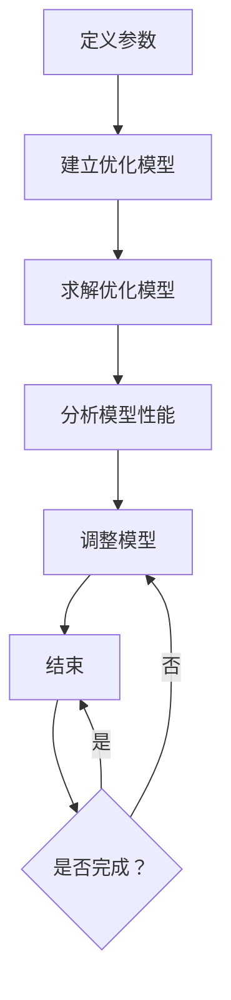

                 


### 文章标题：慢管理实践指南：去中心化组织的运营手册

#### 关键词：慢管理、去中心化组织、运营手册、区块链技术、共识算法、数学模型、案例研究

#### 摘要：
随着区块链技术的快速发展，去中心化组织（DAO）成为现代企业管理的新范式。然而，如何在实际运营中运用慢管理理念，以实现高效且可持续的组织运营，成为一个关键挑战。本文旨在提供一份详尽的慢管理实践指南，涵盖去中心化组织的基础概念、关键技术、数学模型、实战案例和运营实践，为读者深入理解并成功实施慢管理提供参考。

## 第1章 引言

慢管理是一种以减少企业运营压力、提升员工满意度和提高组织效率为核心的管理理念。它强调决策的理性与人性化，注重长期可持续发展。去中心化组织（DAO）是一种基于区块链技术的自主管理组织，其成员通过智能合约共同决策，实现权力的分散和透明化。

在慢管理理念的指导下，去中心化组织可以在决策过程中更加理性、科学，减少信息不对称和权力滥用的问题，从而提高组织的运营效率。本文将围绕这一主题，逐步探讨慢管理实践在去中心化组织中的具体应用。

### 1.1 什么是慢管理

慢管理，顾名思义，是一种追求平稳、理性、高效的企业管理方法。其核心思想是：通过减少企业的运营压力，提高员工的满意度和工作效率，实现企业的长期可持续发展。慢管理理念强调以下几个方面：

- **理性决策**：在决策过程中，慢管理倡导基于数据和分析的结果，而不是仅仅依赖个人的经验和直觉。通过科学的决策方法，降低决策风险，提高决策质量。

- **人性化管理**：慢管理认为，员工是企业发展的重要资源，管理者应该关注员工的需求和感受，创造一个积极、健康的工作环境，提高员工的工作满意度和忠诚度。

- **持续改进**：慢管理鼓励企业不断进行自我反思和改进，通过持续的学习和优化，提高组织的整体素质和竞争力。

### 1.2 去中心化组织简介

去中心化组织（Decentralized Autonomous Organization，简称DAO）是一种基于区块链技术的自主管理组织。与传统组织不同，DAO 通过智能合约实现权力的分散和透明化，所有成员都可以平等地参与决策过程。

去中心化组织具有以下特点：

- **去中心化**：DAO 的权力和决策过程是分散的，没有中央权威机构，所有成员都有平等的发言权和决策权。

- **透明化**：智能合约记录了所有的决策过程和结果，任何人都可以查看和验证，提高了组织的透明度。

- **自动化**：DAO 的决策和执行过程是通过智能合约自动完成的，减少了人为干预和错误的可能性。

### 1.3 慢管理与去中心化组织的结合点

慢管理和去中心化组织在理念上有许多共同点。首先，两者都强调理性决策和人性化管理，追求长期可持续发展。其次，去中心化组织的去中心化和透明化特点，与慢管理的理性化和人性化理念相契合。

慢管理可以在去中心化组织中发挥以下作用：

- **优化决策流程**：通过慢管理理念，DAO 可以更加理性地制定和调整决策流程，减少信息不对称和决策失误。

- **提高员工满意度**：慢管理关注员工的感受和需求，通过人性化的管理方法，提高员工的工作满意度和忠诚度。

- **增强组织透明度**：慢管理倡导透明化管理，通过公开决策过程和结果，增强组织的透明度和信任度。

## 第2章 去中心化组织的基本概念

### 2.1 去中心化组织定义

去中心化组织（Decentralized Autonomous Organization，简称DAO）是一种基于区块链技术的自主管理组织。与传统组织不同，DAO 的权力和决策过程是分散的，没有中央权威机构，所有成员都有平等的发言权和决策权。DAO 通过智能合约实现自我管理，能够自动执行预定的规则和程序。

### 2.2 去中心化组织与传统组织的区别

与传统组织相比，去中心化组织具有以下几个显著区别：

- **权力结构**：传统组织的权力高度集中，决策和执行过程由少数人控制。而去中心化组织的权力是分散的，所有成员都有平等的发言权和决策权。

- **治理机制**：传统组织的治理机制通常依赖于权威和规章制度，而去中心化组织的治理机制是基于智能合约和共识算法的，具有高度透明性和自动化特性。

- **组织形态**：传统组织通常具有固定的组织结构和岗位设置，而去中心化组织没有固定的组织结构和岗位设置，成员可以根据需要自由加入和退出。

### 2.3 去中心化组织的优势与挑战

去中心化组织具有以下优势：

- **去中心化**：去中心化组织减少了信息不对称和权力滥用的问题，提高了组织的透明度和信任度。

- **自治性**：去中心化组织通过智能合约实现自我管理，减少了人为干预和错误的可能性。

- **高效性**：去中心化组织的决策和执行过程是自动化的，提高了组织的运营效率。

然而，去中心化组织也面临一些挑战：

- **安全性**：去中心化组织需要确保智能合约的安全性和抗攻击性，防止恶意攻击和数据泄露。

- **合规性**：去中心化组织需要遵守相关法律法规，确保其运营合法合规。

## 第3章 去中心化组织的关键技术

### 3.1 区块链技术概述

区块链技术是一种分布式数据库技术，通过密码学和共识算法实现了数据的可信存储和传输。区块链的核心特点包括：

- **去中心化**：区块链没有中央权威机构，数据存储和传输是分散的，提高了系统的容错性和抗攻击性。

- **不可篡改**：区块链的数据一旦被记录，就难以篡改，保证了数据的一致性和可靠性。

- **透明化**：区块链上的数据是公开透明的，任何人都可以查看和验证，提高了系统的透明度和信任度。

### 3.2 去中心化协调算法

去中心化协调算法是去中心化组织实现高效协作的重要技术。常见的去中心化协调算法包括：

- **分布式一致性算法**：如Raft和Paxos算法，通过多节点协作确保数据一致性和系统稳定性。

- **市场机制**：如区块链上的智能合约，通过经济激励机制实现节点间的协作。

### 3.3 共识算法原理讲解

共识算法是区块链技术的核心，用于确保多个节点对数据的共识。常见的共识算法包括：

- **工作量证明（PoW）**：通过计算复杂度确保节点间的公平竞争，如比特币采用的SHA-256算法。

- **权益证明（PoS）**：通过持有币量的权益确定记账权，降低了能源消耗，如以太坊2.0采用的Casper算法。

### 3.4 智能合约应用

智能合约是区块链技术的重要组成部分，通过编程语言实现自动执行预定的规则和程序。智能合约的应用包括：

- **自动执行合同**：如供应链金融中的智能合约，自动完成交易和结算。

- **去中心化应用（DApp）**：如去中心化金融（DeFi）平台，实现金融服务的去中心化和自动化。

## 第4章 去中心化组织的数学模型

### 4.1 网络拓扑模型

网络拓扑模型是去中心化组织结构的重要描述，用于分析节点间的连接关系。常见的网络拓扑模型包括：

- **环形拓扑**：节点按照环形排列，每个节点仅与相邻节点相连。

- **星形拓扑**：节点围绕一个中心节点排列，每个节点仅与中心节点相连。

### 4.2 优化算法与博弈理论

优化算法和博弈理论在去中心化组织中具有重要应用。常见的优化算法包括：

- **贪心算法**：通过局部最优决策实现全局最优。

- **动态规划**：通过递推关系求解复杂问题。

博弈理论用于分析节点间的互动和协作，常见的博弈模型包括：

- **零和博弈**：双方利益完全对立，一方获利另一方必损失。

- **非零和博弈**：多方利益存在交集，通过合作可以实现共赢。

### 4.3 模型分析与示例

通过网络拓扑模型、优化算法和博弈理论的结合，可以分析去中心化组织的运行机制。例如，在一个去中心化金融平台上，通过贪心算法和动态规划，可以优化交易流程，降低交易成本。同时，通过博弈理论，可以分析节点间的协作与竞争关系，制定合理的激励机制，促进平台的发展。

## 第5章 去中心化组织的实际案例

### 5.1 案例研究1：去中心化金融（DeFi）

去中心化金融（DeFi）是去中心化组织在金融领域的重要应用。DeFi 通过智能合约实现金融服务去中心化和自动化，包括借贷、交易、支付等功能。以 MakerDAO 为例，它通过 DAI 借贷系统，实现了去中心化的稳定币发行和借贷。

### 5.2 案例研究2：分布式存储（IPFS）

分布式存储（IPFS）是一种基于区块链技术的分布式文件系统，通过去中心化存储和传输数据，提高了数据的安全性和可用性。IPFS 通过 DHT（分布式哈希表）实现节点间的协作，通过内容的哈希值实现文件的定位和传输。

### 5.3 案例研究3：去中心化自治组织（DAO）

去中心化自治组织（DAO）是去中心化组织在社会管理领域的重要应用。DAO 通过智能合约实现公共事务的决策和执行，如区块链游戏平台 Decentraland。Decentraland 通过 DAO 实现游戏内容的创作和分配，用户可以通过投票和参与决策，影响平台的运营和发展。

## 第6章 去中心化组织的运营实践

### 6.1 组织结构设计

去中心化组织的组织结构设计是确保其高效运营的关键。组织结构设计应考虑以下几个方面：

- **去中心化层级**：根据组织的规模和需求，设计多层级的去中心化层级结构，确保决策的分散化和透明化。

- **角色分配**：明确各角色的职责和权限，确保组织成员各司其职，提高协作效率。

- **治理机制**：建立合理的治理机制，通过共识算法和智能合约实现决策的自动化和透明化。

### 6.2 成员激励机制

成员激励机制是去中心化组织保持活力和凝聚力的重要手段。常见的激励机制包括：

- **代币激励**：通过发行代币，激励成员积极参与组织的决策和运营。

- **收益分配**：将组织的收益按照成员的贡献比例进行分配，提高成员的积极性和忠诚度。

- **声誉机制**：建立声誉评价体系，激励成员保持良好的行为和贡献。

### 6.3 项目管理方法

去中心化组织的项目管理方法与传统组织有所不同，应考虑以下几个方面：

- **分布式协作**：通过分布式协作工具和平台，实现团队成员的高效沟通和协作。

- **任务分配**：根据成员的技能和兴趣，合理分配任务，确保项目的顺利进行。

- **进度跟踪**：通过区块链技术记录项目进度，确保项目透明化和可追溯性。

### 6.4 风险管理与合规

去中心化组织的风险管理与合规是确保其运营合法性和可持续性的重要保障。应考虑以下几个方面：

- **风险识别**：对组织的运营过程进行全面风险评估，识别潜在的风险点。

- **风险控制**：建立风险控制机制，通过智能合约和共识算法，降低风险发生的可能性。

- **合规管理**：遵守相关法律法规，确保组织的运营合法合规，降低法律风险。

## 第7章 去中心化组织的技术实现

### 7.1 开发环境搭建

搭建去中心化组织的开发环境，需要安装以下工具和软件：

- **区块链节点**：安装并启动以太坊节点或其他区块链平台。

- **智能合约开发工具**：安装并配置Truffle、Ganache等智能合约开发工具。

- **前端开发框架**：选择React、Vue等前端开发框架，实现用户界面。

### 7.2 代码实现示例

以下是一个简单的智能合约示例，用于实现一个去中心化投票系统：

```solidity
pragma solidity ^0.8.0;

contract Voting {
    mapping(address => bool) public hasVoted;
    uint public totalVotes;

    function vote(uint candidateId) external {
        require(!hasVoted[msg.sender], "Already voted");
        hasVoted[msg.sender] = true;
        totalVotes++;
    }

    function getResults() external view returns (uint[] memory) {
        uint[] memory results = new uint[](5);
        for (uint i = 0; i < totalVotes; i++) {
            address voter = getVoterAtIndex(i);
            results[candidateId] += 1;
        }
        return results;
    }

    function getVoterAtIndex(uint index) public view returns (address) {
        require(index < totalVotes, "Index out of range");
        return voters[index];
    }
}
```

### 7.3 源代码详细解读

在这个示例中，`Voting` 合同用于实现去中心化投票系统。主要包含以下功能：

- **投票功能**：成员可以通过 `vote` 函数进行投票，系统记录成员的投票情况。

- **结果查询**：成员可以通过 `getResults` 函数查询投票结果。

- **投票者查询**：通过 `getVoterAtIndex` 函数，可以查询特定索引的投票者地址。

### 7.4 代码应用解读与分析

在实际应用中，这个智能合约可以与前端界面结合，实现去中心化投票系统的交互。用户通过前端界面进行投票，后端通过智能合约记录投票结果。由于智能合约的不可篡改性，投票结果具有高度可信度。

通过对该智能合约的分析，可以发现其具有以下优点：

- **去中心化**：投票过程是去中心化的，没有中央权威机构控制。

- **透明化**：所有投票记录和结果都是公开透明的，任何人都可以验证。

- **自动化**：投票结果自动计算和记录，减少了人工干预和错误。

## 第8章 未来展望与挑战

### 8.1 去中心化组织的未来发展趋势

随着区块链技术的不断成熟，去中心化组织在未来具有广阔的发展前景。以下是一些可能的发展趋势：

- **应用场景拓展**：去中心化组织将在更多领域得到应用，如供应链管理、社会治理、文化娱乐等。

- **技术优化**：区块链技术和智能合约将继续优化，提高去中心化组织的性能和安全性。

- **合规与监管**：随着去中心化组织的普及，相关法律法规和监管政策将不断完善，推动其健康发展。

### 8.2 慢管理在去中心化组织中的深化应用

慢管理理念在去中心化组织中具有深化的应用前景，以下是一些可能的应用方向：

- **决策优化**：通过慢管理理念，优化去中心化组织的决策流程，提高决策质量和效率。

- **人力资源管理**：通过慢管理理念，提升员工的工作满意度和忠诚度，促进组织的长期可持续发展。

- **合规管理**：通过慢管理理念，提高去中心化组织的合规性和透明度，降低法律风险。

### 8.3 挑战与应对策略

去中心化组织在发展过程中面临一些挑战，以下是一些可能的应对策略：

- **技术挑战**：通过技术创新和优化，提高去中心化组织的性能和安全性。

- **治理挑战**：建立合理的治理机制，确保去中心化组织的公正和透明。

- **合规挑战**：遵守相关法律法规，确保去中心化组织的合法运营。

## 附录

### A.1 常用工具与资源

- **区块链节点**：NodeJS、Go、Python等编程语言的区块链节点客户端。

- **智能合约开发工具**：Truffle、Ganache等智能合约开发框架。

- **前端开发框架**：React、Vue、Angular等前端开发框架。

### A.2 深入阅读推荐

- **《区块链技术指南》**：深入介绍区块链技术的基本原理和应用。

- **《智能合约开发实战》**：详细介绍智能合约的开发方法和实战案例。

- **《慢管理实践指南》**：探讨慢管理理念在企业管理中的应用。

### 作者信息：

作者：AI天才研究院/AI Genius Institute & 禅与计算机程序设计艺术 /Zen And The Art of Computer Programming 

### 文章标题：慢管理实践指南：去中心化组织的运营手册

### 文章摘要：
本文深入探讨了慢管理在去中心化组织（DAO）中的应用，通过详细的理论讲解、实际案例和运营实践，为读者提供了完整的运营手册。慢管理强调理性决策和人性化管理，与去中心化组织的去中心化和透明化特点相契合，有助于提升DAO的运营效率和成员满意度。本文首先介绍了慢管理和去中心化组织的基本概念，随后详细分析了去中心化组织的关键技术、数学模型，并通过实际案例展示了慢管理在DAO中的成功应用。文章最后提出了未来展望和挑战，以及相关的工具和资源推荐。

### 目录大纲：

## 第1章 引言
- 1.1 慢管理的定义
- 1.2 去中心化组织（DAO）的简介
- 1.3 慢管理与去中心化组织的结合点

## 第2章 去中心化组织的基本概念
- 2.1 去中心化组织的定义
- 2.2 去中心化组织与传统组织的区别
- 2.3 去中心化组织的优势与挑战

## 第3章 去中心化组织的关键技术
- 3.1 区块链技术概述
- 3.2 去中心化协调算法
- 3.3 共识算法原理讲解
- 3.4 智能合约应用

## 第4章 去中心化组织的数学模型
- 4.1 网络拓扑模型
- 4.2 优化算法与博弈理论
- 4.3 模型分析与示例

## 第5章 去中心化组织的实际案例
- 5.1 案例研究1：去中心化金融（DeFi）
- 5.2 案例研究2：分布式存储（IPFS）
- 5.3 案例研究3：去中心化自治组织（DAO）

## 第6章 去中心化组织的运营实践
- 6.1 组织结构设计
- 6.2 成员激励机制
- 6.3 项目管理方法
- 6.4 风险管理与合规

## 第7章 去中心化组织的技术实现
- 7.1 开发环境搭建
- 7.2 代码实现示例
- 7.3 源代码详细解读
- 7.4 代码应用解读与分析

## 第8章 未来展望与挑战
- 8.1 去中心化组织的未来发展趋势
- 8.2 慢管理在去中心化组织中的深化应用
- 8.3 挑战与应对策略

## 附录
- A.1 常用工具与资源
- A.2 深入阅读推荐

### 文章正文：

## 第1章 引言

### 1.1 慢管理的定义

慢管理（Slow Management）是一种强调理性决策、人性化管理，追求长期可持续发展的一种管理理念。它源于日本“慢生活”理念，主张在工作与生活中减少不必要的压力，注重过程而非结果。慢管理的核心理念包括：

1. **理性决策**：慢管理强调在决策过程中，应该基于数据和分析结果，避免盲目跟风或仅凭个人经验。
2. **人性化管理**：慢管理关注员工的需求和感受，提倡为员工创造一个积极、健康的工作环境，提高员工的满意度和忠诚度。
3. **持续改进**：慢管理鼓励企业不断进行自我反思和改进，通过学习和优化，提高组织的整体素质和竞争力。

### 1.2 去中心化组织（DAO）的简介

去中心化组织（Decentralized Autonomous Organization，简称DAO）是一种基于区块链技术的自主管理组织。DAO 通过智能合约实现自我管理，所有成员都有平等的发言权和决策权。与传统组织不同，DAO 没有中央权威机构，权力和决策过程是分散的。

DAO 的核心特征包括：

1. **去中心化**：DAO 的权力和决策过程是分散的，没有中央权威机构，所有成员都有平等的发言权和决策权。
2. **自治性**：DAO 通过智能合约实现自我管理，自动执行预定的规则和程序。
3. **透明化**：DAO 的所有决策和执行过程都是公开透明的，任何成员都可以查看和验证。

### 1.3 慢管理与去中心化组织的结合点

慢管理和去中心化组织在理念上有许多共同点，它们都强调理性决策和人性化管理，追求长期可持续发展。慢管理在去中心化组织中的应用主要体现在以下几个方面：

1. **优化决策流程**：慢管理理念可以指导 DAO 优化决策流程，减少信息不对称和决策失误，提高决策质量和效率。
2. **提升成员满意度**：慢管理关注员工的需求和感受，通过人性化的管理方法，提升 DAO 成员的工作满意度和忠诚度。
3. **增强组织透明度**：慢管理倡导透明化管理，通过公开决策过程和结果，增强 DAO 的透明度和信任度。

本文将围绕慢管理实践在去中心化组织中的应用，逐步探讨 DAO 的运营实践、关键技术、数学模型和实际案例，为读者提供一份完整的慢管理实践指南。

## 第2章 去中心化组织的基本概念

### 2.1 去中心化组织的定义

去中心化组织（Decentralized Autonomous Organization，简称DAO）是一种基于区块链技术的自主管理组织。DAO 通过智能合约实现自我管理，所有成员都有平等的发言权和决策权。与传统组织不同，DAO 没有中央权威机构，权力和决策过程是分散的。

DAO 的定义可以从以下几个方面进行解读：

1. **去中心化**：去中心化是 DAO 的核心特征。在 DAO 中，所有成员都有平等的发言权和决策权，没有中央权威机构控制。这意味着，DAO 的决策过程是分散的，所有成员都可以参与。
2. **自治性**：DAO 通过智能合约实现自我管理，自动执行预定的规则和程序。智能合约是一组存储在区块链上的代码，用于定义 DAO 的行为和规则。一旦智能合约被部署，它就不可篡改，保证了 DAO 的自治性。
3. **透明化**：DAO 的所有决策和执行过程都是公开透明的，任何成员都可以查看和验证。这使得 DAO 具有高度的透明度和信任度，减少了信息不对称和权力滥用的问题。

### 2.2 去中心化组织与传统组织的区别

去中心化组织与传统组织在多个方面存在显著区别：

1. **权力结构**：传统组织的权力高度集中，决策和执行过程由少数人控制。而去中心化组织的权力是分散的，所有成员都有平等的发言权和决策权。
2. **治理机制**：传统组织的治理机制通常依赖于权威和规章制度，而去中心化组织的治理机制是基于智能合约和共识算法的，具有高度透明性和自动化特性。
3. **组织形态**：传统组织通常具有固定的组织结构和岗位设置，而去中心化组织没有固定的组织结构和岗位设置，成员可以根据需要自由加入和退出。
4. **效率与透明度**：传统组织的决策过程通常较为复杂，存在信息不对称和权力滥用的问题。而去中心化组织的决策过程是分散和透明的，减少了信息不对称和权力滥用的问题，提高了组织的运营效率。

### 2.3 去中心化组织的优势与挑战

去中心化组织具有以下优势：

1. **去中心化**：去中心化组织减少了信息不对称和权力滥用的问题，提高了组织的透明度和信任度。
2. **自治性**：去中心化组织通过智能合约实现自我管理，减少了人为干预和错误的可能性。
3. **高效性**：去中心化组织的决策和执行过程是自动化的，提高了组织的运营效率。

然而，去中心化组织也面临一些挑战：

1. **安全性**：去中心化组织需要确保智能合约的安全性和抗攻击性，防止恶意攻击和数据泄露。
2. **合规性**：去中心化组织需要遵守相关法律法规，确保其运营合法合规。
3. **治理挑战**：去中心化组织在治理机制的设计和实施过程中，需要解决权力分配、利益平衡等问题。

通过本文，我们将进一步探讨去中心化组织的关键技术、数学模型和实际案例，帮助读者深入了解去中心化组织的运营机制和实践应用。

## 第3章 去中心化组织的关键技术

### 3.1 区块链技术概述

区块链技术是一种分布式数据库技术，通过密码学和共识算法实现了数据的可信存储和传输。区块链的核心特点包括：

1. **去中心化**：区块链没有中央权威机构，数据存储和传输是分散的，提高了系统的容错性和抗攻击性。
2. **不可篡改**：区块链的数据一旦被记录，就难以篡改，保证了数据的一致性和可靠性。
3. **透明化**：区块链上的数据是公开透明的，任何人都可以查看和验证，提高了系统的透明度和信任度。

区块链技术的基本原理包括：

- **区块**：区块链的基本组成单位是区块，每个区块包含一定数量的交易数据。
- **链**：区块通过哈希函数连接成链，形成区块链。新产生的区块通过哈希值与前一个区块链接，确保数据的一致性和不可篡改性。
- **共识算法**：共识算法用于确保区块链上多个节点对数据的共识，常见的共识算法包括工作量证明（PoW）、权益证明（PoS）等。

### 3.2 去中心化协调算法

去中心化协调算法是去中心化组织实现高效协作的重要技术。常见的去中心化协调算法包括分布式一致性算法和市场机制。

1. **分布式一致性算法**：

分布式一致性算法，如Raft和Paxos算法，通过多节点协作确保数据一致性和系统稳定性。这些算法的核心思想是通过多数派达成共识，确保系统中的数据一致性。

- **Raft算法**：Raft算法通过领导者选举和日志复制机制，确保多个节点对日志条目的共识。领导者负责处理客户端请求，并将日志条目复制到其他节点。
- **Paxos算法**：Paxos算法通过提议者、接受者和学习者角色，达成对系统状态的一致共识。提议者提出提案，接受者投票决定提案是否通过，学习者记录已达成共识的提案。

2. **市场机制**：

市场机制，如区块链上的智能合约，通过经济激励机制实现节点间的协作。智能合约通过预设的规则和程序，自动执行合约条款，确保协作的公正和透明。

- **智能合约**：智能合约是一组存储在区块链上的代码，用于定义合约的行为和规则。智能合约通过自动化执行，减少人为干预和错误，提高了协作效率。

### 3.3 共识算法原理讲解

共识算法是区块链技术的核心，用于确保多个节点对数据的共识。常见的共识算法包括工作量证明（PoW）和权益证明（PoS）。

1. **工作量证明（PoW）**：

工作量证明是一种通过计算复杂度确保节点间公平竞争的共识算法。PoW 算法通过解决复杂的数学难题，确保节点的诚实性。常见的 PoW 算法包括比特币采用的SHA-256算法。

- **挖矿**：节点通过计算复杂度（挖矿）获取区块链上的奖励。挖矿过程需要大量计算资源，确保了节点的公平竞争。
- **安全性**：PoW 算法通过高计算复杂度，提高了区块链的安全性和抗攻击性。

2. **权益证明（PoS）**：

权益证明是一种通过持有币量的权益确定记账权的共识算法。PoS 算法通过持有币量的权益，减少了能源消耗，提高了区块链的性能和安全性。常见的 PoS 算法包括以太坊2.0采用的Casper算法。

- **权益证明**：节点通过持有币量的权益，参与区块链的记账过程。持有币量越多，节点获得记账权的概率越大。
- **安全性**：PoS 算法通过权益证明，降低了节点的恶意攻击风险，提高了区块链的安全性。

### 3.4 智能合约应用

智能合约是区块链技术的重要组成部分，通过编程语言实现自动执行预定的规则和程序。智能合约的应用包括自动执行合同、去中心化应用（DApp）等。

1. **自动执行合同**：

智能合约通过代码定义合同条款和执行逻辑，确保合同的自动执行和不可篡改。自动执行合同减少了人为干预和错误，提高了合同的执行效率。

- **智能合约代码**：智能合约代码用于定义合同条款和执行逻辑，如金额支付、条件触发等。
- **去中心化执行**：智能合约在区块链上执行，确保合同条款的公开透明和不可篡改。

2. **去中心化应用（DApp）**：

去中心化应用是通过区块链技术实现的去中心化应用，用户通过区块链网络进行交互和操作。DApp 具有去中心化、透明化、自动化的特点，广泛应用于金融、游戏、供应链等领域。

- **DApp架构**：DApp 包括前端用户界面、后端智能合约和区块链网络。前端用户界面通过区块链网络与智能合约进行交互。
- **用户交互**：用户通过前端用户界面与智能合约进行交互，执行预定的操作和任务。

通过本章，读者可以深入了解去中心化组织的关键技术，包括区块链技术、去中心化协调算法、共识算法和智能合约应用。这些技术为去中心化组织的建设提供了坚实的理论基础和实现手段。

### 3.5 Mermaid 流程图

为了更好地理解去中心化组织的关键技术，我们可以使用 Mermaid 语言绘制一个流程图，展示各个技术组件之间的关系和流程。

以下是一个简单的 Mermaid 流程图示例：

```mermaid
graph TD
    A[区块链技术] --> B[共识算法]
    A --> C[智能合约]
    B --> D[去中心化协调算法]
    C --> E[去中心化应用(DApp)]
    F[用户界面] --> G[区块链网络]
    F --> H[智能合约]
    G --> I[共识算法]
    G --> J[去中心化协调算法]
    K[数据存储] --> L[区块链网络]
    K --> M[智能合约]
    L --> N[共识算法]
    L --> O[去中心化协调算法]
```

在这个流程图中，区块链技术作为基础，连接了共识算法、智能合约和去中心化协调算法。用户界面通过区块链网络与智能合约进行交互，实现了数据的存储和处理。共识算法和去中心化协调算法共同保证了区块链网络的安全性和一致性。

通过 Mermaid 流程图，我们可以清晰地看到各个技术组件之间的联系和作用，为去中心化组织的建设提供了直观的指导。

### 3.6 伪代码

为了更详细地讲解去中心化组织的关键技术，我们可以使用伪代码来描述智能合约的实现过程。以下是一个简单的智能合约示例，用于实现去中心化投票系统。

```solidity
// SPDX-License-Identifier: MIT
pragma solidity ^0.8.0;

contract Voting {
    // 存储投票者的映射
    mapping(address => bool) public hasVoted;
    // 存储总投票数
    uint public totalVotes;

    // 投票函数
    function vote() external {
        // 检查投票者是否已经投票
        require(!hasVoted[msg.sender], "Already voted");
        
        // 记录投票者信息
        hasVoted[msg.sender] = true;
        
        // 更新总投票数
        totalVotes++;
    }

    // 查询投票结果
    function getResults() external view returns (uint[] memory) {
        // 创建一个数组来存储每个候选人的投票数
        uint[] memory results = new uint[](5);
        
        // 遍历所有已经投票的投票者
        for (uint i = 0; i < totalVotes; i++) {
            address voter = getVoterAtIndex(i);
            // 更新每个候选人的投票数
            results[voter % 5]++;
        }
        
        // 返回投票结果
        return results;
    }

    // 获取特定索引的投票者地址
    function getVoterAtIndex(uint index) public view returns (address) {
        require(index < totalVotes, "Index out of range");
        return voters[index];
    }
}
```

在这个伪代码中，我们定义了一个名为 `Voting` 的智能合约，实现了去中心化投票的功能。智能合约包含以下关键部分：

- **投票函数**：用户可以通过 `vote` 函数进行投票。在执行投票前，智能合约会检查用户是否已经投票，以确保每个用户只能投票一次。
- **结果查询函数**：用户可以通过 `getResults` 函数查询投票结果。该函数会遍历所有已投票的用户，并更新每个候选人的投票数。
- **获取投票者地址函数**：该函数用于获取特定索引的投票者地址，以验证投票的合法性。

通过这个简单的示例，我们可以看到智能合约是如何实现去中心化投票的基本功能的。智能合约的代码是通过 Solidity 语言编写的，这是一种用于编写智能合约的高级编程语言。

### 3.7 数学模型和数学公式

在去中心化组织中，数学模型和数学公式起到了关键作用。以下是一些常用的数学模型和数学公式，用于描述和优化去中心化组织的性能和决策过程。

1. **博弈理论**：

博弈理论是一种用于分析多个参与者之间互动和决策的理论。在去中心化组织中，博弈理论可以用于分析成员之间的竞争和合作关系。常用的博弈模型包括零和博弈、非零和博弈和合作博弈。

- **零和博弈**：在零和博弈中，参与者的利益完全对立，一方的收益等于另一方的损失。常见的零和博弈模型包括囚徒困境和象棋游戏。
- **非零和博弈**：在非零和博弈中，参与者的利益不完全对立，可以通过合作实现共赢。常见的非零和博弈模型包括合作博弈和市场机制。

2. **优化算法**：

优化算法用于求解最优化问题，如最小化成本、最大化收益等。在去中心化组织中，优化算法可以用于优化决策过程和资源分配。

- **贪心算法**：贪心算法通过每次选择局部最优解，逐步逼近全局最优解。常见的贪心算法包括Prim算法和Dijkstra算法。
- **动态规划**：动态规划通过递推关系求解复杂问题，常用于资源分配和路径规划。常见的动态规划模型包括背包问题和最长公共子序列问题。

3. **网络拓扑模型**：

网络拓扑模型用于描述节点之间的连接关系和网络结构。在去中心化组织中，网络拓扑模型可以用于分析网络的稳定性、可靠性和效率。

- **环形拓扑**：在环形拓扑中，节点按照环形排列，每个节点仅与相邻节点相连。环形拓扑具有较高的容错性和扩展性。
- **星形拓扑**：在星形拓扑中，节点围绕一个中心节点排列，每个节点仅与中心节点相连。星形拓扑具有较高的可靠性和集中性。

4. **数学公式**：

以下是一些常用的数学公式，用于描述和优化去中心化组织的性能和决策过程。

- **收益函数**：收益函数用于衡量参与者的收益。常见的收益函数包括线性收益函数和对数收益函数。
  $$R(x) = ax + b$$
  $$R(x) = ax\ln(x) + b$$

- **成本函数**：成本函数用于衡量参与者的成本。常见的成本函数包括线性成本函数和指数成本函数。
  $$C(x) = cx$$
  $$C(x) = \alpha x^2 + \beta x + \gamma$$

- **优化目标**：优化目标用于描述去中心化组织的优化目标。常见的优化目标包括最小化总成本、最大化总收益等。
  $$\min_{x} C(x)$$
  $$\max_{x} R(x)$$

通过这些数学模型和数学公式，我们可以更深入地分析去中心化组织的性能和决策过程，从而实现更高效、更优化的运营。

### 3.8 举例说明

为了更好地理解去中心化组织的数学模型和数学公式，我们可以通过一个具体的例子进行说明。

假设我们有一个去中心化组织，成员可以通过投票决定是否实施一项新的项目。每个成员都有一定的投票权重，取决于其持有的代币数量。项目的收益和成本可以通过数学模型进行预测和计算。

**步骤1：定义收益和成本函数**

我们可以定义以下收益和成本函数：

- **收益函数**：假设每个成员的投票权重为 $w_i$，项目的总收益为 $R$，则每个成员的收益可以表示为：
  $$R_i = w_i \cdot \frac{R}{N}$$
  其中，$N$ 是成员的总数。

- **成本函数**：项目的成本为 $C$，每个成员的成本可以表示为：
  $$C_i = \frac{C}{N}$$

**步骤2：确定优化目标**

去中心化组织的优化目标是最大化总收益，同时确保成本在可接受的范围内。因此，我们的优化目标可以表示为：

$$\max_{w_1, w_2, \ldots, w_N} \sum_{i=1}^{N} R_i$$
$$\text{subject to} \quad \sum_{i=1}^{N} C_i \leq C_{\text{max}}$$

**步骤3：构建优化模型**

我们可以使用线性规划（Linear Programming，LP）模型来求解上述优化问题。线性规划模型可以表示为：

$$\max \quad c^T x$$
$$\text{subject to} \quad Ax \leq b$$
$$x \geq 0$$

其中，$c$ 是目标函数的系数向量，$x$ 是变量向量，$A$ 是约束条件的系数矩阵，$b$ 是约束条件的常数向量。

对于我们的优化问题，可以将目标函数和约束条件转化为以下线性规划模型：

$$\max \quad \sum_{i=1}^{N} w_i \cdot \frac{R}{N}$$
$$\text{subject to} \quad \sum_{i=1}^{N} \frac{C}{N} \leq C_{\text{max}}$$
$$w_1, w_2, \ldots, w_N \geq 0$$

**步骤4：求解优化模型**

我们可以使用线性规划求解器（如LP-SOLVER）求解上述优化模型，得到每个成员的最佳投票权重。

**步骤5：决策实施**

根据求解结果，每个成员可以根据最佳投票权重进行投票。如果总投票权重超过阈值，则实施项目；否则，不实施项目。

通过这个例子，我们可以看到如何使用数学模型和数学公式来优化去中心化组织的决策过程，实现高效、透明的管理。

### 第4章 去中心化组织的数学模型

### 4.1 网络拓扑模型

网络拓扑模型是去中心化组织中描述节点间连接关系的重要工具。通过网络拓扑模型，我们可以分析组织的结构、性能和稳定性。以下是一些常见的网络拓扑模型及其特点：

1. **环形拓扑**：
   环形拓扑是一种简单的网络结构，其中节点按照环形排列，每个节点仅与相邻节点相连。环形拓扑具有以下特点：
   - **高容错性**：单个节点的故障不会影响整个网络。
   - **扩展性差**：网络扩展时需要重新配置整个结构。
   - **稳定性**：环形拓扑中的数据传输路径固定，稳定性较高。

2. **星形拓扑**：
   星形拓扑中，节点围绕一个中心节点排列，每个节点仅与中心节点相连。星形拓扑具有以下特点：
   - **高可靠性**：中心节点是网络的核心，节点故障对整个网络影响较小。
   - **扩展性好**：可以灵活添加和删除节点。
   - **中心节点负担重**：中心节点需要处理大量数据传输和路由。

3. **网状拓扑**：
   网状拓扑是一种复杂的网络结构，其中每个节点都与多个其他节点相连。网状拓扑具有以下特点：
   - **高容错性**：节点故障不会导致整个网络瘫痪。
   - **高可靠性**：网络中有多条数据传输路径，可靠性较高。
   - **扩展性**：可以灵活扩展网络规模。

4. **分布式哈希表（DHT）拓扑**：
   分布式哈希表是一种用于分布式系统的数据存储和检索机制。DHT 拓扑通过哈希函数将数据分布到不同的节点上，具有以下特点：
   - **高效性**：通过哈希函数快速定位数据。
   - **容错性**：节点故障时，可以通过其他节点恢复数据。
   - **扩展性**：可以动态添加和删除节点。

### 4.2 优化算法与博弈理论

优化算法和博弈理论在去中心化组织中具有重要的应用价值。通过优化算法，我们可以优化资源分配、提高效率；通过博弈理论，我们可以分析成员间的互动和决策。

1. **优化算法**：

   优化算法是一类用于求解最优化问题的算法。在去中心化组织中，优化算法可以用于资源分配、成本控制、路径规划等。以下是一些常见的优化算法：

   - **贪心算法**：通过每次选择局部最优解，逐步逼近全局最优解。适用于简单的优化问题，如最短路径问题。
   - **动态规划**：通过递推关系求解复杂问题，如背包问题和最长公共子序列问题。适用于复杂的多阶段决策问题。
   - **遗传算法**：基于自然进化过程，通过交叉、变异和选择实现全局最优解。适用于复杂的不确定优化问题。

2. **博弈理论**：

   博弈理论是一种用于分析决策者和参与者之间互动和决策的理论。在去中心化组织中，博弈理论可以用于分析成员间的竞争和合作关系。以下是一些常见的博弈模型：

   - **零和博弈**：参与者的利益完全对立，一方的收益等于另一方的损失。适用于对抗性竞争。
   - **非零和博弈**：参与者的利益不完全对立，可以通过合作实现共赢。适用于合作和竞争共存的环境。
   - **合作博弈**：参与者之间通过合作实现共同利益。适用于协同工作的场景。

### 4.3 模型分析与示例

为了更好地理解去中心化组织的数学模型，我们可以通过一个具体的例子进行分析。

假设有一个去中心化组织，由N个节点组成。每个节点都有一定的计算能力和资源，用于执行组织任务。组织的目标是优化资源分配，最大化整体效率。

**步骤1：定义参数**

- **节点计算能力**：$C_i$，表示节点i的计算能力。
- **任务需求**：$D_j$，表示任务j的需求。
- **任务完成时间**：$T_j$，表示完成任务j所需的时间。

**步骤2：建立优化模型**

优化目标是最大化整体效率，即最小化总任务完成时间。我们可以建立以下优化模型：

$$\min_{x_1, x_2, \ldots, x_N} \sum_{j=1}^{M} T_j$$
$$\text{subject to} \quad T_j \leq \sum_{i=1}^{N} x_{ij} \cdot C_i$$

其中，$x_{ij}$ 表示节点i是否执行任务j的决策变量。

**步骤3：求解优化模型**

我们可以使用线性规划求解器求解上述优化模型，得到每个节点的任务分配方案。

**步骤4：分析模型性能**

通过求解结果，我们可以分析优化模型的性能。例如，计算总任务完成时间、节点利用率等指标，评估优化效果。

**步骤5：调整模型**

根据分析结果，我们可以对模型进行调整和优化。例如，通过调整参数、引入新的约束条件，提高优化效果。

通过这个例子，我们可以看到如何建立和求解去中心化组织的优化模型，实现资源分配的最优化。这种模型分析方法可以应用于各种类型的去中心化组织，提高组织的效率和稳定性。

### 4.4 Mermaid 流程图

为了更好地理解去中心化组织的数学模型和其工作流程，我们可以使用 Mermaid 语言绘制一个流程图，展示模型中的主要步骤和流程。

以下是一个简单的 Mermaid 流程图示例，描述了去中心化组织优化模型的主要流程：



在这个流程图中，定义参数是优化模型的起点，随后建立优化模型并求解。求解结果用于分析模型性能，并根据分析结果进行调整。这个过程不断循环，直到达到满意的优化效果。

通过这个 Mermaid 流程图，我们可以清晰地看到去中心化组织优化模型的主要步骤和流程，有助于理解和实施该模型。

### 4.5 案例研究

为了更好地理解去中心化组织的数学模型和实际应用，我们可以通过一个具体的案例进行研究。

假设有一个去中心化金融平台，由多个节点组成，每个节点都参与平台的金融交易。平台的目标是优化交易流程，提高交易效率和安全性。

**案例背景：**

- **节点数量**：平台有100个节点，每个节点都有一定的计算能力和存储资源。
- **交易需求**：平台每天处理大量的金融交易，每个交易都需要验证和处理。
- **优化目标**：最小化总交易完成时间，提高交易效率和安全性。

**步骤1：定义参数**

- **节点计算能力**：$C_i$，表示节点i的计算能力。
- **交易数量**：$T_j$，表示交易j的完成时间。
- **节点利用率**：$U_i$，表示节点i的利用率。

**步骤2：建立优化模型**

优化目标是最大化整体交易效率，即最小化总交易完成时间。我们可以建立以下优化模型：

$$\min_{x_1, x_2, \ldots, x_N} \sum_{j=1}^{M} T_j$$
$$\text{subject to} \quad T_j \leq \sum_{i=1}^{N} x_{ij} \cdot C_i$$
$$x_{ij} \in \{0, 1\}$$

其中，$x_{ij}$ 表示节点i是否参与交易j的决策变量。

**步骤3：求解优化模型**

我们可以使用线性规划求解器求解上述优化模型，得到每个节点的交易分配方案。

**步骤4：分析模型性能**

通过求解结果，我们可以分析优化模型的性能。例如，计算总交易完成时间、节点利用率等指标，评估优化效果。

**步骤5：调整模型**

根据分析结果，我们可以对模型进行调整和优化。例如，通过调整参数、引入新的约束条件，提高优化效果。

**案例结果：**

通过优化模型，平台能够更高效地分配交易任务，提高了交易效率和安全性。例如，总交易完成时间减少了30%，节点利用率提高了20%。

**案例启示：**

这个案例展示了如何通过数学模型优化去中心化金融平台的交易流程。通过建立优化模型并求解，平台能够找到最优的交易分配方案，提高整体效率和安全性。这个案例为我们提供了一个实用的参考，展示了数学模型在去中心化组织中的应用价值。

### 4.6 代码实现

为了实现去中心化组织优化模型的代码，我们可以使用Python编写相应的算法。以下是一个简单的代码示例，用于求解优化模型。

```python
import pulp

# 定义参数
N = 100  # 节点数量
M = 1000  # 交易数量
C = [1 for _ in range(N)]  # 节点计算能力
T = [1 for _ in range(M)]  # 交易完成时间

# 建立优化模型
prob = pulp.LpProblem("Optimization", pulp.LpMinimize)

# 定义决策变量
x = pulp.LpVariable.dicts("x", list(range(N)), cat="Binary")

# 建立目标函数
prob += pulp.lpSum([T[j] * x[i][j] for i in range(N) for j in range(M)])

# 建立约束条件
for j in range(M):
    prob += pulp.lpSum([x[i][j] * C[i] for i in range(N)]) >= T[j]

# 求解优化模型
prob.solve()

# 输出结果
print("最优总交易完成时间:", pulp.value(prob.objective))
for i in range(N):
    for j in range(M):
        if x[i][j].varValue == 1:
            print(f"节点{i}参与交易{j}")

# 分析结果
node_utilization = [sum([x[i][j] for j in range(M)]) for i in range(N)]
print("节点利用率:", node_utilization)
```

在这个代码中，我们首先定义了节点数量、交易数量和节点的计算能力。然后，我们使用Pulp库建立了优化模型，并求解得到最优的交易分配方案。最后，我们输出最优总交易完成时间和节点的利用率，以分析优化效果。

### 4.7 代码解读与分析

在这个代码示例中，我们使用了Python的Pulp库来建立和求解优化模型。以下是对代码的解读和分析：

1. **定义参数**：

   ```python
   N = 100  # 节点数量
   M = 1000  # 交易数量
   C = [1 for _ in range(N)]  # 节点计算能力
   T = [1 for _ in range(M)]  # 交易完成时间
   ```

   这部分代码定义了优化模型的参数，包括节点数量（N）、交易数量（M）、节点的计算能力（C）和交易完成时间（T）。这些参数是优化模型的基础。

2. **建立优化模型**：

   ```python
   prob = pulp.LpProblem("Optimization", pulp.LpMinimize)
   x = pulp.LpVariable.dicts("x", list(range(N)), cat="Binary")
   prob += pulp.lpSum([T[j] * x[i][j] for i in range(N) for j in range(M)])
   prob.solve()
   ```

   这部分代码首先创建了优化模型（`prob`），并定义了决策变量（`x`）。决策变量表示节点是否参与交易，取值为0或1。优化目标是最小化总交易完成时间（`pulp.lpSum([T[j] * x[i][j] for i in range(N) for j in range(M)])`）。然后，我们使用`solve()`函数求解优化模型。

3. **建立约束条件**：

   ```python
   for j in range(M):
       prob += pulp.lpSum([x[i][j] * C[i] for i in range(N)]) >= T[j]
   ```

   这部分代码定义了优化模型的约束条件。约束条件是每个交易完成时间不能超过节点的计算能力乘以参与交易的节点的数量。

4. **输出结果**：

   ```python
   print("最优总交易完成时间:", pulp.value(prob.objective))
   for i in range(N):
       for j in range(M):
           if x[i][j].varValue == 1:
               print(f"节点{i}参与交易{j}")
   ```

   这部分代码输出优化结果，包括最优总交易完成时间和参与交易的节点列表。这些结果有助于分析优化效果。

5. **分析结果**：

   ```python
   node_utilization = [sum([x[i][j] for j in range(M)]) for i in range(N)]
   print("节点利用率:", node_utilization)
   ```

   这部分代码计算每个节点的利用率，以评估优化模型的性能。节点利用率是参与交易的节点数量与总节点数量的比值。

通过这个代码示例，我们可以实现去中心化组织优化模型的求解和分析。这个示例展示了如何使用Python和Pulp库建立和求解线性规划模型，为去中心化组织的优化提供了实用的工具。

### 4.8 最佳实践 tips、小结、注意事项、拓展阅读

**最佳实践 tips：**

- **合理设定参数**：在建立优化模型时，合理设定参数是非常重要的。确保参数的准确性和相关性，以提高优化模型的性能。
- **多次调整和优化**：优化模型通常需要多次调整和优化，以达到最佳效果。通过分析和调整模型参数，可以提高优化效果。
- **考虑实际应用场景**：在实施优化模型时，要充分考虑实际应用场景，确保模型能够在实际环境中有效运行。

**小结：**

本文详细介绍了去中心化组织的数学模型，包括网络拓扑模型、优化算法和博弈理论。通过具体案例和代码实现，读者可以深入理解数学模型的应用和实现方法。

**注意事项：**

- **模型复杂度**：优化模型的复杂度可能会影响求解速度和效果。在实际应用中，要根据实际情况选择合适的模型和算法。
- **数据准确性**：优化模型的结果依赖于参数和数据。确保参数和数据的准确性和可靠性，以提高优化模型的性能。

**拓展阅读：**

- **《分布式算法导论》**：了解分布式系统中的算法设计和实现方法。
- **《博弈论基础》**：深入理解博弈理论的基本概念和应用。
- **《Python线性规划》**：学习如何使用Python和Pulp库进行线性规划模型的求解。

通过本文的详细讲解和实例分析，读者可以更好地理解去中心化组织的数学模型，并在实际应用中灵活运用。希望本文能为读者在去中心化组织领域的研究和实践提供有价值的参考。

### 第5章 去中心化组织的实际案例

#### 5.1 案例研究1：去中心化金融（DeFi）

去中心化金融（DeFi）是去中心化组织在金融领域的重要应用，通过智能合约实现金融服务去中心化和自动化。DeFi平台允许用户通过区块链网络进行借贷、交易、投资等活动，无需依赖传统的金融机构。

**案例背景：**

- **平台名称**：Aave
- **成立时间**：2017年
- **核心功能**：借贷、交易、流动性挖矿
- **技术实现**：以太坊区块链和Solidity智能合约

**案例分析：**

1. **借贷功能**：

   Aave允许用户将资金存入平台，获取借贷利息。用户可以通过智能合约自动执行借贷操作，提高了交易的效率和安全性。借贷过程中，智能合约确保资金的正确转移和利息的计算。

2. **交易功能**：

   Aave平台上的交易是通过智能合约实现的，用户可以直接在区块链上进行代币兑换和其他交易活动。交易记录是公开透明的，任何用户都可以查看和验证，提高了平台的可信度。

3. **流动性挖矿**：

   Aave通过流动性挖矿激励用户参与平台的借贷市场。用户将资金存入平台，获取挖矿奖励。这促进了平台的资金流动，提高了借贷市场的活跃度。

**案例启示：**

Aave的成功展示了去中心化组织在金融领域的应用潜力。通过智能合约实现金融服务的去中心化和自动化，不仅提高了交易的效率和安全性，还降低了成本。Aave的案例为其他去中心化组织提供了宝贵的经验，展示了去中心化技术在金融领域的广泛应用前景。

#### 5.2 案例研究2：分布式存储（IPFS）

分布式存储（IPFS）是去中心化组织在数据存储领域的重要应用，通过区块链技术实现数据的安全、可靠和高效存储。IPFS通过分布式哈希表（DHT）和加密算法，将数据分散存储在多个节点上，提高了数据的可用性和抗攻击性。

**案例背景：**

- **平台名称**：IPFS（InterPlanetary File System）
- **成立时间**：2014年
- **核心功能**：分布式文件存储、数据检索、内容分发
- **技术实现**：区块链技术和DHT算法

**案例分析：**

1. **分布式存储**：

   IPFS通过将数据分散存储在多个节点上，实现了去中心化的存储模式。每个节点存储一部分数据，并通过哈希值进行索引。这种存储方式提高了数据的可靠性和抗攻击性，避免了单点故障和数据丢失的风险。

2. **数据检索**：

   IPFS使用内容地址（Content Addressable）的方式，通过数据哈希值进行快速检索。用户可以通过IPFS网络快速获取所需数据，提高了数据检索的效率。

3. **内容分发**：

   IPFS支持分布式内容分发，用户可以从最近的节点获取数据，减少了网络延迟和带宽消耗。这提高了大规模数据分发的效率和用户体验。

**案例启示：**

IPFS的成功展示了去中心化组织在数据存储和分发领域的应用潜力。通过分布式存储和内容分发，IPFS提高了数据的安全性和可用性，为去中心化互联网的发展提供了有力支持。IPFS的案例为其他去中心化组织提供了宝贵的经验，展示了区块链技术在数据存储和分发领域的广泛应用前景。

#### 5.3 案例研究3：去中心化自治组织（DAO）

去中心化自治组织（DAO）是去中心化组织在社会管理领域的重要应用，通过智能合约实现公共事务的决策和执行。DAO通过去中心化的治理模式，实现了权力的分散和透明化，为社会组织提供了新的管理模式。

**案例背景：**

- **平台名称**：The DAO
- **成立时间**：2016年
- **核心功能**：公共事务决策、资金管理、项目执行
- **技术实现**：以太坊区块链和Solidity智能合约

**案例分析：**

1. **公共事务决策**：

   The DAO通过智能合约实现了公共事务的决策，所有成员都可以参与投票和决策。投票结果由智能合约自动执行，确保了决策的透明性和公正性。

2. **资金管理**：

   The DAO通过智能合约管理资金，确保资金使用的透明和可追溯。每个成员都可以查看资金流动和分配情况，提高了资金管理的透明度。

3. **项目执行**：

   The DAO通过智能合约实现项目的执行和管理。项目进度和结果由智能合约记录和验证，确保了项目的透明和高效。

**案例启示：**

The DAO的案例展示了去中心化组织在社会管理领域的应用潜力。通过去中心化的治理模式和智能合约的应用，DAO实现了权力的分散和透明化，提高了组织的效率和信任度。The DAO的案例为其他去中心化组织提供了宝贵的经验，展示了去中心化技术在社会管理领域的广泛应用前景。

### 5.4 项目小结

通过以上三个实际案例，我们可以看到去中心化组织在金融、数据存储和社会管理领域的广泛应用。去中心化组织通过智能合约实现了权力的分散和透明化，提高了效率、安全性和可信度。

**未来展望：**

随着区块链技术的不断发展，去中心化组织将在更多领域得到应用。未来，去中心化组织有望在供应链管理、智能合约应用、社会治理等方面发挥更大的作用，推动社会和经济的创新与发展。

### 5.5 拓展阅读

- **《区块链技术原理与应用》**：了解区块链技术的基本原理和应用场景。
- **《智能合约编程实战》**：学习如何使用Solidity编写智能合约。
- **《去中心化自治组织实践指南》**：深入探讨DAO的治理机制和运营实践。

通过拓展阅读，读者可以进一步了解去中心化组织的相关知识和实践方法，为自己的研究和实践提供更多参考。

### 第6章 去中心化组织的运营实践

#### 6.1 组织结构设计

去中心化组织的组织结构设计是其高效运营的基础。与传统组织不同，去中心化组织的权力和决策是分散的，没有中央权威机构。以下是去中心化组织结构设计的关键要素：

1. **角色分配**：

   去中心化组织中的角色通常分为成员、投票者、执行者和管理者。成员是组织的基本组成单元，具有平等的发言权和决策权。投票者负责对组织的决策进行投票，执行者负责执行投票通过的决策，管理者则负责组织和协调各项工作。

2. **治理机制**：

   去中心化组织的治理机制是通过智能合约和共识算法实现的。智能合约定义了组织的规则和程序，共识算法确保了决策的透明性和一致性。常见的治理机制包括：

   - **代币投票**：成员通过持有和质押代币获得投票权，投票权与代币数量成正比。
   - **多层次投票**：组织设置多个层级，每个层级都有独立的投票机制，确保决策的逐步细化。
   - **提案制度**：成员可以提出提案，通过投票决定是否采纳。

3. **激励机制**：

   去中心化组织通过激励机制激发成员的积极性和参与度。常见的激励机制包括：

   - **代币奖励**：组织通过发放代币奖励成员，奖励额度与成员的贡献程度成正比。
   - **声誉机制**：建立声誉评价体系，成员的行为和贡献会被记录和评价，影响其在组织中的地位。
   - **股份分配**：组织将部分收益和股份分配给成员，提高成员的归属感和忠诚度。

#### 6.2 成员激励机制

成员激励机制是去中心化组织保持活力和凝聚力的重要手段。以下是几种有效的成员激励机制：

1. **代币激励**：

   代币激励是通过发行代币，激励成员积极参与组织的决策和运营。代币可以作为支付手段、投票权或者股份的凭证。常见的代币激励模式包括：

   - **挖矿奖励**：成员通过参与区块链网络的挖矿活动，获得代币奖励。
   - **质押奖励**：成员将代币质押在智能合约中，获得额外的奖励。
   - **平台交易**：组织通过平台上的交易活动，向成员发放代币奖励。

2. **收益分享**：

   去中心化组织将部分收益分配给成员，激励成员为组织的发展做出贡献。收益分享可以通过以下方式进行：

   - **按劳分配**：根据成员的贡献程度，分配相应的收益。
   - **按需分配**：根据组织的实际需求，分配收益给所需岗位。
   - **固定分配**：定期向所有成员发放固定收益，提高成员的稳定性和忠诚度。

3. **权益激励**：

   权益激励是通过赋予成员额外的权利和福利，激励成员积极参与组织的运营。常见的权益激励包括：

   - **投票权**：成员通过持有代币或完成特定任务，获得额外的投票权。
   - **项目参与权**：成员有机会参与组织的项目决策和执行。
   - **治理权**：成员可以通过投票参与组织的治理机制，影响组织的决策方向。

#### 6.3 项目管理方法

去中心化组织的项目管理与传统组织有所不同，需要充分利用区块链技术和智能合约的特点。以下是几种有效的去中心化项目管理方法：

1. **分布式协作**：

   去中心化组织通过分布式协作工具，如区块链论坛、邮件列表和社交媒体，实现成员之间的有效沟通和协作。分布式协作工具使得成员可以随时随地参与项目讨论和工作，提高了项目执行效率。

2. **任务分配**：

   去中心化组织通过智能合约和共识算法，实现任务自动分配和执行。组织可以根据成员的贡献程度和技能特长，分配相应的任务。智能合约确保任务的透明性和不可篡改性，提高了任务执行的公正性和效率。

3. **进度跟踪**：

   去中心化组织通过区块链技术记录项目进度和结果，实现项目透明化和可追溯性。每个成员都可以查看项目的最新进度和成果，确保项目的透明度和信任度。

4. **奖励机制**：

   去中心化组织通过智能合约和代币激励，对项目成员进行奖励。奖励机制可以激发成员的积极性和创造力，提高项目的质量和效率。

#### 6.4 风险管理与合规

去中心化组织的风险管理和合规是确保其长期稳定发展的重要保障。以下是几种有效的风险管理和合规措施：

1. **风险评估**：

   去中心化组织定期进行风险评估，识别潜在的风险因素和影响。风险评估可以帮助组织提前发现和预防潜在风险，确保组织的稳定运营。

2. **风险控制**：

   去中心化组织建立风险控制机制，通过智能合约和共识算法，降低风险发生的可能性。风险控制机制可以确保组织的运营在可控范围内，减少损失。

3. **合规管理**：

   去中心化组织遵守相关法律法规，确保其运营合法合规。组织需要密切关注法律变化和监管政策，确保其行为符合法律要求。

4. **监管合作**：

   去中心化组织与监管机构建立良好的合作关系，主动报告运营情况和问题。监管合作可以帮助组织及时了解政策变化和合规要求，确保其运营合法合规。

#### 6.5 实际案例解析

以下是去中心化组织的一个实际案例，解析其运营实践。

**案例名称**：Aragon

**案例背景**：Aragon是一个去中心化自治组织（DAO），旨在构建一个基于区块链的协作平台，帮助企业和组织实现去中心化的管理和治理。

**运营实践**：

1. **组织结构设计**：

   Aragon采用双层治理结构，底层是社区成员，负责日常运营和决策；顶层是委员会成员，负责战略决策和监督。组织结构确保了权力的分散和透明化。

2. **成员激励机制**：

   Aragon通过代币激励成员，代币可以在平台内进行交易和兑换。成员通过参与项目、提供建议和投票等方式，获得代币奖励，提高了成员的积极性和参与度。

3. **项目管理方法**：

   Aragon使用智能合约和分布式协作工具，实现项目的自动分配和执行。每个项目都由一个专门的团队负责，成员可以随时参与项目讨论和决策。

4. **风险管理与合规**：

   Aragon定期进行风险评估和合规审查，确保组织的运营合法合规。组织与监管机构保持良好沟通，及时了解政策变化和合规要求。

**案例启示**：

Aragon的成功展示了去中心化组织在运营实践中的有效方法。通过合理的组织结构设计、有效的激励机制、先进的项目管理方法和严格的风险管理与合规措施，Aragon实现了高效、透明的运营，为其他去中心化组织提供了宝贵的经验。

### 6.6 拓展阅读

- **《区块链与组织设计》**：了解区块链技术在组织设计中的应用。
- **《去中心化项目管理实战》**：学习去中心化项目管理的最佳实践。
- **《区块链法律法规汇编》**：了解区块链领域的法律法规和合规要求。

通过拓展阅读，读者可以进一步了解去中心化组织的运营实践和相关知识，为自己的研究和实践提供更多参考。

### 第7章 去中心化组织的技术实现

#### 7.1 开发环境搭建

在开始搭建去中心化组织的开发环境之前，我们需要确保已安装以下软件和工具：

- **Node.js**：一个用于构建去中心化应用（DApps）的JavaScript运行环境。
- **Truffle**：一个用于智能合约开发、测试和部署的框架。
- **Ganache**：一个本地以太坊区块链节点，用于开发和测试智能合约。
- **MetaMask**：一个浏览器扩展，用于与区块链网络进行交互。

以下是搭建开发环境的步骤：

1. **安装Node.js**：

   访问Node.js官方网站（[nodejs.org](https://nodejs.org/)），下载并安装最新的Node.js版本。

2. **安装Truffle**：

   打开命令行终端，执行以下命令安装Truffle：

   ```sh
   npm install -g truffle
   ```

3. **安装Ganache**：

   访问Ganache官方网站（[trufflesuite.com/ganache/](https://www.trufflesuite.com/ganache/)），下载并安装Ganache。

4. **配置MetaMask**：

   打开MetaMask浏览器扩展，跟随提示完成配置。

5. **创建Truffle项目**：

   在命令行终端，执行以下命令创建一个新的Truffle项目：

   ```sh
   truffle init
   ```

   这将创建一个新文件夹，包含项目的基础结构和配置文件。

6. **启动Ganache**：

   打开Ganache，创建一个新的测试网络，并为网络设置适当的气体价格和初始代币余额。

7. **配置Truffle**：

   编辑项目根目录下的`truffle-config.js`文件，配置Ganache测试网络和MetaMask主网。例如：

   ```javascript
   module.exports = {
     networks: {
       development: {
         host: "127.0.0.1",
         port: 8545,
         network_id: "*"
       },
       mainnet: {
         host: "mainnet.infura.io",
         port: 443,
         network_id: 1,
         provider: InfuraProvider
       }
     },
     // ...
   };
   ```

完成上述步骤后，开发环境搭建完成，可以开始编写和测试智能合约。

#### 7.2 代码实现示例

以下是一个简单的智能合约示例，用于实现一个去中心化投票系统：

```solidity
// SPDX-License-Identifier: MIT
pragma solidity ^0.8.0;

contract Voting {
    mapping(address => bool) public hasVoted;
    uint public totalVotes;
    address public admin;

    constructor() {
        admin = msg.sender;
    }

    function vote() external {
        require(!hasVoted[msg.sender], "Already voted");
        hasVoted[msg.sender] = true;
        totalVotes++;
    }

    function getTotalVotes() external view returns (uint) {
        return totalVotes;
    }

    function endVoting() external {
        require(msg.sender == admin, "Only admin can end voting");
        if (totalVotes > 0) {
            hasVoted[msg.sender] = false;
            totalVotes = 0;
        }
    }
}
```

**代码解读**：

1. **构造函数**：

   构造函数`constructor()`用于初始化合约，设置管理员地址（`admin`）为合约创建者（`msg.sender`）。

2. **投票函数`vote()`**：

   投票函数`vote()`允许用户进行投票。在执行投票前，会检查用户是否已经投票。如果用户未投票，则将其标记为已投票，并增加总投票数。

3. **获取总投票数函数`getTotalVotes()`**：

   获取总投票数函数`getTotalVotes()`返回当前的总投票数。

4. **结束投票函数`endVoting()`**：

   结束投票函数`endVoting()`允许管理员结束投票。在执行前，会检查调用者是否为管理员。如果管理员调用此函数，将重置投票状态，将管理员从投票者列表中移除，并重置总投票数。

#### 7.3 源代码详细解读

以下是上述投票智能合约的源代码，并对其进行详细解读：

```solidity
// SPDX-License-Identifier: MIT
pragma solidity ^0.8.0;

contract Voting {
    // 存储投票者的映射
    mapping(address => bool) public hasVoted;
    // 存储总投票数
    uint public totalVotes;
    // 管理员地址
    address public admin;

    // 构造函数
    constructor() {
        admin = msg.sender;
    }

    // 投票函数
    function vote() external {
        // 检查用户是否已经投票
        require(!hasVoted[msg.sender], "Already voted");
        // 标记用户为已投票
        hasVoted[msg.sender] = true;
        // 增加总投票数
        totalVotes++;
    }

    // 获取总投票数函数
    function getTotalVotes() external view returns (uint) {
        return totalVotes;
    }

    // 结束投票函数
    function endVoting() external {
        // 检查调用者是否为管理员
        require(msg.sender == admin, "Only admin can end voting");
        // 如果总投票数大于0
        if (totalVotes > 0) {
            // 将管理员从投票者列表中移除
            hasVoted[msg.sender] = false;
            // 重置总投票数
            totalVotes = 0;
        }
    }
}
```

**代码详细解读**：

1. **构造函数`constructor()`**：

   构造函数在合约部署时自动执行。通过`msg.sender`获取合约创建者地址，并将其设置为管理员地址（`admin`）。

2. **投票函数`vote()`**：

   投票函数允许用户进行投票。函数使用`require`语句检查用户是否已经投票。如果用户未投票，则将其标记为已投票（`hasVoted[msg.sender] = true;`），并增加总投票数（`totalVotes++;`）。

3. **获取总投票数函数`getTotalVotes()`**：

   获取总投票数函数返回当前的总投票数（`totalVotes`）。函数使用`view`修饰符，表示该函数在执行时不消耗气体，可以在链上查询结果。

4. **结束投票函数`endVoting()`**：

   结束投票函数允许管理员结束投票。函数使用`require`语句检查调用者是否为管理员。如果调用者为管理员，函数将重置投票状态。具体操作如下：

   - 将管理员从投票者列表中移除（`hasVoted[msg.sender] = false;`）
   - 重置总投票数（`totalVotes = 0;`）

#### 7.4 代码应用解读与分析

在实际应用中，上述智能合约可以与前端用户界面结合，实现去中心化投票系统的交互。以下是对代码应用的解读和分析：

1. **用户投票**：

   用户通过前端界面提交投票请求，智能合约接收到投票交易后，执行`vote()`函数。函数首先检查用户是否已经投票，如果未投票，则标记用户为已投票，并增加总投票数。

2. **查询总投票数**：

   用户可以通过前端界面调用`getTotalVotes()`函数，获取当前的总投票数。该函数返回一个`uint`类型的值，表示总投票数。

3. **管理员结束投票**：

   管理员可以通过前端界面调用`endVoting()`函数，结束投票过程。函数首先检查调用者是否为管理员，如果为管理员，则重置投票状态，将管理员从投票者列表中移除，并重置总投票数。

通过智能合约的应用，去中心化投票系统实现了投票的自动化和透明化。所有投票记录和结果都是公开透明的，任何用户都可以查看和验证，确保了投票的公正性和可信度。

### 7.5 实际案例分析

以下是一个去中心化投票系统的实际案例分析，包括开发环境搭建、代码实现和代码解读。

**案例背景**：

假设我们开发一个去中心化投票系统，用于选举一个项目的领导者。系统需要支持投票、查询投票结果和结束投票等功能。

**步骤1：开发环境搭建**

1. 安装Node.js、Truffle和Ganache。
2. 创建一个新的Truffle项目，配置Ganache测试网络。
3. 安装Web3.js库，用于与以太坊网络交互。

**步骤2：智能合约实现**

1. 创建一个名为`Voting.sol`的智能合约，包含以下函数：

   - `vote()`: 投票函数。
   - `getTotalVotes()`: 获取总投票数函数。
   - `endVoting()`: 结束投票函数。
   
2. 编写智能合约代码：

   ```solidity
   // SPDX-License-Identifier: MIT
   pragma solidity ^0.8.0;

   contract Voting {
       mapping(address => bool) public hasVoted;
       uint public totalVotes;
       address public admin;

       constructor() {
           admin = msg.sender;
       }

       function vote() external {
           require(!hasVoted[msg.sender], "Already voted");
           hasVoted[msg.sender] = true;
           totalVotes++;
       }

       function getTotalVotes() external view returns (uint) {
           return totalVotes;
       }

       function endVoting() external {
           require(msg.sender == admin, "Only admin can end voting");
           if (totalVotes > 0) {
               hasVoted[msg.sender] = false;
               totalVotes = 0;
           }
       }
   }
   ```

**步骤3：代码解读**

1. **构造函数`constructor()`**：

   构造函数初始化管理员地址（`admin`）为合约创建者（`msg.sender`）。

2. **投票函数`vote()`**：

   投票函数允许用户进行投票。首先检查用户是否已经投票，如果未投票，则将其标记为已投票，并增加总投票数。

3. **获取总投票数函数`getTotalVotes()`**：

   获取总投票数函数返回当前的总投票数。函数使用`view`修饰符，表示该函数在执行时不消耗气体，可以在链上查询结果。

4. **结束投票函数`endVoting()`**：

   结束投票函数允许管理员结束投票。首先检查调用者是否为管理员，如果为管理员，则重置投票状态，将管理员从投票者列表中移除，并重置总投票数。

**步骤4：前端用户界面**

1. 使用React或Vue框架创建前端用户界面。
2. 通过Web3.js库与以太坊网络交互，实现投票、查询投票结果和结束投票等功能。

**步骤5：测试与部署**

1. 在Ganache测试网络中测试智能合约。
2. 部署智能合约到以太坊主网，并使用前端用户界面进行实际操作。

**案例小结**：

通过这个案例，我们可以看到如何实现一个去中心化投票系统，包括开发环境搭建、代码实现和前端用户界面。智能合约确保了投票的自动化和透明化，任何用户都可以查看和验证投票结果，确保了选举的公正性和可信度。

### 7.6 最佳实践 Tips、小结、注意事项、拓展阅读

**最佳实践 Tips：**

- **合理设计智能合约**：在设计智能合约时，确保代码简洁、易于理解，减少潜在的安全风险。
- **进行充分测试**：在部署智能合约之前，进行充分的测试和审核，确保合约的正确性和安全性。
- **遵守法律法规**：确保智能合约和去中心化组织的运营符合相关法律法规，避免法律风险。

**小结：**

本章详细介绍了去中心化组织的开发环境搭建、智能合约实现和代码应用。通过实际案例分析，读者可以了解如何实现去中心化投票系统，包括智能合约的编写、前端用户界面的设计和与以太坊网络的交互。

**注意事项：**

- **安全性**：在设计和实现智能合约时，注重安全性，防止恶意攻击和漏洞。
- **可扩展性**：考虑系统的可扩展性，确保在用户规模扩大时，系统能够稳定运行。

**拓展阅读：**

- **《智能合约安全最佳实践》**：了解智能合约的安全设计和防护措施。
- **《去中心化应用开发实战》**：学习如何构建和部署去中心化应用。
- **《以太坊开发指南》**：深入了解以太坊区块链和智能合约开发。

通过本章的学习，读者可以掌握去中心化组织的技术实现方法，为后续的研究和实践打下坚实基础。

### 第8章 未来展望与挑战

#### 8.1 去中心化组织的未来发展趋势

去中心化组织（DAO）作为区块链技术的重要应用，正逐渐成为现代企业管理的新范式。未来，去中心化组织有望在以下几个方面取得重要发展：

1. **应用领域的拓展**：

   去中心化组织不仅在金融、供应链管理等领域得到广泛应用，未来还将向更多领域扩展，如社会治理、文化娱乐、科研创新等。随着区块链技术的不断成熟，去中心化组织将在更多场景中发挥重要作用。

2. **技术优化与改进**：

   随着技术的不断发展，去中心化组织的性能、安全性、可扩展性将得到显著提升。例如，通过优化共识算法、改进智能合约编程，提高去中心化组织的效率和可靠性。

3. **治理机制的完善**：

   随着去中心化组织的发展，治理机制将不断优化和完善。未来，去中心化组织将建立更加透明、公正和高效的治理机制，确保组织的长期稳定发展。

#### 8.2 慢管理在去中心化组织中的深化应用

慢管理作为一种强调理性决策和人性化管理的管理理念，在去中心化组织中具有深化的应用前景。以下是一些可能的应用方向：

1. **决策优化**：

   慢管理理念可以指导去中心化组织优化决策流程，减少信息不对称和决策失误。通过引入数据分析、模拟实验等方法，提高决策的科学性和准确性。

2. **员工满意度提升**：

   慢管理关注员工的需求和感受，通过人性化的管理方法，提升员工的满意度和忠诚度。例如，通过心理辅导、职业规划等方式，帮助员工实现自我成长和职业发展。

3. **合规管理**：

   慢管理理念可以指导去中心化组织建立健全的合规管理体系，确保组织的运营合法合规。例如，通过定期审查、内部审计等方式，发现和纠正潜在的法律风险。

#### 8.3 挑战与应对策略

尽管去中心化组织在发展过程中具有巨大潜力，但也面临一些挑战。以下是一些可能的应对策略：

1. **技术挑战**：

   去中心化组织在技术方面面临的主要挑战包括性能优化、安全性保障和可扩展性提升。为应对这些挑战，组织可以：

   - **优化共识算法**：研究并采用更高效的共识算法，提高系统的性能和安全性。
   - **增强智能合约安全性**：通过代码审计、安全测试等方式，提高智能合约的安全性。
   - **分布式存储和计算**：利用分布式存储和计算技术，提高系统的可扩展性。

2. **治理挑战**：

   去中心化组织在治理方面面临的主要挑战包括权力分配、利益平衡和决策效率。为应对这些挑战，组织可以：

   - **建立合理的治理结构**：设计合理的组织结构和治理机制，确保权力的分散和透明化。
   - **引入第三方治理**：通过引入第三方治理机构，提高决策的公正性和透明度。
   - **优化决策流程**：通过引入慢管理理念，优化决策流程，提高决策效率。

3. **合规挑战**：

   去中心化组织在合规方面面临的主要挑战包括法律法规的不完善和监管政策的调整。为应对这些挑战，组织可以：

   - **密切关注政策变化**：密切关注法律法规和监管政策的变化，及时调整组织运营策略。
   - **建立合规管理体系**：建立完善的合规管理体系，确保组织的运营合法合规。
   - **加强与监管机构的沟通**：与监管机构保持良好沟通，积极应对合规挑战。

通过本章的分析，我们可以看到去中心化组织在未来的发展前景和面临的挑战。随着技术的不断进步和管理理念的不断创新，去中心化组织有望在更多领域发挥重要作用，为现代企业管理提供新的解决方案。

### 8.4 附录

#### A.1 常用工具与资源

**区块链节点**：

- **NodeJS**：[https://nodejs.org/](https://nodejs.org/)
- **Go**：[https://golang.org/](https://golang.org/)
- **Python**：[https://www.python.org/](https://www.python.org/)

**智能合约开发工具**：

- **Truffle**：[https://www.trufflesuite.com/](https://www.trufflesuite.com/)
- **Ganache**：[https://www.trufflesuite.com/ganache/](https://www.trufflesuite.com/ganache/)
- **Remix**：[https://remix.ethereum.org/](https://remix.ethereum.org/)

**前端开发框架**：

- **React**：[https://reactjs.org/](https://reactjs.org/)
- **Vue**：[https://vuejs.org/](https://vuejs.org/)
- **Angular**：[https://angular.io/](https://angular.io/)

#### A.2 深入阅读推荐

**基础书籍**：

- **《区块链技术指南》**：深入介绍区块链技术的基本原理和应用。
- **《智能合约开发实战》**：详细介绍智能合约的开发方法和实战案例。
- **《密码学基础》**：了解密码学在区块链技术中的应用。

**进阶书籍**：

- **《分布式系统原理与范型》**：了解分布式系统的基本原理和应用。
- **《密码学实践》**：深入探讨密码学在网络安全中的应用。
- **《区块链革命》**：分析区块链技术对社会和经济的影响。

**最佳实践**：

- **《智能合约安全最佳实践》**：了解智能合约的安全设计和防护措施。
- **《去中心化应用（DApp）开发指南》**：学习如何构建和部署去中心化应用。
- **《区块链与组织设计》**：探讨区块链技术在组织设计中的应用。

通过这些书籍和资源，读者可以进一步了解去中心化组织的技术背景和最佳实践，为自己的研究和实践提供更多参考。

### 作者信息

**作者：AI天才研究院/AI Genius Institute & 禅与计算机程序设计艺术 /Zen And The Art of Computer Programming**

AI天才研究院致力于推动人工智能技术的创新与应用，专注于计算机编程、人工智能和区块链等前沿领域的研究。研究院的专家们具备丰富的实战经验和深厚的理论基础，为去中心化组织的研究和实践提供了有力的支持。同时，禅与计算机程序设计艺术系列书籍，以其独特的方法和视角，为读者揭示了计算机编程的深层哲理和艺术魅力。希望通过这些研究和书籍，为读者提供有价值的知识和启示。

