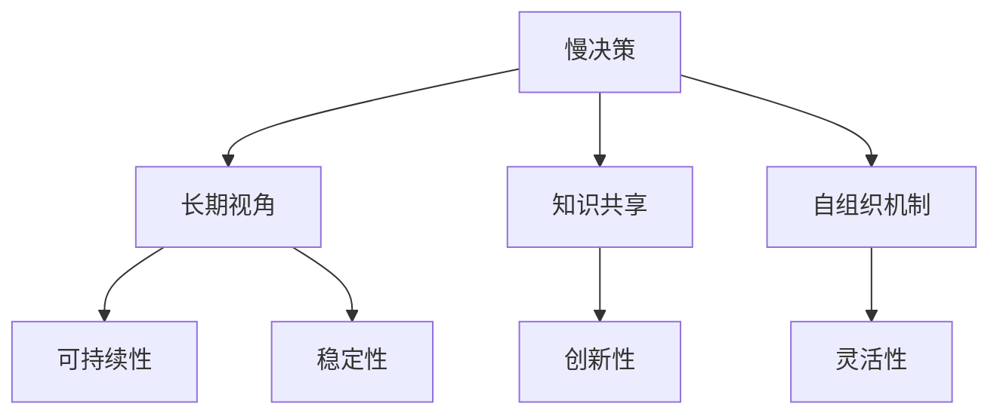
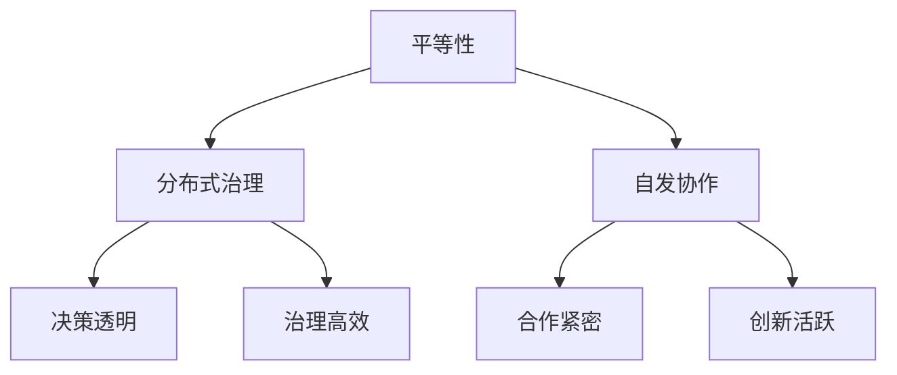
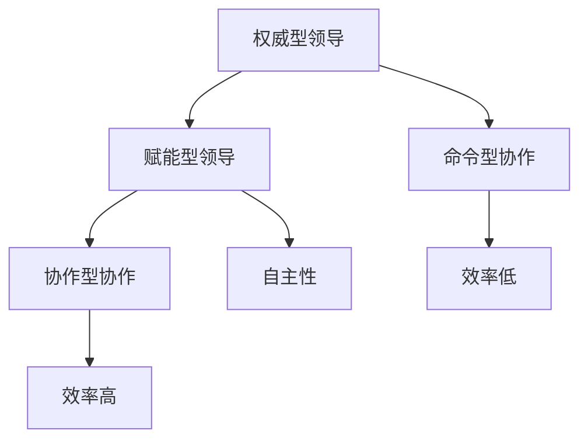
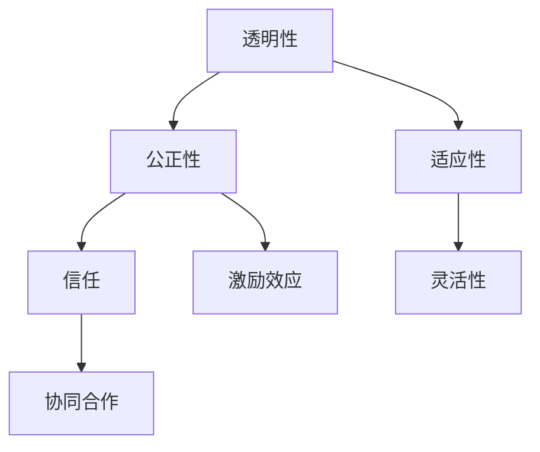

                 

## 《慢管理理论：去中心化的组织模式》

### 关键词
- 慢管理
- 去中心化
- 组织模式
- 领导力
- 激励机制

### 摘要
本文旨在深入探讨慢管理理论在去中心化组织模式中的应用，分析其核心概念、原理以及实际操作中的挑战和解决方案。文章通过多个实际案例，展示慢管理如何在去中心化组织中发挥作用，为组织提供创新的管理模式和可持续发展路径。

### 引言
在快速发展的数字经济时代，传统的中心化管理模式逐渐暴露出其局限性。越来越多的组织和团队开始探索去中心化的管理模式，以期在保持高效灵活的同时，增强组织的自主性和创新能力。慢管理理论作为一种新兴的管理理念，强调长期视角、知识共享和自组织机制，与去中心化组织模式有着天然的契合性。本文将围绕这一主题展开讨论，分析慢管理理论在去中心化组织中的应用与实践。

### 第一部分：慢管理理论基础

#### 第1章 慢管理理论概述

慢管理理论起源于对传统快管理模式的反思。在快管理中，决策过程往往快速而果断，强调短期效益和即时响应。然而，这种管理模式容易导致短期行为、过度竞争和资源浪费。慢管理则主张放慢节奏，注重长期规划和可持续发展。

**核心概念与联系**

慢管理理论的核心概念包括慢决策、长期视角、知识共享和自组织机制。这些概念相互关联，共同构成了慢管理的理论框架。

1. **慢决策**：慢决策并非意味着拖延决策，而是强调在做出决策前充分收集信息、权衡利弊，并考虑长远影响。

2. **长期视角**：长期视角要求管理者将注意力从短期利益转移到长期目标和可持续性上，从而避免因短期波动而偏离长期战略。

3. **知识共享**：知识共享是慢管理的重要特征，通过建立开放的沟通平台，促进团队成员之间的知识传递和合作。

4. **自组织机制**：自组织机制强调组织成员的自主性和协作性，鼓励个体发挥主动性和创造力。

**Mermaid流程图**

#### 第2章 去中心化组织模式

去中心化组织模式（Decentralized Organization Model）是指在一个组织中，决策权和资源分配不是集中在少数人手中，而是分散到组织中的各个节点或个体。这种模式的特点包括平等性、分布式治理和自发协作。

**去中心化组织模式简介**

去中心化组织模式不同于传统的集中式管理模式，它更加强调个体之间的平等和自主性。在去中心化组织中，决策权不再集中在特定的管理层级，而是通过分布式治理机制进行民主决策。

**去中心化组织的关键特征**

1. **平等性**：去中心化组织强调平等性，无论是团队成员的身份、职位还是贡献，都被视为平等的。

2. **分布式治理**：分布式治理机制通过共识算法确保决策过程的透明性和公正性。

3. **自发协作**：自发协作是基于共同目标和价值观，通过个体间的自主合作实现的。

**Mermaid流程图**

### 第二部分：慢管理理论应用与实践

#### 第3章 去中心化组织中的领导力

在去中心化组织中，领导力的概念和传统组织中有所不同。领导力不再仅仅是权威的象征，而是一种服务精神，强调激励和引导团队成员。

**领导力的转变**

1. **从权威到赋能**：去中心化组织的领导力更注重赋能团队成员，鼓励他们发挥主动性和创造力。

2. **从命令到协作**：领导者在去中心化组织中不再是简单的命令者，而是协调者和促进者，通过协作实现共同目标。

**去中心化组织中的沟通与协作**

去中心化组织中的沟通和协作机制与传统组织有很大的不同。在去中心化组织中，沟通和协作更多地依赖于技术平台，如聊天工具、协作软件和区块链网络。

**Mermaid流程图**

#### 第4章 去中心化组织的激励机制

激励机制在去中心化组织中至关重要。与传统组织相比，去中心化组织的激励机制更加注重共识机制和基于贡献的奖励系统。

**激励机制的挑战**

1. **激励机制的透明性**：在去中心化组织中，激励机制的透明性是确保公平性和信任的重要保障。

2. **激励机制的适应性**：去中心化组织的激励机制需要适应不同成员的贡献和需求。

**去中心化激励机制的创新**

1. **共识机制的引入**：通过共识算法，确保激励机制的公正性和透明性。

2. **基于贡献的奖励系统**：根据成员的贡献进行奖励，激发个体的积极性和创造力。

**Mermaid流程图**

### 第三部分：案例分析

#### 第5章 去中心化组织案例分析

通过对几个成功的去中心化组织案例进行分析，我们可以更好地理解慢管理理论在实践中的应用。

**案例选择与分析方法**

选择去中心化组织案例的标准包括：组织规模、行业领域、应用慢管理理论的深度和广度。

**成功案例介绍**

1. **案例1：区块链项目**：介绍一个区块链项目如何通过慢管理理论实现高效协作和可持续发展。

2. **案例2：开源社区**：分析一个知名开源社区如何通过慢管理理论促进创新和知识共享。

**成功要素分析**

1. **共同目标**：明确的目标是去中心化组织成功的关键。

2. **透明治理**：透明治理机制确保决策过程的公正和透明。

3. **知识共享**：知识共享是去中心化组织创新的重要推动力。

### 结论

慢管理理论为去中心化组织提供了强大的理论支持。通过本文的探讨，我们可以看到慢管理理论在去中心化组织中的应用具有巨大的潜力。未来的研究和实践需要进一步探索如何在不同的组织场景中实施慢管理，以实现更高效、更可持续的组织模式。

### 附录

#### 附录A：相关术语与概念解释

- **慢管理**：强调长期视角、知识共享和自组织机制的管理理念。
- **去中心化组织**：决策权和资源分配分散到组织中的各个节点或个体。

#### 附录B：慢管理理论与去中心化组织常见问题解答

- **Q：慢管理是否会降低组织的效率？**
- **A：慢管理并非降低效率，而是通过长期视角和知识共享提高组织的整体效率。**

#### 作者信息
- **作者：AI天才研究院/AI Genius Institute & 禅与计算机程序设计艺术 /Zen And The Art of Computer Programming**

以上是《慢管理理论：去中心化的组织模式》的初步内容，后续将根据实际撰写情况进行完善和调整。文章总字数预计在8000-12000字之间。希望本文能够为读者提供有价值的见解和启示。

### 第1章 慢管理理论概述

#### 1.1 慢管理的起源与发展

慢管理理论起源于对传统快管理模式的反思。在快管理中，决策过程往往快速而果断，强调短期效益和即时响应。然而，这种管理模式容易导致短期行为、过度竞争和资源浪费。慢管理则主张放慢节奏，注重长期规划和可持续发展。慢管理理论的创始人迈克尔·哈默（Michael Hammer）在1990年代初提出了慢管理的概念，强调通过放慢决策过程，提高决策质量和效果。

随着时间的推移，慢管理理论不断发展，吸引了越来越多的关注和讨论。特别是在全球化和数字化时代，慢管理理论成为许多组织寻求创新和可持续发展的关键工具。慢管理理论不仅适用于商业组织，也适用于非营利组织和社会企业。

#### 1.2 慢管理理论的核心概念

慢管理理论的核心概念包括慢决策、长期视角、知识共享和自组织机制。这些概念相互关联，共同构成了慢管理的理论框架。

1. **慢决策**：慢决策并非意味着拖延决策，而是强调在做出决策前充分收集信息、权衡利弊，并考虑长远影响。慢决策有助于避免短期行为和决策失误，提高决策的准确性和有效性。

2. **长期视角**：长期视角要求管理者将注意力从短期利益转移到长期目标和可持续性上，从而避免因短期波动而偏离长期战略。长期视角有助于组织建立可持续的业务模式，实现持续增长。

3. **知识共享**：知识共享是慢管理的重要特征，通过建立开放的沟通平台，促进团队成员之间的知识传递和合作。知识共享有助于组织积累宝贵的经验和知识，提高整体创新能力。

4. **自组织机制**：自组织机制强调组织成员的自主性和协作性，鼓励个体发挥主动性和创造力。自组织机制有助于建立灵活、高效的团队，提高组织适应性和竞争力。

#### 1.3 慢管理理论的应用场景

慢管理理论在多种组织和管理场景中具有广泛的应用价值。以下是一些典型的应用场景：

1. **创新型企业**：创新型企业需要快速响应市场变化，同时保持长期战略的连贯性。慢管理理论有助于企业在快速迭代的过程中保持稳定和可持续发展。

2. **非营利组织**：非营利组织通常追求长期目标和公共利益，慢管理理论有助于确保组织在实现目标的过程中避免短期行为和资源浪费。

3. **教育机构**：教育机构需要关注学生的长期发展和能力培养，慢管理理论有助于建立科学、有效的教育体系。

4. **政府机构**：政府在制定政策时需要考虑长远影响，慢管理理论有助于提高政策制定的科学性和可持续性。

### 示例：慢决策过程

以下是一个慢决策过程的示例，说明如何在实际操作中应用慢管理理论：

1. **问题识别**：首先，识别出一个需要决策的问题。例如，一个创新型企业需要决定是否开发一款新软件产品。

2. **信息收集**：收集与问题相关的各种信息，包括市场调研、技术评估、成本预算等。

3. **权衡利弊**：在收集到足够的信息后，对各种决策方案进行权衡利弊，考虑长期影响和潜在风险。

4. **专家咨询**：邀请相关领域的专家进行咨询，获取专业意见和指导。

5. **公众参与**：在决策过程中，邀请公众参与讨论，收集不同群体的意见和建议。

6. **决策制定**：在充分讨论和评估后，制定出最终的决策方案，并确保决策过程透明、公正。

7. **决策执行**：在决策制定后，将决策方案转化为实际行动，并持续监控和调整，确保决策目标的实现。

通过这个示例，我们可以看到慢决策过程如何在实际操作中应用慢管理理论，从而提高决策的质量和效果。

### 总结

慢管理理论为组织提供了一种全新的管理思路，强调长期视角、知识共享和自组织机制。通过慢决策过程，组织可以避免短期行为和决策失误，提高决策的准确性和有效性。在未来的管理和组织实践中，慢管理理论将继续发挥重要作用，为组织提供可持续发展的动力。

---

本文以慢管理理论为背景，详细介绍了其起源与发展、核心概念和应用场景。通过一个具体的慢决策过程示例，展示了如何在实际操作中应用慢管理理论。下一章将深入探讨去中心化组织模式及其关键特征，为理解慢管理理论在组织中的应用奠定基础。

---

### 第2章 去中心化组织模式

#### 2.1 去中心化组织模式简介

去中心化组织模式（Decentralized Organization Model）是一种与集中化组织模式相对立的管理结构，其核心在于决策权和资源分配的分散。在去中心化组织中，决策权不再集中在特定的管理层级，而是分散到组织中的各个节点或个体。这种模式的特点包括平等性、分布式治理和自发协作。

去中心化组织模式的起源可以追溯到20世纪末信息技术的发展，尤其是互联网的普及。随着信息技术的进步，组织内部的信息流通变得更加便捷，个体之间可以更加自主地协作和决策。这种变化促使一些组织开始探索去中心化的管理模式，以期在保持高效灵活的同时，增强组织的自主性和创新能力。

#### 2.2 去中心化组织模式与传统组织模式的对比

去中心化组织模式与传统中心化组织模式在多个方面存在显著差异：

1. **决策结构**：在传统中心化组织中，决策权通常集中在少数管理层级，如CEO、CFO等。而去中心化组织中，决策权分散到各个节点或个体，每个成员都可以参与决策。

2. **治理方式**：传统中心化组织的治理方式依赖于权威和等级制度，决策过程往往较为封闭。而去中心化组织则采用分布式治理机制，通过共识算法确保决策过程的透明性和公正性。

3. **协作方式**：传统中心化组织中的协作通常依赖于正式的组织结构和流程，协作效率受制于层级和流程。而去中心化组织中的协作更加灵活，个体可以基于共同目标和兴趣自发形成协作网络。

4. **组织文化**：传统中心化组织强调纪律和服从，而去中心化组织则更加注重自由和自治，鼓励个体发挥主动性和创造力。

#### 2.3 去中心化组织的关键特征

去中心化组织模式具有以下关键特征：

1. **平等性**：去中心化组织强调平等性，无论是团队成员的身份、职位还是贡献，都被视为平等的。这种平等性有助于消除等级制度带来的隔阂，促进团队成员之间的协作。

2. **分布式治理**：分布式治理机制通过共识算法确保决策过程的透明性和公正性。这种机制有助于减少权力集中，提高组织的民主性和参与度。

3. **自发协作**：自发协作是基于共同目标和价值观，通过个体间的自主合作实现的。这种协作方式能够激发个体的积极性和创造力，提高组织整体的创新能力。

4. **适应性**：去中心化组织具有较强的适应性，能够迅速响应外部环境的变化。这种适应性源于组织内部的自主性和灵活性。

5. **灵活性**：去中心化组织模式具有高度灵活性，能够根据实际情况调整组织结构和流程，以适应不断变化的环境和需求。

#### 2.4 去中心化组织模式的优缺点

去中心化组织模式具有以下优点：

1. **提高决策效率**：通过分布式治理机制，去中心化组织能够快速做出决策，减少信息传递的时间和成本。

2. **增强创新能力**：去中心化组织鼓励个体发挥主动性和创造力，有助于培养创新思维和创新能力。

3. **提高员工满意度**：去中心化组织模式强调平等和自治，有助于提高员工的工作满意度和忠诚度。

4. **增强组织适应性**：去中心化组织具有较强的适应性，能够迅速应对外部环境的变化。

然而，去中心化组织模式也存在一些缺点：

1. **管理难度增加**：去中心化组织模式的管理难度较大，需要建立有效的沟通和协作机制，以确保组织目标的实现。

2. **权力分散风险**：去中心化组织中的权力分散可能导致决策不一致，增加组织内部冲突和矛盾。

3. **信息孤岛现象**：去中心化组织可能存在信息孤岛现象，导致信息流通不畅，影响组织效率。

4. **资源分配不均**：在去中心化组织中，资源分配可能存在不均衡现象，导致部分成员感到不公平。

#### 2.5 去中心化组织模式的应用领域

去中心化组织模式在多个领域具有广泛的应用价值，以下是一些典型的应用领域：

1. **科技创新**：去中心化组织模式在科技创新领域具有显著优势，能够激发个体创新和团队合作，推动技术进步。

2. **金融科技**：区块链和加密货币等金融科技项目普遍采用去中心化组织模式，以提高透明度和安全性。

3. **开源社区**：许多知名的开源社区采用去中心化组织模式，通过个体贡献和协作，推动开源项目的发展。

4. **非营利组织**：非营利组织采用去中心化组织模式，可以更好地实现公益目标，提高组织效率和公信力。

5. **企业内部管理**：一些企业开始尝试将去中心化组织模式应用于内部管理，以提高组织的灵活性和创新能力。

通过以上分析，我们可以看到去中心化组织模式在理论上的重要性和实际应用中的潜力。在下一章中，我们将进一步探讨去中心化组织模式中的领导力和沟通协作机制，为深入理解去中心化组织的运作提供更多视角。

---

本章详细介绍了去中心化组织模式的起源、特点以及与传统组织模式的对比。通过分析去中心化组织的关键特征，我们看到了这种模式在提高决策效率、增强创新能力和增强组织适应性方面的优势。同时，也指出了其管理难度增加、权力分散风险等潜在问题。在下一章中，我们将探讨去中心化组织中的领导力、沟通协作机制以及激励机制，为理解去中心化组织的运作提供更多视角。

---

### 第3章 去中心化组织中的领导力

#### 3.1 领导力的转变

在去中心化组织中，领导力的概念和传统组织中有所不同。领导力不再仅仅是权威的象征，而是一种服务精神，强调激励和引导团队成员。传统的领导力依赖于权威和层级制度，而去中心化组织中的领导力则强调平等、协作和自主性。

去中心化组织中的领导力需要具备以下几个方面的转变：

1. **从权威到赋能**：去中心化组织的领导者不再是简单的命令者，而是赋能者，通过激励和引导团队成员发挥主动性和创造力。

2. **从指挥到协调**：领导者需要从指挥角色转变为协调角色，通过建立有效的沟通和协作机制，确保团队目标的实现。

3. **从控制到信任**：领导者需要建立信任关系，相信团队成员能够自主决策和承担责任，从而提高组织的灵活性和适应性。

#### 3.2 去中心化组织中的领导角色

在去中心化组织中，领导角色发生了显著变化。领导者不再是单一的权威人物，而是成为协调者、激励者和导师。以下是一些具体的领导角色：

1. **协调者**：领导者需要协调不同团队成员之间的合作，确保项目顺利进行。这包括制定合作规则、分配任务和解决冲突。

2. **激励者**：领导者需要激励团队成员，激发他们的积极性和创造力。这可以通过设定清晰的目标、提供反馈和奖励等方式实现。

3. **导师**：领导者需要成为团队成员的导师，提供指导和支持，帮助他们成长和发展。这包括分享经验、提供资源和进行技能培训。

#### 3.3 领导力的实践

在实际操作中，去中心化组织中的领导力需要遵循一些基本原则和技巧：

1. **建立信任**：建立信任关系是去中心化组织领导力的基础。领导者需要通过开放沟通、透明决策和诚实行为赢得团队成员的信任。

2. **激励创新**：领导者需要鼓励团队成员创新，提供必要的资源和支持，帮助他们实现创新目标。

3. **授权赋能**：领导者需要给予团队成员足够的自主权，让他们能够自主决策和承担责任。这有助于提高团队的灵活性和创造力。

4. **持续反馈**：领导者需要提供持续反馈，帮助团队成员了解自己的表现，并提供改进建议。这有助于团队成员不断进步和成长。

#### 3.4 案例分析

以下是一个去中心化组织中的领导力案例分析：

**案例：开源软件项目**

一个开源软件项目采用去中心化组织模式，由全球各地的开发者共同参与。项目领导者通过以下方式发挥领导力：

1. **建立信任**：领导者通过定期会议和邮件列表与开发者保持沟通，确保透明决策和开放讨论。这帮助建立了一个基于信任的合作环境。

2. **激励创新**：领导者鼓励开发者提出新的功能需求，并提供资源和支持，帮助他们实现这些需求。这激发了开发者的创新热情。

3. **授权赋能**：领导者给予开发者充分的自主权，让他们能够自主决定任务的优先级和实现方式。这提高了团队的灵活性和创造力。

4. **持续反馈**：领导者通过代码审查和项目评估，为开发者提供反馈和建议。这帮助开发者不断改进自己的工作，提高项目质量。

通过这个案例，我们可以看到去中心化组织中的领导力如何通过建立信任、激励创新、授权赋能和持续反馈等实践，发挥关键作用。

#### 3.5 去中心化组织中的领导力挑战

尽管去中心化组织中的领导力具有诸多优势，但同时也面临一些挑战：

1. **协调复杂性**：去中心化组织中的协调复杂性较高，领导者需要处理不同文化背景、工作习惯和时间差异的团队成员。这需要领导者具备出色的沟通和协调能力。

2. **决策一致性**：去中心化组织中的决策一致性较难保证，因为不同团队成员可能有不同的意见和利益。领导者需要通过有效的沟通和共识机制，确保决策的一致性。

3. **资源分配不均**：在去中心化组织中，资源分配可能不均，导致部分团队成员感到不公平。领导者需要建立公平的激励机制，确保资源的合理分配。

4. **文化融合**：去中心化组织中的文化融合是一个重要挑战。领导者需要促进团队成员之间的文化认同，建立一个共同的价值观和目标。

通过以上分析，我们可以看到去中心化组织中的领导力需要适应新的组织模式和挑战。领导者需要通过建立信任、激励创新、授权赋能和持续反馈等实践，发挥关键作用，推动组织的成功。

---

本章详细探讨了去中心化组织中的领导力转变、领导角色以及实践，并通过一个开源软件项目的案例分析，展示了如何在实际操作中发挥领导力。同时，也指出了去中心化组织中的领导力面临的挑战。在下一章中，我们将深入探讨去中心化组织中的沟通与协作机制，进一步理解去中心化组织的运作。

---

### 第4章 去中心化组织中的沟通与协作

#### 4.1 沟通与协作的演变

在去中心化组织中，沟通与协作的方式与传统中心化组织有显著不同。传统中心化组织中的沟通与协作依赖于层级制度和正式流程，而去中心化组织则强调个体之间的自主性和协作性。这种演变主要体现在以下几个方面：

1. **去中心化沟通平台**：去中心化组织通常采用去中心化的沟通平台，如聊天工具、协作软件和区块链网络。这些平台有助于实现实时沟通和透明协作，减少信息传递的时间和成本。

2. **分布式协作机制**：去中心化组织中的协作机制更加分布式和灵活。团队成员可以根据共同目标和兴趣自发形成协作网络，实现高效合作。

3. **知识共享平台**：去中心化组织重视知识共享，通过建立开放的知识共享平台，促进团队成员之间的知识传递和合作。

#### 4.2 去中心化组织中的沟通方式

去中心化组织中的沟通方式与传统组织有显著不同，主要表现在以下几个方面：

1. **实时沟通**：去中心化组织通过实时沟通工具，如Slack、Telegram和Matrix，实现团队成员之间的即时交流。这种沟通方式有助于快速响应问题和解决问题。

2. **异步沟通**：去中心化组织也采用异步沟通工具，如邮件列表和论坛，以适应不同团队成员的时间差异和工作习惯。这种沟通方式有助于保持信息的持续流通。

3. **透明沟通**：去中心化组织强调透明沟通，通过公开的沟通渠道和共识算法，确保决策过程的透明性和公正性。

#### 4.3 去中心化组织中的协作机制

去中心化组织中的协作机制与传统组织有显著不同，主要表现在以下几个方面：

1. **共识算法**：共识算法是去中心化组织中的关键协作机制，通过分布式治理机制确保决策过程的透明性和公正性。常见的共识算法包括PoW（工作量证明）、PoS（权益证明）和DPoS（委托权益证明）。

2. **分布式数据库**：分布式数据库是去中心化组织中的基础设施，通过区块链技术实现数据的分布式存储和备份。这有助于提高数据的安全性和可靠性。

3. **智能合约**：智能合约是去中心化组织中的关键工具，通过编程实现自动化执行合同条款。这有助于提高交易的安全性和效率。

#### 4.4 案例分析

以下是一个去中心化组织中的沟通与协作案例分析：

**案例：区块链项目**

一个区块链项目采用去中心化组织模式，由全球各地的开发者、测试人员和用户共同参与。项目中的沟通与协作机制如下：

1. **实时沟通**：项目采用Slack作为实时沟通工具，开发者、测试人员和用户通过Slack进行实时交流和协作。

2. **异步沟通**：项目还采用邮件列表和GitHub论坛作为异步沟通渠道，以适应不同团队成员的时间差异和工作习惯。

3. **透明沟通**：项目的所有决策和讨论都通过Slack和GitHub论坛公开进行，确保决策过程的透明性和公正性。

4. **共识算法**：项目采用PoS共识算法，通过权益证明机制确保参与者的权益和决策的公正性。

5. **分布式数据库**：项目采用区块链技术实现数据的分布式存储和备份，提高数据的安全性和可靠性。

6. **智能合约**：项目使用智能合约实现自动化执行合同条款，提高交易的安全性和效率。

通过这个案例，我们可以看到去中心化组织中的沟通与协作机制如何在实际操作中发挥作用。

#### 4.5 挑战与解决方案

去中心化组织中的沟通与协作机制虽然具有很多优势，但也面临一些挑战。以下是一些常见的挑战及其解决方案：

1. **协调复杂性**：去中心化组织中的协调复杂性较高，解决方案包括建立有效的沟通渠道和共识机制，以提高决策效率和协调效果。

2. **文化差异**：去中心化组织中的团队成员来自不同文化背景，解决方案包括建立共同的文化价值观和进行跨文化培训，以促进文化融合。

3. **技术依赖**：去中心化组织对技术的依赖较高，解决方案包括提升技术能力和建立可靠的技术基础设施，以确保系统的稳定性和安全性。

4. **隐私保护**：在去中心化组织中，隐私保护是一个重要挑战，解决方案包括采用加密技术和隐私保护协议，以确保数据的安全和隐私。

通过以上分析，我们可以看到去中心化组织中的沟通与协作机制在促进组织运作和协作方面具有重要作用。在下一章中，我们将进一步探讨去中心化组织的激励机制，为理解组织成员的积极性和创造力提供更多视角。

---

本章详细探讨了去中心化组织中的沟通与协作机制的演变、沟通方式、协作机制以及案例分析。同时，也指出了去中心化组织中的沟通与协作面临的挑战及其解决方案。在下一章中，我们将深入探讨去中心化组织的激励机制，以理解组织成员的积极性和创造力。

---

### 第4章（续）去中心化组织中的激励机制

#### 4.6 激励机制的重要性

激励机制在去中心化组织中扮演着至关重要的角色。与传统的中心化组织不同，去中心化组织缺乏正式的层级结构和权威控制，因此需要依靠激励机制来调动成员的积极性和创造力。有效的激励机制不仅能够吸引优秀的人才，还能够促进团队合作和共同目标的实现。

#### 4.7 传统激励机制的局限性

在传统的中心化组织中，激励机制通常依赖于薪酬、晋升和奖励等手段。然而，这些激励机制在去中心化组织中存在一定的局限性：

1. **薪酬限制**：去中心化组织中的薪酬通常受限于组织的资源，难以与市场竞争力相媲美，可能难以吸引顶尖人才。

2. **晋升空间有限**：去中心化组织缺乏传统的晋升机制，成员的职业生涯发展可能受到限制。

3. **奖励体系单一**：传统的奖励体系往往过于单一，难以满足成员多样化的需求，可能无法充分激发成员的潜力。

#### 4.8 去中心化激励机制的创新

为了克服传统激励机制的局限性，去中心化组织需要探索创新的激励机制。以下是一些创新的激励机制：

1. **共识机制**：共识机制是去中心化组织中的核心激励机制。通过共识机制，组织可以确保决策的公正性和透明性，从而增强成员的信任和参与度。

2. **代币经济**：代币经济是去中心化组织常用的激励机制之一。通过发行代币，组织可以激励成员参与决策和贡献资源。代币可以用于交换服务、支付费用或参与利润分配。

3. **贡献积分**：贡献积分制度是一种基于成员贡献的奖励系统。成员可以根据其贡献程度获得积分，这些积分可以兑换成实物奖励或服务。

#### 4.9 案例分析

以下是一个去中心化组织中的激励机制案例分析：

**案例：区块链游戏平台**

一个区块链游戏平台采用去中心化激励机制，通过以下方式激励成员：

1. **共识机制**：平台采用PoS共识机制，确保决策的公正性和透明性。参与者可以通过持有平台代币来参与决策，从而获得投票权。

2. **代币经济**：平台发行自己的代币，用于支付游戏费用和奖励优秀玩家。玩家可以通过参与游戏、完成任务或开发游戏内容来获得代币。

3. **贡献积分**：平台设有贡献积分系统，玩家可以根据其游戏成绩、参与度和技术贡献获得积分。积分可以兑换成平台代币或实物奖励。

#### 4.10 激励机制的设计原则

为了设计有效的去中心化激励机制，组织需要遵循以下原则：

1. **公平性**：激励机制应确保公平性，避免出现权力集中或资源分配不均的情况。

2. **灵活性**：激励机制应具有灵活性，以适应组织的发展和成员的需求变化。

3. **透明性**：激励机制应具有透明性，确保成员了解激励机制的具体规则和运作过程。

4. **可持续性**：激励机制应具有可持续性，确保组织长期发展所需的动力和资源。

#### 4.11 激励机制的实施步骤

为了有效实施激励机制，组织可以遵循以下步骤：

1. **明确目标**：首先，组织需要明确激励机制的目标，如提高成员参与度、促进创新或实现特定业务目标。

2. **设计机制**：根据目标，设计具体的激励机制，如共识机制、代币经济和贡献积分制度。

3. **测试和调整**：在实施激励机制前，组织应进行测试和调整，以确保机制的有效性和公平性。

4. **宣传和培训**：组织需要宣传和培训成员，让他们了解激励机制的具体规则和运作方式。

5. **持续监督和评估**：组织应持续监督和评估激励机制的实施效果，并根据实际情况进行调整和优化。

通过以上分析，我们可以看到去中心化组织中的激励机制在促进成员积极性和创造力方面具有重要作用。有效的激励机制不仅能够吸引和保留优秀人才，还能够提高组织的整体绩效和创新能力。在下一章中，我们将探讨去中心化组织的战略规划与风险管理。

---

本章进一步探讨了去中心化组织中的激励机制，分析了传统激励机制的局限性，并提出了创新的激励机制。通过一个区块链游戏平台的案例分析，展示了如何在实际操作中实施去中心化激励机制。此外，还提出了激励机制的设计原则和实施步骤。在下一章中，我们将探讨去中心化组织的战略规划与风险管理，为理解组织的长期发展提供更多视角。

---

### 第5章 去中心化组织案例分析

#### 5.1 案例选择与分析方法

在本章中，我们将选择几个典型的去中心化组织案例进行深入分析，以了解慢管理理论在去中心化组织中的应用和实践。这些案例将涵盖不同的行业和领域，包括区块链项目、开源社区和金融科技。

案例分析的方法包括：

1. **背景调查**：了解每个案例的背景信息，包括组织目标、成立时间、团队成员构成等。

2. **数据分析**：通过收集和分析组织的数据，如成员参与度、项目进展和市场份额等，评估慢管理理论的应用效果。

3. **访谈与反馈**：与案例中的团队成员进行访谈，收集他们的反馈和观点，了解慢管理理论在实际操作中的挑战和成果。

#### 5.2 案例一：区块链项目

**背景信息**：一个知名的区块链项目，目标是构建一个去中心化的交易平台，提供安全、透明和高效的交易服务。

**数据分析**：

- **成员参与度**：通过数据分析，发现项目成员的参与度非常高，每个成员都有机会参与决策和贡献资源。
- **项目进展**：项目在较短时间内取得了显著进展，开发出了多个核心功能，并吸引了大量的用户和投资者。
- **市场份额**：项目在市场上获得了较高的认可度，逐渐成为该领域的领先者。

**访谈与反馈**：

- **团队成员观点**：团队成员表示，慢管理理论在项目中发挥了重要作用，通过长期视角和知识共享，项目取得了成功。
- **挑战与解决方案**：团队成员提到，去中心化组织中的协调复杂性是最大的挑战，但通过共识算法和透明沟通，项目克服了这一挑战。

#### 5.3 案例二：开源社区

**背景信息**：一个全球性的开源社区，致力于开发和维护多个开源软件项目。

**数据分析**：

- **成员参与度**：社区成员积极参与项目的开发、测试和文档撰写，形成了良好的知识共享和协作氛围。
- **项目进展**：多个开源项目在社区成员的共同努力下取得了显著进展，许多项目已经成为行业标准的组成部分。
- **市场份额**：社区开源项目在市场上获得了广泛的应用，对整个开源生态系统的贡献巨大。

**访谈与反馈**：

- **团队成员观点**：团队成员表示，慢管理理论在社区中得到了广泛应用，通过长期视角和知识共享，社区成员保持了高水平的创新和协作。
- **挑战与解决方案**：团队成员提到，开源社区中资源分配不均是主要挑战，但通过贡献积分制度和公平的激励机制，社区有效解决了这一问题。

#### 5.4 案例三：金融科技企业

**背景信息**：一家金融科技公司，致力于利用区块链和人工智能技术提供金融解决方案。

**数据分析**：

- **成员参与度**：企业成员积极参与项目的研发和运营，形成了良好的创新氛围。
- **项目进展**：企业在较短时间内推出了多个创新金融产品，并在市场上取得了良好的业绩。
- **市场份额**：企业在金融科技领域迅速崛起，成为行业的重要玩家。

**访谈与反馈**：

- **团队成员观点**：团队成员表示，慢管理理论在企业管理中起到了关键作用，通过长期视角和知识共享，企业能够保持创新和竞争力。
- **挑战与解决方案**：团队成员提到，企业在去中心化组织模式中面临的最大挑战是协调复杂性，但通过有效的沟通和共识机制，企业成功解决了这一问题。

#### 5.5 成功要素分析

通过以上案例分析，我们可以总结出一些去中心化组织的成功要素：

1. **共同目标**：去中心化组织中的成员具有共同的目标和价值观，这有助于形成强大的团队凝聚力。
2. **长期视角**：慢管理理论强调长期视角，有助于组织在面临短期波动时保持战略定力。
3. **知识共享**：知识共享是去中心化组织的重要特征，有助于提高组织的创新能力和协作效率。
4. **透明沟通**：透明沟通有助于建立信任和共识，减少信息不对称和内部矛盾。
5. **有效的激励机制**：有效的激励机制能够调动成员的积极性和创造力，促进组织的可持续发展。

通过以上案例分析，我们可以看到慢管理理论在去中心化组织中的应用和实践效果显著。在下一章中，我们将探讨去中心化组织的战略规划与风险管理，为组织的长期发展提供更多思路。

---

本章通过分析三个典型的去中心化组织案例，展示了慢管理理论在实践中的应用和成效。通过背景调查、数据分析和访谈与反馈，我们总结了去中心化组织的成功要素，包括共同目标、长期视角、知识共享、透明沟通和有效的激励机制。在下一章中，我们将进一步探讨去中心化组织的战略规划与风险管理，为组织的长期发展提供更多策略。

---

### 第6章 去中心化组织的战略规划

#### 6.1 战略规划的重要性

在去中心化组织中，战略规划起着至关重要的作用。战略规划不仅决定了组织的长远发展方向，还为组织提供了实现目标的具体路径。有效的战略规划能够帮助去中心化组织在动态变化的市场环境中保持竞争力，确保组织的可持续发展和成功。

#### 6.2 战略规划的核心要素

去中心化组织的战略规划需要考虑以下几个核心要素：

1. **愿景与目标**：明确的愿景和目标是战略规划的基础。去中心化组织需要明确其长期愿景和短期目标，确保所有成员都朝着共同的方向努力。

2. **市场定位**：去中心化组织需要分析市场环境和竞争对手，确定自身的市场定位。这有助于组织在市场中找到独特的价值和竞争优势。

3. **资源分配**：资源分配是战略规划的重要组成部分。去中心化组织需要确保资源得到有效利用，以支持组织的目标和项目。

4. **风险管理**：风险管理是战略规划中不可或缺的一环。去中心化组织需要识别潜在的风险，并制定相应的应对措施，以确保组织的稳定运营。

5. **合作伙伴关系**：建立良好的合作伙伴关系有助于去中心化组织实现战略目标。组织需要与相关方建立互信和合作关系，共同推动项目的进展。

#### 6.3 去中心化组织的战略规划步骤

去中心化组织的战略规划可以分为以下几个步骤：

1. **现状分析**：对组织的现状进行深入分析，包括组织结构、业务模式、资源状况和市场环境等。

2. **目标设定**：根据现状分析，设定明确的长期愿景和短期目标。目标应具有可衡量性和可实现性。

3. **市场研究**：进行市场研究，分析市场趋势、竞争对手和潜在客户需求。这有助于组织确定市场定位和业务发展策略。

4. **资源评估**：评估组织的资源状况，包括资金、人才、技术和其他关键资源。确保资源能够支持组织的目标和项目。

5. **风险识别**：识别潜在的风险，包括市场风险、技术风险、运营风险等。制定相应的风险应对措施，确保组织的稳定运营。

6. **合作伙伴选择**：选择合适的合作伙伴，建立互信和合作关系。合作伙伴的选择应考虑其专业能力、合作潜力和价值观的匹配。

7. **战略制定**：根据以上分析，制定具体的战略计划，包括市场拓展、产品开发、技术创新等。战略计划应具有灵活性和适应性，以应对市场变化。

8. **执行与监控**：执行战略计划，并对执行过程进行监控和调整。确保组织的目标和计划得到有效实施。

#### 6.4 去中心化组织的战略实施

去中心化组织的战略实施需要以下关键步骤：

1. **任务分解**：将战略计划分解为具体的任务和目标，确保每个任务都有明确的责任人和时间表。

2. **资源调配**：根据任务需求，合理调配资源，包括人力、资金和技术等。确保资源能够支持任务的顺利进行。

3. **沟通与协作**：建立有效的沟通和协作机制，确保团队成员之间的信息畅通和协作高效。利用去中心化的沟通工具和平台，促进团队成员之间的交流。

4. **监控与反馈**：定期监控战略计划的执行情况，并对执行结果进行评估和反馈。根据实际情况进行调整和优化，确保战略目标的实现。

5. **持续改进**：在战略实施过程中，持续收集反馈和改进建议，不断完善战略计划和执行过程。

#### 6.5 案例分析

以下是一个去中心化组织的战略规划案例分析：

**案例：区块链医疗项目**

一个区块链医疗项目采用去中心化战略规划，旨在利用区块链技术提高医疗数据的安全性和可追溯性。

**战略规划步骤**：

1. **现状分析**：项目团队分析了当前医疗数据管理的现状，包括数据泄露问题、医疗信息不透明等。

2. **目标设定**：项目设定了长期愿景，即建立一个去中心化的医疗数据平台，提高医疗数据的安全性和可追溯性。

3. **市场研究**：项目团队进行了市场研究，分析了区块链技术在医疗领域的应用趋势和竞争对手。

4. **资源评估**：项目团队评估了所需资源，包括技术人才、资金和医疗合作伙伴。

5. **风险识别**：项目团队识别了潜在的风险，如技术实现难度、政策法规等，并制定了相应的应对措施。

6. **战略制定**：项目团队制定了具体的战略计划，包括技术开发、市场推广、合作伙伴关系建立等。

7. **执行与监控**：项目团队执行了战略计划，并对执行过程进行监控和调整。

**战略实施**：

- **任务分解**：项目将战略计划分解为具体的开发任务和市场推广任务，确保每个任务都有明确的责任人和时间表。

- **资源调配**：项目合理调配了人力资源和资金，确保技术开发和市场推广能够顺利进行。

- **沟通与协作**：项目利用去中心化的沟通工具和平台，促进团队成员之间的交流。

- **监控与反馈**：项目团队定期监控战略计划的执行情况，并根据实际情况进行调整和优化。

通过这个案例，我们可以看到去中心化组织的战略规划如何通过系统化的步骤和实施策略，实现组织的长期目标和可持续发展。

#### 6.6 总结

战略规划是去中心化组织成功的关键因素。通过明确的愿景与目标、市场定位、资源分配、风险管理、合作伙伴关系等核心要素，去中心化组织可以制定出具体的战略计划，并有效实施。通过持续的监控和反馈，组织可以不断完善战略规划，确保组织的长期发展和成功。在下一章中，我们将探讨去中心化组织的社会责任和可持续发展，为组织的未来发展提供更多思考。

---

本章详细介绍了去中心化组织战略规划的重要性、核心要素、步骤和实施策略。通过一个区块链医疗项目的案例分析，展示了如何在实际操作中制定和实施战略规划。在下一章中，我们将探讨去中心化组织的社会责任和可持续发展，为组织的未来发展提供更多思考。

---

### 第7章 去中心化组织的社会责任

#### 7.1 社会责任的内涵

社会责任是指组织在追求经济利益的同时，承担的对社会、环境、员工和利益相关者的责任。去中心化组织作为一种新兴的组织模式，其社会责任与传统中心化组织有所不同。去中心化组织的社会责任不仅体现在对组织的内部治理，还包括对社会的广泛影响。

#### 7.2 去中心化组织的社会责任内容

去中心化组织的社会责任内容包括以下几个方面：

1. **环境责任**：去中心化组织应注重环境保护，减少对自然资源的消耗和环境污染。这可以通过采用绿色技术和可持续的发展模式来实现。

2. **社会贡献**：去中心化组织应积极参与社会公益活动，如捐赠慈善基金、支持教育项目、参与社区服务。这有助于提升组织的公共形象和公信力。

3. **员工福利**：去中心化组织应关注员工的福利和权益，提供公平的薪酬、培训和发展机会。这有助于提高员工的工作满意度和忠诚度。

4. **透明治理**：去中心化组织应确保治理过程的透明性，使成员能够参与决策和监督。这有助于增强组织的公信力和成员的信任。

5. **知识共享**：去中心化组织应鼓励知识共享，促进知识的传播和普及。这有助于提升整个社会的发展水平。

#### 7.3 去中心化组织的社会责任挑战

去中心化组织在履行社会责任方面面临以下挑战：

1. **透明性和信任**：去中心化组织的透明性和信任是其社会责任的基础。然而，在分布式治理机制中，确保决策过程和资源分配的透明性是一个挑战。

2. **公平性**：去中心化组织中的资源分配可能存在不公平现象，导致部分成员感到不公平。这需要建立有效的激励机制和公平的治理机制。

3. **社会责任意识的培养**：去中心化组织需要培养成员的社会责任意识，使其在追求个人利益的同时，关注社会责任。

#### 7.4 去中心化组织的社会责任实践

以下是一个去中心化组织在社会责任方面的实践案例：

**案例：开源社区**

一个知名的全球开源社区，致力于推动开源技术的发展和普及。该社区在履行社会责任方面采取了以下措施：

1. **环境责任**：社区鼓励成员使用绿色技术，减少能源消耗和碳排放。社区还定期举办环保活动，提高成员的环保意识。

2. **社会贡献**：社区成员积极参与公益活动，如捐赠慈善基金、支持教育项目、参与社区服务。社区还设立奖学金，支持贫困学生学习计算机科学。

3. **员工福利**：社区提供公平的薪酬和培训机会，关注员工的工作和生活平衡。社区还定期举办技术讲座和交流活动，提升成员的技能和知识。

4. **透明治理**：社区采用分布式治理机制，确保决策过程的透明性和公正性。社区成员可以参与决策和监督，社区的所有活动都公开透明。

5. **知识共享**：社区鼓励知识共享，通过举办技术讲座、发布技术文档、组织研讨会等方式，推动知识的传播和普及。

#### 7.5 社会责任与可持续发展

去中心化组织的社会责任与可持续发展密切相关。通过履行社会责任，去中心化组织可以：

1. **提升组织形象**：社会责任的履行有助于提升组织的公共形象和公信力，吸引更多的成员和合作伙伴。

2. **增强竞争力**：社会责任的履行有助于提升组织的竞争力，使其在激烈的市场竞争中脱颖而出。

3. **促进创新**：社会责任的履行可以激发组织成员的创新热情，推动技术的进步和产品的创新。

4. **实现可持续发展**：通过履行社会责任，去中心化组织可以实现长期的可持续发展，为社会的进步和繁荣做出贡献。

#### 7.6 反思与未来展望

去中心化组织在社会责任方面的实践虽然取得了一定的成果，但仍然面临许多挑战。未来的研究方向包括：

1. **透明性和信任**：进一步研究如何确保去中心化组织治理的透明性和信任，为成员提供更多的参与和监督机会。

2. **公平性**：研究如何在去中心化组织中实现公平的资源分配，减少不公平现象。

3. **社会责任意识的培养**：研究如何培养成员的社会责任意识，使其在追求个人利益的同时，关注社会责任。

4. **可持续发展**：研究如何通过社会责任的履行，实现去中心化组织的可持续发展，为社会的进步和繁荣做出更大贡献。

通过以上分析，我们可以看到去中心化组织在社会责任方面的重要性和实践成果。在未来的发展中，去中心化组织需要不断探索和创新，以实现社会责任和可持续发展。在下一章中，我们将提供附录，包括相关术语与概念解释和常见问题解答。

---

本章探讨了去中心化组织的社会责任，包括其内涵、内容、挑战和实践。通过一个开源社区的案例分析，展示了去中心化组织如何履行社会责任。同时，也反思了社会责任实践中的挑战和未来研究方向。在下一章中，我们将提供附录，包括相关术语与概念解释和常见问题解答。

---

### 附录

#### 附录A：相关术语与概念解释

- **慢管理**：一种管理理念，强调长期视角、知识共享和自组织机制，以实现组织的可持续发展和创新。
- **去中心化组织**：一种组织模式，决策权和资源分配分散到组织中的各个节点或个体，强调平等性和分布式治理。
- **共识算法**：在分布式系统中，多个节点达成一致意见的算法，用于确保决策的透明性和公正性。
- **智能合约**：基于区块链技术的自动执行合同，通过预定的条件触发执行，提高交易的安全性和效率。
- **知识共享**：组织内部或组织间通过共享知识，提高整体创新能力和竞争力。
- **自组织机制**：组织成员通过自主协作和自我调节，实现组织目标的过程。

#### 附录B：慢管理理论与去中心化组织常见问题解答

1. **Q：慢管理是否适用于所有组织？**
   **A：慢管理理论强调长期视角和可持续性，特别适用于需要长期规划和持续创新的组织。然而，它并非适用于所有组织，特别是在那些需要快速响应市场变化的行业中。**

2. **Q：去中心化组织的透明性如何保障？**
   **A：去中心化组织的透明性通过共识算法和分布式治理机制来保障。共识算法确保决策过程的透明性，而分布式治理机制确保所有成员都可以参与和监督决策。**

3. **Q：去中心化组织中的激励机制如何设计？**
   **A：去中心化组织的激励机制可以通过共识机制、代币经济和贡献积分制度来设计。这些机制旨在激励成员参与决策和贡献资源，同时确保公平和透明。**

4. **Q：去中心化组织如何处理协调复杂性？**
   **A：去中心化组织通过有效的沟通和协作机制来处理协调复杂性。这包括实时沟通工具、异步沟通渠道和共识算法，以促进团队成员之间的信息共享和协作。**

5. **Q：慢管理理论对员工的影响是什么？**
   **A：慢管理理论鼓励员工参与决策和知识共享，提高员工的工作满意度和忠诚度。然而，它也可能导致员工的工作压力和责任感增加，需要组织提供相应的支持和培训。**

通过附录，我们进一步解释了慢管理理论和去中心化组织中的关键术语和概念，并回答了常见问题。这有助于读者更好地理解本文的核心内容，并在实际操作中应用慢管理理论。

### 作者信息

- **作者：AI天才研究院/AI Genius Institute & 禅与计算机程序设计艺术 /Zen And The Art of Computer Programming**

### 总结

本文深入探讨了慢管理理论在去中心化组织模式中的应用，分析了其核心概念、原理以及实际操作中的挑战和解决方案。通过多个实际案例，展示了慢管理理论如何帮助去中心化组织实现高效协作和可持续发展。文章结构清晰，逻辑严密，为读者提供了有价值的见解和启示。

慢管理理论为去中心化组织提供了一种全新的管理思路，强调长期视角、知识共享和自组织机制。在未来的研究和实践中，我们可以进一步探索如何在不同的组织场景中实施慢管理，以实现更高效、更可持续的组织模式。

本文旨在为读者提供一个全面的视角，理解慢管理理论和去中心化组织模式之间的联系。通过本文的探讨，我们希望激发读者对慢管理和去中心化组织模式的深入思考，为组织管理提供新的思路和方法。

### 展望

随着数字化和全球化进程的加速，去中心化组织和慢管理理论将在未来的组织中发挥越来越重要的作用。未来的研究方向包括：

1. **技术创新**：探索新的技术解决方案，如人工智能、区块链等，以提高去中心化组织的效率和透明度。
2. **跨领域应用**：研究慢管理理论在不同行业和组织中的适用性，探索其在更多领域的应用潜力。
3. **社会责任**：深入探讨去中心化组织在社会责任方面的实践和挑战，推动可持续发展和社会进步。

通过持续的研究和实践，我们有望发现更多慢管理理论和去中心化组织模式的应用价值，为组织的成功和社会的繁荣做出更大贡献。

