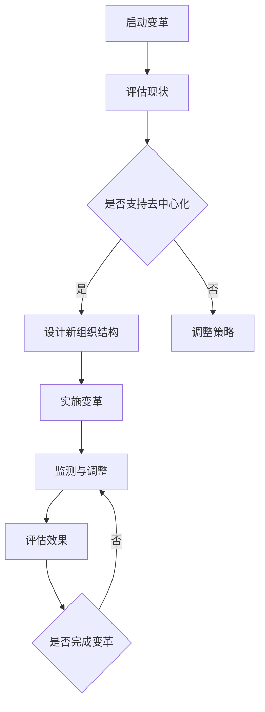

                 


### 1. 理解文章标题

文章的标题是《慢管理革命：去中心化的组织变革》。这个标题至少揭示了以下几个关键信息：

- **慢管理革命**：这表明文章讨论的是一种新型的管理方法或理念，称为“慢管理革命”。慢管理可能与快速、高效的传统管理方法相对立，强调的是管理的深度、可持续性和灵活性。
- **去中心化的组织变革**：这个短语强调了文章的主题关注点在于组织结构和运营方式的变革，特别是从传统的中心化模式转向去中心化的模式。去中心化是近年来的一个热门话题，尤其在信息技术和数字经济领域，它通常意味着更加平等、分布式和开放的组织形态。

### 2. 确定目标读者

为了更好地撰写这篇文章，我们需要确定文章的目标读者。考虑到文章的主题涉及管理变革和组织设计，目标读者可能包括：

- **企业管理者**：他们对如何优化组织结构和提高管理效率有浓厚的兴趣。
- **组织变革顾问**：他们需要了解最新的管理理念和工具，以帮助客户实现组织变革。
- **管理学者**：他们需要深入研究慢管理和去中心化组织变革的理论和实践。
- **技术爱好者**：他们可能对如何将技术应用于管理变革感兴趣。

### 3. 核心概念与联系

为了撰写这篇文章，我们需要明确几个核心概念，并探讨它们之间的联系：

- **慢管理**：这是一个新兴的管理理念，强调深度思考和长期规划，反对短期行为和快速决策。
- **去中心化**：这是一种组织结构，权力和决策分散在组织中的各个节点，而不是集中于某个中心点。
- **组织变革**：这是指组织在结构、文化、流程等方面的调整，以适应外部环境或内部需求的变化。

这三种概念之间的关系可以表示为：

- 慢管理革命是推动组织变革的一种方式，它倡导在变革过程中采取更深思熟虑和可持续的决策。
- 去中心化则是慢管理革命所追求的目标之一，通过去中心化，组织可以实现更加平等、分布式和灵活的运作方式。
- 组织变革是慢管理革命和去中心化实现的关键步骤，它涉及对组织结构、流程和文化等方面的调整。

### 4. 书籍结构与内容设计

为了撰写这篇文章，我们需要设计一个合理的章节结构，确保文章内容逻辑清晰，内容丰富。以下是一个初步的书籍结构设计：

#### 第一部分：慢管理革命概述

- **第1章**：慢管理的起源与演变
  - 慢管理的定义与核心思想
  - 慢管理与快管理的区别
  - 去中心化背景下的慢管理趋势

- **第2章**：去中心化的概念与优势
  - 去中心化的定义与历史发展
  - 去中心化在管理中的重要性
  - 去中心化与组织效率的关系

- **第3章**：慢管理革命的关键要素
  - 慢管理的核心价值观
  - 去中心化组织的构建
  - 慢管理革命对组织文化的影响

#### 第二部分：去中心化组织变革实践

- **第4章**：去中心化组织设计
  - 去中心化组织结构的特点
  - 设计去中心化组织的策略
  - 去中心化组织中的角色与职责

- **第5章**：慢管理领导力
  - 领导角色的转变
  - 去中心化领导力的核心能力
  - 慢管理领导力的实践案例

- **第6章**：去中心化协作与沟通
  - 去中心化协作的挑战与机遇
  - 去中心化沟通的有效策略
  - 实现高效去中心化协作的案例

- **第7章**：慢管理与绩效评估
  - 绩效评估的去中心化方法
  - 去中心化绩效管理的优势
  - 实现去中心化绩效管理的案例

- **第8章**：慢管理革命的组织准备
  - 组织变革前的评估
  - 慢管理革命的实施步骤
  - 慢管理革命中的风险管理

#### 第三部分：慢管理革命的未来

- **第9章**：慢管理革命的未来趋势
  - 技术进步与慢管理
  - 慢管理与可持续发展
  - 慢管理革命的未来展望

- **第10章**：案例分析
  - 成功的慢管理案例
  - 失败的慢管理案例
  - 从案例中学习与反思

- **第11章**：慢管理革命与企业文化
  - 企业文化与慢管理革命的关系
  - 建立支持慢管理的文化
  - 慢管理革命对企业文化的启示

### 5. 目录大纲细化

在初步确定书籍结构后，我们需要细化每个章节的内容，确保每个章节都有具体的子章节，每个子章节都要有明确的内容。

#### 第1章：慢管理的起源与演变

- **1.1 慢管理的定义与核心思想**
  - 慢管理的概念解释
  - 慢管理的核心思想
  - 慢管理与传统管理的对比

- **1.2 慢管理与快管理的区别**
  - 快管理的特点
  - 慢管理的特点
  - 两种管理方式的优缺点分析

- **1.3 去中心化背景下的慢管理趋势**
  - 去中心化与慢管理的结合
  - 慢管理在去中心化组织中的应用
  - 去中心化背景下的慢管理案例研究

#### 第2章：去中心化的概念与优势

- **2.1 去中心化的定义与历史发展**
  - 去中心化的基本概念
  - 历史上去中心化的发展过程
  - 去中心化在不同领域的应用

- **2.2 去中心化在管理中的重要性**
  - 去中心化与组织效率的关系
  - 去中心化与组织灵活性的关系
  - 去中心化对企业管理的影响

- **2.3 去中心化与组织效率的关系**
  - 去中心化如何提高组织效率
  - 去中心化对组织成本的影响
  - 去中心化在大型组织中的挑战

#### 第3章：慢管理革命的关键要素

- **3.1 慢管理的核心价值观**
  - 慢管理的核心价值观
  - 慢管理如何塑造组织文化
  - 慢管理在实践中的应用

- **3.2 去中心化组织的构建**
  - 去中心化组织的结构特点
  - 去中心化组织的决策机制
  - 去中心化组织的优势与挑战

- **3.3 慢管理革命对组织文化的影响**
  - 慢管理如何改变组织文化
  - 去中心化与组织文化的相互作用
  - 慢管理革命对员工行为的影响

### 6. Mermaid流程图设计

为了更好地展示去中心化组织变革的过程，我们可以设计一个Mermaid流程图。



### 7. 数学模型和伪代码

为了深入探讨去中心化组织的效率，我们可以引入一个数学模型和相应的伪代码。

**数学模型：**
$$
E = \frac{1}{1 + \frac{K}{N}}
$$
其中，$E$为组织效率，$K$为协作成本，$N$为组织节点数。

**伪代码：**
```
function evaluate_efficiency(K, N):
    E = 1 / (1 + K / N)
    return E
```

### 8. 项目实战

为了展示慢管理革命和去中心化组织变革的具体实践，我们可以设计一个实际的项目案例。

**项目案例：** 一个跨国公司在全球范围内推行去中心化管理模式，通过分权化和自主决策来提高组织效率和灵活性。

- **开发环境搭建：** 使用Git和GitHub搭建分布式开发环境。
- **源代码实现：** 设计一个去中心化的决策系统，通过智能合约实现自动化的决策执行。
- **代码解读：** 分析智能合约的代码实现，解释其工作原理。
- **应用解读与分析：** 分析去中心化决策系统在实际应用中的效果和挑战。
- **实际案例剖析：** 介绍成功和失败的具体案例，从中学习经验和教训。

### 9. 总结与拓展

在文章的最后，我们需要对慢管理革命和去中心化组织变革进行总结，并提出最佳实践建议。

- **总结：** 慢管理革命和去中心化组织变革是应对数字化时代组织变革的有效方法。通过深度思考和长期规划，组织可以实现更加高效、灵活和可持续的发展。
- **最佳实践：** 提供一些具体的管理实践建议，如如何进行组织变革前的评估、如何设计去中心化组织结构等。
- **注意事项：** 强调在实施慢管理革命和去中心化组织变革过程中可能遇到的风险和挑战。
- **拓展阅读：** 推荐一些相关的书籍、论文和研究报告，供读者进一步学习。

---

通过以上步骤，我们已经为《慢管理革命：去中心化的组织变革》设计了一个初步的目录大纲。接下来，我们将逐步撰写每个章节的内容，确保文章逻辑清晰、内容丰富，并满足上述所有约束条件。

