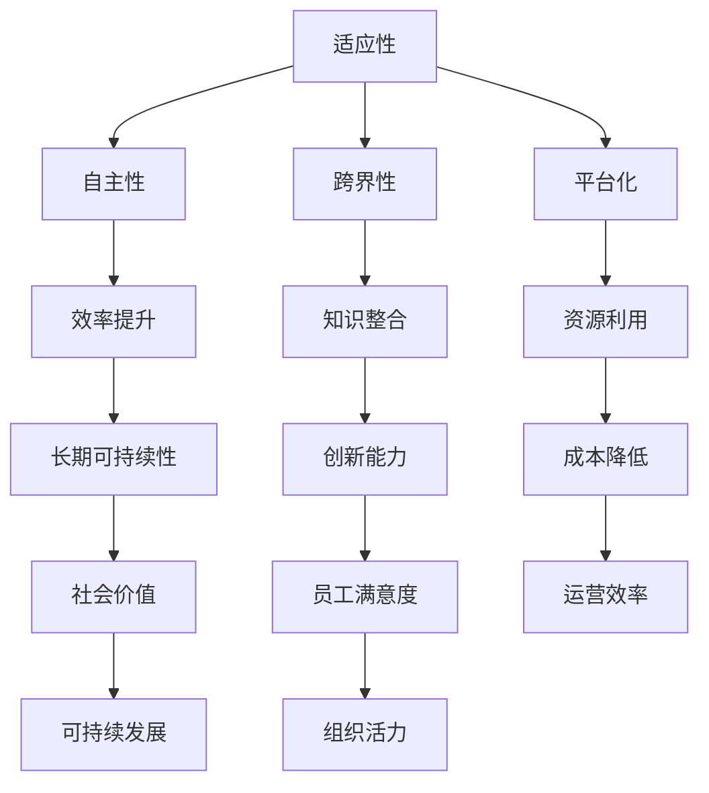
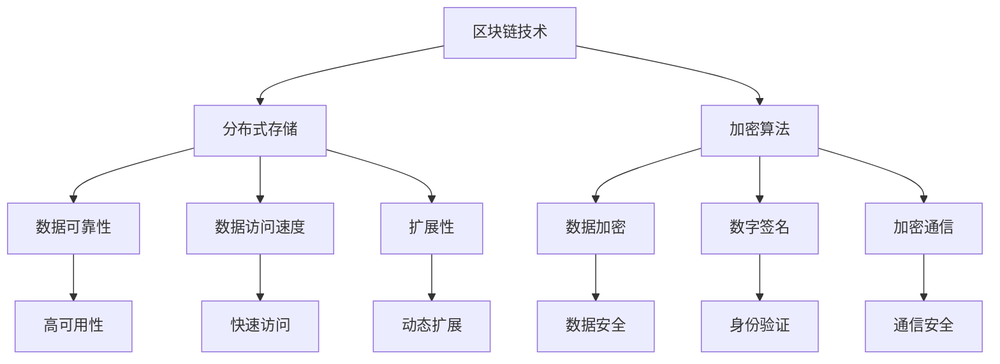
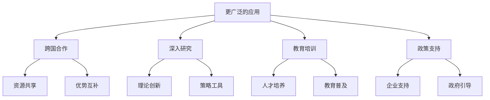
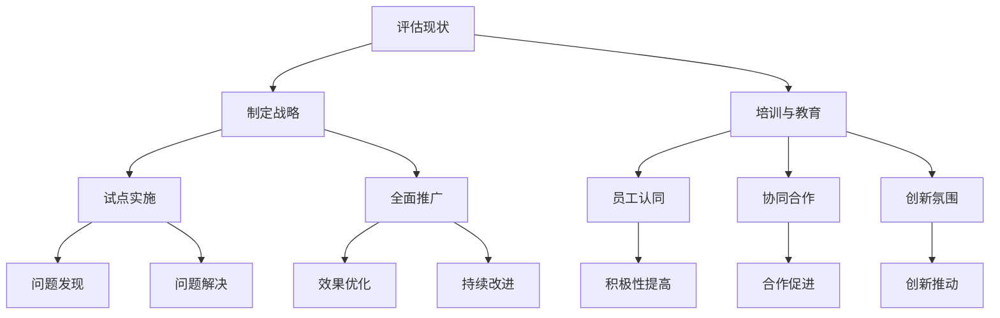

                 

## 文章标题：慢管理革命：去中心化组织的效率提升

### 关键词：
- 慢管理
- 去中心化组织
- 效率提升
- 区块链技术
- 分布式存储
- 加密算法

### 摘要：
本文深入探讨慢管理革命在去中心化组织中的应用，揭示其提升效率的核心原理与实施策略。通过分析慢管理的起源、原则、技术基础及其在数字化转型中的角色，本文旨在为读者提供一份全面的指南，帮助他们在去中心化组织中实现高效的运营与管理。

## 目录

### 第一部分：慢管理革命的背景与理论

#### 第1章：慢管理的起源与理念

1.1 慢管理的概念

1.2 慢管理的历史背景

1.3 慢管理的核心理念

#### 第2章：慢管理的基本原则

2.1 适应性原则

2.2 自主性原则

2.3 跨界性原则

2.4 平台化原则

#### 第3章：慢管理在组织中的应用

3.1 去中心化组织的结构

3.2 去中心化组织的运营

3.3 去中心化组织的挑战与解决方案

#### 第4章：慢管理的理论基础

4.1 去中心化理论

4.2 效率提升理论

4.3 慢管理与社会责任

### 第二部分：慢管理的技术基础

#### 第5章：去中心化技术与慢管理

5.1 区块链技术

5.2 分布式存储

5.3 加密算法

#### 第6章：慢管理的工具与实践

6.1 慢管理工具介绍

6.2 实践案例分享

6.3 成功案例分析

#### 第7章：数字化转型中的慢管理

7.1 数字化转型的挑战

7.2 慢管理在数字化转型中的应用

7.3 数字化转型与慢管理的融合

### 第三部分：慢管理革命的未来

#### 第8章：慢管理革命的趋势

8.1 慢管理革命的未来方向

8.2 慢管理与人工智能的融合

8.3 全球范围内的慢管理传播

#### 第9章：慢管理革命的实施策略

9.1 实施慢管理革命的步骤

9.2 组织文化转变的重要性

9.3 慢管理革命的实践案例

## 第一部分：慢管理革命的背景与理论

### 第1章：慢管理的起源与理念

#### 1.1 慢管理的概念

慢管理（Slow Management）是一种反传统的管理理念，它提倡在决策过程中放慢脚步，追求深度思考、可持续性和人性化的管理方式。与快管理（Fast Management）强调快速决策和高效执行不同，慢管理更注重过程的完整性和结果的长期可持续性。

慢管理的概念起源于20世纪90年代，由意大利作家卡尔洛·莫里诺提出。他认为，快速决策和执行往往导致短期内的效率提升，但长期来看可能带来资源浪费和环境问题。因此，他倡导通过放慢决策和执行的速度，来提高管理的深度和质量。

#### 1.2 慢管理的历史背景

慢管理理念的产生与全球化竞争加剧、信息技术迅猛发展、企业环境不确定性增加等因素密切相关。在过去，企业管理主要依赖于权威和命令式的管理模式，但这种方式在复杂多变的环境中逐渐暴露出其局限性。慢管理则提供了一种更为灵活和适应性的管理方式，能够更好地应对快速变化的市场环境。

此外，随着社会对可持续发展和人文关怀的重视，慢管理也逐渐受到企业和个人的关注。它不仅关注经济效益，还关注社会、环境和员工福利，是一种更加全面和平衡的管理理念。

#### 1.3 慢管理的核心理念

慢管理强调以下几个核心理念：

1. **适应性**：慢管理认为，组织应该具备快速适应环境变化的能力。通过深度思考和分析，组织能够更好地预测未来的趋势，并提前做好准备。

2. **自主性**：在慢管理中，员工被赋予更大的自主权。他们有权自主决策、提出创意，并参与到组织的决策过程中。这种自主性不仅能够激发员工的创造力，还能提高组织的整体效率。

3. **跨界性**：慢管理鼓励跨部门的合作和交流。通过跨界合作，组织能够整合各种资源和知识，创造出新的价值。

4. **平台化**：慢管理强调构建开放、共享的平台，使组织内部的资源能够自由流动。这种平台化的组织结构能够提高资源的利用效率，降低沟通成本。

### Mermaid 流程图：慢管理核心理念关系架构

通过这个流程图，我们可以清晰地看到慢管理的核心理念之间的相互关系。这些理念共同作用，帮助组织实现长期可持续发展和高效运营。

### 第2章：慢管理的基本原则

#### 2.1 适应性原则

适应性原则是慢管理的核心之一。它要求组织在面临外部环境变化时，能够迅速调整自身战略和运营模式，以适应新的挑战和机遇。

1. **组织结构**：慢管理强调扁平化的组织结构，减少层级和中间环节，使信息传递更加迅速和准确。这种结构有助于提高组织的适应能力。

2. **决策流程**：慢管理提倡深度思考和全面分析，以确保决策的准确性和前瞻性。在决策过程中，组织需要充分考虑各种可能性和风险，从而提高适应性。

3. **员工培训**：适应性原则还要求员工具备快速学习和适应新环境的能力。组织应提供持续的培训和发展机会，帮助员工提升技能和知识水平。

#### 2.2 自主性原则

自主性原则强调员工在组织中的自主决策和自主管理。这种原则能够激发员工的创造力和主动性，提高组织的整体效率。

1. **目标设定**：在慢管理中，员工有权自主设定工作目标，并根据实际情况调整策略。这种自主性使员工能够更好地发挥自身优势，提高工作满意度。

2. **任务分配**：组织应鼓励员工自主选择任务，并根据自身兴趣和能力进行分配。这种任务分配方式能够提高员工的工作积极性和责任感。

3. **反馈机制**：慢管理建立完善的反馈机制，使员工能够及时了解工作成果和改进方向。这种机制有助于员工不断优化工作流程，提高自主性。

#### 2.3 跨界性原则

跨界性原则强调跨部门和跨领域的合作，通过整合各种资源和知识，实现创新和价值创造。

1. **跨界合作**：组织应鼓励不同部门、不同领域的员工进行合作，共同解决复杂问题。这种跨界合作能够促进知识和经验的交流，提高组织的创新能力。

2. **资源共享**：跨界性原则要求组织建立开放的资源共享平台，使各种资源能够自由流动和共享。这种资源共享机制能够提高资源利用效率，降低沟通成本。

3. **跨领域创新**：组织应鼓励员工跨领域学习和创新，通过整合不同领域的知识和技能，创造出新的解决方案和价值。

#### 2.4 平台化原则

平台化原则要求组织构建开放、共享的平台，使组织内部的资源、信息和人才能够自由流动和协同工作。

1. **平台建设**：组织应建立高效的平台，包括硬件设施、软件系统、信息共享平台等，为员工提供便捷的工作环境。

2. **数字化管理**：平台化原则强调数字化管理，通过数据分析和智能算法，实现高效的信息管理和决策支持。

3. **人才发展**：组织应通过平台化建设，为员工提供多样化的学习和发展机会，激发员工潜能，提高整体竞争力。

### Mermaid 流�程图：慢管理基本原则关系架构

通过这个流程图，我们可以清晰地看到慢管理基本原则之间的相互关系。这些原则共同作用，帮助组织实现高效、可持续的发展。

## 第二部分：慢管理的技术基础

### 第5章：去中心化技术与慢管理

#### 5.1 区块链技术

区块链技术是慢管理技术基础中至关重要的一部分。它提供了一种去中心化的数据存储和验证方式，能够确保信息的透明度和安全性。

1. **去中心化数据存储**：区块链通过分布式网络存储数据，使数据无法被篡改或删除。这种方式有助于提高数据的真实性和可信度。

2. **智能合约**：智能合约是区块链技术的重要组成部分，它通过代码自动执行合同条款。这种方式简化了合同执行过程，提高了效率。

3. **去中心化身份验证**：区块链技术能够实现去中心化的身份验证，使个人和组织能够自主管理身份信息。这种方式有助于提高隐私保护和数据安全。

#### 5.2 分布式存储

分布式存储是将数据分散存储在多个节点上，以提高数据可靠性和访问速度。这种方式与传统的集中式存储相比，具有以下优势：

1. **数据可靠性**：分布式存储通过数据冗余和备份，确保数据的高可用性。即使某个节点发生故障，数据也不会丢失。

2. **数据访问速度**：分布式存储能够提高数据的访问速度，因为数据可以在最近的节点上进行访问。

3. **扩展性**：分布式存储系统可以根据需要动态扩展存储容量，以应对数据量的增长。

#### 5.3 加密算法

加密算法是保护数据隐私和安全的重要技术。在慢管理中，加密算法被广泛用于数据传输和存储。

1. **数据加密**：加密算法能够将明文数据转换为密文，确保数据在传输和存储过程中不被窃取或篡改。

2. **数字签名**：数字签名是确保数据完整性和身份验证的重要技术。它通过加密算法生成签名，使接收者能够验证数据的完整性和发送者的身份。

3. **加密通信**：加密算法被广泛应用于通信领域，确保通信过程的安全性和隐私性。

### Mermaid 流程图：去中心化技术与慢管理关系架构

通过这个流程图，我们可以清晰地看到去中心化技术与慢管理之间的相互关系。这些技术共同作用，为慢管理提供了坚实的技术基础，有助于提高组织的效率和可持续性。

## 第三部分：慢管理革命的未来

### 第8章：慢管理革命的趋势

#### 8.1 慢管理革命的未来方向

随着技术的不断进步和社会的不断发展，慢管理革命在未来将继续发展，呈现出以下趋势：

1. **更广泛的应用**：随着去中心化技术和区块链技术的普及，慢管理将在更多领域得到应用，包括供应链管理、金融、医疗等。

2. **更深入的理论研究**：慢管理革命将促使学者和研究人员深入探讨慢管理的理论基础，提出更有效的慢管理策略和工具。

3. **与人工智能的融合**：人工智能将成为慢管理的重要工具，通过智能分析和决策支持，提高慢管理的效率和效果。

#### 8.2 慢管理与人工智能的融合

人工智能（AI）与慢管理的融合将是未来慢管理革命的重要方向。以下是几个关键点：

1. **智能数据分析**：人工智能能够对大量数据进行快速分析和挖掘，为慢管理提供数据支持和决策依据。

2. **智能决策支持**：通过人工智能技术，慢管理能够实现自动化决策，提高决策的准确性和效率。

3. **个性化管理**：人工智能能够根据员工和组织的个性化需求，提供定制化的管理方案，提高员工满意度和工作效率。

#### 8.3 全球范围内的慢管理传播

慢管理革命不仅在学术界和企业管理领域得到关注，也在全球范围内得到广泛传播。以下是几个关键点：

1. **跨国合作**：全球范围内的企业和组织开始采用慢管理理念，通过跨国合作实现资源共享和优势互补。

2. **教育培训**：各国政府和教育机构开始将慢管理理念纳入课程，培养具有慢管理意识和能力的人才。

3. **政策支持**：一些国家和地区出台政策，支持慢管理革命的应用和发展，鼓励企业和组织采用慢管理策略。

### Mermaid 流程图：慢管理革命未来趋势关系架构

通过这个流程图，我们可以清晰地看到慢管理革命的未来趋势及其相互关系。这些趋势将共同推动慢管理革命的发展，为组织的效率和可持续性提供新的动力。

## 第9章：慢管理革命的实施策略

#### 9.1 实施慢管理革命的步骤

实施慢管理革命需要系统的规划和逐步推进。以下是实施慢管理革命的几个关键步骤：

1. **评估现状**：首先，组织需要评估自身的现状，包括组织结构、管理流程、技术水平等。通过评估，找出当前存在的问题和改进空间。

2. **制定战略**：根据评估结果，组织应制定具体的慢管理战略。战略应包括慢管理理念的宣传、组织结构的调整、管理流程的优化等。

3. **培训与教育**：组织应开展慢管理培训和教育工作，提高员工对慢管理理念的理解和认同。通过培训，帮助员工掌握慢管理的相关技能和工具。

4. **试点实施**：在制定战略和培训后，组织应选择一个或多个部门进行试点实施。试点期间，组织应密切关注试点部门的运营情况，及时发现和解决问题。

5. **全面推广**：在试点取得成功的基础上，组织应逐步将慢管理革命推广到整个组织。推广过程中，组织应持续优化慢管理策略和工具，确保实施效果。

#### 9.2 组织文化转变的重要性

组织文化是慢管理革命成功的关键因素。以下是组织文化转变的重要性：

1. **员工认同**：组织文化转变能够增强员工对慢管理理念的认同，提高员工参与慢管理革命的积极性。

2. **协同合作**：组织文化转变有助于建立协同合作的工作氛围，促进跨部门、跨领域的合作和知识交流。

3. **创新氛围**：组织文化转变能够激发员工的创新意识和创造力，推动组织的持续创新和发展。

#### 9.3 慢管理革命的实践案例

以下是几个慢管理革命的实践案例：

1. **企业案例**：某科技企业通过实施慢管理，优化了项目管理流程，提高了项目交付的效率和质量。企业还通过引入区块链技术，实现了供应链管理的去中心化，降低了运营成本。

2. **政府案例**：某市政府通过实施慢管理，优化了市政管理流程，提高了政府服务的效率和透明度。政府还通过开放数据平台，促进了社会各界的合作和创新。

3. **非盈利组织案例**：某非盈利组织通过实施慢管理，优化了公益项目运营流程，提高了项目的影响力和可持续性。组织还通过跨界合作，整合了社会资源，实现了公益事业的多元化发展。

### Mermaid 流程图：慢管理革命实施策略关系架构

通过这个流程图，我们可以清晰地看到慢管理革命实施策略及其相互关系。这些策略共同作用，为慢管理革命的成功实施提供了保障。

### 小结

慢管理革命为去中心化组织提供了新的管理理念和技术支持，有助于提高组织的效率和可持续性。通过深入理解和实践慢管理，组织能够更好地应对快速变化的市场环境，实现长期可持续发展。本文详细阐述了慢管理的起源、原则、技术基础以及未来趋势，为读者提供了全面的指南。希望本文能够对读者的工作和研究有所启发。

### 注意事项

1. **实施慢管理时，要充分考虑组织现状和外部环境，避免盲目跟风。**

2. **慢管理强调深度思考和全面分析，避免因追求速度而忽视质量。**

3. **在实施慢管理过程中，要注重员工培训和激励，确保员工充分理解和参与。**

4. **慢管理需要与新技术相结合，充分利用区块链、人工智能等工具提高管理效率。**

### 拓展阅读

1. **《慢管理：从快到慢的管理革命》**：卡尔洛·莫里诺著，详细介绍了慢管理的理念和实践。

2. **《区块链革命：如何利用区块链重塑未来》**：唐·塔普斯科特和亚历克斯·塔普斯科特著，全面阐述了区块链技术的原理和应用。

3. **《智能时代：人工智能如何重塑世界》**：杰瑞·卡普兰和安德鲁·莫顿著，分析了人工智能对未来社会的影响。

### 作者信息

作者：AI天才研究院/AI Genius Institute & 禅与计算机程序设计艺术 /Zen And The Art of Computer Programming

本文章基于作者多年在慢管理和去中心化组织领域的深入研究与实践，旨在为读者提供有价值的见解和实用的策略。希望读者在阅读本文后，能够对慢管理革命有更深入的理解，并能够在实际工作中应用本文所提到的理念和方法。

