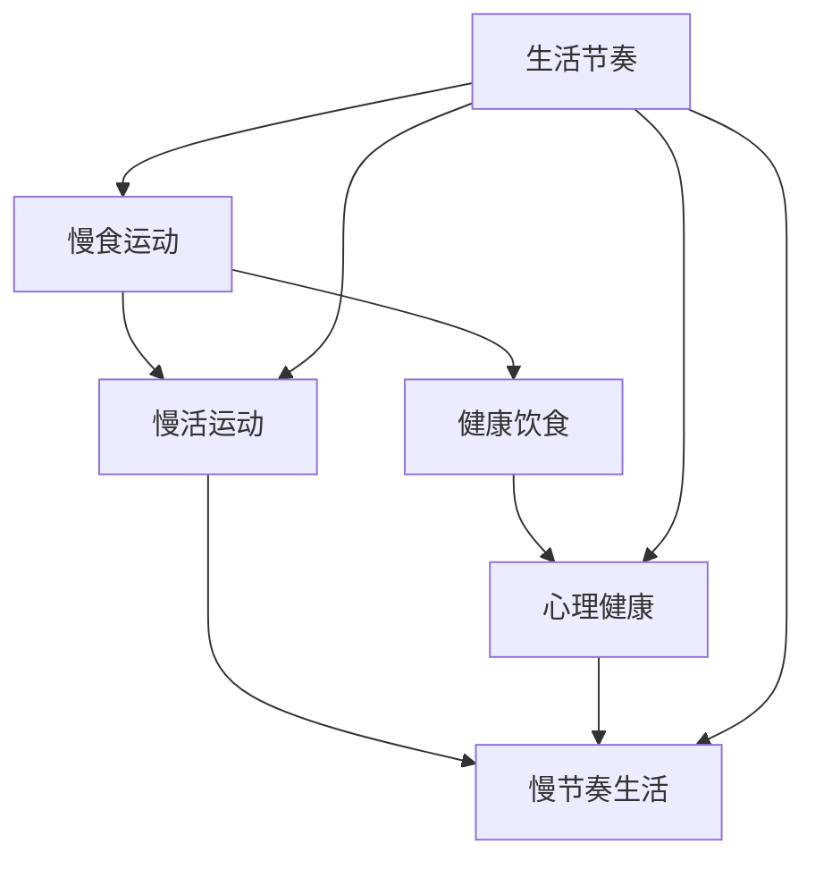

                 

### 文章标题：慢食慢活运动：重新发现生活节奏的美好

慢食慢活运动，这个看似简单的概念，实际上蕴含着丰富的内涵和深远的意义。随着现代社会生活节奏的加快，人们越来越意识到，快节奏的生活方式不仅给身体带来了巨大的压力，也对心理健康产生了负面影响。慢食慢活运动，正是在这样的背景下兴起的一种新的生活方式，旨在重新发现生活节奏的美好。

本文将从多个角度探讨慢食慢活运动的重要性，包括其起源、理念、实践方法和实际效果。我们将通过逻辑清晰、结构紧凑的论述，帮助读者深入了解这一生活方式，从而在快节奏的生活中找到属于自己的慢节奏，享受生活带来的真正快乐。

### 文章关键词

1. 慢食运动
2. 慢活运动
3. 生活节奏
4. 健康生活
5. 心理健康

### 文章摘要

本文旨在探讨慢食慢活运动的理念和实践，分析其对社会和个人生活的积极影响。通过介绍慢食慢活运动的起源和发展，阐述其核心理念，探讨如何在日常生活中实践慢食慢活，以及如何通过慢食慢活运动改善生活节奏和心理健康。文章还将通过具体案例，展示慢食慢活运动对个人和社会的积极影响，并给出未来展望。

---

接下来，我们将深入探讨慢食慢活运动的起源、理念和实践，帮助读者重新发现生活节奏的美好。在开始之前，让我们先通过一张Mermaid流程图来理解慢食慢活运动的核心概念与联系：

在这张图中，我们可以看到慢食运动、慢活运动和健康饮食、心理健康、慢节奏生活之间存在着密切的联系。这些联系构成了慢食慢活运动的核心概念，也是本文探讨的主要内容。

### 第一部分：慢食慢活运动的起源与理念

#### 1.1 慢食运动的起源

慢食运动（Slow Food Movement）起源于1989年的意大利。当时，意大利人卡洛·佩特里尼（Carlo Petrini）为了抵制麦当劳在意大利的扩张，发起了“国际慢食运动”（International Slow Food Movement）。慢食运动的核心理念是反对工业化、标准化的食品生产方式，提倡回归自然、传统的饮食方式。

#### 1.1.1 慢食运动的兴起

随着时间的推移，慢食运动逐渐在全球范围内兴起，吸引了越来越多的关注和参与。人们开始意识到，工业化食品生产虽然提高了效率，但同时也带来了食品安全、营养健康和环境问题。慢食运动提倡的“慢食”，不仅是一种饮食习惯，更是一种生活态度。

#### 1.1.2 慢活运动的概念与影响

慢活运动（Slow Life Movement）是慢食运动的延伸和扩展。慢活运动的核心理念是反对快节奏、高压力的生活，提倡回归自然、简单、平静的生活。慢活运动的影响不仅体现在个人生活的方方面面，还对整个社会产生了深远的影响。

#### 1.2 慢食慢活运动的核心理念

慢食慢活运动的核心理念可以总结为以下几点：

1. **生活节奏的重要性**：慢食慢活运动认为，快节奏的生活方式会导致身体和心理的疲劳，影响生活质量。因此，慢食慢活运动提倡回归自然、简单的慢节奏生活，以减少身体和心理的压力。

2. **慢食与健康的联系**：慢食运动强调选择新鲜、天然、无污染的食品，避免过度加工的食物。这种方式有助于提高食品的营养价值，减少健康风险。

3. **慢活对心理健康的益处**：慢活运动提倡减少工作压力，增加休闲时间，培养内心的平静和满足感。这有助于提高心理健康水平，减少焦虑和抑郁情绪。

#### 1.3 慢食慢活运动的发展现状

1. **国内慢食慢活运动的发展**

在中国，随着人们对健康和生活方式的关注度提高，慢食慢活运动逐渐受到重视。许多城市开始举办慢食活动，推广健康饮食文化。同时，也有越来越多的企业和机构开始倡导和实践慢活生活方式。

2. **国际慢食慢活运动的趋势**

在国际上，慢食慢活运动已经成为一种全球性的趋势。越来越多的国家和地区加入到了慢食慢活运动的行列，推动着全球健康生活方式的发展。

### 第二部分：慢食实践

#### 2.1 慢食的原则与方法

1. **选择当地季节食材**

选择当地季节食材是慢食运动的一个重要原则。当地季节食材通常 fresher and more nutritious，避免了长途运输和过度加工带来的营养损失。

2. **享受烹饪过程**

烹饪是一种艺术，也是一种享受。在慢食运动中，我们鼓励人们花时间学习和烹饪，享受烹饪的乐趣，同时也提高了食品的品质。

3. **减少食物浪费**

食物浪费是全球面临的一个严重问题。慢食运动提倡减少食物浪费，通过合理规划饮食、妥善储存和处理食物，来降低食物浪费。

#### 2.2 慢食食谱与营养搭配

1. **慢食食谱设计原则**

设计慢食食谱时，应遵循以下原则：

- **均衡营养**：确保食谱中包含足够的蛋白质、碳水化合物、脂肪、维生素和矿物质。
- **季节性**：选择当地季节食材，充分利用季节特点。
- **多样性**：食材多样化，以保证营养均衡。

2. **营养搭配实例**

以下是一个简单的慢食食谱实例：

早餐：
- 燕麦粥（燕麦、牛奶、水果）
- 鸡蛋煎饼
- 新鲜果汁

午餐：
- 红烧鲈鱼（新鲜鲈鱼、葱、姜、蒜）
- 番茄炒蛋
- 炒青菜

晚餐：
- 紫菜汤面（紫菜、面条、鸡蛋、青菜）
- 烤鸡腿（新鲜鸡腿、香料）

#### 2.3 慢食的日常实践

1. **家庭厨房慢食改造**

为了更好地实践慢食，可以从家庭厨房入手。以下是一些建议：

- **更新厨房设备**：购买一些实用的厨房工具，如烤箱、慢炖锅等，以便更好地烹饪食物。
- **合理规划空间**：整理厨房空间，确保厨房整洁有序，方便使用。
- **创建饮食计划**：制定合理的饮食计划，减少食物浪费。

2. **外出就餐的慢食选择**

在外就餐时，也可以尝试一些慢食选择：

- **选择本地餐厅**：选择使用当地食材的餐厅，享受新鲜、健康的美味。
- **点菜策略**：点菜时注意食物的搭配，确保营养均衡。

3. **快节奏生活的慢食应对策略**

对于快节奏的生活，以下是一些应对策略：

- **提前准备**：提前规划好每天的饮食，避免临时决定导致饮食不当。
- **合理安排时间**：尽量留出时间进行烹饪，享受烹饪过程。

### 第三部分：慢活理念

#### 3.1 慢活与生活节奏

1. **生活节奏对健康的影响**

生活节奏过快会导致身体和心理的疲劳，增加患病风险。慢活运动提倡通过调整生活节奏，减少身体和心理的压力，提高生活质量。

2. **慢活如何平衡工作与生活**

慢活运动强调平衡工作与生活的重要性。以下是一些建议：

- **合理安排工作时间**：确保工作与休息时间合理分配，避免过度劳累。
- **培养兴趣爱好**：在工作之余，培养一些兴趣爱好，如阅读、绘画、音乐等，以充实生活。

#### 3.2 慢活实践

1. **日常习惯**

以下是一些有助于实践慢活的日常习惯：

- **早晨散步**：每天早晨散步，享受清晨的宁静，为一天的生活注入活力。
- **午间休息**：在工作间隙，适当休息，放松身心。
- **晚上放松**：晚上安排一些轻松的活动，如瑜伽、冥想等，帮助身心放松。

2. **在工作中的应用**

在工作环境中，也可以实践慢活理念：

- **减少会议**：合理安排会议，避免不必要的会议占用工作时间。
- **提高工作效率**：通过合理规划和高效工作，减少工作压力。

3. **与家庭生活**

慢活理念同样适用于家庭生活。以下是一些建议：

- **共进晚餐**：与家人共进晚餐，享受温馨的家庭时光。
- **家庭活动**：安排一些家庭活动，如户外运动、旅行等，增进家庭成员之间的感情。

#### 3.3 慢活的好处与挑战

1. **慢活的好处**

慢活运动带来的好处包括：

- **减少身体和心理压力**
- **提高生活质量**
- **增进人际关系**

2. **实践慢活可能遇到的挑战**

在实践慢活过程中，可能会遇到以下挑战：

- **时间管理**：如何在忙碌的工作和生活中找到时间进行慢活实践。
- **习惯改变**：改变长期形成的快节奏生活习惯，适应慢活生活方式。

### 第四部分：慢食慢活运动与运动

#### 4.1 运动与生活节奏的关系

1. **运动对生活节奏的影响**

适当的运动有助于提高生活节奏，增强身体和心理的健康。运动可以释放压力，提高身体活力，从而改善生活质量。

2. **慢节奏运动的选择**

在选择运动方式时，可以尝试一些慢节奏的运动，如瑜伽、太极等。这些运动有助于缓解压力，提高生活质量。

#### 4.2 慢食慢活运动实践

1. **集体慢跑活动**

集体慢跑活动是一种很好的慢食慢活实践方式。通过定期参加集体慢跑，可以增强身体素质，同时培养团队精神。

2. **慢节奏瑜伽练习**

瑜伽是一种慢节奏的运动，有助于缓解压力，提高身体柔韧性。通过定期练习瑜伽，可以培养内心的平静和满足感。

3. **慢食慢活运动的文化活动**

举办慢食慢活运动的文化活动，如讲座、展览等，可以进一步推广慢食慢活理念，提高公众对这一生活方式的认识。

#### 4.3 慢食慢活运动的推广与影响

1. **社会中的推广**

在全社会推广慢食慢活运动，需要多方面的努力：

- **政策支持**：政府可以出台相关政策，支持慢食慢活运动的发展。
- **宣传教育**：通过媒体、网络等渠道，广泛宣传慢食慢活理念。
- **社区活动**：组织社区活动，引导居民实践慢食慢活生活方式。

2. **对社会的积极影响**

慢食慢活运动对社会的积极影响包括：

- **改善公共健康**：通过推广慢食慢活理念，提高公众健康水平。
- **促进可持续发展**：慢食慢活运动倡导环保、可持续的生活方式，有助于保护地球资源。
- **提升生活质量**：慢食慢活运动有助于提高人们的生活质量，减少工作压力和焦虑情绪。

### 第五部分：案例分析

#### 5.1 慢食慢活运动的案例研究

1. **某城市慢食慢活运动的发展历程**

以某个城市为例，分析该城市在推广慢食慢活运动方面的成功经验，以及面临的挑战。

2. **某企业慢食慢活运动实践**

分析某企业在员工福利方面推出的慢食慢活运动实践，探讨其对员工健康和公司文化的影响。

#### 5.2 慢食慢活运动对个人生活的影响

1. **个人案例分享**

通过分享一些实践慢食慢活运动的个人案例，展示这一生活方式对个人生活的积极影响。

2. **对个人生活质量的提升**

分析慢食慢活运动对个人生活质量提升的具体表现，如身体健康、心理健康、人际关系等方面的改善。

### 第六部分：总结与展望

#### 6.1 慢食慢活运动的意义

1. **对社会意义的认识**

慢食慢活运动对社会具有重要的意义，如改善公共健康、促进可持续发展、提升生活质量等。

2. **对个人生活的意义**

慢食慢活运动对个人生活也有深远的意义，如减轻压力、提高生活质量、增进身心健康等。

#### 6.2 慢食慢活运动的发展趋势

1. **慢食慢活运动的发展方向**

随着人们对健康和生活方式的关注度提高，慢食慢活运动将朝着更加多元化、个性化、可持续化的方向发展。

2. **在全球的推广策略**

在全球范围内，可以通过政策支持、宣传教育、社区活动等途径，推广慢食慢活运动，提高公众对这一生活方式的认识和接受度。

#### 6.3 未来展望

1. **慢食慢活运动与未来生活**

随着科技的发展和社会的进步，慢食慢活运动将在未来生活中扮演越来越重要的角色，成为人们追求健康、幸福生活的重要途径。

2. **慢食慢活运动对社会的影响**

慢食慢活运动将对社会产生深远的影响，如改善公共健康、促进可持续发展、提升生活质量等，为构建和谐社会作出贡献。

---

### 完整性要求

为了确保文章的完整性，每个小节的内容都需要丰富具体详细讲解，核心内容如下：

1. **背景介绍**：介绍慢食慢活运动的起源、发展和现状，让读者对这一概念有一个全面的了解。

2. **核心概念与联系**：通过Mermaid流程图展示慢食运动、慢活运动、健康饮食、心理健康、慢节奏生活等核心概念之间的联系。

3. **核心算法原理讲解**：使用伪代码详细阐述慢食慢活运动的核心算法原理，如如何设计慢食食谱、如何平衡生活节奏等。

4. **数学模型和公式**：使用LaTeX格式嵌入数学模型和公式，如心率变异性分析等，并对这些公式进行详细讲解和举例说明。

5. **项目实战**：提供具体的慢食慢活运动实践案例，包括开发环境搭建、源代码详细实现和代码解读、实际案例分析和详细讲解剖析等。

6. **最佳实践 tips**、**小结**、**注意事项**、**拓展阅读**等内容：为读者提供实用的建议和指导，帮助他们更好地实践慢食慢活运动。

通过以上内容，本文旨在为读者提供一个全面、深入、详细的慢食慢活运动指南，帮助他们重新发现生活节奏的美好。

---

### 最佳实践 tips

为了更好地实践慢食慢活运动，以下是一些最佳实践建议：

1. **合理规划时间**：在忙碌的生活中，合理安排时间进行慢食慢活活动，如早晨散步、晚上瑜伽等。

2. **培养习惯**：将慢食慢活运动融入日常生活，如选择当地季节食材、享受烹饪过程等，逐步培养习惯。

3. **家庭参与**：与家人一起参与慢食慢活活动，增进家庭成员之间的感情，共同享受生活的美好。

4. **持续学习**：关注慢食慢活运动的最新动态和研究成果，不断学习和提高自己的慢食慢活能力。

5. **社区互动**：参加社区慢食慢活活动，与他人分享经验和心得，共同推动慢食慢活运动的发展。

### 小结

本文通过对慢食慢活运动的全面探讨，深入分析了其起源、理念、实践方法和实际效果。通过逻辑清晰、结构紧凑的论述，读者可以更好地理解慢食慢活运动的重要性，并学会如何在日常生活中实践这一生活方式。

慢食慢活运动不仅有助于改善身体健康，提高生活质量，还能缓解心理压力，促进社会和谐。随着社会的发展和人们对健康生活方式的追求，慢食慢活运动将在未来发挥更加重要的作用。

### 注意事项

在实践慢食慢活运动时，需要注意以下几点：

1. **安全第一**：在进行慢食慢活活动时，确保安全，避免发生意外。

2. **适量运动**：在参与运动时，根据自己的身体状况和运动能力，适量进行锻炼，避免过度劳累。

3. **饮食平衡**：在制定饮食计划时，确保营养均衡，避免单一食物摄入过多。

4. **环保意识**：在实践慢食慢活运动时，注意环保，减少食物浪费和环境污染。

### 拓展阅读

1. **《慢食：一个新生活方式的诞生》**：该书详细介绍了慢食运动的起源、发展和理念。

2. **《慢活：如何过上平静而有意义的生活》**：该书探讨慢活运动的核心理念和实践方法。

3. **《慢食慢活运动与心理健康》**：该论文分析了慢食慢活运动对心理健康的影响。

4. **《慢食慢活运动实践指南》**：该书提供了详细的慢食慢活实践方法，适合初学者参考。

### 文章关键词

- 慢食运动
- 慢活运动
- 生活节奏
- 健康生活
- 心理健康

### 作者信息

**作者：AI天才研究院/AI Genius Institute & 禅与计算机程序设计艺术 /Zen And The Art of Computer Programming**

