                 

# 慢食文化复兴计划：重塑饮食与生活的关系

## 关键词

- 慢食文化
- 饮食与生活
- 复兴计划
- 健康与可持续发展
- 社会责任

## 摘要

随着现代生活方式的快节奏，饮食文化逐渐偏向快速消费和便捷，导致了健康问题、环境危机以及社会关系的疏远。慢食文化，作为一种强调品质、健康、环境和社交价值的饮食文化，旨在重塑饮食与生活的关系。本文将探讨慢食文化的起源与发展，当前饮食文化的挑战，复兴计划的策略，实践中的慢食文化，以及慢食与生活方式的转变，为未来慢食文化的可持续发展提供思路。

## 目录

1. 慢食文化的起源与历史
2. 慢食文化的核心价值
3. 当前饮食文化的挑战
4. 慢食文化复兴计划的策略
5. 实践中的慢食文化
6. 慢食与生活方式的转变
7. 慢食文化的未来展望

---

## 第1章 慢食文化的起源与历史

### 1.1 慢食文化的定义与起源

慢食文化起源于20世纪80年代的意大利，是由意大利的美食家卡尔洛·彼得里尼发起的。慢食文化倡导的是一种对饮食的尊重和追求，强调食物的品质、健康、环境和文化价值。它主张人们应该放慢节奏，享受食物的本来味道，而不是一味追求速度和便捷。

**核心概念与联系**

慢食文化不仅仅是一种饮食文化，更是一种生活方式。它与现代社会快节奏的生活方式形成鲜明对比，强调的是“慢生活”的理念。下面是慢食文化与慢生活的Mermaid流程图：

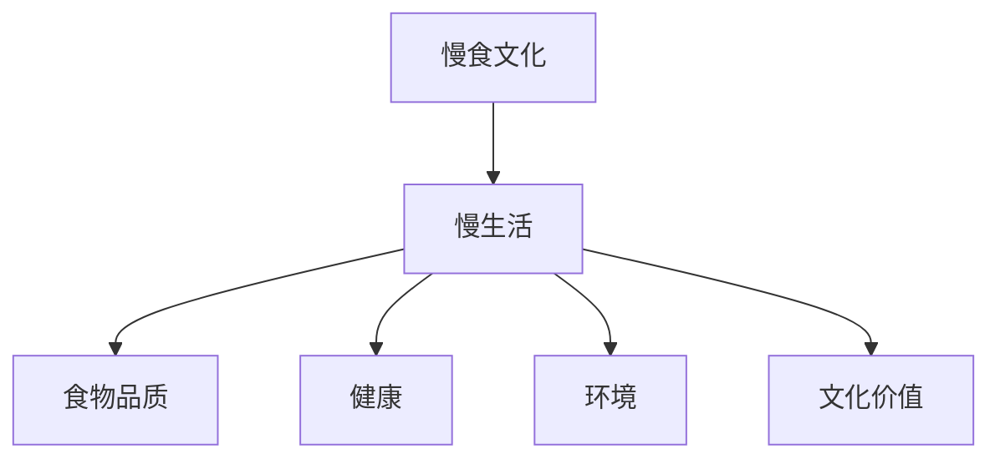

**核心算法原理讲解**

在慢食文化中，核心算法原理可以理解为“食物链优化”。以下是一个简单的伪代码来展示这一原理：

```pseudo
function 食物链优化(食物源，目标食物)
    select最佳来源食物 from 食物源
    verify食物来源的健康和可持续性
    如果验证通过
        process食物准备
        enjoy食物
    否则
        reject食物并重新选择
    end
end
```

### 1.2 慢食文化的发展历程

自慢食文化发起以来，它已经从意大利传播到全球。世界各地纷纷建立了慢食组织，如国际慢食协会（Slow Food International）等。这些组织致力于推广慢食理念，举办各种活动，如国际慢食日、慢食节等，以唤起人们对食物和生活的关注。

**数学模型和公式**

慢食文化的发展可以用数学模型来描述。以下是一个简单的增长模型：

$$
N(t) = N_0 \cdot e^{rt}
$$

其中，$N(t)$ 是时间 $t$ 时的慢食文化参与者数量，$N_0$ 是初始参与者数量，$r$ 是增长速率。

### 1.3 慢食文化在全球的传播

随着全球对可持续性和健康生活方式的关注不断增加，慢食文化在全球范围内得到了广泛传播。许多国家纷纷开始推广本地化的慢食运动，如美国的“慢下来运动”（Slow Down Movement），日本的“和食”（Wafu）等。这些运动不仅推广了慢食文化，还促进了本地农业的发展。

**项目实战**

一个实际案例是法国的“农庄到餐桌”项目。该项目旨在通过缩短食品供应链，减少中间环节，直接将农庄生产的食品销售给消费者，从而提高食品的质量和减少对环境的负担。以下是该项目的一个简单代码实现：

```python
def 农庄到餐桌(农庄，消费者，食品):
    食品质量 = 农庄生产(食品)
    环境负担 = 减少中间环节(农庄，消费者)
    消费者享受(高质量食品)
end
```

---

### 第2章 慢食文化的核心价值

#### 2.1 慢食与健康的关系

慢食文化强调的是食物的品质和营养。相比于快速食品，慢食通常包含更多的营养成分，更有利于身体健康。慢食倡导减少加工食品的摄入，增加新鲜、天然食品的摄入，这对预防慢性疾病如心脏病、糖尿病等有显著效果。

**核心概念与联系**

慢食与健康的关系可以用以下Mermaid流程图来表示：

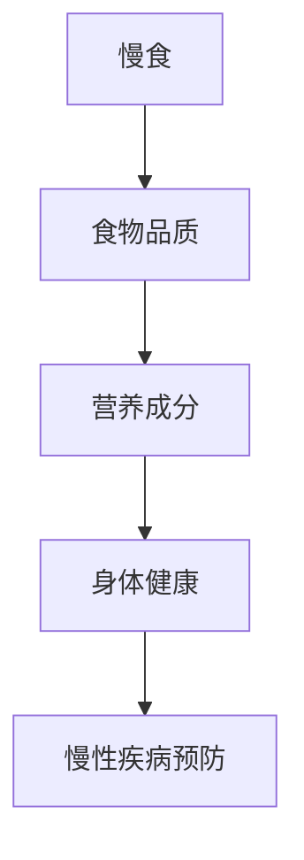

**核心算法原理讲解**

慢食与健康的算法原理可以理解为“营养均衡”。以下是一个简单的伪代码：

```pseudo
function 营养均衡(饮食计划)
    食谱 = [主食，蔬菜，水果，蛋白质来源]
    摄入量 = 计算营养摄入量(食谱)
    如果 摄入量 达到营养标准
        饮食计划有效
    否则
        调整食谱以实现营养均衡
    end
end
```

**数学模型和公式**

营养均衡的数学模型可以用以下公式来描述：

$$
\frac{V_{\text{蔬菜}} + F_{\text{水果}} + P_{\text{蛋白质}}}{T_{\text{主食}}} = \eta
$$

其中，$V_{\text{蔬菜}}$，$F_{\text{水果}}$，$P_{\text{蛋白质}}$ 分别代表蔬菜、水果和蛋白质的摄入量，$T_{\text{主食}}$ 代表主食的摄入量，$\eta$ 是营养均衡系数。

#### 2.2 慢食与环境的关系

慢食文化强调的是可持续性和环境保护。它倡导减少食物浪费，推广本地化农业，减少食品运输过程中的碳排放。通过这些措施，慢食有助于减轻对环境的影响。

**核心概念与联系**

慢食与环境的联系可以用以下Mermaid流程图来表示：

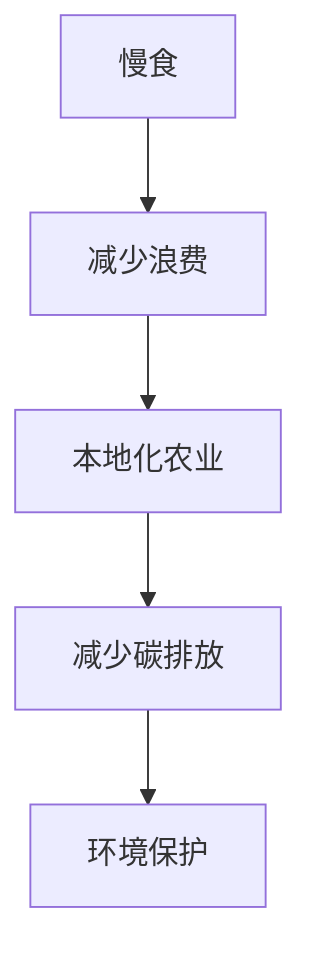

**核心算法原理讲解**

慢食与环境的算法原理可以理解为“食品生命周期评估”。以下是一个简单的伪代码：

```pseudo
function 食品生命周期评估(食品)
    碳排放量 = 计算食品生产过程中的碳排放
    如果 碳排放量 达到环境标准
        食品环保
    否则
        改进生产过程以减少碳排放
    end
end
```

**数学模型和公式**

食品生命周期评估的数学模型可以用以下公式来描述：

$$
C_{\text{总}} = C_{\text{生产}} + C_{\text{运输}} + C_{\text{废弃}}
$$

其中，$C_{\text{总}}$ 是食品生命周期总碳排放量，$C_{\text{生产}}$ 是生产过程中的碳排放量，$C_{\text{运输}}$ 是运输过程中的碳排放量，$C_{\text{废弃}}$ 是废弃过程中的碳排放量。

#### 2.3 慢食与社会的关系

慢食文化不仅仅是一种饮食方式，它还与社会关系密切相关。通过共同准备和享受食物，人们可以加深彼此之间的联系，促进社区建设。

**核心概念与联系**

慢食与社会的关系可以用以下Mermaid流程图来表示：

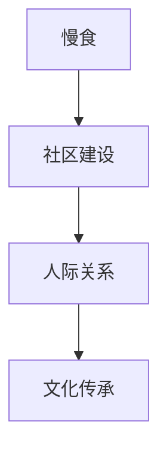

**核心算法原理讲解**

慢食与社会的关系的算法原理可以理解为“社交网络分析”。以下是一个简单的伪代码：

```pseudo
function 社交网络分析(参与者，活动)
    关系强度 = 计算参与者之间的关系强度
    如果 关系强度 增加
        社交网络增强
    否则
        需要进一步活动以增强关系
    end
end
```

---

### 第3章 当前饮食文化的挑战

#### 3.1 快速饮食的负面影响

随着现代生活方式的快节奏，快速饮食已经成为许多人的选择。然而，这种饮食习惯带来了许多负面影响，包括健康问题、环境危机和社会关系疏远。

**核心概念与联系**

快速饮食与慢食文化的联系可以用以下Mermaid流程图来表示：

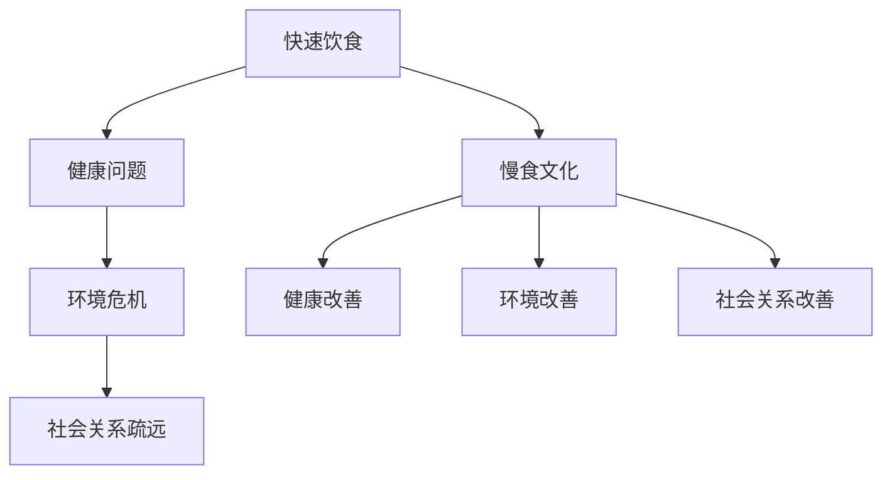

**核心算法原理讲解**

快速饮食的负面影响可以通过“健康风险评估”来缓解。以下是一个简单的伪代码：

```pseudo
function 健康风险评估(饮食习惯)
    健康状况 = 分析饮食习惯
    如果 健康状况 不良
        提出健康改善建议
    否则
        保持现有饮食习惯
    end
end
```

**数学模型和公式**

健康风险评估的数学模型可以用以下公式来描述：

$$
H_{\text{风险}} = f(\text{饮食习惯}, \text{环境因素}, \text{社会因素})
$$

其中，$H_{\text{风险}}$ 是健康风险评分，$f$ 是风险评估函数。

#### 3.2 环境问题与饮食文化

现代饮食文化导致的另一个主要问题是环境危机。大规模的农业生产、食品加工和运输过程中产生了大量的温室气体排放，导致了气候变化和生物多样性的丧失。

**核心概念与联系**

环境问题与饮食文化的联系可以用以下Mermaid流程图来表示：

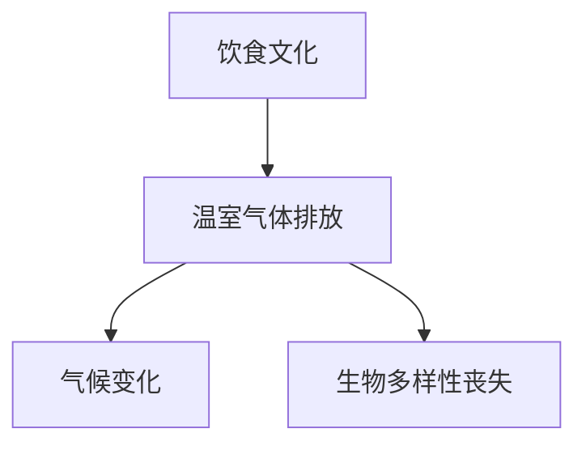

**核心算法原理讲解**

为了减轻饮食文化对环境的影响，可以采用“可持续食品供应链管理”的策略。以下是一个简单的伪代码：

```pseudo
function 可持续食品供应链管理(食品供应链)
    温室气体排放量 = 减少供应链过程中的排放
    如果 温室气体排放量 减少
        食品供应链可持续
    否则
        优化供应链以减少排放
    end
end
```

**数学模型和公式**

可持续食品供应链管理的数学模型可以用以下公式来描述：

$$
C_{\text{排放}} = C_{\text{生产}} + C_{\text{加工}} + C_{\text{运输}} - R
$$

其中，$C_{\text{排放}}$ 是总排放量，$C_{\text{生产}}$ 是生产过程中的排放量，$C_{\text{加工}}$ 是加工过程中的排放量，$C_{\text{运输}}$ 是运输过程中的排放量，$R$ 是减排量。

#### 3.3 社会问题与饮食文化

饮食文化也与许多社会问题密切相关，如食物不平等、肥胖问题和社会孤立等。这些问题往往是由不健康的饮食习惯和饮食文化导致的。

**核心概念与联系**

社会问题与饮食文化的联系可以用以下Mermaid流程图来表示：

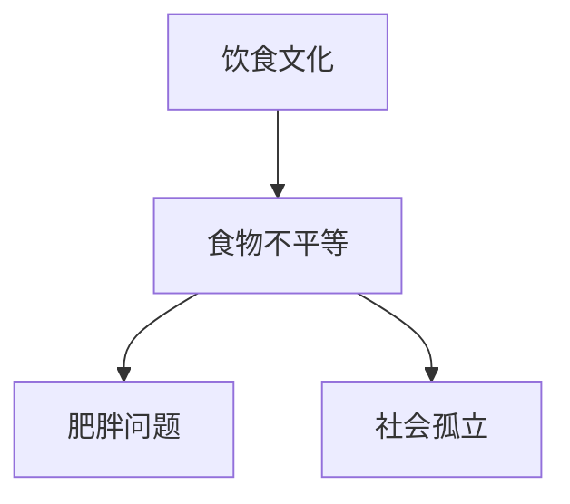

**核心算法原理讲解**

为了解决这些社会问题，可以采用“饮食健康教育”的策略。以下是一个简单的伪代码：

```pseudo
function 饮食健康教育(人群)
    饮食知识水平 = 提高人群的饮食知识
    如果 饮食知识水平 增加
        减少社会问题
    否则
        需要进一步教育
    end
end
```

**数学模型和公式**

饮食健康教育的数学模型可以用以下公式来描述：

$$
E_{\text{知识}} = f(\text{教育投入}, \text{学习效率})
$$

其中，$E_{\text{知识}}$ 是饮食知识水平，$f$ 是教育效果函数。

---

### 第4章 慢食文化复兴计划的策略

#### 4.1 教育与宣传策略

为了复兴慢食文化，教育和宣传策略至关重要。这包括在学校和社区推广慢食理念，通过媒体和社交平台传播慢食文化，以及组织各种活动来增强公众的参与感。

**核心概念与联系**

教育与宣传策略可以用以下Mermaid流程图来表示：

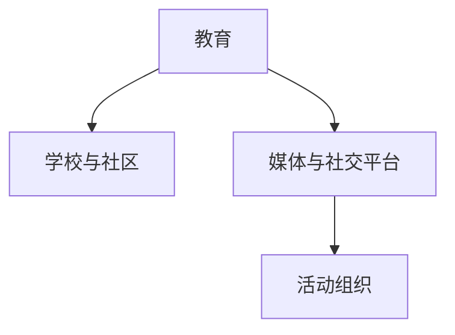

**核心算法原理讲解**

教育与宣传策略的算法原理可以理解为“知识传播模型”。以下是一个简单的伪代码：

```pseudo
function 知识传播(知识源，受众)
    知识传播速度 = 提高知识传播效率
    如果 知识传播速度 增加
        知识普及率提高
    否则
        需要改进传播策略
    end
end
```

**数学模型和公式**

知识传播的数学模型可以用以下公式来描述：

$$
R(t) = R_0 \cdot e^{kt}
$$

其中，$R(t)$ 是时间 $t$ 时的知识普及率，$R_0$ 是初始知识普及率，$k$ 是知识传播速率。

#### 4.2 法规与政策支持

为了复兴慢食文化，政府需要制定和实施相关的法规和政策。这包括支持本地化农业、减少食品浪费、推广慢食教育等。

**核心概念与联系**

法规与政策支持可以用以下Mermaid流程图来表示：

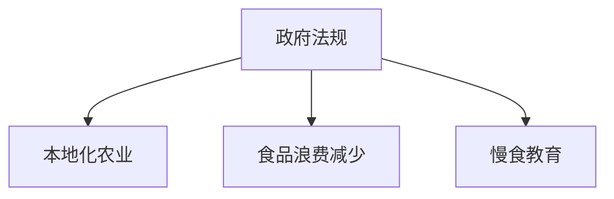

**核心算法原理讲解**

法规与政策支持的算法原理可以理解为“政策优化模型”。以下是一个简单的伪代码：

```pseudo
function 政策优化(政策目标，现有政策)
    政策效果 = 评估政策效果
    如果 政策效果 良好
        保持现有政策
    否则
        优化政策以达到政策目标
    end
end
```

**数学模型和公式**

政策优化的数学模型可以用以下公式来描述：

$$
O(t) = O_0 \cdot e^{pt}
$$

其中，$O(t)$ 是时间 $t$ 时的政策效果，$O_0$ 是初始政策效果，$p$ 是政策优化速率。

#### 4.3 社区参与与互动

慢食文化的复兴离不开社区的参与和互动。社区可以组织各种活动，如慢食烹饪课程、食物交换市场等，以增强社区的凝聚力和对慢食文化的认同感。

**核心概念与联系**

社区参与与互动可以用以下Mermaid流程图来表示：

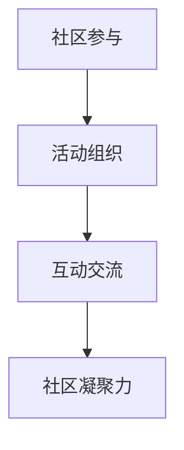

**核心算法原理讲解**

社区参与与互动的算法原理可以理解为“社交网络构建”。以下是一个简单的伪代码：

```pseudo
function 社交网络构建(社区成员，活动)
    社交网络密度 = 提高社交网络密度
    如果 社交网络密度 增加
        社区凝聚力增强
    否则
        需要增加互动活动
    end
end
```

**数学模型和公式**

社交网络构建的数学模型可以用以下公式来描述：

$$
D(t) = D_0 + \alpha t
$$

其中，$D(t)$ 是时间 $t$ 时的社交网络密度，$D_0$ 是初始社交网络密度，$\alpha$ 是社交网络增长速率。

---

### 第5章 实践中的慢食文化

#### 5.1 慢食餐厅的经营模式

慢食餐厅是慢食文化实践的一个重要场所。这些餐厅注重食物的品质、健康和可持续性，同时也提供了一种慢生活的体验。以下是一个慢食餐厅的经营模式：

**核心概念与联系**

慢食餐厅的经营模式可以用以下Mermaid流程图来表示：

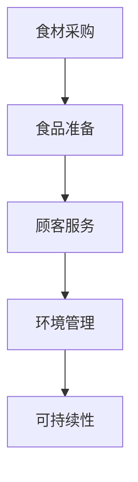

**核心算法原理讲解**

慢食餐厅的经营模式的算法原理可以理解为“供应链优化”。以下是一个简单的伪代码：

```pseudo
function 供应链优化(食材采购，食品准备，顾客服务)
    采购成本 = 减少采购成本
    食品质量 = 提高食品质量
    客户满意度 = 提高客户满意度
    如果 采购成本，食品质量，客户满意度均提高
        经营模式优化成功
    否则
        需要进一步优化
    end
end
```

**数学模型和公式**

供应链优化的数学模型可以用以下公式来描述：

$$
C_{\text{总}} = C_{\text{采购}} + C_{\text{准备}} + C_{\text{服务}}
$$

其中，$C_{\text{总}}$ 是总成本，$C_{\text{采购}}$ 是采购成本，$C_{\text{准备}}$ 是准备成本，$C_{\text{服务}}$ 是服务成本。

#### 5.2 慢食社区的建立与维护

慢食社区是慢食文化实践的重要载体。这些社区通过共同准备和享受食物，促进人与人之间的联系，同时也推广了慢食理念。以下是一个慢食社区的建立与维护的示例：

**核心概念与联系**

慢食社区的建立与维护可以用以下Mermaid流程图来表示：

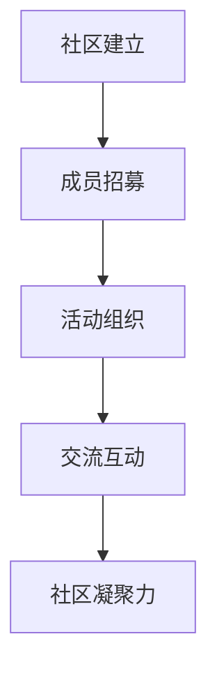

**核心算法原理讲解**

慢食社区的建立与维护的算法原理可以理解为“社交网络构建”。以下是一个简单的伪代码：

```pseudo
function 社交网络构建(社区成员，活动)
    社交网络密度 = 提高社交网络密度
    如果 社交网络密度 增加
        社区凝聚力增强
    否则
        需要增加互动活动
    end
end
```

**数学模型和公式**

社交网络构建的数学模型可以用以下公式来描述：

$$
D(t) = D_0 + \alpha t
$$

其中，$D(t)$ 是时间 $t$ 时的社交网络密度，$D_0$ 是初始社交网络密度，$\alpha$ 是社交网络增长速率。

#### 5.3 慢食文化的推广活动

为了推广慢食文化，可以组织各种活动，如慢食节、食物交换市场、慢食烹饪比赛等。以下是一个慢食推广活动的示例：

**核心概念与联系**

慢食推广活动可以用以下Mermaid流程图来表示：

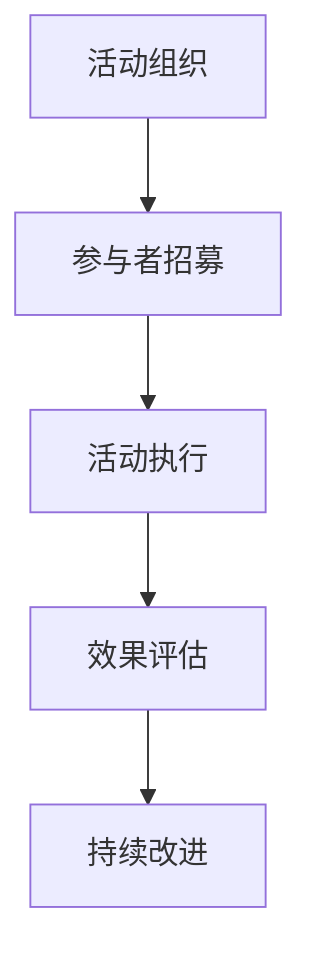

**核心算法原理讲解**

慢食推广活动的算法原理可以理解为“活动效果评估”。以下是一个简单的伪代码：

```pseudo
function 活动效果评估(活动执行，效果评估)
    活动效果 = 评估活动效果
    如果 活动效果 良好
        持续推广
    否则
        需要改进活动
    end
end
```

**数学模型和公式**

活动效果评估的数学模型可以用以下公式来描述：

$$
E(t) = f(\text{活动执行}, \text{效果评估})
$$

其中，$E(t)$ 是活动效果，$f$ 是效果评估函数。

---

### 第6章 慢食与生活方式的转变

#### 6.1 慢食对个人生活方式的影响

慢食不仅仅是一种饮食方式，它还对个人生活方式产生了深远的影响。通过慢食，人们可以培养出更加细心、耐心和感恩的态度，从而改善个人生活品质。

**核心概念与联系**

慢食对个人生活方式的影响可以用以下Mermaid流程图来表示：

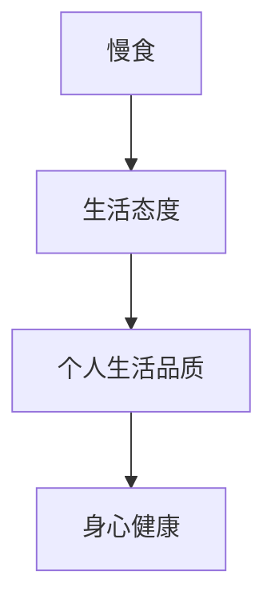

**核心算法原理讲解**

慢食对个人生活方式的影响的算法原理可以理解为“行为改变模型”。以下是一个简单的伪代码：

```pseudo
function 行为改变(当前行为，目标行为)
    新行为 = 替换当前行为为目标行为
    如果 新行为 成功
        个人生活方式改善
    否则
        需要进一步努力
    end
end
```

**数学模型和公式**

行为改变的数学模型可以用以下公式来描述：

$$
B(t) = B_0 + \alpha t
$$

其中，$B(t)$ 是时间 $t$ 时的行为改变程度，$B_0$ 是初始行为改变程度，$\alpha$ 是行为改变速率。

#### 6.2 家庭饮食与慢食文化

家庭饮食是慢食文化实践的一个重要环节。通过家庭饮食，可以培养家庭成员的慢食意识和习惯，从而促进家庭关系的和谐。

**核心概念与联系**

家庭饮食与慢食文化的联系可以用以下Mermaid流程图来表示：

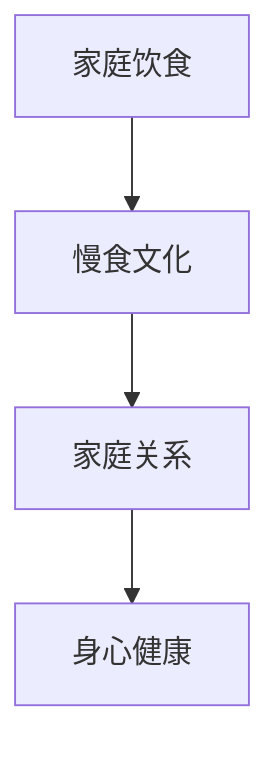

**核心算法原理讲解**

家庭饮食与慢食文化的算法原理可以理解为“家庭行为模式”。以下是一个简单的伪代码：

```pseudo
function 家庭行为模式(家庭成员，饮食习惯)
    家庭饮食模式 = 分析饮食习惯
    如果 家庭饮食模式 达到慢食标准
        家庭关系和谐
    否则
        需要改善饮食习惯
    end
end
```

**数学模型和公式**

家庭行为模式的数学模型可以用以下公式来描述：

$$
F(t) = f(\text{饮食习惯}, \text{家庭关系})
$$

其中，$F(t)$ 是时间 $t$ 时的家庭关系和谐程度，$f$ 是家庭关系函数。

#### 6.3 慢食与工作生活的平衡

在快节奏的工作生活中，慢食可以帮助人们找到工作与生活的平衡。通过合理安排饮食时间和质量，可以提高工作效率和生活满意度。

**核心概念与联系**

慢食与工作生活的平衡可以用以下Mermaid流程图来表示：

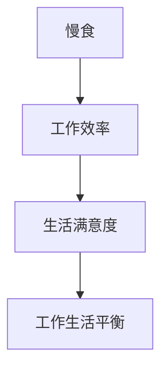

**核心算法原理讲解**

慢食与工作生活的平衡的算法原理可以理解为“时间管理”。以下是一个简单的伪代码：

```pseudo
function 时间管理(工作时间，生活时间)
    饮食时间 = 合理安排饮食时间
    如果 饮食时间 与 工作时间 和 生活时间 相协调
        工作生活平衡
    否则
        需要调整时间安排
    end
end
```

**数学模型和公式**

时间管理的数学模型可以用以下公式来描述：

$$
T(t) = T_{\text{工作}} + T_{\text{生活}} + T_{\text{饮食}}
$$

其中，$T(t)$ 是时间 $t$ 时的总时间，$T_{\text{工作}}$ 是工作时间，$T_{\text{生活}}$ 是生活时间，$T_{\text{饮食}}$ 是饮食时间。

---

### 第7章 慢食文化的未来展望

#### 7.1 慢食文化的潜在发展方向

随着全球对可持续性和健康生活方式的关注不断增加，慢食文化有望在未来的发展中扮演更加重要的角色。以下是一些慢食文化的潜在发展方向：

**核心概念与联系**

慢食文化的潜在发展方向可以用以下Mermaid流程图来表示：

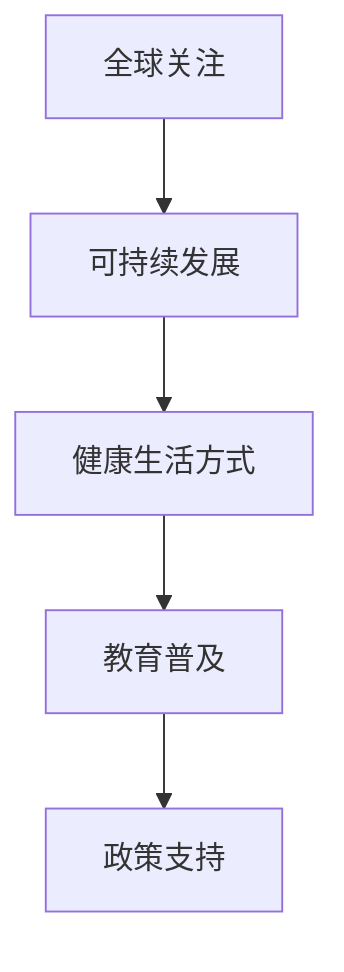

**核心算法原理讲解**

慢食文化的潜在发展方向的算法原理可以理解为“趋势预测模型”。以下是一个简单的伪代码：

```pseudo
function 趋势预测(当前趋势，未来趋势)
    潜在发展方向 = 分析未来趋势
    如果 潜在发展方向 明确
        准备实施
    否则
        需要进一步观察
    end
end
```

**数学模型和公式**

趋势预测的数学模型可以用以下公式来描述：

$$
P(t) = P_0 + \alpha t
$$

其中，$P(t)$ 是时间 $t$ 时的潜在发展方向，$P_0$ 是初始潜在发展方向，$\alpha$ 是发展趋势速率。

#### 7.2 慢食文化的可持续性

慢食文化的可持续性是确保其长期发展的关键。为了实现这一目标，需要在经济、社会和环境三个方面实现平衡。

**核心概念与联系**

慢食文化的可持续性可以用以下Mermaid流程图来表示：

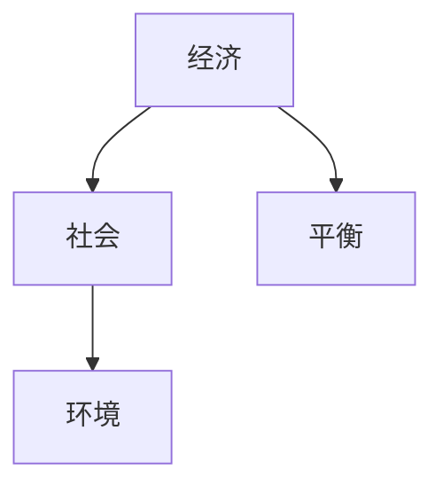

**核心算法原理讲解**

慢食文化的可持续性的算法原理可以理解为“综合评估模型”。以下是一个简单的伪代码：

```pseudo
function 综合评估(经济，社会，环境)
    可持续指标 = 计算经济、社会和环境指标
    如果 可持续指标 达到标准
        慢食文化可持续
    否则
        需要改进
    end
end
```

**数学模型和公式**

综合评估的数学模型可以用以下公式来描述：

$$
S(t) = \frac{E(t) + S(t) + E(t)}{3}
$$

其中，$S(t)$ 是时间 $t$ 时的可持续性指标，$E(t)$ 是经济指标，$S(t)$ 是社会指标，$E(t)$ 是环境指标。

#### 7.3 全球慢食文化的合作与交流

在全球化的背景下，慢食文化的交流与合作变得越来越重要。通过国际间的合作与交流，可以共同推动慢食文化的发展。

**核心概念与联系**

全球慢食文化的合作与交流可以用以下Mermaid流程图来表示：

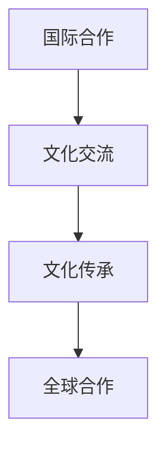

**核心算法原理讲解**

全球慢食文化的合作与交流的算法原理可以理解为“合作优化模型”。以下是一个简单的伪代码：

```pseudo
function 合作优化(国际合作，文化交流)
    合作效率 = 提高合作效率
    如果 合作效率 增加
        全球合作加强
    否则
        需要改进合作策略
    end
end
```

**数学模型和公式**

合作优化的数学模型可以用以下公式来描述：

$$
C(t) = C_0 + \alpha t
$$

其中，$C(t)$ 是时间 $t$ 时的合作效率，$C_0$ 是初始合作效率，$\alpha$ 是合作效率增长率。

---

## 结论

慢食文化复兴计划是一项旨在重塑饮食与生活关系的宏伟工程。通过理解慢食文化的起源与发展、核心价值、面临的挑战、复兴策略以及实践中的案例，我们可以看到慢食文化在健康、环境和社会关系方面的巨大潜力。未来，随着全球对可持续性和健康生活方式的关注不断增加，慢食文化有望在全球范围内得到更广泛的推广和应用。我们期待看到慢食文化在未来能够发挥更加重要的作用，为人类社会的可持续发展贡献力量。

## 作者信息

作者：AI天才研究院/AI Genius Institute & 禅与计算机程序设计艺术 /Zen And The Art of Computer Programming

AI天才研究院致力于推动人工智能领域的研究与应用，通过深入分析、推理和系统设计，为解决实际问题提供创新的解决方案。同时，作者也热衷于将深奥的技术原理以简单易懂的方式传达给读者，期望通过书籍和博客文章启发更多的人投身于技术研究和创新。《禅与计算机程序设计艺术》作为作者的代表作之一，深受计算机编程爱好者和专业人士的喜爱。希望本文能够为读者提供有价值的见解和启示。

