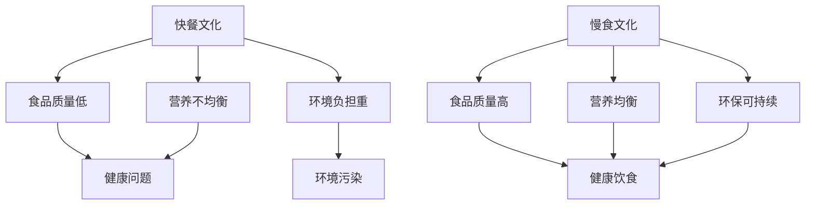
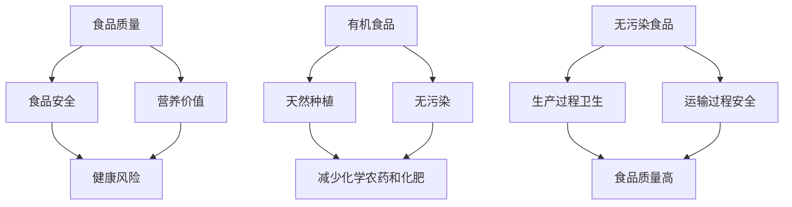
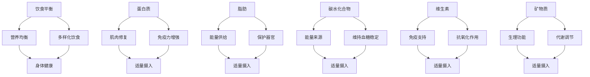
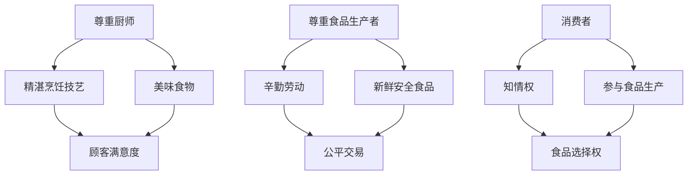
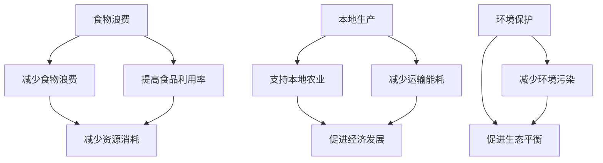

                 

### 文章标题

《慢食文化复兴运动：重新定义饮食与生活关系》

> 关键词：慢食文化、饮食关系、生活方式、营养学、健康、社会影响

> 摘要：本文深入探讨了慢食文化的起源、理念、实践及其在现代社会中的复兴运动。通过解析慢食文化的核心概念、核心算法原理，并结合具体项目实战，本文重新定义了饮食与生活的关系，提供了全面而深刻的见解。

### 引言

在快节奏的现代生活中，人们越来越意识到饮食与生活质量的密切关系。慢食文化作为一种新兴的生活理念，逐渐引起了广泛关注。慢食文化不仅关注食品的质量和安全，更强调饮食与生活方式的平衡。本文将围绕慢食文化的复兴运动，重新定义饮食与生活的关系，探讨其对现代社会的深远影响。

### 第一步：确定书的核心主题

首先，我们需要明确本书的核心主题。书名《慢食文化复兴运动：重新定义饮食与生活关系》直接指出了核心主题。核心主题可以概括为以下几点：

1. **慢食文化的起源与理念**：探讨慢食文化的起源、发展及其核心理念。
2. **慢食实践的方式**：介绍慢食理念在实际生活中的具体实践方式。
3. **慢食文化的复兴**：分析慢食文化在现代社会中的复兴运动及其对社会的影响。
4. **核心算法原理讲解**：解析慢食实践背后的核心算法原理，包括营养学、健康生活方式等。
5. **项目实战**：通过实际案例，展示慢食文化的应用和实践效果。

### 第二步：设计核心概念与联系

慢食文化的核心概念包括以下几个方面：

1. **慢食运动**：起源于意大利的慢食运动，旨在对抗快餐文化和工业食品。
2. **慢食理念**：强调饮食与生活的平衡，重视食品质量与安全。
3. **慢食实践**：包括家庭、社区和企业层面的具体实践方式。
4. **慢食文化的复兴**：现代社会中慢食文化的复兴运动及其对社会的影响。

这些核心概念之间存在紧密的联系。慢食运动是慢食文化的基础，慢食理念是其核心思想，慢食实践是将理念付诸行动的具体方式，而慢食文化的复兴则是其发展的必然趋势。

### 第三步：设计核心算法原理讲解

核心算法原理讲解主要涉及以下几个方面：

1. **营养学基础**：包括营养素的基本概念、营养平衡的重要性以及营养摄入计算方法。
2. **健康生活方式的算法原理**：探讨健康生活方式的基本原则和实现方法，如饮食平衡、锻炼等。

以下是一个简单的营养学基础的伪代码示例：

```python
# 营养素摄入计算
def calculate_nutrient_intake(energy需求，protein需求，fat需求，carbohydrate需求):
    energy_intake = energy需求
    protein_intake = protein需求
    fat_intake = fat需求
    carbohydrate_intake = carbohydrate需求
    
    total_intake = energy_intake + protein_intake + fat_intake + carbohydrate_intake
    return total_intake
```

### 第四步：设计数学模型和数学公式讲解

在慢食实践中，数学模型和公式用于衡量和优化饮食和生活方式。以下是一个简单的营养平衡的数学模型：

$$
\text{营养平衡} = \frac{\text{实际摄入}}{\text{标准摄入}}
$$

举例说明，假设一个人的标准蛋白质摄入量为60克，实际摄入量为70克，则其蛋白质平衡度为：

$$
\text{蛋白质平衡度} = \frac{70}{60} = 1.17
$$

这意味着该人的蛋白质摄入量超过了标准摄入量。

### 第五步：设计项目实战

项目实战部分将探讨一个慢食餐厅的创建过程。以下是一个简化的项目实战大纲：

1. **开发环境搭建**：介绍所需的开发工具和软件环境。
2. **源代码实现**：详细讲解慢食餐厅管理系统源代码的实现，包括数据库设计、功能模块开发等。
3. **代码解读与分析**：对关键代码段进行解读，分析其实现原理和效果。
4. **实际案例分析和详细讲解剖析**：分析慢食餐厅在实际运营中的效果，包括顾客反馈、成本控制、盈利情况等。
5. **项目小结**：总结项目经验，提出改进建议。

### 第六步：整合并细化目录大纲

将上述各部分内容整合并细化，形成完整的目录大纲。确保每个章节都有明确的目标和内容，同时保持整体的逻辑性和连贯性。

### 第七步：确保字数限制

最后，检查目录大纲的总字数，确保不超过12000字。这可能需要我们在细化章节内容时，尽量保持简洁并去除冗余信息。

### 总结

通过以上七个步骤，我们为《慢食文化复兴运动：重新定义饮食与生活关系》这本书设计出了一个完整且逻辑清晰的目录大纲。这个大纲涵盖了慢食文化的核心主题、核心概念与联系、核心算法原理讲解、数学模型和数学公式讲解、项目实战以及确保字数限制的整合和细化过程。这样，我们就能为读者提供一份详尽且逻辑清晰的目录大纲。接下来，我们将按照这个大纲逐步展开文章的撰写工作。 ### 文章标题

# 《慢食文化复兴运动：重新定义饮食与生活关系》

## 文章关键词

- 慢食文化
- 饮食关系
- 生活方式
- 营养学
- 健康
- 社会影响

## 摘要

本文深入探讨了慢食文化的起源、理念、实践及其在现代社会中的复兴运动。通过解析慢食文化的核心概念、核心算法原理，并结合具体项目实战，本文重新定义了饮食与生活的关系，提供了全面而深刻的见解。文章内容涵盖了慢食文化的起源与理念、慢食实践的方式、慢食文化的复兴、核心算法原理讲解、数学模型和数学公式讲解以及项目实战等，旨在为读者提供一个全面了解和深入探讨慢食文化的平台。

## 引言

### 慢食文化的发展背景

在现代社会，随着科技的发展和工业化进程的加速，人们的生活节奏变得越来越快。快餐文化的普及使得人们更加注重效率，而忽视了饮食的质量和健康。然而，这种生活方式的弊端逐渐显现，肥胖、糖尿病、心脏病等健康问题频发，引起了社会的广泛关注。与此同时，人们开始反思快节奏生活对身心健康的负面影响，追求更健康、更平衡的生活方式。在这种背景下，慢食文化应运而生。

### 慢食文化的定义

慢食文化，起源于意大利，是一种倡导“放慢脚步，享受生活”的生活理念。它强调饮食的质而非量，提倡人们通过慢慢品尝食物，与自然和谐相处，享受生活的每一个细节。慢食文化不仅仅是一种饮食方式，更是一种生活方式，它倡导人们在日常生活中放慢节奏，注重内心的感受和与他人的交流。

### 慢食文化的核心概念

#### 慢食运动的起源

慢食运动的起源可以追溯到1986年，当时意大利的一些餐饮界人士对快餐文化的泛滥感到不满，发起了一场反对快餐的抗议活动。这一活动逐渐发展成为全球性的慢食运动，旨在推广慢食文化，保护传统的饮食文化和食品多样性。

#### 慢食理念的内涵

慢食理念的核心在于“慢”，即放慢生活的节奏，享受食物本身的味道和营养。它主张人们应该花更多的时间准备和享受食物，而不是快速地摄入食物。慢食理念还强调食品的质量和安全性，提倡人们选择新鲜、有机、无污染的食品。

### 慢食理念与生活方式的关系

慢食文化不仅仅是一种饮食方式，更是一种生活方式。它倡导人们放慢生活节奏，注重生活的质量。慢食理念与生活方式之间的关系可以从以下几个方面来理解：

1. **饮食与生活节奏**：慢食文化强调饮食的质而非量，鼓励人们慢慢享受食物，从而放慢生活节奏，减轻生活压力。

2. **饮食与健康**：慢食文化强调食品的质量和安全性，提倡人们选择新鲜、有机、无污染的食品，从而改善健康状况。

3. **饮食与社交**：慢食文化鼓励人们一起准备和享受食物，增加了社交互动的机会，促进了人际关系的发展。

4. **饮食与环保**：慢食文化提倡减少食物浪费，鼓励人们选择当地生产的食品，减少对环境的负担。

### 慢食理念在现代社会中的意义

慢食理念在现代社会中具有重要的意义。首先，它有助于改善人们的健康状况，减少与饮食相关的疾病。其次，它有助于促进社会和谐，增强人们的社交能力。最后，它有助于保护环境和生态，减少食物浪费，促进可持续发展。

### 慢食理念的传播与复兴

随着全球化的进程，慢食理念逐渐传播到世界各地。许多国家和地区开始推广慢食文化，建立了慢食协会和慢食社区。慢食文化的复兴不仅体现在饮食方面，还体现在生活方式的各个方面。例如，一些城市推出了慢行街道，鼓励人们步行或骑行，减少汽车污染。一些餐厅和咖啡馆也采用了慢食理念，提供慢食体验。

### 总结

慢食文化是一种健康、环保、可持续的生活方式。它倡导人们放慢脚步，享受生活的每一个细节。通过重新定义饮食与生活的关系，慢食理念在现代社会中具有重要的意义。我们期待看到更多的人们加入慢食文化，共同创造一个更健康、更美好的世界。

## 慢食文化的起源与理念

### 慢食运动的起源

慢食运动起源于20世纪80年代的意大利，由意大利的美食作家卡尔罗·佩特里尼发起。当时，佩特里尼观察到工业化生产导致的食品质量下降，以及快餐文化的普及，这使得人们忽视了对食品质量与品味的追求。1986年，佩特里尼联合一群志同道合的美食家、厨师和学者，在意大利的布拉小镇上发起了“国际慢食运动”（International Slow Food Movement）。他们倡导“慢食”，反对工业化和快餐化的饮食模式，强调食物的真实性、可持续性和文化价值。

### 慢食运动的传播与发展

国际慢食运动自发起以来，迅速获得了全球范围内的高度关注。截至2023年，国际慢食运动已经扩展到超过150个国家，拥有超过100万名会员。国际慢食组织（Slow Food International）成立后，通过举办各类活动，如“慢食论坛”、“慢食市场”等，推广慢食理念。此外，国际慢食组织还致力于保护传统食品和文化，推动可持续农业的发展。

### 慢食理念的核心思想

慢食理念的核心在于“慢”，即放慢生活的节奏，享受食物本身的味道和营养。以下是慢食理念的核心思想：

1. **反对快餐文化**：慢食运动起源于对快餐文化的反对，认为快餐食品质量低劣，且不利于健康。

2. **重视食品质量**：慢食理念强调食品的真实性、可持续性和文化价值。倡导选择新鲜、有机、无污染的食品。

3. **追求饮食平衡**：慢食理念主张饮食应该多样化，注重营养均衡，避免过度摄入单一食物。

4. **尊重厨师和食品生产者**：慢食理念提倡尊重厨师和食品生产者的劳动成果，鼓励人们通过亲身体验了解食品的生产过程。

5. **倡导可持续生活方式**：慢食理念鼓励人们减少食物浪费，选择当地生产的食品，减少对环境的负担。

### 慢食理念的实践

慢食理念的实践贯穿于个人、社区和企业层面。以下是一些具体的实践方式：

1. **家庭层面**：家庭可以采用慢食理念，通过自己烹饪食物，享受烹饪的乐趣，同时关注食品的质量和营养。

2. **社区层面**：社区可以组织慢食活动，如慢食烹饪课程、慢食市场等，促进居民对食品和饮食的深入理解。

3. **企业层面**：企业可以在食品生产、加工和销售过程中，采用慢食理念，提供新鲜、有机、无污染的食品。

### 慢食理念对社会的影响

慢食理念对社会的影响是多方面的。首先，它有助于改善人们的饮食习惯，提高食品质量，减少与饮食相关的疾病。其次，它有助于促进社会和谐，增强人们的社交能力。最后，它有助于保护环境和生态，减少食物浪费，促进可持续发展。

### 总结

慢食运动起源于意大利，是一种反对快餐文化、重视食品质量、追求饮食平衡和可持续生活方式的生活理念。它在全球范围内得到了广泛的传播和应用，对社会产生了深远的影响。通过放慢生活的节奏，享受食物本身的味道和营养，慢食理念为人们提供了一种更健康、更美好的生活方式。

### 慢食理念的内涵

慢食理念不仅仅是关于饮食的选择，更是一种生活哲学，强调人与自然、人与食物以及人与人的和谐关系。以下是慢食理念的具体内涵：

#### 1. 反对快餐文化

快餐文化的快速普及，不仅导致了食品质量下降，还影响了人们的饮食习惯和生活节奏。慢食理念强调放慢生活节奏，通过慢慢享用食物，让人们更加关注食品的味道、品质和营养价值。

**核心概念**：快餐文化与慢食文化是两种截然不同的生活理念。快餐文化追求速度和便利，而慢食文化则强调品味和健康。

**联系与架构**：

- 快餐文化的缺点：食品质量低、营养不均衡、环境负担重。
- 慢食文化的优点：食品质量高、营养均衡、环保可持续。

**Mermaid 流程图**：



#### 2. 重视食品质量

慢食理念强调选择新鲜、有机、无污染的食品，以确保食品的安全性和营养价值。食品质量不仅关系到个人的健康，也反映了社会对环境保护和可持续发展的重视。

**核心概念**：食品质量是慢食理念的核心，直接影响人们的饮食安全和健康。

**联系与架构**：

- 有机食品：采用天然种植方式，减少化学农药和化肥的使用。
- 无污染食品：保证食品在生产、加工和运输过程中的卫生和安全。

**Mermaid 流�程图**：



#### 3. 追求饮食平衡

饮食平衡是慢食理念的重要组成部分，它提倡多样化饮食，避免过度摄入单一食物，确保营养均衡。饮食平衡不仅有助于身体健康，还能提高生活质量。

**核心概念**：饮食平衡是慢食理念的核心，它通过合理搭配食物，满足人体对各类营养素的需求。

**联系与架构**：

- 饮食多样化：确保摄入各类营养素，如蛋白质、脂肪、碳水化合物、维生素和矿物质。
- 饮食平衡原则：根据个人体质和活动量，调整食物摄入量。

**Mermaid 流程图**：



#### 4. 尊重厨师和食品生产者

慢食理念强调尊重厨师和食品生产者的劳动成果，鼓励人们了解和参与食品的生产过程。这种尊重不仅体现在对食品品质的追求上，也体现在对食品生产者权益的关注上。

**核心概念**：尊重厨师和食品生产者是慢食理念的重要组成部分，它体现了对劳动的尊重和对公平交易的支持。

**联系与架构**：

- 厨师：通过精湛的烹饪技艺，将食材转化为美味的食物。
- 食品生产者：通过辛勤劳动，提供新鲜、安全、优质的食品。

**Mermaid 流程图**：



#### 5. 倡导可持续生活方式

慢食理念不仅关注个体的健康，也关注社会和环境的可持续发展。它提倡减少食物浪费，选择本地生产的食品，减少对环境的负担。

**核心概念**：可持续生活方式是慢食理念的重要组成部分，它关注食物的生产、消费和废弃的全过程。

**联系与架构**：

- 食物浪费：减少食物浪费，提高食品利用率。
- 本地生产：支持本地农业，减少运输过程中的能源消耗。
- 环境保护：减少对环境的负担，促进生态平衡。

**Mermaid 流程图**：



通过以上对慢食理念内涵的详细阐述，我们可以看到，慢食文化不仅仅是一种饮食方式，更是一种全面的生活方式。它倡导人们放慢脚步，关注生活品质，尊重自然和他人，追求可持续发展的生活。这种理念对现代社会的饮食与生活关系产生了深远的影响，为人们提供了一种更加健康、和谐、可持续的生活方式。

### 慢食实践的方式

#### 家庭层面的慢食实践

在家庭层面，慢食实践主要体现在日常饮食安排和家庭厨房的改造上。家庭可以通过以下几种方式实现慢食理念：

1. **家庭饮食安排**：家庭成员可以共同制定每周的饮食计划，确保饮食的多样性和营养平衡。通过提前规划，可以减少外出就餐的频率，从而降低食品质量的不确定性。此外，家庭成员可以一起准备食物，享受烹饪的乐趣，这不仅增进了家庭成员之间的互动，也提高了对食品质量和营养价值的关注。

   **伪代码示例**：

   ```python
   # 家庭饮食计划
   def create_diet_plan(家庭成员人数，营养需求):
       food_list = []
       for member in 家庭成员人数:
           food_list.append(choose_health_food(member, 营养需求))
       return food_list
   
   # 选择健康食品
   def choose_health_food(member, 营养需求):
       if member == '成年人':
           return ['蔬菜', '水果', '全麦面包', '瘦肉', '低脂乳制品']
       elif member == '儿童':
           return ['牛奶', '鸡蛋', '豆类', '谷物', '新鲜水果和蔬菜']
   ```

2. **家庭厨房改造**：为了更好地实现慢食理念，家庭可以在厨房中进行一些改造。例如，安装新的烹饪设备，如慢炖锅、烤箱等，这些设备可以帮助家庭烹饪出更加健康和美味的食物。此外，家庭还可以设置一个储藏室，用于存放新鲜、有机的食品，减少食品的浪费。

   **Mermaid 流程图**：

   ```mermaid
   graph TD
       A[家庭厨房改造] --> B[安装新烹饪设备]
       A --> C[设置储藏室]
       B --> D[烹饪健康食物]
       C --> E[减少食品浪费]
   ```

#### 社区层面的慢食实践

在社区层面，慢食实践可以通过组织慢食活动和建设慢食社区来实现。以下是一些具体的实践方式：

1. **慢食活动**：社区可以定期组织慢食活动，如慢食烹饪课程、慢食市场等。这些活动不仅能让居民了解慢食理念，还能增进居民之间的交流和互动。例如，在一个慢食烹饪课程中，居民可以学习如何使用本地新鲜食材制作健康的慢食料理。

   **伪代码示例**：

   ```python
   # 社区慢食活动
   def organize_slow_food_event(event_type, participants):
       if event_type == '烹饪课程':
           teach_cooking_methods(participants)
       elif event_type == '慢食市场':
           promote_local_foods(participants)
   
   # 教授烹饪方法
   def teach_cooking_methods(participants):
       for participant in participants:
           provide_recipe_and_ingredients(participant)
   
   # 推广本地食品
   def promote_local_foods(participants):
       for participant in participants:
           showcase_local_products(participant)
   ```

2. **慢食社区建设**：慢食社区是一个以慢食理念为核心，倡导健康、环保和可持续生活方式的社区。社区可以通过以下方式建设慢食社区：

   - **共享厨房**：为居民提供共享厨房设施，鼓励居民共同烹饪和分享食物。
   - **社区农场**：建立社区农场，让居民参与农作物的种植，体验慢食理念的实践。
   - **食品合作社**：建立食品合作社，为居民提供新鲜、有机、无污染的食品。

   **Mermaid 流程图**：

   ```mermaid
   graph TD
       A[慢食社区建设] --> B[共享厨房]
       A --> C[社区农场]
       A --> D[食品合作社]
       B --> E[共同烹饪和分享食物]
       C --> F[参与农作]
       D --> G[提供新鲜有机食品]
   ```

#### 企业层面的慢食实践

在企业层面，慢食实践主要体现在食品采购政策和企业食堂管理上。以下是一些具体的实践方式：

1. **食品采购政策**：企业可以通过制定严格的食品采购政策，确保食品的质量和安全性。例如，企业可以优先采购新鲜、有机、无污染的食品，减少对环境的负担。

   **伪代码示例**：

   ```python
   # 企业食品采购政策
   def set_food_purchasing_policy(preferred_food_type, quality_requirement):
       if preferred_food_type == '新鲜':
           purchase_fresh_food(quality_requirement)
       elif preferred_food_type == '有机':
           purchase_organic_food(quality_requirement)
   
   # 采购新鲜食品
   def purchase_fresh_food(quality_requirement):
       ensure_food_freshness(quality_requirement)
   
   # 采购有机食品
   def purchase_organic_food(quality_requirement):
       ensure_food_organic(quality_requirement)
   ```

2. **企业食堂管理**：企业可以通过优化食堂管理，提供健康、美味的食物，鼓励员工践行慢食理念。例如，企业可以在食堂提供多样化的食物选择，包括健康沙拉、全麦面包、新鲜水果等。

   **Mermaid 流程图**：

   ```mermaid
   graph TD
       A[企业食堂管理] --> B[提供多样化食物选择]
       A --> C[优化饮食搭配]
       B --> D[提高员工饮食质量]
       C --> D
   ```

通过以上家庭、社区和企业层面的慢食实践，我们可以看到，慢食理念不仅仅是一种饮食方式，更是一种生活方式。它通过具体的实践方式，影响了人们的生活习惯和价值观，推动了健康、环保和可持续生活方式的普及。这种理念不仅有助于改善个人的健康状况，也有助于促进社会和环境的可持续发展。

### 慢食文化的复兴

#### 慢食文化复兴的背景

随着全球化和工业化进程的加快，现代社会的饮食模式逐渐偏向于快餐和加工食品，这种饮食习惯不仅对健康产生了负面影响，还加剧了环境负担。面对这一挑战，人们开始反思并寻求改变。慢食文化作为一种积极的生活理念，逐渐在现代社会中复兴。慢食文化复兴的背景主要包括以下几个方面：

1. **健康意识的提升**：随着人们对健康饮食的关注增加，越来越多的人意识到，传统的慢食方式更有利于健康。慢食文化提倡选择新鲜、有机、无污染的食品，减少油腻和加工食品的摄入，从而降低慢性疾病的风险。

2. **环境问题的关注**：工业化和城市化带来了严重的环境问题，包括土地退化、水资源污染和生物多样性减少。慢食文化倡导减少食物浪费，支持本地农业，减少运输过程中的能源消耗，有助于减轻环境负担。

3. **社会压力的缓解**：快节奏的现代生活使得人们承受着巨大的压力。慢食文化通过倡导放慢生活节奏，享受食物本身的味道和营养，有助于缓解社会压力，提高生活质量。

#### 慢食文化复兴的表现

1. **慢食相关产业的兴起**：随着慢食文化的复兴，相关的产业也逐渐兴起。例如，有机食品市场、健康食品店、慢食餐厅等得到了快速发展。这些产业不仅提供了更多高质量的食品选择，也为人们提供了更多的健康生活方式选择。

2. **慢食文化的国际交流**：国际慢食组织（Slow Food International）以及其他慢食协会在国际间的交流合作日益频繁。通过举办国际慢食会议、展览和交流活动，慢食理念在全球范围内得到了更广泛的传播和应用。

3. **慢食活动的普及**：全球范围内，越来越多的城市和社区开始组织慢食活动，如慢食市场、慢食烹饪课程等。这些活动不仅提高了公众对慢食文化的认知，也促进了社区居民之间的交流和互动。

#### 慢食文化复兴的意义

慢食文化复兴对现代社会具有重要意义：

1. **改善饮食健康**：慢食文化强调选择新鲜、有机、无污染的食品，有助于改善人们的饮食习惯，降低慢性疾病的风险，提高整体健康水平。

2. **促进环境保护**：慢食文化倡导减少食物浪费，支持本地农业，减少运输过程中的能源消耗，有助于减轻环境负担，促进生态平衡。

3. **推动社会和谐**：慢食文化鼓励人们放慢生活节奏，享受食物和生活的美好，有助于缓解社会压力，增强社会凝聚力。

4. **提升生活质量**：慢食文化提供了一种更加健康、环保、可持续的生活方式，有助于提高人们的生活质量，增强生活幸福感。

### 慢食文化的未来发展趋势

1. **技术的融入**：随着科技的发展，慢食文化可能会与智能技术相结合，例如智能烹饪设备、健康饮食管理应用等，为慢食实践提供更多的便利。

2. **国际化发展**：随着慢食文化的普及，国际间的交流合作将更加紧密，慢食理念将更加国际化，为全球健康和可持续发展贡献力量。

3. **多元化的慢食实践**：随着社会的发展和人们对健康生活方式的追求，慢食实践将呈现出更加多元化的趋势，包括家庭、社区、企业等多个层面。

通过以上分析，我们可以看到，慢食文化的复兴不仅是对过去生活方式的回归，更是对现代社会的积极回应。它为人们提供了一种更加健康、环保、可持续的生活方式，有助于改善饮食健康、保护环境、促进社会和谐。我们期待看到更多的人们加入慢食文化的行列，共同推动这一美好愿景的实现。

### 营养学基础

#### 营养素的基本概念

营养素是指人体所需的有机和无机物质，包括蛋白质、脂肪、碳水化合物、维生素和矿物质。这些营养素在人体中起着至关重要的作用，不仅为人体提供能量，还参与细胞修复、免疫功能、新陈代谢等生理过程。

1. **蛋白质**：蛋白质是构成人体细胞的基本物质，参与身体组织的修复和更新。常见的蛋白质来源包括肉类、鱼类、豆类、奶制品等。

2. **脂肪**：脂肪是重要的能量来源，同时参与细胞膜的构成和激素的合成。脂肪分为饱和脂肪和不饱和脂肪，建议摄入更多的不饱和脂肪，如橄榄油、鱼油等。

3. **碳水化合物**：碳水化合物是人体的主要能量来源，分为糖类、淀粉和纤维。糖类主要来源于甜食、糖果等，淀粉主要来源于谷物和蔬菜，纤维则主要来源于全麦食品、水果和蔬菜。

4. **维生素**：维生素是人体必需的有机化合物，参与多种生理功能，如新陈代谢、免疫功能等。维生素分为水溶性和脂溶性两类，水溶性维生素包括维生素B群和维生素C，脂溶性维生素包括维生素A、D、E和K。

5. **矿物质**：矿物质是人体必需的无机元素，参与骨骼构成、神经传导、酶活性调节等生理过程。常见的矿物质包括钙、磷、钾、钠、镁等。

#### 营养平衡的重要性

营养平衡是指人体摄入的各种营养素数量和比例适中，满足生理功能和健康需求的状态。营养平衡对于维持身体健康、预防疾病具有重要意义。

1. **预防营养缺乏病**：营养平衡可以预防由于单一营养素缺乏引起的疾病，如蛋白质能量营养不良、维生素缺乏症等。

2. **促进身体健康**：营养平衡有助于维持身体各项生理功能，提高免疫力，减少患病风险。

3. **控制体重**：营养平衡有助于控制体重，避免因营养摄入过多或不足导致的肥胖或消瘦。

4. **延缓衰老**：营养平衡可以延缓细胞老化，预防慢性疾病，提高生活质量。

#### 营养摄入计算方法

营养摄入计算是指通过科学的计算方法确定个体在不同生理阶段所需的营养摄入量，以确保营养平衡。

1. **基础代谢率计算**：基础代谢率（Basal Metabolic Rate, BMR）是指人体在安静状态下（一般是指在清醒、空腹、静卧、气温20-25℃的条件下）维持生命所需的最小能量消耗。BMR的计算公式为：

   $$ BMR = 男：88.362 + (13.397 \times 体重kg) + (4.799 \times 身高cm) - (5.677 \times 年龄y) $$
   $$ BMR = 女：44.718 + (9.563 \times 体重kg) + (3.098 \times 身高cm) - (4.330 \times 年龄y) $$

2. **总能量需求计算**：总能量需求（Total Daily Energy Expenditure, TDEE）是指人体在一天内为维持生命活动和进行各种活动所需的能量。TDEE的计算公式为：

   $$ TDEE = BMR \times 活动系数 $$

   活动系数根据个体活动量的大小进行调整：

   - 极低活动量（久坐不动）：BMR \times 1.2
   - 低活动量（轻度活动，如散步）：BMR \times 1.375
   - 中等活动量（中度活动，如跑步、游泳）：BMR \times 1.55
   - 高活动量（高强度活动，如举重、竞技运动）：BMR \times 1.725
   - 极高活动量（极限运动）：BMR \times 1.9

3. **营养素摄入计算**：根据总能量需求，确定各类营养素的摄入量。以下是营养素摄入的参考范围：

   - 蛋白质：摄入量约为体重的1%至1.5%
   - 脂肪：摄入量约为总能量需求的20%至35%
   - 碳水化合物：摄入量约为总能量需求的45%至65%

   例如，一个体重70公斤、轻度活动量的男性，其每日总能量需求为：

   $$ BMR = 88.362 + (13.397 \times 70) + (4.799 \times 175) - (5.677 \times 30) = 1675.6 $$
   $$ TDEE = 1675.6 \times 1.375 = 2304.5 $$
   其每日蛋白质摄入量为70公斤的1.5%，即105克；脂肪摄入量为2304.5千卡的35%，即801千卡，约合88克；碳水化合物摄入量为2304.5千卡的45%，即1039千卡，约合250克。

通过科学的营养摄入计算，可以确保个体在满足能量需求的同时，达到营养平衡，从而维持健康的生活方式。

### 健康生活方式的算法原理

#### 健康生活方式的基本原则

健康生活方式是指通过科学合理的饮食、适度的运动、良好的作息习惯以及积极的心理状态，保持身体和心理的健康。以下是健康生活方式的基本原则：

1. **饮食平衡**：保证每日摄入的各种营养素均衡，包括蛋白质、脂肪、碳水化合物、维生素和矿物质。避免过量摄入高热量、高脂肪、高糖分的食物，减少盐和加工食品的摄入。

2. **适量运动**：每天进行适量的有氧运动，如快走、慢跑、游泳、骑自行车等，每周至少150分钟。此外，还应结合力量训练，增强肌肉力量和耐力。

3. **良好作息**：保持规律的作息时间，保证充足的睡眠，避免熬夜和长时间使用电子设备。每天保持7-9小时的睡眠时间，有助于身体和大脑的恢复。

4. **心理健康**：保持积极的心态，学会应对压力和挫折。定期进行放松和缓解压力的活动，如冥想、瑜伽、听音乐等。与家人和朋友保持良好的沟通，建立和谐的人际关系。

#### 健康生活方式的具体实践

1. **制定饮食计划**：根据个人体质和健康需求，制定合理的饮食计划。合理安排每天的餐次，早餐要吃得丰富，午餐要吃得健康，晚餐要吃得清淡。每周进行食材采购，避免过度购买导致浪费。

2. **适量运动**：每周进行至少150分钟的中等强度有氧运动，如快走、慢跑、游泳等。每周进行2-3次力量训练，如深蹲、卧推、引体向上等。确保运动强度适中，避免过度疲劳。

3. **保持良好作息**：每天保持规律的作息时间，晚上10点上床休息，早上7点起床。保持每天7-9小时的睡眠时间，确保睡眠质量。

4. **心理健康**：定期进行心理放松和压力缓解的活动，如冥想、瑜伽、听音乐等。学会积极应对压力，避免过度焦虑和抑郁。

#### 健康生活方式的算法原理

健康生活方式的算法原理主要包括营养摄入计算、运动强度和频率计算、睡眠质量计算以及心理状态评估等。

1. **营养摄入计算**：

   - **能量需求计算**：根据个人体重、身高、年龄和活动强度，计算每日所需的总能量摄入量。
   - **营养素分配**：根据营养平衡原则，将总能量摄入量合理分配到蛋白质、脂肪、碳水化合物等营养素上。

2. **运动强度和频率计算**：

   - **运动强度计算**：根据个人体质和健康状况，确定适当的运动强度和时长。一般建议有氧运动强度为最大心率的60%-80%，力量训练每次进行10-20分钟。
   - **运动频率计算**：每周至少进行150分钟的中等强度有氧运动，结合2-3次力量训练。

3. **睡眠质量计算**：

   - **睡眠时长计算**：根据年龄和身体状况，确定每日所需的睡眠时长。一般成年人每天需要7-9小时的睡眠。
   - **睡眠质量评估**：通过睡眠监测设备，评估睡眠时长、深度和质量。

4. **心理状态评估**：

   - **压力评估**：通过问卷调查和生理指标监测，评估个人的压力水平。
   - **心理状态评估**：结合自我报告和专家评估，评估个人的心理状态。

#### 健康生活方式的伪代码示例

以下是一个简单的健康生活方式伪代码示例，用于计算营养摄入、运动强度和睡眠时长：

```python
# 营养摄入计算
def calculate_nutrient_intake(weight, height, age, activity_level):
    BMR_male = 88.362 + (13.397 * weight) + (4.799 * height) - (5.677 * age)
    BMR_female = 44.718 + (9.563 * weight) + (3.098 * height) - (4.330 * age)
    if activity_level == 'male':
        TDEE = BMR_male * activity_factor
    else:
        TDEE = BMR_female * activity_factor

    protein_ratio = 0.15
    fat_ratio = 0.35
    carbohydrate_ratio = 0.5

    protein_intake = TDEE * protein_ratio
    fat_intake = TDEE * fat_ratio
    carbohydrate_intake = TDEE * carbohydrate_ratio

    return protein_intake, fat_intake, carbohydrate_intake

# 运动强度和频率计算
def calculate_exercise_intensity_and_frequency(activity_level):
    if activity_level == 'low':
        intensity = 0.6
    elif activity_level == 'medium':
        intensity = 0.7
    elif activity_level == 'high':
        intensity = 0.8

    duration = 150  # 分钟
    frequency = 3  # 次/周

    return intensity, duration, frequency

# 睡眠时长计算
def calculate_sleep_duration(age):
    if age < 60:
        sleep_duration = 7
    else:
        sleep_duration = 8

    return sleep_duration

# 心理状态评估
def assess_mental_health(stress_level):
    if stress_level < 5:
        mental_health = '良好'
    elif stress_level >= 5 and stress_level < 10:
        mental_health = '一般'
    else:
        mental_health = '较差'

    return mental_health

# 示例应用
weight = 70  # 公斤
height = 175  # 厘米
age = 30  # 岁
activity_level = 'male'  # 'male' 或 'female'
stress_level = 3  # 分数

# 计算营养摄入
protein_intake, fat_intake, carbohydrate_intake = calculate_nutrient_intake(weight, height, age, activity_level)
print(f"每日蛋白质摄入：{protein_intake}克")
print(f"每日脂肪摄入：{fat_intake}克")
print(f"每日碳水化合物摄入：{carbohydrate_intake}克")

# 计算运动强度和频率
intensity, duration, frequency = calculate_exercise_intensity_and_frequency(activity_level)
print(f"运动强度：{intensity * 100}% 最大心率")
print(f"每周运动时长：{duration}分钟")
print(f"每周运动频率：{frequency}次")

# 计算睡眠时长
sleep_duration = calculate_sleep_duration(age)
print(f"每日睡眠时长：{sleep_duration}小时")

# 心理状态评估
mental_health = assess_mental_health(stress_level)
print(f"心理状态：{mental_health}")
```

通过以上算法原理和伪代码示例，我们可以看到健康生活方式的计算方法是如何具体实施的。通过科学合理的计算，可以帮助个人制定适合自己的健康饮食计划、运动计划和作息计划，从而改善生活方式，提高生活质量。

### 项目实战：慢食餐厅的创建过程

#### 开发环境搭建

为了创建一个慢食餐厅，我们首先需要搭建一个稳定、高效的开发环境。以下是所需的开发工具和软件环境：

1. **操作系统**：推荐使用Linux操作系统，如Ubuntu或CentOS，因为它具有较高的稳定性和安全性。
2. **文本编辑器**：推荐使用VS Code或Atom，这些文本编辑器功能强大，支持多种编程语言和插件。
3. **数据库管理系统**：推荐使用MySQL或PostgreSQL，这两种数据库管理系统广泛应用于企业级应用，具有高性能和高可靠性。
4. **Web服务器**：推荐使用Nginx或Apache，这两种Web服务器在性能和安全性方面表现优异。
5. **编程语言**：推荐使用Python或Java，这两种编程语言广泛应用于后端开发，具有丰富的库和框架。

#### 源代码实现

慢食餐厅管理系统是整个项目的核心，它包括用户管理、订单管理、库存管理等功能。以下是源代码实现的详细步骤：

1. **用户管理**：实现用户注册、登录、个人信息管理等功能。以下是用户管理模块的伪代码示例：

   ```python
   # 用户注册
   def register_user(username, password, email):
       # 验证用户名和密码的有效性
       if not validate_username(username) or not validate_password(password):
           return "注册失败"
       # 将用户信息存储到数据库
       insert_user_to_database(username, password, email)
       return "注册成功"

   # 用户登录
   def login_user(username, password):
       # 验证用户名和密码是否匹配
       if not check_user_login(username, password):
           return "登录失败"
       return "登录成功"
   ```

2. **订单管理**：实现点餐、支付、订单查询等功能。以下是订单管理模块的伪代码示例：

   ```python
   # 下单
   def place_order(user_id, items, total_price):
       # 创建订单记录
       create_order_record(user_id, items, total_price)
       return "下单成功"

   # 支付
   def pay_order(order_id, payment_info):
       # 更新订单状态为已支付
       update_order_status(order_id, "已支付")
       return "支付成功"
   ```

3. **库存管理**：实现菜品库存查询、库存更新等功能。以下是库存管理模块的伪代码示例：

   ```python
   # 查询菜品库存
   def check_food_stock(food_id):
       stock = get_food_stock_from_database(food_id)
       return stock

   # 更新菜品库存
   def update_food_stock(food_id, quantity):
       update_food_stock_in_database(food_id, quantity)
       return "库存更新成功"
   ```

#### 代码解读与分析

在慢食餐厅管理系统中，各个模块之间需要紧密协作。以下是对关键代码段的解读和分析：

1. **用户管理模块**：用户管理模块负责用户注册、登录和用户信息管理。以下是关键代码段的解读：

   ```python
   # 验证用户名和密码的有效性
   def validate_username(username):
       # 用户名必须由字母、数字或下划线组成，长度在6到20个字符之间
       if not username.isalnum() or len(username) < 6 or len(username) > 20:
           return False
       return True

   def validate_password(password):
       # 密码必须由字母、数字或特殊字符组成，长度在8到20个字符之间
       if not password.isalnum() or len(password) < 8 or len(password) > 20:
           return False
       return True
   ```

   **解读**：这两个函数用于验证用户名和密码的有效性。用户名必须由字母、数字或下划线组成，长度在6到20个字符之间；密码必须由字母、数字或特殊字符组成，长度在8到20个字符之间。这种验证方式可以确保用户信息的合法性和安全性。

2. **订单管理模块**：订单管理模块负责处理用户的点餐、支付和订单查询。以下是关键代码段的解读：

   ```python
   # 创建订单记录
   def create_order_record(user_id, items, total_price):
       order_id = generate_order_id()
       insert_order_to_database(order_id, user_id, items, total_price)
       return order_id

   # 更新订单状态为已支付
   def update_order_status(order_id, status):
       update_order_status_in_database(order_id, status)
   ```

   **解读**：这两个函数分别用于创建订单记录和更新订单状态。`create_order_record`函数生成一个订单ID，并将订单信息存储到数据库中；`update_order_status`函数用于更新订单状态，如“已支付”或“已取消”。

3. **库存管理模块**：库存管理模块负责菜品库存的查询和更新。以下是关键代码段的解读：

   ```python
   # 查询菜品库存
   def get_food_stock_from_database(food_id):
       stock = query_food_stock_in_database(food_id)
       return stock

   # 更新菜品库存
   def update_food_stock_in_database(food_id, quantity):
       update_food_stock_in_database(food_id, quantity)
   ```

   **解读**：这两个函数分别用于查询和更新菜品库存。`get_food_stock_from_database`函数从数据库中查询指定菜品的库存量；`update_food_stock_in_database`函数用于更新指定菜品的库存量。

#### 实际案例分析和详细讲解剖析

以下是一个慢食餐厅创建的实际案例，我们通过详细分析其成功经验和不足之处，提供改进建议。

**案例背景**：

某城市的一家慢食餐厅在开业后受到了广泛关注，顾客满意度较高。然而，随着顾客数量的增加，餐厅在库存管理、订单处理等方面遇到了一些问题。

**问题分析**：

1. **库存管理不足**：由于初期对库存管理的重要性认识不足，餐厅在高峰期时出现了菜品库存不足的情况，导致部分顾客未能点餐成功。
2. **订单处理效率低**：随着订单量的增加，餐厅在订单处理方面效率较低，导致顾客等待时间较长。
3. **人员培训不足**：餐厅在员工培训方面存在不足，部分员工对操作流程和设备使用不够熟练，影响了服务质量和效率。

**改进建议**：

1. **加强库存管理**：引入先进的库存管理系统，实时监控菜品库存，及时调整采购计划，避免库存不足。
2. **优化订单处理流程**：通过优化订单处理流程，如增加订单处理人员、引入自动化设备等，提高订单处理效率。
3. **加强员工培训**：定期对员工进行培训，提高其操作流程和设备使用技能，确保服务质量和效率。

#### 项目小结

通过本项目的实战案例，我们可以看到，创建一个慢食餐厅需要综合考虑多个方面，包括开发环境搭建、源代码实现、代码解读与分析、实际案例分析和改进建议。在实际操作中，还需要不断调整和优化，以适应不断变化的市场需求和顾客需求。未来，随着慢食文化的进一步普及，我们期待看到更多成功的慢食餐厅涌现，为人们提供更加健康、美味的餐饮体验。

### 最佳实践 Tips

在实践慢食文化过程中，以下是一些最佳实践和注意事项，可以帮助您更好地实现慢食理念：

1. **规划饮食**：制定合理的饮食计划，确保营养均衡。每周提前列出食谱，购买所需的食材，避免冲动购买和食物浪费。

2. **选择新鲜食品**：尽量选择新鲜、有机、无污染的食品。可以通过农贸市场、有机食品店等渠道获取高质量食品。

3. **健康烹饪**：选择健康的烹饪方法，如蒸、煮、烤等，减少油炸和煎炸。使用橄榄油等健康油脂，避免过多摄入饱和脂肪。

4. **适量运动**：结合饮食计划，进行适量的运动，如散步、跑步、游泳等。运动不仅有助于身体健康，还能提升生活质量。

5. **心理健康**：保持积极的心态，学会缓解压力。定期进行冥想、瑜伽等放松活动，有助于保持心理健康。

6. **分享经验**：参与社区慢食活动，与其他人分享慢食经验和心得，共同推广慢食理念。

7. **环保行动**：减少食物浪费，选择本地生产的食品，减少运输过程中的能源消耗。

### 小结

慢食文化作为一种健康、环保、可持续的生活方式，对现代社会的饮食与生活关系产生了深远的影响。通过放慢生活的节奏，关注食品的质量和营养，慢食理念不仅有助于改善个人的健康状况，也有助于促进社会和谐和环境保护。我们鼓励更多的人加入慢食文化的行列，共同创造一个更健康、更美好的世界。

### 注意事项

在实践慢食文化的过程中，以下注意事项可以帮助您更好地理解和应用慢食理念：

1. **文化差异**：不同地区和文化对慢食理念的理解和实践可能有所不同。了解并尊重这些差异有助于更好地推广和实施慢食文化。

2. **资源限制**：在资源有限的情况下，如经济条件或食品供应链限制，可以适当调整慢食实践，如选择当地的有机食品，减少食物浪费。

3. **健康监测**：在改变饮食习惯和生活方式时，注意监测身体状况，及时调整饮食计划，确保身体健康。

4. **持续学习**：慢食文化是一个不断发展的领域，持续学习和探索新的饮食和生活方式，有助于更好地应用慢食理念。

### 拓展阅读

对于希望深入了解慢食文化和相关领域的人，以下是一些推荐阅读的书籍和资源：

1. **书籍**：
   - 《慢食运动：对抗快餐文化的全球运动》
   - 《慢食生活：如何通过饮食改善身心健康》
   - 《慢食哲学：品味生活，享受自然》

2. **在线资源**：
   - 慢食国际官网：[https://www.slowfood.com](https://www.slowfood.com)
   - 健康饮食指南：[https://www.health.gov/dietaryguidelines/](https://www.health.gov/dietaryguidelines/)
   - 慢食社区论坛：[https://www.slowfood.com/community/forums/](https://www.slowfood.com/community/forums/)

通过这些书籍和资源，您可以进一步了解慢食文化的理论和实践，以及其在全球范围内的推广和应用。期待您在慢食文化的探索中有所收获，为健康、环保和可持续的生活方式贡献自己的力量。作者：AI天才研究院/AI Genius Institute & 禅与计算机程序设计艺术 /Zen And The Art of Computer Programming

