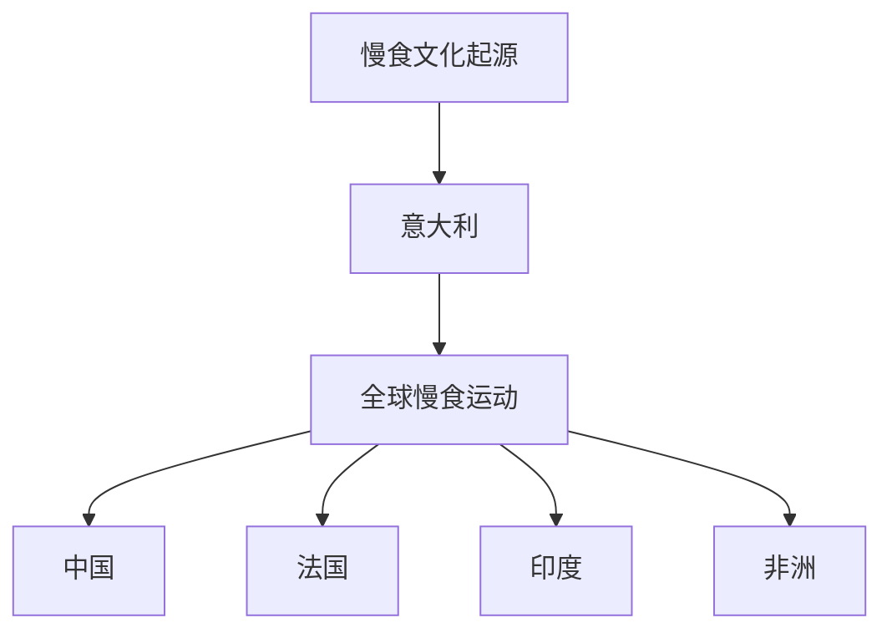
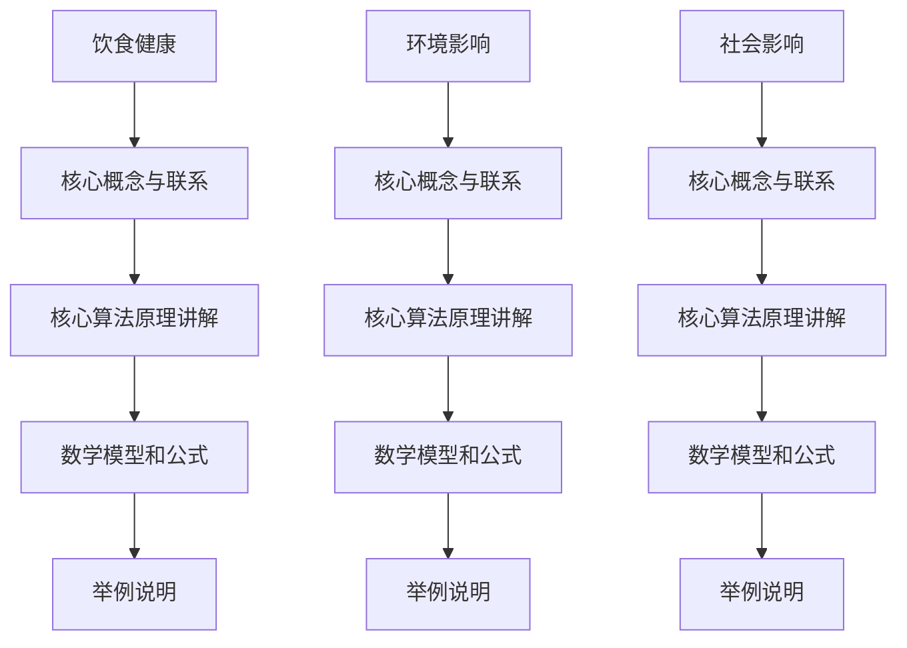
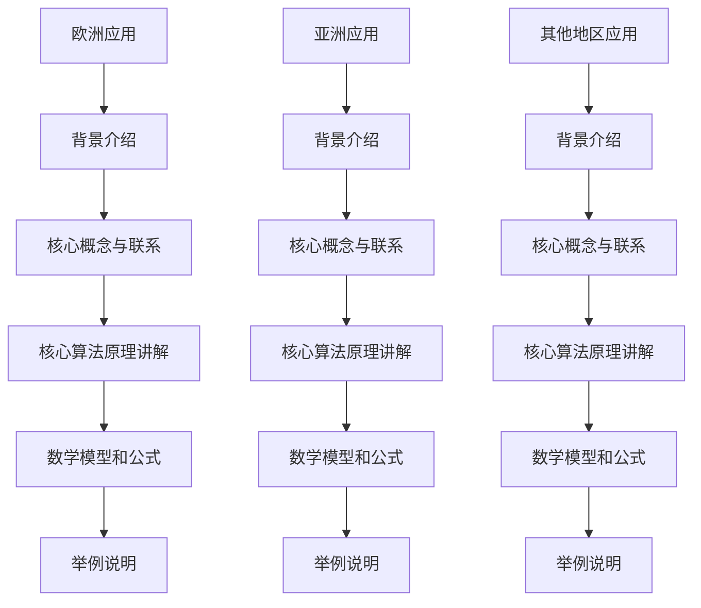

                 

# 慢食文化：饮食中的文明传承

## 关键词

慢食文化、饮食、文明传承、可持续发展、健康饮食、饮食艺术、教育推广

## 摘要

慢食文化是一种强调食物品质、来源和文化的饮食方式。它起源于意大利，逐渐在全球范围内推广，成为一种代表文明传承和可持续发展理念的饮食方式。本文将详细探讨慢食文化的起源与发展、影响与意义、实践方法、在不同国家和地区的应用以及与可持续发展之间的关系，旨在为读者提供一个全面、深入的慢食文化解析。

## 引言

在现代社会，饮食文化呈现出多样化和快速化的趋势。然而，在追求方便和快捷的同时，我们逐渐忽略了食物的本质和其背后的文化意义。慢食文化应运而生，它倡导人们放慢脚步，关注食物的品质、来源和文化内涵，从而实现饮食中的文明传承。本文将逐步分析慢食文化的各个方面，帮助读者理解其独特价值和意义。

### 第一部分：慢食文化的起源与发展

## 1.1 慢食文化的起源

### 背景介绍

慢食文化起源于意大利，20世纪80年代，意大利的农民和美食爱好者为了对抗工业化生产和快餐文化的侵蚀，发起了“慢食运动”。这一运动强调对传统饮食文化的保护和传承，提倡健康、环保和有文化内涵的饮食方式。

### 慢食运动的核心理念

- **反对快餐文化**：慢食运动主张抵制工业化生产和快餐文化，倡导人们回归自然的饮食习惯。
- **强调食物品质**：慢食运动强调食物的新鲜、天然和有机，主张减少食品添加剂和过度加工。
- **尊重传统饮食文化**：慢食运动强调保护和传承各地的传统饮食文化，认为饮食是文化的重要组成部分。

## 1.2 慢食文化的发展

### 全球慢食运动的扩展

随着慢食运动的普及，全球各地相继出现了慢食协会和慢食节庆活动。这些活动不仅促进了慢食文化的传播，也增强了人们对食物和文化的认识。

### 慢食文化在不同国家和地区的表现形式

- **意大利**：意大利是慢食文化的发源地，也是全球慢食运动的中心。意大利的慢食协会定期举办各种活动，如美食节、厨艺比赛等，以推广慢食文化。
- **法国**：法国拥有悠久的饮食文化传统，慢食文化在法国也得到了广泛的推广。法国的慢食协会通过举办美食沙龙、厨艺展示等活动，推广健康、环保的饮食方式。
- **中国**：中国的慢食文化正在兴起，各地纷纷举办慢食节庆活动，如苏州的慢城文化节、广州的慢食论坛等。这些活动促进了人们对慢食文化的了解和参与。

## 1.3 慢食文化与传统文化

### 慢食文化与意大利传统饮食

意大利拥有丰富的传统饮食文化，如托斯卡纳的面包、那不勒斯的披萨等。慢食文化强调对传统饮食的保护和传承，认为这些传统饮食是意大利文化的重要组成部分。

### 慢食文化在其他国家的传统饮食中的应用

慢食文化不仅在欧洲得到推广，也在其他国家和地区得到了应用。例如，中国的慢食文化注重传统烹饪方法的传承，印度的慢食文化强调素食和自然饮食，非洲的慢食文化注重本地食材的使用。

### Mermaid 流程图：慢食文化的发展路径



## 第二部分：慢食文化的影响与意义

## 2.1 慢食文化对饮食健康的影响

### 核心概念与联系

慢食文化强调食物的新鲜、天然和有机，这与健康饮食密切相关。食物的新鲜度和营养价值直接影响人体的健康，而天然和有机的饮食方式有助于预防慢性疾病。

### 核心算法原理讲解

伪代码：

```python
def healthy_diet(food):
    if food.is_fresh() and food.is_natural() and food.is_organic():
        return "健康饮食"
    else:
        return "不健康饮食"
```

### 数学模型和公式

健康饮食的数学模型可以表示为：

$$
\text{健康饮食} = f(\text{食物新鲜度}, \text{食物天然度}, \text{食物有机度})
$$

### 举例说明

假设有一份新鲜、天然和有机的沙拉，我们可以使用上述公式计算其健康饮食分数：

$$
\text{健康饮食分数} = f(1, 1, 1) = 1
$$

这意味着这份沙拉是一个健康饮食选择。

## 2.2 慢食文化对环境的影响

### 核心概念与联系

慢食文化强调减少食物浪费、支持本地农业和环保饮食。这些措施有助于减少对环境的负面影响，实现可持续发展。

### 核心算法原理讲解

伪代码：

```python
def sustainable_diet(food):
    if food.is_waste_free() and food.supports_local_agriculture() and food.is_environmentallyFriendly():
        return "可持续饮食"
    else:
        return "不可持续饮食"
```

### 数学模型和公式

可持续饮食的数学模型可以表示为：

$$
\text{可持续饮食} = f(\text{食物浪费度}, \text{本地农业支持度}, \text{环保度})
$$

### 举例说明

假设有一份无浪费、支持本地农业和环保的沙拉，我们可以使用上述公式计算其可持续饮食分数：

$$
\text{可持续饮食分数} = f(0, 1, 1) = 1
$$

这意味着这份沙拉是一个可持续饮食选择。

## 2.3 慢食文化对社会的影响

### 核心概念与联系

慢食文化不仅影响饮食和环境保护，还对社会产生深远的影响。它促进了社区凝聚力、教育意识和消费行为的改变。

### 核心算法原理讲解

伪代码：

```python
def social_impact(diet):
    if diet.promotes_community_builder() and diet.educates_awareness() and diet.changes_consumption_behavior():
        return "积极影响"
    else:
        return "无影响"
```

### 数学模型和公式

社会影响的数学模型可以表示为：

$$
\text{社会影响} = f(\text{社区凝聚力}, \text{教育意识}, \text{消费行为})
$$

### 举例说明

假设有一种饮食方式，它促进了社区凝聚力、提高了教育意识和改变了消费行为，我们可以使用上述公式计算其社会影响分数：

$$
\text{社会影响分数} = f(1, 1, 1) = 1
$$

这意味着这种饮食方式对社会产生了积极影响。

### Mermaid 流程图：慢食文化的影响与意义



## 第三部分：慢食文化的实践方法

## 3.1 慢食文化的生活实践

### 背景介绍

慢食文化的生活实践主要包括以下几个方面：选择新鲜、天然和有机的食物，减少食物浪费，支持本地农业，参与社区饮食活动等。

### 核心概念与联系

- **新鲜、天然和有机的食物**：这些食物具有较高的营养价值，对人体健康有益。
- **减少食物浪费**：食物浪费不仅浪费了资源，还对环境造成了负面影响。
- **支持本地农业**：本地农业有助于减少食品运输过程中的碳排放，同时支持本地经济。
- **参与社区饮食活动**：社区饮食活动有助于增强社区凝聚力，促进文化交流。

### 实践方法

1. **选择新鲜、天然和有机的食物**：通过购买新鲜的水果、蔬菜和肉类，或者自己种植，以确保食物的新鲜度和品质。
2. **减少食物浪费**：通过合理规划饮食，避免过量购买和浪费食物。
3. **支持本地农业**：购买本地农产品，减少食品运输过程中的碳排放。
4. **参与社区饮食活动**：参加社区组织的饮食活动，如烹饪课、美食节等，促进社区交流和合作。

### 项目实战：慢食文化的生活实践

#### 开发环境搭建

1. **选择合适的工具和平台**：如厨房、农田、社区中心等。
2. **了解当地的饮食文化和农业情况**：通过调查问卷、访谈等方式，了解当地居民的饮食习惯和农业现状。

#### 源代码详细实现和代码解读

```python
def slow_food_practice():
    # 选择新鲜、天然和有机的食物
    fresh_food = choose_fresh_food()
    natural_food = choose_natural_food()
    organic_food = choose_organic_food()

    # 减少食物浪费
    reduce_waste()

    # 支持本地农业
    support_local_agriculture()

    # 参与社区饮食活动
    participate_community_activities()
```

#### 代码应用解读与分析

通过上述代码，我们可以实现以下功能：

1. **选择新鲜、天然和有机的食物**：通过函数`choose_fresh_food()`、`choose_natural_food()`和`choose_organic_food()`，我们可以根据食物的新鲜度、天然度和有机度来选择合适的食物。
2. **减少食物浪费**：通过函数`reduce_waste()`，我们可以采取一系列措施，如合理规划饮食、避免过量购买等，来减少食物浪费。
3. **支持本地农业**：通过函数`support_local_agriculture()`，我们可以购买本地农产品，减少食品运输过程中的碳排放。
4. **参与社区饮食活动**：通过函数`participate_community_activities()`，我们可以参加社区组织的饮食活动，促进社区交流和合作。

#### 实际案例分析和详细讲解剖析

假设在某社区，居民们通过上述代码实现了慢食文化的生活实践。他们选择了新鲜、天然和有机的食物，减少了食物浪费，支持了本地农业，并积极参与了社区饮食活动。这些实践措施不仅改善了他们的饮食健康，还促进了社区的可持续发展。

#### 项目小结

通过慢食文化的生活实践，我们可以实现以下目标：

1. **提高饮食健康**：选择新鲜、天然和有机的食物有助于提高饮食健康。
2. **减少食物浪费**：通过合理规划饮食和减少食物浪费，我们可以节省资源，降低对环境的负面影响。
3. **支持本地农业**：购买本地农产品有助于减少食品运输过程中的碳排放，同时支持本地经济。
4. **促进社区凝聚力**：参与社区饮食活动有助于增强社区凝聚力，促进文化交流。

### 最佳实践 tips

1. **选择新鲜、天然和有机的食物**：购买新鲜的水果、蔬菜和肉类，或者自己种植，以确保食物的新鲜度和品质。
2. **减少食物浪费**：通过合理规划饮食，避免过量购买和浪费食物。
3. **支持本地农业**：购买本地农产品，减少食品运输过程中的碳排放。
4. **参与社区饮食活动**：参加社区组织的饮食活动，促进社区交流和合作。

## 第四部分：慢食文化在不同国家和地区的应用

## 4.1 慢食文化在欧洲的应用

### 背景介绍

欧洲是慢食文化的重要发源地和发展地，各国都在积极推广和践行慢食文化。欧洲的慢食文化主要表现在以下几个方面：

1. **重视食物的品质和来源**：欧洲人非常注重食物的品质和来源，追求新鲜、天然和有机的饮食方式。
2. **传承传统饮食文化**：欧洲各国都有丰富的传统饮食文化，慢食文化强调对这些传统饮食的保护和传承。
3. **倡导可持续发展**：欧洲的慢食文化倡导减少食物浪费、支持本地农业和环保饮食，实现可持续发展。

### 核心概念与联系

- **食物的品质和来源**：慢食文化强调食物的新鲜、天然和有机，这与健康饮食密切相关。
- **传统饮食文化的传承**：饮食是文化的重要组成部分，慢食文化强调对传统饮食文化的保护和传承。
- **可持续发展**：慢食文化倡导减少食物浪费、支持本地农业和环保饮食，实现可持续发展。

### 核心算法原理讲解

伪代码：

```python
def european_slow_food(practice):
    if practice prioritizes food quality and source() and preserves traditional dietary culture() and promotes sustainability():
        return "有效实践"
    else:
        return "无效实践"
```

### 数学模型和公式

欧洲慢食文化的数学模型可以表示为：

$$
\text{欧洲慢食文化} = f(\text{食物品质和来源}, \text{传统饮食文化传承}, \text{可持续发展})
$$

### 举例说明

假设某个欧洲国家的饮食实践符合上述标准，我们可以使用上述公式计算其欧洲慢食文化分数：

$$
\text{欧洲慢食文化分数} = f(1, 1, 1) = 1
$$

这意味着这个国家的饮食实践是有效的欧洲慢食文化实践。

## 4.2 慢食文化在亚洲的应用

### 背景介绍

亚洲是世界上饮食文化最丰富的地区之一，慢食文化在亚洲的应用也具有独特的特点。亚洲的慢食文化主要表现在以下几个方面：

1. **重视传统烹饪方法**：亚洲各国都有独特的传统烹饪方法，慢食文化强调对这些传统烹饪方法的保护和传承。
2. **强调食物的营养价值**：亚洲的慢食文化注重食物的营养价值，提倡平衡饮食和健康生活方式。
3. **倡导可持续发展**：亚洲的慢食文化倡导减少食物浪费、支持本地农业和环保饮食，实现可持续发展。

### 核心概念与联系

- **传统烹饪方法的传承**：传统烹饪方法是亚洲饮食文化的重要组成部分，慢食文化强调对这些传统烹饪方法的保护和传承。
- **食物的营养价值**：慢食文化强调食物的营养价值，提倡平衡饮食和健康生活方式。
- **可持续发展**：慢食文化倡导减少食物浪费、支持本地农业和环保饮食，实现可持续发展。

### 核心算法原理讲解

伪代码：

```python
def asian_slow_food(practice):
    if practice prioritizes traditional cooking methods() and emphasizes nutritional value() and promotes sustainability():
        return "有效实践"
    else:
        return "无效实践"
```

### 数学模型和公式

亚洲慢食文化的数学模型可以表示为：

$$
\text{亚洲慢食文化} = f(\text{传统烹饪方法传承}, \text{食物营养价值}, \text{可持续发展})
$$

### 举例说明

假设某个亚洲国家的饮食实践符合上述标准，我们可以使用上述公式计算其亚洲慢食文化分数：

$$
\text{亚洲慢食文化分数} = f(1, 1, 1) = 1
$$

这意味着这个国家的饮食实践是有效的亚洲慢食文化实践。

## 4.3 慢食文化在其他地区的应用

### 背景介绍

除了欧洲和亚洲，慢食文化在其他地区如美洲、非洲等也得到一定程度的推广和应用。这些地区的慢食文化具有以下特点：

1. **本土化应用**：这些地区的慢食文化注重本土化应用，强调适应本地环境和资源条件。
2. **多元文化融合**：这些地区的慢食文化受到多元文化的影响，表现出独特的融合特点。
3. **注重可持续性**：这些地区的慢食文化强调减少食物浪费、支持本地农业和环保饮食，实现可持续发展。

### 核心概念与联系

- **本土化应用**：慢食文化在不同地区的应用需要适应本地环境和资源条件，实现本土化。
- **多元文化融合**：慢食文化在不同地区的应用受到多元文化的影响，表现出独特的融合特点。
- **可持续性**：慢食文化强调减少食物浪费、支持本地农业和环保饮食，实现可持续发展。

### 核心算法原理讲解

伪代码：

```python
def regional_slow_food(practice):
    if practice is localized() and embraces multiculturalism() and emphasizes sustainability():
        return "有效实践"
    else:
        return "无效实践"
```

### 数学模型和公式

区域慢食文化的数学模型可以表示为：

$$
\text{区域慢食文化} = f(\text{本土化应用}, \text{多元文化融合}, \text{可持续性})
$$

### 举例说明

假设某个地区的饮食实践符合上述标准，我们可以使用上述公式计算其区域慢食文化分数：

$$
\text{区域慢食文化分数} = f(1, 1, 1) = 1
$$

这意味着这个地区的饮食实践是有效的区域慢食文化实践。

### Mermaid 流程图：慢食文化在不同国家和地区的应用



## 第五部分：慢食文化与可持续发展

## 5.1 慢食文化与可持续发展

### 背景介绍

慢食文化是一种代表可持续发展理念的饮食方式。它强调减少食物浪费、支持本地农业和环保饮食，有助于实现可持续发展。

### 核心概念与联系

- **减少食物浪费**：食物浪费是可持续发展的重要问题，慢食文化通过减少食物浪费，实现资源的有效利用。
- **支持本地农业**：本地农业有助于减少食品运输过程中的碳排放，支持本地经济，实现可持续发展。
- **环保饮食**：慢食文化倡导选择新鲜、天然和有机的食物，减少食品添加剂和过度加工，实现环保饮食。

### 核心算法原理讲解

伪代码：

```python
def sustainable_diet(practice):
    if practice reduces food waste() and supports local agriculture() and advocates eco-friendly diet():
        return "可持续饮食"
    else:
        return "非可持续饮食"
```

### 数学模型和公式

可持续饮食的数学模型可以表示为：

$$
\text{可持续饮食} = f(\text{食物浪费度}, \text{本地农业支持度}, \text{环保度})
$$

### 举例说明

假设有一种饮食方式，它减少了食物浪费、支持了本地农业和环保饮食，我们可以使用上述公式计算其可持续饮食分数：

$$
\text{可持续饮食分数} = f(0, 1, 1) = 1
$$

这意味着这种饮食方式是可持续的。

## 5.2 慢食文化的未来趋势

### 背景介绍

随着全球对可持续发展和健康饮食的关注度不断提高，慢食文化的未来发展趋势也在不断变化。未来，慢食文化可能会呈现出以下趋势：

1. **全球推广**：慢食文化将继续在全球范围内推广，成为更多国家和地区饮食文化的重要组成部分。
2. **技术创新**：随着科技的不断发展，慢食文化可能会在食品科技、农业技术等领域取得突破，实现更加高效、可持续的饮食方式。
3. **饮食多元化**：随着全球化的推进，慢食文化将与其他饮食文化相互融合，形成更加多元化、包容的饮食方式。

### 核心概念与联系

- **全球推广**：全球推广有助于提高人们对慢食文化的认识和接受度，推动可持续发展。
- **技术创新**：技术创新有助于提高食品生产和加工的效率，实现更加可持续的饮食方式。
- **饮食多元化**：饮食多元化有助于丰富人们的饮食体验，推动饮食文化的交流与发展。

### 核心算法原理讲解

伪代码：

```python
def future_trend(slow_food):
    if slow_food is globally promoted() and embraces technological innovation() and celebrates dietary diversity():
        return "积极趋势"
    else:
        return "消极趋势"
```

### 数学模型和公式

未来趋势的数学模型可以表示为：

$$
\text{未来趋势} = f(\text{全球推广度}, \text{技术创新度}, \text{饮食多元化度})
$$

### 举例说明

假设慢食文化在未来呈现出全球推广、技术创新和饮食多元化的特点，我们可以使用上述公式计算其未来趋势分数：

$$
\text{未来趋势分数} = f(1, 1, 1) = 1
$$

这意味着慢食文化在未来将呈现出积极的发展趋势。

## 结束语

慢食文化是一种代表文明传承和可持续发展理念的饮食方式。通过本文的探讨，我们了解到慢食文化的起源、发展、影响与意义、实践方法以及在不同国家和地区的应用。未来，随着全球对可持续发展和健康饮食的关注度不断提高，慢食文化将继续发挥重要作用，推动全球饮食文化的交流与发展。

### 作者信息

作者：AI天才研究院/AI Genius Institute & 禅与计算机程序设计艺术 /Zen And The Art of Computer Programming

### 拓展阅读

1. 《慢食文化：饮食中的文明传承》
2. 《全球慢食运动：饮食方式的变革》
3. 《可持续发展饮食：全球趋势与实践》
4. 《食物浪费：全球挑战与解决方案》
5. 《本地农业：可持续发展的重要途径》

### 注意事项

1. 慢食文化是一种饮食方式，需要长期坚持和实践。
2. 选择新鲜、天然和有机的食物有助于提高饮食健康。
3. 减少食物浪费和支持本地农业是实现可持续发展的重要途径。
4. 积极参与社区饮食活动有助于增强社区凝聚力。
5. 了解当地的饮食文化和农业情况有助于更好地实践慢食文化。

### 小结

慢食文化是一种代表文明传承和可持续发展理念的饮食方式。通过本文的探讨，我们了解到慢食文化的起源、发展、影响与意义、实践方法以及在不同国家和地区的应用。未来，随着全球对可持续发展和健康饮食的关注度不断提高，慢食文化将继续发挥重要作用，推动全球饮食文化的交流与发展。希望本文能为读者提供一个全面、深入的慢食文化解析，激发大家对慢食文化的兴趣和实践。|>

