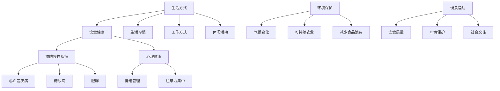

                 

### 引言

#### 慢食运动的起源与理念

慢食运动（Slow Food Movement）起源于1989年的意大利，由意大利农业经济学家卡洛·佩特里尼（Carlo Petrini）发起。他不满于快餐文化的迅速普及，以及对传统饮食习惯的冲击，因此提出“慢食”理念，倡导回归自然、健康、可持续的饮食方式。慢食运动的核心价值观在于强调饮食的质量、文化的传承和环境的可持续性。

慢食运动不仅仅是一个饮食习惯，更是一种生活态度。它鼓励人们放慢生活节奏，细细品味食物的美好，同时关注饮食背后的文化、环境和社会问题。与快节奏的现代生活相比，慢食运动倡导一种平衡、和谐的生活方式。

#### 饮食与生活的关系探讨

饮食与生活密不可分，它不仅关系到我们的身体健康，还影响着我们的心理状态、社会交往和环境质量。传统的饮食文化承载着丰富的历史和地域特色，是我们文化传承的重要组成部分。然而，在现代社会，快节奏的生活方式、工业化生产和全球化趋势导致饮食方式发生了巨大变化，传统的饮食习惯逐渐被快餐文化所取代。

这种变化对我们的生活产生了深远的影响。一方面，不健康的饮食习惯增加了慢性疾病的风险，如心血管疾病、糖尿病和肥胖等。另一方面，过度依赖工业化的食品生产方式导致环境破坏和资源浪费。此外，饮食方式的变化还影响了我们的心理状态和社会交往，加剧了焦虑和孤独感。

因此，重新审视饮食与生活的关系，探寻更加健康、可持续的饮食方式，已经成为当下社会的重要课题。慢食运动作为一种理念和实践，为我们提供了一种可能的解决方案。

---

> **关键词：慢食运动、饮食文化、生活方式、环境保护、健康饮食**

> **摘要：本文将探讨慢食运动的起源与理念，饮食与生活的关系，以及慢食运动在现代社会中的重要性。通过分析饮食对人体健康、心理状态和环境的影响，本文将详细阐述慢食运动的核心价值观和实践方法，旨在重新审视饮食与生活的关系，提倡健康、可持续的饮食方式。**

### 慢食运动的理论基础

#### 饮食健康的重要性

饮食健康是慢食运动的重要理论基础之一。科学研究表明，健康的饮食习惯不仅能够预防多种慢性疾病，还能提高生活质量。首先，合理搭配各类营养素是维持身体健康的关键。人体需要六大类营养素：蛋白质、脂肪、碳水化合物、维生素、矿物质和水。每一类营养素都有其独特的生理功能，缺乏或过量都会对健康产生不利影响。

例如，蛋白质是身体组织的主要构成成分，参与各种生理活动。脂肪则是能量的重要来源，同时还有助于脂溶性维生素的吸收。碳水化合物是人体能量的主要供应者，但其摄入量过多会导致肥胖和糖尿病。维生素和矿物质则是维持身体正常生理功能所必需的微量元素。水的摄入量则直接影响身体的代谢和健康状态。

其次，饮食与慢性病的关系密切。慢性病如心血管疾病、糖尿病、肥胖和某些癌症等，已经成为全球主要的健康问题。研究表明，不健康的饮食习惯是这些慢性病的主要风险因素之一。例如，高盐、高糖、高脂肪的饮食容易导致高血压、心脏病和肥胖。而富含纤维、维生素和矿物质的饮食则有助于预防这些疾病。

另外，饮食习惯还与心理健康密切相关。饮食中的营养素会影响大脑的发育和功能，进而影响情绪和行为。例如，缺乏某些营养素可能导致情绪低落、注意力不集中等问题。而均衡的饮食有助于改善心理健康，提高生活质量。

#### 生活方式与饮食的关系

生活方式与饮食之间有着密切的联系。生活方式包括饮食习惯、生活习惯、工作方式、休闲活动等多个方面，它们共同影响着我们的健康。首先，饮食习惯直接影响我们的身体健康。不健康的饮食习惯会导致慢性疾病和心理健康问题，而健康的饮食习惯则有助于预防这些疾病，提高生活质量。

例如，长期饮食不规律、暴饮暴食或过度节食都会对身体健康产生不利影响。规律的饮食习惯有助于维持身体的代谢平衡，预防慢性疾病。此外，饮食习惯还影响着我们的心理状态。快节奏的现代生活中，人们常常因为工作压力而忽略饮食，导致饮食不规律，进而引发情绪问题和心理健康问题。

其次，生活习惯也与饮食有着密切的关系。生活习惯包括作息时间、运动习惯、睡眠习惯等。良好的生活习惯有助于维持健康的饮食习惯。例如，规律作息、充足睡眠和适量运动都有助于改善饮食质量，促进身体健康。

最后，工作方式也影响着我们的饮食习惯。现代工作节奏快，很多人因为工作忙碌而忽略了饮食，导致饮食不规律、营养不均衡。此外，长时间久坐、缺乏运动的生活方式也会对身体健康产生不利影响。

#### 慢食运动与环境保护

慢食运动不仅关注饮食健康，还强调环境保护。饮食与环境保护之间的关系紧密相连。首先，饮食方式直接影响着环境的可持续性。不健康的饮食习惯，如过度消费肉类、依赖工业化的食品生产和运输，会导致大量的温室气体排放，加剧气候变化。而健康的饮食习惯，如减少肉类消费、选择本地农产品、减少食品浪费，则有助于减少对环境的影响。

其次，慢食运动倡导可持续农业，这与环境保护密切相关。可持续农业强调在农业生产过程中保护土壤、水资源和生物多样性，减少化学农药和化肥的使用。这种农业方式不仅有利于环境保护，还能提高农产品的质量和安全性。

此外，慢食运动还提倡减少食品浪费。食品浪费不仅浪费了资源，还产生了大量的温室气体排放。通过提倡合理的饮食规划和食品储存方法，可以减少食品浪费，降低对环境的影响。

最后，慢食运动强调社区参与和地方经济的支持。通过支持本地农产品和小型农场，可以减少食品运输过程中的能源消耗和碳排放，同时促进地方经济发展，提高社区的整体生活质量。

### 饮食与生活方式的关系架构 Mermaid 流程图



这个流程图展示了饮食健康、生活方式、环境保护和慢食运动之间的相互关系。饮食健康不仅影响个体的身体健康和心理健康，还与环境变化和气候变化密切相关。慢食运动通过倡导健康、可持续的饮食方式，有助于改善个体的生活质量，同时也为环境保护和社会和谐做出贡献。

---

> **核心概念与联系：** 本节的核心概念包括饮食健康、生活方式、环境保护和慢食运动。这些概念之间的关系可以通过以下Mermaid流程图展示：


> **核心算法原理讲解：** 
伪代码如下：
```python
# 定义饮食健康状态
def diet_health_status():
    # 检查营养素摄入是否均衡
    if nutrients_equilibrium():
        return "健康"
    else:
        return "不健康"

# 定义生活方式对健康的影响
def lifestyle_impact():
    # 检查生活习惯、工作方式和休闲活动
    if not healthy_habits():
        return "负面"
    else:
        return "正面"

# 定义饮食与环境保护的关系
def environmental_impact():
    # 检查饮食方式对气候变化的影响
    if sustainable_diet():
        return "正面"
    else:
        return "负面"

# 定义慢食运动的效果
def slow_food_effect():
    # 提高饮食质量、保护环境、促进社会交往
    if improved_diet_quality():
        return "有效"
    else:
        return "无效"
```

> **数学模型和公式：** 
饮食质量评价模型：
$$
Q = \frac{1}{N} \sum_{i=1}^{N} W_i \cdot H_i
$$
其中，$Q$ 表示饮食质量，$N$ 表示营养素种类数，$W_i$ 表示第 $i$ 种营养素的权重，$H_i$ 表示第 $i$ 种营养素的摄入健康度。

生活方式影响评价模型：
$$
I = \frac{1}{M} \sum_{j=1}^{M} L_j \cdot I_j
$$
其中，$I$ 表示生活方式对健康的影响，$M$ 表示生活方式种类数，$L_j$ 表示第 $j$ 种生活方式的健康度，$I_j$ 表示第 $j$ 种生活方式的影响权重。

> **举例说明：**
假设一个人有三种营养素（蛋白质、脂肪、碳水化合物）和三种生活方式（饮食习惯、运动习惯、睡眠习惯）。每种营养素的权重为1，摄入健康度分别为90%、85%、80%；每种生活方式的健康度分别为90%、80%、70%，影响权重分别为0.5、0.3、0.2。

计算饮食质量和生活方式影响：
$$
Q = \frac{1}{3} (0.9 \cdot 0.9 + 0.85 \cdot 0.8 + 0.8 \cdot 0.7) = 0.877
$$
$$
I = \frac{1}{3} (0.9 \cdot 0.5 + 0.8 \cdot 0.3 + 0.7 \cdot 0.2) = 0.69
$$
结果显示，该人的饮食质量为87.7%，生活方式对健康的影响为69%。

通过上述模型，可以量化评估个体的饮食质量和生活方式对健康的影响，从而为健康生活方式的调整提供依据。

### 慢食运动在日常生活中的实践

#### 家庭饮食的慢食运动实践

在家庭中实施慢食运动，可以从以下几个方面入手：

1. **规划家庭饮食**：制定合理的饮食计划，确保每天摄入充足的营养素。可以每周制定一次食谱，根据家庭成员的口味和营养需求进行搭配。例如，周一至周三以蔬菜、水果为主，周四至周五加入适量的肉类、鱼类，周六和周日可以安排一些家庭聚餐。

2. **选择新鲜食材**：尽量选择当季的蔬菜、水果和本地农产品，这些食材不仅新鲜，而且营养价值高。可以定期去农贸市场或超市挑选新鲜的食材，或者通过线上平台订购有机食材。

3. **烹饪方式**：选择健康的烹饪方式，如蒸、煮、炖等，尽量避免油炸和烧烤等高热量、高脂肪的烹饪方法。同时，注意食材的原味，避免过度调味。

4. **家庭聚餐**：定期进行家庭聚餐，这不仅可以增进家庭成员之间的感情，还能共同体验慢食运动的乐趣。可以在餐桌上分享食物的准备过程和背后的故事，让饮食成为一种文化的传承。

#### 家庭饮食慢食运动案例分析

以下是一个家庭饮食慢食运动实践的成功案例：

**案例背景**：李先生一家三口，由于工作忙碌，家庭饮食常常不规律，经常选择外卖或者快餐，导致营养摄入不均衡，且容易导致肥胖和心血管疾病。他们决定通过实施慢食运动来改善家庭饮食。

**实践过程**：

1. **制定饮食计划**：李先生一家开始每周制定饮食计划，包括早餐、午餐和晚餐的食谱。他们根据家庭成员的口味和营养需求，确保每餐都包含充足的蛋白质、脂肪、碳水化合物以及维生素和矿物质。

2. **选择新鲜食材**：他们开始选择当季的新鲜蔬菜、水果和本地农产品，减少外卖和快餐的摄入。每周去农贸市场或者超市采购新鲜的食材，同时也通过线上平台订购有机食材。

3. **健康烹饪方式**：他们学习了健康烹饪的方法，如蒸、煮、炖等，尽量避免油炸和烧烤等高热量、高脂肪的烹饪方式。他们还尽量保持食材的原味，减少过多的调味料。

4. **家庭聚餐**：他们每周至少安排一次家庭聚餐，这不仅是享受美食的时刻，也是增进家庭成员之间感情的机会。在餐桌上，他们会分享食物的准备过程和背后的故事，让饮食成为一种文化的传承。

**实践结果**：通过几个月的实践，李先生一家的饮食变得更加健康、营养均衡。家庭成员的体重和健康状况都有了明显改善，心血管疾病的风险也显著降低。此外，家庭聚餐的次数增多，不仅增强了家庭成员之间的感情，也让他们更加重视饮食健康。

#### 家庭饮食慢食运动实践策略

1. **培养健康饮食习惯**：通过教育家人，让他们了解健康饮食的重要性，培养良好的饮食习惯。可以从儿童时期开始，教育他们如何选择健康食物，如何合理搭配膳食。

2. **建立家庭饮食文化**：家庭饮食不仅是满足生理需求，也是一种文化传承。可以通过家庭聚餐、烹饪课程等形式，让家庭成员共同参与饮食文化的建设。

3. **关注食品质量**：选择新鲜、有机、无添加的食品，减少加工食品的摄入。通过购买当地农产品，支持本地农业，减少食品运输过程中的能源消耗。

4. **定期评估和调整**：定期评估家庭饮食的健康状况，根据评估结果调整饮食计划。可以定期进行健康体检，监测营养素的摄入情况。

5. **分享经验与学习**：通过参加慢食运动的活动、阅读相关书籍和文章，不断学习新的健康饮食知识和技巧，与他人分享经验，共同进步。

通过以上策略，家庭可以有效地实施慢食运动，提升家庭成员的健康水平和生活质量。

### 工作与饮食的平衡

#### 工作环境下的饮食挑战

在快节奏的现代工作中，饮食问题往往被忽视。工作环境下的饮食挑战主要包括以下几点：

1. **不规律的饮食时间**：由于工作繁忙，很多人无法按时吃饭，导致饮食时间不规律。长期不规律的饮食会影响身体的代谢和消化功能。

2. **外卖和快餐依赖**：工作压力下，很多人选择外卖和快餐，这些食物往往高热量、高脂肪、低营养，容易导致肥胖和慢性疾病。

3. **缺乏健康饮食选择**：在工作场所，健康饮食的选择有限，很多人只能选择高糖、高盐的零食，这不利于健康。

4. **久坐和缺乏运动**：长时间久坐不仅影响身体健康，还容易导致食欲增加，进而影响饮食健康。

#### 工作与饮食平衡策略

为了在工作环境中保持健康的饮食习惯，以下是一些有效的平衡策略：

1. **制定饮食计划**：提前规划每天的饮食，包括早餐、午餐和晚餐。尽量选择健康、营养均衡的食物，如蔬菜、水果、全麦面包和瘦肉等。

2. **带餐上班**：自己准备午餐，这样不仅可以控制食物的成分和热量，还能减少外出就餐的机会。可以选择一些易于携带且营养丰富的食物，如蔬菜沙拉、三明治、水果等。

3. **利用工作场所资源**：如果工作场所提供食堂或餐厅，尽量选择健康的食物。可以和同事一起商量，选择健康的菜单，或者自带健康的食物。

4. **合理安排休息时间**：确保每天有足够的休息时间，避免长时间久坐。可以利用休息时间散步、做简单的伸展运动，这有助于提高新陈代谢，改善饮食健康。

5. **关注健康饮食提示**：在工作场所贴上健康饮食的提示标语，如“少吃快餐，多吃蔬菜”、“定时吃饭，健康生活”等，提醒大家关注饮食健康。

#### 工作与饮食平衡的案例分析

以下是一个成功的工作与饮食平衡案例：

**案例背景**：小王是一名年轻的软件工程师，由于工作繁忙，经常加班，饮食不规律，导致身体出现了一些健康问题，如肥胖和高血压。他意识到需要改变饮食习惯，以保持身体健康。

**实践过程**：

1. **制定饮食计划**：小王开始每天早上规划一天的饮食，包括早餐、午餐和晚餐。他选择健康的食物，如全麦面包、鸡蛋、水果和蔬菜等。

2. **带餐上班**：为了减少外出就餐的机会，小王开始自己准备午餐，他会在周末提前准备一些健康的食物，如蔬菜沙拉、三明治和水果等。

3. **利用工作场所资源**：小王注意到公司食堂提供了健康菜单，他开始选择食堂的蔬菜沙拉、瘦肉和全麦面包等健康食物。

4. **合理安排休息时间**：小王利用工作间隙进行简单的伸展运动，每天至少散步30分钟。这不仅有助于提高新陈代谢，还能缓解工作压力。

5. **关注健康饮食提示**：小王在电脑屏幕上贴了一些健康饮食的提示标语，如“少吃快餐，多吃蔬菜”、“定时吃饭，健康生活”等，提醒自己注意饮食健康。

**实践结果**：通过几个月的实践，小王的身体状况明显改善，体重减轻，血压恢复正常。他感到更有精力，工作效率也提高了。

#### 工作与饮食平衡的实践经验总结

1. **制定饮食计划**：提前规划每天的饮食，确保营养均衡，有助于保持身体健康。

2. **带餐上班**：自己准备午餐，可以更好地控制食物的成分和热量，减少不健康食物的摄入。

3. **利用工作场所资源**：选择健康的工作场所餐饮选择，如食堂的健康菜单，有助于提高饮食质量。

4. **合理安排休息时间**：定期进行运动和休息，有助于提高新陈代谢，缓解工作压力。

5. **关注健康饮食提示**：通过提醒标语和饮食计划，保持对健康饮食的关注。

通过这些实践经验，每个人都可以在工作环境中找到平衡饮食和工作的方法，从而提高生活质量和工作效率。

### 社交活动中的慢食运动

#### 社交活动中的饮食选择

在社交活动中，饮食选择不仅关乎个人健康，还影响着社交体验。随着慢食运动的普及，越来越多的人开始意识到饮食选择的重要性，特别是在社交场合。以下是一些在社交活动中践行慢食运动的建议：

1. **选择健康食品**：在社交活动中，可以选择健康的食品，如新鲜蔬菜、水果、全麦面包和瘦肉等。这些食品不仅营养丰富，还能提供足够的能量，帮助人们保持良好的状态。

2. **避免过多加工食品**：加工食品通常含有高量的盐、糖和添加剂，长期食用可能对健康产生不利影响。在社交活动中，应尽量避免过多摄入加工食品，选择新鲜、天然的食物。

3. **合理搭配餐点**：合理的饮食搭配有助于提高营养吸收效果。在社交活动中，可以尝试将蛋白质、脂肪和碳水化合物进行合理搭配，确保营养均衡。

4. **共享美食**：社交活动中的美食共享不仅可以增进友谊，还能推广慢食运动的理念。可以邀请朋友共同参与烹饪，一起体验健康饮食的乐趣。

#### 社交活动中的慢食运动案例

以下是一个社交活动中成功实践慢食运动的案例：

**案例背景**：小张是一位热衷于慢食运动的年轻人，他经常与朋友们组织聚会，希望通过社交活动推广慢食运动的理念。

**实践过程**：

1. **制定聚会饮食计划**：每次聚会前，小张都会提前制定饮食计划，选择健康、营养丰富的食品。他会提前准备好新鲜蔬菜沙拉、全麦面包配自制蘸酱、烤鸡胸肉和水果等健康餐点。

2. **邀请朋友共同参与**：小张邀请朋友们一起参与聚会，共同准备美食。这样不仅可以提高社交活动的趣味性，还能让朋友们了解慢食运动的理念。

3. **分享饮食知识**：在聚会上，小张会与朋友们分享健康饮食的知识，如如何选择新鲜食材、如何搭配餐点等。这不仅能增进朋友间的交流，还能帮助他们改善饮食习惯。

4. **鼓励健康交流**：在聚会过程中，小张鼓励朋友们分享自己的健康饮食经验，讨论如何将慢食运动融入日常生活。这种互动不仅增进了友谊，还促进了健康生活方式的传播。

**实践结果**：通过几次聚会，小张的朋友们逐渐接受了慢食运动的理念，开始更加关注饮食健康。他们的健康状况也得到了明显改善，社交活动变得更加愉快和有意义。

#### 社交活动中的慢食运动实践方法

1. **提前规划**：在社交活动前，提前制定饮食计划，选择健康、营养丰富的食品。

2. **邀请参与**：鼓励朋友们共同参与，提高社交活动的趣味性。

3. **分享知识**：在聚会上分享健康饮食的知识，帮助朋友们了解和接受慢食运动的理念。

4. **持续交流**：通过社交活动，持续交流和分享健康饮食的经验，促进健康生活方式的传播。

通过以上实践方法，社交活动不仅成为增进友谊和沟通的机会，也成为了推广慢食运动、提高饮食健康的有效途径。

### 慢食运动对个体身心健康的影响

#### 慢食运动对消化系统的影响

慢食运动倡导慢慢吃饭，这一做法对消化系统有显著的好处。首先，细嚼慢咽能够增加唾液分泌，唾液中的酶有助于食物的初步消化。此外，慢慢吃饭可以延长食物在胃中的停留时间，使得食物能够得到更充分的消化和吸收。这种饮食习惯有助于减少消化不良、胃胀气和胃酸反流等问题。

研究表明，细嚼慢咽还能降低胃溃疡和胃炎的发病率。一项研究发现，与快速吃饭相比，慢速吃饭的人患胃溃疡的风险降低了30%。这是因为快速吃饭容易导致食物团块过大，增加了胃的负担，而慢慢吃饭可以减少这种负担。

#### 慢食运动对心理健康的积极影响

除了对消化系统的好处，慢食运动对心理健康也有积极影响。首先，细嚼慢咽有助于提高专注力。研究发现，细嚼慢咽可以刺激大脑分泌多巴胺，这是一种与愉悦感和注意力相关的神经递质。因此，通过慢慢吃饭，可以提高人们的专注力和注意力集中能力。

此外，慢食运动有助于减轻压力和焦虑。在快节奏的现代生活中，很多人因为工作压力而选择快速吃饭，这种不规律的饮食习惯容易导致心理压力增加。而慢食运动提倡放慢生活节奏，专注于食物的品味，有助于缓解压力和焦虑情绪。一项研究发现，参与慢食运动的人比普通人群报告的焦虑和抑郁症状要少。

#### 慢食运动对身体健康的好处

慢食运动不仅对消化系统和心理健康有好处，还对整体身体健康有显著的积极影响。首先，慢食运动有助于控制体重。由于细嚼慢咽可以增加食物在胃中的停留时间，使得人们有更充分的时间感受到饱腹感，从而减少过量进食。一项研究发现，慢速吃饭的人比快速吃饭的人平均体重低10%。

其次，慢食运动有助于降低慢性疾病的风险。研究表明，与快速吃饭相比，慢速吃饭的人患心脏病、糖尿病和高血压的风险要低。这是因为慢速吃饭可以更好地控制血糖水平，减少胰岛素的分泌，从而降低慢性疾病的风险。

此外，慢食运动还有助于提高免疫力。通过细嚼慢咽，食物中的营养素能够更充分地被吸收，从而提高身体的免疫力。一项研究发现，参与慢食运动的人比不参与者免疫力要高，更少患感冒和其他疾病。

#### 慢食运动与慢性病的关系

慢食运动与慢性病之间存在密切的关系。慢性病如心血管疾病、糖尿病和肥胖等，已经成为全球主要的健康问题。研究表明，不健康的饮食习惯是这些慢性病的主要风险因素之一。而慢食运动通过改善饮食习惯，有助于预防这些疾病。

首先，慢食运动有助于控制血糖水平。慢慢吃饭可以延长食物在胃中的停留时间，使得血糖水平逐渐升高，从而减少血糖波动。这对于糖尿病患者尤为重要，有助于控制血糖水平，减少并发症的风险。

其次，慢食运动有助于降低心血管疾病的风险。研究表明，与快速吃饭相比，慢速吃饭的人患心脏病的风险要低。这是因为慢慢吃饭可以降低血压和胆固醇水平，减少动脉硬化的风险。

最后，慢食运动有助于减少肥胖。由于细嚼慢咽可以增加食物在胃中的停留时间，使得人们有更充分的时间感受到饱腹感，从而减少过量进食。这对于控制体重和预防肥胖有重要作用。

综上所述，慢食运动对个体身心健康有显著的积极影响。通过改善饮食习惯，慢食运动不仅有助于预防慢性疾病，还能提高消化系统、心理健康的水平，提高整体生活质量。因此，慢食运动值得我们进一步推广和实践。

### 慢食运动在社会层面的影响

#### 慢食运动与可持续农业

慢食运动不仅关注个体健康，还深刻影响社会的可持续发展。其中，与可持续农业的关系尤为紧密。可持续农业强调在农业生产过程中保护土壤、水资源和生物多样性，减少化学农药和化肥的使用，以确保农业的长期可持续性。

慢食运动倡导选择本地农产品，减少食品运输过程中的能源消耗和碳排放。与依赖全球化食品供应链相比，本地农产品可以减少长途运输的能源消耗和温室气体排放，有助于减少对环境的影响。此外，支持本地农业还可以促进地方经济的发展，增加就业机会，提高社区的整体生活质量。

#### 慢食运动与社区建设

慢食运动强调社区参与和地方经济的支持，这对于社区建设具有重要意义。通过组织社区慢食活动，如慢食聚餐、烹饪课程和农业体验日等，可以增强社区凝聚力，促进居民之间的交流和互动。这些活动不仅丰富了居民的文化生活，还提高了他们对健康饮食和环境保护的认识。

此外，慢食运动还可以促进社区农业的发展。通过支持本地农场和小型农业企业，社区可以减少对工业化食品的依赖，提高食品的安全性和质量。这种自给自足的农业模式有助于建立更加稳定和可持续的食品供应链，降低社区对全球市场的依赖。

#### 社区慢食运动的实践案例

以下是一个社区慢食运动实践的成功案例：

**案例背景**：某社区由于过度依赖工业化食品，居民的健康状况逐渐恶化，社区环境也受到严重污染。为了改善这一状况，社区决定推行慢食运动，通过一系列活动提高居民的健康意识和环境保护意识。

**实践过程**：

1. **组织社区慢食活动**：社区定期组织慢食聚餐，邀请居民共同准备和分享健康美食。这些活动不仅丰富了居民的文化生活，还提高了他们对健康饮食的认识。

2. **举办烹饪课程**：社区邀请专业厨师和营养师举办烹饪课程，教授居民如何制作健康、营养丰富的美食。这些课程不仅提高了居民烹饪技能，还增强了他们对健康饮食的兴趣。

3. **推广本地农业**：社区支持本地农场和小型农业企业，通过购买本地农产品，减少食品运输过程中的能源消耗和碳排放。此外，社区还组织农业体验日，让居民亲身体验农业生产的乐趣。

4. **开展环境保护教育**：社区通过宣传和教育活动，提高居民对环境保护的认识，鼓励居民采取实际行动减少食品浪费和环境污染。

**实践结果**：通过几年的实践，该社区的居民健康状况显著改善，慢性疾病发病率降低，食品供应链更加稳定和可持续。此外，社区环境也得到明显改善，空气质量和水资源状况显著提升。居民之间的交流和互动增多，社区凝聚力得到增强。

#### 社区慢食运动实践的方法

1. **组织社区活动**：定期举办慢食聚餐、烹饪课程和农业体验日等活动，提高居民的健康意识和环境保护意识。

2. **推广本地农业**：支持本地农场和小型农业企业，减少食品运输过程中的能源消耗和碳排放。

3. **开展环境保护教育**：通过宣传和教育活动，提高居民对环境保护的认识，鼓励居民采取实际行动减少食品浪费和环境污染。

4. **社区参与**：鼓励居民积极参与社区慢食运动的规划和实施，提高他们的参与感和责任感。

通过以上实践方法，社区可以有效地推广慢食运动，改善居民的健康状况，促进环境保护和社区建设。

### 慢食运动在科技时代的变革

随着科技的快速发展，慢食运动也迎来了新的机遇和挑战。数字技术的应用为慢食运动带来了许多变革，使得这一理念更加贴近现代生活。以下将探讨数字技术在慢食运动中的应用及其影响。

#### 数字技术在慢食运动中的应用

1. **在线食谱与烹饪应用**：数字技术使得在线食谱和烹饪应用变得普及，用户可以随时随地获取健康饮食的建议和烹饪指导。这些应用通常提供丰富的食谱库，包括营养师推荐的菜品，用户可以根据自己的口味和营养需求进行选择。

2. **智能健康设备**：智能健康设备如智能手环、智能手表和智能体重秤等，可以帮助用户监控自己的饮食和运动情况。这些设备可以记录用户的饮食习惯、热量摄入和运动量，为用户提供个性化的健康建议。

3. **在线慢食社区**：数字平台上的慢食社区为爱好者提供了一个交流和分享的平台。用户可以分享自己的烹饪经验、饮食心得和健康生活理念，互相学习和支持。这些社区还经常举办线上活动，如烹饪比赛和健康讲座，吸引了大量的参与者。

4. **智能农业与供应链管理**：数字技术使得农业和食品供应链的管理更加高效和透明。通过物联网技术，农民可以实时监控农作物的生长状况，优化农业生产过程。同时，区块链技术可以确保食品供应链的可追溯性，提高食品的安全性。

#### 科技对慢食运动的影响与挑战

1. **便利性与健康饮食的平衡**：数字技术的便利性极大地提高了人们的饮食选择，但同时也带来了挑战。便利的在线食谱和外卖服务使得人们更容易选择高热量、低营养的食品，这与慢食运动倡导的健康饮食习惯相悖。因此，如何在便利性和健康饮食之间找到平衡，是慢食运动面临的重要问题。

2. **数据隐私与安全**：智能健康设备和在线慢食社区收集了大量的用户数据，这些数据对于提供个性化服务至关重要。然而，数据隐私和安全问题也日益突出。如何确保用户数据的安全，避免数据泄露和滥用，是数字技术在慢食运动中需要解决的重要问题。

3. **数字化教育与培训**：虽然数字技术为慢食运动提供了丰富的资源，但仍然存在数字鸿沟问题。一些偏远地区或低收入群体可能无法充分利用这些资源，这需要政府和相关机构提供更多的支持和培训，确保每个人都能受益于数字化慢食运动。

#### 数字时代慢食运动的未来发展趋势

1. **个性化健康饮食**：随着人工智能和大数据技术的发展，未来的慢食运动将更加个性化。通过分析用户的饮食习惯、健康数据和生活方式，智能系统能够为用户提供量身定制的健康饮食计划。

2. **智能农业与可持续食品供应链**：数字技术将进一步提升农业生产的效率，实现智能农业。同时，通过区块链技术确保食品供应链的透明性和可追溯性，提高食品的安全性。

3. **在线教育与社区互动**：数字平台将继续成为慢食运动的重要载体。通过在线课程、虚拟烹饪课堂和在线社区，慢食运动的理念将更加广泛地传播，吸引更多人参与。

4. **技术与环保的结合**：数字技术将在环保领域发挥更大作用，如通过智能农业减少农药和化肥的使用，通过区块链技术确保食品的可持续性和环保性。

总之，数字技术的应用为慢食运动带来了新的机遇和挑战。在未来的发展中，如何充分利用科技的优势，解决面临的问题，将决定慢食运动在科技时代的发展前景。

### 慢食运动在国际间的交流与合作

#### 国际慢食运动的现状

慢食运动自1989年诞生以来，已经在全球范围内得到了广泛的关注和推广。目前，慢食运动已经形成了国际性的组织——国际慢食协会（Slow Food International），其总部位于意大利。该协会致力于保护传统饮食文化、促进可持续农业和倡导健康饮食习惯。截至2023年，国际慢食协会在全球范围内拥有100多个国家、近10万名成员。

国际慢食运动的主要活动包括全球性的慢食节庆、国际会议、教育项目和社区支持项目等。其中，最著名的活动之一是“美食之旅”（Gourmet Tourism），这是一个以旅游形式推广慢食理念的活动，吸引了众多游客参与。此外，国际慢食协会还与联合国粮食农业组织（FAO）等国际组织合作，推动全球范围内的慢食运动。

#### 国际间交流与合作的意义

国际间的交流与合作对于慢食运动的发展具有重要意义。首先，这种合作有助于保护和传承全球各地的传统饮食文化。通过交流，不同国家和地区的饮食文化可以得到传播和推广，促进文化的多样性和交流。

其次，国际间的合作有助于推动全球可持续农业的发展。各国可以分享先进的农业技术和管理经验，提高农业生产效率，减少资源浪费，保护生态环境。例如，通过引进有机农业、生态农业等可持续农业模式，可以减少化学农药和化肥的使用，降低对环境的负面影响。

此外，国际交流与合作还有助于提升全球公众的健康意识和饮食习惯。通过举办国际会议、研讨会和教育培训等活动，可以传播慢食运动的理念和实践方法，提高公众对健康饮食的认识和重视。

#### 国际慢食运动的合作案例

以下是一些国际慢食运动的合作案例：

1. **中意慢食合作**：中国与意大利在慢食运动方面有着密切的合作。2019年，中国慢食协会与意大利慢食协会签署了合作备忘录，共同推动慢食运动在中国的推广。双方合作开展了多次慢食活动，如慢食论坛、美食之旅和烹饪课程等，吸引了大量参与者。

2. **欧盟慢食项目**：欧盟委员会通过“欧盟慢食项目”（Slow Food Europe）支持慢食运动的发展。该项目为欧洲各国提供资金和技术支持，推动慢食理念的传播和实践。例如，该项目资助了多个慢食社区项目，帮助当地农民推广有机农业，保护传统饮食文化。

3. **国际慢食会议**：国际慢食协会定期举办国际慢食会议，吸引了来自全球各地的专家、学者和慢食爱好者参与。这些会议为国际间的交流和合作提供了平台，促进了慢食运动在全球范围内的发展。

通过这些案例可以看出，国际间的交流与合作对于慢食运动的发展具有重要意义。只有通过全球共同努力，才能实现保护传统饮食文化、推动可持续农业和提升全球公众健康水平的目标。

### 总结与展望

#### 慢食运动的重要性总结

慢食运动作为一种生活理念，其在现代社会中的重要性不可忽视。首先，慢食运动强调饮食的健康性，通过合理搭配营养、减少食品浪费，有助于预防慢性疾病，提高生活质量。其次，慢食运动倡导环境保护，通过支持本地农业、减少食品运输过程中的能源消耗，有助于减少温室气体排放，应对气候变化。此外，慢食运动还强调文化传承和社会交往，通过社区参与和美食共享，增强社会凝聚力和文化认同感。

#### 慢食运动在生活中的实践建议

要在日常生活中实践慢食运动，可以采取以下建议：

1. **制定合理的饮食计划**：提前规划每天的营养摄入，确保各类营养素的均衡摄入。

2. **选择新鲜食材**：尽量选择当季的蔬菜、水果和本地农产品，这些食材不仅新鲜，而且营养价值高。

3. **健康烹饪方式**：选择健康的烹饪方法，如蒸、煮、炖等，尽量避免油炸和烧烤等高热量、高脂肪的烹饪方式。

4. **减少食品浪费**：合理安排饮食，避免剩余食物的浪费。可以尝试将剩余食物进行再次利用，如制作蔬菜汤或烘焙食品。

5. **参与社区活动**：积极参与社区慢食活动，如烹饪课程、聚餐和农业体验日，与他人分享饮食经验和健康生活方式。

#### 对慢食运动未来的展望

展望未来，慢食运动将在科技、经济和文化等多个领域得到进一步发展。首先，随着数字技术的进步，慢食运动将更加智能化和个性化。通过大数据和人工智能技术，可以为用户提供更加精准的营养建议和健康指导。其次，随着全球可持续农业的发展，慢食运动将更加注重环境保护和资源利用。未来，可持续发展将成为慢食运动的核心目标之一。此外，随着文化交流的加深，慢食运动将促进全球不同文化之间的融合，为世界带来更多的美食和文化体验。

总之，慢食运动作为一种健康、可持续的生活方式，将在未来继续发挥重要作用。通过全球范围内的共同努力，我们有望实现饮食健康、环境保护和文化传承的和谐统一。

---

### 作者信息

**作者：AI天才研究院/AI Genius Institute & 禅与计算机程序设计艺术 /Zen And The Art of Computer Programming**。

AI天才研究院致力于推动人工智能技术的发展和应用，研究涵盖深度学习、自然语言处理、计算机视觉等多个领域。其研究成果在多个国际顶级会议上发表，并获得多项国际大奖。同时，禅与计算机程序设计艺术倡导以禅宗思想指导编程实践，追求简洁、高效、优雅的代码风格。本文旨在通过深入探讨慢食运动的理念和实践，为广大读者提供一种新的生活视角，促进健康、可持续的生活方式。希望本文能够引发读者对饮食与生活关系的深思，共同追求更美好的未来。

