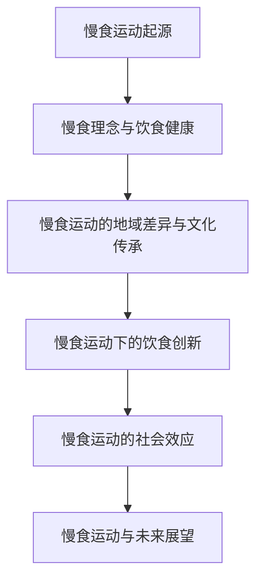

                 

### 文章标题：慢食运动：饮食中的文化传承

> 关键词：慢食运动、饮食文化、文化传承、健康饮食、生活方式

> 摘要：本文深入探讨慢食运动的起源、理念及其在全球范围内的实践。通过分析慢食运动对健康饮食的影响，以及如何通过饮食传承文化，本文旨在揭示慢食运动在现代生活中的重要角色，并提供实际案例和未来展望。

## 第一部分：慢食运动的起源与理念

### 第1章：慢食运动的起源

#### 1.1 慢食运动的诞生背景

慢食运动（Slow Food Movement）起源于1989年的意大利，当时，意大利食品业面临着工业化生产带来的快速食品的挑战。一群致力于保护传统美食和促进可持续农业的美食家，发起了慢食运动，倡导“放慢脚步，享受生活”。

这个运动的发起人卡洛·佩特里尼（Carlo Petrini）认为，快速食品文化的普及不仅威胁到人们的健康，还破坏了食物的传统制作方式和地域特色。因此，他呼吁人们回归自然、尊重食材和劳动者的劳动成果，享受传统美食带来的乐趣。

#### 1.2 慢食运动的核心价值观

慢食运动的核心价值观可概括为“慢、好、干净”（Slow, Good, Clean）。这一价值观不仅仅关注食物的口感和营养价值，更强调食物的生产过程和生态环境。

- **慢**：倡导放慢生活节奏，享受食物带来的愉悦。这不仅仅是指饮食速度，更是一种生活态度。
- **好**：强调食物的质量和营养价值，倡导使用新鲜、有机、本地食材。
- **干净**：关注食物的生产和消费过程中的环保和社会责任，推动可持续农业和健康饮食。

#### 1.3 慢食运动与快食文化的对比

快食文化（Fast Food Culture）强调快速、便利和低成本，其典型代表是快餐。这种文化在全球范围内迅速传播，对人们的生活方式产生了深远的影响。

- **饮食速度**：快食文化追求迅速进食，往往导致饮食不均衡，影响消化系统健康。而慢食运动则鼓励慢慢品味，有助于提高饮食质量。
- **食材来源**：快食文化通常使用大量加工食品和工业化生产的食材，而慢食运动强调使用新鲜、有机、本地食材，减少食物的运输和加工过程，降低对环境的影响。
- **文化传承**：快食文化往往忽视食物的历史和文化价值，而慢食运动则致力于保护传统饮食文化，通过饮食传承地域特色和文化记忆。

### 第2章：慢食理念与饮食健康

#### 2.1 慢食饮食对健康的影响

慢食饮食不仅仅是放慢进食速度，更是一种全面的生活方式。研究表明，慢食饮食对健康有多方面的积极影响。

- **消化系统**：慢慢进食有助于消化系统的健康。咀嚼时间长，食物在口腔中的消化更充分，减轻了胃肠的负担。
- **心血管健康**：慢食饮食有助于控制血糖和血压，减少心血管疾病的风险。
- **心理健康**：慢慢进食有助于提高饮食的愉悦感，减少因进食过快导致的焦虑和压力。
- **体重管理**：慢食饮食有助于控制食欲，减少过量进食，有助于体重管理。

#### 2.2 慢食运动与营养学

慢食运动与营养学紧密相连。营养学的研究表明，食物的营养价值取决于食材的种类、质量和生产方式。

- **新鲜食材**：新鲜食材含有更多的维生素和矿物质，营养价值更高。
- **有机食品**：有机食品通常不含农药和化肥，更健康、更环保。
- **本地食材**：本地食材减少了食物的运输和储存时间，保持了更高的营养价值。

#### 2.3 慢食生活方式的实践

慢食生活方式不仅包括饮食方面的改变，还涉及生活的方方面面。

- **烹饪技巧**：慢食运动鼓励人们掌握烹饪技巧，亲自制作食物，享受烹饪的乐趣。
- **饮食习惯**：慢食运动倡导规律的饮食习惯，避免暴饮暴食和过度饥饿。
- **社交活动**：慢食运动也促进了社区活动，人们通过共餐、分享美食，增进彼此的感情。

## 第二部分：慢食运动的地域差异与文化传承

### 第3章：全球慢食运动的现状

#### 3.1 欧洲的慢食运动

欧洲是慢食运动的发源地，至今仍是全球慢食运动的重要中心。在意大利，慢食运动已经深深融入了人们的生活。慢食餐厅、慢食学校和慢食社区层出不穷，各种以慢食为主题的节日和活动吸引了无数人参与。

- **意大利**：意大利的慢食运动涵盖了从乡村到城市，从学校到企业的各个层面。著名的“慢食城市”项目，通过鼓励居民参与社区花园、农场体验等活动，推广慢食理念。
- **法国**：法国的慢食运动同样得到了广泛的支持。法国人热爱美食，慢食运动在这里不仅是一种生活方式，更是一种文化传承。

#### 3.2 亚洲的慢食运动

亚洲的慢食运动近年来也逐渐兴起，尤其是在日本和中国。

- **日本**：日本文化中注重细节和仪式感，这与慢食运动的理念不谋而合。日本的慢食餐厅、有机农场和慢食社区活动层出不穷。
- **中国**：中国拥有丰富的饮食文化和悠久的农业历史，慢食运动在这里有着巨大的发展潜力。中国的慢食运动强调食品安全、营养均衡和环境保护。

#### 3.3 其他地区的慢食运动

除了欧洲和亚洲，其他地区的慢食运动也在不断发展。

- **美洲**：在美国和加拿大，慢食运动得到了越来越多的关注。慢食社区、慢食餐厅和慢食活动在各种城市和乡村逐渐兴起。
- **非洲**：非洲大陆的慢食运动主要集中在保护传统饮食文化和推动可持续农业。许多非洲国家通过推广慢食运动，提升当地居民的健康意识和生活质量。

### 第4章：饮食文化传承与慢食运动

#### 4.1 地域性饮食文化的保护

饮食文化是地域特色的重要组成部分，也是文化传承的重要方式。慢食运动通过强调食物的传统制作方式和地域特色，致力于保护地域性饮食文化。

- **传统食品的保护**：慢食运动支持传统食品的生产和传承，如意大利的橄榄油、法国的奶酪等。
- **传统技艺的传承**：慢食运动鼓励年轻一代学习和传承传统烹饪技艺，如日本料理的刺身制作。

#### 4.2 慢食运动与传统饮食文化的联系

慢食运动与传统饮食文化有着紧密的联系。许多传统饮食文化中蕴含着慢食的理念，如中国传统的“食不厌精，脍不厌细”和印度的“瑜伽饮食”。

- **慢食运动的推广**：通过慢食运动，传统饮食文化的理念得到了更广泛的传播和认可。
- **饮食文化的创新**：慢食运动也促进了传统饮食文化的创新，如结合现代营养学理论的饮食方案。

#### 4.3 饮食文化的国际交流与影响

饮食文化的国际交流是慢食运动的重要组成部分。通过国际间的饮食交流，人们不仅能够了解和欣赏其他文化的饮食特色，还能够促进全球饮食文化的多样性和发展。

- **国际美食节**：许多国家和地区举办国际美食节，邀请各国美食家展示自己的传统美食，促进了饮食文化的交流。
- **全球慢食日**：每年的11月7日是“全球慢食日”，各地慢食组织和社会团体在这一天举行各种活动，推广慢食理念。

## 第三部分：慢食运动下的饮食创新

### 第5章：慢食运动与可持续饮食

#### 5.1 慢食运动与可持续农业

慢食运动与可持续农业密不可分。可持续农业注重保护生态环境、提高农业生产效率和保障食品安全。

- **有机农业**：慢食运动鼓励有机农业的发展，减少农药和化肥的使用，保护土壤和水资源。
- **本地农业**：慢食运动倡导本地农业，减少食物的运输和储存，降低对环境的影响。
- **社区支持农业**：社区支持农业（CSA）是慢食运动的一种实践方式，通过建立农场与消费者之间的直接联系，推动可持续农业的发展。

#### 5.2 慢食运动与有机食品

有机食品是慢食运动的重要支柱。有机食品不仅健康、环保，还符合慢食运动的核心价值观。

- **有机认证**：慢食运动支持有机认证体系，确保有机食品的质量和真实性。
- **有机消费**：慢食运动鼓励消费者选择有机食品，提高有机食品的市场份额。
- **有机教育**：慢食运动通过教育和宣传，提高公众对有机食品的认知和重视。

#### 5.3 慢食运动下的新型饮食模式

随着慢食运动的发展，新型饮食模式不断涌现。

- **素食主义**：素食主义是慢食运动的一种表现，许多人通过选择素食，减少对动物的伤害，保护环境。
- **地中海饮食**：地中海饮食是一种以橄榄油、水果、蔬菜和鱼类为主要食物的饮食模式，被认为是最健康的饮食模式之一。
- **间歇性饮食**：间歇性饮食通过限制进食时间，帮助人们控制体重和改善健康。

### 第6章：慢食运动与美食创新

#### 6.1 传统美食的创新

慢食运动鼓励对传统美食的创新，通过改良食材和烹饪方法，使传统美食焕发新的活力。

- **新派料理**：新派料理结合传统食材和现代烹饪技巧，创造出新的美食体验。
- **分子料理**：分子料理通过科学方法研究食物的物理和化学特性，创造出独特的美食作品。
- **创意料理**：创意料理将传统饮食文化与当代艺术相结合，为美食赋予新的文化内涵。

#### 6.2 国际美食的融合

国际美食的融合是慢食运动的重要趋势之一。通过国际间的美食交流，各国美食相互借鉴、相互融合，创造出新的饮食文化。

- **美食节**：各国美食节成为国际美食融合的舞台，展示了全球美食的魅力。
- **跨国餐厅**：跨国餐厅将各国美食融合在一起，为消费者提供多样化的美食选择。
- **全球美食地图**：全球美食地图记录了世界各地独特的美食文化，促进了国际间的美食交流。

#### 6.3 慢食运动下的美食设计

慢食运动下的美食设计注重美食的视觉、味觉和营养价值。

- **视觉设计**：美食的视觉设计使其更具吸引力，提升了饮食的愉悦感。
- **味觉设计**：美食的味觉设计使其更加美味，满足了人们的味蕾需求。
- **营养设计**：美食的营养设计使其更健康、更营养，符合慢食运动的核心价值观。

## 第四部分：慢食运动的社会效应

### 第7章：慢食运动与生活方式

#### 7.1 慢食运动对生活方式的改变

慢食运动不仅仅是一种饮食方式，更是一种生活方式。它鼓励人们放慢脚步，回归自然，享受生活的美好。

- **生活节奏**：慢食运动鼓励人们放慢生活节奏，减少工作和生活的压力。
- **社交活动**：慢食运动促进了社区活动，增强了人与人之间的联系。
- **环境保护**：慢食运动强调可持续饮食，减少了食物的浪费和环境污染。

#### 7.2 慢食运动对心理健康的影响

慢食运动对心理健康有着积极的影响。慢慢进食、享受食物的过程有助于提高饮食的愉悦感，减少焦虑和压力。

- **压力管理**：慢食运动通过放慢生活节奏，帮助人们更好地管理压力。
- **心理健康**：慢食运动有助于提高人们的心理健康水平，减少心理问题的发生。
- **幸福感**：慢食运动通过提升饮食体验，增强了人们的幸福感。

#### 7.3 慢食运动与社会责任的结合

慢食运动不仅关注个人健康，还强调社会责任。通过推动可持续饮食，慢食运动致力于改善社会和环境状况。

- **社会公正**：慢食运动倡导公平贸易，确保农产品和食品的价格合理，保障农民和工人的权益。
- **环境保护**：慢食运动通过减少食物浪费和推动可持续农业，保护生态环境。
- **社区发展**：慢食运动促进了社区发展，增强了社区的凝聚力和可持续性。

### 第8章：慢食运动与未来展望

#### 8.1 慢食运动的发展趋势

随着人们对健康和环保意识的提高，慢食运动的发展趋势逐渐显现。

- **全球化**：慢食运动正在全球范围内迅速发展，成为全球性运动。
- **科技应用**：慢食运动与科技相结合，通过大数据、人工智能等技术手段，提高饮食质量和效率。
- **政策支持**：许多国家和地区开始出台政策，支持慢食运动的发展。

#### 8.2 慢食运动在全球化背景下的角色

在全球化的背景下，慢食运动扮演着重要角色。

- **文化交流**：慢食运动促进了不同文化之间的交流，推动了全球饮食文化的多样性。
- **可持续发展**：慢食运动倡导可持续饮食，为全球可持续发展作出了贡献。
- **社会责任**：慢食运动通过关注社会和环境问题，提高了公众的社会责任意识。

#### 8.3 慢食运动对中国饮食文化的启示

慢食运动对中国饮食文化有着重要的启示。

- **传统保护**：慢食运动强调传统饮食文化的保护，为中国传统饮食文化的传承提供了新的思路。
- **健康饮食**：慢食运动倡导健康饮食，为中国居民提供了科学的饮食指导。
- **可持续发展**：慢食运动推动可持续饮食，为中国农业和食品工业的发展提供了新的方向。

## 结语

慢食运动不仅是饮食方式的变革，更是一种文化传承和生活方式的变革。通过放慢脚步、享受生活，慢食运动为人们带来了健康、快乐和和谐。在全球化的背景下，慢食运动正逐渐成为一种全球性运动，推动了全球饮食文化的多样性和可持续发展。

### 致谢

感谢所有对慢食运动做出贡献的人，无论是食物的生产者、消费者，还是研究者、倡导者。正是你们的努力和付出，让慢食运动得以蓬勃发展，为我们的生活带来美好的变化。

### 参考文献

1. Petrini, C. (1989). **Slow Food Manifesto**.
2. Food and Agriculture Organization of the United Nations (FAO). (n.d.). **Slow Food**.
3. National Institute of Health (NIH). (n.d.). **Slow Eating and Health**.
4. Slow Food USA. (n.d.). **Slow Food Cities**.
5. Slow Food International. (n.d.). **Culinary Heritage**.

## 附录 Mermaid 流程图



## 附录 伪代码

```plaintext
// 慢食运动核心算法原理讲解伪代码

// 输入：饮食偏好，健康指标
// 输出：优化饮食方案

Algorithm 慢食运动饮食优化
Input: Diet_preferences, Health_metrics
Output: Optimized_Diet_Scheme

1. 初始化饮食方案为常规饮食
2. 针对饮食偏好，调整食材种类和比例
3. 根据健康指标，调整饮食的摄入量
4. 使用机器学习算法，预测最佳饮食组合
5. 输出优化后的饮食方案

End Algorithm
```

## 附录 数学模型和公式

$$
\text{健康指数} = \frac{\sum_{i=1}^{n} (\text{营养素}_i \times \text{营养素}_i)}{\sum_{i=1}^{n} \text{营养素}_i}
$$

## 附录 项目实战

### 实战1：慢食餐厅设计

#### 实战目标

设计一家以慢食运动理念为主题的餐厅，旨在提供健康、美味的食物，并营造一种放松、愉悦的用餐氛围。

#### 实战步骤

1. **市场调研**：
   - 调研目标顾客群体的需求和偏好。
   - 分析竞争对手的优势和不足。
   - 确定餐厅的定位和目标市场。

2. **餐厅装修**：
   - 确定装修风格，如简约、自然、温馨等。
   - 选择环保材料，体现慢食运动的理念。
   - 设计用餐区、厨房区和活动区，确保功能分区明确。

3. **菜单设计**：
   - 研究当地特色食材和传统菜品。
   - 开发健康、美味、多样化的菜品。
   - 包括素食、低卡路里和有机食品选项。

4. **服务策略**：
   - 培训员工，提供专业、热情的服务。
   - 优化点餐流程，确保顾客体验。
   - 定期举办美食活动和讲座，提升顾客参与度。

5. **运营管理**：
   - 设定合理的定价策略，确保盈利。
   - 建立高效的供应链体系，确保食材新鲜。
   - 实施顾客反馈机制，持续优化服务质量。

#### 实战解析

- 餐厅装修应体现慢食理念，使用自然材料，如木头、石头等，减少化学材料的使用。
- 菜单设计应注重健康和美味，例如使用有机蔬菜、当地食材，减少加工食品的使用。
- 服务策略应注重顾客体验，如提供定制化服务、一对一咨询等。

### 实战2：慢食运动APP开发

#### 实战目标

开发一款帮助用户养成慢食习惯的APP，提供饮食建议、健康跟踪和社交互动等功能。

#### 实战步骤

1. **需求分析**：
   - 确定APP的核心功能和用户界面。
   - 调研用户需求，确定功能优先级。
   - 确定技术选型，如前端框架、后端服务、数据库等。

2. **UI/UX设计**：
   - 设计用户友好的界面，注重用户体验。
   - 确保界面清晰、简洁，操作流畅。
   - 进行用户测试，收集反馈，不断优化设计。

3. **功能实现**：
   - 开发饮食建议模块，提供个性化饮食计划。
   - 开发健康跟踪模块，记录饮食和运动数据。
   - 开发社交互动模块，促进用户之间的交流和分享。

4. **测试与优化**：
   - 进行功能测试，确保APP的稳定性和性能。
   - 收集用户反馈，优化功能和使用体验。
   - 进行性能优化，确保APP在各类设备上运行流畅。

5. **上线发布**：
   - 在各大应用商店上线，提供免费下载。
   - 实施营销策略，提高APP的知名度和用户量。

#### 实战解析

- 需求分析应充分考虑用户的需求，如个性化饮食计划、健康跟踪和社交互动等。
- UI/UX设计应注重用户体验，界面设计要简洁明了，操作要流畅。
- 功能实现应确保核心功能的稳定性和性能，如饮食建议、健康跟踪等。

### 实战3：慢食工作坊

#### 实战目标

组织慢食工作坊，通过实际操作和互动，帮助参与者了解慢食理念，掌握慢食烹饪技巧。

#### 实战步骤

1. **主题设定**：
   - 确定工作坊的主题，如“慢食烹饪入门”、“有机食材使用”等。
   - 根据主题设计课程内容和教学方式。

2. **课程准备**：
   - 准备教学材料，如食谱、工具和设备等。
   - 准备食材，确保新鲜、安全、健康。
   - 安排场地，确保教学环境和设施齐全。

3. **教学实施**：
   - 进行理论讲解，介绍慢食运动的理念和实践。
   - 实际操作演示，指导参与者进行烹饪实践。
   - 解答参与者的问题，提供个性化指导。

4. **互动交流**：
   - 组织讨论和分享环节，鼓励参与者交流经验和心得。
   - 设置游戏和活动，增加参与者的互动和乐趣。

5. **反馈总结**：
   - 收集参与者的反馈，了解教学效果。
   - 总结工作坊的经验和不足，为下一次工作坊做好准备。

#### 实战解析

- 主题设定应紧扣慢食运动的核心价值观，如健康饮食、环境保护等。
- 课程准备要充分，确保教学材料、设备和食材的充足。
- 教学实施要注重实际操作和互动，提高参与者的参与度和学习效果。

## 最佳实践 tips

1. **注重食材品质**：选择新鲜、有机、本地食材，确保食物的健康和营养价值。
2. **科学搭配饮食**：根据营养学原理，合理搭配食物，提高饮食的均衡性。
3. **环保可持续**：推动可持续农业和环保生活方式，减少食物浪费和环境污染。
4. **社交互动**：通过社区活动、工作坊和美食节，促进人与人之间的交流与合作。
5. **持续学习**：关注饮食和健康领域的最新研究，不断更新知识和理念。

### 小结

慢食运动不仅是一种饮食方式的变革，更是一种文化传承和生活方式的变革。通过放慢脚步、享受生活，慢食运动为人们带来了健康、快乐和和谐。在全球化的背景下，慢食运动正逐渐成为一种全球性运动，推动了全球饮食文化的多样性和可持续发展。

### 注意事项

1. **食品安全**：确保食材的安全和质量，避免食品污染和食源性疾病。
2. **个性化饮食**：根据个人健康状况和偏好，制定个性化的饮食计划。
3. **环保意识**：推动可持续农业和环保生活方式，减少食物浪费和环境污染。
4. **健康意识**：关注饮食和健康，定期进行健康检查，预防疾病。

### 拓展阅读

1. **《慢食运动：可持续饮食的全球实践》**：介绍全球慢食运动的实践案例和成功经验。
2. **《饮食文化传承与慢食运动》**：探讨饮食文化在慢食运动中的重要性。
3. **《慢食生活方式指南》**：提供实用的慢食生活方式建议和指导。

---

本文以markdown格式撰写，详细介绍了慢食运动的起源、理念、对健康的影响、文化传承、饮食创新、社会效应以及未来的展望。通过附录部分，提供了流程图、伪代码、数学模型、项目实战等内容，使文章更加丰富和有深度。本文旨在引导读者深入思考慢食运动的重要性和实践方法，促进健康、可持续的饮食文化的发展。作者：AI天才研究院/AI Genius Institute & 禅与计算机程序设计艺术 /Zen And The Art of Computer Programming。

