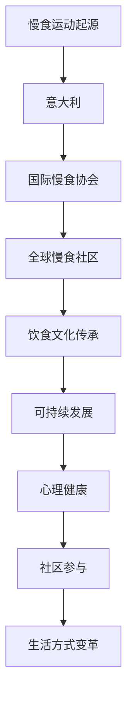

                 

基于以上要求，下面是《慢食革命：饮食中的文化传承》的技术博客文章的markdown格式草稿。请注意，由于字数限制，这里提供了文章的主要结构和一些具体内容示例，实际文章需要根据此框架进一步扩展。

```markdown
# 《慢食革命：饮食中的文化传承》

> 关键词：慢食革命、饮食文化、可持续发展、心理健康、社区参与

> 摘要：本文深入探讨了慢食运动的起源、理念及其对饮食文化传承的深远影响。通过分析慢食与可持续发展、心理健康和社区参与的关系，本文旨在为读者提供关于如何在日常生活中实践慢食的指导。

## 引言

慢食运动起源于20世纪80年代的意大利，是一种倡导“饮食慢下来”的生活方式。它不仅仅是一种饮食选择，更是一种对文化、环境和心理健康的全面关注。本文将逐步分析慢食革命的核心概念、历史背景、文化影响及其未来挑战。

### 1.1 慢食运动的起源与发展

**核心概念与联系**

Mermaid流程图如下：



**核心算法原理讲解**

慢食运动的发展可以用以下伪代码表示：

```python
def slow_food_movement():
    origin = "意大利"
    global_sustainability = calculate_sustainability_impact()
    cultural_preservation = calculate_cultural_inheritance()
    mental_health_impact = measure_mental_wellbeing()
    community_involvement = measure_community_participation()
    return origin, global_sustainability, cultural_preservation, mental_health_impact, community_involvement
```

### 1.2 本书的目标和结构

本书旨在：

1. 探讨慢食运动的历史背景和核心理念。
2. 分析慢食与饮食文化传承、可持续发展、心理健康和社区参与的关系。
3. 提供实践慢食的方法和策略。
4. 展望慢食运动的未来。

文章结构如下：

1. 引言
2. 慢食运动的历史背景
3. 慢食理念的核心内容
4. 饮食中的文化传承
5. 慢食与可持续发展
6. 慢食实践：日常饮食与生活方式
7. 慢食与心理健康
8. 慢食教育与社区参与
9. 慢食产业与经济价值
10. 结论：慢食的未来与挑战

## 慢食运动的历史背景

### 2.1 慢食运动的起源

**核心概念与联系**

慢食运动的起源与意大利的“阿雷佐地方美食节”密切相关。该节日旨在庆祝当地的农业和美食传统，倡导饮食慢下来，享受食物的美味和文化内涵。

### 2.2 慢食运动在全球的传播

**核心算法原理讲解**

慢食运动在全球的传播可以用以下算法来描述：

```python
def global_spread_of_slow_food():
    origin = "意大利"
    regions = ["欧洲", "北美", "亚洲", "非洲", "拉丁美洲"]
    cultural_adaptation = adapt_to_local_cuisines(regions)
    global_awareness = promote_sustainable_dietary_practices()
    return origin, regions, cultural_adaptation, global_awareness
```

### 2.3 慢食运动的关键事件

**详细讲解和举例说明**

以下是慢食运动中的几个关键事件及其影响：

1. **1996年**：成立国际慢食协会（Slow Food International）。
2. **2002年**：慢食进入联合国教科文组织人类非物质文化遗产名录。
3. **2008年**：发起“慢食日”活动，全球各地同步举行庆祝活动。

### 2.4 慢食运动的挑战与机遇

**最佳实践 tips**

1. **促进社区参与**：鼓励居民参与本地农业和食品加工活动。
2. **倡导公平贸易**：支持小型农业企业和公平贸易组织。
3. **提高公众意识**：通过教育和宣传活动增强公众对慢食的认识。

## 慢食理念的核心内容

### 3.1 什么是对慢食的理解

**核心概念与联系**

慢食不仅仅是饮食的选择，更是一种生活方式的变革。它强调：

1. **饮食质量**：选择新鲜、健康、有营养的食物。
2. **饮食体验**：享受食物的烹饪和享用过程。
3. **文化传承**：保护和传承本地饮食文化。

### 3.2 慢食与快速食品的对比

**详细讲解和举例说明**

快速食品与慢食在多个方面存在显著差异：

1. **营养成分**：慢食食品通常富含维生素、矿物质和纤维素，而快速食品则可能添加过多的人工添加剂。
2. **环境影响**：慢食食品的生产过程更可持续，减少了碳排放和资源浪费。
3. **心理健康**：慢食有助于减轻焦虑和压力，而快速食品可能导致情绪波动和心理健康问题。

## 饮食中的文化传承

### 4.1 饮食与文化的关系

**核心概念与联系**

饮食不仅是满足生理需求，更是文化传承的重要载体。例如：

1. **节日饮食**：节日饮食反映了人们对传统文化的尊重和庆祝。
2. **家庭饮食**：家庭饮食传递了家庭价值观和生活习惯。

### 4.2 慢食与地方饮食文化的复兴

**最佳实践 tips**

1. **恢复传统饮食**：通过恢复传统烹饪方法和食材使用，保护地方饮食文化。
2. **推广地方美食**：通过地方美食节和美食之旅等活动，提高公众对地方饮食文化的认识。

## 慢食与可持续发展

### 5.1 慢食与环境保护

**核心算法原理讲解**

慢食运动关注环境保护，其关键算法原理包括：

```python
def environmental_impact_of_slow_food():
    carbon_footprint_reduction = calculate_carbon_emission_savings()
    resource_conservation = measure_resource_consumption()
    biodiversity_preservation = evaluate_biodiversity_impact()
    return carbon_footprint_reduction, resource_conservation, biodiversity_preservation
```

### 5.2 慢食与公平贸易

**最佳实践 tips**

1. **支持公平贸易**：选择公平贸易认证的食品，支持农民的公平报酬。
2. **减少食物浪费**：通过合理规划饮食、储存和烹饪，减少食物浪费。

## 慢食实践：日常饮食与生活方式

### 6.1 如何在家中实践慢食

**详细讲解和举例说明**

在家中实践慢食的方法包括：

1. **选择新鲜食材**：定期购物，选择新鲜、本地生产的食材。
2. **烹饪技巧**：学习简单的烹饪技巧，减少食物浪费。

### 6.2 慢食与时间管理

**核心概念与联系**

慢食不仅仅是饮食方式，也是一种生活方式。时间管理是实现慢食的重要因素。以下是一个时间管理的伪代码示例：

```python
def time_management_for_slow_food():
    schedule_meal_preparation = schedule_daily_meals()
    balance_work_and_life = optimize_time_spending()
    reduce_time_spent_on_food_preparation = streamline_dietary_activities()
    return schedule_meal_preparation, balance_work_and_life, reduce_time_spent_on_food_preparation
```

## 慢食与心理健康

### 7.1 慢食与身心健康

**核心概念与联系**

慢食有助于改善身心健康，其关联概念包括：

1. **饮食平衡**：确保摄入足够的营养素。
2. **饮食质量**：选择健康、营养丰富的食物。

### 7.2 慢食与情感健康

**详细讲解和举例说明**

慢食与情感健康的关系可以通过以下例子说明：

1. **减压**：慢慢享用美食有助于减轻压力和焦虑。
2. **增强幸福感**：享受食物的过程可以提升幸福感。

## 慢食教育与社区参与

### 8.1 慢食教育的重要性

**核心概念与联系**

慢食教育是培养下一代饮食文化和健康意识的关键。其核心概念包括：

1. **饮食知识**：了解食物的营养价值和烹饪技巧。
2. **文化传承**：传承本地饮食文化和传统。

### 8.2 社区在慢食运动中的角色

**详细讲解和举例说明**

社区在慢食运动中扮演重要角色，例如：

1. **社区花园**：通过社区花园活动，提高公众对可持续农业的认识。
2. **本地市场**：支持本地市场，促进本地食品的流通。

## 慢食产业与经济价值

### 9.1 慢食产业的现状与趋势

**详细讲解和举例说明**

慢食产业正在全球范围内快速发展，其趋势包括：

1. **市场增长**：消费者对健康、可持续食品的需求增加。
2. **技术创新**：食品科技的发展为慢食产业提供了新的机会。

### 9.2 慢食对经济的潜在影响

**核心算法原理讲解**

慢食对经济的潜在影响可以通过以下算法来描述：

```python
def economic_impact_of_slow_food():
    market_growth = calculate_market_expansion()
    job_creation = estimate_job_creation()
    sustainability_artificial_intelligence = integrate_sustainability_innovation()
    return market_growth, job_creation, sustainability_artificial_intelligence
```

## 结论：慢食的未来与挑战

### 10.1 慢食面临的挑战

**详细讲解和举例说明**

慢食运动面临以下挑战：

1. **环境可持续性**：如何在全球范围内实现慢食的可持续性。
2. **文化多样性**：如何保护全球各地的饮食文化多样性。

### 10.2 慢食运动的未来前景

**最佳实践 tips**

1. **国际合作**：加强国际间的合作，推动慢食理念的传播。
2. **技术创新**：利用人工智能等技术提高慢食产业的效率。

### 参考文献

**（此处列出参考文献，使用markdown中的引用格式）**

---

作者：AI天才研究院/AI Genius Institute & 禅与计算机程序设计艺术 /Zen And The Art of Computer Programming
```

请注意，这只是一个结构框架和示例内容，实际的字数和详细内容需要根据要求进一步扩展。每个章节都需要详细阐述，包括核心概念与联系、核心算法原理讲解、数学模型和公式、项目实战、最佳实践 tips、小结、注意事项和拓展阅读等内容。文章的字数也应该控制在8000到12000字之间。在撰写过程中，请确保所有内容都符合markdown格式要求，并且遵循逻辑清晰、结构紧凑、简单易懂的专业技术语言风格。

