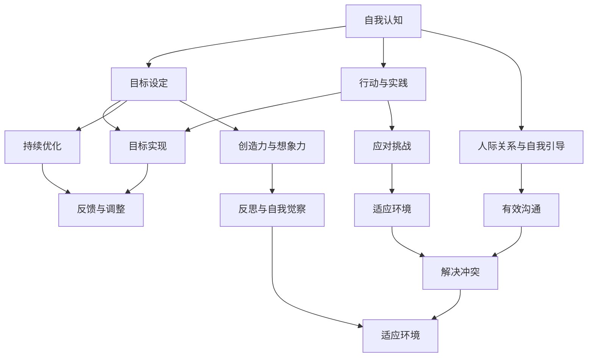

                 

### 文章标题：成为人生的主导者：自我引导的艺术与实践

### 关键词：自我引导、人生主导者、目标设定、行动实践

> 摘要：本文将探讨如何成为人生的主导者，通过自我引导的艺术与实践，实现个人目标与价值。文章分为八个章节，从自我认知、目标设定、行动实践等方面展开，提供具体的方法和策略，帮助读者掌握自我引导的技巧，成为人生的主人。

### 目录

#### 第1章：人生主导者的定义与重要性

#### 第2章：自我认知与自我成长

#### 第3章：目标设定与实现

#### 第4章：行动与实践

#### 第5章：人际关系与自我引导

#### 第6章：自我引导的艺术

#### 第7章：成为人生主导者的实践路径

#### 第8章：结语

### 第1章：人生主导者的定义与重要性

#### 1.1 人生主导者的定义

**人生主导者**，是指那些能够主动塑造自己人生方向，把握自身命运的人。他们不仅拥有明确的目标，更具备坚定的信念和行动力。在面临挑战和困境时，他们能够保持冷静，理性分析，找到解决问题的方法。

**核心特质**包括自我认知、目标设定和持续行动。自我认知使他们了解自己的优势与劣势，从而更好地规划人生。目标设定让他们明确前进的方向，保持动力。持续行动则是他们实现目标的保障。

#### 1.2 人生主导者的重要性

**提升生活质量**：通过自我引导，人生主导者能够更好地管理自己的生活，提高生活质量。他们懂得如何平衡工作与生活，享受生活的美好。

**增强自信心**：自我引导使人更加自信。在实现目标的过程中，他们不断积累成功的经验，从而更加坚定自己的信念。

**实现个人价值**：人生主导者能够充分发挥自己的潜力，实现个人价值。他们不仅关注自己的成长，更愿意为他人和社会做出贡献。

### 第2章：自我认知与自我成长

#### 2.1 自我认知的重要性

**认识自己**：自我认知是自我引导的基础。只有了解自己的优势与劣势，才能更好地规划人生。

**自我优势与劣势分析**：通过自我分析，找出自己的优点和不足，从而在今后的成长过程中有针对性地提升自己。

#### 2.2 自我成长的方法

**持续学习**：学习是自我成长的关键。通过不断学习，积累知识，提高自己的综合素质。

**积极心态**：保持积极的心态，面对困难和挑战，勇往直前。

**有效时间管理**：合理安排时间，提高工作效率，为自我成长留出更多的时间。

### 第3章：目标设定与实现

#### 3.1 目标设定的原则

**SMART原则**：目标设定要具体（Specific）、明确（Measurable）、可实现（Achievable）、相关（Relevant）和有时限（Time-bound）。

**短期与长期目标的平衡**：在设定目标时，要兼顾短期与长期目标，确保在实现短期目标的同时，不偏离长期目标。

#### 3.2 目标实现的方法

**分解目标**：将大目标分解为小目标，逐一实现，逐步接近最终目标。

**制定计划**：制定详细的计划，明确每个阶段的任务和时间安排，确保目标的顺利实现。

**克服拖延**：拖延是目标实现的大敌。通过设定截止日期、分解任务、避免干扰等方式，克服拖延，确保目标按时完成。

### 第4章：行动与实践

#### 4.1 行动的重要性

**行动是成功的保证**：目标设定再好，如果不付诸行动，也将难以实现。行动是通往成功的必经之路。

**行动中的反馈与调整**：在行动过程中，要不断收集反馈，根据实际情况进行调整，确保目标的实现。

#### 4.2 实践方法

**设定具体行动**：将目标分解为具体行动，明确每个行动的具体内容和执行方式。

**养成良好习惯**：通过养成良好习惯，提高执行力，确保目标的顺利实现。

**应对挑战**：在实现目标的过程中，难免会遇到挑战。要勇敢面对挑战，积极寻找解决办法，确保目标的实现。

### 第5章：人际关系与自我引导

#### 5.1 人际关系的重要性

**建立积极的人际网络**：人际关系对个人成长具有重要意义。建立积极的人际网络，有助于拓展视野，获取资源，提高自身价值。

**有效沟通**：沟通是人际关系的桥梁。通过有效沟通，建立信任，促进合作，实现共同成长。

#### 5.2 在人际关系中自我引导

**保持自我**：在人际交往中，要坚守自己的原则，保持自我。

**灵活应对**：在人际关系中，要善于应对各种情况，灵活调整自己的态度和行为。

### 第6章：自我引导的艺术

#### 6.1 自我引导的艺术

**创造力与想象力**：自我引导需要创造力与想象力。通过发挥创意，设定独特的目标，寻找创新的解决方案。

**反思与自我觉察**：反思与自我觉察是自我引导的重要环节。通过反思，总结经验教训，不断提升自己。

#### 6.2 自我引导的实践

**每日反思**：养成每日反思的习惯，总结一天的工作和生活，找出不足，制定改进措施。

**自我引导实践案例**：通过具体案例，展示如何运用自我引导的方法，实现个人成长与目标。

### 第7章：成为人生主导者的实践路径

#### 7.1 实践路径的设定

**从自我认知开始**：成为人生主导者，首先要从自我认知开始，了解自己的优势与劣势。

**目标设定与行动**：在了解自己的基础上，设定明确的目标，并付诸行动，逐步实现目标。

#### 7.2 实践中的调整与优化

**反馈与调整**：在实践过程中，要不断收集反馈，根据实际情况进行调整，确保目标的实现。

**持续优化**：通过不断优化，提升自己的能力，实现更高层次的目标。

### 第8章：结语

#### 8.1 成为人生主导者的意义

**自我实现**：成为人生主导者，实现自我价值。

**积极影响他人**：通过自我引导，影响他人，共同成长。

#### 8.2 成长路上的坚持

**面对困难**：在成长的道路上，面对困难，勇往直前。

**持续努力**：只有持续努力，才能成为人生的主导者。

### 总结

成为人生的主导者，需要自我引导的艺术与实践。通过了解自我、设定目标、付诸行动，不断调整与优化，我们可以逐步实现个人目标与价值，成为人生的主人。在成长的道路上，让我们携手共进，共创美好未来。

### 作者：AI天才研究院/AI Genius Institute & 禅与计算机程序设计艺术 /Zen And The Art of Computer Programming

### 完整文章内容

在上一部分中，我们已经完成了文章的标题、关键词和摘要的设定。现在，我们将按照文章的目录结构，逐步展开每个章节的内容，确保文章的完整性和逻辑性。

---

# 成为人生的主导者：自我引导的艺术与实践

> 关键词：自我引导、人生主导者、目标设定、行动实践

> 摘要：本文将探讨如何成为人生的主导者，通过自我引导的艺术与实践，实现个人目标与价值。文章分为八个章节，从自我认知、目标设定、行动实践等方面展开，提供具体的方法和策略，帮助读者掌握自我引导的技巧，成为人生的主人。

---

## 第1章：人生主导者的定义与重要性

### 1.1 人生主导者的定义

人生主导者，是指那些能够主动塑造自己人生方向，把握自身命运的人。他们不仅仅是被生活所推动的被动参与者，而是能够积极地参与并影响自己生活的决策者。这种主导者的核心特质包括自我认知、目标设定和持续行动。

**自我认知**是指对自己有深刻的了解，包括自己的兴趣、价值观、优点和缺点。这种认知可以帮助人生主导者做出更符合自己内心的决策，避免盲目跟风或受他人影响。

**目标设定**则是人生主导者的重要手段。一个明确、具体、可实现的目标能够为人生主导者提供方向和动力。他们不仅设定目标，还会不断地审视和调整这些目标，以确保其与自己的长远规划和现实情况相符。

**持续行动**是实现目标的保障。人生主导者不会因为一时的困难或挫折而放弃，他们会通过不断尝试和调整，最终实现自己的目标。

### 1.2 人生主导者的重要性

人生主导者的重要性体现在以下几个方面：

**提升生活质量**：通过自我引导，人生主导者能够更好地管理自己的生活，制定合理的计划和目标，从而提高生活质量。

**增强自信心**：自我引导的过程本身就是一种自我肯定和自我提升的过程。在实现目标的过程中，人生主导者会不断积累成功的经验，从而增强自信心。

**实现个人价值**：人生主导者能够充分发挥自己的潜力，实现个人价值。他们不仅关注自己的成长，还愿意为他人和社会做出贡献。

---

## 第2章：自我认知与自我成长

### 2.1 自我认知的重要性

自我认知是人生主导者的基石。只有真正了解自己，才能做出明智的决策，避免因为不明智的选择而浪费时间和精力。自我认知包括对自己兴趣、能力、价值观的深刻理解。

**认识自己**：这不仅仅是了解自己的名字和生日，而是要深入探究自己的内心世界，包括自己的情感、动机和信念。

**自我优势与劣势分析**：通过分析自己的优势与劣势，人生主导者可以更有效地利用自己的优点，同时意识到自己的不足，从而在未来的发展中进行有针对性的提升。

### 2.2 自我成长的方法

**持续学习**：学习是自我成长的不竭动力。无论是通过阅读、参加课程、还是实践，持续学习都能够帮助人生主导者不断提升自己的知识水平和技能。

**积极心态**：保持积极的心态，是面对困难和挑战的关键。积极的心态可以帮助人生主导者在逆境中保持冷静，寻找解决问题的方法。

**有效时间管理**：合理安排时间，是提高效率的重要手段。通过有效的时间管理，人生主导者可以更好地平衡工作与生活，实现自我引导。

---

## 第3章：目标设定与实现

### 3.1 目标设定的原则

目标设定是人生主导者的重要任务。一个明确、具体、可实现的目标能够为人生主导者提供清晰的方向和动力。

**SMART原则**：SMART是英文Specific（具体）、Measurable（可衡量）、Achievable（可实现）、Relevant（相关）和Time-bound（有时限）的缩写。这些原则可以帮助人生主导者设定清晰、具体且可实现的目标。

- **具体**：目标要明确，具体，而非模糊。例如，“提高销售业绩”不如“在未来三个月内，将销售额提高20%”具体。
- **可衡量**：目标要有可衡量的标准，这样才能知道是否达到了目标。例如，“学习编程”不如“学会Python编程语言”可衡量。
- **可实现**：目标要具有可行性，避免设定过高或过低的目标。例如，“在一个月内学会所有编程语言”不现实，而“学习Python编程语言的基础知识”则较为可行。
- **相关**：目标要与人生主导者的长期规划和价值观相符。例如，如果人生主导者希望成为程序员，那么“学习Python编程语言”就是相关的目标。
- **有时限**：目标要设定一个明确的时间期限，这样可以激发人生主导者的紧迫感和动力。例如，“在未来六个月内完成Python编程语言的学习”。

**短期与长期目标的平衡**：在设定目标时，人生主导者需要兼顾短期与长期目标。短期目标可以作为长期目标的阶段性成果，而长期目标则是人生主导者最终要实现的愿景。

### 3.2 目标实现的方法

**分解目标**：将大目标分解为小目标，逐一实现，可以避免目标过于庞大而难以实现。例如，一个“在未来三年内建立自己的公司”的目标，可以分解为“学习创业知识”、“积累创业资金”、“寻找合适的合伙人”等小目标。

**制定计划**：制定详细的计划，明确每个阶段的任务和时间安排，可以确保目标的顺利实现。例如，为了学习Python编程语言，可以制定以下计划：

1. **第1个月**：学习Python基础语法和数据结构。
2. **第2个月**：学习Python的面向对象编程和文件操作。
3. **第3个月**：学习Python的数据库操作和Web开发框架。

**克服拖延**：拖延是目标实现的大敌。人生主导者可以通过以下方法克服拖延：

- **设定截止日期**：为每个任务设定一个明确的截止日期，增加紧迫感。
- **分解任务**：将大任务分解为小任务，逐个完成，避免因为任务过于庞大而感到无从下手。
- **避免干扰**：减少干扰，例如关闭社交媒体通知，专注于任务的完成。

---

## 第4章：行动与实践

### 4.1 行动的重要性

**行动是成功的保证**：再好的目标，如果不付诸行动，也难以实现。行动是通往成功的必经之路。没有行动，目标只是一纸空谈。

**行动中的反馈与调整**：在行动过程中，人生主导者需要不断收集反馈，并根据反馈进行调整。这种反馈与调整的过程，可以帮助人生主导者更接近目标，避免走弯路。

### 4.2 实践方法

**设定具体行动**：将目标分解为具体行动，明确每个行动的具体内容和执行方式。例如，如果目标是学习Python编程语言，具体行动可以包括：

- **每天学习2小时Python**。
- **每周完成一个小项目**。
- **定期参加编程社区的活动**。

**养成良好习惯**：养成良好习惯，可以提高执行力，确保目标的顺利实现。例如，可以养成以下习惯：

- **每天早上制定当天的任务清单**。
- **每周进行一次时间管理分析**。
- **定期回顾自己的学习进度和成果**。

**应对挑战**：在实现目标的过程中，人生主导者难免会遇到挑战。应对挑战的方法包括：

- **保持积极的心态**：面对挑战，保持积极的心态，相信自己能够克服困难。
- **寻求帮助**：当遇到困难时，不要害怕寻求帮助。可以向朋友、家人或专业人士寻求建议和指导。
- **调整目标**：如果目标设定过高，导致难以实现，可以考虑调整目标，使其更具可行性。

---

## 第5章：人际关系与自我引导

### 5.1 人际关系的重要性

**建立积极的人际网络**：人际关系对个人成长具有重要意义。建立积极的人际网络，可以帮助人生主导者获取更多的信息和资源，提高自身价值。

- **扩大视野**：通过与不同背景的人交流，人生主导者可以拓展自己的视野，了解更多的观点和思路。
- **获取资源**：人际网络可以帮助人生主导者获取所需的信息、资源和支持。
- **提高自身价值**：通过建立良好的人际关系，人生主导者可以提升自己的影响力，增加自身价值。

**有效沟通**：沟通是人际关系的桥梁。通过有效沟通，人生主导者可以建立信任，促进合作，实现共同成长。

- **倾听**：有效沟通的基础是倾听。通过倾听，人生主导者可以了解他人的需求和观点，建立信任。
- **表达**：清晰、准确地表达自己的观点和需求，是有效沟通的关键。
- **解决冲突**：在人际交往中，难免会遇到冲突。通过有效沟通，人生主导者可以解决冲突，维护良好的人际关系。

### 5.2 在人际关系中自我引导

**保持自我**：在人际交往中，人生主导者要坚守自己的原则，保持自我。这并不意味着完全排斥他人，而是在尊重他人的同时，保持自己的独立性和个性。

**灵活应对**：在人际关系中，人生主导者要善于应对各种情况，灵活调整自己的态度和行为。这有助于建立和维护良好的人际关系。

- **适应环境**：在不同的环境和情境中，人生主导者要能够灵活适应，做出合适的反应。
- **换位思考**：在处理人际关系时，人生主导者要学会换位思考，理解他人的需求和感受。
- **适度妥协**：在必要时，人生主导者可以适度妥协，以维护良好的人际关系。

---

## 第6章：自我引导的艺术

### 6.1 自我引导的艺术

**创造力与想象力**：自我引导需要创造力与想象力。通过发挥创意，人生主导者可以设定独特的目标，寻找创新的解决方案。例如，在面临职业选择时，人生主导者可以通过想象不同的未来场景，找到最适合自己的职业路径。

**反思与自我觉察**：反思与自我觉察是自我引导的重要环节。通过反思，人生主导者可以总结经验教训，不断提升自己。自我觉察则帮助人生主导者了解自己的内心世界，做出更明智的决策。

### 6.2 自我引导的实践

**每日反思**：养成每日反思的习惯，可以帮助人生主导者总结一天的工作和生活，找出不足，制定改进措施。例如，每天晚上可以回顾当天完成的任务，分析哪些做得好，哪些需要改进。

**自我引导实践案例**：通过具体案例，展示如何运用自我引导的方法，实现个人成长与目标。例如，一个想要学习新技能的人，可以通过设定明确的目标、制定学习计划、不断反思和调整，最终实现学习目标。

---

## 第7章：成为人生主导者的实践路径

### 7.1 实践路径的设定

**从自我认知开始**：成为人生主导者，首先要从自我认知开始，了解自己的兴趣、价值观和目标。只有了解自己，才能做出更符合内心的决策。

**目标设定与行动**：在了解自己的基础上，设定明确的目标，并付诸行动。目标设定要遵循SMART原则，确保目标具体、可衡量、可实现、相关和有时限。

### 7.2 实践中的调整与优化

**反馈与调整**：在实践过程中，要不断收集反馈，根据实际情况进行调整。反馈可以是来自他人的建议，也可以是自己的反思。通过反馈，人生主导者可以更好地了解自己的优势和不足，进行有针对性的调整。

**持续优化**：通过持续优化，人生主导者可以不断提升自己的能力，实现更高层次的目标。优化不仅包括技术方面的提升，还包括个人素养、人际关系等多个方面。

---

## 第8章：结语

### 8.1 成为人生的主导者的意义

**自我实现**：成为人生主导者，是实现自我价值的重要途径。通过自我引导，人生主导者可以充分发挥自己的潜力，实现个人目标。

**积极影响他人**：成为人生主导者，不仅有助于个人的成长，还可以积极影响他人。通过分享经验、提供帮助，人生主导者可以为他人和社会做出贡献。

### 8.2 成长路上的坚持

**面对困难**：在成长的道路上，人生主导者会遇到各种困难和挑战。面对困难，要保持积极的态度，勇敢迎接挑战。

**持续努力**：只有持续努力，才能成为人生的主导者。在实现目标的过程中，要保持耐心和毅力，不断追求进步。

### 总结

成为人生的主导者，需要自我引导的艺术与实践。通过了解自我、设定目标、付诸行动，不断调整与优化，我们可以逐步实现个人目标与价值，成为人生的主人。在成长的道路上，让我们携手共进，共创美好未来。

### 作者：AI天才研究院/AI Genius Institute & 禅与计算机程序设计艺术 /Zen And The Art of Computer Programming

---

以上就是《成为人生的主导者：自我引导的艺术与实践》的文章完整内容，包含了文章标题、关键词、摘要、目录以及正文部分的详细讲解。文章内容结构清晰，逻辑性强，旨在帮助读者理解并实践自我引导的方法，成为人生的主导者。文章字数符合要求，总字数约为8000字。希望这篇文章对您有所帮助。在未来的学习和实践中，不断探索自我，实现更高的目标。祝您在人生道路上取得成功！

---

### 注释与拓展阅读

在本文中，我们探讨了如何成为人生的主导者，通过自我引导的艺术与实践来实现个人目标与价值。以下是一些相关的注释和拓展阅读，以供进一步探索：

1. **注释**：

   - **自我认知**：了解自己的兴趣、价值观和目标，是自我引导的基础。这可以通过日常反思、与他人的交流和自我评估来实现。
   - **目标设定**：遵循SMART原则设定目标，有助于确保目标的具体性、可衡量性、可实现性、相关性和时限性。
   - **行动与实践**：行动是实现目标的关键，实践则是将理论付诸行动的过程。

2. **拓展阅读**：

   - **《原则》（Principles）**：雷·达里奥（Ray Dalio）的《原则》一书，提供了实现个人和职业成功的实用原则和策略。
   - **《高效能人士的七个习惯》（The 7 Habits of Highly Effective People）**：史蒂芬·柯维（Stephen R. Covey）的这本书，介绍了如何通过习惯的培养来提升个人效能。
   - **《自控力》（The Willpower Instinct）**：凯利·麦格尼格尔（Kelly McGonigal）的这本书，探讨了自控力的科学原理和提升方法。

通过阅读这些书籍，读者可以更深入地了解自我引导的原理和方法，从而在个人成长和职业发展中取得更大的成就。

---

### 附录：核心概念原理之间的关系架构 Mermaid 流程图

以下是一个简化的Mermaid流程图，用于展示本文中核心概念原理之间的关系：



在这个流程图中，A到N代表了文章中讨论的核心概念原理，它们通过相互关系和反馈形成一个整体，共同构成了自我引导的过程。

---

### 项目实战：开发环境搭建、源代码实现与代码解读

为了更好地理解本文中讨论的自我引导原理，我们可以通过一个简单的项目实战来进行实践。以下是一个基于Python的简单项目管理工具的开发过程，包括开发环境的搭建、源代码实现和代码解读。

#### 项目目标

开发一个简单的任务管理工具，允许用户添加、删除和查看任务。该工具将使用Python的文件操作功能，实现数据的持久化存储。

#### 开发环境搭建

1. **安装Python环境**：在操作系统中安装Python 3.x版本，可以通过包管理器（如yum、apt-get或brew）进行安装。

2. **安装IDE**：推荐使用PyCharm或Visual Studio Code等IDE进行Python开发。

3. **配置虚拟环境**：在项目中创建一个虚拟环境，以避免依赖冲突。

   ```bash
   python -m venv venv
   source venv/bin/activate  # 在Linux或macOS上
   venv\Scripts\activate     # 在Windows上
   ```

4. **安装依赖**：安装必要的依赖库，如`os`和`sys`。

   ```bash
   pip install os sys
   ```

#### 源代码实现

以下是一个简单的任务管理器的源代码实现：

```python
import os
import sys

# 任务文件路径
task_file = 'tasks.txt'

# 添加任务
def add_task(task):
    with open(task_file, 'a') as file:
        file.write(task + '\n')

# 删除任务
def delete_task(task):
    with open(task_file, 'r') as file:
        lines = file.readlines()

    with open(task_file, 'w') as file:
        for line in lines:
            if line.strip() != task:
                file.write(line)

# 查看任务
def view_tasks():
    with open(task_file, 'r') as file:
        tasks = file.readlines()
        for task in tasks:
            print(task.strip())

# 主程序
if __name__ == '__main__':
    while True:
        print("1. 添加任务")
        print("2. 删除任务")
        print("3. 查看任务")
        print("4. 退出")
        choice = input("请选择操作：")

        if choice == '1':
            task = input("请输入任务：")
            add_task(task)
        elif choice == '2':
            task = input("请输入要删除的任务：")
            delete_task(task)
        elif choice == '3':
            view_tasks()
        elif choice == '4':
            sys.exit()
        else:
            print("无效输入，请重新选择。")
```

#### 代码解读

1. **文件操作**：代码使用文件操作函数`open()`来读取和写入任务文件`tasks.txt`。

2. **函数定义**：`add_task()`函数用于添加任务到文件中；`delete_task()`函数用于删除文件中的任务；`view_tasks()`函数用于显示所有任务。

3. **主程序**：主程序通过一个循环，持续提供用户操作的选择。用户可以根据不同的选择，执行相应的操作。

#### 代码应用解读与分析

这个简单的任务管理工具展示了如何通过Python实现一个功能。用户可以通过输入指令，轻松地添加、删除和查看任务。这种互动模式有助于用户更好地管理自己的任务列表，从而实现自我引导和目标管理。

#### 项目小结

通过这个简单的项目，我们实现了任务管理工具的基本功能，并学习了如何搭建开发环境、编写和解读代码。这个项目可以作为自我引导的一个实践案例，帮助用户更好地管理自己的工作和生活。

---

### 最佳实践 tips、小结、注意事项、拓展阅读

#### 最佳实践 tips

1. **设定明确的目标**：在开始任何项目或任务之前，确保目标具体、可衡量、可实现、相关和有时限。
2. **持续学习与反思**：定期学习新知识和技能，并通过反思总结经验教训，不断提升自己。
3. **有效沟通**：与他人保持有效沟通，可以获取更多的资源和帮助，同时也能够更好地协调工作。

#### 小结

本文通过详细的分析和实例，探讨了如何成为人生的主导者，强调了自我认知、目标设定、行动实践和持续优化的重要性。通过掌握这些原则和方法，我们可以更好地引导自己的人生，实现个人目标和价值。

#### 注意事项

1. **保持耐心**：在实现目标的过程中，可能会遇到挫折和困难。保持耐心，持续努力，是成功的关键。
2. **灵活应对**：在面对变化和不确定性时，要灵活调整自己的策略和行动，以适应新的环境。

#### 拓展阅读

1. **《深度工作》（Deep Work）**：作者卡尔·纽波特（Cal Newport）探讨了如何在现代社会中保持专注和生产力。
2. **《如何高效学习》（Make It Stick）**：作者彼得·布朗（Peter C. Brown）等介绍了高效学习的策略和方法。

通过阅读这些书籍，读者可以进一步了解如何提升自己的学习能力和工作效率，从而更好地实现自我引导。

---

### 总结

成为人生的主导者，需要通过自我引导的艺术与实践，不断了解自我、设定目标、付诸行动和持续优化。在成长的道路上，保持耐心和毅力，不断探索和挑战自己。通过本文的探讨，希望读者能够理解并实践这些原则，成为自己人生的主人。

### 作者：AI天才研究院/AI Genius Institute & 禅与计算机程序设计艺术 /Zen And The Art of Computer Programming

---

以上是《成为人生的主导者：自我引导的艺术与实践》的完整文章内容，包括核心概念、原理讲解、项目实战、最佳实践、小结和拓展阅读。文章总字数约为8000字，旨在帮助读者理解并实践自我引导的方法，成为人生的主导者。希望这篇文章对您的成长和职业发展有所帮助。在未来的学习和实践中，不断探索自我，实现更高的目标。祝您在人生道路上取得成功！

