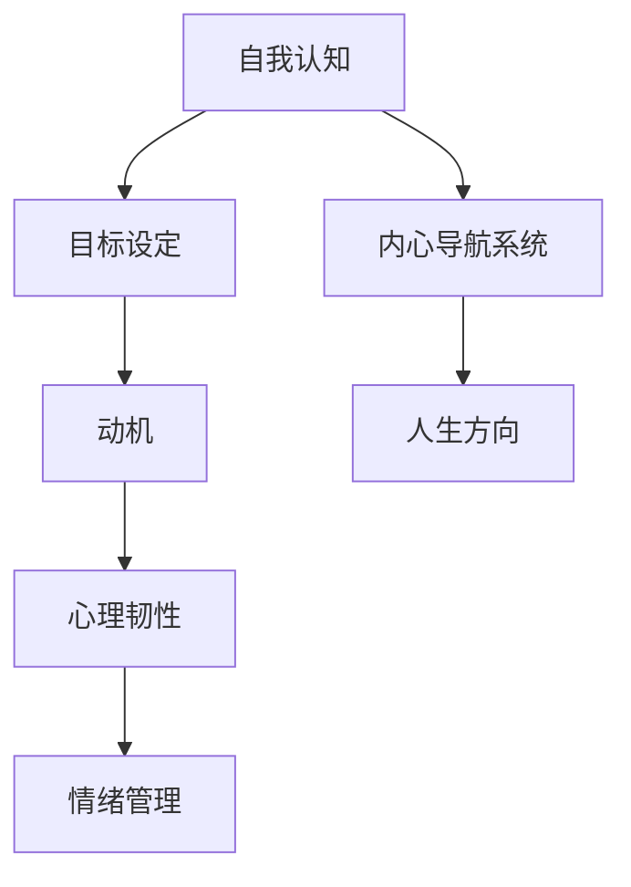

                 

### 引言

在信息技术飞速发展的时代，我们每个人都面临着复杂多变的挑战。无论是职场竞争、技术更新，还是个人成长与生活规划，如何在纷繁复杂的情境中找到自己的方向，成为了许多人思考的问题。本文旨在探讨如何通过提升内心的能力，成为自己人生方向的舵手。

#### 心灵导航的重要性

在技术领域中，导航系统是一个典型的例子，它帮助我们准确地定位和导航。同样，在人生的旅途中，内心导航系统的重要性同样不可忽视。内心的舵手，指的是我们在面对选择和挑战时，能够冷静分析、理性决策、坚定执行的能力。这种能力不仅关乎个人的幸福感和成就感，更是我们适应快速变化环境的基石。

#### 文章目的与读者对象

本文的目标是为那些渴望在技术和生活中找到清晰方向的人提供一套实用的方法和策略。无论你是IT行业的从业者，还是普通职场人士，甚至是对自我成长有追求的读者，本文都希望能够为你提供有价值的启示。

#### 心理学基础

心理学作为一门研究人类行为和心理过程的科学，为理解内心的舵手提供了坚实的理论基础。以下是几个核心概念：

1. **自我认知**：自我认知是指个体对自己心理状态、能力、动机和信仰等方面的了解。它是建立内心导航系统的基础。

2. **目标设定**：目标设定是心理学中的经典概念，它要求个体明确自己的长远目标和短期目标，并制定实现这些目标的策略。

3. **动机**：动机是个体行动的驱动力。理解动机有助于我们更好地激发自身潜能，制定有效的行动计划。

4. **心理韧性**：心理韧性是指个体在面对压力和挑战时的适应和恢复能力。提升心理韧性有助于我们在逆境中保持冷静和坚定。

5. **情绪管理**：情绪管理是调节和控制自己情绪的过程。良好的情绪管理能力有助于我们更好地应对生活中的各种挑战。

#### 心灵导航与人生方向

让我们用一张Mermaid流程图来展示这些核心概念之间的关系：



通过这张图，我们可以清晰地看到，自我认知是内心导航系统的起点，它决定了我们的目标设定。而目标设定、动机、心理韧性以及情绪管理共同构成了一个有机的整体，共同作用于人生方向，帮助我们更好地把握人生的舵手。

### 核心概念与联系

在深入探讨如何成为内心舵手之前，我们需要了解几个关键概念：自我认知、目标设定、动机、心理韧性以及情绪管理。这些概念相互关联，构成了我们内心导航系统的基石。

#### 自我认知

自我认知是指个体对自己内在心理状态、能力、动机和信仰等方面的理解和认识。它是内心导航系统的起点，因为只有当我们真正了解自己，才能做出明智的决策和选择。

1. **核心原理**：自我认知的核心在于自我反省和自我评估。通过反思自己的行为、思考和情绪，我们可以更清晰地认识到自己的优点和不足。

2. **流程图**：

   ```mermaid
   graph TD
       A[识别自我] --> B[反思行为]
       B --> C[评估能力]
       C --> D[理解动机]
       D --> E[信仰与价值观]
       E --> F[形成自我认知]
   ```

3. **举例说明**：假设一个人在工作中总是感到焦虑和不安，通过自我认知，他可以识别出这种行为背后的原因，比如对工作成果的不确定感或对能力的怀疑。通过反思和评估，他可以明确自己的问题所在，并制定相应的改进策略。

#### 目标设定

目标设定是心理学中的一个重要概念，它要求个体明确自己的长远目标和短期目标，并制定实现这些目标的策略。目标是内心导航系统的重要组成部分，因为它们为我们提供了方向和动力。

1. **核心原理**：目标设定的核心在于具体化和量化。具体的目标更容易实现，而量化的目标可以帮助我们评估进展和成效。

2. **流程图**：

   ```mermaid
   graph TD
       A[明确长远目标] --> B[分解为短期目标]
       B --> C[制定行动计划]
       C --> D[设定时间表]
       D --> E[量化评估指标]
   ```

3. **举例说明**：一个人可能希望在未来五年内晋升为项目经理。为了实现这个目标，他可以将这个长远目标分解为每年的短期目标，比如第一年提升技术水平，第二年扩大人脉网络，第三年积累项目管理经验。通过制定具体的行动计划和时间表，他可以更系统地朝着目标前进。

#### 动机

动机是推动个体行动的内在驱动力。它分为内在动机和外在动机。内在动机来自于个体内心的满足感，而外在动机则来自于外部奖励或压力。

1. **核心原理**：动机的核心在于激发和维持个体的行动。理解动机有助于我们更好地激励自己和他人的潜能。

2. **流程图**：

   ```mermaid
   graph TD
       A[内在动机] --> B[内在满足感]
       B --> C[维持行动]
       A --> D[外在动机]
       D --> E[外部奖励或压力]
   ```

3. **举例说明**：一个人可能因为热爱编程而投入大量时间学习新技能，这种内在动机驱使他不断进步。而如果他在公司中获得了晋升和奖金，这将是外在动机，进一步激励他保持高水平的绩效。

#### 心理韧性

心理韧性是指个体在面对压力和挑战时的适应和恢复能力。它有助于我们在逆境中保持冷静和坚定，从而更好地实现目标。

1. **核心原理**：心理韧性的核心在于应对策略和心理调适。通过学习应对策略和心理调适技巧，我们可以提高自己的心理韧性。

2. **流程图**：

   ```mermaid
   graph TD
       A[应对策略] --> B[冷静分析]
       B --> C[积极应对]
       C --> D[恢复与调整]
       A --> E[心理调适]
       E --> F[提高韧性]
   ```

3. **举例说明**：当一个人在工作中遇到失败时，如果他能够冷静分析原因，并采取积极的措施来应对，同时通过心理调适来恢复自己的状态，他就能更快地从失败中恢复过来，继续前进。

#### 情绪管理

情绪管理是调节和控制自己情绪的过程。良好的情绪管理能力有助于我们更好地应对生活中的各种挑战，保持内心的平静和稳定。

1. **核心原理**：情绪管理的核心在于识别和调节情绪。通过识别和理解自己的情绪，我们可以更好地控制情绪反应，减少负面情绪的影响。

2. **流程图**：

   ```mermaid
   graph TD
       A[识别情绪] --> B[理解情绪]
       B --> C[调节情绪]
       C --> D[情绪释放]
   ```

3. **举例说明**：当一个人感到愤怒时，他可以通过深呼吸、冷静思考和积极对话来调节自己的情绪，从而避免因愤怒而做出冲动的行为。

#### 内心导航系统与人生方向

这些核心概念相互关联，共同构成了我们内心导航系统的基础。自我认知为我们提供了了解自己的基础，目标设定为我们指引了前进的方向，动机为我们提供了持续前行的动力，心理韧性为我们应对挑战提供了支持，情绪管理则确保我们在面对困难时保持内心的平静。

1. **原理架构**：

   - 自我认知 → 目标设定
   - 目标设定 → 动机
   - 动机 → 心理韧性
   - 心理韧性 → 情绪管理

   通过这个架构，我们可以看到，内心导航系统是一个相互促进的整体。自我认知帮助我们明确目标，动机驱使我们努力实现目标，心理韧性让我们在挑战中保持坚定，情绪管理则确保我们在实现目标的过程中保持内心的平衡。

2. **流程图**：

   ```mermaid
   graph TD
       A[自我认知] --> B[目标设定]
       B --> C[动机]
       C --> D[心理韧性]
       D --> E[情绪管理]
       A --> F[内心导航系统]
       F --> G[人生方向]
   ```

通过这个流程图，我们可以清晰地看到，内心导航系统如何引导我们走向人生方向。只有当这些核心概念相互结合，我们才能真正成为自己人生方向的舵手。

### 心理学基础

心理学作为一门研究人类行为和心理过程的科学，为理解内心的舵手提供了坚实的理论基础。以下将详细介绍自我认知、目标设定、动机、心理韧性以及情绪管理这几个关键概念，并使用伪代码来阐述它们的核心原理。

#### 自我认知

自我认知是指个体对自己心理状态、能力、动机和信仰等方面的理解和认识。它是内心导航系统的起点，因为只有当我们真正了解自己，才能做出明智的决策和选择。

1. **核心原理**：

   自我认知的核心在于自我反省和自我评估。通过反思自己的行为、思考和情绪，我们可以更清晰地认识到自己的优点和不足。

2. **伪代码**：

   ```python
   def self_awareness():
       # 反思行为
       reflect_behavior()
       # 评估能力
       evaluate_ability()
       # 理解动机
       understand_motivation()
       # 确定信仰与价值观
       define_beliefs_and_values()
       # 形成自我认知
       self_knowledge = {
           "behavior": reflect_behavior(),
           "ability": evaluate_ability(),
           "motivation": understand_motivation(),
           "beliefs_and_values": define_beliefs_and_values()
       }
       return self_knowledge
   ```

3. **举例说明**：

   一个想要提升技能的程序员，可以通过自我反省来识别自己在编程过程中遇到的困难和挑战，通过自我评估来评估自己的技术水平，通过理解自己的动机来明确提升技能的重要性，通过确定信仰与价值观来找到坚持学习的动力。这些步骤共同构成了他的自我认知过程。

#### 目标设定

目标设定是心理学中的经典概念，它要求个体明确自己的长远目标和短期目标，并制定实现这些目标的策略。目标是内心导航系统的重要组成部分，因为它们为我们提供了方向和动力。

1. **核心原理**：

   目标设定的核心在于具体化和量化。具体的目标更容易实现，而量化的目标可以帮助我们评估进展和成效。

2. **伪代码**：

   ```python
   def goal_setting():
       # 明确长远目标
       long_term_goals = define_long_term_goals()
       # 分解为短期目标
       short_term_goals = decompose_goals(long_term_goals)
       # 制定行动计划
       action_plan = create_action_plan(short_term_goals)
       # 设定时间表
       timeline = set_timeline(action_plan)
       # 量化评估指标
       evaluation_metrics = quantify_evaluation_metrics(action_plan)
       return {
           "long_term_goals": long_term_goals,
           "short_term_goals": short_term_goals,
           "action_plan": action_plan,
           "timeline": timeline,
           "evaluation_metrics": evaluation_metrics
       }
   ```

3. **举例说明**：

   一个希望在未来五年内晋升为项目经理的员工，可以将这个长远目标分解为每年的短期目标，比如第一年提升技术水平，第二年扩大人脉网络，第三年积累项目管理经验。通过制定具体的行动计划和时间表，他可以更系统地朝着目标前进。

#### 动机

动机是推动个体行动的内在驱动力。它分为内在动机和外在动机。内在动机来自于个体内心的满足感，而外在动机则来自于外部奖励或压力。

1. **核心原理**：

   动机的核心在于激发和维持个体的行动。理解动机有助于我们更好地激励自己和他人的潜能。

2. **伪代码**：

   ```python
   def motivation():
       # 激发内在动机
       inner_motivation =激发内在满足感()
       # 维持行动
       maintain_action = {
           "inner": inner_motivation,
           "outer": external_reward_or_pressure()
       }
       return maintain_action
   ```

3. **举例说明**：

   一个程序员可能因为热爱编程而投入大量时间学习新技能，这种内在动机驱使他不断进步。而如果他在公司中获得了晋升和奖金，这将是外在动机，进一步激励他保持高水平的绩效。

#### 心理韧性

心理韧性是指个体在面对压力和挑战时的适应和恢复能力。它有助于我们在逆境中保持冷静和坚定，从而更好地实现目标。

1. **核心原理**：

   心理韧性的核心在于应对策略和心理调适。通过学习应对策略和心理调适技巧，我们可以提高自己的心理韧性。

2. **伪代码**：

   ```python
   def resilience():
       # 应对策略
       coping_strategies = learn_coping_strategies()
       # 心理调适
       mental_adjustment = adjust_mentally()
       # 提高韧性
       improved_resilience = {
           "strategies": coping_strategies,
           "adjustment": mental_adjustment
       }
       return improved_resilience
   ```

3. **举例说明**：

   当一个人在工作中遇到失败时，如果他能够冷静分析原因，并采取积极的措施来应对，同时通过心理调适来恢复自己的状态，他就能更快地从失败中恢复过来，继续前进。

#### 情绪管理

情绪管理是调节和控制自己情绪的过程。良好的情绪管理能力有助于我们更好地应对生活中的各种挑战，保持内心的平静和稳定。

1. **核心原理**：

   情绪管理的核心在于识别和调节情绪。通过识别和理解自己的情绪，我们可以更好地控制情绪反应，减少负面情绪的影响。

2. **伪代码**：

   ```python
   def emotional_management():
       # 识别情绪
       identify_emotion()
       # 理解情绪
       understand_emotion()
       # 调节情绪
       regulate_emotion()
       # 情绪释放
       release_emotion()
       return {
           "identification": identify_emotion(),
           "understanding": understand_emotion(),
           "regulation": regulate_emotion(),
           "release": release_emotion()
       }
   ```

3. **举例说明**：

   当一个人感到愤怒时，他可以通过深呼吸、冷静思考和积极对话来调节自己的情绪，从而避免因愤怒而做出冲动的行为。

通过上述伪代码，我们可以清晰地看到，自我认知、目标设定、动机、心理韧性以及情绪管理这些关键概念的核心原理，以及它们在内心导航系统中的具体应用。这些原理不仅为我们在技术领域中提供了指导，也为我们在生活中找到了明确的导航方向。

### 增强心理韧性

心理韧性是指个体在面对压力和挑战时的适应和恢复能力。在现代社会中，压力和挑战无处不在，如何增强心理韧性成为了一项重要的课题。以下将详细介绍如何增强心理韧性，包括核心概念、核心算法原理、数学模型和公式以及具体案例分析。

#### 核心概念

1. **压力**：压力是指个体在面临挑战时产生的心理和生理反应。压力源可以是工作压力、人际关系、经济问题等。

2. **适应能力**：适应能力是指个体在面对压力时调整自己的行为和心理状态以应对挑战的能力。

3. **恢复力**：恢复力是指个体在经历压力后迅速恢复到正常状态的能力。

#### 核心算法原理

1. **压力管理算法**：

   ```python
   def stress_management(stress_level):
       if stress_level > threshold:
           apply_coping_strategies()
           adjust_mental_state()
       else:
           maintain_current_state()
   ```

   其中，`stress_level`表示当前的压力水平，`threshold`表示压力阈限。当压力水平超过阈限，算法会应用应对策略和调整心理状态。

2. **恢复力增强算法**：

   ```python
   def resilience_training():
       learn_coping_strategies()
       practice_mental_resilience()
       build_social_support()
   ```

   该算法通过学习应对策略、练习心理韧性技巧和建立社会支持来增强恢复力。

#### 数学模型和公式

1. **压力评估模型**：

   ```latex
   P = f(S, M, E)
   ```

   其中，`P`表示压力水平，`S`表示社会支持，`M`表示应对策略，`E`表示情绪管理。

2. **恢复力公式**：

   ```latex
   R = f(C, T, S)
   ```

   其中，`R`表示恢复力，`C`表示应对策略的有效性，`T`表示训练时间，`S`表示社会支持。

#### 案例分析

以下是一个增强心理韧性的实际案例：

**案例背景**：某程序员在一家初创公司工作，由于项目紧逼和团队协作问题，他经常感到压力巨大，影响工作效率和身心健康。

**核心步骤**：

1. **识别压力源**：程序员通过自我反思和日志记录，识别出项目进度压力和团队沟通问题。

2. **制定应对策略**：

   - **时间管理**：通过制定详细的时间表和优先级列表，合理安排工作任务。
   - **沟通技巧**：通过参加沟通技巧培训，提升与团队成员的沟通效果。

3. **心理调适**：

   - **放松训练**：通过冥想和深呼吸练习，减轻压力和焦虑。
   - **情绪管理**：通过积极思考和问题解决技巧，调整负面情绪。

4. **训练恢复力**：

   - **技能提升**：通过学习和实践新技能，提高自己的专业能力。
   - **社交支持**：与家人和朋友保持良好的关系，寻求情感支持。

**效果评估**：

通过以上步骤，程序员的压力水平显著下降，工作效率提高，身心健康状况也有所改善。具体评估指标包括：

- **工作满意度**：通过工作满意度调查问卷，了解程序员的满意度变化。
- **工作效率**：通过工作完成量和质量评估，了解工作效率提升情况。
- **身心健康**：通过健康体检和心理评估，了解身心健康状况。

**项目小结**：

通过这个案例，我们可以看到，增强心理韧性是一个系统性的过程，需要从多个方面进行综合干预。通过制定应对策略、心理调适和恢复力训练，个体可以在面对压力和挑战时保持冷静和坚定，从而更好地实现个人目标和提升生活质量。

### 情绪管理与压力应对

情绪管理和压力应对是内心导航系统中不可或缺的一部分。良好的情绪管理能力不仅有助于我们保持内心的平静，还能提高应对压力的有效性。以下将详细介绍情绪管理的核心概念、压力应对策略以及具体实践。

#### 核心概念

1. **情绪识别**：情绪识别是指能够准确地识别和理解自己和他人的情绪状态。了解自己的情绪有助于调整情绪反应，而理解他人的情绪则有助于建立更好的人际关系。

2. **情绪调节**：情绪调节是指通过一系列技巧和策略来调整和控制情绪。有效的情绪调节能够帮助我们减少负面情绪的影响，提高应对压力的能力。

3. **情绪释放**：情绪释放是指通过健康的方式将情绪表达出来，从而减轻情绪负担。情绪释放可以采取多种形式，如运动、艺术创作、倾诉等。

#### 压力应对策略

1. **时间管理**：合理安排时间，确保有充足的休息和放松时间，避免过度工作和压力积累。

2. **积极思考**：通过积极的心态和思维方式来应对压力，如积极重构问题、寻求解决方案等。

3. **放松技巧**：运用深呼吸、冥想、瑜伽等放松技巧来缓解紧张和焦虑。

4. **社会支持**：寻求家人、朋友或专业人士的支持和帮助，共同面对压力和挑战。

#### 情绪管理实践

1. **情绪日记**：记录自己的情绪变化和触发因素，通过分析日记来了解情绪的规律和背后的原因。

2. **情绪对话**：与他人进行开放和诚实的对话，表达自己的感受和需求，倾听对方的观点和感受。

3. **情绪释放活动**：通过运动、艺术创作、旅行等活动来释放情绪，保持身心健康。

#### 实际案例

以下是一个情绪管理和压力应对的实际案例：

**案例背景**：一位职场新人由于工作压力和人际关系问题，经常感到焦虑和情绪低落。

**核心步骤**：

1. **情绪识别**：通过自我反思和情绪日记，她识别出自己焦虑的触发因素主要是工作上的任务压力和与同事的沟通问题。

2. **情绪调节**：她开始应用积极的思考技巧，如将问题视为挑战而非困境，寻找解决方案而非抱怨问题。

3. **放松技巧**：她通过每天进行深呼吸练习和瑜伽来放松身心，减轻焦虑和紧张。

4. **社会支持**：她与家人和朋友保持密切联系，分享自己的感受和困扰，获得情感支持和建议。

5. **时间管理**：她制定了一份详细的工作计划和时间表，合理分配工作和休息时间，确保有足够的休息和放松时间。

**效果评估**：

通过以上步骤，她的焦虑情绪显著减轻，工作效率提高，人际关系得到改善。具体评估指标包括：

- **情绪状态**：通过情绪问卷，了解她的情绪状态变化。
- **工作效率**：通过工作完成量和质量评估，了解工作效率的提升情况。
- **心理健康**：通过心理健康评估，了解她的心理健康状况。

**项目小结**：

通过这个案例，我们可以看到，情绪管理和压力应对需要从多个方面进行综合干预。通过情绪识别、情绪调节、放松技巧和社会支持，个体可以更好地应对压力和情绪问题，从而提高生活质量和工作表现。

### 人际关系与沟通能力

人际关系与沟通能力是内心导航系统中重要的一环，它们不仅影响个人的生活质量和职场表现，还能促进个人的全面发展。以下将详细介绍人际关系的核心概念、有效沟通技巧以及情境沟通案例分析。

#### 核心概念

1. **人际关系**：人际关系是指人与人之间在交往过程中形成的相互联系和影响。良好的人际关系有助于个人获得社会支持、提升自信心和增强幸福感。

2. **沟通能力**：沟通能力是指个体在信息传递、理解和交流过程中的技能和技巧。有效的沟通能力能够帮助我们更好地表达自己的想法和需求，理解他人的观点和感受。

#### 有效沟通技巧

1. **倾听**：倾听是指全神贯注地接收和理解对方的信息。倾听的技巧包括保持注意力集中、不要打断对方、理解和反馈对方的意思。

2. **表达**：表达是指清晰、准确地传达自己的思想和感受。表达的技巧包括使用简单的语言、保持语气平和、避免使用攻击性的言辞。

3. **反馈**：反馈是指给予对方关于其沟通效果的回应。有效的反馈技巧包括积极肯定、提出具体的意见和建议、避免指责和批评。

#### 情境沟通案例分析

以下是一个情境沟通分析的实际案例：

**案例背景**：一位项目经理需要与团队成员沟通一个重要项目的时间表和任务分配。

**情境沟通流程**：

1. **准备阶段**：项目经理在会议前收集了项目相关的资料和信息，明确了沟通的目标和内容。

2. **开场阶段**：项目经理用简洁的语言介绍了会议的目的和议程，确保团队成员对会议内容有清晰的认识。

3. **信息传递阶段**：项目经理详细讲解了项目的时间表和任务分配，使用了图表和具体数据来帮助团队成员理解。

4. **倾听与回应阶段**：项目经理给予了团队成员充分的时间表达他们的意见和建议，积极倾听并理解他们的观点。

5. **反馈与总结阶段**：项目经理对团队成员的反馈进行了总结和回应，明确了下一步的行动计划。

**效果评估**：

通过以上情境沟通流程，项目经理成功地将项目信息传达给了团队成员，并得到了他们的积极响应和支持。具体评估指标包括：

- **沟通效果**：通过团队成员的反馈问卷，了解沟通效果的满意度。
- **任务执行**：通过任务完成情况和项目进展，评估沟通对任务执行的影响。
- **团队氛围**：通过团队会议后的氛围评估，了解沟通对团队氛围的改善。

**项目小结**：

通过这个案例，我们可以看到，有效的沟通不仅仅是信息的传递，更包括倾听、回应和反馈。通过合理的情境沟通流程，项目经理能够更好地协调团队成员，确保项目的顺利进行。

### 成长与自我提升

成长与自我提升是内心导航系统中的重要一环，它们不仅关乎个人的职业发展，也影响个人的生活质量和幸福感。以下将详细介绍成长心态的重要性、自我提升策略以及成长实践。

#### 成长心态的重要性

1. **开放心态**：开放心态是指对新的观点、经验和学习持开放态度。拥有开放心态的人更容易接受变化和挑战，从而实现自我成长。

2. **学习心态**：学习心态是指对知识和技能的渴望和追求。拥有学习心态的人能够持续地学习和进步，不断提升自己的能力。

3. **适应心态**：适应心态是指在面对困难和挫折时，能够保持积极和乐观的态度。拥有适应心态的人能够在逆境中找到成长的机会。

#### 自我提升策略

1. **设定明确目标**：设定明确的目标是实现自我提升的第一步。明确的目标能够为我们的行动提供方向和动力。

2. **制定行动计划**：制定行动计划是将目标转化为实际行动的重要步骤。通过具体的行动计划，我们可以系统地提升自己的能力和技能。

3. **持续学习**：持续学习是自我提升的核心。通过阅读书籍、参加培训课程、参加工作坊等方式，我们可以不断扩展自己的知识面和技能。

4. **反思与调整**：反思与调整是自我提升过程中不可或缺的一部分。通过反思自己的行为和结果，我们可以找到改进的方向，并进行相应的调整。

#### 成长实践

以下是一个成长实践的实际案例：

**案例背景**：一位软件开发工程师希望通过自我提升成为团队的核心成员。

**核心步骤**：

1. **设定目标**：明确自己的目标，如提升编程技能、参与项目管理和提高团队合作能力。

2. **制定行动计划**：

   - **提升编程技能**：每天投入一小时学习新的编程语言和技术。
   - **项目管理**：参加线上项目管理课程，了解项目管理的最佳实践。
   - **团队合作**：主动参与团队讨论，提出改进建议，积极参与团队活动。

3. **持续学习**：定期阅读技术博客、参加技术会议，保持对新技术和新趋势的关注。

4. **反思与调整**：

   - **每月反思**：回顾自己的学习进度和行动效果，识别出需要改进的地方。
   - **调整计划**：根据反思结果，调整学习内容和行动计划，确保持续进步。

**效果评估**：

通过以上成长实践，这位软件开发工程师的编程技能显著提升，项目管理能力增强，团队合作效果得到改善。具体评估指标包括：

- **技能水平**：通过技能考核和项目完成情况，评估技能提升情况。
- **项目贡献**：通过项目报告和团队成员反馈，评估项目管理能力的提升。
- **团队氛围**：通过团队会议和活动反馈，评估团队合作效果的改善。

**项目小结**：

通过这个案例，我们可以看到，成长与自我提升需要明确的规划、持续的学习和不断的反思。通过设定目标、制定行动计划和持续反思，个体可以不断提升自己的能力，实现个人和职业的成长。

### 综合应用与自我测试

在经历了前几章的自我认知、目标设定、动机、心理韧性、情绪管理、人际关系与沟通能力、成长与自我提升的探讨后，我们已经有了一套完整的内心导航系统。然而，仅有理论知识是远远不够的，如何将这些能力在实际生活中综合应用，并定期进行自我测试和反馈，是确保我们能够持续成长和进步的关键。

#### 综合应用案例分析

以下是一个综合应用内心导航系统的实际案例：

**案例背景**：一名年轻的软件工程师李明在工作中遇到了一系列挑战，包括技术难题、团队协作问题和职业发展困惑。他决定利用所学的心里导航系统来应对这些挑战。

**核心步骤**：

1. **自我认知**：李明通过反思自己的行为、思考和情绪，识别出自己的优点和不足。他意识到自己在技术难题面前容易焦虑，但在团队协作中却表现出色。

2. **目标设定**：李明设定了明确的职业发展目标，包括在未来一年内提升某项关键技术的熟练度，并成为团队的核心成员。

3. **动机激发**：为了保持学习动力，李明制定了一个奖励机制，每当他达成一个小目标时，就会给自己一个小奖励，如看一部电影或购买一本技术书籍。

4. **心理韧性和情绪管理**：李明学会了通过冥想和运动来缓解工作压力，同时，他在面对技术难题时，通过积极重构问题来保持冷静和乐观。

5. **人际关系与沟通能力**：李明主动与团队成员沟通，了解他们的需求和期望，并在团队会议中提出建设性的意见，赢得了同事的尊重和信任。

6. **成长实践**：李明参加了一系列的在线课程和工作坊，不仅提升了技术能力，还学习了团队管理和领导力。

**效果评估**：

通过以上综合应用，李明在技术难题上取得了显著进步，团队协作能力得到了提升，职业发展也有了明确的方向。具体评估指标包括：

- **技能水平**：通过技术考核和项目报告，评估技术熟练度的提升。
- **团队表现**：通过团队成员的反馈，评估团队协作和沟通效果的改善。
- **职业发展**：通过职业晋升和项目贡献评估，评估职业发展的进展。

#### 自我测试与反馈

自我测试是确保我们内心导航系统有效性的重要手段。以下是一个自我测试和反馈的流程：

1. **自我测试设计**：设计一套涵盖自我认知、目标设定、动机、心理韧性、情绪管理、人际关系与沟通能力、成长与实践等多个方面的测试题。

2. **测试实施**：定期进行自我测试，可以通过在线平台或纸质问卷的形式进行。

3. **结果分析**：对测试结果进行分析，识别出自己在哪些方面有优势和不足。

4. **反馈与调整**：根据测试结果，给予自我反馈，并制定相应的改进计划。

以下是一个简单的自我测试示例：

**测试问题**：

1. 你在遇到技术难题时，通常是如何应对的？
   - A. 感到焦虑，逃避问题。
   - B. 积极寻求解决方案，学习新知识。
   - C. 混淆两者，容易受情绪影响。

**测试结果分析**：

- 如果选择A，可能需要加强心理韧性和积极应对策略。
- 如果选择B，表明已有良好的应对策略，但可以进一步提升学习能力。
- 如果选择C，可能需要加强情绪管理和解决问题的能力。

#### 综合应用与自我提升

通过综合应用内心导航系统和定期自我测试，我们可以不断优化自己的内心导航系统，确保其在实际生活中的有效性和持续性。以下是一些最佳实践和注意事项：

1. **持续学习**：自我提升是一个持续的过程，需要不断地学习和实践新知识和技能。

2. **定期反思**：定期反思自己的行为和结果，有助于识别出需要改进的地方。

3. **合理规划**：制定合理的目标和行动计划，确保自己在成长过程中有明确的方向和动力。

4. **寻求反馈**：积极寻求他人的反馈和建议，这有助于我们更全面地了解自己。

5. **保持耐心**：自我提升和成长需要时间和努力，保持耐心和决心是关键。

#### 拓展阅读

为了进一步深入了解内心导航系统和自我提升的方法，以下是一些推荐的拓展阅读资源：

1. **《自控力》**：凯利·麦格尼格尔（Kelly McGonigal）著，详细介绍了如何通过科学的方法提升自控力。
2. **《深度工作》**：卡尔·纽波特（Cal Newport）著，探讨如何在信息爆炸的时代保持专注和高效。
3. **《终身学习》**：安杰拉·达克沃斯（Angela Duckworth）著，讲述了成长心态和毅力在终身学习中的重要性。

通过这些资源和实践，我们可以更好地成为自己人生方向的舵手，掌握内心的导航系统，实现自我提升和成长。

### 附录

#### 参考文献

1. **《自控力》[美] 凯利·麦格尼格尔**：详细介绍了如何通过科学的方法提升自控力。
2. **《深度工作》[美] 卡尔·纽波特**：探讨如何在信息爆炸的时代保持专注和高效。
3. **《终身学习》[美] 安杰拉·达克沃斯**：讲述了成长心态和毅力在终身学习中的重要性。

#### 推荐阅读

1. **《心理学与生活》[美] 菲利普·津巴多**：这本书通过生动的案例和实验，帮助我们理解心理学在日常生活中的应用。
2. **《影响力》[美] 罗伯特·西奥迪尼**：探讨影响他人的心理技巧，帮助我们更好地理解人际关系和沟通。
3. **《非暴力沟通》[美] 马歇尔·卢森堡**：介绍了一种以和平和同情为基础的沟通方式，有助于改善人际关系。

#### 实用工具与资源

1. **在线课程平台**：如Coursera、Udemy、edX等，提供丰富的在线课程，涵盖心理学、沟通技巧、自我提升等多个领域。
2. **专业书籍推荐**：通过亚马逊、当当等在线书店，可以找到许多优秀的心理学和自我提升类书籍。
3. **个人反思工具**：如Journaling Apps（日记应用程序），帮助记录情绪和反思生活。

通过这些参考文献、推荐阅读和实用工具，读者可以进一步深化对内心导航系统的理解，提升自我认知和成长能力。

