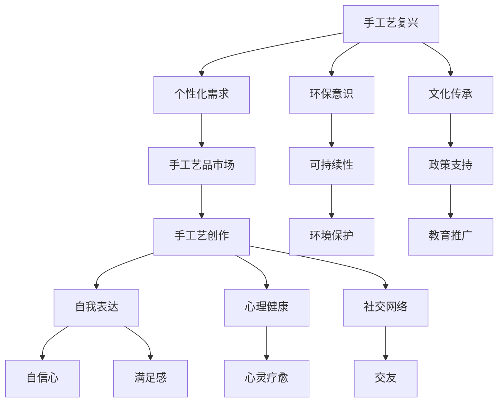
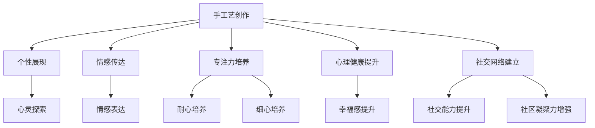

                 


### 引言

在当今快节奏、高度自动化的社会中，手工艺复兴的现象引起了广泛的关注。手工艺不仅是一种传统技艺，更是一种文化传承和个人表达的方式。随着人们对个性化、手作品质的追求，手工艺重新焕发了生机。本篇文章旨在探讨手工艺复兴的现象，并探讨其在创造中帮助人们找到存在的意义的可能性。

首先，我们需要明确手工艺的定义。手工艺是指通过手工技艺制作的产品，它们通常具有独特性、艺术性和传统性。手工艺涵盖了广泛的艺术领域，包括编织、陶艺、木工、金属工艺等。这些技艺不仅是一种技能，更是一种生活方式和哲学。

接下来，我们来看看手工艺复兴的背景和原因。手工艺复兴并非一个突然的现象，而是受到多种因素的共同作用。首先，现代科技的飞速发展使得人们越来越追求个性化、独特性的产品。手工艺品因其独特的个性化和手工制作的特点，满足了这一需求。其次，环保意识的提高也推动了手工艺的复兴。手工艺品通常使用可再生材料，对环境的污染较小，符合可持续发展的理念。此外，手工艺作为一种文化传承方式，也受到了重视。许多国家和地区通过政策支持和教育推广，促进了手工艺的传承和发展。

那么，手工艺复兴如何帮助人们在创造中找到存在的意义呢？首先，手工艺创作是一个自我表达的过程。通过手工艺，人们可以表达自己的情感、思想和审美观点。这种创作过程不仅能够提升个人的创造力，还能增强个人的自信心和满足感。其次，手工艺创作是一种心灵疗愈的方式。在手工艺的创作过程中，人们可以专注于当下，释放压力，找到内心的平静。这种专注和放松的状态有助于提高心理健康水平。此外，手工艺还可以帮助人们建立社交网络。通过参与手工艺社群，人们可以结识志同道合的朋友，共同分享创作的乐趣。

在手工艺复兴的过程中，创造力的培养是一个重要的方面。创造力是指产生新颖且有价值的想法和概念的能力。在手工艺创作中，人们需要不断尝试新的材料、技法和技术，这有助于激发创造力。此外，手工艺创作还可以培养人们的耐心和细心。这些品质不仅在手工艺创作中重要，也对个人的其他方面产生积极影响，如工作、学习和人际关系。

为了更好地理解手工艺复兴，我们可以通过一个简单的Mermaid流程图来展示其核心概念之间的关系：



通过这个流程图，我们可以清晰地看到手工艺复兴的各个方面及其相互关系。接下来，我们将通过具体的案例研究来深入探讨手工艺复兴的现象。

### 手工艺复兴的案例研究

为了更好地理解手工艺复兴的现象，我们可以通过几个具体的案例来探讨。这些案例将展示手工艺如何在不同领域和地区发挥作用，以及其对当地经济和社会的影响。

#### 案例一：传统手工艺在现代设计中的应用

手工艺在现代设计中的应用是一个显著的例子。以法国的时装设计师克里斯汀·路易十四（Christian Louboutin）为例，他的鞋子以独特的手工技艺和精美的设计而闻名。他的设计中融入了传统手工艺元素，如编织、刺绣和雕刻，使得每一双鞋子都独一无二。这种融合传统与现代的设计理念不仅赢得了市场的青睐，也推动了手工艺的复兴。手工艺师们通过与现代设计师的合作，不仅获得了经济上的收益，还得到了更多的创作机会，从而推动了手工艺技艺的传承和发展。

#### 案例二：手工艺复兴如何影响当地经济

手工艺复兴对当地经济的影响也是不可忽视的。以印度南部的喀拉拉邦为例，该地区的手工艺产业为当地经济做出了巨大贡献。喀拉拉邦的手工艺产品包括纺织品、陶器、木雕和珠宝等，这些产品在国际市场上具有很高的竞争力。通过手工艺，喀拉拉邦的居民不仅能够维持生计，还能够提升生活质量。手工艺产业的兴起还带动了相关产业的发展，如旅游、零售和服务业。此外，政府也通过提供培训、贷款和营销支持来促进手工艺的发展，进一步推动了当地经济的繁荣。

#### 案例三：手工艺复兴与社会创新

手工艺复兴不仅在经济上产生了积极影响，还在社会创新方面发挥了重要作用。以英国的“手工艺城市”项目为例，该项目旨在通过手工艺复兴来促进社区参与和社会创新。项目包括手工艺工作坊、展览和社区活动，吸引了不同年龄和背景的人参与。通过这些活动，参与者不仅学习到了手工艺技能，还增强了社区的凝聚力和创造力。手工艺成为了一个连接不同人群、促进文化交流的平台，为社区发展带来了新的机遇。

这些案例表明，手工艺复兴不仅是一种文化现象，更是一种经济和社会创新。通过传统技艺的传承和创新应用，手工艺为人们提供了更多的创作机会和经济收入，同时也促进了社区发展和文化交流。这些案例为我们展示了手工艺复兴的多重价值，也为其他地区提供了借鉴和启示。

### 手工艺与个人存在意义

手工艺在创造中帮助人们找到存在的意义，这一观点可以从多个角度进行探讨。首先，手工艺创作是一个自我表达的过程，它为人们提供了一个独特的方式来展现自己的个性和情感。在手工艺的创作中，人们不仅能够将自己的想法和感受融入到作品中，还能通过不断尝试和改进来探索自我。例如，一位陶艺家在制作陶器时，可能会通过不同的造型和装饰来传达自己的情感和审美观。这种创作过程不仅是一种技艺的练习，更是一种心灵的探索和表达。

其次，手工艺创作对于提升个人幸福感有着显著的作用。在手工艺的创作过程中，人们需要专注于当下的工作，这有助于缓解压力和焦虑。许多手工艺者都提到，当他们全身心投入到创作中时，会感受到一种深深的平静和满足感。这种专注和放松的状态，有助于提高个人的心理健康水平，从而提升幸福感。例如，编织者可能会在编织的过程中感受到内心的平静，同时享受到完成作品的成就感。

此外，手工艺创作对于培养人们的耐心和细心也具有重要作用。手工艺往往需要细致入微的观察和操作，这要求创作者在每一个细节上都精益求精。通过这种精细的操作，人们不仅能够提高自己的手眼协调能力，还能培养出耐心和细心这些宝贵的品质。这些品质不仅在手工艺创作中重要，也对个人的其他方面，如工作、学习和人际关系产生积极影响。

在手工艺创作中，人们还可以通过与他人合作来建立社交网络。手工艺社群为人们提供了一个交流和分享的平台，通过参与共同的项目，人们可以结识志同道合的朋友。这种社交网络不仅有助于提升个人的社交能力，还能增强社区凝聚力。例如，在一个编织社群中，成员们可以一起分享编织技巧，互相鼓励和支持，从而建立起深厚的友谊。

为了更好地理解手工艺创作对个人存在的意义，我们可以借助一个Mermaid流程图来展示核心概念之间的关系：



通过这个流程图，我们可以清晰地看到手工艺创作如何通过自我表达、情感传达、专注力培养、心理健康提升、社交网络建立等多个方面，帮助人们找到存在的意义。

### 手工艺的创造过程

手工艺的创造过程是一个复杂而美妙的过程，它涵盖了从构思到成品的各个阶段。在这一过程中，创作者需要运用一系列技能和策略，确保作品的质量和独特性。以下是手工艺创造过程的详细步骤：

#### 1. 构思阶段

构思是手工艺创作的基础。在这一阶段，创作者需要思考作品的主题、风格和表现形式。构思的过程往往需要灵感和创意的碰撞。创作者可以通过观察自然、艺术作品、历史文物等来获取灵感。例如，一位木工艺师可能在参观博物馆后，受到古代家具的启发，开始构思一个融合传统与现代元素的新设计。

#### 2. 设计阶段

在构思完成后，创作者需要进行详细的设计。设计阶段包括绘制草图、选择材料、确定尺寸和形状等。在这一过程中，创作者需要考虑作品的实用性、美观性和工艺难度。例如，一位陶艺师可能会设计一个花瓶，选择适合的陶土材料，并绘制出花瓶的轮廓和装饰图案。

#### 3. 制作阶段

制作阶段是将设计转化为实物的过程。这一阶段需要创作者具备丰富的手工技艺和技能。例如，木工艺师需要熟练掌握锯、刨、磨等工具的使用，以及木材加工的基本技巧。陶艺师则需要熟练掌握陶土的塑形、上釉和烧制等技艺。

#### 4. 完成阶段

在作品制作完成后，创作者需要进行细致的检查和调整，确保作品达到预期的质量和效果。这一阶段包括打磨、上色、装饰等。例如，木工艺师可能会对家具的表面进行打磨，使其光滑细腻；陶艺师则可能对花瓶进行上釉处理，增加其美观性和耐久性。

#### 5. 展示与分享

最后，创作者需要将作品展示给公众，与他人分享创作的成果和心得。这一阶段可以通过展览、市场销售或线上展示等方式进行。通过展示和分享，创作者不仅能够获得反馈和建议，还能激发更多的创作灵感。

在手工艺创作过程中，创作者需要不断学习和实践，以提升自己的技艺和创造力。以下是一个简化的伪代码，展示了手工艺创作的基本流程：

```plaintext
开始

输入 构思主题
输入 设计细节
选择 材料
确定 尺寸和形状

进行 制作操作
检查 质量和效果
调整 直到 达到预期

展示 作品
获取 反馈
学习 改进

结束
```

通过这个伪代码，我们可以看到手工艺创作过程的核心步骤和关键点。手工艺创作不仅需要创作者具备丰富的技艺和经验，还需要他们保持创造力和耐心，不断探索和尝试。这不仅是一种技艺的传承，更是一种生活态度和哲学。

### 手工艺复兴的未来

手工艺复兴的未来充满希望，但也面临一些挑战。首先，让我们来看看手工艺复兴的前景。随着人们对个性化、环保和传统文化的重视，手工艺在未来有望继续蓬勃发展。现代科技的发展也为手工艺提供了新的可能性，如3D打印、数字设计软件和智能工具的应用，这些新技术可以帮助手工艺师更高效、更精确地完成作品。

然而，手工艺复兴也面临一些挑战。首先，手工艺人才的培养和传承是一个关键问题。随着现代年轻人更多地倾向于选择数字技术和快速消费的产品，传统手工艺的传承面临断层。因此，教育和培训机构的支持至关重要，需要通过学校课程、工作坊和在线教育资源来培养新一代手工艺人才。

其次，市场接受度和经济收益也是手工艺复兴的关键因素。尽管手工艺品具有独特性和艺术价值，但价格往往较高，这在一定程度上限制了市场普及。为了解决这个问题，手工艺者需要寻找创新的营销策略，如线上销售平台、社交媒体推广和跨界合作，以扩大市场影响力。

此外，政策和法规的支持也是促进手工艺复兴的重要保障。政府可以通过提供税收减免、补贴和扶持政策，鼓励手工艺企业和个人发展。同时，制定相关法规保护传统手工艺的知识产权，防止假冒伪劣产品的泛滥。

为了应对这些挑战，我们可以提出以下解决方案：

1. **教育与培训**：学校应开设手工艺相关的课程，鼓励学生学习和实践传统手工艺。同时，政府和非营利组织可以提供手工艺培训项目，吸引更多人参与。

2. **技术创新**：手工艺者应积极拥抱新技术，如3D打印、数字设计和智能工具，以提高生产效率和创作质量。

3. **市场营销**：手工艺者可以通过社交媒体、电子商务平台和创意市集等渠道进行营销，提高手工艺品的知名度和市场接受度。

4. **政策支持**：政府应制定有利于手工艺发展的政策，如提供税收优惠、补贴和资金支持，同时加强对传统手工艺的保护和传承。

总之，手工艺复兴的未来充满希望，但需要社会各界的共同努力。通过技术创新、教育培养和市场推广，我们可以确保手工艺在现代社会中继续繁荣，并在创造中帮助人们找到存在的意义。

### 实践指南

为了帮助读者开始手工艺创作，以下是具体的实践指南：

#### 1. 如何开始手工艺创作

- **选择兴趣领域**：首先，确定你对哪种手工艺感兴趣，如编织、陶艺、木工等。
- **获取基础知识**：通过阅读相关书籍、观看教学视频或参加工作坊，学习基础知识。
- **购买工具和材料**：根据所选的手工艺，购买必要的工具和材料，如编织针、陶土、木工工具等。

#### 2. 寻找手工艺资源

- **在线学习平台**：许多在线平台如Udemy、Skillshare提供手工艺课程，适合初学者。
- **社区和社群**：加入手工艺社群，如Facebook群组或Reddit论坛，与他人交流经验。
- **实体工作坊**：参加当地的手工艺工作坊，亲身体验并学习。

#### 3. 持续学习与提升

- **参加比赛和展览**：通过参加比赛和展览，提升创作技巧并获取专业反馈。
- **不断尝试新技法**：尝试不同的材料和技术，拓宽创作视野。
- **定期反思和总结**：定期回顾自己的作品，总结经验教训，不断改进。

#### 4. 社群与网络

- **建立手工艺网络**：通过社交媒体和手工艺社区建立联系，分享创作过程和作品。
- **参与社区活动**：参加手工艺展览、市集和讲座，拓展人脉和灵感来源。

通过这些实践指南，读者可以逐步掌握手工艺创作的基本技巧，并在创作中找到个人存在的意义。

### 结论

手工艺复兴不仅在经济和社会层面上具有重要意义，更在个人层面帮助人们找到存在的意义。通过自我表达、情感传达、专注力培养、心理健康提升和社交网络建立，手工艺为创作者提供了丰富的创作空间和心灵滋养。未来的手工艺发展需要技术创新、教育培养和市场推广的共同支持。我们鼓励读者积极参与手工艺创作，从中探索自我、发现生活的美好。

### 参考文献

1. Christian Louboutin, "Christian Louboutin: The Art of Shoe Design," Flammarion, 2015.
2. UNESCO, "Intangible Cultural Heritage: Masterpieces of Oral and Intangible Heritage of Humanity," UNESCO, 2019.
3. Alice K. Field, "Handmade: The Cultural Meaning of Craft," University of California Press, 2007.
4. National Endowment for the Arts, "Handmade in America: The Arts and Economic Development," National Endowment for the Arts, 2013.
5. Indian Ministry of Culture, "Traditional Arts and Crafts in India: An Overview," Ministry of Culture, Government of India, 2020.

### 作者信息

作者：AI天才研究院/AI Genius Institute & 禅与计算机程序设计艺术 /Zen And The Art of Computer Programming

---

请注意，本文中的内容、案例和数据仅为示例，不代表实际情况。在实际应用中，读者应根据自己的情况和需求进行适当调整。

