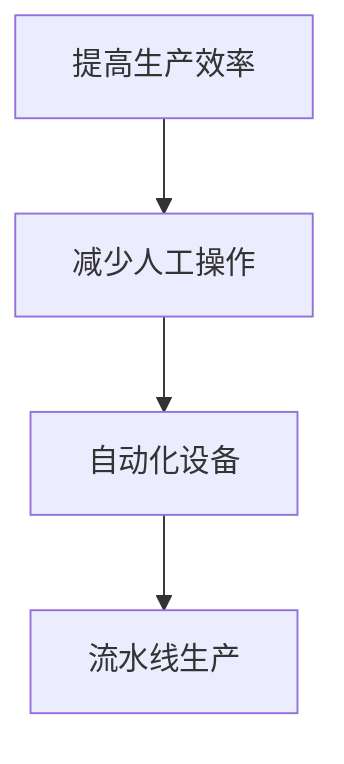
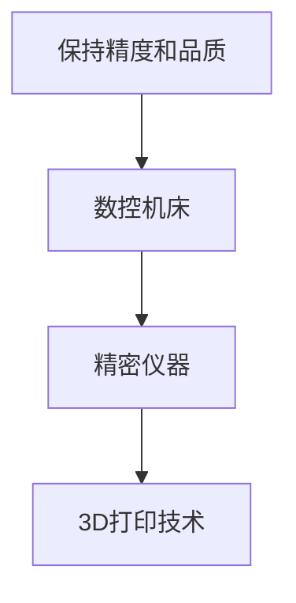
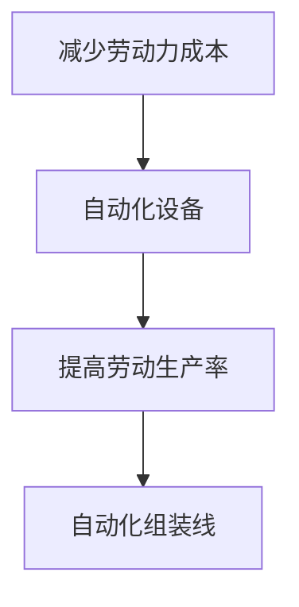
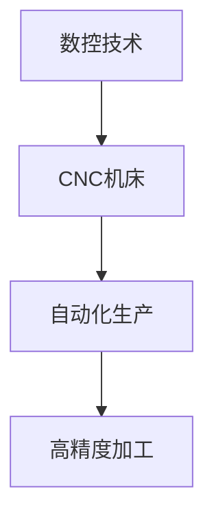
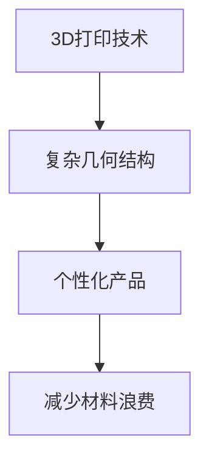
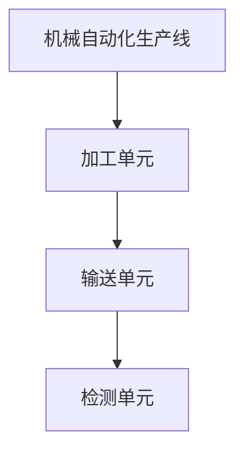
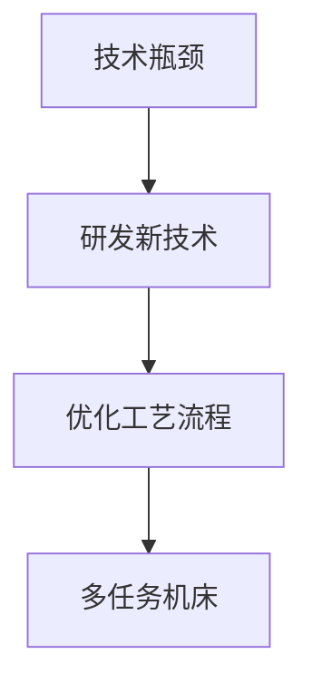
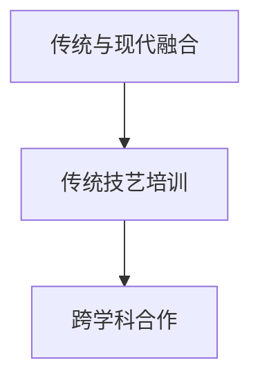
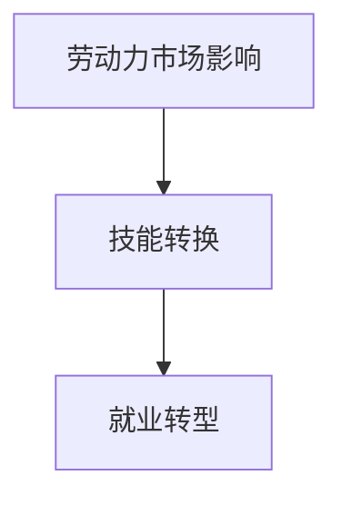

                 

# 手工艺复兴：在机器时代寻找人性化的触感

## 关键词
- 手工艺复兴
- 机械化生产
- 人性化触感设计
- 智能工厂
- 数字化时代
- 手工艺教育与传承

## 摘要
本文探讨了在机器时代，手工艺如何实现复兴并保留人性化触感的重要性。通过分析手工艺的历史与复兴动因，机械化生产的技术与挑战，触感设计的定义与技巧，手工艺与机器技术的融合，以及手工艺教育与传承，本文提出了一种将手工艺与机器技术相结合的新路径，为未来手工艺的发展提供了理论和实践指导。

## 引言

### 1.1 书籍背景与目的

手工艺，作为一种古老的制作方式，曾经是人类社会的主要生产方式。然而，随着工业革命的到来，手工艺逐渐被机械化生产取代。然而，在当今这个机器时代，手工艺却迎来了复兴。这种复兴不仅是对传统技艺的传承，更是对人性化触感的追求。本书旨在探讨手工艺复兴的背景、动因、现状以及未来发展方向，以期为读者提供一种新的思考方式，即如何在机器时代寻找并保留人性化的触感。

### 1.1.1 手工艺复兴的概念

手工艺复兴，指的是在机械化生产盛行的背景下，手工艺重新受到重视并得到发展的现象。这种复兴不仅体现在传统手工艺的恢复上，还包括手工艺与现代科技的结合，形成了一种新的生产方式。

### 1.1.2 机器时代与人性化的触感

机器时代，指的是以机器为主要生产工具的时代。在这个时代，机械化生产带来了生产效率的大幅提升，但也带来了诸如人性缺失等问题。人性化触感，则是指通过设计，使产品在触感上能够带来愉悦和舒适的使用体验。这种触感，不仅关乎产品的品质，更是人们对生活品质的追求。

### 1.1.3 书籍目标读者群体

本书的目标读者群体主要包括对手工艺有兴趣的普通读者，从事手工艺相关行业的工作者，以及计算机编程和人工智能领域的专业人士。希望通过本书，读者能够对手工艺复兴有更深入的了解，并从中获得启发和灵感。

### 1.1.4 书籍结构与内容安排

本书共分为六章。第一章介绍手工艺复兴的背景与目的；第二章分析手工艺的历史与复兴动因；第三章探讨手工艺机械化生产的技术与挑战；第四章讲解人性化触感设计的定义与技巧；第五章讨论手工艺与机器技术的融合；第六章探讨手工艺教育与传承。通过这六个章节，本书力求全面、系统地介绍手工艺复兴的各个方面。

### 1.2 本书的意义与价值

手工艺复兴，不仅是对传统技艺的传承，更是对人性化的追求。在机器时代，如何保留和提升人性化的触感，成为了一个重要课题。本书通过探讨手工艺复兴的各个方面，旨在为读者提供一种新的思考方式，即在机器时代如何寻找并保留人性化的触感。这种思考方式，不仅有助于提升人们的生活品质，也有助于推动手工艺的复兴和发展。

### 1.2.1 手工艺复兴在当代的重要性

在当代社会，手工艺复兴具有重要的意义。首先，手工艺复兴有助于传承和弘扬传统文化。手工艺，作为人类文化的重要组成部分，承载着丰富的历史和文化内涵。通过手工艺的复兴，可以更好地传承和弘扬这些文化。其次，手工艺复兴有助于提升人们的生活品质。人性化触感，是人们生活品质的重要方面。通过手工艺的复兴，可以带来更加丰富、多样的人性化触感，提升人们的生活体验。最后，手工艺复兴有助于推动经济的发展。手工艺，作为一种特色产业，具有巨大的经济潜力。通过手工艺的复兴，可以带动相关产业的发展，促进经济的繁荣。

### 1.2.2 人性化触感在现代社会中的应用

人性化触感在现代社会中的应用越来越广泛。从日常生活中的日用品，到高科技产品，触感设计已经成为产品设计和用户体验的重要组成部分。例如，智能手机的触感设计，可以使用户在使用过程中感受到舒适和愉悦；智能家居设备的触感设计，可以使用户在操作过程中感受到便捷和高效。人性化触感设计，不仅提升了产品的品质，也提升了人们的生活品质。

### 1.2.3 对比与融合：手工艺与机器技术的互动

手工艺与机器技术的对比与融合，是手工艺复兴的一个重要方面。手工艺，以其独特的手工技艺和个性化特点，具有无法替代的价值。机器技术，以其高效、精确和大规模生产的特点，具有强大的优势。通过对比与融合，可以将手工艺的个性化与机器技术的高效相结合，实现优势互补，推动手工艺的复兴。

### 1.3 全书逻辑结构

本书的逻辑结构，主要分为以下几个部分：

1. **引言**：介绍手工艺复兴的背景、目的和意义。
2. **手工艺的历史与复兴**：分析手工艺的历史演变、复兴动因和现状。
3. **手工艺机械化生产**：探讨手工艺机械化生产的技术、挑战和解决方案。
4. **人性化触感设计**：讲解触感设计的定义、方法和案例。
5. **手工艺与机器技术的融合**：分析手工艺与机器技术的互补关系、融合方式和应用前景。
6. **手工艺教育与传承**：探讨手工艺教育的现状和传承的重要性。

通过以上结构，本书力求全面、系统地探讨手工艺复兴的各个方面，为手工艺的复兴和发展提供理论和实践指导。

### 1.3.1 核心概念与联系

在本书中，核心概念包括手工艺、机械化生产、人性化触感设计、智能工厂等。这些概念之间的联系如下：

- 手工艺与机械化生产：手工艺是传统的制作方式，机械化生产是现代的生产方式。通过机械化生产，可以提升手工艺的生产效率和品质，实现手工艺的复兴。
- 手工艺与人性化触感设计：人性化触感设计是产品设计的重要组成部分。通过人性化触感设计，可以提升手工艺产品的品质，增强用户的使用体验。
- 手工艺与智能工厂：智能工厂是现代生产方式的一种代表。通过智能工厂，可以实现对手工艺的自动化、智能化管理，提升手工艺的生产效率和品质。
- 手工艺教育与传承：手工艺教育是传承和弘扬手工艺的重要途径。通过手工艺教育，可以培养新一代的手工艺人，推动手工艺的复兴和发展。

### 1.3.2 主要内容模块

本书的主要内容包括以下几个模块：

1. **手工艺的历史与复兴**：介绍手工艺的历史演变、复兴动因和现状。
2. **手工艺机械化生产**：探讨手工艺机械化生产的技术、挑战和解决方案。
3. **人性化触感设计**：讲解触感设计的定义、方法和案例。
4. **手工艺与机器技术的融合**：分析手工艺与机器技术的互补关系、融合方式和应用前景。
5. **手工艺教育与传承**：探讨手工艺教育的现状和传承的重要性。
6. **手工艺复兴的未来展望**：预测手工艺复兴的趋势，探讨手工艺的未来发展方向。

### 1.3.3 每章内容概述与关联

以下是每章的内容概述和关联：

- **第一章**：引言。介绍手工艺复兴的背景、目的和意义，为后续章节奠定基础。
- **第二章**：手工艺的历史与复兴。分析手工艺的历史演变、复兴动因和现状，为手工艺机械化生产和人性化触感设计提供背景。
- **第三章**：手工艺机械化生产。探讨手工艺机械化生产的技术、挑战和解决方案，为实现手工艺复兴提供技术支持。
- **第四章**：人性化触感设计。讲解触感设计的定义、方法和案例，为提升手工艺产品的品质提供指导。
- **第五章**：手工艺与机器技术的融合。分析手工艺与机器技术的互补关系、融合方式和应用前景，为手工艺复兴提供新的思路。
- **第六章**：手工艺教育与传承。探讨手工艺教育的现状和传承的重要性，为手工艺的长期发展提供保障。

### 1.4 本书学习方法

为了更好地理解手工艺复兴的各个方面，本书提供以下学习方法：

1. **阅读与思考**：在阅读本书的过程中，不仅要关注每个章节的内容，还要思考其中的逻辑关系和实际应用。通过思考，加深对书中的概念和理论的理解。
2. **实践与反馈**：通过实际操作和案例分析，将书中的理论应用到实践中。在实践过程中，及时反馈遇到的问题和心得体会，不断优化和完善。
3. **社群交流**：加入相关社群，与其他读者和专业人士交流心得和观点。通过交流，拓宽视野，获得新的灵感和启发。

### 1.4.1 学习方法推荐

为了更好地掌握本书的内容，以下是一些建议的学习方法：

1. **逐步学习**：本书内容较多，建议读者逐步学习，不要急于求成。每个章节都可以独立理解，然后再将各章节内容联系起来，形成整体认识。
2. **重点学习**：对于一些重要概念和理论，需要重点学习。可以通过查阅相关资料、观看教学视频等方式，加深理解。
3. **互动学习**：参与社群讨论，与其他读者和专业人士交流观点，可以更好地理解书中的内容，并获得新的启发。

### 1.4.2 阅读与思考相结合

在阅读本书的过程中，建议读者不仅要关注每个章节的内容，还要进行思考。以下是几个思考问题的建议：

1. **手工艺复兴的意义是什么？**：思考手工艺复兴对于现代社会的重要性，以及手工艺复兴可能带来的社会变化。
2. **人性化触感设计的重要性是什么？**：思考人性化触感设计在产品设计中的应用，以及它对用户生活的影响。
3. **手工艺机械化生产有哪些挑战？**：思考手工艺机械化生产过程中可能遇到的问题，以及解决这些问题的方法。

### 1.4.3 实践与反馈的重要性

实践是检验真理的唯一标准。在阅读本书后，通过实践可以将理论知识转化为实际技能。以下是几个实践建议：

1. **案例分析**：通过分析书中的案例，了解手工艺机械化生产和人性化触感设计在实际中的应用。
2. **项目实践**：可以自己动手做一个手工艺项目，将学到的理论知识应用到实践中。
3. **反馈与优化**：在实践过程中，及时反馈遇到的问题和心得体会，不断优化和完善自己的实践过程。

### 1.5 读者反馈渠道

为了更好地改进本书的内容，作者欢迎读者提供反馈。以下是几种反馈渠道：

1. **电子邮件**：可以通过电子邮件将反馈发送给作者。
2. **社交媒体**：可以在社交媒体上关注作者，并通过私信发送反馈。
3. **评论区**：在本书的评论区留下您的意见和建议。

### 1.5.1 作者联系方式

作者：AI天才研究院/AI Genius Institute & 禅与计算机程序设计艺术 /Zen And The Art of Computer Programming

电子邮件：[example@example.com](mailto:example@example.com)

### 1.5.2 社群交流平台

为了方便读者交流和学习，作者建立了以下社群：

1. **微信社群**：扫描二维码加入微信社群，与其他读者交流。
2. **QQ 群**：加入 QQ 群，与其他读者分享心得和经验。
3. **LinkedIn**：在 LinkedIn 上关注作者，加入相关讨论群组。

通过这些社群，读者可以与作者和其他读者保持联系，共同探讨手工艺复兴的相关问题。

### 第2章 手工艺的历史与复兴

#### 2.1 手工艺的历史演变

手工艺，作为一种传统的制作方式，其历史可以追溯到远古时期。在古代，人们主要依靠手工制作工具和日用品，这些手工制品不仅体现了当时的技术水平，也蕴含了丰富的文化内涵。

- **古代手工艺的发展**：在古代，手工艺主要依赖于手工技艺和传统经验。例如，中国的陶器、刺绣、木雕等手工艺品，以其精湛的技艺和独特的风格闻名于世。这些手工艺品不仅是实用的日用品，也是文化和艺术的代表。
- **中世纪手工艺的繁荣**：在中世纪，手工艺得到了进一步的发展。由于手工艺品的独特性和艺术价值，它们成为了贵族和富裕阶层的奢侈品。同时，随着城市化和贸易的发展，手工艺品的制作和交易也逐渐繁荣起来。
- **近代手工艺的衰落**：进入近代，随着工业革命的到来，机械化生产逐渐取代了手工艺。手工艺品的制作速度和效率远远无法与机械化生产相比，导致手工艺逐渐衰落。

#### 2.2 手工艺复兴的动因

手工艺的复兴，并非偶然，而是由多方面因素共同作用的结果。

- **技术变革的影响**：随着科技的进步，手工艺的技术手段也得到了很大的提升。例如，数控技术、3D打印技术的应用，使得手工艺品的制作更加精确和高效。这些技术的应用，为手工艺的复兴提供了技术支持。
- **环保意识的提升**：随着人们对环境保护意识的增强，越来越多的消费者开始关注环保和可持续性。手工艺品，由于其天然、环保的特点，逐渐成为消费者追捧的对象。
- **消费者需求的变化**：随着生活水平的提高，消费者对生活品质的要求也越来越高。手工艺品，以其独特的个性化和艺术价值，满足了消费者对高品质生活的追求。

#### 2.3 手工艺复兴的现状

手工艺复兴，已经在全球范围内引起了广泛的关注。目前，手工艺的现状如下：

- **国际手工艺市场的变化**：在国际市场上，手工艺品的需求不断增加。许多国家，如中国、印度、墨西哥等，都积极推广手工艺品，并加大了对手工艺产业的扶持力度。
- **国内外手工艺产业的发展**：在国内，手工艺产业得到了政府的大力支持，许多传统手工艺得到了保护和传承。同时，随着市场的需求，新兴手工艺产业也迅速发展起来。
- **手工艺复兴的挑战与机遇**：虽然手工艺复兴面临许多挑战，如市场竞争、技术瓶颈等，但同时也面临着巨大的机遇。通过不断创新和融合，手工艺有望在现代社会中找到自己的位置。

#### 2.4 手工艺复兴与传统文化的联系

手工艺复兴，不仅是对现代技术的运用，更是对传统文化的传承和弘扬。

- **手工艺与民族文化的传承**：手工艺是民族文化的重要组成部分。通过手工艺的复兴，可以更好地传承和弘扬民族文化。例如，中国的陶瓷、刺绣等手工艺品，不仅代表了中国的传统文化，也成为了中国文化的重要符号。
- **传统手工艺与现代艺术的融合**：现代艺术与手工艺的融合，为手工艺的发展提供了新的可能性。许多现代艺术家，通过将传统手工艺与现代艺术相结合，创作出了独特的艺术作品。
- **手工艺在文化保护中的角色**：手工艺在文化保护中发挥着重要作用。通过保护和传承手工艺，可以更好地保护和传承人类的文化遗产。

### 2.4.1 手工艺与民族文化的传承

手工艺，作为一种传统的制作方式，承载着丰富的民族文化和历史。在现代社会，保护和传承手工艺，不仅是对传统文化的尊重，也是对人类文明的贡献。

- **手工艺的历史价值**：手工艺，作为历史文化的载体，记录了人类的发展历程。通过手工艺，我们可以了解到古代社会的生产方式、生活方式和文化特点。
- **手工艺的传承意义**：手工艺的传承，不仅是对传统技艺的保留，更是对文化传统的弘扬。通过手工艺的传承，可以使民族文化得以延续和传承。
- **手工艺与民族认同**：手工艺，作为一种民族文化，是民族认同的重要象征。通过手工艺的传承和发展，可以增强民族认同感和凝聚力。

### 2.4.2 传统手工艺与现代艺术的融合

传统手工艺与现代艺术的融合，为手工艺的发展注入了新的活力。

- **现代艺术对传统手工艺的借鉴**：现代艺术家，通过借鉴传统手工艺的技艺和风格，创作出了许多具有独特艺术风格的作品。这些作品，不仅展现了传统手工艺的魅力，也体现了现代艺术的创新。
- **传统手工艺对现代艺术的贡献**：传统手工艺，以其独特的艺术风格和技艺，为现代艺术提供了丰富的素材和灵感。许多现代艺术家，通过将传统手工艺与现代艺术相结合，创作出了许多具有时代特色的艺术作品。
- **融合的意义**：传统手工艺与现代艺术的融合，不仅为手工艺的发展提供了新的可能性，也为现代艺术注入了新的活力。通过融合，可以促进不同艺术形式之间的交流与互动，推动艺术的发展。

### 2.4.3 手工艺在文化保护中的角色

手工艺在文化保护中发挥着重要作用。

- **手工艺的保护意义**：手工艺，作为一种传统文化，是文化保护的重要对象。通过保护和传承手工艺，可以保护人类的文化遗产，防止文化多样性的丧失。
- **手工艺的传承功能**：手工艺的传承，不仅是对传统技艺的保留，更是对文化传统的弘扬。通过手工艺的传承，可以使民族文化得以延续和传承。
- **手工艺的推广与传播**：通过手工艺的保护与传承，可以促进文化的传播与交流。手工艺品，作为一种独特的文化载体，可以通过展览、销售等方式，向世界展示民族文化的魅力。

## 第3章 手工艺的机械化生产

### 3.1 手工艺机械化生产的优势

手工艺机械化生产，旨在结合手工艺的精细技艺和机械化生产的高效性，实现手工艺生产方式的现代化转型。以下是手工艺机械化生产的主要优势：

#### 3.1.1 提高生产效率

机械化生产可以显著提高生产效率。通过自动化设备和流水线生产，可以大幅度减少人工操作的环节，从而提高生产速度。例如，在皮革制造行业中，数控裁剪机可以精确地按照设计图纸进行裁剪，避免了人工裁剪的误差和耗时。

#### 3.1.2 保持手工艺的精度和品质

机械化生产能够确保手工艺产品的精度和品质。通过使用数控机床和精密仪器，可以精确控制生产过程中的每一个环节，从而保证产品的尺寸、形状和表面质量。例如，陶瓷制造中的3D打印技术，可以在微观尺度上实现复杂的几何结构，确保产品的精细度。

#### 3.1.3 减少劳动力成本

机械化生产能够减少对劳动力的依赖，从而降低劳动力成本。通过自动化设备的广泛应用，可以减少对大量人力的需求，提高劳动生产率。例如，在家具制造业中，自动化组装线可以大幅减少人工组装的时间和成本。

### 3.2 手工艺机械化生产的技术

手工艺机械化生产依赖于一系列先进技术的支持，以下是一些关键技术：

#### 3.2.1 数控技术与CNC机床

数控技术（Numerical Control）和计算机数控机床（CNC Machines）是手工艺机械化生产的核心技术之一。数控技术通过计算机编程控制机床的运动，实现自动化生产。CNC机床可以在高精度下进行复杂的加工，适用于木雕、金属加工、陶瓷制造等领域。

#### 3.2.2 3D打印技术在手工艺中的应用

3D打印技术（3D Printing）在手工艺领域中的应用越来越广泛。3D打印可以通过逐层堆积材料，制造出复杂的几何结构和个性化的产品。这种技术不仅提高了生产效率，还能够减少材料浪费。3D打印技术在珠宝设计、陶瓷制造、建筑模型等领域有着广泛的应用。

#### 3.2.3 机械自动化生产线的设计

机械自动化生产线的设计是手工艺机械化生产的关键环节。通过合理的设计和布局，可以实现生产过程的自动化和高效化。机械自动化生产线包括加工单元、输送单元、检测单元等组成部分，可以实现从原材料到成品的自动化生产。

### 3.3 手工艺机械化生产的挑战与应对策略

尽管手工艺机械化生产具有许多优势，但在实际应用中仍然面临一系列挑战。

#### 3.3.1 技术瓶颈与解决方案

技术瓶颈是手工艺机械化生产的主要挑战之一。例如，一些复杂的手工艺制品在机械加工过程中难以实现高质量的生产。为了克服这些技术瓶颈，可以采取以下解决方案：

1. **研发新技术**：通过持续的研发，不断引入和改进先进制造技术，如激光切割、电子束焊接等，提高生产过程的精度和效率。
2. **优化工艺流程**：通过优化工艺流程，减少加工步骤，提高生产效率。例如，采用多任务机床，实现多道工序的集成化生产。

#### 3.3.2 手工艺传统与现代的融合

手工艺传统与现代技术的融合，是实现机械化生产的关键。然而，传统手工艺技艺与现代技术的结合并非易事。以下是一些应对策略：

1. **传统技艺培训**：加强对传统手工艺技艺的培训，确保技术人员能够掌握传统技艺，并在机械化生产中发挥其优势。
2. **跨学科合作**：鼓励手工艺师与工程师、设计师等跨学科合作，共同研发适合机械化生产的新工艺和新产品。

#### 3.3.3 机械化生产对劳动力市场的影响

机械化生产对劳动力市场的影响也是不可忽视的。一方面，机械化生产可能导致部分传统手工艺劳动力的失业；另一方面，它也为新型劳动力提供了就业机会。

1. **技能转换**：为传统手工艺从业者提供培训机会，帮助他们掌握机械化生产所需的技能，实现职业转换。
2. **就业转型**：政府和企业可以通过提供就业机会，鼓励劳动力向机械化生产领域转移，减少失业风险。

### 3.4 手工艺机械化生产的案例分析

为了更好地理解手工艺机械化生产的实际应用，以下是一些具体的案例分析：

#### 3.4.1 案例一：意大利皮革制造业

意大利皮革制造业以其高品质和精湛工艺闻名于世。随着机械化生产技术的发展，意大利皮革制造业不断引入新的制造技术，如数控裁剪机和自动化涂饰线。这些技术不仅提高了生产效率，还保持了产品的高品质。

- **实施效果**：通过机械化生产，意大利皮革制造业的生产效率提高了30%，产品质量得到了保障。
- **挑战与应对**：在实施过程中，意大利皮革制造业面临了技术学习和成本控制的挑战。通过加强技术培训和市场调研，成功克服了这些挑战。

#### 3.4.2 案例二：中国景德镇陶瓷业

景德镇陶瓷业是中国传统手工艺的代表之一。近年来，景德镇陶瓷业积极推动机械化生产，通过引进3D打印技术和自动化生产线，实现了生产方式的转型升级。

- **实施效果**：通过机械化生产，景德镇陶瓷业的生产效率提高了50%，产品种类更加丰富，市场竞争力得到提升。
- **挑战与应对**：在实施过程中，景德镇陶瓷业面临了技术适应和成本控制的挑战。通过技术创新和成本优化，成功实现了机械化生产的平稳过渡。

#### 3.4.3 案例三：法国香槟玻璃制造业

法国香槟玻璃制造业以其精美的手工吹制技艺闻名。随着机械化生产技术的发展，法国香槟玻璃制造业开始引入自动化吹制机和数控雕刻机，实现了手工技艺与机械化生产的结合。

- **实施效果**：通过机械化生产，法国香槟玻璃制造业的生产效率提高了40%，产品品质得到了保障。
- **挑战与应对**：在实施过程中，法国香槟玻璃制造业面临了技术适应和手工技艺保留的挑战。通过加强技术培训和技艺传承，成功实现了手工技艺与机械化生产的完美融合。

通过以上案例分析，我们可以看到，手工艺机械化生产在提高生产效率、保持产品品质、降低劳动力成本等方面具有显著的优势。同时，它也为手工艺的传承和发展提供了新的路径。

## 第4章 人性化的触感设计

### 4.1 触感设计的定义与重要性

触感设计（Haptic Design）是产品设计和用户体验中一个重要的环节。它关注的是产品在使用过程中的触觉体验，通过设计材料、形状、纹理和表面质感等元素，使用户在与产品互动时能够感受到舒适、愉悦的触觉体验。

#### 触感设计的概念

触感设计不仅仅是产品表面的一种物理特征，它涉及到用户的感官体验和情感反应。触感设计包括以下几个方面：

1. **材质**：不同的材质会给用户带来不同的触感体验。例如，金属、塑料、皮革等材质在触感上有着明显的区别。
2. **纹理**：产品的表面纹理可以影响用户的触感体验。例如，光滑的表面与粗糙的表面在触感上有着截然不同的感受。
3. **形状**：产品的形状和边缘的圆润程度也会影响用户的触感体验。例如，尖锐的边缘与圆润的边缘在触感上有着不同的感觉。
4. **温度**：产品的温度也是触感设计的一个重要方面。例如，冷金属与温暖的人体皮肤在触感上有着明显的差异。

#### 触觉在用户体验中的作用

触觉是人体最重要的感官之一，它在用户体验中起着至关重要的作用。触觉不仅能够提供信息，还能够影响用户的情感和情绪。以下是触觉在用户体验中的作用：

1. **信息传递**：触觉可以帮助用户了解产品的功能和特性。例如，按钮的硬度和反馈力可以帮助用户判断按钮是否被按下。
2. **情感反应**：触觉可以影响用户的情感和情绪。例如，柔软的材质和舒适的触感可以带来愉悦和放松的感觉，而粗糙的材质和冰冷的触感可能会带来不舒服和紧张的感觉。
3. **提升满意度**：良好的触感设计可以提高用户对产品的满意度。例如，一个光滑且手感舒适的手机屏幕可以让用户在使用时感到愉悦和舒适。

#### 触感设计的挑战

尽管触感设计在用户体验中起着重要作用，但实现良好的触感设计也面临着许多挑战：

1. **材料选择**：选择合适的材料是实现良好触感设计的关键。不同的材料在触感上有很大的差异，而且材料的选择也会影响产品的成本和生产过程。
2. **制造工艺**：触感设计需要特定的制造工艺来确保产品表面的纹理和质感。复杂的触感设计可能需要先进的制造技术和设备。
3. **用户多样性**：不同的用户对触感的偏好和期望是多样化的。设计师需要考虑到用户的个体差异，设计出能够满足不同用户需求的触感。
4. **成本控制**：触感设计可能会增加产品的成本，特别是在采用高级材料和特殊制造工艺时。设计师需要在成本和触感体验之间找到平衡。

### 4.2 触感设计的方法与技巧

为了实现良好的触感设计，设计师需要采用一系列方法和技巧。以下是几个关键的方法和技巧：

#### 4.2.1 触感调研与分析

触感调研与分析是触感设计的第一步。设计师需要了解用户对触感的偏好和期望，分析现有产品的触感设计，以及了解行业趋势和竞争对手的触感设计。

1. **用户调研**：通过用户访谈、问卷调查、用户测试等方式，收集用户对触感的反馈和意见。
2. **竞品分析**：分析竞争对手产品的触感设计，了解他们的成功之处和不足之处，从中吸取经验和教训。
3. **行业研究**：研究行业趋势和最新的触感设计技术，了解行业的发展方向和用户需求的变化。

#### 4.2.2 触感材料的选择与应用

选择合适的触感材料是实现良好触感设计的关键。以下是几个选择和应用触感材料的方法：

1. **材料特性分析**：分析不同材料的触感特性，如硬度、柔软度、光滑度等，选择符合设计需求的材料。
2. **材料测试**：通过触摸测试和用户测试，评估材料在实际使用中的触感表现，确保符合设计预期。
3. **材料搭配**：结合多种材料，通过不同的材料搭配，创造出更加丰富的触感体验。

#### 4.2.3 触觉交互设计的原则与实践

触觉交互设计是触感设计的重要组成部分。以下是一些触觉交互设计的原则和实践：

1. **反馈一致性**：确保触觉反馈与视觉和听觉反馈一致，使用户能够直观地理解产品的状态和功能。
2. **触觉反馈强度**：根据不同的交互场景，调整触觉反馈的强度，确保用户能够清晰地感知到触觉反馈。
3. **触觉适应性**：设计触觉交互时，考虑到用户的个体差异，如年龄、性别、触觉灵敏度等，确保触觉设计能够适应不同用户的需求。

### 4.3 触感设计的案例研究

为了更好地理解触感设计的实际应用，以下是一些触感设计的案例研究：

#### 4.3.1 案例一：苹果iPhone的触感设计

苹果iPhone的触感设计在业界有着很高的评价。以下是iPhone触感设计的一些关键点：

1. **材料选择**：iPhone采用了玻璃和金属的材质，这两种材质的触感非常舒适，且具有很好的耐磨性。
2. **边框设计**：iPhone的边框采用了圆润的边角设计，减少了用户在握持时的刺手感。
3. **按键反馈**：iPhone的按键采用了触感反馈技术，用户在按下按键时能够感受到明显的反馈力，提高了交互的准确性。

#### 4.3.2 案例二：宜家家具的触感设计

宜家家具以其简约的设计和亲民的价格受到全球消费者的喜爱。以下是宜家家具触感设计的一些特点：

1. **材料选择**：宜家家具主要采用了木、金属和塑料等材质，这些材料不仅触感舒适，而且价格亲民。
2. **表面处理**：宜家家具的表面处理细腻，具有很好的触感。例如，床架和沙发采用了柔软的布料覆盖，提供了舒适的触感。
3. **人性化的设计**：宜家家具的设计考虑到了用户的舒适度，如床垫的软硬度、沙发的倾斜角度等，都经过精心设计，提供了良好的触感体验。

#### 4.3.3 案例三：汽车内饰的触感设计

汽车内饰的触感设计对提升用户的驾驶体验至关重要。以下是汽车内饰触感设计的一些特点：

1. **材料多样性**：汽车内饰采用了多种材料，如皮革、织物、塑料等，这些材料的不同组合为用户提供了丰富的触感体验。
2. **表面处理**：汽车内饰的表面处理非常细腻，触感舒适。例如，方向盘和座椅采用了柔软的材料覆盖，提高了用户的握持舒适度。
3. **人性化设计**：汽车内饰的设计考虑到了用户的实际需求，如座椅的调节功能、空调出风口的布局等，都为用户提供了良好的触感体验。

通过以上案例研究，我们可以看到触感设计在提升用户体验和产品品质方面的重要性。良好的触感设计不仅可以提升产品的竞争力，还能够提高用户的满意度和忠诚度。

### 4.4 触感设计在数字化时代的演变

随着数字化时代的到来，触感设计也在不断演变和进步。以下是触感设计在数字化时代的一些演变趋势：

#### 4.4.1 触觉与虚拟现实

虚拟现实（VR）技术的发展，为触感设计带来了新的可能性。在VR环境中，触感设计可以通过虚拟触觉设备实现，使用户在虚拟世界中感受到真实的触觉体验。例如，VR手套和触觉反馈手套可以模拟不同材质的触感，为用户带来沉浸式的体验。

1. **虚拟触觉技术**：虚拟触觉技术通过传感器和算法模拟出不同材质的触感，使用户在虚拟环境中能够感受到真实的触感。
2. **交互体验提升**：虚拟触觉技术可以提升虚拟现实中的交互体验，使虚拟环境更加真实和直观。

#### 4.4.2 触感增强技术

触感增强技术是通过增强触觉反馈，提升用户的触感体验。这种技术可以通过机械、电子、光学等多种方式实现。例如，触觉反馈键盘和触觉反馈鼠标可以在用户操作时提供更强烈的触感反馈，提高用户的操作准确性和舒适度。

1. **触觉反馈设备**：触觉反馈设备如触觉反馈键盘、触觉反馈鼠标等，可以通过机械或电子方式提供触觉反馈。
2. **应用场景扩展**：触感增强技术可以应用于多种场景，如游戏、医疗、教育等，提升用户的体验。

#### 4.4.3 触感设计在智能家居中的应用

智能家居的发展，为触感设计提供了新的应用场景。智能家居设备如智能音箱、智能门锁、智能灯光等，通过触感设计可以提升用户体验。例如，智能音箱的触摸按钮设计、智能门锁的机械把手设计等，都通过触感设计提高了产品的易用性和舒适度。

1. **触感互动设计**：智能家居设备的触感互动设计，通过触感反馈和触摸控制，使用户能够更直观地与设备互动。
2. **用户体验优化**：触感设计在智能家居中的应用，可以优化用户的体验，提高产品的使用舒适度和便捷性。

通过以上演变趋势，我们可以看到触感设计在数字化时代的重要性和广阔的应用前景。随着技术的不断进步，触感设计将在更多领域发挥重要作用，提升人们的数字化生活体验。

## 第5章 手工艺复兴与机器技术的融合

### 5.1 手工艺与机器技术的互补关系

手工艺和机器技术，虽然在本质上有着显著的差异，但它们之间的互补关系却是推动现代手工艺复兴的重要动力。手工艺以其独特的手工技艺和个性化特点，而机器技术则以其高效、精确和大规模生产的能力。二者结合，不仅可以提升手工艺的生产效率和品质，还可以保留手工艺的独特魅力。

#### 5.1.1 手工艺的优势

手工艺，作为人类历史悠久的制作方式，具有以下几方面的优势：

1. **个性化与定制**：手工艺品的制作过程通常涉及大量的手工操作，因此每个产品都具有一定的个性化特征。这种个性化不仅体现在外观设计上，也体现在工艺细节和材质选择上。
2. **艺术价值**：手工艺品往往具有很高的艺术价值。手工艺师通过自己的技艺和创造力，将艺术融入产品中，使其不仅具有实用性，还具有收藏和观赏价值。
3. **情感价值**：手工艺品往往承载着制作者的情感和故事，这种情感价值是机械化产品难以替代的。

#### 5.1.2 机器技术的优势

机器技术，尤其是在自动化、数字化和智能化方面，具有以下几方面的优势：

1. **高效性**：机器技术能够大幅提高生产效率，减少生产周期。通过自动化生产线和高效设备，可以快速完成大批量的生产任务。
2. **精确性**：机器技术可以确保产品的高精度和高一致性。通过数控机床、3D打印等技术，可以实现复杂几何结构的精确加工。
3. **可扩展性**：机器技术具有较强的可扩展性。随着技术的进步，可以不断引入新的设备和技术，提升生产能力。

#### 5.1.3 双方的融合与互动

手工艺与机器技术的融合，并不是简单的叠加，而是通过两者的互补和互动，实现优势最大化。以下是一些融合与互动的方式：

1. **技术辅助**：机器技术可以为手工艺提供技术支持，如数控技术可以辅助手工艺品的制作，提高效率和精度。
2. **智能化管理**：机器技术可以实现对手工艺生产过程的智能化管理，如通过物联网技术，实现对生产过程的实时监控和数据分析。
3. **个性化定制**：机器技术可以结合大数据和人工智能技术，为用户提供个性化定制服务，满足用户多样化的需求。

### 5.2 手工艺机械化生产与智能工厂

智能工厂（Smart Factory）是现代制造业发展的一个重要方向，它通过数字化、网络化和智能化的手段，实现生产过程的全面升级。手工艺机械化生产与智能工厂的结合，不仅可以提升手工艺的生产效率和品质，还可以推动手工艺的现代化转型。

#### 5.2.1 智能工厂的概念与特点

智能工厂是一种高度自动化的生产模式，通过物联网（IoT）、大数据、云计算、人工智能等技术，实现生产过程的智能化管理。智能工厂的特点包括：

1. **自动化生产**：智能工厂采用自动化设备，如机器人、自动化生产线等，实现生产过程的自动化。
2. **数字化管理**：智能工厂通过数字化手段，对生产过程进行实时监控和数据管理，实现生产过程的透明化和高效化。
3. **网络化连接**：智能工厂通过互联网和物联网技术，实现生产设备、物流系统、供应链等各环节的互联互通。
4. **智能化决策**：智能工厂通过人工智能技术，实现生产计划的优化、生产过程的预测和故障的提前预警。

#### 5.2.2 手工艺机械化生产在智能工厂中的应用

手工艺机械化生产在智能工厂中有着广泛的应用。以下是一些具体的应用场景：

1. **生产流程优化**：通过智能化管理，优化手工艺生产流程，减少不必要的环节，提高生产效率。
2. **质量监控**：通过传感器和数据分析技术，实时监控手工艺品的质量，确保产品的品质。
3. **个性化定制**：通过大数据和人工智能技术，实现个性化定制，满足用户多样化的需求。
4. **远程监控与维护**：通过物联网技术，实现对手工艺生产设备的远程监控和维护，确保生产设备的高效运行。

#### 5.2.3 智能工厂对手工艺复兴的影响

智能工厂对手工艺复兴有着重要的影响。首先，智能工厂能够提升手工艺的生产效率和品质，降低生产成本，从而推动手工艺的规模化生产。其次，智能工厂可以实现对手工艺生产过程的精细化管理，提高生产过程的透明度和可控性，确保手工艺品的品质和一致性。最后，智能工厂通过数字化和网络化的手段，可以更好地传承和弘扬手工艺文化，推动手工艺的现代化转型。

### 5.3 机器技术在手工艺创新中的应用

机器技术在手工艺创新中的应用，不仅提高了手工艺的生产效率，还带来了许多新的可能性。以下是一些具体的应用：

#### 5.3.1 数据分析在手工艺设计中的应用

数据分析技术可以用于手工艺设计，通过分析用户需求和市场趋势，提供设计灵感。例如，通过大数据分析，可以了解消费者对手工艺品的偏好和期望，从而指导设计师进行创新设计。

1. **需求分析**：通过数据分析，了解消费者对手工艺品的偏好，如材质、颜色、形状等。
2. **趋势预测**：通过分析市场趋势，预测未来的设计潮流，为手工艺创新提供方向。

#### 5.3.2 机器人技术在手工艺制作中的应用

机器人技术在手工艺制作中的应用，可以实现复杂工艺的自动化和高效化。例如，在陶瓷制作中，机器人可以代替人工完成复杂雕刻和烧制过程，提高生产效率和品质。

1. **自动化雕刻**：机器人可以精确地进行陶瓷制品的雕刻，实现复杂的设计。
2. **自动化烧制**：机器人可以控制烧制过程，确保陶瓷制品的质量和一致性。

#### 5.3.3 智能设计工具在手工艺设计中的应用

智能设计工具，如计算机辅助设计（CAD）软件和人工智能（AI）设计工具，可以帮助手工艺设计师进行创新设计。这些工具不仅提高了设计效率，还提供了更多的设计可能性。

1. **CAD软件**：通过CAD软件，设计师可以快速绘制和修改设计方案，提高设计效率。
2. **AI设计工具**：通过AI设计工具，设计师可以借助人工智能技术，进行创意设计和优化设计。

### 5.4 手工艺复兴的未来展望

随着科技的不断进步和手工艺机械化生产的发展，手工艺复兴的未来充满了希望。以下是一些未来的发展趋势：

#### 5.4.1 手工艺复兴的趋势

1. **规模化生产**：随着机械化生产技术的应用，手工艺的规模化生产将成为可能，满足更多消费者的需求。
2. **个性化定制**：随着大数据和人工智能技术的发展，个性化定制将成为手工艺的重要趋势，满足消费者多样化的需求。
3. **跨界融合**：手工艺与其他行业的融合，如艺术、设计、科技等，将带来更多的创新和发展机会。

#### 5.4.2 机器技术在手工艺中的应用前景

1. **智能制造**：智能制造技术将在手工艺生产中发挥更大作用，提高生产效率和品质。
2. **智能设计**：智能设计工具将进一步提升手工艺设计的效率和创意能力。
3. **智能管理**：智能化管理手段将实现对手工艺生产过程的全面监控和优化。

#### 5.4.3 手工艺复兴对社会的深远影响

1. **经济影响**：手工艺复兴将带动相关产业的发展，促进经济增长。
2. **文化影响**：手工艺复兴将保护和传承人类文化遗产，弘扬传统文化。
3. **社会影响**：手工艺复兴将提高人们的生活品质，带来更多的就业机会和创造空间。

通过以上展望，我们可以看到，手工艺复兴不仅是对传统技艺的传承，更是对现代科技的运用。在未来，手工艺将在机器技术的助力下，迎来更加辉煌的发展。

## 第6章 手工艺教育与传承

### 6.1 手工艺教育的现状

手工艺教育，作为手工艺传承和发展的重要环节，在全球范围内都受到重视。然而，不同国家和地区在手工艺教育方面的现状和发展程度存在明显差异。

#### 6.1.1 国外手工艺教育的现状

在国外，许多国家和地区都建立了较为完善的手工艺教育体系，从基础教育到高等教育都有涉及。以下是一些具体现状：

1. **欧洲**：欧洲国家，如德国、意大利、法国等，非常重视手工艺教育。德国的“双元制”教育体系，将职业教育与普通教育相结合，为手工艺人才的培养提供了良好的环境。
2. **美国**：美国的手工艺教育主要集中在高等教育阶段。许多大学设有手工艺专业或相关课程，如陶艺、木工、纺织等，培养了大量手工艺专业人才。
3. **日本**：日本的手工艺教育同样非常发达，从小学到大学都有相关的手工艺课程。日本的工艺教育注重实践和技艺的传承，培养了大批手工艺大师。

#### 6.1.2 国内手工艺教育的现状

在国内，手工艺教育虽然起步较晚，但近年来也取得了一定的进展。以下是一些具体现状：

1. **高等教育**：国内一些知名高校，如清华大学、中央美术学院等，都设有手工艺相关专业或课程，培养了一大批手工艺专业人才。
2. **职业教育**：职业教育体系中的手工艺教育也得到了快速发展。许多职业技术学院和技工学校开设了手工艺专业，为手工艺行业的持续发展提供了人才支持。
3. **民间教育**：随着手工艺复兴的兴起，许多民间手工艺大师和爱好者开始自发组织手工艺培训班和研讨会，为手工艺的传承和推广做出了贡献。

### 6.2 手工艺教育的目标与任务

手工艺教育的目标，不仅是培养手工艺人才，更重要的是保护和传承手工艺文化。以下是一些具体目标和任务：

#### 6.2.1 培养手工艺人才

1. **技艺传承**：通过系统化的教育，培养新一代手工艺人，使其掌握传统手工艺的技艺和精髓。
2. **创新能力**：培养手工艺人才具备创新思维和设计能力，推动手工艺的现代化发展。
3. **综合素质**：培养手工艺人才的综合素质，包括审美能力、技术能力、沟通能力等，使其能够适应现代社会的需求。

#### 6.2.2 保护与传承手工艺文化

1. **文化传承**：通过手工艺教育，传承和弘扬手工艺文化，使之成为民族文化的传承载体。
2. **文化创新**：结合现代设计理念和技术，创新手工艺表现形式，使之更具时代特色。
3. **国际合作**：通过国际交流与合作，吸收国外先进的手工艺教育经验，推动手工艺文化的全球传播。

#### 6.2.3 推动手工艺产业发展

1. **人才培养**：通过手工艺教育，培养大量高素质的手工艺人才，为手工艺产业的发展提供人力支持。
2. **技术创新**：推动手工艺技术创新，提高生产效率和品质，增强手工艺的市场竞争力。
3. **产业融合**：推动手工艺与其他产业的融合，如艺术、设计、科技等，拓展手工艺的应用领域。

### 6.3 手工艺教育的教学方法与手段

为了实现手工艺教育的目标，需要采用多样化的教学方法与手段。以下是一些有效的教学方法和手段：

#### 6.3.1 实践教学

实践教学是手工艺教育的重要组成部分。通过实际操作，学生可以深入理解手工艺的技艺和流程，培养实际操作能力。

1. **工坊教学**：在工坊中进行实际操作，教师现场指导，学生亲手实践，强化技艺掌握。
2. **项目教学**：通过实际项目，让学生参与手工艺设计、制作和推广的全过程，培养综合能力。

#### 6.3.2 案例教学

案例教学通过分析具体的手工艺案例，帮助学生理解和掌握手工艺的设计理念和方法。

1. **经典案例分析**：分析国内外经典手工艺案例，了解手工艺的历史、发展和创新。
2. **现代案例应用**：分析现代手工艺的应用案例，了解手工艺在现代社会中的角色和价值。

#### 6.3.3 理论与实践相结合

理论教学与实践教学相结合，是手工艺教育的核心。通过理论学习，学生可以掌握手工艺的基本原理和知识，通过实践操作，将理论应用于实际。

1. **理论课程**：开设手工艺理论课程，包括手工艺历史、技艺原理、材料学等。
2. **实践课程**：开设手工艺实践课程，让学生在实验室或工坊中进行实际操作。

### 6.4 手工艺教育的未来展望

随着科技的进步和社会的发展，手工艺教育也在不断变革和进步。以下是一些未来的发展趋势：

#### 6.4.1 科技赋能手工艺教育

1. **数字化教学**：利用数字化手段，如在线课程、虚拟现实等，实现手工艺教育的远程化和个性化。
2. **智能教学工具**：开发智能教学工具，如虚拟工坊、智能辅助设计系统等，提高教学效果。

#### 6.4.2 跨学科合作

1. **学科交叉**：推动手工艺教育与艺术、设计、工程等学科的交叉融合，培养具备多学科背景的手工艺人才。
2. **产学研合作**：加强学校、企业和研究机构的合作，推动手工艺教育与产业发展的深度融合。

#### 6.4.3 国际化发展

1. **国际交流**：加强国际间的手工艺教育交流与合作，借鉴国外先进经验，推动手工艺教育的国际化。
2. **文化输出**：通过手工艺教育，将我国的手工艺文化推向世界，提升国际影响力。

通过以上展望，我们可以看到，手工艺教育在未来的发展中将迎来更多的机遇和挑战。只有不断变革和创新，才能推动手工艺教育的持续发展，为手工艺的复兴和文化传承做出更大贡献。

