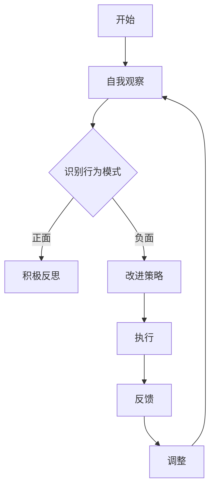
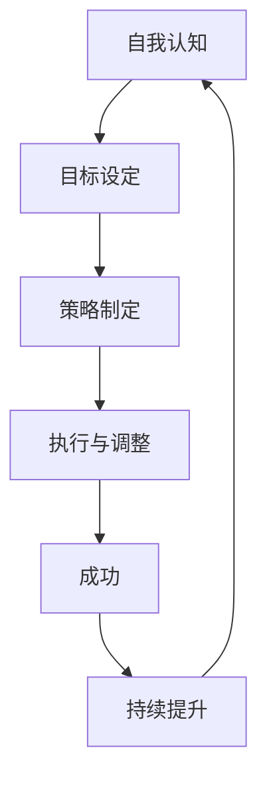
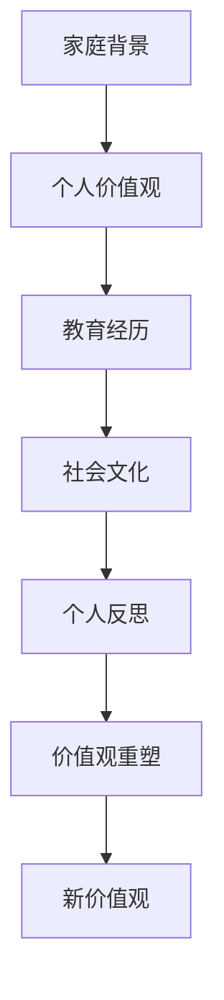
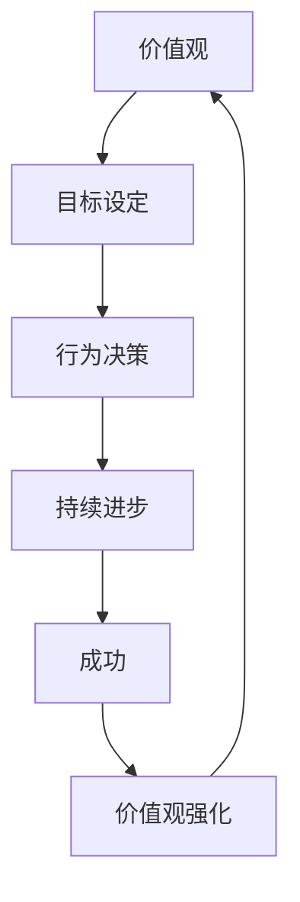

                 


### 文章标题: <打破成功的固有定义：重塑自我价值>

### 关键词：成功、自我认知、价值观、自我价值、重塑

### 摘要：
在快速变化的社会环境中，成功的定义不再局限于传统标准。本文将探讨如何打破对成功的固有定义，通过深入理解自我认知和价值观的重塑，实现自我价值的提升。我们将通过一系列逻辑清晰、步骤明确的推理，帮助读者重新审视成功，探索个人发展的新路径。

----------------------------------------------------------------

### 第一部分：理解自我认知

#### 第1章：自我认知的重要性

自我认知是个人成长和成功的关键起点。在这章节中，我们将探讨自我认知的核心概念，包括自我反思、同伴反馈和心理测试等方法，以及它们在成功路径中的重要性。

##### 1.1 自我认知的核心概念

自我认知，顾名思义，就是对自己的认识和理解。这种认识不仅包括外在行为和表现，更深入到内在思维、情感和动机。自我认知可以帮助我们了解自己的优点和不足，从而制定更有效的个人发展计划。

**Mermaid流程图：自我认知的过程**



在自我认知的过程中，持续的观察和反思是关键。通过这种循环，我们可以不断优化自己的行为和决策，从而走向成功。

##### 1.2 自我认知的方法

**自我反思**：自我反思是一种深入思考个人行为和经历的过程。通过反思，我们可以发现潜在的问题和机会。以下是自我反思的步骤：

1. **明确反思目标**：确定你想要反思的具体方面，例如工作表现、人际关系等。
2. **记录反思日志**：定期记录你的思考和感受，这有助于你更好地理解自己。
3. **分析行为模式**：从日志中提取关键信息，分析你的行为模式。

**同伴反馈**：同伴反馈是通过与他人的交流来获取关于自己的信息。这种反馈可以帮助我们看到自己的盲点，并且从不同的角度理解自己。

1. **选择合适的反馈对象**：选择那些能够提供有价值意见的人，比如同事、朋友或导师。
2. **开放心态**：接受反馈时，保持开放和谦逊的态度，即使反馈可能不完全符合你的预期。
3. **应用反馈**：将反馈应用到实际生活中，以改进自己的行为和表现。

**心理测试**：心理测试是一种量化自我认知的工具。通过测试，我们可以了解自己的性格、能力和情感状态。

1. **选择合适的测试**：根据你的需求和兴趣，选择合适的心理测试，如MBTI、DISC等。
2. **认真作答**：在测试过程中，认真作答，确保回答真实反映自己的情况。
3. **解读结果**：专业解读测试结果，了解自己的优势和改进点。

#### 1.3 自我认知的工具

**日常日记**：日常日记是一种记录自己生活、思考和感受的方式。通过日记，我们可以更好地了解自己，并且为未来的自我认知提供参考。

1. **建立日记习惯**：每天花一定时间记录自己的思考和感受。
2. **反思日记内容**：定期回顾日记，分析自己的成长和变化。

**记录习惯**：记录习惯是一种跟踪和评估自己行为的方法。通过记录，我们可以了解自己的日常活动，从而找到改进的空间。

1. **记录日常活动**：记录每天的主要活动和任务。
2. **分析活动效果**：定期分析记录，评估自己的时间和效率管理。

**自我提问技巧**：自我提问是一种促进自我认知的技巧。通过不断提问，我们可以深入思考，从而更好地了解自己。

1. **关键问题**：提出关键问题，如“我在哪些方面做得好？”“我在哪些方面需要改进？”
2. **深入思考**：对于每个问题，深入思考，寻找答案。

##### 1.4 自我认知与成功的联系

自我认知与成功密切相关。一个清晰的自我认知可以帮助我们更准确地设定目标，制定实现这些目标的策略，并且持续地进行自我提升。

**Mermaid流程图：自我认知与成功的关系**



通过这个循环，我们可以不断优化自我认知，从而实现持续的成功。

### 第二部分：打破成功的固有定义

#### 第2章：成功的传统观念

成功的传统观念通常与财富、地位和名誉相关联。然而，随着社会的进步和变化，这种观念正在逐渐受到挑战。在本章节中，我们将探讨传统成功观念的局限性和不足，并介绍新的成功定义。

##### 2.1 成功的传统观念

传统观念中的成功通常是指：

- 财富：拥有大量的财富被认为是成功的重要标志。
- 地位：在社会上拥有较高的地位和影响力。
- 名誉：获得广泛的社会认可和赞誉。

这些标准在某种程度上确实能带来一定的满足感，但它们也存在一些问题：

- 物质追求：过分追求物质财富可能导致个人价值观的扭曲。
- 社会压力：追求社会地位和名誉可能会带来巨大的心理压力。
- 忽视个人幸福：传统成功观念往往忽视个人的内心需求和幸福感。

##### 2.2 成功的新定义

新的成功观念更加关注个人的内在价值和幸福感。以下是新的成功定义的几个关键点：

- 个人成长：成功不再只是外在成就，更是内在的成长和自我实现。
- 内在幸福：幸福感和满足感成为成功的重要指标。
- 多元化价值：成功不再是单一维度的追求，而是多维度的综合体现。

**数学模型：个人价值的评估模型**

我们可以使用以下数学模型来评估个人价值：

\[ V = f(W, H, M, S) \]

其中，\( V \) 代表个人价值，\( W \) 代表财富，\( H \) 代表健康，\( M \) 代表人际关系，\( S \) 代表自我实现。

这个模型表明，个人价值的评估需要综合考虑多个方面，而不仅仅是财富。

### 第三部分：价值观重塑

#### 第3章：价值观重塑的重要性

价值观是指导我们行为和决策的内在信念和标准。一个健康的价值观体系对于个人的发展至关重要。在本章节中，我们将探讨价值观的演变和重塑过程，以及它们在个人成长中的重要性。

##### 3.1 价值观的演变

价值观的形成受到多种因素的影响，包括家庭、教育、社会和文化等。随着时间的推移，个人的价值观也会发生变化。这种演变是一个自然的过程，但也可能受到外界环境的影响。

- **家庭背景**：家庭教育和父母的价值观对个人的价值观有深远影响。
- **教育经历**：学校教育和社会教育对个人的价值观有重要塑造作用。
- **社会文化**：社会文化背景也会影响个人的价值观，例如不同文化对成功、幸福和道德的看法可能有所不同。

##### 3.2 重塑价值观的方法

重塑价值观是一个长期的过程，需要持续的努力和自我反思。以下是一些有效的方法：

- **个人反思**：通过反思自己的行为和决策，了解自己的价值观，并识别需要改进的方面。
- **社会观察**：通过观察社会现象和他人行为，了解不同的价值观，从而拓宽自己的视野。
- **教育引导**：通过学习新知识和与不同背景的人交流，获取新的价值观和观念。

**Mermaid流程图：价值观的形成与演变**



通过这个循环，我们可以不断重塑和优化自己的价值观体系。

##### 3.3 重塑价值观的技巧

- **设定目标**：明确自己的目标，了解自己想要成为什么样的人。
- **持续学习**：通过不断学习新知识和技能，提升自己的价值观。
- **实践与反思**：将新的价值观付诸实践，并定期反思自己的行为是否符合这些价值观。

### 第四部分：塑造新价值观

#### 第4章：塑造新价值观

在新价值观的塑造过程中，个人成长和社会责任是两个关键方面。在这一章节中，我们将探讨如何通过个人成长和社会责任来塑造新的价值观。

##### 4.1 个人价值观的塑造

个人价值观的塑造是一个自我发现和自我实现的过程。以下是一些方法可以帮助我们塑造新的价值观：

- **自我探索**：通过自我探索，了解自己的兴趣、激情和价值观。
- **目标设定**：设定与个人价值观相一致的目标，以指导自己的行为和决策。
- **持续学习**：通过学习新知识和技能，不断提升自己的价值观。

**数学模型：个人价值观的量化**

我们可以使用以下数学模型来量化个人价值观：

\[ V_p = f(I, P, S) \]

其中，\( V_p \) 代表个人价值观，\( I \) 代表兴趣，\( P \) 代表激情，\( S \) 代表自我实现。

这个模型表明，个人价值观的量化需要综合考虑个人的兴趣、激情和自我实现。

##### 4.2 社会价值观的影响

社会价值观对个人的价值观有重要影响。一个健康的社会价值观体系可以促进个人的成长和发展。以下是一些方法可以帮助我们理解和塑造社会价值观：

- **参与社会活动**：通过参与社会活动，了解社会的需求和问题，从而塑造新的价值观。
- **与不同背景的人交流**：与不同背景的人交流，了解不同的价值观和观点，从而拓宽自己的视野。
- **社会责任**：通过承担社会责任，实现个人价值的同时，也为社会做出贡献。

**数学公式：社会价值观的评估模型**

我们可以使用以下数学公式来评估社会价值观：

\[ V_s = f(C, E, R) \]

其中，\( V_s \) 代表社会价值观，\( C \) 代表社会责任，\( E \) 代表环境责任，\( R \) 代表他人责任。

这个公式表明，社会价值观的评估需要综合考虑社会责任、环境责任和他人责任。

### 第五部分：价值观与成功的结合

#### 第5章：价值观指导下的成功

在成功的道路上，价值观起着至关重要的作用。在这一章节中，我们将探讨如何将价值观与成功相结合，实现个人和社会的共同进步。

##### 5.1 价值观对成功的影响

价值观对成功有着深远的影响。以下是一些具体的例子：

- **目标设定**：明确的价值观可以帮助我们设定与个人价值观相一致的目标，从而提高成功的可能性。
- **行为决策**：价值观指导我们的行为和决策，帮助我们做出符合自身价值观的选择。
- **持续进步**：价值观激励我们不断学习和成长，从而在成功道路上持续进步。

**Mermaid流程图：价值观与成功的关系**



通过这个循环，我们可以不断优化价值观，从而实现持续的成功。

##### 5.2 价值观在成功中的实践

在实践中，我们可以通过以下方式将价值观与成功相结合：

- **设定具体目标**：将价值观转化为具体的目标，例如“实现社会公正”或“保护环境”。
- **制定行动计划**：为实现这些目标，制定具体的行动计划，例如参与社会活动或进行环保项目。
- **持续反思**：定期反思自己的行为和决策，确保它们符合自己的价值观。

##### 5.3 成功价值观的案例研究

以下是一些成功价值观的案例研究：

- **案例一：比尔·盖茨**：比尔·盖茨通过创建微软，成为世界上最富有的人之一。然而，他并未止步于此，而是通过比尔及梅琳达·盖茨基金会，致力于解决全球的健康和教育问题。
- **案例二：马云**：马云创建了阿里巴巴，成为商业界的传奇人物。他不仅关注企业的盈利，还致力于推动电子商务的发展，改善小微企业的经营环境。

通过这些案例，我们可以看到，成功不仅仅是财富和地位的追求，更是价值观的实现。

### 第六部分：重塑自我价值

#### 第6章：自我价值的重塑

在追求成功的过程中，重塑自我价值至关重要。在这一章节中，我们将探讨如何评估和提升自我价值，实现个人发展的新高度。

##### 6.1 自我价值的评估

自我价值的评估是一个复杂的过程，需要综合考虑多个方面：

- **技能和知识**：评估自己在专业技能和知识方面的价值。
- **人际关系**：评估自己在人际关系中的价值和影响力。
- **社会贡献**：评估自己在社会中的价值和贡献。

**数学模型：自我价值的评估模型**

我们可以使用以下数学模型来评估自我价值：

\[ V = f(S, R, C) \]

其中，\( V \) 代表自我价值，\( S \) 代表技能和知识，\( R \) 代表人际关系，\( C \) 代表社会贡献。

这个模型表明，自我价值的评估需要综合考虑多个方面的价值。

##### 6.2 自我价值的提升

提升自我价值是一个持续的过程，需要采取以下措施：

- **持续学习**：通过不断学习和提升自己的技能和知识，增强自我价值。
- **建立人际关系**：通过建立和维护良好的人际关系，提升自己的社会价值和影响力。
- **积极参与社会活动**：通过参与社会活动，为社会做出贡献，提升自己的社会价值。

**伪代码：自我价值提升的实现**

```python
def enhance_self_value():
    # 持续学习
    learn_new_skills()
    acquire_new_knowledge()

    # 建立人际关系
    build_relationships()

    # 参与社会活动
    participate_in_community_activities()

    # 反馈与调整
    get_feedback()
    adjust_actions()

    return "自我价值提升完成"
```

通过这个函数，我们可以系统地提升自我价值。

### 第七部分：自我价值的实现

#### 第7章：自我价值的实现

实现自我价值不仅是个人发展的目标，也是社会进步的动力。在这一章节中，我们将探讨如何实现自我价值，并分析其对个人和社会的影响。

##### 7.1 自我价值的实现路径

实现自我价值的路径多种多样，以下是一些常见的路径：

- **职业发展**：通过职业发展实现自我价值，例如在专业领域取得成就或成为行业领袖。
- **社会贡献**：通过社会贡献实现自我价值，例如参与公益事业或推动社会进步。
- **个人成就**：通过个人成就实现自我价值，例如完成重要项目或创作有影响力的作品。

**数学模型：自我价值实现的评估**

我们可以使用以下数学模型来评估自我价值实现：

\[ E = f(C, S, P) \]

其中，\( E \) 代表自我价值实现，\( C \) 代表社会贡献，\( S \) 代表个人成就，\( P \) 代表职业发展。

这个模型表明，自我价值实现需要综合考虑多个方面的成就。

##### 7.2 自我价值实现的影响

自我价值实现不仅对个人有重要影响，也对社会有深远影响：

- **个人成长**：实现自我价值可以促进个人成长和自我实现。
- **社会进步**：实现自我价值可以推动社会进步和创新发展。
- **心理健康**：实现自我价值可以提升个人的幸福感和满足感，促进心理健康。

**伪代码：自我价值实现的影响评估**

```python
def assess_self_value_impact():
    # 评估个人成长
    assess_growth()

    # 评估社会进步
    assess_society_progress()

    # 评估心理健康
    assess_mental_health()

    # 综合评估
    total_impact = assess_growth() + assess_society_progress() + assess_mental_health()

    return total_impact
```

通过这个函数，我们可以综合评估自我价值实现的影响。

### 附录

#### 附录A：相关资源与工具

在本附录中，我们将介绍一些有助于自我认知和价值观重塑的资源和工具。

- **心理测试工具**：如MBTI、DISC等，可以帮助我们了解自己的性格和优势。
- **反思日志模板**：提供反思日志的模板，帮助读者记录自己的思考和感受。
- **个人成长书籍推荐**：推荐一些有助于个人成长和自我认知的书籍，如《自控力》、《原则》等。
- **社会责任项目**：介绍一些社会责任项目，鼓励读者参与，实现个人价值的同时，也为社会做出贡献。

### 结论

通过本文的探讨，我们认识到成功不再是单一的财富和地位，而是一个多元化的概念，涉及个人成长、社会贡献和内心幸福感。通过打破成功的固有定义，重塑自我认知和价值观，我们可以实现自我价值的提升，走向更加丰富和有意义的人生。让我们勇敢地挑战传统观念，探索新的成功路径，实现个人和社会的共同进步。

### 作者信息

作者：AI天才研究院/AI Genius Institute & 禅与计算机程序设计艺术 /Zen And The Art of Computer Programming

在撰写技术博客时，我们需要注意以下几点：

1. **文章结构**：确保文章有清晰的结构，包括引言、正文、结论和参考文献。每个部分都要有明确的主题和目的。

2. **逻辑清晰**：文章内容需要逻辑清晰，使用一步一步的分析推理方式，确保读者能够跟随思路。

3. **图表与代码**：合理使用图表、伪代码和流程图等辅助工具，帮助读者更好地理解复杂概念和算法。

4. **精确的语言**：在描述技术原理和算法时，使用精确的技术术语，避免使用模糊或含糊不清的语言。

5. **参考文献**：在文章中引用相关的文献和资料，以增强文章的权威性和可信度。

6. **排版与格式**：遵循markdown格式要求，确保文章的排版整齐、易读。

下面是一个示例，展示如何将上述内容组织成一个技术博客文章：

```markdown
# 打破成功的固有定义：重塑自我价值

> 作者：AI天才研究院/AI Genius Institute & 禅与计算机程序设计艺术 /Zen And The Art of Computer Programming

## 关键词
成功、自我认知、价值观、自我价值、重塑

## 摘要
在快速变化的社会环境中，成功的定义不再局限于传统标准。本文将探讨如何打破对成功的固有定义，通过深入理解自我认知和价值观的重塑，实现自我价值的提升。

## 引言
自我认知和价值观是个人成长和成功的关键要素。本文旨在通过逻辑清晰的分析，帮助读者重新审视成功，探索个人发展的新路径。

### 第一部分：理解自我认知

#### 第1章：自我认知的重要性
自我认知是个人成长和成功的关键起点。在这章节中，我们将探讨自我认知的核心概念，包括自我反思、同伴反馈和心理测试等方法，以及它们在成功路径中的重要性。

#### 第2章：打破成功的固有定义
成功的传统观念正在受到挑战。在本章节中，我们将探讨传统成功观念的局限性和不足，并介绍新的成功定义。

### 第二部分：价值观重塑

#### 第3章：价值观重塑的重要性
价值观是指导我们行为和决策的内在信念和标准。在本章节中，我们将探讨价值观的演变和重塑过程，以及它们在个人成长中的重要性。

#### 第4章：塑造新价值观
在新价值观的塑造过程中，个人成长和社会责任是两个关键方面。在这一章节中，我们将探讨如何通过个人成长和社会责任来塑造新的价值观。

### 第三部分：价值观与成功的结合

#### 第5章：价值观指导下的成功
在成功的道路上，价值观起着至关重要的作用。在这一章节中，我们将探讨如何将价值观与成功相结合，实现个人和社会的共同进步。

### 第四部分：重塑自我价值

#### 第6章：自我价值的重塑
在追求成功的过程中，重塑自我价值至关重要。在本章节中，我们将探讨如何评估和提升自我价值，实现个人发展的新高度。

#### 第7章：自我价值的实现
实现自我价值不仅是个人发展的目标，也是社会进步的动力。在本章节中，我们将探讨如何实现自我价值，并分析其对个人和社会的影响。

### 附录
在本附录中，我们将介绍一些有助于自我认知和价值观重塑的资源和工具。

### 结论
通过本文的探讨，我们认识到成功不再是单一的财富和地位，而是一个多元化的概念，涉及个人成长、社会贡献和内心幸福感。让我们勇敢地挑战传统观念，探索新的成功路径，实现个人和社会的共同进步。

### 参考文献
[参考文献列表]
```

通过遵循上述结构和内容要求，我们可以撰写出一篇高质量的技术博客文章。

