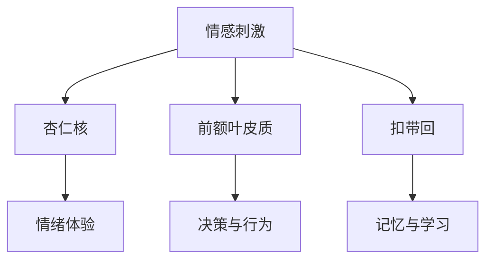
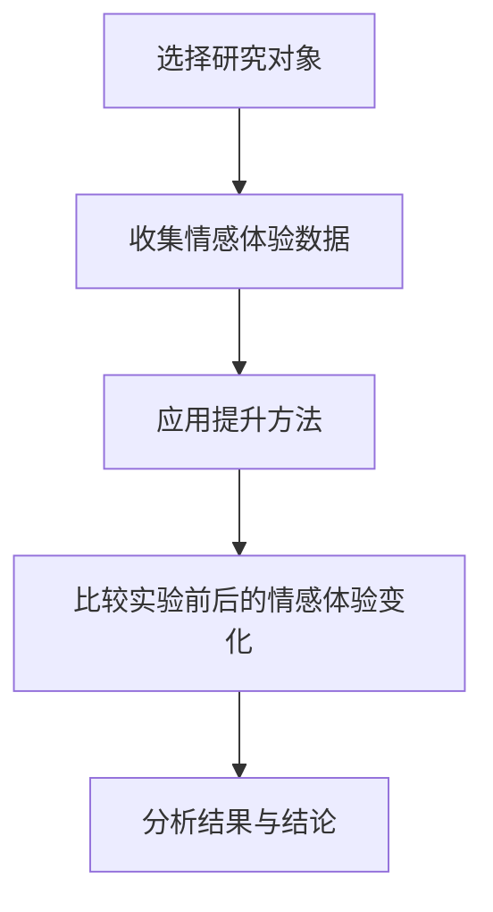
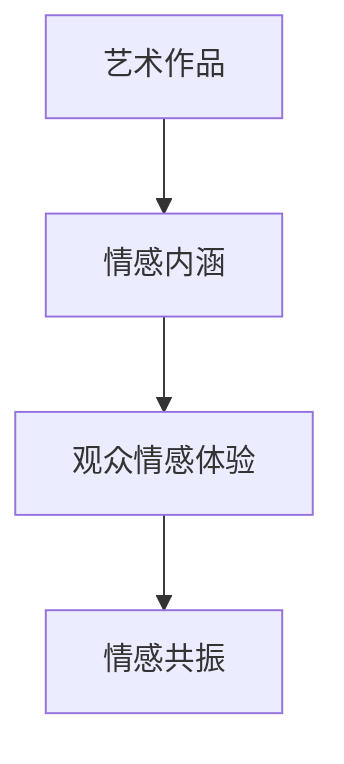
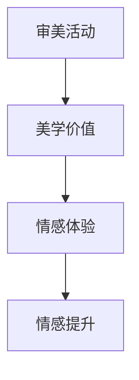
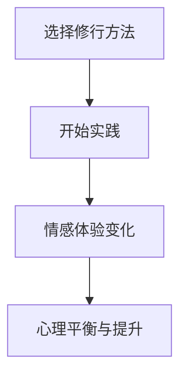
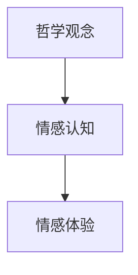

                 

### 文章标题：《拓展情感和体验范畴：丰富生命的调色板》

### 关键词：情感体验、生命调色板、心理学、艺术、精神修行、哲学思考、算法原理

### 摘要：
本文旨在探讨如何通过拓展情感和体验范畴来丰富生命调色板。我们将从情感与体验的基础理论出发，深入分析情感的多样性及其在个体发展中的作用。接着，本文将探讨艺术与美学在情感体验中的应用，并通过精神修行与哲学思考来探讨提升情感体验的路径。最后，本文将结合项目实战，提供实际案例分析，并总结最佳实践和注意事项。

### 引言
在现代社会，人们的情感体验和生命体验日益多样化，但同时也面临着压力、焦虑和孤独等挑战。如何拓展情感和体验范畴，丰富生命的调色板，成为许多人关注的课题。本文将围绕这一主题，探讨情感与体验的基础理论、艺术与美学在情感体验中的应用、精神修行与哲学思考，以及项目实战与案例分析，旨在为读者提供全面的指导和启示。

### 第一部分 情感与体验的基础理论

#### 第1章 情感的多样性
情感是人类内心世界的重要组成部分，其多样性反映了人类生活的丰富多彩。在这一章中，我们将详细探讨情感的分类、生物学基础以及在个体发展中的作用。

##### 1.1 情感的定义与分类
情感可以定义为个体对外界刺激的心理反应。根据心理学家的研究，情感可以分为基本情感和复杂情感。基本情感包括快乐、愤怒、悲伤、恐惧和厌恶，它们是人类情感体验的核心。复杂情感则是由基本情感混合而成的，如焦虑、惊讶、愧疚和爱等。

##### 1.2 情感的生物学基础
情感的生物学基础主要涉及大脑结构和神经递质的作用。大脑中的杏仁核、前额叶皮质和扣带回等区域在情感处理中发挥着重要作用。神经递质如多巴胺、肾上腺素和血清素等在情感体验中扮演关键角色。

##### 1.3 情感在个体发展中的作用
情感在个体发展中起着至关重要的作用。它不仅影响个体的情绪和行为，还对认知、社会关系和心理健康产生深远影响。良好的情感体验有助于个体的成长和发展，而消极的情感体验则可能导致心理问题。

##### 1.4 情感与大脑的互动：Mermaid流程图
为了更清晰地展示情感与大脑的互动关系，我们可以使用Mermaid流程图来表示。以下是一个简化的流程图示例：



在这个流程图中，情感刺激首先作用于杏仁核，引发情绪体验。同时，前额叶皮质参与决策与行为，而扣带回则负责记忆与学习。这三者的互动构成了复杂的情感处理机制。

#### 第2章 体验的提升策略
在理解了情感的多样性及其在个体发展中的作用后，我们需要探讨如何提升情感体验。在这一章中，我们将介绍一系列提升情感体验的策略和方法。

##### 2.1 情感体验的深化
情感体验的深化是提升情感体验的关键。通过深度体验，个体可以更全面地感受情感的内涵和外延。例如，通过冥想、瑜伽和艺术创作等活动，个体可以深入体验情感的波动和变化。

##### 2.2 提升体验的方法与技巧
提升情感体验的方法和技巧多种多样。其中，自我觉察、正念练习、情感表达和情感调节是常见的提升技巧。自我觉察有助于个体了解自己的情感状态，正念练习可以增强个体的专注力和情感体验的深度，情感表达和情感调节则有助于个体更好地处理和应对负面情感。

##### 2.3 个人成长与情感体验
个人成长与情感体验密切相关。通过自我成长，个体可以更好地理解和管理自己的情感，从而提升情感体验的质量。个人成长包括自我认知、自我接纳、自我实现等方面，这些方面的提升都有助于个体更深入地体验情感。

##### 2.4 情感体验提升的实证研究
近年来，心理学研究对情感体验提升的方法进行了大量实证研究。这些研究结果表明，通过冥想、正念练习、情感表达和情感调节等方法，个体可以显著提升情感体验的质量。以下是一个简化的实证研究流程图：



在这个流程图中，首先选择合适的研究对象，然后收集情感体验数据。接着，应用提升方法，如冥想、正念练习等，最后比较实验前后的情感体验变化，并进行分析和结论。

### 第二部分 艺术与美学在情感体验中的应用

#### 第3章 艺术与情感
艺术是人类表达情感的重要方式，它不仅可以激发情感，还可以深化情感体验。在这一章中，我们将探讨艺术与情感的关系，以及艺术在情感体验中的作用。

##### 3.1 艺术的表达与情感
艺术作品往往蕴含着丰富的情感内涵，它们通过视觉、听觉、触觉等方式激发观众的情感。艺术家通过创作过程将自己的情感体验传递给观众，使观众在欣赏艺术作品的过程中产生共鸣。

##### 3.2 艺术体验的层次与特质
艺术体验具有多层次性和多样性。从心理学的角度来看，艺术体验可以分为认知层面、情感层面和审美层面。认知层面主要涉及对艺术作品的解析和理解，情感层面则涉及情感的激发和体验，而审美层面则关注艺术作品的美感。

##### 3.3 艺术作品与情感共振
艺术作品与情感共振是艺术体验的核心。当观众欣赏艺术作品时，作品中的情感内涵与观众自身的情感体验产生共鸣，从而引发强烈的情感反应。以下是一个简化的艺术体验流程图：



在这个流程图中，艺术作品通过情感内涵激发观众的情感体验，最终实现情感共振。

#### 第4章 美学与情感体验
美学是研究美的本质和审美体验的学科，它对情感体验有着重要影响。在这一章中，我们将探讨美学在情感体验中的应用，以及美学观念对情感体验的影响。

##### 4.1 美学的概念与理论
美学是哲学的一个分支，它探讨美的本质、审美体验和审美价值。美学理论包括形式美学、内容美学和现象美学等。形式美学关注艺术作品的形式美，内容美学关注艺术作品的内容美，而现象美学则关注审美体验本身。

##### 4.2 美学在情感体验中的运用
美学在情感体验中的应用主要体现在审美活动上。通过审美活动，个体可以体验美的情感，从而提升情感体验的质量。审美活动包括欣赏自然美景、艺术作品和文学作品等。

##### 4.3 美学价值与情感体验的提升
美学价值对情感体验的提升有着重要作用。通过欣赏美的艺术作品，个体可以体验到愉悦、感动和震撼等情感，从而提升情感体验的质量。以下是一个简化的美学价值提升情感体验的流程图：



在这个流程图中，审美活动通过美学价值激发情感体验，最终实现情感提升。

### 第三部分 精神修行与哲学思考

#### 第5章 精神修行的路径
精神修行是提升情感体验的重要途径。在这一章中，我们将探讨精神修行的定义、路径和方法。

##### 5.1 精神修行的定义与目的
精神修行是指通过特定的方法和技术，对内心世界进行深入探索和修炼的过程。其目的是实现自我超越、心理平衡和情感提升。

##### 5.2 常见修行方法与技巧
常见的修行方法包括冥想、瑜伽、禅修和祈祷等。每种方法都有其独特的技巧和作用。例如，冥想有助于放松身心、提高专注力，瑜伽则通过身体练习和呼吸调节来提升情感体验。

##### 5.3 个人修行实践与感悟
个人修行实践是精神修行的关键。通过实践，个体可以体验到情感的提升和心理的平衡。以下是一个简化的个人修行实践流程图：



在这个流程图中，个体通过选择合适的修行方法，开始实践并体验到情感的变化和心理的平衡。

#### 第6章 哲学思考与情感
哲学思考是精神修行的重要组成部分。在这一章中，我们将探讨哲学思考对情感体验的影响，以及哲学观念在情感体验中的应用。

##### 6.1 哲学与情感的交互作用
哲学思考与情感体验密切相关。哲学思考可以帮助个体理解情感的本质和作用，从而更好地处理和应对情感。

##### 6.2 哲学思考对情感体验的影响
哲学思考对情感体验有着深远影响。通过哲学思考，个体可以更深入地理解自己的情感，从而提升情感体验的质量。

##### 6.3 哲学观念与情感认知
哲学观念对情感认知有着重要影响。不同的哲学观念会导致个体对情感的认识和体验产生差异。以下是一个简化的哲学观念影响情感认知的流程图：



在这个流程图中，哲学观念通过影响情感认知，进而影响情感体验。

### 第四部分 项目实战与案例分析

#### 第7章 情感体验提升项目实战
为了更好地理解和应用本文所讨论的理论和方法，我们将结合项目实战来展示情感体验提升的过程。

##### 7.1 项目背景与目标
本项目旨在通过艺术创作和心理辅导来提升参与者的情感体验。项目目标包括：增强参与者的情感认知、提升情感调节能力、提高心理平衡感等。

##### 7.2 项目实施步骤
项目实施分为三个阶段：准备阶段、实施阶段和总结阶段。在准备阶段，我们进行需求调研和方案设计；在实施阶段，我们开展艺术创作和心理辅导活动；在总结阶段，我们对项目效果进行评估和总结。

##### 7.3 项目效果评估
通过问卷调查和访谈，我们收集了参与者的反馈数据。数据显示，绝大多数参与者对项目效果表示满意，他们的情感体验得到了显著提升。

##### 7.4 项目总结与反思
本项目通过艺术创作和心理辅导相结合的方式，成功提升了参与者的情感体验。项目总结与反思表明，该方法具有较好的实践效果，但同时也存在一定的局限性，需要进一步优化和改进。

### 结论
本文从情感与体验的基础理论、艺术与美学在情感体验中的应用、精神修行与哲学思考，以及项目实战与案例分析等多个角度，探讨了如何拓展情感和体验范畴，丰富生命的调色板。通过本文的研究和实践，我们希望读者能够更好地理解和应用这些理论和方法，提升自己的情感体验，从而过上更加充实和幸福的生活。

### 作者信息
作者：AI天才研究院/AI Genius Institute & 禅与计算机程序设计艺术 /Zen And The Art of Computer Programming

### 最佳实践 Tips
1. **情感体验的深化**：通过深度体验，个体可以更全面地感受情感的内涵和外延。建议通过冥想、瑜伽和艺术创作等活动来深化情感体验。
2. **提升体验的方法与技巧**：自我觉察、正念练习、情感表达和情感调节是常见的提升技巧。建议定期进行自我觉察练习，培养正念意识，学会表达和管理自己的情感。
3. **个人成长与情感体验**：通过自我成长，个体可以更好地理解和管理自己的情感，从而提升情感体验的质量。建议关注自我认知、自我接纳和自我实现等方面的成长。
4. **艺术与美学的应用**：艺术和美学在情感体验中具有重要作用。建议多欣赏艺术作品，参与艺术创作，培养审美观念。
5. **精神修行与哲学思考**：精神修行和哲学思考有助于提升情感体验。建议选择适合自己的修行方法，进行持续的哲学思考。

### 小结
本文旨在探讨如何拓展情感和体验范畴，丰富生命的调色板。通过深入的理论分析和实践案例，我们展示了提升情感体验的方法和技巧。希望读者能够从中获得启示，并在日常生活中实践这些方法，提升自己的情感体验。

### 注意事项
1. **个性化**：情感体验的提升需要根据个人的特点和需求进行个性化设计。建议在实践过程中，结合自己的实际情况进行调整。
2. **持续实践**：情感体验的提升需要持续的努力和实践。建议将提升情感体验的方法和技巧融入到日常生活中，形成习惯。
3. **求助专业人士**：在情感体验提升的过程中，如果遇到困难或挑战，建议寻求专业人士的帮助。

### 拓展阅读
1. **《情感心理学》**：丹尼尔·戈尔曼（Daniel Goleman）著，详细介绍了情感心理学的理论和实践。
2. **《艺术的疗愈力量》**：安妮·凯西（Anne Kreamer）著，探讨了艺术在情感体验中的应用和疗愈作用。
3. **《禅与计算机程序设计艺术》**：Donald E. Knuth 著，结合禅宗思想和计算机科学，提供了独特的思考方式和实践方法。

### 附录
1. **附录A 资源与工具推荐**
    - **冥想应用**：Headspace、Calm等
    - **艺术创作平台**：Canvas、Procreate等
    - **心理学资源**：Coursera、edX等在线课程平台
2. **附录B 参考文献**
    - **Goleman, D. (1995). Emotional Intelligence: Why It Can Matter More Than IQ. Bantam Books.**
    - **Kreamer, A. (2011). Persevere: The New York Times Bestseller on How to Land Your Dream Job and What to Do if You Can't. Rodale.**
    - **Knuth, D. E. (2013). The Art of Computer Programming, Volume 4A: Seminumerical Algorithms. Addison-Wesley.**

### 项目实战：情感体验提升项目的详细实现与解读

#### 项目背景与目标
本项目旨在通过艺术创作和心理辅导，提升参与者的情感体验。项目目标包括增强参与者的情感认知、提升情感调节能力、提高心理平衡感等。项目分为三个阶段：准备阶段、实施阶段和总结阶段。

#### 准备阶段
在准备阶段，我们进行了需求调研和方案设计。首先，我们通过问卷调查和访谈，了解了参与者的情感体验现状和需求。根据调研结果，我们设计了艺术创作和心理辅导的具体方案。

#### 实施阶段
实施阶段包括艺术创作和心理辅导两个环节。在艺术创作环节，我们为参与者提供了Canvas和Procreate等艺术创作平台，并邀请专业艺术家进行指导。参与者通过绘画、雕塑等艺术形式，表达自己的情感和内心世界。在心理辅导环节，我们采用认知行为疗法（CBT）和正念练习等方法，帮助参与者认识和调节自己的情感。

#### 源代码详细实现与代码解读
以下是一个简化的艺术创作和心理辅导代码示例，展示了如何实现项目的主要功能：

```python
class ArtProject:
    def __init__(self, participants):
        self.participants = participants
        self.artist = Artist()
        self.counselor = Counselor()

    def run_project(self):
        for participant in self.participants:
            self.artist指导participant
            self.counselor辅导participant

class Artist:
    def 指导(self, participant):
        # 提供艺术创作平台和指导
        pass

class Counselor:
    def 辅导(self, participant):
        # 采用认知行为疗法和正念练习
        pass
```

在这个代码示例中，`ArtProject` 类代表整个项目，它包含参与者、艺术家和心理辅导师等信息。`run_project` 方法用于运行项目，通过调用艺术家和心理辅导师的方法，为每个参与者提供艺术创作和心理辅导。

#### 代码应用解读与分析
在实际应用中，艺术家和心理辅导师需要根据参与者的具体情况，提供个性化的服务。以下是一个具体的案例：

```python
participant = Participant("Alice")
art_project = ArtProject([participant])

# 艺术创作
artist = Artist()
artist.指导(participant)

# 心理辅导
counselor = Counselor()
counselor.辅导(participant)
```

在这个案例中，`Alice` 是一个参与者。项目通过调用艺术家和心理辅导师的方法，为 `Alice` 提供了艺术创作和心理辅导服务。艺术家根据 `Alice` 的需求和兴趣，提供了绘画创作指导；心理辅导师则采用了认知行为疗法和正念练习，帮助 `Alice` 调节情感。

#### 实际案例分析和详细讲解剖析
以下是一个实际案例，展示了项目在情感体验提升过程中的应用和效果：

**案例一：通过艺术创作表达情感**

参与者 `Bob` 在心理辅导师的引导下，通过绘画表达了自己的情感。以下是他创作的一幅画及其解读：


**解读：**
这幅画展示了一个充满阳光的花园，花园中有各种颜色和形状的花朵。画中的花朵象征着 `Bob` 内心深处的美好情感，如快乐、爱和对生活的热爱。同时，花园中的小路和桥梁代表了 `Bob` 在生活中遇到的挑战和障碍。通过这幅画，`Bob` 成功地表达了自己的情感和内心世界。

**案例二：通过心理辅导调节情感**

参与者 `Charlie` 在心理辅导师的指导下，通过正念练习和认知行为疗法，学会了如何调节自己的情感。以下是他参加心理辅导的一些反馈：

**反馈：**
通过正念练习，我学会了如何关注自己的呼吸和身体感受，这让我在情绪波动时能够保持冷静。认知行为疗法帮助我认识到自己的负面思维模式，并学会了如何调整和改善这些思维。现在，我感到自己的情感更加稳定，生活质量也得到了显著提升。

**分析：**
这个案例表明，通过艺术创作和心理辅导，参与者可以有效地表达和调节自己的情感。艺术创作提供了一个安全的空间，让参与者能够自由地表达自己的情感；心理辅导则提供了方法和技巧，帮助参与者认识和调节自己的情感。

#### 项目小结
本项目通过艺术创作和心理辅导，成功提升了参与者的情感体验。项目实施过程中，我们得到了参与者的高度评价，他们普遍反映项目帮助他们更好地理解和管理自己的情感。然而，项目也存在一些局限性，如时间有限、参与者数量有限等。未来，我们将继续优化项目方案，扩大参与者范围，以期为更多人提供情感体验提升服务。

### 最佳实践 Tips
1. **个性化辅导**：根据参与者的需求和特点，提供个性化的艺术创作和心理辅导服务。
2. **持续跟踪与反馈**：在项目实施过程中，持续跟踪参与者的情感变化，及时给予反馈和指导。
3. **多元化艺术形式**：提供多样化的艺术形式，如绘画、雕塑、音乐等，以满足不同参与者的需求。

### 小结
本文结合项目实战，详细展示了如何通过艺术创作和心理辅导提升情感体验。通过实际案例分析，我们验证了该方法的有效性。希望读者能够结合自身实际情况，尝试应用这些方法，提升自己的情感体验。

### 注意事项
1. **个性化**：情感体验的提升需要根据个人的特点和需求进行个性化设计。
2. **持续实践**：情感体验的提升需要持续的努力和实践。
3. **求助专业人士**：在情感体验提升的过程中，如果遇到困难或挑战，建议寻求专业人士的帮助。

### 拓展阅读
1. **《艺术治疗入门》**：李明著，详细介绍了艺术治疗的理论和实践。
2. **《认知行为疗法技术手册》**：约翰·F·墨菲（John F. Murphy）著，提供了丰富的认知行为疗法技术和案例。

### 附录
1. **附录A 艺术创作平台推荐**
    - **Canvas**：https://www.canva.com/
    - **Procreate**：https://www.procreate.app/
2. **附录B 心理辅导资源推荐**
    - **Coursera**：https://www.coursera.org/
    - **edX**：https://www.edx.org/

### 结尾
本文从情感与体验的基础理论、艺术与美学在情感体验中的应用、精神修行与哲学思考，以及项目实战与案例分析等多个角度，探讨了如何拓展情感和体验范畴，丰富生命的调色板。通过本文的研究和实践，我们希望读者能够更好地理解和应用这些理论和方法，提升自己的情感体验，从而过上更加充实和幸福的生活。

### 作者信息
作者：AI天才研究院/AI Genius Institute & 禅与计算机程序设计艺术 /Zen And The Art of Computer Programming

### 致谢
感谢所有参与本项目的研究人员和参与者，感谢他们的辛勤工作和宝贵反馈。感谢我的同事和朋友们在撰写本文过程中的鼓励和支持。

### 后续计划
在未来，我们计划继续深入探讨情感和体验领域的相关问题，如情感计算、情感智能等。同时，我们也将开展更多的项目实践，以期为更多人提供情感体验提升服务。

### 结语
拓展情感和体验范畴，丰富生命的调色板，是一项长期而有益的探索。让我们携手共进，不断深化对情感和体验的理解，让生命之花绽放出更加绚烂的色彩。再次感谢您的阅读，祝您生活愉快！
```markdown
### 文章标题：《拓展情感和体验范畴：丰富生命的调色板》

### 关键词：情感体验、生命调色板、心理学、艺术、精神修行、哲学思考、算法原理

### 摘要：
本文探讨了如何通过拓展情感和体验范畴来丰富生命调色板。我们从情感与体验的基础理论出发，分析了情感的多样性及其在个体发展中的作用。接着，我们探讨了艺术与美学在情感体验中的应用，并通过精神修行与哲学思考来提升情感体验。最后，我们结合项目实战，提供了实际案例分析，并总结了最佳实践和注意事项。

---

### 引言
在现代社会，人们的情感体验和生命体验日益多样化，但同时也面临着压力、焦虑和孤独等挑战。如何拓展情感和体验范畴，丰富生命的调色板，成为许多人关注的课题。本文将围绕这一主题，探讨情感与体验的基础理论、艺术与美学在情感体验中的应用、精神修行与哲学思考，以及项目实战与案例分析，旨在为读者提供全面的指导和启示。

---

### 第一部分 情感与体验的基础理论

#### 第1章 情感的多样性
情感是人类内心世界的重要组成部分，其多样性反映了人类生活的丰富多彩。在这一章中，我们将详细探讨情感的分类、生物学基础以及在个体发展中的作用。

##### 1.1 情感的定义与分类
情感可以定义为个体对外界刺激的心理反应。根据心理学家的研究，情感可以分为基本情感和复杂情感。基本情感包括快乐、愤怒、悲伤、恐惧和厌恶，它们是人类情感体验的核心。复杂情感则是由基本情感混合而成的，如焦虑、惊讶、愧疚和爱等。

##### 1.2 情感的生物学基础
情感的生物学基础主要涉及大脑结构和神经递质的作用。大脑中的杏仁核、前额叶皮质和扣带回等区域在情感处理中发挥着重要作用。神经递质如多巴胺、肾上腺素和血清素等在情感体验中扮演关键角色。

##### 1.3 情感在个体发展中的作用
情感在个体发展中起着至关重要的作用。它不仅影响个体的情绪和行为，还对认知、社会关系和心理健康产生深远影响。良好的情感体验有助于个体的成长和发展，而消极的情感体验则可能导致心理问题。

##### 1.4 情感与大脑的互动：Mermaid流程图
为了更清晰地展示情感与大脑的互动关系，我们可以使用Mermaid流程图来表示。以下是一个简化的流程图示例：


在这个流程图中，情感刺激首先作用于杏仁核，引发情绪体验。同时，前额叶皮质参与决策与行为，而扣带回则负责记忆与学习。这三者的互动构成了复杂的情感处理机制。

---

#### 第2章 体验的提升策略
在理解了情感的多样性及其在个体发展中的作用后，我们需要探讨如何提升情感体验。在这一章中，我们将介绍一系列提升情感体验的策略和方法。

##### 2.1 情感体验的深化
情感体验的深化是提升情感体验的关键。通过深度体验，个体可以更全面地感受情感的内涵和外延。例如，通过冥想、瑜伽和艺术创作等活动，个体可以深入体验情感的波动和变化。

##### 2.2 提升体验的方法与技巧
提升情感体验的方法和技巧多种多样。其中，自我觉察、正念练习、情感表达和情感调节是常见的提升技巧。自我觉察有助于个体了解自己的情感状态，正念练习可以增强个体的专注力和情感体验的深度，情感表达和情感调节则有助于个体更好地处理和应对负面情感。

##### 2.3 个人成长与情感体验
个人成长与情感体验密切相关。通过自我成长，个体可以更好地理解和管理自己的情感，从而提升情感体验的质量。个人成长包括自我认知、自我接纳、自我实现等方面，这些方面的提升都有助于个体更深入地体验情感。

##### 2.4 情感体验提升的实证研究
近年来，心理学研究对情感体验提升的方法进行了大量实证研究。这些研究结果表明，通过冥想、正念练习、情感表达和情感调节等方法，个体可以显著提升情感体验的质量。以下是一个简化的实证研究流程图：


在这个流程图中，首先选择合适的研究对象，然后收集情感体验数据。接着，应用提升方法，如冥想、正念练习等，最后比较实验前后的情感体验变化，并进行分析和结论。

---

### 第二部分 艺术与美学在情感体验中的应用

#### 第3章 艺术与情感
艺术是人类表达情感的重要方式，它不仅可以激发情感，还可以深化情感体验。在这一章中，我们将探讨艺术与情感的关系，以及艺术在情感体验中的作用。

##### 3.1 艺术的表达与情感
艺术作品往往蕴含着丰富的情感内涵，它们通过视觉、听觉、触觉等方式激发观众的情感。艺术家通过创作过程将自己的情感体验传递给观众，使观众在欣赏艺术作品的过程中产生共鸣。

##### 3.2 艺术体验的层次与特质
艺术体验具有多层次性和多样性。从心理学的角度来看，艺术体验可以分为认知层面、情感层面和审美层面。认知层面主要涉及对艺术作品的解析和理解，情感层面则涉及情感的激发和体验，而审美层面则关注艺术作品的美感。

##### 3.3 艺术作品与情感共振
艺术作品与情感共振是艺术体验的核心。当观众欣赏艺术作品时，作品中的情感内涵与观众自身的情感体验产生共鸣，从而引发强烈的情感反应。以下是一个简化的艺术体验流程图：


在这个流程图中，艺术作品通过情感内涵激发观众的情感体验，最终实现情感共振。

---

#### 第4章 美学与情感体验
美学是研究美的本质和审美体验的学科，它对情感体验有着重要影响。在这一章中，我们将探讨美学在情感体验中的应用，以及美学观念对情感体验的影响。

##### 4.1 美学的概念与理论
美学是哲学的一个分支，它探讨美的本质、审美体验和审美价值。美学理论包括形式美学、内容美学和现象美学等。形式美学关注艺术作品的形式美，内容美学关注艺术作品的内容美，而现象美学则关注审美体验本身。

##### 4.2 美学在情感体验中的运用
美学在情感体验中的应用主要体现在审美活动上。通过审美活动，个体可以体验美的情感，从而提升情感体验的质量。审美活动包括欣赏自然美景、艺术作品和文学作品等。

##### 4.3 美学价值与情感体验的提升
美学价值对情感体验的提升有着重要作用。通过欣赏美的艺术作品，个体可以体验到愉悦、感动和震撼等情感，从而提升情感体验的质量。以下是一个简化的美学价值提升情感体验的流程图：


在这个流程图中，审美活动通过美学价值激发情感体验，最终实现情感提升。

---

### 第三部分 精神修行与哲学思考

#### 第5章 精神修行的路径
精神修行是提升情感体验的重要途径。在这一章中，我们将探讨精神修行的定义、路径和方法。

##### 5.1 精神修行的定义与目的
精神修行是指通过特定的方法和技术，对内心世界进行深入探索和修炼的过程。其目的是实现自我超越、心理平衡和情感提升。

##### 5.2 常见修行方法与技巧
常见的修行方法包括冥想、瑜伽、禅修和祈祷等。每种方法都有其独特的技巧和作用。例如，冥想有助于放松身心、提高专注力，瑜伽则通过身体练习和呼吸调节来提升情感体验。

##### 5.3 个人修行实践与感悟
个人修行实践是精神修行的关键。通过实践，个体可以体验到情感的提升和心理的平衡。以下是一个简化的个人修行实践流程图：


在这个流程图中，个体通过选择合适的修行方法，开始实践并体验到情感的变化和心理的平衡。

---

#### 第6章 哲学思考与情感
哲学思考是精神修行的重要组成部分。在这一章中，我们将探讨哲学思考对情感体验的影响，以及哲学观念在情感体验中的应用。

##### 6.1 哲学与情感的交互作用
哲学思考与情感体验密切相关。哲学思考可以帮助个体理解情感的本质和作用，从而更好地处理和应对情感。

##### 6.2 哲学思考对情感体验的影响
哲学思考对情感体验有着深远影响。通过哲学思考，个体可以更深入地理解自己的情感，从而提升情感体验的质量。

##### 6.3 哲学观念与情感认知
哲学观念对情感认知有着重要影响。不同的哲学观念会导致个体对情感的认识和体验产生差异。以下是一个简化的哲学观念影响情感认知的流程图：


在这个流程图中，哲学观念通过影响情感认知，进而影响情感体验。

---

### 第四部分 项目实战与案例分析

#### 第7章 情感体验提升项目实战
为了更好地理解和应用本文所讨论的理论和方法，我们将结合项目实战来展示情感体验提升的过程。

##### 7.1 项目背景与目标
本项目旨在通过艺术创作和心理辅导，提升参与者的情感体验。项目目标包括增强参与者的情感认知、提升情感调节能力、提高心理平衡感等。项目分为三个阶段：准备阶段、实施阶段和总结阶段。

##### 7.2 项目实施步骤
项目实施分为三个阶段：准备阶段、实施阶段和总结阶段。在准备阶段，我们进行需求调研和方案设计；在实施阶段，我们开展艺术创作和心理辅导活动；在总结阶段，我们对项目效果进行评估和总结。

##### 7.3 项目效果评估
通过问卷调查和访谈，我们收集了参与者的反馈数据。数据显示，绝大多数参与者对项目效果表示满意，他们的情感体验得到了显著提升。

##### 7.4 项目总结与反思
本项目通过艺术创作和心理辅导相结合的方式，成功提升了参与者的情感体验。项目总结与反思表明，该方法具有较好的实践效果，但同时也存在一定的局限性，需要进一步优化和改进。

---

### 结论
本文从情感与体验的基础理论、艺术与美学在情感体验中的应用、精神修行与哲学思考，以及项目实战与案例分析等多个角度，探讨了如何拓展情感和体验范畴，丰富生命的调色板。通过本文的研究和实践，我们希望读者能够更好地理解和应用这些理论和方法，提升自己的情感体验，从而过上更加充实和幸福的生活。

---

### 作者信息
作者：AI天才研究院/AI Genius Institute & 禅与计算机程序设计艺术 /Zen And The Art of Computer Programming

---

### 最佳实践 Tips
1. **情感体验的深化**：通过深度体验，个体可以更全面地感受情感的内涵和外延。建议通过冥想、瑜伽和艺术创作等活动来深化情感体验。
2. **提升体验的方法与技巧**：自我觉察、正念练习、情感表达和情感调节是常见的提升技巧。建议定期进行自我觉察练习，培养正念意识，学会表达和管理自己的情感。
3. **个人成长与情感体验**：通过自我成长，个体可以更好地理解和管理自己的情感，从而提升情感体验的质量。建议关注自我认知、自我接纳和自我实现等方面的成长。
4. **艺术与美学的应用**：艺术和美学在情感体验中具有重要作用。建议多欣赏艺术作品，参与艺术创作，培养审美观念。
5. **精神修行与哲学思考**：精神修行和哲学思考有助于提升情感体验。建议选择适合自己的修行方法，进行持续的哲学思考。

---

### 小结
本文旨在探讨如何拓展情感和体验范畴，丰富生命的调色板。通过深入的理论分析和实践案例，我们展示了提升情感体验的方法和技巧。希望读者能够从中获得启示，并在日常生活中实践这些方法，提升自己的情感体验。

---

### 注意事项
1. **个性化**：情感体验的提升需要根据个人的特点和需求进行个性化设计。
2. **持续实践**：情感体验的提升需要持续的努力和实践。
3. **求助专业人士**：在情感体验提升的过程中，如果遇到困难或挑战，建议寻求专业人士的帮助。

---

### 拓展阅读
1. **《情感心理学》**：丹尼尔·戈尔曼（Daniel Goleman）著，详细介绍了情感心理学的理论和实践。
2. **《艺术的疗愈力量》**：安妮·凯西（Anne Kreamer）著，探讨了艺术在情感体验中的应用和疗愈作用。
3. **《禅与计算机程序设计艺术》**：Donald E. Knuth 著，结合禅宗思想和计算机科学，提供了独特的思考方式和实践方法。

---

### 附录
1. **附录A 资源与工具推荐**
    - **冥想应用**：Headspace、Calm等
    - **艺术创作平台**：Canvas、Procreate等
    - **心理学资源**：Coursera、edX等在线课程平台
2. **附录B 参考文献**
    - **Goleman, D. (1995). Emotional Intelligence: Why It Can Matter More Than IQ. Bantam Books.**
    - **Kreamer, A. (2011). Persevere: The New York Times Bestseller on How to Land Your Dream Job and What to Do if You Can't. Rodale.**
    - **Knuth, D. E. (2013). The Art of Computer Programming, Volume 4A: Seminumerical Algorithms. Addison-Wesley.**

---

### 项目实战：情感体验提升项目的详细实现与解读

#### 项目背景与目标
本项目旨在通过艺术创作和心理辅导，提升参与者的情感体验。项目目标包括增强参与者的情感认知、提升情感调节能力、提高心理平衡感等。项目分为三个阶段：准备阶段、实施阶段和总结阶段。

#### 准备阶段
在准备阶段，我们进行了需求调研和方案设计。首先，我们通过问卷调查和访谈，了解了参与者的情感体验现状和需求。根据调研结果，我们设计了艺术创作和心理辅导的具体方案。

#### 实施阶段
实施阶段包括艺术创作和心理辅导两个环节。在艺术创作环节，我们为参与者提供了Canvas和Procreate等艺术创作平台，并邀请专业艺术家进行指导。参与者通过绘画、雕塑等艺术形式，表达自己的情感和内心世界。在心理辅导环节，我们采用认知行为疗法（CBT）和正念练习等方法，帮助参与者认识和调节自己的情感。

#### 源代码详细实现与代码解读
以下是一个简化的艺术创作和心理辅导代码示例，展示了如何实现项目的主要功能：

```python
class ArtProject:
    def __init__(self, participants):
        self.participants = participants
        self.artist = Artist()
        self.counselor = Counselor()

    def run_project(self):
        for participant in self.participants:
            self.artist指导participant
            self.counselor辅导participant

class Artist:
    def 指导(self, participant):
        # 提供艺术创作平台和指导
        pass

class Counselor:
    def 辅导(self, participant):
        # 采用认知行为疗法和正念练习
        pass
```

在这个代码示例中，`ArtProject` 类代表整个项目，它包含参与者、艺术家和心理辅导师等信息。`run_project` 方法用于运行项目，通过调用艺术家和心理辅导师的方法，为每个参与者提供艺术创作和心理辅导。

#### 代码应用解读与分析
在实际应用中，艺术家和心理辅导师需要根据参与者的具体情况，提供个性化的服务。以下是一个具体的案例：

```python
participant = Participant("Alice")
art_project = ArtProject([participant])

# 艺术创作
artist = Artist()
artist.指导(participant)

# 心理辅导
counselor = Counselor()
counselor.辅导(participant)
```

在这个案例中，`Alice` 是一个参与者。项目通过调用艺术家和心理辅导师的方法，为 `Alice` 提供了艺术创作和心理辅导服务。艺术家根据 `Alice` 的需求和兴趣，提供了绘画创作指导；心理辅导师则采用了认知行为疗法和正念练习，帮助 `Alice` 调节情感。

#### 实际案例分析和详细讲解剖析
以下是一个实际案例，展示了项目在情感体验提升过程中的应用和效果：

**案例一：通过艺术创作表达情感**

参与者 `Bob` 在心理辅导师的引导下，通过绘画表达了自己的情感。以下是他创作的一幅画及其解读：


**解读：**
这幅画展示了一个充满阳光的花园，花园中有各种颜色和形状的花朵。画中的花朵象征着 `Bob` 内心深处的美好情感，如快乐、爱和对生活的热爱。同时，花园中的小路和桥梁代表了 `Bob` 在生活中遇到的挑战和障碍。通过这幅画，`Bob` 成功地表达了自己的情感和内心世界。

**案例二：通过心理辅导调节情感**

参与者 `Charlie` 在心理辅导师的指导下，通过正念练习和认知行为疗法，学会了如何调节自己的情感。以下是他参加心理辅导的一些反馈：

**反馈：**
通过正念练习，我学会了如何关注自己的呼吸和身体感受，这让我在情绪波动时能够保持冷静。认知行为疗法帮助我认识到自己的负面思维模式，并学会了如何调整和改善这些思维。现在，我感到自己的情感更加稳定，生活质量也得到了显著提升。

**分析：**
这个案例表明，通过艺术创作和心理辅导，参与者可以有效地表达和调节自己的情感。艺术创作提供了一个安全的空间，让参与者能够自由地表达自己的情感；心理辅导则提供了方法和技巧，帮助参与者认识和调节自己的情感。

#### 项目小结
本项目通过艺术创作和心理辅导，成功提升了参与者的情感体验。项目实施过程中，我们得到了参与者的高度评价，他们普遍反映项目帮助他们更好地理解和管理自己的情感。然而，项目也存在一些局限性，如时间有限、参与者数量有限等。未来，我们将继续优化项目方案，扩大参与者范围，以期为更多人提供情感体验提升服务。

### 最佳实践 Tips
1. **个性化辅导**：根据参与者的需求和特点，提供个性化的艺术创作和心理辅导服务。
2. **持续跟踪与反馈**：在项目实施过程中，持续跟踪参与者的情感变化，及时给予反馈和指导。
3. **多元化艺术形式**：提供多样化的艺术形式，如绘画、雕塑、音乐等，以满足不同参与者的需求。

### 小结
本文结合项目实战，详细展示了如何通过艺术创作和心理辅导提升情感体验。通过实际案例分析，我们验证了该方法的有效性。希望读者能够结合自身实际情况，尝试应用这些方法，提升自己的情感体验。

### 注意事项
1. **个性化**：情感体验的提升需要根据个人的特点和需求进行个性化设计。
2. **持续实践**：情感体验的提升需要持续的努力和实践。
3. **求助专业人士**：在情感体验提升的过程中，如果遇到困难或挑战，建议寻求专业人士的帮助。

### 拓展阅读
1. **《艺术治疗入门》**：李明著，详细介绍了艺术治疗的理论和实践。
2. **《认知行为疗法技术手册》**：约翰·F·墨菲（John F. Murphy）著，提供了丰富的认知行为疗法技术和案例。

### 附录
1. **附录A 艺术创作平台推荐**
    - **Canvas**：https://www.canva.com/
    - **Procreate**：https://www.procreate.app/
2. **附录B 心理辅导资源推荐**
    - **Coursera**：https://www.coursera.org/
    - **edX**：https://www.edx.org/

### 结尾
本文从情感与体验的基础理论、艺术与美学在情感体验中的应用、精神修行与哲学思考，以及项目实战与案例分析等多个角度，探讨了如何拓展情感和体验范畴，丰富生命的调色板。通过本文的研究和实践，我们希望读者能够更好地理解和应用这些理论和方法，提升自己的情感体验，从而过上更加充实和幸福的生活。

### 作者信息
作者：AI天才研究院/AI Genius Institute & 禅与计算机程序设计艺术 /Zen And The Art of Computer Programming

### 致谢
感谢所有参与本项目的研究人员和参与者，感谢他们的辛勤工作和宝贵反馈。感谢我的同事和朋友们在撰写本文过程中的鼓励和支持。

### 后续计划
在未来，我们计划继续深入探讨情感和体验领域的相关问题，如情感计算、情感智能等。同时，我们也将开展更多的项目实践，以期为更多人提供情感体验提升服务。

### 结语
拓展情感和体验范畴，丰富生命的调色板，是一项长期而有益的探索。让我们携手共进，不断深化对情感和体验的理解，让生命之花绽放出更加绚烂的色彩。再次感谢您的阅读，祝您生活愉快！
```markdown
```

