                 

### 文章标题：拓展生命的广度和深度：丰富人生体验

**关键词**：人生体验，生活质量，内心成长，人际关系，冥想，成功策略

**摘要**：本文旨在探讨如何通过多种方式拓展生命的广度和深度，从而丰富人生体验。文章将从人生体验的多样性、提升生活质量、探索自我、丰富内心世界等方面展开，结合实际案例与策略应用，提供具体的实施方法和技巧。

### 引言

在当今快速变化的社会中，人们越来越重视生活质量和内心体验。拓展生命的广度和深度，不仅有助于提高生活质量，还能让我们在面对挑战时拥有更强大的内心力量。本文将围绕以下主题进行探讨：

1. **人生体验的多样性**：通过多种活动丰富人生体验。
2. **提升生活质量**：从健康生活方式、工作效率和家居环境等方面入手。
3. **探索自我**：通过自我认知、心理韧性、情绪管理提升内心世界。
4. **深化人生体验**：探讨内心成长、人际关系拓展和心灵宁静。
5. **实际案例与策略应用**：借鉴他人经验，设计适合自己的体验路径。

### 人生体验的多样性

#### 体验的类型与价值

**背景介绍**：

人生体验是指人们在生活中所获得的各种感受和经历。这些体验可以分为多种类型，如教育、工作、娱乐、旅行、社交、志愿服务等。每种体验都有其独特的价值和意义。

**核心概念与联系**：

以下是人生体验类型及它们之间的联系架构的Mermaid流程图：

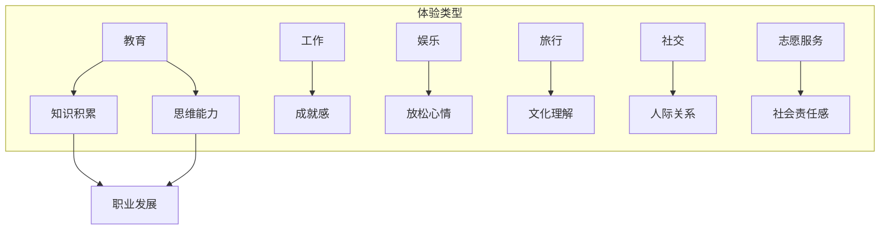

**核心算法原理讲解**：

人生的多样性体验是一个动态过程，可以用以下伪代码来描述：

```
function 人生体验(活动类型，时长，参与人数) {
    if (活动类型 == 教育类型) {
        知识积累 += 时长 * 学习效率
        思维能力 += 时长 * 思维培养系数
    } else if (活动类型 == 工作类型) {
        成就感 += 时长 * 工作效率
    } else if (活动类型 == 娱乐类型) {
        放松心情 += 时长 * 放松效率
    }
    // ... 其他活动类型
    return 人生体验总价值
}
```

**数学模型和公式**：

为了量化人生体验的价值，可以设定以下公式：

$$
价值 = f(时长, 活动类型, 参与度)
$$

其中，$f$ 为函数，$时长$ 表示活动的持续时间，$活动类型$ 表示活动的种类，$参与度$ 表示个人的参与程度。

**举例说明**：

例如，一个人参加了一次为期一周的旅行，期间学习了当地文化，结识了新朋友，这次旅行的人生体验价值可以计算为：

$$
价值 = f(7天, 旅行类型, 80\%参与度)
$$

#### 常见的人生体验活动

**背景介绍**：

常见的人生体验活动包括读书、运动、旅游、社交等。这些活动不仅能够丰富个人的生活，还能提高生活质量。

**核心概念与联系**：

以下是常见的人生体验活动及其之间的联系架构的Mermaid流程图：

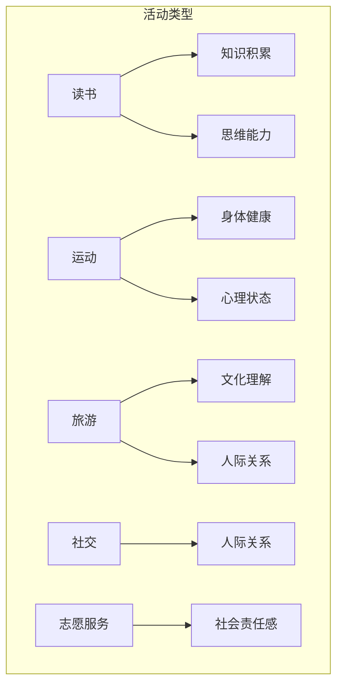

**核心算法原理讲解**：

每种活动都有其独特的核心算法原理，以下分别进行讲解：

1. **读书**：

   读书可以帮助人们获取知识，提升思维能力。核心算法原理如下：

   ```
   function 读书(书名，阅读时间) {
       知识积累 += 阅读时间 * 学习效率
       思维能力 += 阅读时间 * 思维培养系数
   }
   ```

2. **运动**：

   运动能够改善身体健康，提升心理状态。核心算法原理如下：

   ```
   function 运动(运动类型，运动时间) {
       身体健康 += 运动时间 * 运动效果系数
       心理状态 += 运动时间 * 心理调节系数
   }
   ```

3. **旅游**：

   旅游可以扩展人们的视野，提升文化理解能力。核心算法原理如下：

   ```
   function 旅游(目的地，旅行时间) {
       文化理解 += 旅行时间 * 文化了解系数
       人际关系 += 旅行时间 * 社交系数
   }
   ```

4. **社交**：

   社交能够帮助人们建立良好的人际关系。核心算法原理如下：

   ```
   function 社交(社交活动，参与人数，社交时间) {
       人际关系 += 社交时间 * 社交效果系数
   }
   ```

**数学模型和公式**：

为了量化每种活动对人生体验的贡献，可以设定以下公式：

$$
人生体验价值 = \sum_{i=1}^{n} f_i(时长_i, 活动类型_i, 参与度_i)
$$

其中，$n$ 为活动总数，$f_i$ 为第 $i$ 种活动的价值函数。

**举例说明**：

例如，一个人在一个月内参加了以下活动：

- 读书：《人类简史》，阅读时间 20 小时；
- 运动：跑步，每周 3 次，每次 1 小时；
- 旅游：泰国，旅行时间 5 天；
- 社交：参加一次朋友聚会，社交时间 2 小时。

则他的人生体验价值可以计算为：

$$
人生体验价值 = f_1(20小时, 读书类型, 80\%参与度) + f_2(1小时, 运动类型, 100\%参与度) + f_3(5天, 旅游类型, 80\%参与度) + f_4(2小时, 社交类型, 80\%参与度)
$$

#### 如何拓展体验的广度

**背景介绍**：

拓展体验的广度意味着尝试更多类型的活动，从而丰富人生体验。以下是一些方法：

1. **设定目标**：明确自己想要拓展的体验类型，并设定具体的目标。
2. **利用资源**：利用图书馆、互联网等资源，获取相关信息和经验。
3. **寻求帮助**：向朋友、专业人士请教，获取建议和支持。
4. **保持好奇心**：对未知保持好奇，勇于尝试新事物。
5. **定期反思**：定期总结自己的体验，分析哪些活动对自己有较大的帮助。

**核心概念与联系**：

以下是拓展体验广度的方法及其之间的联系架构的Mermaid流程图：

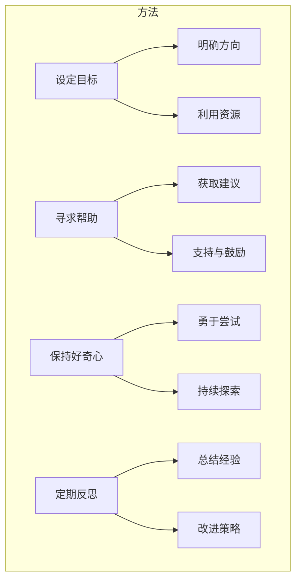

**核心算法原理讲解**：

拓展体验广度的核心算法原理如下：

```
function 拓展体验广度(目标，资源，帮助，好奇心，反思) {
    // 设定目标
    目标达成度 += 设定目标的努力系数
    // 利用资源
    体验广度 += 利用资源的效率系数 * 资源数量
    // 寻求帮助
    帮助效果 += 寻求帮助的支持系数 * 帮助数量
    // 保持好奇心
    好奇心指数 += 好奇心的探索系数 * 尝试新事物的次数
    // 定期反思
    反思效果 += 定期反思的总结系数 * 反思次数
    return 拓展体验广度总价值
}
```

**数学模型和公式**：

为了量化拓展体验广度的效果，可以设定以下公式：

$$
拓展体验广度总价值 = \sum_{i=1}^{n} f_i(目标_i, 资源_i, 帮助_i, 好奇心_i, 反思_i)
$$

其中，$n$ 为方法总数，$f_i$ 为第 $i$ 种方法的贡献值函数。

**举例说明**：

例如，一个人在拓展体验广度的过程中，设定了以下目标：

- 读书：每月至少读一本书；
- 运动：每周至少锻炼三次；
- 旅游：每年至少一次长途旅行；
- 社交：每月至少参加一次社交活动。

他利用以下资源：

- 图书馆：获取读书资源；
- 互联网：查找运动计划和旅游信息；
- 朋友：请教社交建议。

保持好奇心，并定期反思，他的拓展体验广度总价值可以计算为：

$$
拓展体验广度总价值 = f_1(读书目标，图书馆资源，朋友帮助，好奇心，定期反思) + f_2(运动目标，互联网资源，朋友帮助，好奇心，定期反思) + f_3(旅游目标，互联网资源，朋友帮助，好奇心，定期反思) + f_4(社交目标，互联网资源，朋友帮助，好奇心，定期反思)
$$

### 提高生活质量

#### 健康的生活方式

**背景介绍**：

健康的生活方式是提高生活质量的重要因素。它包括合理的饮食、适量的运动、良好的作息等。

**核心概念与联系**：

以下是健康生活方式及其之间的联系架构的Mermaid流程图：

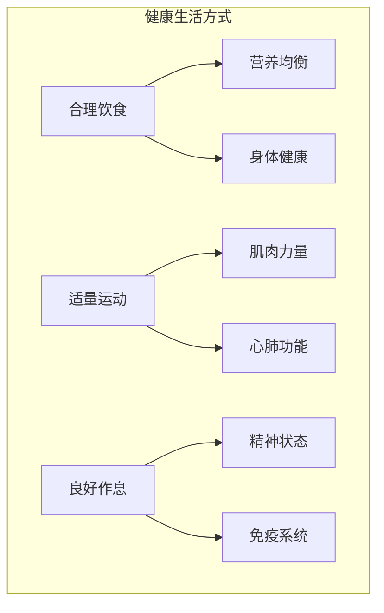

**核心算法原理讲解**：

健康生活方式的核心算法原理如下：

```
function 健康生活方式(饮食，运动，作息) {
    体质指数(BMI) = 饮食摄入热量 / 运动消耗热量
    身体素质 = 运动效果系数 * (肌肉力量 + 心肺功能)
    精神状态 = 作息规律系数 * 免疫系统
    return 健康水平
}
```

**数学模型和公式**：

为了量化健康生活方式的效果，可以设定以下公式：

$$
健康水平 = \sum_{i=1}^{n} f_i(体质指数_i, 身体素质_i, 精神状态_i)
$$

其中，$n$ 为健康生活方式的要素总数，$f_i$ 为第 $i$ 个要素的贡献值函数。

**举例说明**：

例如，一个人的BMI为22，身体素质评分为80分，精神状态评分为90分。他的健康水平可以计算为：

$$
健康水平 = f_1(22, 80, 90)
$$

#### 提高工作效率的方法

**背景介绍**：

工作效率是衡量生活质量的重要指标之一。提高工作效率可以让我们有更多时间享受生活。

**核心概念与联系**：

以下是提高工作效率的方法及其之间的联系架构的Mermaid流程图：

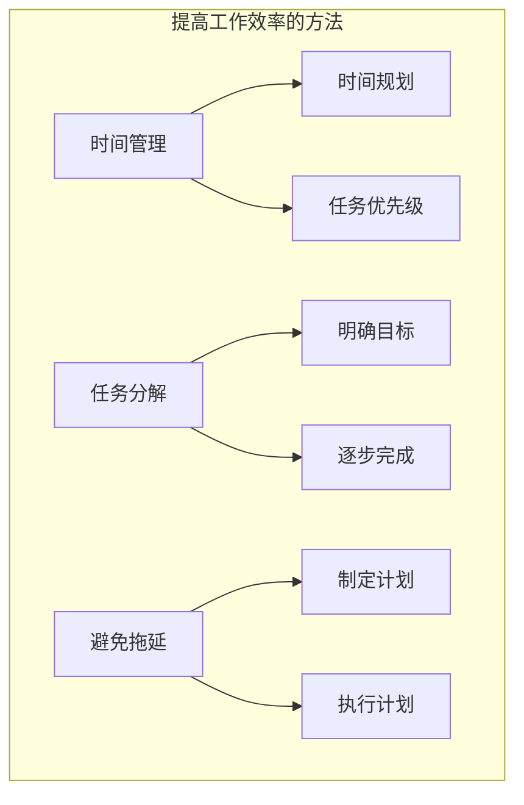

**核心算法原理讲解**：

提高工作效率的核心算法原理如下：

```
function 提高工作效率(时间管理，任务分解，避免拖延) {
    工作效率 = 时间规划系数 * 任务优先级系数 * (明确目标系数 * 逐步完成系数 + 避免拖延系数)
    return 工作效率
}
```

**数学模型和公式**：

为了量化提高工作效率的效果，可以设定以下公式：

$$
工作效率 = \sum_{i=1}^{n} f_i(时间管理_i, 任务分解_i, 避免拖延_i)
$$

其中，$n$ 为提高工作效率的方法总数，$f_i$ 为第 $i$ 个方法的贡献值函数。

**举例说明**：

例如，一个人在提高工作效率的过程中，采用了以下方法：

- 时间管理：每天制定工作计划；
- 任务分解：将大任务分解为小任务；
- 避免拖延：设置提醒和奖励机制。

他的工作效率可以计算为：

$$
工作效率 = f_1(时间管理，任务分解，避免拖延)
$$

#### 舒适家居环境的设计

**背景介绍**：

家居环境对生活质量有着重要影响。一个舒适、整洁的家居环境可以提高居住者的幸福感和满意度。

**核心概念与联系**：

以下是舒适家居环境设计及其之间的联系架构的Mermaid流程图：

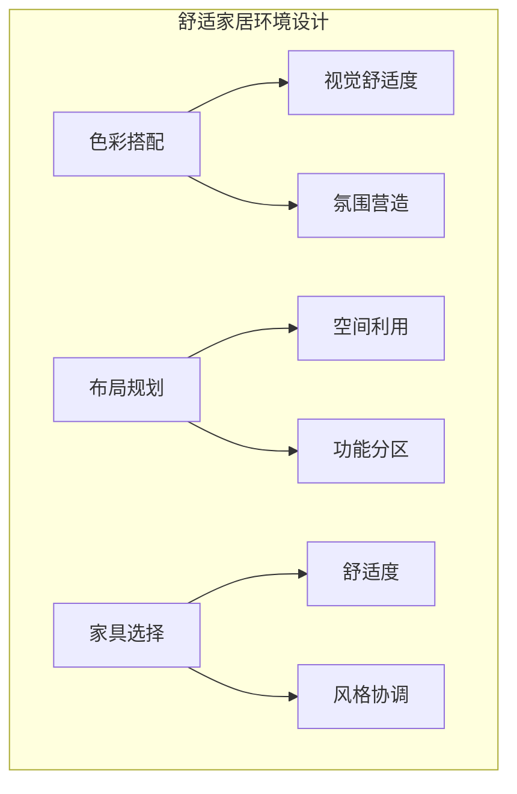

**核心算法原理讲解**：

舒适家居环境设计的核心算法原理如下：

```
function 舒适家居环境设计(色彩搭配，布局规划，家具选择) {
    视觉舒适度 = 色彩搭配系数 * 布局规划系数 * 家具选择系数
    空间利用 = 布局规划系数 * 家具选择系数
    功能分区 = 布局规划系数 * 家具选择系数
    return 舒适家居环境总分
}
```

**数学模型和公式**：

为了量化舒适家居环境设计的效果，可以设定以下公式：

$$
舒适家居环境总分 = \sum_{i=1}^{n} f_i(色彩搭配_i, 布局规划_i, 家具选择_i)
$$

其中，$n$ 为舒适家居环境设计的要素总数，$f_i$ 为第 $i$ 个要素的贡献值函数。

**举例说明**：

例如，一个人在设计和装饰家居时，采用了以下要素：

- 色彩搭配：选择柔和的色调；
- 布局规划：合理利用空间，划分功能区域；
- 家具选择：选择舒适且风格协调的家具。

他的舒适家居环境总分可以计算为：

$$
舒适家居环境总分 = f_1(色彩搭配，布局规划，家具选择)
$$

### 探索自我，丰富内心世界

#### 自我认知的重要性

**背景介绍**：

自我认知是指对自身性格、能力、兴趣等方面的认识。自我认知对于丰富内心世界和提升生活质量具有重要意义。

**核心概念与联系**：

以下是自我认知及其之间的联系架构的Mermaid流程图：

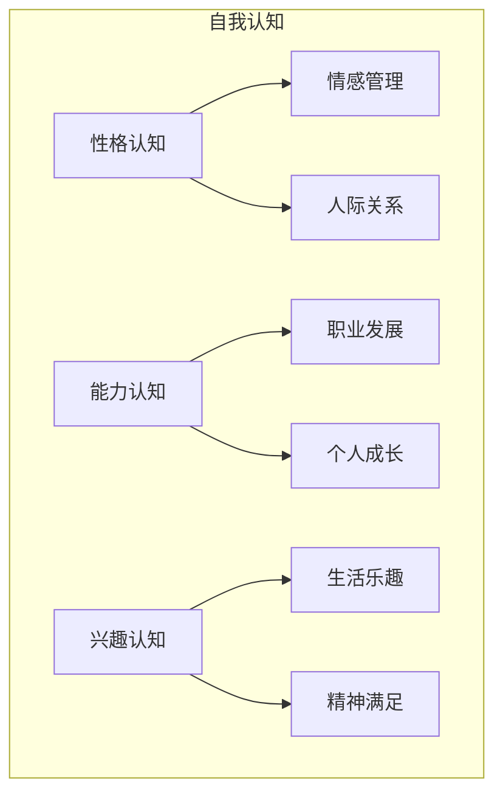

**核心算法原理讲解**：

自我认知的核心算法原理如下：

```
function 自我认知(性格认知，能力认知，兴趣认知) {
    情感管理 = 性格认知系数 * 情感调节系数
    人际关系 = 性格认知系数 * 社交能力系数
    职业发展 = 能力认知系数 * 职业目标设定系数
    个人成长 = 能力认知系数 * 持续学习系数
    生活乐趣 = 兴趣认知系数 * 生活丰富度系数
    精神满足 = 兴趣认知系数 * 精神满足系数
    return 自我认知总分
}
```

**数学模型和公式**：

为了量化自我认知的效果，可以设定以下公式：

$$
自我认知总分 = \sum_{i=1}^{n} f_i(性格认知_i, 能力认知_i, 兴趣认知_i)
$$

其中，$n$ 为自我认知的要素总数，$f_i$ 为第 $i$ 个要素的贡献值函数。

**举例说明**：

例如，一个人的性格认知得分为80分，能力认知得分为90分，兴趣认知得分为75分。他的自我认知总分可以计算为：

$$
自我认知总分 = f_1(性格认知，能力认知，兴趣认知)
$$

#### 增强心理韧性的策略

**背景介绍**：

心理韧性是指个体在面对压力和挑战时的适应能力和恢复能力。增强心理韧性有助于提高生活质量，应对生活中的各种困境。

**核心概念与联系**：

以下是增强心理韧性的策略及其之间的联系架构的Mermaid流程图：

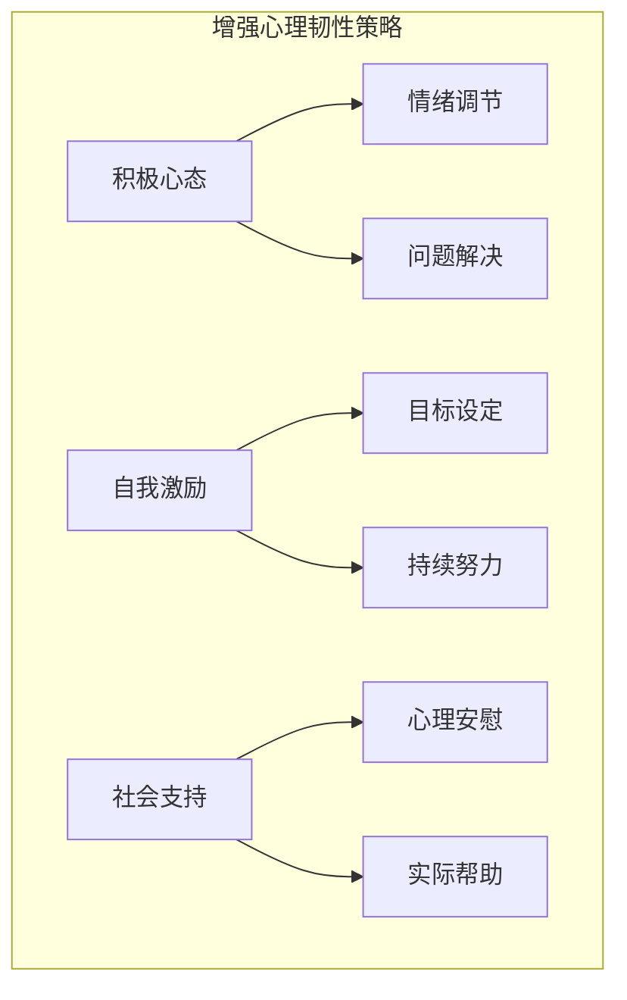

**核心算法原理讲解**：

增强心理韧性的核心算法原理如下：

```
function 增强心理韧性(积极心态，自我激励，社会支持) {
    情绪调节 = 积极心态系数 * 情绪调节系数
    问题解决 = 积极心态系数 * 问题解决能力系数
    自我激励 = 自我激励系数 * 目标设定系数
    持续努力 = 自我激励系数 * 持续努力系数
    心理安慰 = 社会支持系数 * 心理安慰系数
    实际帮助 = 社会支持系数 * 实际帮助系数
    return 心理韧性总分
}
```

**数学模型和公式**：

为了量化增强心理韧性的效果，可以设定以下公式：

$$
心理韧性总分 = \sum_{i=1}^{n} f_i(积极心态_i, 自我激励_i, 社会支持_i)
$$

其中，$n$ 为增强心理韧性的要素总数，$f_i$ 为第 $i$ 个要素的贡献值函数。

**举例说明**：

例如，一个人在增强心理韧性的过程中，采用了以下策略：

- 积极心态：保持乐观态度；
- 自我激励：设定短期和长期目标；
- 社会支持：寻求家人和朋友的支持。

他的心理韧性总分可以计算为：

$$
心理韧性总分 = f_1(积极心态，自我激励，社会支持)
$$

#### 情绪管理的技巧

**背景介绍**：

情绪管理是指通过有效的方法和策略，调节和控制自己的情绪，使其有利于自身发展和生活质量。

**核心概念与联系**：

以下是情绪管理技巧及其之间的联系架构的Mermaid流程图：

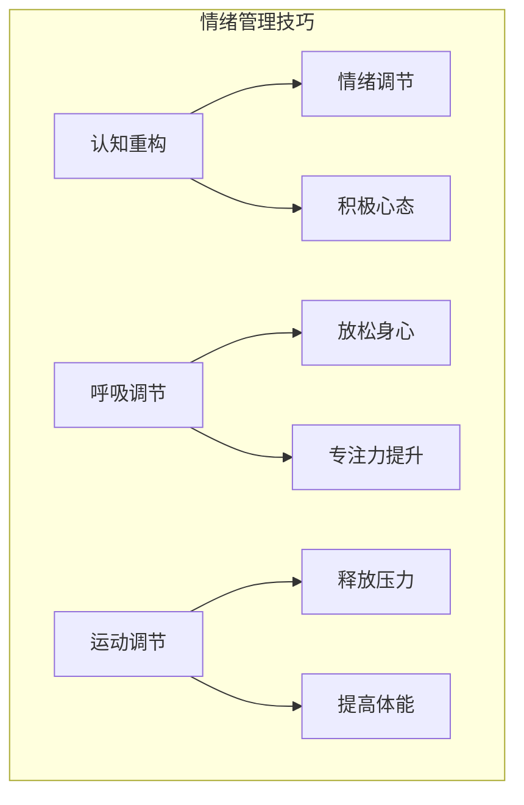

**核心算法原理讲解**：

情绪管理的核心算法原理如下：

```
function 情绪管理(认知重构，呼吸调节，运动调节) {
    情绪调节 = 认知重构系数 * 呼吸调节系数 * 运动调节系数
    放松身心 = 呼吸调节系数 * 运动调节系数
    专注力提升 = 呼吸调节系数 * 运动调节系数
    释放压力 = 运动调节系数 * 情绪调节系数
    提高体能 = 运动调节系数 * 情绪调节系数
    return 情绪管理总分
}
```

**数学模型和公式**：

为了量化情绪管理的效果，可以设定以下公式：

$$
情绪管理总分 = \sum_{i=1}^{n} f_i(认知重构_i, 呼吸调节_i, 运动调节_i)
$$

其中，$n$ 为情绪管理技巧的总数，$f_i$ 为第 $i$ 个技巧的贡献值函数。

**举例说明**：

例如，一个人在情绪管理过程中，采用了以下技巧：

- 认知重构：通过积极的角度看待问题；
- 呼吸调节：练习深呼吸；
- 运动调节：进行有氧运动。

他的情绪管理总分可以计算为：

$$
情绪管理总分 = f_1(认知重构，呼吸调节，运动调节)
$$

### 深化人生体验的深度

#### 内心成长与自我提升

**背景介绍**：

内心成长和自我提升是拓展生命深度的重要途径。通过不断学习和实践，我们可以更好地认识自己，提升内心力量。

**核心概念与联系**：

以下是内心成长与自我提升的核心概念及其之间的联系架构的Mermaid流程图：

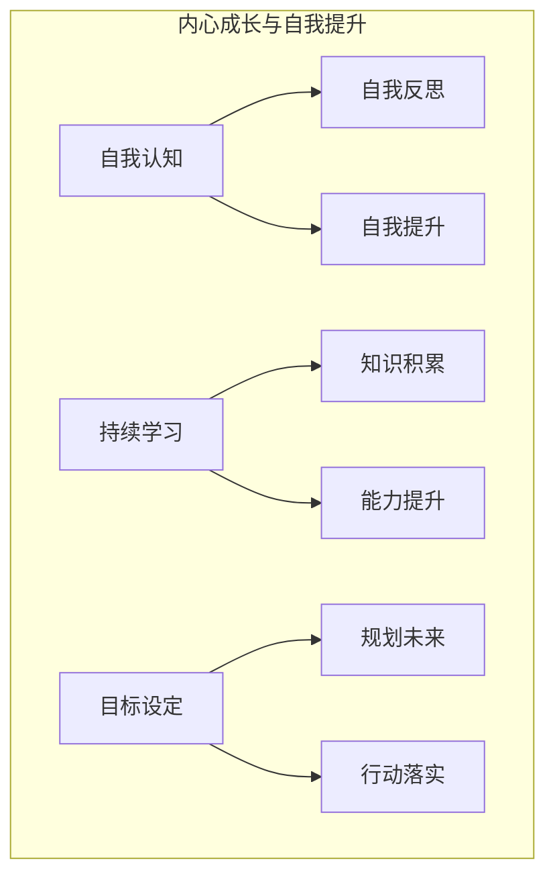

**核心算法原理讲解**：

内心成长与自我提升的核心算法原理如下：

```
function 内心成长与自我提升(自我认知，持续学习，目标设定) {
    自我反思 = 自我认知系数 * 自我提升系数
    知识积累 = 持续学习系数 * 学习效率
    能力提升 = 持续学习系数 * 学习效果
    规划未来 = 目标设定系数 * 规划效果
    行动落实 = 目标设定系数 * 执行力
    return 内心成长总分
}
```

**数学模型和公式**：

为了量化内心成长与自我提升的效果，可以设定以下公式：

$$
内心成长总分 = \sum_{i=1}^{n} f_i(自我认知_i, 持续学习_i, 目标设定_i)
$$

其中，$n$ 为内心成长与自我提升的要素总数，$f_i$ 为第 $i$ 个要素的贡献值函数。

**举例说明**：

例如，一个人在内心成长与自我提升的过程中，采用了以下要素：

- 自我认知：通过反思和总结，了解自己的优点和不足；
- 持续学习：每天阅读专业书籍，提升知识水平；
- 目标设定：设定短期和长期目标，明确前进方向。

他的内心成长总分可以计算为：

$$
内心成长总分 = f_1(自我认知，持续学习，目标设定)
$$

#### 人际关系的拓展

**背景介绍**：

人际关系是人类社会交往的重要组成部分，拓展人际关系有助于丰富内心世界，提高生活质量。

**核心概念与联系**：

以下是人际关系拓展的核心概念及其之间的联系架构的Mermaid流程图：

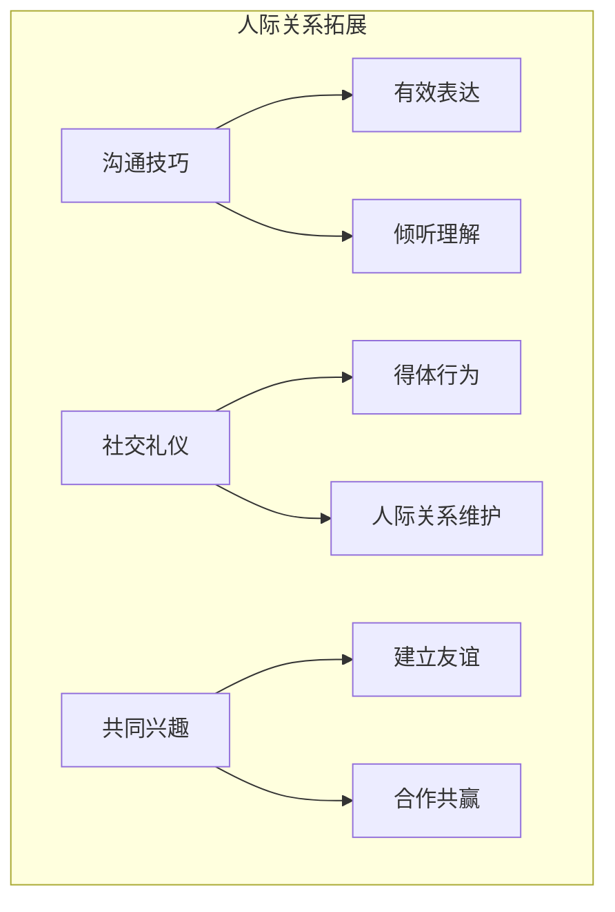

**核心算法原理讲解**：

人际关系拓展的核心算法原理如下：

```
function 人际关系拓展(沟通技巧，社交礼仪，共同兴趣) {
    有效表达 = 沟通技巧系数 * 表达效果
    倾听理解 = 沟通技巧系数 * 倾听能力
    得体行为 = 社交礼仪系数 * 礼貌程度
    人际关系维护 = 社交礼仪系数 * 维护效果
    建立友谊 = 共同兴趣系数 * 相互吸引力
    合作共赢 = 共同兴趣系数 * 合作效果
    return 人际关系总分
}
```

**数学模型和公式**：

为了量化人际关系拓展的效果，可以设定以下公式：

$$
人际关系总分 = \sum_{i=1}^{n} f_i(沟通技巧_i, 社交礼仪_i, 共同兴趣_i)
$$

其中，$n$ 为人际关系拓展的要素总数，$f_i$ 为第 $i$ 个要素的贡献值函数。

**举例说明**：

例如，一个人在拓展人际关系的过程中，采用了以下要素：

- 沟通技巧：提高自己的表达能力和倾听能力；
- 社交礼仪：注重礼貌和得体行为；
- 共同兴趣：寻找志同道合的朋友。

他的人际关系总分可以计算为：

$$
人际关系总分 = f_1(沟通技巧，社交礼仪，共同兴趣)
$$

#### 心灵宁静与冥想

**背景介绍**：

心灵宁静是指通过冥想等方式，使内心保持平静和专注。冥想是一种古老的心灵修行方法，对于缓解压力、提升心理韧性具有显著效果。

**核心概念与联系**：

以下是心灵宁静与冥想的核心概念及其之间的联系架构的Mermaid流程图：

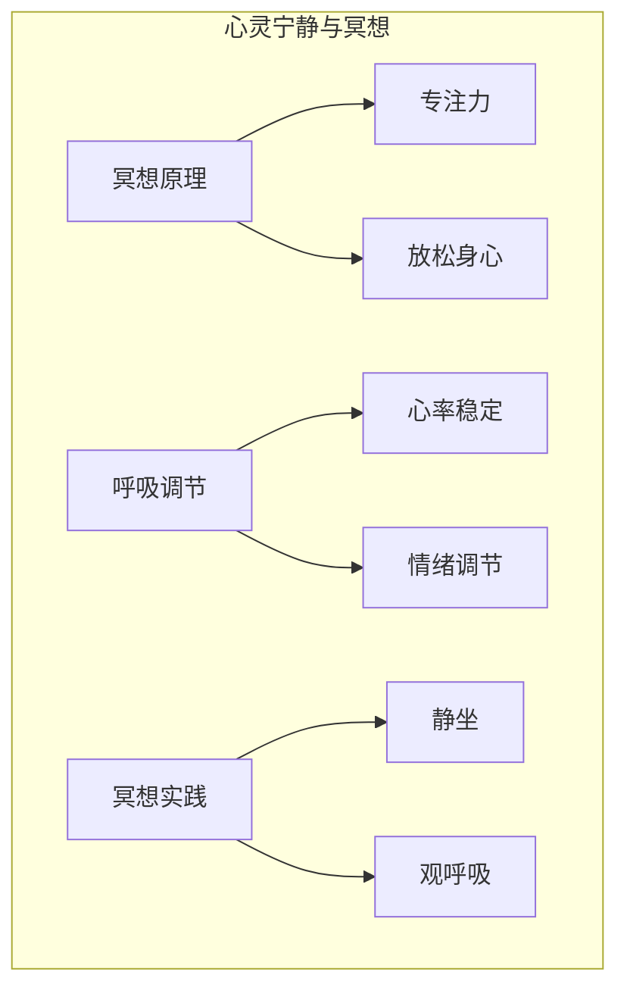

**核心算法原理讲解**：

心灵宁静与冥想的核心算法原理如下：

```
function 心灵宁静与冥想(冥想原理，呼吸调节，冥想实践) {
    专注力 = 冥想原理系数 * 呼吸调节系数
    放松身心 = 呼吸调节系数 * 冥想实践系数
    心率稳定 = 呼吸调节系数 * 冥想实践系数
    情绪调节 = 呼吸调节系数 * 冥想实践系数
    return 心灵宁静总分
}
```

**数学模型和公式**：

为了量化心灵宁静与冥想的效果，可以设定以下公式：

$$
心灵宁静总分 = \sum_{i=1}^{n} f_i(冥想原理_i, 呼吸调节_i, 冥想实践_i)
$$

其中，$n$ 为心灵宁静与冥想的要素总数，$f_i$ 为第 $i$ 个要素的贡献值函数。

**举例说明**：

例如，一个人在练习冥想的过程中，采用了以下要素：

- 冥想原理：了解冥想的本质和目的；
- 呼吸调节：掌握正确的呼吸方法；
- 冥想实践：定期进行静坐和观呼吸。

他的心灵宁静总分可以计算为：

$$
心灵宁静总分 = f_1(冥想原理，呼吸调节，冥想实践)
$$

### 实际案例与策略应用

#### 成功的人生体验案例

**背景介绍**：

成功的人生体验案例为我们提供了宝贵的经验和启示。以下是一些成功的人生体验案例及其分析。

**案例1：李华的读书之旅**

李华是一名职场人士，他决定每年至少阅读12本书，涵盖不同领域。他在阅读过程中，不仅提高了知识储备，还培养了批判性思维和沟通能力。

**分析**：

- **核心概念与联系**：

  ```mermaid
  graph TD
      A[知识积累] --> B[批判性思维]
      A --> C[沟通能力]
      D[阅读频率] --> E[学习效率]
      D --> F[知识储备]

      subgraph 案例分析
          A
          B
          C
          D
          E
          F
      end
  ```

- **核心算法原理讲解**：

  ```
  function 读书之旅(阅读频率，知识领域) {
      知识积累 = 阅读频率 * 学习效率
      批判性思维 = 知识积累 * 批判性思维系数
      沟通能力 = 知识积累 * 沟通能力系数
      return 人生体验总分
  }
  ```

- **数学模型和公式**：

  $$
  人生体验总分 = f_1(阅读频率) + f_2(知识领域)
  $$

- **举例说明**：

  李华每年阅读12本书，涵盖了科技、历史、哲学等领域。他的读书之旅总分可以计算为：

  $$
  人生体验总分 = f_1(12本/年) + f_2(\text{科技、历史、哲学})
  $$

**案例2：张强的运动生活**

张强是一名IT从业者，他意识到运动对身心健康的积极作用，开始坚持每天锻炼。他选择了跑步、游泳和瑜伽等多种运动方式，以保持身体的活力和心灵的平静。

**分析**：

- **核心概念与联系**：

  ```mermaid
  graph TD
      A[身体健康] --> B[心理状态]
      C[运动方式] --> D[运动频率]
      E[运动效果] --> F[成就感]

      subgraph 案例分析
          A
          B
          C
          D
          E
          F
      end
  ```

- **核心算法原理讲解**：

  ```
  function 运动生活(运动方式，运动频率，运动效果) {
      身体健康 = 运动效果 * 身体健康系数
      心理状态 = 运动效果 * 心理调节系数
      成就感 = 运动频率 * 成就感系数
      return 人生体验总分
  }
  ```

- **数学模型和公式**：

  $$
  人生体验总分 = \sum_{i=1}^{n} f_i(运动方式_i, 运动频率_i, 运动效果_i)
  $$

- **举例说明**：

  张强每天锻炼1小时，选择了跑步、游泳和瑜伽。他的运动生活总分可以计算为：

  $$
  人生体验总分 = f_1(\text{跑步}) + f_2(\text{游泳}) + f_3(\text{瑜伽})
  $$

#### 分析成功的共通点

通过分析上述案例，我们可以发现成功的共通点：

1. **明确目标**：每个案例都有明确的人生目标，如李华的读书之旅、张强的运动生活。
2. **持续行动**：成功的人生体验需要持续的努力和实践，如李华每年阅读12本书，张强每天锻炼1小时。
3. **多样化体验**：不同类型的体验有助于拓展人生的广度和深度，如李华的读书之旅涵盖了多个领域，张强选择了多种运动方式。
4. **积极心态**：保持积极的心态，面对挑战和困难时能够保持冷静和乐观。

#### 设计适合自己的体验路径

为了设计适合自己的体验路径，可以遵循以下步骤：

1. **自我分析**：了解自己的兴趣、优势、需求等，明确人生目标。
2. **资源整合**：利用各种资源，如书籍、网络、导师、朋友等，获取相关的知识和经验。
3. **制定计划**：根据自我分析和资源整合的结果，制定具体的人生体验计划。
4. **持续优化**：在实践过程中，不断反思和调整，以适应不断变化的环境和需求。

### 策略实施与效果评估

#### 制定个人成长计划

为了实现人生体验的丰富和拓展，制定个人成长计划至关重要。以下是一个简单的个人成长计划模板：

1. **目标设定**：明确自己的人生目标，如提升技能、拓展人际关系、丰富内心世界等。
2. **行动计划**：列出具体的行动步骤，如每天阅读30分钟、每周参加一次社交活动、每月参加一次户外运动等。
3. **时间安排**：为每个行动步骤设定具体的时间，如每天早晨7:00-7:30阅读、每周五晚上8:00-10:00参加社交活动等。
4. **执行与监督**：定期检查计划的执行情况，如每周回顾自己的行动，根据实际情况进行调整。

#### 实践中的调整与优化

在实施个人成长计划的过程中，可能会遇到以下问题：

1. **执行力不足**：解决方法：设定明确的奖励机制，提高执行力。
2. **缺乏动力**：解决方法：寻找志同道合的伙伴，共同进步。
3. **时间冲突**：解决方法：合理调整计划，确保每个行动步骤都有足够的时间。

#### 成果评估与反馈

为了评估个人成长计划的成果，可以采用以下方法：

1. **定期回顾**：每周或每月对计划的执行情况进行回顾，分析存在的问题和改进的方向。
2. **目标调整**：根据实际情况，对目标进行适当的调整，确保计划的可实施性。
3. **持续反馈**：向家人、朋友、导师等寻求反馈，了解自己的进步和不足。

### 附录

#### 附录A：常用的人生体验拓展工具与资源

1. **书籍**：
   - 《如何阅读一本书》
   - 《思考，快与慢》
   - 《非暴力沟通》
   - 《原则》

2. **在线资源**：
   - 网易云课堂：提供各种在线课程；
   - Coursera：国际知名的教育平台；
   - TED：演讲类视频资源。

3. **应用程序**：
   - “运动吧”：记录运动数据，提供运动建议；
   - “得到”：提供各类书籍的精华内容；
   - “番茄钟”：提高专注力的应用。

#### 附录B：心灵成长的相关书籍推荐

1. 《静坐冥想入门》
2. 《正念：一条新道路，走出抑郁和焦虑》
3. 《心灵鸡汤：阳光心态，快乐人生》
4. 《生命的智慧：幸福生活的指南》

### 结束语

通过拓展生命的广度和深度，我们可以丰富人生体验，提升生活质量，塑造健康心态，丰富内心世界。让我们从现在开始，积极行动，为自己的人生增添更多色彩和意义。作者：AI天才研究院/AI Genius Institute & 禅与计算机程序设计艺术/Zen And The Art of Computer Programming。

