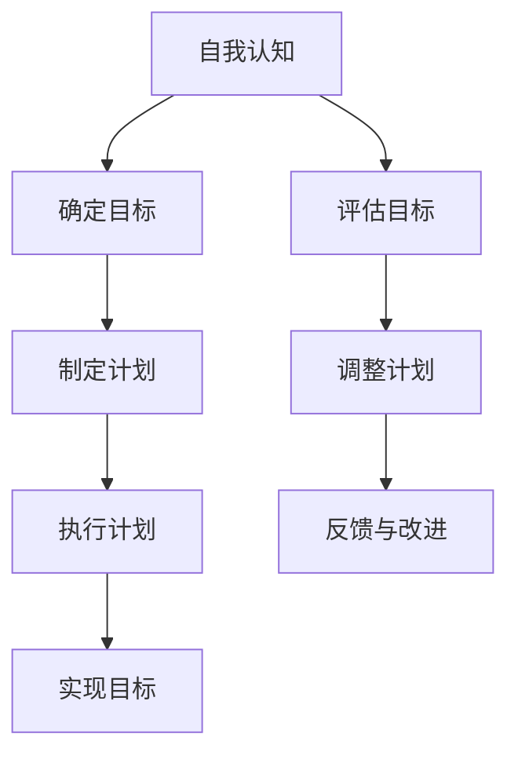
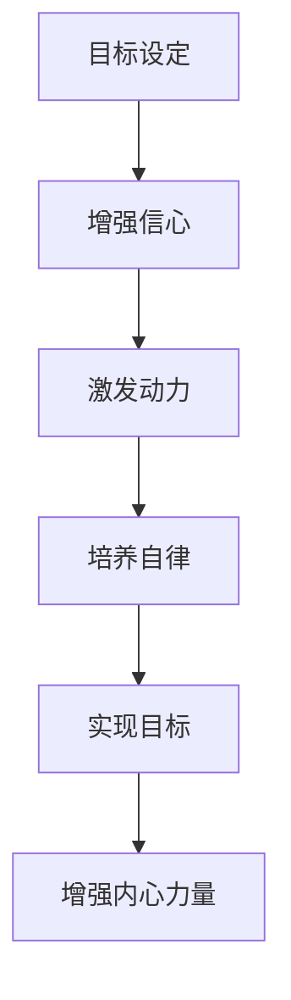
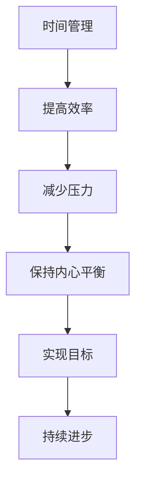
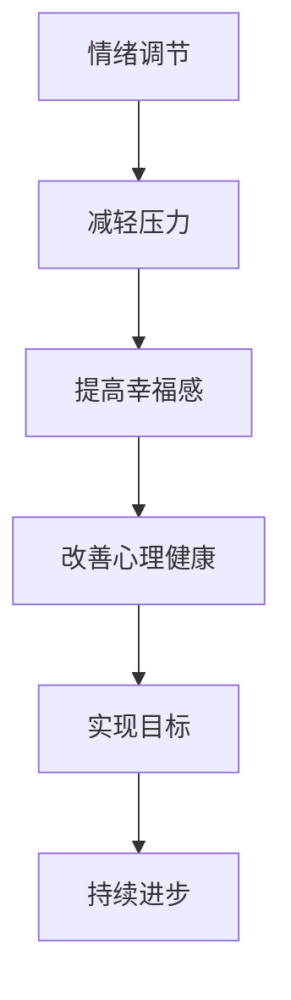
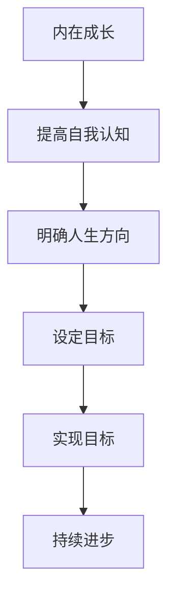
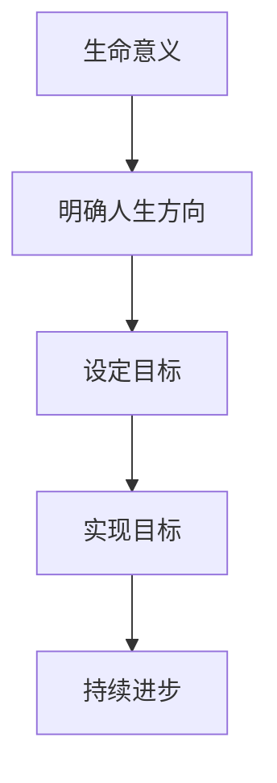

                 


# 掌控人生方向：成为内心的舵手

## 关键词
- 人生规划
- 自我认知
- 心灵成长
- 时间管理
- 情绪调节
- 内在成长

## 摘要
在当今快节奏的社会中，掌控人生方向成为了许多人追求的目标。本文将带领读者一步一步分析如何成为内心的舵手，掌握人生方向。我们将探讨自我认知、人生目标设定、时间管理、情绪调节和内在成长等方面的核心概念和联系，使用伪代码、Mermaid流程图和具体案例来深入讲解，帮助读者理解并实践这些技巧。

---

## 第一部分：自我认知与人生规划

### 第1章：理解自我

#### 1.1 自我认知的概念

自我认知是一个人对自己心理状态、行为和特质的理解。它不仅影响我们的自我评价，还决定了我们的人生方向。以下是自我认知的一些核心概念：

$$
自我认知 = 自我感知 + 自我反思 + 自我接受
$$

自我感知是指个体对自己的感知和觉察，包括外貌、性格、能力和价值观等。自我反思是指个体对自身行为和经历的思考，以识别优点和改进空间。自我接受是指个体对自己的接纳和包容，无论优点还是缺点。

#### 1.2 自我分析的技巧

自我分析是提高自我认知的重要方法。以下是一些常用的技巧：

- **SWOT分析**：SWOT分析是一种常用的自我分析工具，用于评估个人的优势（Strengths）、劣势（Weaknesses）、机会（Opportunities）和威胁（Threats）。
  
  ```mermaid
  graph TD
  A[SWOT分析] --> B[优势]
  A --> C[劣势]
  A --> D[机会]
  A --> E[威胁]
  B --> F[自信]
  C --> G[改进]
  D --> H[利用]
  E --> I[应对]
  ```

- **角色扮演**：角色扮演是一种模拟不同角色和情境，以了解自己在不同环境下的行为和反应的方法。

#### 1.3 自我认知与人生方向的关系

自我认知是设定人生目标的基础。只有深入了解自己的优势、劣势和价值观，才能设定与自身相符的目标，并为之努力。以下是自我认知与人生方向之间关系的Mermaid流程图：



---

## 第二部分：设定和实现人生目标

### 第2章：人生目标的设定

#### 2.1 人生目标的定义

人生目标是指一个人在人生中希望实现的目标和愿景。设定明确的人生目标有助于提供方向感和动力。以下是人生目标的一些核心定义：

- **短期目标**：在一年内希望实现的目标。
- **中期目标**：在三年内希望实现的目标。
- **长期目标**：在五年以上希望实现的目标。

#### 2.2 目标设定的方法

设定人生目标需要遵循SMART原则，即目标应该是具体的（Specific）、可测量的（Measurable）、可实现的（Achievable）、相关的（Relevant）和有时限的（Time-bound）。

- **目标分解**：将大目标分解为小目标，以便更容易实现。

  ```mermaid
  graph TD
  A[大目标] --> B[小目标1]
  A --> C[小目标2]
  A --> D[小目标3]
  ```

- **步骤规划**：制定实现目标的详细步骤和时间表。

  ```mermaid
  graph TD
  A[目标] --> B[步骤1]
  B --> C[步骤2]
  C --> D[步骤3]
  D --> E[完成目标]
  ```

#### 2.3 目标设定与内心力量的关系

设定和实现人生目标需要坚定的内心力量。以下是目标设定与内心力量之间关系的Mermaid流程图：



---

## 第三部分：时间管理与效率提升

### 第3章：时间管理技巧

#### 3.1 时间管理的重要性

时间管理是一个人能否高效实现人生目标的关键。以下是时间管理的重要性：

- **提高工作效率**：合理利用时间可以减少加班，提高工作效率。
- **增加自由时间**：合理安排时间可以给自己更多的自由时间，用于休息和娱乐。
- **保持身心健康**：时间管理有助于减少压力，提高身心健康。

#### 3.2 时间管理的具体方法

以下是一些时间管理的具体方法：

- **托马斯·艾德伦时间管理法**：这是一种基于优先级和时间安排的时间管理方法，其核心思想是：
  
  ```mermaid
  graph TD
  A[紧急] --> B[重要]
  A --> C[不重要]
  B --> D[重要且紧急]
  B --> E[重要但不紧急]
  C --> F[紧急但不重要]
  C --> G[不重要且不紧急]
  ```

- **记录和分析时间**：记录每天的时间使用情况，分析时间浪费的原因，并制定改进计划。

#### 3.3 时间管理中的内心平衡

时间管理不仅关乎效率和目标实现，还关乎内心平衡。以下是时间管理中的内心平衡的Mermaid流程图：



---

## 第四部分：情绪调节与心理健康

### 第4章：情绪调节技巧

#### 4.1 情绪调节的概念

情绪调节是指个体管理自己情绪的能力。以下是情绪调节的一些核心概念：

- **情绪的类型**：情绪分为积极情绪和消极情绪，如快乐、愤怒、焦虑和悲伤等。
- **情绪调节的必要性**：情绪调节有助于提高生活质量、改善人际关系和实现人生目标。

#### 4.2 常见的情绪调节方法

以下是一些常见的情绪调节方法：

- **深呼吸**：深呼吸可以帮助放松身心，减轻紧张和焦虑。
- **冥想**：冥想是一种专注当下、平静内心的方法，有助于提高情绪调节能力。

#### 4.3 情绪调节与心理健康

情绪调节对心理健康至关重要。以下是情绪调节与心理健康之间关系的Mermaid流程图：



---

## 第五部分：内在成长与自我提升

### 第5章：内在成长之路

#### 5.1 内在成长的概念

内在成长是指个体在精神、情感和智力等方面的提升。以下是内在成长的一些核心概念：

- **自我反思**：自我反思是内在成长的重要方法，有助于个体识别自己的优点和不足。
- **持续学习**：持续学习是内在成长的关键，通过学习新知识和技能，个体可以不断提高自己。

#### 5.2 内在成长的方法

以下是一些内在成长的方法：

- **自我反思**：定期进行自我反思，思考自己的行为、思维和感受。
- **持续学习**：阅读书籍、参加课程和研讨会，不断学习新知识和技能。

#### 5.3 内在成长与人生方向

内在成长对人生方向有重要影响。以下是内在成长与人生方向之间关系的Mermaid流程图：



---

## 第六部分：生命意义的探索与实践

### 第6章：生命的意义

#### 6.1 生命意义的探讨

生命的意义是一个深奥而复杂的哲学问题。以下是一些关于生命意义的探讨：

- **生命的本质**：生命的本质是什么？它是有限的还是无限的？
- **生命意义的寻找**：人们如何寻找生命的意义？是通过成就、人际关系还是精神追求？

#### 6.2 生命意义与人生方向

生命意义对人生方向有重要影响。以下是生命意义与人生方向之间关系的Mermaid流程图：



#### 6.3 实践生命意义

实践生命意义是一种生活方式，它要求我们：

- **活在当下**：专注于当前的经历，而不是过去的回忆或未来的期望。
- **奉献与成长**：通过为他人和社会做出贡献，实现个人的成长和满足感。

---

## 第七部分：综合应用与案例分享

### 第7章：案例分析与实战指导

#### 7.1 案例分析

通过分析成功和失败案例，我们可以学习到许多关于人生规划和自我提升的宝贵经验。

- **成功案例**：如何通过自我认知、目标设定和时间管理实现人生目标。
- **失败案例**：如何从失败中吸取教训，避免重复错误。

#### 7.2 实战指导

以下是一些实战指导，帮助读者在人生规划和自我提升方面取得进步：

- **实践方法与步骤**：如何制定并实现人生目标。
- **挑战与应对**：如何应对实现目标过程中的挑战。

#### 7.3 持续进步

持续进步是人生规划的重要部分。以下是一些持续进步的方法：

- **保持内心的舵手状态**：如何保持自我认知和情绪调节。
- **适应变化**：如何适应生活中的变化和挑战。

---

## 总结

成为内心的舵手需要不断的学习、实践和反思。通过自我认知、人生目标设定、时间管理、情绪调节、内在成长和生命意义的探索，我们可以更好地掌握人生方向，实现自己的梦想。

作者：AI天才研究院/AI Genius Institute & 禅与计算机程序设计艺术 /Zen And The Art of Computer Programming

---

本文旨在帮助读者理解如何成为内心的舵手，掌握人生方向。通过分析自我认知、人生目标设定、时间管理、情绪调节、内在成长和生命意义的探索等核心概念，以及提供具体的伪代码、Mermaid流程图和案例，本文帮助读者在理论和实践中深入理解并应用这些技巧。希望本文能对您的自我提升和人生规划有所启发。请持续关注我们的系列文章，我们将继续探讨更多关于技术、生活和自我实现的深刻主题。作者：AI天才研究院/AI Genius Institute & 禅与计算机程序设计艺术 /Zen And The Art of Computer Programming。

