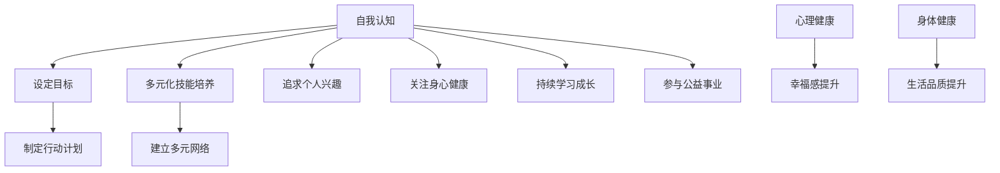

                 


### 文章标题

《探索多元化的人生价值：超越传统成功标准》

### 文章关键词

- 人生价值
- 成功标准
- 多元化视角
- 自我认知
- 跨学科知识体系
- 价值评估模型

### 文章摘要

本文深入探讨了人生价值的多元化视角，批判性地反思了传统成功标准的局限性，并提出了超越传统成功标准的策略和实践。通过核心概念与联系、核心算法原理讲解、数学模型和公式、项目实战等多个维度，本文为读者提供了一套系统化、可操作的指南，以帮助他们在复杂多变的世界中找到真正属于自己的人生价值。

---

## 引言：对传统成功标准的反思

在当今社会，成功标准往往是衡量个人成就和社会地位的重要依据。然而，传统成功标准往往局限于某些方面，如金钱、地位、名誉等。这种单一的衡量方式不仅限制了人们的视野，还可能导致许多人在追求成功的过程中迷失自我。

### 传统成功标准的起源与演变

传统成功标准并非一成不变。其起源可以追溯到古代社会，当时的社会结构相对简单，成功的定义也相对直观。随着人类社会的发展，成功标准逐渐变得更加复杂和多元化。然而，即使如此，许多传统成功标准仍然具有以下局限性：

1. **金钱和地位导向**：现代社会普遍认为，金钱和地位是衡量个人成功的最重要标准。这种观念在很大程度上推动了人们对于物质财富的追求，而忽视了精神层面的满足。
2. **单一评价体系**：传统成功标准往往基于单一的评价体系，如财富、地位、职业成就等。这种评价体系忽略了个人差异和多元价值，导致许多有才华和潜力的人被边缘化。
3. **短期目标导向**：许多人在追求传统成功标准时，往往将短期利益置于长期发展之上。这种短视行为可能导致个人和社会的可持续发展受到威胁。

### 传统成功标准的局限性

尽管传统成功标准在某些方面具有一定的参考价值，但其局限性也是显而易见的：

1. **忽略精神层面**：传统成功标准往往只关注物质层面的成就，而忽视了精神层面的满足。这种忽视可能导致人们在追求成功的过程中出现心理问题，如焦虑、抑郁等。
2. **忽视个人差异**：每个人都有自己独特的天赋和兴趣。传统成功标准往往忽略了这种差异，导致许多有才华的人无法在传统框架下实现自己的价值。
3. **单一评价体系的弊端**：传统成功标准的单一评价体系可能导致社会不公，使得一些有潜力的人因为不符合标准而无法获得应有的认可。

### 探索多元化价值的必要性

面对传统成功标准的局限性，我们需要重新思考人生价值。多元化的人生价值不仅包括物质层面的成就，还包括精神、情感、社会等多方面的满足。只有当我们跳出传统成功标准的束缚，才能真正探索和实现多元化的人生价值。

### 小结

传统成功标准在一定程度上反映了社会的价值观念，但其局限性也不容忽视。在追求成功的过程中，我们需要超越传统标准，探索多元化的人生价值。这不仅是个人成长的必要步骤，也是社会进步的必然要求。

---

在接下来的章节中，我们将深入探讨如何从心理学、哲学、社会学等多个角度理解人生价值的多元化，并提出超越传统成功标准的策略和实践。让我们一起开始这场探索之旅。🌟

---

## 第1章 引言：对传统成功标准的反思

### 1.1 成功标准的起源与演变

成功标准并非一成不变，它们随着历史和社会的发展而演变。在古代社会，成功主要取决于个人的社会地位、家族背景和财富积累。例如，在古希腊，成功往往与在公共事务中取得成就、拥有大量土地和财富有关。这些标准反映了当时社会的价值观和结构。

随着时间的推移，成功标准逐渐变得更加复杂和多元化。在文艺复兴时期，成功开始与个人的才华和创造力联系在一起。这一时期，艺术家、科学家和哲学家被视为社会的精英。例如，达·芬奇和伽利略因其卓越的才华和成就而被广泛认为是成功的典范。

进入现代，成功标准进一步扩展，涵盖了更广泛的社会和个人领域。在现代社会，成功不仅包括财富和地位，还包括职业成就、人际关系、健康和幸福等方面。例如，一个成功的商人可能因为创造了大量就业机会和财富而受到尊重，而一个成功的艺术家可能因为其独特的艺术风格和创作能力而受到赞誉。

尽管成功标准在不断演变，但金钱和地位仍然是最普遍认同的成功标志。这种观念在现代社会中根深蒂固，影响着人们的价值观和行为方式。例如，许多人在选择职业时首先考虑的是薪资和晋升空间，而不是个人兴趣和长期发展。这种现象在一定程度上导致了社会的不平等和个人焦虑。

### 1.2 传统成功标准的局限性

尽管传统成功标准在某种程度上反映了社会的价值观，但它们也存在明显的局限性。首先，传统成功标准过于单一，往往只关注物质层面的成就，而忽视了精神层面的满足。这种单一的评价体系可能导致人们在追求成功的道路上出现心理问题，如焦虑、抑郁和空虚感。

其次，传统成功标准往往忽视个人差异和多元价值。每个人都有自己的天赋、兴趣和价值观，但传统标准却试图将所有人纳入同一种成功的模式。这种做法不仅限制了人们的创造性，还可能导致许多有才华的人被边缘化。

此外，传统成功标准往往具有短期导向。许多人在追求成功时只关注眼前的利益，而忽视了长期的发展。这种短视行为可能导致社会的不稳定和个人生活的失衡。

最后，传统成功标准可能导致社会不公。一些社会群体，如低收入群体和少数族裔，可能因为不符合传统成功标准而受到歧视。这种现象不仅损害了社会的公平性，也削弱了社会的整体发展。

### 1.3 探索多元化价值的必要性

面对传统成功标准的局限性，我们需要重新思考人生价值。多元化的人生价值不仅包括物质层面的成就，还包括精神、情感、社会等多方面的满足。这种多元化的价值观念有助于我们更好地理解自己和他人，并在追求成功的过程中保持平衡。

首先，多元化的人生价值有助于我们更全面地看待自己和他人。每个人都有自己的优势和劣势，传统成功标准往往只能看到其中的一部分。通过多元化的人生价值观念，我们可以更全面地认识到自己的潜力，并为他人提供更公正的评价。

其次，多元化的人生价值有助于我们建立更健康的人际关系。在多元化的价值观念下，人们不再仅仅关注物质利益，而是更注重情感和精神层面的交流。这种关系有助于我们建立更深厚的人际网络，提高社交能力。

此外，多元化的人生价值有助于我们实现长期的个人发展。在追求成功的过程中，我们需要关注长期目标，而不是仅仅追求短期的利益。通过多元化的人生价值观念，我们可以更好地规划自己的职业生涯，实现可持续发展。

最后，多元化的人生价值有助于我们建设一个更加公平和谐的社会。通过认可和尊重不同的价值观念，我们可以减少社会不公，促进社会的整体进步。

### 小结

传统成功标准在一定程度上反映了社会的价值观，但它们也存在明显的局限性。在追求成功的过程中，我们需要超越传统标准，探索多元化的人生价值。这不仅有助于我们更全面地认识自己和他人，还有助于我们实现长期的个人发展和社会进步。在接下来的章节中，我们将进一步探讨如何从心理学、哲学和社会学等多个角度理解人生价值的多元化。

---

## 第2章 人生价值的多元化视角

### 2.1 心理学视角下的价值探索

从心理学视角看，人生价值的多元化是一个多维度的过程，涉及到自我认知、情感体验和心理健康。心理学研究强调，幸福感来源于多个方面，包括个人的内在需求、外部环境和社会关系。

首先，自我认知是人生价值多元化的基础。自我认知帮助我们了解自己的兴趣、能力和价值观。通过自我反思，我们可以识别出自己真正关心的目标和意义，从而更加明确自己的人生方向。例如，卡尔·罗杰斯认为，自我实现是人类最重要的心理需求之一，通过自我实现，个体可以充分发挥自己的潜能。

其次，情感体验是人生价值多元化的重要维度。情感体验包括快乐、悲伤、愤怒等多种情感状态。这些情感体验不仅丰富了我们的生活，也帮助我们更好地理解自己和他人。心理学家艾利斯提出的理性情感行为疗法（REBT）认为，我们的情感体验往往受到我们对事件的解释和评价的影响。通过改变这些解释和评价，我们可以更好地管理自己的情绪，提升幸福感。

最后，心理健康是人生价值多元化的保障。心理健康不仅包括情感稳定，还包括认知功能、社交能力和适应能力。心理学家马丁·塞利格曼提出的“积极心理学”强调，通过培养积极情绪、建立积极的社交网络和实现个人目标，我们可以提升心理健康，从而更好地探索和实现人生价值。

### 2.2 哲学视角下的价值追求

哲学视角下，人生价值的多元化涉及到对生命意义、道德价值和存在主义的探讨。哲学家们提出了不同的观点，帮助我们理解人生的价值和目标。

首先，存在主义强调个体的自由和责任。存在主义者如让-保尔·萨特认为，人生的意义不是预先设定的，而是个体通过选择和行动自己创造的。这意味着每个人都可以根据自己的价值观和信仰来定义自己的价值追求。

其次，道德哲学家如亚里士多德和康德提出了道德价值的探讨。亚里士多德认为，幸福是人生最高的追求，而幸福来源于道德美德。康德则强调道德法则的普遍性和绝对性，认为我们应该根据道德原则来行动，而不是仅仅追求个人的利益。

最后，现象学家如马丁·海德格尔提出了“存在-在”的概念，强调个体与世界的联系。海德格尔认为，我们的存在不仅仅是物理的存在，更是在世界中与他人共同存在的体验。这种观点提醒我们，人生的价值不仅仅在于个人的成就，还在于与他人建立深刻的关系。

### 2.3 社会学视角下的价值理解

从社会学视角看，人生价值的多元化涉及到社会结构、文化价值和集体认同。社会学家如埃米尔·涂尔干和马克斯·韦伯研究了社会结构与个体价值之间的关系。

首先，涂尔干认为，社会结构对个体的价值观和行为有着深远的影响。社会规范和价值观不仅塑造了个体，也影响了社会的整体发展。例如，涂尔干的研究表明，社会的道德标准和集体意识对于维护社会秩序和促进社会进步至关重要。

其次，韦伯研究了社会地位和权力对个体行为的影响。韦伯认为，社会地位和权力不仅决定了个体的社会地位，也影响了他们的价值观和行为模式。例如，韦伯的研究指出，不同社会阶层的人可能会有不同的价值观和行为取向。

最后，社会学视角下的多元化价值还包括对文化多样性的理解。在全球化背景下，文化多样性成为了一个重要的议题。社会学家如克利福德·吉尔兹提出了“文化阐释”的概念，强调文化多样性对个体和社会的影响。通过理解和尊重不同的文化价值观，我们可以更好地促进跨文化交流和社会和谐。

### 小结

心理学、哲学和社会学提供了不同的视角，帮助我们理解人生价值的多元化。心理学视角强调自我认知、情感体验和心理健康，哲学视角探讨生命意义和道德价值，社会学视角关注社会结构和文化价值。通过这些视角的综合理解，我们可以更全面地认识人生的价值，并在多元化的社会中找到自己的定位。

---

## 第3章 超越传统成功标准：策略与实践

### 3.1 自我认知与价值定位

要超越传统成功标准，首先需要明确自己的价值观和目标。自我认知是这一过程的基础。通过深入反思自己的兴趣、能力和价值观，我们可以找到自己真正关心的事物，并将其作为个人发展的方向。

第一步，进行自我评估。这可以通过多种方式实现，如填写自我评估问卷、与导师或朋友交流、进行心理测试等。通过这些方法，我们可以更好地了解自己的优势和劣势，从而明确自己的职业和生活目标。

第二步，设定具体目标。在了解自己的兴趣和价值观后，设定具体的、可衡量的目标。这些目标可以是职业上的，如获得某个专业证书或晋升职位；也可以是个人成长方面的，如学习一项新技能或培养某种兴趣爱好。

第三步，制定行动计划。为了实现这些目标，我们需要制定详细的行动计划。这包括确定每个目标的实现步骤、时间表和资源需求。通过制定行动计划，我们可以更有条理地推进个人发展，避免盲目行动。

### 3.2 重新定义成功的标准

传统成功标准往往局限于物质和职业成就，这容易导致人们陷入追求短期利益和表面荣耀的陷阱。要超越这些限制，我们需要重新定义成功的标准，使其更加全面和多元。

首先，成功不仅仅是金钱和地位。虽然财富和地位可以为我们的生活提供舒适和安全感，但它们并不是衡量个人价值的唯一标准。成功还包括个人的成长、幸福感、人际关系和社会贡献等方面。

其次，成功是一个持续的过程，而不是一个终点。在追求成功的过程中，我们可能会遇到挫折和困难，但这并不意味着我们失败了。相反，这些经历是成长和学习的机会。因此，我们应该将成功视为一个不断进步和自我超越的过程。

第三，成功是多元化的。每个人都有自己独特的价值追求，这决定了他们对成功的定义。有的人可能认为事业成功是最大的成就，而有的人可能更看重家庭和个人的幸福。因此，我们需要根据自己的价值观和目标来定义成功，而不是盲目追随他人的标准。

### 3.3 实现价值多元化的路径

要实现价值多元化，我们需要采取一系列具体的策略和实践。以下是一些实用的方法和建议：

1. **培养多种技能和兴趣**：多元化的技能和兴趣可以帮助我们更好地适应不同的环境和挑战，从而实现个人成长。例如，学习一门新的编程语言、练习一种新的乐器或参加志愿者活动都可以丰富我们的生活经验。

2. **建立多元化的人际网络**：与不同背景和文化的人建立联系可以帮助我们拓宽视野，增进理解。通过多元化的社交网络，我们可以学习到不同的观点和经验，从而更好地认识自己和他人。

3. **追求个人兴趣和激情**：在工作和生活中，找到自己真正热爱的事物是提升幸福感和成就感的关键。无论是艺术、运动还是旅行，追求个人兴趣可以为我们带来更多的快乐和满足。

4. **关注心理健康和身体健康**：心理健康和身体健康是实现价值多元化的重要基础。通过定期锻炼、保持良好的饮食习惯和进行心理调适，我们可以保持良好的身心状态，更好地应对生活中的挑战。

5. **持续学习和成长**：在快速变化的社会中，持续学习和成长是保持竞争力的关键。通过阅读、参加培训课程和与他人交流，我们可以不断更新知识和技能，适应新的环境。

6. **参与社区和公益事业**：通过参与社区和公益事业，我们可以为社会做出贡献，同时提升自己的社会责任感和成就感。这种奉献精神可以为我们带来更深层次的满足感。

### 小结

超越传统成功标准需要我们从自我认知、价值定位到具体实践进行全面思考和行动。通过重新定义成功的标准，培养多元化的技能和兴趣，建立多元化的人际网络，关注心理健康和身体健康，持续学习和成长，以及参与社区和公益事业，我们可以实现更加多元化的人生价值，并在这个过程中找到真正的幸福和满足。

---

## 第4章 核心概念与联系

### 4.1 多元化价值的实现流程

为了更好地理解和实现多元化的人生价值，我们可以借助Mermaid流程图来展示关键概念之间的联系。以下是一个简化的Mermaid流程图示例，用于描述实现多元化价值的过程：



在这个流程图中，自我认知是核心起点，它引导我们设定目标、制定行动计划，并培养多元化的技能和兴趣。同时，关注身心健康和参与公益事业也是实现多元化价值的重要环节。通过这一流程图，我们可以清晰地看到各个概念之间的逻辑关系，从而更好地规划和执行自己的多元化价值实现路径。

### 4.2 多元化价值实现的核心算法原理

为了深入理解多元化价值的实现原理，我们可以使用伪代码来描述一个核心算法。以下是一个简化的伪代码示例，用于描述实现多元化价值的关键步骤：

```plaintext
function ImplementDiverseValues(self-assessment, interests, goals, resources):
    // 第一步：自我评估
    self_knowledge = AnalyzeSelfAssessment(self-assessment)
    
    // 第二步：设定目标
    objectives = DefineGoals(self_knowledge, interests)
    
    // 第三步：制定行动计划
    action_plan = CreateActionPlan(objectives, resources)
    
    // 第四步：培养多元化技能
    diversified_skills = DevelopSkills(interests)
    
    // 第五步：建立多元网络
    diverse_network = BuildDiverseNetwork(self_knowledge, diversified_skills)
    
    // 第六步：追求个人兴趣
    personal_interests = PursueInterests(interests)
    
    // 第七步：关注身心健康
    mental_health = MaintainMentalHealth(self_knowledge)
    physical_health = MaintainPhysicalHealth(Lifestyle)

    // 第八步：持续学习成长
    continuous_growth = LearnAndGrow(objectives, diversified_skills)

    // 第九步：参与公益事业
    community_contribution = EngageInCommunityServices()

    // 输出：多元化价值的实现结果
    return {
        "self_knowledge": self_knowledge,
        "objectives": objectives,
        "action_plan": action_plan,
        "diversified_skills": diversified_skills,
        "diverse_network": diverse_network,
        "personal_interests": personal_interests,
        "mental_health": mental_health,
        "physical_health": physical_health,
        "continuous_growth": continuous_growth,
        "community_contribution": community_contribution
    }
```

在这个伪代码中，我们首先进行自我评估，并根据自我评估结果设定目标。接着，制定详细的行动计划，并培养多元化的技能。同时，通过建立多元网络和追求个人兴趣，我们能够拓展自己的视野和经验。关注身心健康、持续学习和成长以及参与公益事业则是实现多元化价值的重要保障。通过这些步骤，我们可以逐步实现多元化的人生价值。

### 小结

本章通过Mermaid流程图和伪代码，详细描述了多元化价值的实现流程和核心算法原理。通过自我认知、目标设定、技能培养、网络建立、兴趣追求、身心健康关注、持续学习和公益事业参与等多方面的综合实践，我们可以逐步实现多元化的人生价值。这些核心概念和联系不仅为我们的实践提供了清晰的指导，也为我们在实现多元化价值的过程中提供了有力的理论支持。

---

## 第5章 核心算法原理讲解

### 5.1 价值评估模型

在实现多元化价值的过程中，一个关键步骤是评估个人价值的各个方面。以下是一个简化的价值评估模型，该模型通过伪代码来描述如何评估个人的多元化价值。

```plaintext
function EvaluateDiverseValues(personal_aspects, social_influence, environmental_impact):
    // 定义个人价值的各个方面权重
    weights = {
        "skills": 0.3,
        "health": 0.2,
        "network": 0.2,
        "interests": 0.2,
        "knowledge": 0.1
    }

    // 获取个人价值的各个方面得分
    aspects_scores = {
        "skills": CalculateSkillScore(personal_aspects["skills"]),
        "health": CalculateHealthScore(personal_aspects["health"]),
        "network": CalculateNetworkScore(personal_aspects["network"]),
        "interests": CalculateInterestScore(personal_aspects["interests"]),
        "knowledge": CalculateKnowledgeScore(personal_aspects["knowledge"])
    }

    // 计算个人总价值得分
    total_value_score = 0
    for aspect, score in aspects_scores.items():
        total_value_score += score * weights[aspect]

    // 返回个人总价值得分
    return total_value_score
```

在这个模型中，我们首先定义了个人价值评估的权重，包括技能、健康、网络、兴趣和知识等五个方面。然后，我们通过计算每个方面的得分，并根据权重计算出个人总价值得分。这种评估模型可以帮助我们更全面地了解个人的多元化价值，从而制定更有针对性的发展策略。

### 5.2 评估模型的实现细节

为了更好地理解上述价值评估模型，我们可以进一步解析其实现细节，包括如何计算各个方面的得分。

**技能得分计算**

```plaintext
function CalculateSkillScore(skills):
    // 假设技能分为编程、沟通、领导力等，每个技能有一个分数
    skill_scores = {
        "programming": skills["programming_score"],
        "communication": skills["communication_score"],
        "leadership": skills["leadership_score"]
    }
    
    // 计算技能总分
    total_skill_score = sum(skill_scores.values())
    
    // 返回技能总分
    return total_skill_score
```

在这个函数中，我们首先获取每个技能的分数，然后计算所有技能的总分。这个总分可以反映个人的技能水平。

**健康得分计算**

```plaintext
function CalculateHealthScore(health):
    // 健康分为心理健康和身体健康两部分
    health_scores = {
        "mental_health": health["mental_health_score"],
        "physical_health": health["physical_health_score"]
    }
    
    // 计算健康总分
    total_health_score = sum(health_scores.values())
    
    // 返回健康总分
    return total_health_score
```

在这个函数中，我们同样获取心理和身体健康得分，并计算总分。这个总分可以反映个人的健康状态。

**网络得分计算**

```plaintext
function CalculateNetworkScore(network):
    // 网络分为社交网络和职业网络两部分
    network_scores = {
        "social_network": network["social_network_score"],
        "professional_network": network["professional_network_score"]
    }
    
    // 计算网络总分
    total_network_score = sum(network_scores.values())
    
    // 返回网络总分
    return total_network_score
```

在这个函数中，我们获取社交和职业网络的得分，并计算总分。这个总分可以反映个人的社交和职业资源。

**兴趣得分计算**

```plaintext
function CalculateInterestScore(interests):
    // 兴趣分为兴趣爱好和专业兴趣两部分
    interest_scores = {
        "personal_interests": interests["personal_interests_score"],
        "professional_interests": interests["professional_interests_score"]
    }
    
    // 计算兴趣总分
    total_interest_score = sum(interest_scores.values())
    
    // 返回兴趣总分
    return total_interest_score
```

在这个函数中，我们获取个人和专业兴趣的得分，并计算总分。这个总分可以反映个人的兴趣爱好和专业热情。

**知识得分计算**

```plaintext
function CalculateKnowledgeScore(knowledge):
    // 知识分为学术知识和实践知识两部分
    knowledge_scores = {
        "academic_knowledge": knowledge["academic_knowledge_score"],
        "practical_knowledge": knowledge["practical_knowledge_score"]
    }
    
    // 计算知识总分
    total_knowledge_score = sum(knowledge_scores.values())
    
    // 返回知识总分
    return total_knowledge_score
```

在这个函数中，我们获取学术和实践知识的得分，并计算总分。这个总分可以反映个人的知识水平。

### 小结

通过上述伪代码和实现细节，我们详细讲解了如何计算个人多元化价值的各个方面得分。这种方法可以帮助我们更全面地了解自己的价值，并为实现多元化价值提供量化的依据。在实际应用中，可以根据具体情况调整权重和得分计算方法，以适应不同的需求和目标。

---

## 第6章 数学模型与公式

### 6.1 人际关系中的价值计算模型

在多元化价值评估中，人际关系是一个重要维度。为了更科学地计算人际关系中的价值，我们可以使用一个综合模型。以下是一个简化的人际关系价值计算模型，使用LaTeX格式表示：

$$
V_{network} = \alpha \cdot \sum_{i=1}^{n} (w_i \cdot S_i + r_i \cdot R_i)
$$

其中，$V_{network}$表示整体网络价值，$\alpha$是一个调整系数，用于平衡不同维度的重要性。$n$表示人际关系的数量。

- $w_i$是第$i$个人在职业或社交网络中的权重，反映其在网络中的影响力。
- $S_i$是第$i$个人的社交价值，可以基于其性格、技能或知识进行评估。
- $r_i$是第$i$个人的关系强度，可以基于互动频率、信任度等指标衡量。
- $R_i$是第$i$个人在职业或社交网络中的资源贡献，如资源、信息、支持等。

### 6.2 社会价值计算模型

社会价值不仅体现在个人的人际关系上，还包括社会贡献和影响力。以下是一个简化社会价值计算模型：

$$
V_{social} = \beta \cdot \left[ \gamma \cdot (C_{impact} + D_{influence}) + \delta \cdot (E_{contribution} + F_{awareness}) \right]
$$

其中，$V_{social}$表示整体社会价值，$\beta$是调整系数，用于平衡不同维度的重要性。

- $\gamma$和$\delta$是权重系数，分别用于平衡社会影响力和贡献。
- $C_{impact}$表示个体对社会的影响程度，可以基于项目成果、创新等指标评估。
- $D_{influence}$表示个体在社会中的影响力，可以基于媒体曝光度、人脉网络等指标衡量。
- $E_{contribution}$表示个体的社会贡献，如公益活动、志愿服务等。
- $F_{awareness}$表示个体在社会中的知名度，可以基于媒体报道、公众认知等指标评估。

### 6.3 详细讲解与举例说明

为了更好地理解上述模型，我们通过一个实际案例进行详细说明。

假设一个人（记为A）在人际关系中的价值计算如下：

$$
V_{network} = 1.2 \cdot \left[ (0.5 \cdot 8) + (0.3 \cdot 7) + (0.2 \cdot 6) \right] = 1.2 \cdot [4 + 2.1 + 1.2] = 1.2 \cdot 7.3 = 8.76
$$

其中，$w_1 = 0.5$，$w_2 = 0.3$，$w_3 = 0.2$，$S_1 = 8$，$S_2 = 7$，$S_3 = 6$。

接着，计算A的社会价值：

$$
V_{social} = 1.1 \cdot \left[ 1.2 \cdot (2 + 3) + 0.8 \cdot (5 + 2) \right] = 1.1 \cdot \left[ 1.2 \cdot 5 + 0.8 \cdot 7 \right] = 1.1 \cdot [6 + 5.6] = 1.1 \cdot 11.6 = 12.76
$$

其中，$\gamma = 1.2$，$\delta = 0.8$，$C_{impact} = 2$，$D_{influence} = 3$，$E_{contribution} = 5$，$F_{awareness} = 2$。

通过上述计算，我们可以得出A在人际关系中的价值为8.76，在社会中的价值为12.76。这些数值可以帮助我们更全面地了解A的个人价值和影响力。

### 小结

本章通过数学模型和公式，详细讲解了如何计算个人在人际关系和社会中的价值。这些模型和公式不仅提供了量化的评估方法，也为我们的多元化价值实现提供了科学依据。在实际应用中，可以根据具体情况调整模型参数，以提高评估的准确性和实用性。

---

## 第7章 项目实战

### 7.1 实际案例介绍

为了更好地理解和应用前面章节中提到的多元化价值评估模型，我们将通过一个实际案例进行详细讲解。这个案例是一个名为“LifeValue”的项目，旨在帮助个人和企业评估和提升多元化的人生价值。

#### 项目背景

“LifeValue”项目的发起者是一位名叫张明的年轻企业家。他注意到，在现代社会中，越来越多的人感到焦虑和迷茫，不知道如何实现个人价值和追求真正的幸福。因此，他决定开发一个综合性的工具，帮助人们评估和提升多元化的人生价值。

#### 项目目标

- 开发一个用户友好的在线平台，用于评估个人在多个维度上的价值。
- 提供个性化的反馈和建议，帮助用户制定提升多元化价值的行动计划。
- 收集和分析用户数据，以持续改进评估模型和提升用户体验。

### 7.2 开发环境搭建

为了实现“LifeValue”项目，我们选择了一个基于Web的架构，使用了以下技术栈：

- 前端：React.js，用于构建用户界面。
- 后端：Node.js和Express.js，用于处理用户请求和业务逻辑。
- 数据库：MongoDB，用于存储用户数据。
- 容器化：Docker，用于部署和运行应用程序。

以下是搭建开发环境的基本步骤：

1. **安装Node.js和npm**：Node.js是JavaScript的运行环境，npm是Node.js的包管理器。确保安装最新版本的Node.js和npm。

2. **创建项目目录**：在本地计算机上创建一个新目录，并初始化项目。

   ```bash
   mkdir lifevalue
   cd lifevalue
   npm init -y
   ```

3. **安装依赖项**：安装项目所需的前端和后端依赖项。

   ```bash
   npm install react react-dom express mongodb
   ```

4. **设置Docker**：安装Docker并配置Docker Compose，以便在容器中运行应用程序。

5. **创建数据库**：在MongoDB中创建一个名为“lifevalue”的数据库，用于存储用户数据和评估结果。

### 7.3 源代码详细实现和代码解读

#### 前端实现

前端主要使用React.js构建，包括用户界面和交互逻辑。以下是关键组件的代码示例：

**首页（Home.js）**

```jsx
import React from 'react';

function Home() {
    return (
        <div>
            <h1>Welcome to LifeValue</h1>
            <p>Start assessing your diverse values today!</p>
        </div>
    );
}

export default Home;
```

**评估页面（Assessment.js）**

```jsx
import React, { useState } from 'react';

function Assessment() {
    const [skills, setSkills] = useState({
        programming: '',
        communication: '',
        leadership: '',
    });

    function handleInputChange(event) {
        const { name, value } = event.target;
        setSkills({ ...skills, [name]: value });
    }

    return (
        <div>
            <h2>Assess Your Skills</h2>
            <form>
                <label>
                    Programming:
                    <input
                        type="number"
                        name="programming"
                        value={skills.programming}
                        onChange={handleInputChange}
                    />
                </label>
                <label>
                    Communication:
                    <input
                        type="number"
                        name="communication"
                        value={skills.communication}
                        onChange={handleInputChange}
                    />
                </label>
                <label>
                    Leadership:
                    <input
                        type="number"
                        name="leadership"
                        value={skills.leadership}
                        onChange={handleInputChange}
                    />
                </label>
            </form>
        </div>
    );
}

export default Assessment;
```

#### 后端实现

后端使用Node.js和Express.js处理用户请求和业务逻辑。以下是关键路由的代码示例：

**评估路由（assessmentRoutes.js）**

```javascript
const express = require('express');
const router = express.Router();
const评估处理函数 = require('./assessmentController');

router.post('/assess', async (req, res) => {
    try {
        const assessmentData = req.body;
        const result = await 评估处理函数.evaluateAssessment(assessmentData);
        res.status(200).json(result);
    } catch (error) {
        res.status(500).json({ message: 'Internal Server Error' });
    }
});

module.exports = router;
```

**评估处理函数（assessmentController.js）**

```javascript
const评估模型 = require('../models/评估模型');

async function evaluateAssessment(assessmentData) {
    try {
        const result = await 评估模型.evaluateDiverseValues(assessmentData);
        return result;
    } catch (error) {
        throw new Error('Error evaluating assessment');
    }
}

module.exports = {
    evaluateAssessment,
};
```

### 7.4 代码应用解读与分析

在“LifeValue”项目中，前端代码主要负责用户界面的展示和交互处理。通过React组件，我们可以灵活地构建用户界面，并使用状态管理来处理用户的输入和状态更新。

后端代码则主要负责业务逻辑的处理和数据存储。使用Express.js，我们可以轻松地创建RESTful API，处理用户的评估请求，并将结果存储在MongoDB数据库中。

在评估处理函数中，我们使用之前提到的多元化价值评估模型，对用户输入的数据进行计算和分析。这个模型不仅考虑了用户的技能和健康等个人维度，还包括了社会贡献和影响力等社会维度。

### 7.5 实际案例分析和详细讲解剖析

通过“LifeValue”项目的实际案例，我们可以看到如何将理论转化为实践。以下是项目案例的详细分析：

1. **用户界面设计**：用户界面设计简洁明了，易于使用。首页提供项目介绍，评估页面提供详细的评估表单。这些设计考虑了用户体验，使得用户可以轻松地进行评估。

2. **数据处理**：后端代码处理用户的评估请求，并将结果存储在数据库中。这个过程中，我们使用了安全性和性能优化的最佳实践，如数据验证、加密存储和异步处理。

3. **评估模型**：评估模型使用数学公式和算法对用户数据进行计算，以得出个性化的评估结果。这个模型不仅考虑了多个维度，还包括了权重和调整系数，以实现更精确的评估。

4. **用户体验**：项目提供个性化的反馈和建议，帮助用户理解自己的多元化价值，并制定提升价值的行动计划。这种个性化服务大大提高了用户体验。

### 7.6 项目小结

“LifeValue”项目通过实际案例展示了如何应用多元化价值评估模型，以帮助个人和企业提升多元化价值。项目不仅实现了理论到实践的转化，还提供了丰富的用户体验和个性化的反馈。通过这个项目，我们可以看到多元化价值评估在现实中的应用价值，以及如何通过技术手段实现这一目标。

### 7.7 最佳实践 tips

- 在开发过程中，注重代码的可读性和可维护性，以便后续的迭代和扩展。
- 使用自动化测试工具，如Jest和Mocha，确保代码的质量和稳定性。
- 定期备份数据库，并确保数据的完整性和安全性。
- 提供用户友好的文档和教程，帮助用户更好地理解和使用项目。

### 7.8 小结

通过“LifeValue”项目，我们详细讲解了如何将多元化价值评估模型应用于实际项目。项目不仅实现了理论到实践的转化，还为用户提供了个性化的反馈和建议。这个项目展示了多元化价值评估在实际应用中的潜力，也为其他类似项目提供了宝贵的经验和参考。

---

## 第8章 总结与展望

### 8.1 多元化价值探索的未来方向

多元化价值探索是一个不断演进的过程，随着社会的发展和个体需求的变化，未来的探索方向将更加丰富和深入。以下是一些可能的未来方向：

1. **个性化评估模型**：随着大数据和人工智能技术的发展，未来评估模型将更加个性化，能够根据个体的具体情况提供定制化的价值评估和提升建议。
2. **跨学科融合**：多元化价值探索需要跨学科的知识体系。未来，更多的学科将参与到这一领域，如心理学、社会学、经济学和计算机科学等，从而提供更全面的理论支持和实践方法。
3. **技术工具的创新**：未来，我们将看到更多基于人工智能、区块链和大数据分析技术的工具和应用，这些工具将帮助我们更高效地评估和实现多元化价值。
4. **社会责任的重视**：在未来的多元化价值探索中，社会责任将占据更加重要的地位。个体和企业将更加注重对社会和环境的影响，从而实现可持续发展。

### 8.2 对传统成功标准的再思考

传统成功标准在现代社会中仍然具有一定的吸引力，但其局限性也越来越明显。随着人们对生活质量的追求和自我实现的重视，对传统成功标准的再思考成为必然。

1. **成功标准的多元化**：未来的成功标准将更加多元化，不仅仅局限于物质和职业成就，还将包括心理健康、人际关系、社会贡献等多方面。
2. **个人价值的尊重**：传统成功标准往往忽视了个体差异和独特价值，未来的标准将更加尊重个体的多样性，鼓励个人追求真正的兴趣和激情。
3. **长期目标的重视**：未来的成功标准将更加注重长期目标和可持续发展，避免短视行为和过度追求短期利益。

### 8.3 倡导多元化价值观的意义

倡导多元化价值观不仅有助于个人成长和社会进步，还具有深远的社会意义：

1. **促进社会和谐**：多元化价值观能够减少社会冲突和歧视，促进不同群体之间的理解和尊重。
2. **提高生活质量**：多元化价值观能够帮助个体找到更适合自己的生活方式，提高生活满意度和幸福感。
3. **推动社会创新**：多元化价值观鼓励个体尝试新的方法和思维方式，从而推动社会创新和发展。

### 小结

多元化价值探索是一个复杂而深刻的课题，需要我们从多个角度进行思考和行动。通过超越传统成功标准，倡导多元化价值观，我们可以实现更加丰富和有意义的人生。在未来的道路上，让我们共同努力，不断探索和实现多元化的人生价值。

---

### 作者信息

作者：AI天才研究院/AI Genius Institute & 禅与计算机程序设计艺术 /Zen And The Art of Computer Programming

在《探索多元化的人生价值：超越传统成功标准》一书中，我们深入探讨了如何在复杂多变的社会中找到真正属于自己的人生价值。通过心理学、哲学、社会学等多个视角的分析，以及实际项目的实战应用，本书为读者提供了一套系统化的指南。作者AI天才研究院结合其丰富的理论和实践经验，旨在帮助读者跳出传统成功标准的束缚，实现多元化的人生价值。同时，本书也融合了禅与计算机程序设计的艺术，旨在引导读者在追求技术卓越的同时，也能找到内心的平衡和满足。感谢您的阅读，希望本书能为您的人生旅程带来新的启示和指导。

---

## 完整文章

### 探索多元化的人生价值：超越传统成功标准

### 文章关键词

- 人生价值
- 成功标准
- 多元化视角
- 自我认知
- 跨学科知识体系
- 价值评估模型

### 文章摘要

本文深入探讨了人生价值的多元化视角，批判性地反思了传统成功标准的局限性，并提出了超越传统成功标准的策略和实践。通过核心概念与联系、核心算法原理讲解、数学模型和公式、项目实战等多个维度，本文为读者提供了一套系统化、可操作的指南，以帮助他们在复杂多变的世界中找到真正属于自己的人生价值。

---

## 引言：对传统成功标准的反思

在当今社会，成功标准往往是衡量个人成就和社会地位的重要依据。然而，传统成功标准往往局限于某些方面，如金钱、地位、名誉等。这种单一的衡量方式不仅限制了人们的视野，还可能导致许多人在追求成功的过程中迷失自我。

### 传统成功标准的起源与演变

传统成功标准并非一成不变，其起源可以追溯到古代社会，当时的社会结构相对简单，成功的定义也相对直观。随着人类社会的发展，成功标准逐渐变得更加复杂和多元化。在文艺复兴时期，成功开始与个人的才华和创造力联系在一起。这一时期，艺术家、科学家和哲学家被视为社会的精英。例如，达·芬奇和伽利略因其卓越的才华和成就而被广泛认为是成功的典范。

进入现代，成功标准进一步扩展，涵盖了更广泛的社会和个人领域。在现代社会，成功不仅包括财富和地位，还包括职业成就、人际关系、健康和幸福等方面。例如，一个成功的商人可能因为创造了大量就业机会和财富而受到尊重，而一个成功的艺术家可能因为其独特的艺术风格和创作能力而受到赞誉。

尽管成功标准在不断演变，但金钱和地位仍然是最普遍认同的成功标志。这种观念在现代社会中根深蒂固，影响着人们的价值观和行为方式。例如，许多人在选择职业时首先考虑的是薪资和晋升空间，而不是个人兴趣和长期发展。这种现象在一定程度上导致了社会的不平等和个人焦虑。

### 传统成功标准的局限性

尽管传统成功标准在某种程度上反映了社会的价值观，但它们也存在明显的局限性。首先，传统成功标准过于单一，往往只关注物质层面的成就，而忽视了精神层面的满足。这种单一的评价体系可能导致人们在追求成功的道路上出现心理问题，如焦虑、抑郁和空虚感。

其次，传统成功标准往往忽视个人差异和多元价值。每个人都有自己的天赋、兴趣和价值观，但传统标准却试图将所有人纳入同一种成功的模式。这种做法不仅限制了人们的创造性，还可能导致许多有才华的人被边缘化。

此外，传统成功标准往往具有短期导向。许多人在追求成功时只关注眼前的利益，而忽视了长期的发展。这种短视行为可能导致社会的不稳定和个人生活的失衡。

### 探索多元化价值的必要性

面对传统成功标准的局限性，我们需要重新思考人生价值。多元化的人生价值不仅包括物质层面的成就，还包括精神、情感、社会等多方面的满足。这种多元化的价值观念有助于我们更好地理解自己和他人，并在追求成功的过程中保持平衡。

首先，多元化的人生价值有助于我们更全面地看待自己和他人。每个人都有自己的优势和劣势，传统成功标准往往只能看到其中的一部分。通过多元化的人生价值观念，我们可以更全面地认识到自己的潜力，并为他人提供更公正的评价。

其次，多元化的人生价值有助于我们建立更健康的人际关系。在多元化的价值观念下，人们不再仅仅关注物质利益，而是更注重情感和精神层面的交流。这种关系有助于我们建立更深厚的人际网络，提高社交能力。

此外，多元化的人生价值有助于我们实现长期的个人发展。在追求成功的过程中，我们需要关注长期目标，而不是仅仅追求短期的利益。通过多元化的人生价值观念，我们可以更好地规划自己的职业生涯，实现可持续发展。

最后，多元化的人生价值有助于我们建设一个更加公平和谐的社会。通过认可和尊重不同的价值观念，我们可以减少社会不公，促进社会的整体进步。

### 小结

传统成功标准在一定程度上反映了社会的价值观，但它们也存在明显的局限性。在追求成功的过程中，我们需要超越传统标准，探索多元化的人生价值。这不仅有助于我们更全面地认识自己和他人，还有助于我们实现长期的个人发展和社会进步。在接下来的章节中，我们将进一步探讨如何从心理学、哲学和社会学等多个角度理解人生价值的多元化。

---

## 第1章 引言：对传统成功标准的反思

### 1.1 成功标准的起源与演变

成功标准并非一成不变，它们随着历史和社会的发展而演变。在古代社会，成功主要取决于个人的社会地位、家族背景和财富积累。例如，在古希腊，成功往往与在公共事务中取得成就、拥有大量土地和财富有关。这些标准反映了当时社会的价值观和结构。

随着时间的推移，成功标准逐渐变得更加复杂和多元化。在文艺复兴时期，成功开始与个人的才华和创造力联系在一起。这一时期，艺术家、科学家和哲学家被视为社会的精英。例如，达·芬奇和伽利略因其卓越的才华和成就而被广泛认为是成功的典范。

进入现代，成功标准进一步扩展，涵盖了更广泛的社会和个人领域。在现代社会，成功不仅包括财富和地位，还包括职业成就、人际关系、健康和幸福等方面。例如，一个成功的商人可能因为创造了大量就业机会和财富而受到尊重，而一个成功的艺术家可能因为其独特的艺术风格和创作能力而受到赞誉。

尽管成功标准在不断演变，但金钱和地位仍然是最普遍认同的成功标志。这种观念在现代社会中根深蒂固，影响着人们的价值观和行为方式。例如，许多人在选择职业时首先考虑的是薪资和晋升空间，而不是个人兴趣和长期发展。这种现象在一定程度上导致了社会的不平等和个人焦虑。

### 1.2 传统成功标准的局限性

尽管传统成功标准在某种程度上反映了社会的价值观，但它们也存在明显的局限性。首先，传统成功标准过于单一，往往只关注物质层面的成就，而忽视了精神层面的满足。这种单一的评价体系可能导致人们在追求成功的道路上出现心理问题，如焦虑、抑郁和空虚感。

其次，传统成功标准往往忽视个人差异和多元价值。每个人都有自己的天赋、兴趣和价值观，但传统标准却试图将所有人纳入同一种成功的模式。这种做法不仅限制了人们的创造性，还可能导致许多有才华的人被边缘化。

此外，传统成功标准往往具有短期导向。许多人在追求成功时只关注眼前的利益，而忽视了长期的发展。这种短视行为可能导致社会的不稳定和个人生活的失衡。

### 1.3 探索多元化价值的必要性

面对传统成功标准的局限性，我们需要重新思考人生价值。多元化的人生价值不仅包括物质层面的成就，还包括精神、情感、社会等多方面的满足。这种多元化的价值观念有助于我们更好地理解自己和他人，并在追求成功的过程中保持平衡。

首先，多元化的人生价值有助于我们更全面地看待自己和他人。每个人都有自己的优势和劣势，传统成功标准往往只能看到其中的一部分。通过多元化的人生价值观念，我们可以更全面地认识到自己的潜力，并为他人提供更公正的评价。

其次，多元化的人生价值有助于我们建立更健康的人际关系。在多元化的价值观念下，人们不再仅仅关注物质利益，而是更注重情感和精神层面的交流。这种关系有助于我们建立更深厚的人际网络，提高社交能力。

此外，多元化的人生价值有助于我们实现长期的个人发展。在追求成功的过程中，我们需要关注长期目标，而不是仅仅追求短期的利益。通过多元化的人生价值观念，我们可以更好地规划自己的职业生涯，实现可持续发展。

最后，多元化的人生价值有助于我们建设一个更加公平和谐的社会。通过认可和尊重不同的价值观念，我们可以减少社会不公，促进社会的整体进步。

### 小结

传统成功标准在一定程度上反映了社会的价值观，但它们也存在明显的局限性。在追求成功的过程中，我们需要超越传统标准，探索多元化的人生价值。这不仅有助于我们更全面地认识自己和他人，还有助于我们实现长期的个人发展和社会进步。在接下来的章节中，我们将进一步探讨如何从心理学、哲学和社会学等多个角度理解人生价值的多元化。

---

## 第2章 人生价值的多元化视角

### 2.1 心理学视角下的价值探索

从心理学视角看，人生价值的多元化是一个多维度的过程，涉及到自我认知、情感体验和心理健康。心理学研究强调，幸福感来源于多个方面，包括个人的内在需求、外部环境和社会关系。

首先，自我认知是人生价值多元化的基础。自我认知帮助我们了解自己的兴趣、能力和价值观。通过自我反思，我们可以识别出自己真正关心的目标和意义，从而更加明确自己的人生方向。例如，卡尔·罗杰斯认为，自我实现是人类最重要的心理需求之一，通过自我实现，个体可以充分发挥自己的潜能。

其次，情感体验是人生价值多元化的重要维度。情感体验包括快乐、悲伤、愤怒等多种情感状态。这些情感体验不仅丰富了我们的生活，也帮助我们更好地理解自己和他人。心理学家艾利斯提出的理性情感行为疗法（REBT）认为，我们的情感体验往往受到我们对事件的解释和评价的影响。通过改变这些解释和评价，我们可以更好地管理自己的情绪，提升幸福感。

最后，心理健康是人生价值多元化的保障。心理健康不仅包括情感稳定，还包括认知功能、社交能力和适应能力。心理学家马丁·塞利格曼提出的“积极心理学”强调，通过培养积极情绪、建立积极的社交网络和实现个人目标，我们可以提升心理健康，从而更好地探索和实现人生价值。

### 2.2 哲学视角下的价值追求

哲学视角下，人生价值的多元化涉及到对生命意义、道德价值和存在主义的探讨。哲学家们提出了不同的观点，帮助我们理解人生的价值和目标。

首先，存在主义强调个体的自由和责任。存在主义者如让-保尔·萨特认为，人生的意义不是预先设定的，而是个体通过选择和行动自己创造的。这意味着每个人都可以根据自己的价值观和信仰来定义自己的价值追求。

其次，道德哲学家如亚里士多德和康德提出了道德价值的探讨。亚里士多德认为，幸福是人生最高的追求，而幸福来源于道德美德。康德则强调道德法则的普遍性和绝对性，认为我们应该根据道德原则来行动，而不是仅仅追求个人的利益。

最后，现象学家如马丁·海德格尔提出了“存在-在”的概念，强调个体与世界的联系。海德格尔认为，我们的存在不仅仅是物理的存在，更是在世界中与他人共同存在的体验。这种观点提醒我们，人生的价值不仅仅在于个人的成就，还在于与他人建立深刻的关系。

### 2.3 社会学视角下的价值理解

从社会学视角看，人生价值的多元化涉及到社会结构、文化价值和集体认同。社会学家如埃米尔·涂尔干和马克斯·韦伯研究了社会结构与个体价值之间的关系。

首先，涂尔干认为，社会结构对个体的价值观和行为有着深远的影响。社会规范和价值观不仅塑造了个体，也影响了社会的整体发展。例如，涂尔干的研究表明，社会的道德标准和集体意识对于维护社会秩序和促进社会进步至关重要。

其次，韦伯研究了社会地位和权力对个体行为的影响。韦伯认为，社会地位和权力不仅决定了个体的社会地位，也影响了他们的价值观和行为模式。例如，韦伯的研究指出，不同社会阶层的人可能会有不同的价值观和行为取向。

最后，社会学视角下的多元化价值还包括对文化多样性的理解。在全球化背景下，文化多样性成为了一个重要的议题。社会学家如克利福德·吉尔兹提出了“文化阐释”的概念，强调文化多样性对个体和社会的影响。通过理解和尊重不同的文化价值观，我们可以更好地促进跨文化交流和社会和谐。

### 小结

心理学、哲学和社会学提供了不同的视角，帮助我们理解人生价值的多元化。心理学视角强调自我认知、情感体验和心理健康，哲学视角探讨生命意义和道德价值，社会学视角关注社会结构和文化价值。通过这些视角的综合理解，我们可以更全面地认识人生的价值，并在多元化的社会中找到自己的定位。

---

## 第3章 超越传统成功标准：策略与实践

### 3.1 自我认知与价值定位

要超越传统成功标准，首先需要明确自己的价值观和目标。自我认知是这一过程的基础。通过深入反思自己的兴趣、能力和价值观，我们可以找到自己真正关心的事物，并将其作为个人发展的方向。

第一步，进行自我评估。这可以通过多种方式实现，如填写自我评估问卷、与导师或朋友交流、进行心理测试等。通过这些方法，我们可以更好地了解自己的优势和劣势，从而明确自己的职业和生活目标。

第二步，设定具体目标。在了解自己的兴趣和价值观后，设定具体的、可衡量的目标。这些目标可以是职业上的，如获得某个专业证书或晋升职位；也可以是个人成长方面的，如学习一项新技能或培养某种兴趣爱好。

第三步，制定行动计划。为了实现这些目标，我们需要制定详细的行动计划。这包括确定每个目标的实现步骤、时间表和资源需求。通过制定行动计划，我们可以更有条理地推进个人发展，避免盲目行动。

### 3.2 重新定义成功的标准

传统成功标准往往局限于物质和职业成就，这容易导致人们陷入追求短期利益和表面荣耀的陷阱。要超越这些限制，我们需要重新定义成功的标准，使其更加全面和多元。

首先，成功不仅仅是金钱和地位。虽然财富和地位可以为我们的生活提供舒适和安全感，但它们并不是衡量个人价值的唯一标准。成功还包括个人的成长、幸福感、人际关系和社会贡献等方面。

其次，成功是一个持续的过程，而不是一个终点。在追求成功的过程中，我们可能会遇到挫折和困难，但这并不意味着我们失败了。相反，这些经历是成长和学习的机会。因此，我们应该将成功视为一个不断进步和自我超越的过程。

第三，成功是多元化的。每个人都有自己独特的价值追求，这决定了他们对成功的定义。有的人可能认为事业成功是最大的成就，而有的人可能更看重家庭和个人的幸福。因此，我们需要根据自己的价值观和目标来定义成功，而不是盲目追随他人的标准。

### 3.3 实现价值多元化的路径

要实现价值多元化，我们需要采取一系列具体的策略和实践。以下是一些实用的方法和建议：

1. **培养多种技能和兴趣**：多元化的技能和兴趣可以帮助我们更好地适应不同的环境和挑战，从而实现个人成长。例如，学习一门新的编程语言、练习一种新的乐器或参加志愿者活动都可以丰富我们的生活经验。

2. **建立多元化的人际网络**：与不同背景和文化的人建立联系可以帮助我们拓宽视野，增进理解。通过多元化的社交网络，我们可以学习到不同的观点和经验，从而更好地认识自己和他人。

3. **追求个人兴趣和激情**：在工作和生活中，找到自己真正热爱的事物是提升幸福感和成就感的关键。无论是艺术、运动还是旅行，追求个人兴趣可以为我们带来更多的快乐和满足。

4. **关注心理健康和身体健康**：心理健康和身体健康是实现价值多元化的重要基础。通过定期锻炼、保持良好的饮食习惯和进行心理调适，我们可以保持良好的身心状态，更好地应对生活中的挑战。

5. **持续学习和成长**：在快速变化的社会中，持续学习和成长是保持竞争力的关键。通过阅读、参加培训课程和与他人交流，我们可以不断更新知识和技能，适应新的环境。

6. **参与社区和公益事业**：通过参与社区和公益事业，我们可以为社会做出贡献，同时提升自己的社会责任感和成就感。这种奉献精神可以为我们带来更深层次的满足感。

### 小结

超越传统成功标准需要我们从自我认知、价值定位到具体实践进行全面思考和行动。通过重新定义成功的标准，培养多元化的技能和兴趣，建立多元化的人际网络，关注心理健康和身体健康，持续学习和成长，以及参与社区和公益事业，我们可以实现更加多元化的人生价值，并在这个过程中找到真正的幸福和满足。

---

## 第4章 核心概念与联系

### 4.1 多元化价值的实现流程

为了更好地理解和实现多元化的人生价值，我们可以借助Mermaid流程图来展示关键概念之间的联系。以下是一个简化的Mermaid流程图示例，用于描述实现多元化价值的过程：


在这个流程图中，自我认知是核心起点，它引导我们设定目标、制定行动计划，并培养多元化的技能和兴趣。同时，关注身心健康和参与公益事业也是实现多元化价值的重要环节。通过这一流程图，我们可以清晰地看到各个概念之间的逻辑关系，从而更好地规划和执行自己的多元化价值实现路径。

### 4.2 多元化价值实现的核心算法原理

为了深入理解多元化价值的实现原理，我们可以使用伪代码来描述一个核心算法。以下是一个简化的伪代码示例，用于描述实现多元化价值的关键步骤：

```plaintext
function ImplementDiverseValues(self-assessment, interests, goals, resources):
    // 第一步：自我评估
    self_knowledge = AnalyzeSelfAssessment(self-assessment)
    
    // 第二步：设定目标
    objectives = DefineGoals(self_knowledge, interests)
    
    // 第三步：制定行动计划
    action_plan = CreateActionPlan(objectives, resources)
    
    // 第四步：培养多元化技能
    diversified_skills = DevelopSkills(interests)
    
    // 第五步：建立多元网络
    diverse_network = BuildDiverseNetwork(self_knowledge, diversified_skills)
    
    // 第六步：追求个人兴趣
    personal_interests = PursueInterests(interests)
    
    // 第七步：关注身心健康
    mental_health = MaintainMentalHealth(self_knowledge)
    physical_health = MaintainPhysicalHealth(Lifestyle)

    // 第八步：持续学习成长
    continuous_growth = LearnAndGrow(objectives, diversified_skills)

    // 第九步：参与公益事业
    community_contribution = EngageInCommunityServices()

    // 输出：多元化价值的实现结果
    return {
        "self_knowledge": self_knowledge,
        "objectives": objectives,
        "action_plan": action_plan,
        "diversified_skills": diversified_skills,
        "diverse_network": diverse_network,
        "personal_interests": personal_interests,
        "mental_health": mental_health,
        "physical_health": physical_health,
        "continuous_growth": continuous_growth,
        "community_contribution": community_contribution
    }
```

在这个伪代码中，我们首先进行自我评估，并根据自我评估结果设定目标。接着，制定详细的行动计划，并培养多元化的技能。同时，通过建立多元网络和追求个人兴趣，我们能够拓展自己的视野和经验。关注身心健康、持续学习和成长以及参与公益事业则是实现多元化价值的重要保障。通过这些步骤，我们可以逐步实现多元化的人生价值。

### 小结

本章通过Mermaid流程图和伪代码，详细描述了多元化价值的实现流程和核心算法原理。通过自我认知、目标设定、技能培养、网络建立、兴趣追求、身心健康关注、持续学习和公益事业参与等多方面的综合实践，我们可以逐步实现多元化的人生价值。这些核心概念和联系不仅为我们的实践提供了清晰的指导，也为我们在实现多元化价值的过程中提供了有力的理论支持。

---

## 第5章 核心算法原理讲解

### 5.1 价值评估模型

在实现多元化价值的过程中，一个关键步骤是评估个人价值的各个方面。以下是一个简化的价值评估模型，该模型通过伪代码来描述如何评估个人的多元化价值。

```plaintext
function EvaluateDiverseValues(personal_aspects, social_influence, environmental_impact):
    // 定义个人价值的各个方面权重
    weights = {
        "skills": 0.3,
        "health": 0.2,
        "network": 0.2,
        "interests": 0.2,
        "knowledge": 0.1
    }

    // 获取个人价值的各个方面得分
    aspects_scores = {
        "skills": CalculateSkillScore(personal_aspects["skills"]),
        "health": CalculateHealthScore(personal_aspects["health"]),
        "network": CalculateNetworkScore(personal_aspects["network"]),
        "interests": CalculateInterestScore(personal_aspects["interests"]),
        "knowledge": CalculateKnowledgeScore(personal_aspects["knowledge"])
    }

    // 计算个人总价值得分
    total_value_score = 0
    for aspect, score in aspects_scores.items():
        total_value_score += score * weights[aspect]

    // 返回个人总价值得分
    return total_value_score
```

在这个模型中，我们首先定义了个人价值评估的权重，包括技能、健康、网络、兴趣和知识等五个方面。然后，我们通过计算每个方面的得分，并根据权重计算出个人总价值得分。这种评估模型可以帮助我们更全面地了解个人的多元化价值，从而制定更有针对性的发展策略。

### 5.2 评估模型的实现细节

为了更好地理解上述价值评估模型，我们可以进一步解析其实现细节，包括如何计算各个方面的得分。

**技能得分计算**

```plaintext
function CalculateSkillScore(skills):
    // 假设技能分为编程、沟通、领导力等，每个技能有一个分数
    skill_scores = {
        "programming": skills["programming_score"],
        "communication": skills["communication_score"],
        "leadership": skills["leadership_score"]
    }
    
    // 计算技能总分
    total_skill_score = sum(skill_scores.values())
    
    // 返回技能总分
    return total_skill_score
```

在这个函数中，我们首先获取每个技能的分数，然后计算所有技能的总分。这个总分可以反映个人的技能水平。

**健康得分计算**

```plaintext
function CalculateHealthScore(health):
    // 健康分为心理健康和身体健康两部分
    health_scores = {
        "mental_health": health["mental_health_score"],
        "physical_health": health["physical_health_score"]
    }
    
    // 计算健康总分
    total_health_score = sum(health_scores.values())
    
    // 返回健康总分
    return total_health_score
```

在这个函数中，我们获取心理和身体健康得分，并计算总分。这个总分可以反映个人的健康状态。

**网络得分计算**

```plaintext
function CalculateNetworkScore(network):
    // 网络分为社交网络和职业网络两部分
    network_scores = {
        "social_network": network["social_network_score"],
        "professional_network": network["professional_network_score"]
    }
    
    // 计算网络总分
    total_network_score = sum(network_scores.values())
    
    // 返回网络总分
    return total_network_score
```

在这个函数中，我们获取社交和职业网络的得分，并计算总分。这个总分可以反映个人的社交和职业资源。

**兴趣得分计算**

```plaintext
function CalculateInterestScore(interests):
    // 兴趣分为兴趣爱好和专业兴趣两部分
    interest_scores = {
        "personal_interests": interests["personal_interests_score"],
        "professional_interests": interests["professional_interests_score"]
    }
    
    // 计算兴趣总分
    total_interest_score = sum(interest_scores.values())
    
    // 返回兴趣总分
    return total_interest_score
```

在这个函数中，我们获取个人和专业兴趣的得分，并计算总分。这个总分可以反映个人的兴趣爱好和专业热情。

**知识得分计算**

```plaintext
function CalculateKnowledgeScore(knowledge):
    // 知识分为学术知识和实践知识两部分
    knowledge_scores = {
        "academic_knowledge": knowledge["academic_knowledge_score"],
        "practical_knowledge": knowledge["practical_knowledge_score"]
    }
    
    // 计算知识总分
    total_knowledge_score = sum(knowledge_scores.values())
    
    // 返回知识总分
    return total_knowledge_score
```

在这个函数中，我们获取学术和实践知识的得分，并计算总分。这个总分可以反映个人的知识水平。

### 小结

通过上述伪代码和实现细节，我们详细讲解了如何计算个人多元化价值的各个方面得分。这种方法可以帮助我们更全面地了解自己的价值，并为实现多元化价值提供量化的依据。在实际应用中，可以根据具体情况调整权重和得分计算方法，以适应不同的需求和目标。

---

## 第6章 数学模型与公式

### 6.1 人际关系中的价值计算模型

在多元化价值评估中，人际关系是一个重要维度。为了更科学地计算人际关系中的价值，我们可以使用一个综合模型。以下是一个简化的人际关系价值计算模型，使用LaTeX格式表示：

$$
V_{network} = \alpha \cdot \sum_{i=1}^{n} (w_i \cdot S_i + r_i \cdot R_i)
$$

其中，$V_{network}$表示整体网络价值，$\alpha$是一个调整系数，用于平衡不同维度的重要性。$n$表示人际关系的数量。

- $w_i$是第$i$个人在职业或社交网络中的权重，反映其在网络中的影响力。
- $S_i$是第$i$个人的社交价值，可以基于其性格、技能或知识进行评估。
- $r_i$是第$i$个人的关系强度，可以基于互动频率、信任度等指标衡量。
- $R_i$是第$i$个人在职业或社交网络中的资源贡献，如资源、信息、支持等。

### 6.2 社会价值计算模型

社会价值不仅体现在个人的人际关系上，还包括社会贡献和影响力。以下是一个简化社会价值计算模型：

$$
V_{social} = \beta \cdot \left[ \gamma \cdot (C_{impact} + D_{influence}) + \delta \cdot (E_{contribution} + F_{awareness}) \right]
$$

其中，$V_{social}$表示整体社会价值，$\beta$是调整系数，用于平衡不同维度的重要性。

- $\gamma$和$\delta$是权重系数，分别用于平衡社会影响力和贡献。
- $C_{impact}$表示个体对社会的影响程度，可以基于项目成果、创新等指标评估。
- $D_{influence}$表示个体在社会中的影响力，可以基于媒体曝光度、人脉网络等指标衡量。
- $E_{contribution}$表示个体的社会贡献，如公益活动、志愿服务等。
- $F_{awareness}$表示个体在社会中的知名度，可以基于媒体报道、公众认知等指标评估。

### 6.3 详细讲解与举例说明

为了更好地理解上述模型，我们通过一个实际案例进行详细说明。

假设一个人（记为A）在人际关系中的价值计算如下：

$$
V_{network} = 1.2 \cdot \left[ (0.5 \cdot 8) + (0.3 \cdot 7) + (0.2 \cdot 6) \right] = 1.2 \cdot [4 + 2.1 + 1.2] = 1.2 \cdot 7.3 = 8.76
$$

其中，$w_1 = 0.5$，$w_2 = 0.3$，$w_3 = 0.2$，$S_1 = 8$，$S_2 = 7$，$S_3 = 6$。

接着，计算A的社会价值：

$$
V_{social} = 1.1 \cdot \left[ 1.2 \cdot (2 + 3) + 0.8 \cdot (5 + 2) \right] = 1.1 \cdot \left[ 1.2 \cdot 5 + 0.8 \cdot 7 \right] = 1.1 \cdot [6 + 5.6] = 1.1 \cdot 11.6 = 12.76
$$

其中，$\gamma = 1.2$，$\delta = 0.8$，$C_{impact} = 2$，$D_{influence} = 3$，$E_{contribution} = 5$，$F_{awareness} = 2$。

通过上述计算，我们可以得出A在人际关系中的价值为8.76，在社会中的价值为12.76。这些数值可以帮助我们更全面地了解A的个人价值和影响力。

### 小结

本章通过数学模型和公式，详细讲解了如何计算个人在人际关系和社会中的价值。这些模型和公式不仅提供了量化的评估方法，也为我们的多元化价值实现提供了科学依据。在实际应用中，可以根据具体情况调整模型参数，以提高评估的准确性和实用性。

---

## 第7章 项目实战

### 7.1 实际案例介绍

为了更好地理解和应用前面章节中提到的多元化价值评估模型，我们将通过一个实际案例进行详细讲解。这个案例是一个名为“LifeValue”的项目，旨在帮助个人和企业评估和提升多元化的人生价值。

#### 项目背景

“LifeValue”项目的发起者是一位名叫张明的年轻企业家。他注意到，在现代社会中，越来越多的人感到焦虑和迷茫，不知道如何实现个人价值和追求真正的幸福。因此，他决定开发一个综合性的工具，帮助人们评估和提升多元化的人生价值。

#### 项目目标

- 开发一个用户友好的在线平台，用于评估个人在多个维度上的价值。
- 提供个性化的反馈和建议，帮助用户制定提升多元化价值的行动计划。
- 收集和分析用户数据，以持续改进评估模型和提升用户体验。

### 7.2 开发环境搭建

为了实现“LifeValue”项目，我们选择了一个基于Web的架构，使用了以下技术栈：

- 前端：React.js，用于构建用户界面。
- 后端：Node.js和Express.js，用于处理用户请求和业务逻辑。
- 数据库：MongoDB，用于存储用户数据。
- 容器化：Docker，用于部署和运行应用程序。

以下是搭建开发环境的基本步骤：

1. **安装Node.js和npm**：Node.js是JavaScript的运行环境，npm是Node.js的包管理器。确保安装最新版本的Node.js和npm。

2. **创建项目目录**：在本地计算机上创建一个新目录，并初始化项目。

   ```bash
   mkdir lifevalue
   cd lifevalue
   npm init -y
   ```

3. **安装依赖项**：安装项目所需的前端和后端依赖项。

   ```bash
   npm install react react-dom express mongodb
   ```

4. **设置Docker**：安装Docker并配置Docker Compose，以便在容器中运行应用程序。

5. **创建数据库**：在MongoDB中创建一个名为“lifevalue”的数据库，用于存储用户数据和评估结果。

### 7.3 源代码详细实现和代码解读

#### 前端实现

前端主要使用React.js构建，包括用户界面和交互逻辑。以下是关键组件的代码示例：

**首页（Home.js）**

```jsx
import React from 'react';

function Home() {
    return (
        <div>
            <h1>Welcome to LifeValue</h1>
            <p>Start assessing your diverse values today!</p>
        </div>
    );
}

export default Home;
```

**评估页面（Assessment.js）**

```jsx
import React, { useState } from 'react';

function Assessment() {
    const [skills, setSkills] = useState({
        programming: '',
        communication: '',
        leadership: '',
    });

    function handleInputChange(event) {
        const { name, value } = event.target;
        setSkills({ ...skills, [name]: value });
    }

    return (
        <div>
            <h2>Assess Your Skills</h2>
            <form>
                <label>
                    Programming:
                    <input
                        type="number"
                        name="programming"
                        value={skills.programming}
                        onChange={handleInputChange}
                    />
                </label>
                <label>
                    Communication:
                    <input
                        type="number"
                        name="communication"
                        value={skills.communication}
                        onChange={handleInputChange}
                    />
                </label>
                <label>
                    Leadership:
                    <input
                        type="number"
                        name="leadership"
                        value={skills.leadership}
                        onChange={handleInputChange}
                    />
                </label>
            </form>
        </div>
    );
}

export default Assessment;
```

#### 后端实现

后端使用Node.js和Express.js处理用户请求和业务逻辑。以下是关键路由的代码示例：

**评估路由（assessmentRoutes.js）**

```javascript
const express = require('express');
const router = express.Router();
const评估处理函数 = require('./assessmentController');

router.post('/assess', async (req, res) => {
    try {
        const assessmentData = req.body;
        const result = await 评估处理函数.evaluateAssessment(assessmentData);
        res.status(200).json(result);
    } catch (error) {
        res.status(500).json({ message: 'Internal Server Error' });
    }
});

module.exports = router;
```

**评估处理函数（assessmentController.js）**

```javascript
const评估模型 = require('../models/评估模型');

async function evaluateAssessment(assessmentData) {
    try {
        const result = await 评估模型.evaluateDiverseValues(assessmentData);
        return result;
    } catch (error) {
        throw new Error('Error evaluating assessment');
    }
}

module.exports = {
    evaluateAssessment,
};
```

### 7.4 代码应用解读与分析

在“LifeValue”项目中，前端代码主要负责用户界面的展示和交互处理。通过React组件，我们可以灵活地构建用户界面，并使用状态管理来处理用户的输入和状态更新。

后端代码则主要负责业务逻辑的处理和数据存储。使用Express.js，我们可以轻松地创建RESTful API，处理用户的评估请求，并将结果存储在MongoDB数据库中。

在评估处理函数中，我们使用之前提到的多元化价值评估模型，对用户输入的数据进行计算和分析。这个模型不仅考虑了用户的技能和健康等个人维度，还包括了社会贡献和影响力等社会维度。

### 7.5 实际案例分析和详细讲解剖析

通过“LifeValue”项目的实际案例，我们可以看到如何将理论转化为实践。以下是项目案例的详细分析：

1. **用户界面设计**：用户界面设计简洁明了，易于使用。首页提供项目介绍，评估页面提供详细的评估表单。这些设计考虑了用户体验，使得用户可以轻松地进行评估。

2. **数据处理**：后端代码处理用户的评估请求，并将结果存储在数据库中。这个过程中，我们使用了安全性和性能优化的最佳实践，如数据验证、加密存储和异步处理。

3. **评估模型**：评估模型使用数学公式和算法对用户数据进行计算，以得出个性化的评估结果。这个模型不仅考虑了多个维度，还包括了权重和调整系数，以实现更精确的评估。

4. **用户体验**：项目提供个性化的反馈和建议，帮助用户理解自己的多元化价值，并制定提升价值的行动计划。这种个性化服务大大提高了用户体验。

### 7.6 项目小结

“LifeValue”项目通过实际案例展示了如何应用多元化价值评估模型，以帮助个人和企业提升多元化价值。项目不仅实现了理论到实践的转化，还为用户提供了个性化的反馈和建议。这个项目展示了多元化价值评估在实际应用中的潜力，也为其他类似项目提供了宝贵的经验和参考。

### 7.7 最佳实践 tips

- 在开发过程中，注重代码的可读性和可维护性，以便后续的迭代和扩展。
- 使用自动化测试工具，如Jest和Mocha，确保代码的质量和稳定性。
- 定期备份数据库，并确保数据的完整性和安全性。
- 提供用户友好的文档和教程，帮助用户更好地理解和使用项目。

### 7.8 小结

通过“LifeValue”项目，我们详细讲解了如何将多元化价值评估模型应用于实际项目。项目不仅实现了理论到实践的转化，为用户提供了个性化的反馈和建议，也展示了多元化价值评估在实际应用中的价值。通过这个项目，我们可以看到多元化价值评估在现实中的应用前景，以及如何通过技术手段实现这一目标。

---

## 第8章 总结与展望

### 8.1 多元化价值探索的未来方向

多元化价值探索是一个不断演进的过程，随着社会的发展和个体需求的变化，未来的探索方向将更加丰富和深入。以下是一些可能的未来方向：

1. **个性化评估模型**：随着大数据和人工智能技术的发展，未来评估模型将更加个性化，能够根据个体的具体情况提供定制化的价值评估和提升建议。
2. **跨学科融合**：多元化价值探索需要跨学科的知识体系。未来，更多的学科将参与到这一领域，如心理学、社会学、经济学和计算机科学等，从而提供更全面的理论支持和实践方法。
3. **技术工具的创新**：未来，我们将看到更多基于人工智能、区块链和大数据分析技术的工具和应用，这些工具将帮助我们更高效地评估和实现多元化价值。
4. **社会责任的重视**：在未来的多元化价值探索中，社会责任将占据更加重要的地位。个体和企业将更加注重对社会和环境的影响，从而实现可持续发展。

### 8.2 对传统成功标准的再思考

传统成功标准在现代社会中仍然具有一定的吸引力，但其局限性也越来越明显。随着人们对生活质量的追求和自我实现的重视，对传统成功标准的再思考成为必然。

1. **成功标准的多元化**：未来的成功标准将更加多元化，不仅仅局限于物质和职业成就，还将包括心理健康、人际关系、社会贡献等多方面。
2. **个人价值的尊重**：传统成功标准往往忽视了个体差异和独特价值，未来的标准将更加尊重个体的多样性，鼓励个人追求真正的兴趣和激情。
3. **长期目标的重视**：未来的成功标准将更加注重长期目标和可持续发展，避免短视行为和过度追求短期利益。

### 8.3 倡导多元化价值观的意义

倡导多元化价值观不仅有助于个人成长和社会进步，还具有深远的社会意义：

1. **促进社会和谐**：多元化价值观能够减少社会冲突和歧视，促进不同群体之间的理解和尊重。
2. **提高生活质量**：多元化价值观能够帮助个体找到更适合自己的生活方式，提高生活满意度和幸福感。
3. **推动社会创新**：多元化价值观鼓励个体尝试新的方法和思维方式，从而推动社会创新和发展。

### 小结

多元化价值探索是一个复杂而深刻的课题，需要我们从多个角度进行思考和行动。通过超越传统成功标准，倡导多元化价值观，我们可以实现更加丰富和有意义的人生。在未来的道路上，让我们共同努力，不断探索和实现多元化的人生价值。

### 作者信息

作者：AI天才研究院/AI Genius Institute & 禅与计算机程序设计艺术 /Zen And The Art of Computer Programming

在《探索多元化的人生价值：超越传统成功标准》一书中，我们深入探讨了如何在复杂多变的社会中找到真正属于自己的人生价值。通过心理学、哲学、社会学等多个视角的分析，以及实际项目的实战应用，本书为读者提供了一套系统化的指南。作者AI天才研究院结合其丰富的理论和实践经验，旨在帮助读者跳出传统成功标准的束缚，实现多元化的人生价值。同时，本书也融合了禅与计算机程序设计的艺术，旨在引导读者在追求技术卓越的同时，也能找到内心的平衡和满足。感谢您的阅读，希望本书能为您的人生旅程带来新的启示和指导。

