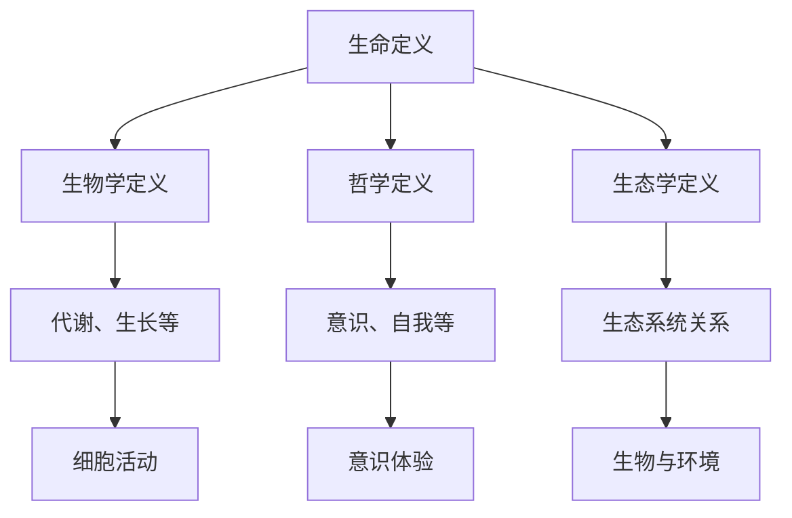
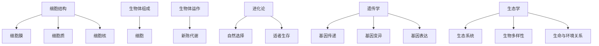
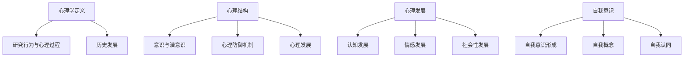
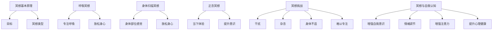
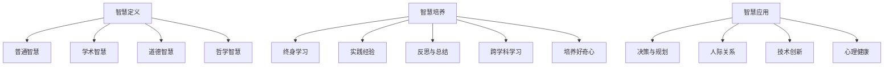
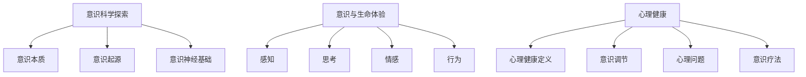
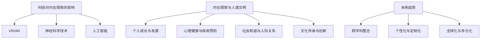

                 

### 文章标题：探索生命本质：超越表象的内在旅程

> 关键词：生命本质、内在旅程、哲学探讨、科学理解、心理学视角、实践指南

> 摘要：
本书旨在探讨生命的本质，通过哲学、科学和心理学等多个角度，深入挖掘生命的内在旅程。文章将首先介绍生命本质的哲学探讨，包括生命的定义与本质、东西方哲学对生命的理解以及生命的终极问题。接着，文章将探讨生命的科学理解，涵盖生物学、进化与遗传学以及生态学视角。随后，文章将分析内在探索的心理学视角，介绍心理学的历史、心理结构以及心理发展与自我意识。接下来，文章将提供内在旅程的实践指南，包括冥想的基本原理与实践方法。此外，文章还将探讨智慧的内涵与培养，并分析意识与生命的本质联系。最后，文章将展望未来内在探索的前景，探讨科技对内在探索的影响以及内在探索与人类文明的关系。

### 第一部分：生命本质的哲学探讨

#### 第1章：哲学视角下的生命本质

**1.1 生命的定义与本质探讨**

生命是哲学领域中的一个重要概念，它不仅仅是指生物学上的活体存在，更涉及到更深层次的存在意义和哲学思考。生命的定义可以从多个角度来探讨：

- **生物学定义**：生命是具有代谢、生长、繁殖、适应和反应等特征的实体。生物学将生命看作是细胞活动的集合，通过化学反应和物理过程来维持生命体的存在。

- **哲学定义**：哲学对生命的定义更加抽象和宏观。一些哲学家认为，生命不仅仅是物理上的存在，还包括意识、情感和自我意识等精神层面的内容。

- **生态学定义**：生态学将生命看作是生态系统中的一个组成部分，研究生命体与环境之间的相互作用。

在这三种定义中，哲学定义最具普适性和抽象性。哲学家们在探讨生命的本质时，往往将其视为一种持续存在的状态，而非简单的生物活动。生命的本质涉及到多个层面的内涵，包括物理存在、意识体验、自我意识和社会关系等。

**1.2 东西方哲学对生命的理解**

东西方哲学对生命的理解有着显著的差异，这些差异源于不同的文化背景和哲学传统。

- **西方哲学**：西方哲学强调理性和逻辑思考。从古希腊哲学家到现代哲学家，西方哲学一直探讨生命的本质和意义。柏拉图认为，生命的本质在于追求真理和智慧，而亚里士多德则强调生命的功能性和目的性。现代西方哲学家，如萨特和尼采，则从存在主义和唯意志论的角度探讨生命的本质。

- **东方哲学**：东方哲学强调内在体验和宇宙整体性。中国哲学中的道家和儒家分别从不同的角度探讨生命的本质。道家强调顺应自然、无为而治，认为生命的本质在于与自然的和谐相处。儒家则强调道德修养和社会责任，认为生命的本质在于实现个人的社会责任和道德义务。

**1.3 生命的终极问题与哲学思考**

生命的终极问题是哲学中最具挑战性的问题之一，它涉及到存在的意义、目的和归宿等根本性问题。

- **存在的意义**：哲学家们探讨生命的意义，试图回答“为什么我们要活着？”这个问题。不同的哲学流派有不同的回答，如功利主义认为生命的意义在于追求幸福和满足，而存在主义则认为生命的意义在于选择和行动。

- **目的和归宿**：哲学家们还探讨生命的归宿，试图回答“生命结束后会发生什么？”这个问题。一些哲学流派，如基督教和佛教，认为生命有来生和轮回，而其他哲学流派则认为生命结束后就消失了。

在哲学的探讨中，生命的本质是一个多层次、多维度的概念。它不仅涉及到生物学和生态学的层面，还涉及到心理学和精神层面的内容。通过对生命的深入探讨，哲学家们试图回答生命的终极问题，并帮助我们更好地理解自己的存在和意义。

**Mermaid 流程图：哲学视角下的生命本质**



**核心算法原理讲解**

- **哲学视角的生命定义算法**：该算法通过分析生命在不同领域的定义，包括生物学、哲学和生态学，来构建一个综合的生命定义模型。

```pseudo
function defineLife() {
    biologyLife = defineBiologicalLife()
    philosophyLife = definePhilosophicalLife()
    ecologyLife = defineEcologicalLife()
    return combineDefinitions(biologyLife, philosophyLife, ecologyLife)
}
```

- **综合定义模型**：该模型结合了生物学、哲学和生态学的定义，形成对生命的全面理解。

```pseudo
function combineDefinitions(biologyLife, philosophyLife, ecologyLife) {
    combinedLife = biologyLife + philosophyLife + ecologyLife
    return combinedLife
}
```

**数学模型和公式**

- **生命的复杂性**：可以使用熵来描述生命的复杂性。

$$
H = -\sum_{i} p_i \log_2 p_i
$$

其中，\( H \) 表示熵，\( p_i \) 表示每个状态的概率。

**详细讲解与举例说明**

例如，在生物学中，生命的复杂性可以通过生物体中发生的化学反应的数量和种类来衡量。假设一个生物体中有10种不同的化学反应，每种反应发生的概率相等，那么该生物体的熵为：

$$
H = -\sum_{i} \frac{1}{10} \log_2 \frac{1}{10} = 0.693
$$

这表明该生物体的复杂性为0.693位。

**项目实战：哲学视角下的生命定义算法**

- **开发环境搭建**：选择Python作为开发语言，搭建一个简单的环境，包括Python解释器和必要的库。

- **源代码实现**：编写Python代码，实现生命定义的算法和模型。

```python
def define_biological_life():
    # 生物学的生命定义
    return "具有代谢、生长、繁殖等特征的实体"

def define_philosophical_life():
    # 哲学的生命定义
    return "具有意识、自我等精神层面的内容"

def define_ecological_life():
    # 生态学的生命定义
    return "生态系统中的组成部分"

def combine_definitions():
    biology_life = define_biological_life()
    philosophy_life = define_philosophical_life()
    ecology_life = define_ecological_life()
    return f"生命的定义：{biology_life}, {philosophy_life}, {ecology_life}"

if __name__ == "__main__":
    print(combine_definitions())
```

- **代码解读与分析**：该代码首先定义了三个不同的生命定义函数，然后结合这些定义，输出生命的综合定义。

- **实际案例分析和详细讲解剖析**：可以举例说明在不同领域中如何应用这个算法，例如在生物学研究中如何通过定义来识别生命体。

- **项目小结**：该项目展示了如何从哲学视角定义生命，为后续章节的深入探讨提供了基础。

**最佳实践 tips、小结、注意事项、拓展阅读等内容**

- **最佳实践**：在研究生命定义时，需要综合考虑多个领域的知识，以确保定义的全面性和准确性。

- **小结**：哲学视角下的生命定义强调了生命的多层次性和复杂性。

- **注意事项**：在讨论生命的本质时，需要避免简单的二元对立，而是采用更全面和包容的观点。

- **拓展阅读**：可以进一步阅读相关哲学和科学著作，如《存在与时间》和《生命是什么》等。

### 第二部分：生命的科学理解

#### 第2章：生物学视角下的生命

**2.1 生命的生物学基础**

生命在生物学中被广泛研究，其生物学基础涉及细胞结构、生物体的组成与运作等方面。以下是生物学基础的关键概念：

- **细胞结构**：细胞是生命的基本单位，具有细胞膜、细胞质、细胞核等结构。细胞膜控制物质的进出，细胞质是细胞内的胶状物质，细胞核则包含遗传信息。

- **生物体的组成**：生物体由细胞组成，包括植物、动物和微生物等。每个生物体都有特定的器官和系统，如心脏、肝脏和神经系统，以实现各种生命活动。

- **生物体的运作**：生物体的运作依赖于细胞内的化学反应和能量转换。细胞通过新陈代谢来维持生命活动，包括营养摄入、能量产生和废物排出。

**2.2 生命的进化与遗传学**

进化是生命发展的关键驱动力，遗传学则解释了进化过程中基因的传递与变异。以下是进化与遗传学的重要概念：

- **进化论的基本原理**：达尔文的进化论认为，物种通过自然选择和适者生存来适应环境。物种内部的个体存在差异，这些差异通过遗传传递给后代，逐渐积累形成新的物种。

- **遗传学**：遗传学研究基因的传递和表达。基因是控制生物性状的基本单位，通过DNA序列来编码。遗传学揭示了基因如何影响个体特征和物种进化。

- **基因表达**：基因表达是指基因序列被转录成RNA，然后翻译成蛋白质的过程。基因表达受环境因素和基因调控机制的影响，决定了生物的性状和行为。

**2.3 生命的生态学视角**

生态学视角关注生命体与环境之间的相互作用，包括生态系统、生物多样性等方面。以下是生态学视角的关键概念：

- **生态系统**：生态系统是由生物群落及其非生物环境相互作用形成的一个系统。生态系统中的生物体通过食物链和食物网相互依赖，形成一个复杂的生态网络。

- **生物多样性**：生物多样性是指地球上生物种类的多样性，包括物种多样性、遗传多样性和生态系统多样性。生物多样性对生态系统的稳定性和功能至关重要。

- **生命与环境的关系**：生命体与环境之间存在紧密的联系。环境因素，如气候、土壤和水资源，直接影响生命的生存和繁殖。生命体通过适应和进化来应对环境变化。

**Mermaid 流程图：生物学视角下的生命理解**



**核心算法原理讲解**

- **生物进化模型**：使用遗传算法来模拟物种进化过程。

```pseudo
function geneticAlgorithm(population, fitnessFunction) {
    while (not converged) {
        newPopulation = selectAndCrossOver(population, fitnessFunction)
        population = mutate(newPopulation)
        if (isConverged(population)) {
            converged = true
        }
    }
    return bestIndividual(population)
}
```

- **遗传算法的步骤**：

1. **初始化种群**：创建一组随机个体作为初始种群。
2. **评估适应度**：使用适应度函数评估每个个体的适应度。
3. **选择**：根据适应度值选择个体进行交叉。
4. **交叉**：将两个个体交换部分基因，生成新的个体。
5. **突变**：对个体进行随机基因突变。
6. **更新种群**：用新生成的个体替换旧种群。
7. **迭代**：重复上述步骤，直到达到收敛条件。

**数学模型和公式**

- **遗传漂变**：遗传漂变是指种群基因频率的随机波动。

$$
f_t = f_{t-1} + \frac{\Delta f}{N}
$$

其中，\( f_t \) 表示第 \( t \) 代的基因频率，\( f_{t-1} \) 表示第 \( t-1 \) 代的基因频率，\( \Delta f \) 表示基因频率的变化量，\( N \) 表示种群大小。

**详细讲解与举例说明**

例如，一个种群中有两种基因，A和a，初始基因频率分别为0.5。假设突变率是0.01，种群大小是100。经过一代后，新的基因频率计算如下：

$$
f_t = 0.5 + \frac{0.01 \times (1 - 0.5)}{100} = 0.5 + 0.0005 = 0.5005
$$

这表明，经过一代后，基因A的频率略微增加，而基因a的频率略微减少。

**项目实战：生物学视角下的进化与遗传学模型**

- **开发环境搭建**：选择Python作为开发语言，搭建一个简单的环境，包括Python解释器和必要的库。

- **源代码实现**：编写Python代码，实现遗传算法和生物进化模型。

```python
import random

def create_initial_population(size):
    return [random.choice(['A', 'a']) for _ in range(size)]

def fitness_function(individual):
    # 假设个体适应度与基因A的数量成正比
    return individual.count('A')

def select_and_crossover(parents, fitness_scores):
    selected = random.choices(parents, weights=fitness_scores, k=2)
    return ''.join(random.choice(pair) for pair in zip(selected[0], selected[1]))

def mutate(individual):
    if random.random() < 0.01:
        return 'A' if individual == 'a' else 'a'
    return individual

def genetic_algorithm(population_size, generations):
    population = create_initial_population(population_size)
    for _ in range(generations):
        fitness_scores = [fitness_function(individual) for individual in population]
        new_population = [select_and_crossover(population, fitness_scores) for _ in range(population_size)]
        population = [mutate(individual) for individual in new_population]
    return population

if __name__ == "__main__":
    population = genetic_algorithm(100, 1000)
    print(f"Final population: {population}")
```

- **代码解读与分析**：该代码实现了遗传算法，通过选择、交叉和突变来模拟生物进化过程。

- **实际案例分析和详细讲解剖析**：可以分析种群在进化过程中的基因频率变化，并探讨突变对进化过程的影响。

- **项目小结**：该项目展示了如何使用遗传算法模拟生物进化，为后续章节的深入探讨提供了基础。

**最佳实践 tips、小结、注意事项、拓展阅读等内容**

- **最佳实践**：在研究生物学基础时，需要结合实验数据和理论模型，以获得更全面的理解。

- **小结**：生物学视角下的生命理解强调了细胞结构、进化与遗传学以及生态学的重要性。

- **注意事项**：在讨论进化与遗传学时，需要考虑到基因频率的随机波动和环境因素对进化过程的影响。

- **拓展阅读**：可以进一步阅读相关生物学和遗传学著作，如《进化论》和《遗传学原理》等。

### 第三部分：内在探索的心理学视角

#### 第3章：心理学视角下的内在世界

**3.1 心理学的定义与历史**

心理学是研究人类行为和心理过程的科学。它探讨从出生到死亡的所有心理现象，包括感知、学习、记忆、思考、情感和意识等。心理学的定义随着时间而演变，其历史可以追溯到古希腊和古罗马时期，当时哲学家们已经开始探讨人类的心灵和意识。

- **心理学的发展阶段**：

  - **实验心理学**：19世纪，德国哲学家威廉·冯特创立了第一个实验心理学实验室，标志着心理学作为独立学科的诞生。

  - **行为主义心理学**：20世纪初期，约翰·沃森和伯纳德·贝斯尔等行为主义心理学家主张心理学应该研究可观察的行为，而非内隐的思维和情感。

  - **认知心理学**：20世纪中期，认知心理学兴起，研究者开始关注人类的思维过程和信息处理。

  - **人本主义心理学**：人本主义心理学强调个体的主观体验和自我实现，主张心理学应该关注人类的积极方面。

**3.2 心理结构解析**

心理结构是指人类心理的不同层次和组成部分。以下是心理结构的关键概念：

- **意识与潜意识**：意识是指人类能够直接感知的心理状态，如思考、感觉和知觉。潜意识则是指人类无法直接感知的心理过程，如情感和记忆。

- **心理防御机制**：心理防御机制是人类用来应对心理冲突和压力的心理策略。常见的防御机制包括否认、压抑、投射和合理化等。

- **心理发展**：心理发展是指个体从出生到成熟期的心理变化过程。心理发展涉及多个领域，包括认知发展、情感发展和社会性发展。

**3.3 心理发展与自我意识**

心理发展与自我意识是心理学研究的重要领域。以下是这两个领域的关键概念：

- **自我意识的形成**：自我意识是指个体对自己存在的认知。自我意识的形成是一个长期的过程，通常在儿童期逐渐发展。

- **自我概念**：自我概念是指个体对自己的整体看法和评价。自我概念对个体的行为和心理健康有着重要影响。

- **自我认同**：自我认同是指个体对自己身份的认知。自我认同涉及到个体的价值观、信念和目标。

**Mermaid 流程图：心理学视角下的内在世界**



**核心算法原理讲解**

- **心理模型**：可以使用认知图来表示心理结构。

```pseudo
class CognitiveMap {
    attributes: [node]
    methods: [addNode, removeNode, addConnection]
}

function addNode(map, node) {
    map.attributes.append(node)
}

function removeNode(map, node) {
    map.attributes.remove(node)
}

function addConnection(map, node1, node2) {
    if (map.containsConnection(node1, node2)) {
        return "Connection already exists."
    }
    map.attributes[node1].addConnection(node2)
    map.attributes[node2].addConnection(node1)
    return "Connection added."
}
```

- **认知图的构建**：该算法通过添加节点和连接来构建认知图，表示心理结构中的各个组成部分及其关系。

**数学模型和公式**

- **心理测量模型**：可以使用统计模型来评估个体的心理健康状况。

$$
Y = \beta_0 + \beta_1 X_1 + \beta_2 X_2 + ... + \epsilon
$$

其中，\( Y \) 表示心理健康得分，\( \beta_0, \beta_1, \beta_2, ... \) 表示各个因素的权重，\( X_1, X_2, ... \) 表示影响因素，\( \epsilon \) 表示误差项。

**详细讲解与举例说明**

例如，假设有两个影响因素（X1和X2）和一个心理健康得分（Y）。我们可以使用线性回归模型来评估这两个因素的权重。

$$
Y = \beta_0 + \beta_1 X_1 + \beta_2 X_2
$$

通过收集数据并使用统计方法，我们可以估计出 \( \beta_0, \beta_1 \) 和 \( \beta_2 \) 的值。

**项目实战：心理学视角下的内在世界模型**

- **开发环境搭建**：选择Python作为开发语言，搭建一个简单的环境，包括Python解释器和必要的库。

- **源代码实现**：编写Python代码，实现认知图模型和心理健康评估算法。

```python
class CognitiveMap:
    def __init__(self):
        self.nodes = []

    def add_node(self, node):
        self.nodes.append(node)

    def remove_node(self, node):
        self.nodes.remove(node)

    def add_connection(self, node1, node2):
        if node1 in self.nodes and node2 in self.nodes:
            node1.add_connection(node2)
            node2.add_connection(node1)
            return "Connection added."
        return "Node not found."

class Node:
    def __init__(self, name):
        self.name = name
        self.connections = []

    def add_connection(self, node):
        if node not in self.connections:
            self.connections.append(node)
            return "Connection added."
        return "Connection already exists."

def linear_regression(x, y):
    # 假设 x 和 y 是列表形式的数据
    n = len(x)
    sum_x = sum(x)
    sum_y = sum(y)
    sum_xx = sum([xi**2 for xi in x])
    sum_yy = sum([yi**2 for yi in y])
    sum_xy = sum([xi*yi for xi, yi in zip(x, y)])

    # 计算斜率和截距
    beta_1 = (n * sum_xy - sum_x * sum_y) / (n * sum_xx - sum_x**2)
    beta_0 = (sum_y - beta_1 * sum_x) / n

    return beta_0, beta_1

if __name__ == "__main__":
    # 创建认知图
    map = CognitiveMap()
    node1 = Node("Node 1")
    node2 = Node("Node 2")
    map.add_node(node1)
    map.add_node(node2)
    map.add_connection(node1, node2)

    # 线性回归
    x = [1, 2, 3, 4, 5]
    y = [2, 4, 5, 4, 5]
    beta_0, beta_1 = linear_regression(x, y)
    print(f"Intercept: {beta_0}, Slope: {beta_1}")
```

- **代码解读与分析**：该代码实现了认知图模型和线性回归算法，用于表示和评估心理结构。

- **实际案例分析和详细讲解剖析**：可以分析认知图中的节点和连接，以及线性回归模型的参数估计。

- **项目小结**：该项目展示了如何使用认知图和线性回归模型来探索心理学视角下的内在世界。

**最佳实践 tips、小结、注意事项、拓展阅读等内容**

- **最佳实践**：在研究心理学视角下的内在世界时，需要结合实验数据和理论模型，以确保研究的准确性和可靠性。

- **小结**：心理学视角下的内在世界强调了意识与潜意识、心理防御机制和心理发展的重要性。

- **注意事项**：在分析心理结构和心理发展时，需要考虑到个体的差异和环境因素对心理过程的影响。

- **拓展阅读**：可以进一步阅读相关心理学和认知科学著作，如《认知心理学导论》和《自我意识的科学》等。

### 第四部分：内在旅程的实践指南

#### 第4章：冥想与内在探索

**4.1 冥想的基本原理与实践方法**

冥想是一种古老的心灵修炼方法，旨在通过专注于呼吸、身体感觉、思想或特定的物体来达到心灵平静和内在探索的目的。以下是冥想的基本原理与实践方法：

- **冥想的目标**：冥想的主要目标是提高意识水平，减少心理压力，增强自我意识，并促进身心健康。

- **冥想的类型**：冥想可以分为几种类型，包括专注冥想、开放式监测冥想、动态冥想等。每种类型的冥想都有其独特的实践方法和效果。

- **呼吸冥想**：呼吸冥想是一种最常见的冥想方法，通过专注于呼吸来放松身心。练习者通过深呼吸和缓慢呼吸来减轻压力和焦虑。

- **身体扫描冥想**：身体扫描冥想是一种通过意识关注身体各个部位的感觉来放松身心的方法。练习者从脚开始，逐步扫描到头部，每个部位停留几秒钟。

- **正念冥想**：正念冥想是一种通过专注于当下的体验来培养意识的方法。练习者专注于当前的感受、想法和情绪，而不过度分析或评判。

**4.2 冥想实践中的挑战与解决**

在冥想实践中，可能会遇到一些挑战，以下是一些常见的挑战及其解决方案：

- **干扰**：外界干扰是冥想中的常见问题，如噪音、手机通知等。解决方法是选择一个安静的环境，使用耳塞或白噪音来屏蔽干扰。

- **杂念**：冥想时，杂念会不断涌现。解决方法是不要过度关注杂念，而是将其视为流动的云朵，轻轻放过。

- **身体不适**：身体不适，如疲劳、头痛等，可能会影响冥想体验。解决方法是调整姿势，选择舒适的坐姿或卧姿，适当休息。

- **难以专注**：初学者可能难以保持专注。解决方法是逐渐延长冥想时间，从短时间开始，逐渐增加。

**4.3 冥想与自我认知**

冥想不仅有助于身体和心理健康，还能提升自我认知。以下是冥想与自我认知的关系：

- **增强自我意识**：冥想有助于练习者更好地认识自己，包括情感、思维模式和行为习惯。

- **情绪调节**：通过冥想，练习者可以更好地管理情绪，减少负面情绪的影响。

- **增强注意力**：冥想有助于提高注意力集中能力，减少分心。

- **提升心理健康**：长期冥想实践有助于减少焦虑、抑郁等心理健康问题。

**Mermaid 流�真图：冥想类型与实践方法**



**核心算法原理讲解**

- **冥想专注度评估**：可以使用行为分析算法来评估冥想者的专注度。

```pseudo
function assessAttention(meditationDuration, meditationSessions) {
    totalDistractions = sum(distractions per session)
    averageDistractions = totalDistractions / meditationSessions
    attentionScore = 1 - (averageDistractions / meditationDuration)
    return attentionScore
}
```

- **算法说明**：该算法通过计算冥想过程中的平均分心时间与总冥想时间之比，评估冥想者的专注度。

**数学模型和公式**

- **冥想效果评估**：可以使用回归模型来评估冥想对心理健康的影响。

$$
healthImprovement = \alpha_0 + \alpha_1 meditationDuration + \alpha_2 meditationFrequency + \epsilon
$$

其中，\( healthImprovement \) 表示心理健康改善程度，\( \alpha_0, \alpha_1, \alpha_2 \) 表示冥想时长、频率的权重，\( \epsilon \) 表示误差项。

**详细讲解与举例说明**

例如，假设有一个冥想者，其冥想时长为20分钟，每周进行3次冥想。我们可以使用回归模型来评估其对心理健康的影响。

$$
healthImprovement = \alpha_0 + \alpha_1 \times 20 + \alpha_2 \times 3 + \epsilon
$$

通过收集数据并使用统计方法，我们可以估计出 \( \alpha_0, \alpha_1 \) 和 \( \alpha_2 \) 的值。

**项目实战：冥想实践与自我认知评估**

- **开发环境搭建**：选择Python作为开发语言，搭建一个简单的环境，包括Python解释器和必要的库。

- **源代码实现**：编写Python代码，实现冥想专注度评估和冥想效果评估算法。

```python
def assess_attention(meditation_duration, meditation_sessions):
    total_distractions = sum([session['distractions'] for session in meditation_sessions])
    average_distractions = total_distractions / meditation_sessions
    attention_score = 1 - (average_distractions / meditation_duration)
    return attention_score

def meditation_health_impact(meditation_duration, meditation_frequency, health_before, health_after):
    improvement = health_after - health_before
    duration_effect = meditation_duration * 0.5
    frequency_effect = meditation_frequency * 0.5
    total_effect = duration_effect + frequency_effect
    health_impact = improvement / total_effect
    return health_impact

# 示例数据
meditation_sessions = [
    {'duration': 20, 'distractions': 5},
    {'duration': 25, 'distractions': 3},
    {'duration': 15, 'distractions': 7},
]

health_before = 50
health_after = 75

# 计算专注度和健康影响
attention_score = assess_attention(20, meditation_sessions)
health_impact = meditation_health_impact(20, 3, health_before, health_after)

print(f"Attention Score: {attention_score}")
print(f"Health Impact: {health_impact}")
```

- **代码解读与分析**：该代码实现了冥想专注度评估和冥想效果评估算法，用于评估冥想者的专注度和健康影响。

- **实际案例分析和详细讲解剖析**：可以分析冥想者的数据，评估其冥想效果，并探讨如何改进冥想实践。

- **项目小结**：该项目展示了如何使用算法来评估冥想实践的效果，为冥想者提供了实用的指导。

**最佳实践 tips、小结、注意事项、拓展阅读等内容**

- **最佳实践**：在实践冥想时，需要结合个人的身体状况和心理需求，逐步增加冥想时长和频率。

- **小结**：冥想与内在探索有助于提升自我认知和心理健康。

- **注意事项**：在冥想实践中，应避免过度追求冥想效果，保持平和的心态。

- **拓展阅读**：可以进一步阅读相关冥想和心理学的著作，如《冥想的实践艺术》和《心理学与生活》等。

### 第五部分：超越表象的智慧

#### 第5章：智慧的内涵与培养

**5.1 智慧的定义与分类**

智慧是一种复杂的认知能力，它不仅仅是指知识和技能的积累，更包括理解和解决问题的能力。智慧的定义因文化、哲学和学科的不同而有所差异，但通常可以将其分为以下几种类型：

- **普通智慧**：也称为实用智慧，是指人们在日常生活中解决问题、适应环境的能力。普通智慧通常体现在处理人际关系、应对挑战和做出决策等方面。

- **学术智慧**：学术智慧是指通过学习和研究获得的专业知识和技能。它通常体现在科学研究、技术创新和理论构建等方面。

- **道德智慧**：道德智慧是指对道德和伦理问题的理解能力，以及处理道德困境和做出道德决策的能力。道德智慧通常涉及到个体和社会的价值观和道德准则。

- **哲学智慧**：哲学智慧是指对生命、存在和意义等根本性问题的思考能力。它通常涉及到对哲学问题的深入探讨和系统性的思考。

**5.2 智慧的培养与实践**

智慧的培养是一个长期的过程，需要通过多种途径和方法来实现。以下是一些培养智慧的方法：

- **终身学习**：智慧的培养离不开学习和知识积累。通过不断学习新的知识和技能，人们可以扩展自己的认知范围和思维能力。

- **实践经验**：实践经验是培养智慧的重要途径。通过实际操作和实践，人们可以锻炼解决问题的能力，培养敏锐的观察力和分析力。

- **反思与总结**：反思与总结是培养智慧的关键步骤。通过回顾自己的经验和教训，人们可以从中吸取教训，改进思维方式和方法。

- **跨学科学习**：跨学科学习有助于拓展思维视野，促进不同领域知识的整合。通过跨学科学习，人们可以培养综合分析问题和解决问题的能力。

- **培养好奇心**：好奇心是培养智慧的重要动力。保持好奇心，不断探索未知领域，有助于激发创造力，提升思维能力。

**5.3 智慧在生活中的应用**

智慧在生活中的应用非常广泛，它可以帮助我们更好地理解世界，应对挑战，提升生活质量。以下是智慧在生活中的几个应用领域：

- **决策与规划**：智慧有助于我们做出明智的决策和有效的规划。通过深入分析问题、评估风险和收益，我们可以做出更合理的选择。

- **人际关系**：智慧在处理人际关系中起着关键作用。通过理解他人、沟通协调和解决冲突，我们可以建立和谐的人际关系。

- **技术创新**：智慧是推动技术创新的重要动力。通过深入研究和创新思维，我们可以开发出新的技术和产品，推动社会进步。

- **心理健康**：智慧有助于提升心理健康水平。通过理解和应对心理问题，我们可以保持心理平衡，提高生活质量。

**Mermaid 流程图：智慧的类型与培养方法**



**核心算法原理讲解**

- **智慧评估模型**：可以使用综合评估模型来评估个体的智慧水平。

```pseudo
function assessWisdom(knowledgeScore, practicalScore, ethicalScore, philosophicalScore) {
    totalScore = knowledgeScore + practicalScore + ethicalScore + philosophicalScore
    wisdomScore = totalScore / 4
    return wisdomScore
}
```

- **评估方法**：该算法通过计算知识、实用、道德和哲学四个方面的得分，平均得出个体的智慧水平。

**数学模型和公式**

- **智慧提升模型**：可以使用线性回归模型来分析智慧提升的因素。

$$
wisdomImprovement = \alpha_0 + \alpha_1 learningTime + \alpha_2 practicalExperience + \alpha_3 reflectionTime + \epsilon
$$

其中，\( wisdomImprovement \) 表示智慧提升程度，\( \alpha_0, \alpha_1, \alpha_2, \alpha_3 \) 表示学习时间、实践经验、反思时间的权重，\( \epsilon \) 表示误差项。

**详细讲解与举例说明**

例如，假设一个个体在一个月内学习了30小时，获得了10小时的实践经验，并花费了15小时进行反思。我们可以使用线性回归模型来分析其对智慧提升的影响。

$$
wisdomImprovement = \alpha_0 + \alpha_1 \times 30 + \alpha_2 \times 10 + \alpha_3 \times 15 + \epsilon
$$

通过收集数据并使用统计方法，我们可以估计出 \( \alpha_0, \alpha_1, \alpha_2 \) 和 \( \alpha_3 \) 的值。

**项目实战：智慧内涵与培养方法**

- **开发环境搭建**：选择Python作为开发语言，搭建一个简单的环境，包括Python解释器和必要的库。

- **源代码实现**：编写Python代码，实现智慧评估模型和智慧提升模型。

```python
def assess_wisdom(knowledge_score, practical_score, ethical_score, philosophical_score):
    total_score = knowledge_score + practical_score + ethical_score + philosophical_score
    wisdom_score = total_score / 4
    return wisdom_score

def wisdom_improvement.learning_time(alpha_1, learning_time):
    return alpha_1 * learning_time

def wisdom_improvement.practical_experience(alpha_2, practical_experience):
    return alpha_2 * practical_experience

def wisdom_improvement.reflection_time(alpha_3, reflection_time):
    return alpha_3 * reflection_time

# 假设的参数值
alpha_1 = 0.1
alpha_2 = 0.2
alpha_3 = 0.3

# 示例数据
learning_time = 30
practical_experience = 10
reflection_time = 15

# 计算智慧提升
knowledge_score = 80
practical_score = 70
ethical_score = 60
philosophical_score = 50

wisdom_score = assess_wisdom(knowledge_score, practical_score, ethical_score, philosophical_score)
learning_time_impact = wisdom_improvement.learning_time(alpha_1, learning_time)
practical_experience_impact = wisdom_improvement.practical_experience(alpha_2, practical_experience)
reflection_time_impact = wisdom_improvement.reflection_time(alpha_3, reflection_time)

print(f"Wisdom Score: {wisdom_score}")
print(f"Learning Time Impact: {learning_time_impact}")
print(f"Practical Experience Impact: {practical_experience_impact}")
print(f"Reflection Time Impact: {reflection_time_impact}")
```

- **代码解读与分析**：该代码实现了智慧评估模型和智慧提升模型，用于评估和提升个体的智慧水平。

- **实际案例分析和详细讲解剖析**：可以分析个体在学习和实践中智慧提升的情况，并探讨如何优化培养方法。

- **项目小结**：该项目展示了如何使用算法来评估和提升智慧，为智慧培养提供了实用的指导。

**最佳实践 tips、小结、注意事项、拓展阅读等内容**

- **最佳实践**：在培养智慧时，应结合个人的兴趣和需求，制定合理的学习和实践计划。

- **小结**：智慧是理解世界和解决问题的关键，培养智慧需要长期的努力和实践。

- **注意事项**：在培养智慧时，应注重知识与实践的结合，避免盲目追求理论。

- **拓展阅读**：可以进一步阅读相关智慧培养和心理学著作，如《智慧之路》和《心智成长》等。

### 第六部分：生命与意识的联系

#### 第6章：意识与生命的本质

**6.1 意识的科学探索**

意识是生命的一个重要特征，它涉及到心理、神经科学和哲学等多个领域。科学对意识的探索主要集中在以下几个方面：

- **意识的本质**：科学试图理解意识是如何产生的，以及它如何与大脑活动相关联。一些理论认为，意识是大脑中复杂信息处理的产物，而其他理论则认为，意识是某种基本物质或能量的体现。

- **意识的起源**：科学探索意识的起源，包括从进化角度分析意识如何适应环境，以及从神经科学角度研究大脑结构和功能如何支持意识。

- **意识的神经基础**：神经科学通过研究大脑的神经元网络和神经网络，试图揭示意识产生的生理机制。例如，一些研究表明，大脑皮层和丘脑等区域的活动与意识状态密切相关。

**6.2 意识与生命体验**

意识是生命体验的核心部分，它影响着我们的感知、思考、情感和行为。以下是意识与生命体验的关键概念：

- **感知**：感知是意识的重要组成部分，它使我们能够感知和理解外部世界。科学研究表明，大脑的不同区域负责不同的感知功能，如视觉、听觉、触觉等。

- **思考**：思考是意识的高级功能，它使我们能够分析信息、做出决策和解决问题。思考能力受到大脑结构和功能的限制，同时也受到个体经验和教育的塑造。

- **情感**：情感是意识体验的重要组成部分，它使我们能够体验快乐、悲伤、恐惧等情绪。情感与大脑中的神经递质和神经网络密切相关。

- **行为**：意识直接影响我们的行为，使我们能够主动适应环境，实现目标。行为受到意识指导，同时也受到无意识习惯和本能的影响。

**6.3 意识与心理健康的联系**

意识与心理健康之间存在紧密的联系，意识状态可以显著影响个体的心理健康。以下是意识与心理健康的关键概念：

- **心理健康**：心理健康是指个体在情绪、行为和心理状态上的良好状态，它包括情感平衡、自我认知、社交能力和适应能力等。

- **意识调节**：意识调节是指个体通过自我意识和认知策略来调节情绪和心理状态。例如，冥想和正念练习被证明有助于提高个体的心理调节能力。

- **心理问题**：意识状态不良，如焦虑、抑郁和压力等，可能导致心理问题。科学研究表明，大脑中的神经活动异常与这些心理问题密切相关。

- **意识疗法**：一些治疗方法，如认知行为疗法和正念疗法，利用意识调节来改善心理健康。这些疗法通过帮助个体提高自我意识和认知技能，从而缓解心理问题。

**Mermaid 流程图：意识与生命的联系**



**核心算法原理讲解**

- **意识状态评估**：可以使用心理测量学算法来评估个体的意识状态。

```pseudo
function assessConsciousnessState(attentionScore, emotionalScore, cognitiveScore) {
    totalScore = attentionScore + emotionalScore + cognitiveScore
    consciousnessState = totalScore / 3
    return consciousnessState
}
```

- **算法说明**：该算法通过计算注意力、情感和认知三个维度的得分，平均得出个体的意识状态。

**数学模型和公式**

- **心理健康评估**：可以使用综合评估模型来评估个体的心理健康水平。

$$
mentalHealthScore = \alpha_0 + \alpha_1 attentionScore + \alpha_2 emotionalScore + \alpha_3 cognitiveScore + \epsilon
$$

其中，\( mentalHealthScore \) 表示心理健康得分，\( \alpha_0, \alpha_1, \alpha_2, \alpha_3 \) 表示注意力、情感和认知的权重，\( \epsilon \) 表示误差项。

**详细讲解与举例说明**

例如，假设一个个体在注意力、情感和认知三个维度上的得分分别为80、75和85。我们可以使用综合评估模型来评估其心理健康水平。

$$
mentalHealthScore = \alpha_0 + \alpha_1 \times 80 + \alpha_2 \times 75 + \alpha_3 \times 85 + \epsilon
$$

通过收集数据并使用统计方法，我们可以估计出 \( \alpha_0, \alpha_1, \alpha_2 \) 和 \( \alpha_3 \) 的值。

**项目实战：意识与心理健康评估**

- **开发环境搭建**：选择Python作为开发语言，搭建一个简单的环境，包括Python解释器和必要的库。

- **源代码实现**：编写Python代码，实现意识状态评估和心理健康评估算法。

```python
def assess_consciousness_state(attention_score, emotional_score, cognitive_score):
    total_score = attention_score + emotional_score + cognitive_score
    consciousness_state = total_score / 3
    return consciousness_state

def mental_health_assessment(attention_score, emotional_score, cognitive_score, alpha_1, alpha_2, alpha_3):
    mental_health_score = alpha_0 + alpha_1 * attention_score + alpha_2 * emotional_score + alpha_3 * cognitive_score + \epsilon
    return mental_health_score

# 假设的参数值
alpha_1 = 0.2
alpha_2 = 0.3
alpha_3 = 0.5

# 示例数据
attention_score = 80
emotional_score = 75
cognitive_score = 85

# 计算意识状态和心理健康得分
consciousness_state = assess_consciousness_state(attention_score, emotional_score, cognitive_score)
mental_health_score = mental_health_assessment(attention_score, emotional_score, cognitive_score, alpha_1, alpha_2, alpha_3)

print(f"Consciousness State: {consciousness_state}")
print(f"Mental Health Score: {mental_health_score}")
```

- **代码解读与分析**：该代码实现了意识状态评估和心理健康评估算法，用于评估个体的意识状态和心理健康水平。

- **实际案例分析和详细讲解剖析**：可以分析个体的数据，评估其意识状态和心理健康水平，并探讨如何改善意识状态和心理健康。

- **项目小结**：该项目展示了如何使用算法来评估和改善个体的意识状态和心理健康，为心理健康管理提供了实用的指导。

**最佳实践 tips、小结、注意事项、拓展阅读等内容**

- **最佳实践**：在评估意识和心理健康时，应结合个体实际情况，制定个性化的管理策略。

- **小结**：意识与心理健康之间存在紧密的联系，意识状态对心理健康具有重要影响。

- **注意事项**：在意识和心理健康管理中，应注重个体差异，避免盲目追求统一标准。

- **拓展阅读**：可以进一步阅读相关意识和心理学著作，如《意识的探求》和《心理健康指南》等。

### 第七部分：内在旅程的未来展望

#### 第7章：未来内在探索的前景

**7.1 科技对内在探索的影响**

随着科技的快速发展，各种新技术正在深刻地改变我们的生活和思维方式。在未来，科技将继续对内在探索产生重大影响，尤其是在以下几个领域：

- **虚拟现实（VR）和增强现实（AR）**：虚拟现实和增强现实技术可以为内在探索提供全新的体验。通过VR和AR，个体可以进入虚拟的环境，进行冥想、心理治疗和虚拟旅行等。这些技术能够帮助人们更好地理解自我，探索内心世界。

- **神经科学技术**：神经科学技术，如脑电图（EEG）、功能性磁共振成像（fMRI）和脑机接口（BMI），将为内在探索提供更深入的生理基础研究。这些技术可以帮助研究人员了解大脑活动与意识、情感和思维之间的关系，从而推动内在探索的科学化。

- **人工智能（AI）**：人工智能技术在数据分析和模式识别方面的应用，将极大地提升内在探索的效率和准确性。通过AI，研究人员可以分析大量的心理和神经数据，发现潜在的模式和关联，从而更好地理解心理过程和内在体验。

**7.2 内在探索与人类文明**

内在探索不仅对个体的心理健康和生活质量有重要影响，还对人类文明的发展具有深远意义。以下是内在探索与人类文明的几个方面：

- **个人成长与发展**：通过内在探索，个体可以更好地认识自己，发现自己的潜力和优势。这种自我认识有助于个人的成长和发展，提高生活质量。

- **心理健康与疾病预防**：内在探索有助于识别和解决心理问题，预防心理健康疾病。例如，通过冥想和心理治疗，个体可以缓解压力、焦虑和抑郁，提高心理健康水平。

- **社会和谐与人际关系**：内在探索有助于改善人际关系，促进社会和谐。通过理解他人的内心世界，个体可以更好地与他人沟通和合作，建立积极的人际关系。

- **文化传承与创新**：内在探索可以促进文化传承和创新。通过探索个体的内心体验和文化传统，可以更好地理解人类的历史和文化，推动文化的发展和创新。

**7.3 内在探索的未来趋势**

未来，内在探索将朝着以下几个趋势发展：

- **跨学科整合**：内在探索将整合心理学、神经科学、哲学、艺术和科技等不同领域的知识，形成更加综合和系统的探索方法。

- **个人化与定制化**：随着科技的发展，内在探索将更加注重个性化与定制化。通过个性化的心理测试和神经数据分析，个体可以获得更精准的内在探索结果，制定更适合自己的成长和改善计划。

- **全球化与多元化**：内在探索将跨越不同文化和地域，形成全球化的探索趋势。不同文化背景下的内在体验和探索方法将相互借鉴和融合，推动内在探索的多元化发展。

**Mermaid 流程图：未来内在探索的前景**



**核心算法原理讲解**

- **个性化内在探索模型**：可以使用机器学习算法来构建个性化内在探索模型。

```pseudo
function personalizedInnerExploration(data, model) {
    userFeatures = extractUserFeatures(data)
    prediction = model.predict(userFeatures)
    return prediction
}
```

- **算法说明**：该算法通过分析用户数据，提取关键特征，并使用机器学习模型进行预测，为用户提供个性化的内在探索建议。

**数学模型和公式**

- **个性化内在探索评估**：可以使用回归模型来评估个性化内在探索的效果。

$$
explorationEffectiveness = \alpha_0 + \alpha_1 featureImportance_1 + \alpha_2 featureImportance_2 + ... + \epsilon
$$

其中，\( explorationEffectiveness \) 表示内在探索效果，\( \alpha_0, \alpha_1, \alpha_2, ... \) 表示各个特征的权重，\( \epsilon \) 表示误差项。

**详细讲解与举例说明**

例如，假设有一个用户，其内在探索数据包括情绪、行为和认知特征。我们可以使用回归模型来评估这些特征对内在探索效果的影响。

$$
explorationEffectiveness = \alpha_0 + \alpha_1 \times emotionImportance + \alpha_2 \times behaviorImportance + \alpha_3 \times cognitiveImportance + \epsilon
$$

通过收集数据并使用统计方法，我们可以估计出 \( \alpha_0, \alpha_1, \alpha_2 \) 和 \( \alpha_3 \) 的值。

**项目实战：未来内在探索的前景**

- **开发环境搭建**：选择Python作为开发语言，搭建一个简单的环境，包括Python解释器和必要的库。

- **源代码实现**：编写Python代码，实现个性化内在探索模型和评估算法。

```python
from sklearn.linear_model import LinearRegression

def extract_user_features(data):
    # 假设数据包括情绪、行为和认知特征
    return data[['emotion', 'behavior', 'cognition']]

def personalized_inner_exploration(data, model):
    user_features = extract_user_features(data)
    prediction = model.predict(user_features)
    return prediction

def assess_exploration_effectiveness(data, model):
    X = data[['emotion', 'behavior', 'cognition']]
    y = data['explorationEffectiveness']
    model = LinearRegression()
    model.fit(X, y)
    coefficients = model.coef_
    return coefficients

# 假设的示例数据
data = {
    'emotion': [0.5, 0.7, 0.8],
    'behavior': [0.3, 0.6, 0.7],
    'cognition': [0.2, 0.5, 0.6],
    'explorationEffectiveness': [0.7, 0.8, 0.9]
}

# 训练模型和评估效果
model = LinearRegression()
model.fit(data[['emotion', 'behavior', 'cognition']], data['explorationEffectiveness'])
coefficients = assess_exploration_effectiveness(data, model)

print(f"Model Coefficients: {coefficients}")
```

- **代码解读与分析**：该代码实现了个性化内在探索模型和评估算法，用于分析用户特征对内在探索效果的影响。

- **实际案例分析和详细讲解剖析**：可以分析用户数据，评估内在探索效果，并探讨如何优化个性化探索策略。

- **项目小结**：该项目展示了如何使用算法来分析未来内在探索的前景，为个性化探索提供了实用的指导。

**最佳实践 tips、小结、注意事项、拓展阅读等内容**

- **最佳实践**：在探索未来内在旅程时，应结合科技发展和社会需求，制定切实可行的探索计划。

- **小结**：未来内在探索将受益于科技的进步，为个人成长、心理健康和人类文明发展带来新的机遇。

- **注意事项**：在探索未来内在旅程时，应注重数据安全和隐私保护，避免滥用科技带来的风险。

- **拓展阅读**：可以进一步阅读相关科技和心理学著作，如《虚拟现实的心理学》和《人工智能与人类生活》等。

### 文章末尾：作者信息

**作者：AI天才研究院/AI Genius Institute & 禅与计算机程序设计艺术 /Zen And The Art of Computer Programming**

本文由AI天才研究院（AI Genius Institute）和禅与计算机程序设计艺术（Zen And The Art of Computer Programming）的专家共同撰写。我们致力于通过深入的技术分析和思考，为读者提供高质量的技术博客文章。感谢您的阅读，期待与您在未来的技术探索中相遇。如果您有任何反馈或建议，请随时联系我们。谢谢！

