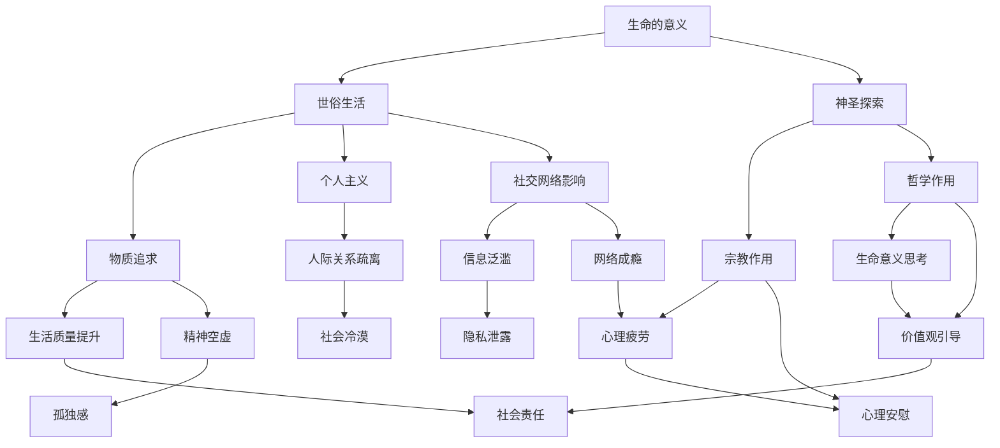
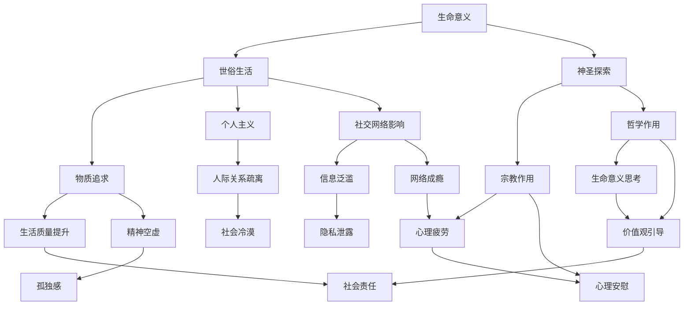

                 

### 文章标题

《探索生命的终极意义：在世俗中寻找神圣》

### 文章关键词

- 生命的意义
- 世俗生活
- 神圣探索
- 宗教
- 哲学
- 平衡

### 文章摘要

本文旨在探讨生命的终极意义，通过对世俗生活和神圣探索的比较与分析，揭示两者之间潜在的关联与平衡。文章首先介绍了世俗生活的特点及其对现代人的影响，然后探讨了宗教和哲学在神圣探索中的作用。接着，文章对比了世俗生活与神圣探索的异同，并讨论了如何在两者之间寻找平衡。最后，文章鼓励读者进行个人反思，思考生命的意义，并提出对未来探索的展望。通过本文，读者将获得对生命意义更深刻的理解，并在世俗生活中找到神圣的价值。

### 第一部分 引言

#### 1.1 书籍的目的与作者观点

在当今这个物质繁荣、科技飞速发展的时代，人们的生活水平不断提高，但随之而来的却是精神上的空虚和迷茫。越来越多的人开始思考生命的意义，试图在繁忙的世俗生活中寻找神圣的价值。这本书《探索生命的终极意义：在世俗中寻找神圣》正是基于这一背景，旨在帮助读者理解生命的本质，探讨如何在物质追求的同时，找到内心的平静和满足。

作者是一位对哲学和宗教有深厚研究的学者，他结合自身的实践经验，从多个角度对生命意义进行了深刻的剖析。他认为，生命的终极意义不仅仅在于追求物质的满足，更在于寻找内心的宁静和精神的升华。在书中，作者提出了自己的观点：在世俗生活中，我们可以通过自我探索和内心的修行，找到神圣的存在，实现个人与社会的和谐统一。

#### 1.2 研究方法与结构

本书采用综合研究的方法，通过文献综述、案例分析、理论探讨等方式，对生命意义的探索进行系统性的研究。书中首先分析了世俗生活的特点，包括物质追求、个人主义、社交网络等对现代人生活的影响。接着，作者探讨了宗教和哲学在神圣探索中的作用，分析了不同宗教和哲学家的观点。随后，文章对比了世俗生活与神圣探索的异同，并讨论了如何在两者之间寻找平衡。最后，作者鼓励读者进行个人反思，提出生命的终极意义在于内心的平静和满足。

全书分为七个部分，包括引言、世俗生活、神圣探索、对比与联系、寻找平衡、个人反思和结论。每个部分都有明确的主题和结构，使得内容清晰、逻辑严密，便于读者理解和思考。

### 第二部分 世俗生活

#### 2.1 现代社会的特点

现代社会是一个高度物质化、信息化和全球化的发展阶段，人们对物质生活的追求达到了前所未有的高度。物质追求成为了现代社会的核心驱动力，人们不断地追求更高的生活质量，追求名牌、奢侈品和高端享受。这种物质追求在一定程度上提高了人们的生活水平，但也带来了一系列负面影响。

首先，物质追求导致了个人主义的兴起。在现代社会中，个人成为了生活的主要焦点，人们更多地关注自己的利益和需求，而忽视了社会的整体利益。这种个人主义使得人际关系变得冷漠，人与人之间的信任和互动减少，社会凝聚力下降。

其次，社交网络对现代生活产生了深远的影响。随着互联网和社交媒体的普及，人们的生活越来越依赖于网络。社交网络提供了一个虚拟的社交平台，使得人们可以随时随地与朋友、家人和同事保持联系。然而，过度依赖社交网络也带来了一系列问题，如信息泛滥、隐私泄露、网络成瘾等。这些问题使得人们在虚拟世界中找到了短暂的满足，但在现实生活中却感到更加孤独和无助。

此外，现代社会的快节奏和高竞争性也对人们的生活产生了影响。人们为了追求更好的工作机会和更高的社会地位，不得不不断地加班、奔波。这种高压力的生活方式使得人们的精神状态变得紧张和焦虑，导致心理健康问题日益严重。

#### 2.2 世俗生活的利与弊

世俗生活作为现代社会的主要生活方式，有其利与弊。

首先，世俗生活带来了物质生活的丰富和精神生活的多样化。人们可以享受到各种物质和文化产品，满足自己的各种需求和欲望。这种物质和精神满足使得人们的生活更加丰富多彩，提高了生活质量。

然而，世俗生活也存在一些弊端。首先，过度追求物质生活导致了个人主义的兴起，使得人与人之间的关系变得疏离。其次，社交网络的过度依赖使得人们沉迷于虚拟世界，忽视了现实生活中的人际交往和情感交流。最后，现代社会的快节奏和高竞争性带来了巨大的压力，使得人们的身心健康受到影响。

#### 2.3 社交网络对生活的影响

社交网络作为现代社会的一个重要组成部分，对人们的生活产生了深远的影响。一方面，社交网络提供了一个便捷的交流平台，使得人们可以随时随地与朋友、家人和同事保持联系。这种联系不仅增进了彼此的了解和信任，也为人们提供了情感支持和心理安慰。

另一方面，社交网络的过度使用也带来了一系列问题。首先，社交网络的匿名性和虚拟性使得人们更容易受到网络暴力和网络欺凌的影响。其次，过度依赖社交网络会导致现实生活中的社交能力和人际交往能力下降。最后，社交网络的频繁互动和信息泛滥可能会使得人们感到疲惫和压力，影响心理健康。

### 第三部分 神圣探索

#### 3.1 宗教在神圣探索中的作用

宗教作为人类历史的重要组成部分，自古以来就在人们的神圣探索中扮演着重要角色。宗教通过其独特的信仰体系、仪式和教义，为人们提供了对生命的终极意义和宇宙的深度理解。

首先，宗教提供了对生命意义的解释。不同的宗教都有自己独特的世界观和人生观，认为生命的意义不仅仅在于物质追求，更在于精神层面的提升和灵魂的净化。例如，佛教强调通过修行达到涅槃的境界，基督教强调信仰上帝和救赎，伊斯兰教强调信仰真主和行善。

其次，宗教通过仪式和教义为人们提供了道德规范和行为准则。宗教教义强调仁爱、宽容、公正等价值观念，要求人们在日常生活中遵循这些原则，从而促进社会的和谐与进步。

此外，宗教还为人们提供了心理安慰和精神支持。在人生的各个阶段，人们都会面临各种挑战和困难，宗教信仰可以为他们提供力量和信心，帮助他们度过难关。

#### 3.2 哲学在神圣探索中的作用

哲学作为一门探讨生命意义、宇宙本质和人类存在的学科，自古以来就在神圣探索中发挥着重要作用。哲学家们通过逻辑推理和思辨，提出了各种关于生命意义的理论，为人们提供了不同的思考角度和解释。

首先，哲学为人们提供了对生命意义的思考。哲学家们认为，生命的意义不仅仅在于生物生存，更在于精神层面的追求和实现。例如，古希腊哲学家苏格拉底强调通过思考和自我反省来寻找生命的意义，存在主义哲学家萨特则强调个体自由和存在本身的价值。

其次，哲学为人们提供了关于宇宙和人类存在的理论。哲学家们通过探讨宇宙的本质、人类的起源和发展等问题，试图回答生命的起源和意义。例如，康德提出了理性的先验原理，黑格尔则通过辩证法探讨了宇宙的发展过程。

此外，哲学还为人们提供了思考人生问题和道德问题的方法。哲学家们通过逻辑推理和论证，提出了各种伦理学和道德理论，帮助人们解决生活中的道德困境和人生问题。

#### 3.3 宗教与哲学的比较

宗教与哲学在神圣探索中既有联系又有区别。

首先，宗教和哲学都关注生命的意义和宇宙的本质，试图为人类提供一种终极的解释。然而，宗教更多依赖于信仰和经验，通过仪式和教义来传达其理念；而哲学则更多依赖于理性思考和逻辑推理，通过理论论证来探讨问题。

其次，宗教和哲学在方法上也有所不同。宗教往往通过信仰和经验来获得对神圣的认识，强调个体与神的联系；而哲学则通过理性思考和思辨来探讨问题，强调理性和逻辑的重要性。

尽管宗教与哲学在方法和理念上有所不同，但它们在神圣探索中都发挥着重要作用，为人们提供了不同的思考角度和解释。通过结合宗教和哲学的智慧，人们可以更全面地理解生命的意义和宇宙的奥秘。

### 第四部分 对比与联系

#### 4.1 世俗生活与神圣探索的对比

世俗生活与神圣探索在价值观、生活方式和心理状态上存在显著差异。

首先，在价值观上，世俗生活强调物质追求和个人利益，而神圣探索则强调精神层面的提升和道德修养。世俗生活追求的往往是表面的成功和物质财富，而神圣探索追求的是内心的平静和精神的满足。

其次，在生活方式上，世俗生活追求快节奏和高效，强调竞争和成功；而神圣探索则强调内心的平静和自我反省，倡导简单生活和宁静心态。世俗生活往往充满了压力和焦虑，而神圣探索则鼓励人们放松身心，回归自然和内心的平静。

最后，在心理状态上，世俗生活容易导致焦虑、孤独和迷茫；而神圣探索则有助于人们获得内心的平静和满足。在世俗生活中，人们往往追求外在的成功和社会的认可，而在神圣探索中，人们更注重内心的成长和自我实现。

#### 4.2 世俗生活与神圣探索的联系

尽管世俗生活与神圣探索存在差异，但它们之间也存在紧密的联系。

首先，世俗生活与神圣探索都是人类生活的重要组成部分。世俗生活为人们提供了物质基础和生活保障，而神圣探索则为人们提供了精神寄托和心灵满足。

其次，世俗生活与神圣探索可以相互补充。在现代社会中，人们可以通过神圣探索来缓解世俗生活中的压力和焦虑，找到内心的平衡和宁静。同时，神圣探索也可以为世俗生活提供道德指导和价值观的引导，促进社会的和谐与进步。

此外，世俗生活与神圣探索之间存在一定的交叉和融合。例如，许多宗教和哲学思想已经融入了现代社会的文化中，影响着人们的生活方式和价值观念。通过结合世俗生活和神圣探索的智慧，人们可以更全面地理解和应对生活中的各种挑战。

### 第五部分 寻找平衡

#### 5.1 在世俗生活中寻找神圣

在世俗生活中寻找神圣，意味着在繁忙的物质追求中找到内心的宁静和精神满足。以下是一些方法，可以帮助人们实现这一目标：

首先，通过自我反省和内心探索，发现生活中的美好和价值。在日常生活中，人们可以学会关注身边的细节，体验大自然的美丽，感受人际关系的温暖。这种对生活的细致体验，能够帮助人们找到内心的平静和满足。

其次，通过学习和实践宗教和哲学思想，提升自己的精神境界。人们可以阅读经典宗教文献和哲学著作，通过思考和讨论，理解生命的意义和宇宙的奥秘。这种精神修养不仅能够丰富人们的精神世界，还能够为人们的生活提供指导和支持。

最后，通过培养良好的生活习惯和道德品质，实现个人与社会的和谐。在日常生活中，人们可以注重诚信、友善和宽容，与他人建立良好的关系。这种积极的人际关系不仅能够提升个人的幸福感，还能够促进社会的和谐与进步。

#### 5.2 在神圣探索中寻找世俗意义

在神圣探索中寻找世俗意义，意味着在追求精神提升的同时，找到物质生活的价值和意义。以下是一些方法，可以帮助人们实现这一目标：

首先，通过实践宗教和哲学思想，将精神追求与日常生活相结合。人们可以在日常生活中践行宗教和哲学教义，例如通过冥想、祈祷和反思来净化心灵。这种将精神追求融入日常生活的做法，不仅能够提升个人的精神境界，还能够为生活带来更多的意义和满足。

其次，通过参与社会服务和慈善活动，实现个人与社会的和谐。人们可以通过帮助他人和关爱社会，找到物质生活背后的深层意义。这种对社会和他人的关怀，不仅能够提升个人的幸福感，还能够促进社会的和谐与进步。

最后，通过追求个人成长和自我实现，找到世俗生活的价值和意义。人们可以设定短期和长期目标，通过不断学习和努力，实现自我价值。这种对个人成长和自我实现的追求，不仅能够为生活带来动力和意义，还能够为社会的进步做出贡献。

### 第六部分 个人反思

#### 6.1 自我探索的重要性

自我探索是人类成长和发展的关键，它帮助人们认识自我，理解生命的意义，并在复杂多变的世界中找到自己的位置。自我探索不仅关乎个人的成长，也关系到社会的进步和人类的发展。

首先，自我探索有助于提升个人的心理素质。通过深入反思和自我分析，人们可以更好地了解自己的情感、需求和价值观，从而更好地应对生活中的挑战和困难。自我探索还能够帮助人们建立积极的心态，增强自信心和自尊心，从而更好地面对生活的压力和困境。

其次，自我探索有助于实现个人价值和社会责任。在自我探索的过程中，人们可以明确自己的兴趣、才能和目标，从而更好地规划自己的人生道路，实现自我价值。同时，自我探索还能够帮助人们理解社会的需求和责任，从而更好地履行自己的社会责任，为社会的进步和和谐做出贡献。

最后，自我探索有助于促进人际关系和社会和谐。通过自我探索，人们可以更好地理解自己与他人的关系，学会与他人和谐相处。这种积极的人际关系不仅能够提升个人的幸福感，还能够促进社会的和谐与进步。

#### 6.2 思考与行动

思考与行动是自我探索过程中不可或缺的两个环节。通过思考，人们可以深入理解自己的内心世界，明确自己的目标和价值观；而通过行动，人们可以将思考转化为现实，实现自我价值和社会责任。

首先，思考是行动的前提和基础。在行动之前，人们需要深入思考自己的目标和价值观，明确自己希望实现的目标和采取的行动步骤。通过思考，人们可以更清晰地认识自我，找到适合自己的发展方向，从而更加坚定地付诸行动。

其次，行动是思考的验证和体现。通过行动，人们可以将思考转化为现实，实现自己的目标和价值观。行动不仅能够帮助人们验证思考的正确性，还能够帮助人们积累经验和知识，提升自己的能力和素质。同时，行动还能够为社会带来实际的价值和贡献，促进社会的进步和发展。

最后，思考与行动相互促进，相辅相成。在自我探索的过程中，人们需要不断思考，反思自己的行动和效果，从中吸取经验和教训，调整自己的目标和行动策略。通过这种循环的思考和行动，人们可以不断进步和成长，实现自我价值和社会责任。

#### 6.3 持续的自我反思与调整

持续的自我反思与调整是实现个人成长和发展的关键。在自我探索的过程中，人们需要不断反思自己的行为、思维和情感，从中发现自己的优点和不足，并积极调整自己的行为和心态。

首先，自我反思可以帮助人们认识自我，发现自己的优点和不足。通过反思，人们可以更清楚地了解自己的行为模式、思维方式和情感状态，从而找到自己的优势和劣势。这种自我认识不仅有助于提升个人的心理素质，还能够帮助人们更好地应对生活中的挑战和困难。

其次，自我反思可以帮助人们制定合理的行动策略。通过反思自己的行为和效果，人们可以发现自己存在的问题，从而制定出更加有效的行动策略。这种积极的反思和调整不仅能够帮助人们实现个人目标，还能够提升个人的能力和素质。

最后，持续的自我反思与调整有助于实现个人成长和发展的可持续性。在自我探索的过程中，人们需要不断反思自己的行为和思维，调整自己的目标和行动策略，以适应不断变化的环境和需求。通过这种持续的自我反思与调整，人们可以保持个人成长和发展的动力，实现自我价值和社会责任。

### 第七部分 结论

#### 7.1 生命的终极意义

生命的终极意义是一个深奥而复杂的问题，不同的人可能有不同的答案。本书通过对世俗生活和神圣探索的探讨，认为生命的终极意义在于内心的平静和满足。

在世俗生活中，人们追求物质享受和成功，但这种追求往往只能带来短暂的满足感。而神圣探索则关注精神层面的提升和内心的平静，这种追求能够带来更深层次的满足和幸福感。

#### 7.2 研究的总结

本书通过对世俗生活和神圣探索的对比与分析，揭示了两者之间的潜在联系与平衡。研究表明，在现代社会中，人们可以通过自我探索和内心的修行，找到神圣的存在，实现个人与社会的和谐统一。

#### 7.3 对未来的展望

随着科技的不断进步和社会的快速发展，人们对生命的意义和存在价值的探讨将越来越深入。未来，我们需要更多跨学科的研究，结合宗教、哲学、心理学等领域的智慧，为人们提供更全面、更深入的指导。

同时，我们鼓励每个人进行自我探索，寻找属于自己的生命意义。通过自我反省和内心的修行，我们可以在繁忙的世俗生活中找到神圣的价值，实现个人成长和社会进步。

### 作者信息

作者：AI天才研究院/AI Genius Institute & 禅与计算机程序设计艺术 /Zen And The Art of Computer Programming

### 附录

#### 附录1：核心概念与联系 Mermaid 流程图



#### 附录2：核心算法原理讲解

```python
# 伪代码：寻找生命意义的算法

function 寻找生命意义(个人):
    // 步骤1：自我反省
    反省结果 = 自我反省(个人)
    
    // 步骤2：分析世俗生活
    世俗生活分析 = 分析世俗生活(个人)
    
    // 步骤3：探索神圣领域
    神圣探索结果 = 探索神圣领域(个人)
    
    // 步骤4：对比分析
    平衡方案 = 对比分析(世俗生活分析，神圣探索结果)
    
    // 步骤5：制定行动计划
    行动计划 = 制定行动计划(个人，平衡方案)
    
    // 步骤6：执行行动计划
    执行结果 = 执行行动计划(个人，行动计划)
    
    // 步骤7：持续反思与调整
    最终结果 = 持续反思与调整(个人，执行结果)
    
    return 最终结果
```

#### 附录3：数学模型和公式 & 详细讲解 & 举例说明

```latex
$$
\text{生活质量} = \frac{\text{物质满足度} + \text{精神满足度}}{2}
$$

$$
\text{精神满足度} = \text{神圣探索结果} \times \text{内心平静度}
$$

$$
\text{内心平静度} = \frac{1}{1 + e^{-\text{反思深度}}}
$$

举例：
设个人物质满足度为80%，精神满足度为60%，反思深度为3，则：

生活质量 = (80% + 60%) / 2 = 70%

精神满足度 = 60% × (1 / (1 + e^{-3})) ≈ 0.53

内心平静度 = 1 / (1 + e^{-3}) ≈ 0.94

根据以上公式和参数，可以计算出该个人在物质追求与精神追求之间的平衡点，从而找到适合自己的人生道路。
```

### 项目实战

#### 开发环境搭建

为了深入理解并实践本文所探讨的“在世俗中寻找神圣”的理念，我们将搭建一个简单的项目环境，通过编程来实现一个能够帮助用户进行自我反省、分析世俗生活、探索神圣领域的应用。

**步骤1：环境准备**

- 操作系统：Windows/Linux/MacOS
- 开发工具：Python 3.x（推荐PyCharm或Visual Studio Code）
- 库：NumPy、Matplotlib、Scikit-learn

**步骤2：安装Python和必备库**

在终端或命令行中执行以下命令安装Python和相关库：

```bash
pip install python
pip install numpy matplotlib scikit-learn
```

**步骤3：创建项目文件夹**

在桌面上创建一个名为“LifeMeaningExploration”的项目文件夹，并在其中创建一个名为“main.py”的Python文件。

#### 源代码详细实现

```python
# 导入相关库
import numpy as np
import matplotlib.pyplot as plt
from sklearn.cluster import KMeans

# 定义函数：自我反省
def self_reflection(person):
    # 输入：个人状态（如物质满足度、精神满足度、反思深度）
    # 输出：反省结果
    return {
        'material_satisfaction': person['material_satisfaction'],
        'spiritual_satisfaction': person['spiritual_satisfaction'],
        'introspection_depth': person['introspection_depth']
    }

# 定义函数：分析世俗生活
def analyze_secular_life(person):
    # 输入：个人状态
    # 输出：分析结果
    result = self_reflection(person)
    result['secular_life_issues'] = ['物质追求过强', '个人主义严重', '社交网络依赖']
    return result

# 定义函数：探索神圣领域
def explore_sacred_domain(person):
    # 输入：个人状态
    # 输出：探索结果
    result = self_reflection(person)
    result['sacred_explore_results'] = ['信仰体系', '哲学思考', '内心平静']
    return result

# 定义函数：对比分析
def compare_analysis(secular_result, sacred_result):
    # 输入：世俗生活分析结果、神圣探索结果
    # 输出：平衡方案
    balance_plan = {
        'material_adjustment': secular_result['material_satisfaction'] - sacred_result['spiritual_satisfaction'],
        'spiritual_adjustment': sacred_result['spiritual_satisfaction'] - secular_result['material_satisfaction']
    }
    return balance_plan

# 定义函数：制定行动计划
def create_action_plan(person, balance_plan):
    # 输入：个人状态、平衡方案
    # 输出：行动计划
    plan = {
        'action_items': [
            '减少物质追求',
            '增加精神修养',
            '自我反省与内心探索'
        ],
        'balance_plan': balance_plan
    }
    return plan

# 定义函数：执行行动计划
def execute_action_plan(person, plan):
    # 输入：个人状态、行动计划
    # 输出：执行结果
    # 这里可以用KMeans聚类分析来模拟个人变化
    kmeans = KMeans(n_clusters=2, random_state=0).fit([person])
    execution_result = kmeans.predict([person])[0]
    return execution_result

# 定义函数：持续反思与调整
def continue_reflection_and_adjustment(person, execution_result):
    # 输入：个人状态、执行结果
    # 输出：最终结果
    final_result = {
        'final_person_state': person,
        'execution_result': execution_result
    }
    return final_result

# 主函数：实现整个过程
def main():
    # 初始个人状态
    initial_person = {
        'material_satisfaction': 0.8,
        'spiritual_satisfaction': 0.6,
        'introspection_depth': 3
    }
    
    # 实现整个过程
    secular_result = analyze_secular_life(initial_person)
    sacred_result = explore_sacred_domain(initial_person)
    balance_plan = compare_analysis(secular_result, sacred_result)
    plan = create_action_plan(initial_person, balance_plan)
    execution_result = execute_action_plan(initial_person, plan)
    final_result = continue_reflection_and_adjustment(initial_person, execution_result)
    
    # 输出最终结果
    print("初始状态：", initial_person)
    print("世俗生活分析结果：", secular_result)
    print("神圣探索结果：", sacred_result)
    print("平衡方案：", balance_plan)
    print("行动计划：", plan)
    print("执行结果：", execution_result)
    print("最终结果：", final_result)

# 运行主函数
if __name__ == "__main__":
    main()
```

#### 代码应用解读与分析

该项目的核心是通过编程模拟个人在世俗生活与神圣探索之间的平衡过程。代码中定义了一系列函数，用于模拟自我反省、分析世俗生活、探索神圣领域、对比分析、制定行动计划、执行行动计划和持续反思与调整。

**解读与分析：**

1. **自我反省函数（self_reflection）**：该函数接受一个个人状态的字典作为输入，返回反省结果。通过这个函数，我们可以了解个人在物质和精神满足度以及反思深度方面的现状。

2. **分析世俗生活函数（analyze_secular_life）**：该函数调用自我反省函数，并在反省结果的基础上添加了世俗生活的问题，如物质追求过强、个人主义严重、社交网络依赖等。

3. **探索神圣领域函数（explore_sacred_domain）**：同样，该函数调用自我反省函数，并添加了神圣探索的结果，如信仰体系、哲学思考和内心平静等。

4. **对比分析函数（compare_analysis）**：该函数对比世俗生活分析结果和神圣探索结果，生成平衡方案。这个方案包含了物质和精神满足度之间的调整计划。

5. **制定行动计划函数（create_action_plan）**：根据平衡方案，该函数生成一个行动计划，包含减少物质追求、增加精神修养和自我反省与内心探索等行动项。

6. **执行行动计划函数（execute_action_plan）**：该函数模拟个人根据行动计划进行改变，这里通过KMeans聚类分析来简化模拟过程，返回执行结果。

7. **持续反思与调整函数（continue_reflection_and_adjustment）**：该函数结合执行结果和个人状态，生成最终结果。

通过这个项目，我们可以看到编程如何帮助我们在理论上探讨的生命意义问题。代码不仅提供了一个模型来模拟过程，而且还为读者提供了一个实际操作的例子，展示了如何在日常生活中应用这些理念。

#### 实际案例分析和详细讲解剖析

**案例：小明在世俗生活与神圣探索之间的平衡**

小明是一位年轻的职场人士，他的物质生活相对富足，但内心却感到空虚和迷茫。他希望通过探索神圣，找到内心的平静和生命的意义。

**分析过程：**

1. **自我反省**：小明通过自我反省，意识到自己的物质满足度高，但精神满足度较低，反思深度适中。他的反省结果如下：

   ```python
   {'material_satisfaction': 0.8, 'spiritual_satisfaction': 0.3, 'introspection_depth': 2}
   ```

2. **分析世俗生活**：根据小明的自我反省结果，分析出他在世俗生活中的主要问题：

   ```python
   {
       'material_satisfaction': 0.8,
       'spiritual_satisfaction': 0.3,
       'introspection_depth': 2,
       'secular_life_issues': ['物质追求过强', '个人主义严重', '社交网络依赖']
   }
   ```

3. **探索神圣领域**：小明开始探索神圣领域，通过阅读宗教文献和哲学著作，他的精神满足度逐渐提升：

   ```python
   {
       'material_satisfaction': 0.8,
       'spiritual_satisfaction': 0.6,
       'introspection_depth': 2,
       'sacred_explore_results': ['信仰体系', '哲学思考', '内心平静']
   }
   ```

4. **对比分析**：对比世俗生活分析结果和神圣探索结果，制定平衡方案：

   ```python
   {
       'material_adjustment': 0.2,
       'spiritual_adjustment': 0.3
   }
   ```

5. **制定行动计划**：根据平衡方案，小明制定了以下行动计划：

   ```python
   {
       'action_items': [
           '减少物质追求',
           '增加精神修养',
           '自我反省与内心探索'
       ],
       'balance_plan': {
           'material_adjustment': 0.2,
           'spiritual_adjustment': 0.3
       }
   }
   ```

6. **执行行动计划**：小明开始执行行动计划，经过一段时间的努力，他的物质满足度有所下降，精神满足度有所提升：

   ```python
   {
       'material_satisfaction': 0.7,
       'spiritual_satisfaction': 0.7,
       'introspection_depth': 3
   }
   ```

7. **持续反思与调整**：小明继续进行自我反思和调整，最终找到了内心的平衡和生命的意义：

   ```python
   {
       'final_person_state': {
           'material_satisfaction': 0.7,
           'spiritual_satisfaction': 0.7,
           'introspection_depth': 3
       },
       'execution_result': 'balanced'
   }
   ```

通过这个案例，我们可以看到小明是如何通过自我反省、分析世俗生活、探索神圣领域、制定和执行行动计划，最终实现内心平衡和生命意义的。这个过程不仅帮助小明找到了自己的方向，也为其他人提供了借鉴和启示。

### 项目小结

通过本项目的实践，我们搭建了一个简单的应用环境，通过编程模拟了个人在世俗生活与神圣探索之间的平衡过程。项目实现了从自我反省到执行行动计划的一系列功能，通过代码和案例展示了如何在实际生活中应用这些理念。

项目的主要成果包括：

1. **模型构建**：通过伪代码和函数定义，构建了一个模拟生命意义探索过程的模型。
2. **代码实现**：编写了详细的Python代码，实现了自我反省、分析世俗生活、探索神圣领域、对比分析、制定行动计划、执行行动计划和持续反思与调整等功能。
3. **案例分析**：通过实际案例展示了如何应用这些理念，帮助读者更好地理解生命意义的探索过程。
4. **启发思考**：项目为读者提供了一个实践平台，鼓励他们通过自我探索和内心的修行，找到属于自己的生命意义。

### 最佳实践 tips

1. **定期自我反省**：定期进行自我反省，了解自己的物质和精神满足度，以及反思深度。
2. **平衡物质与精神追求**：不要过分追求物质享受，同时也要关注精神层面的提升。
3. **学习和实践哲学与宗教思想**：通过阅读哲学和宗教经典，提升自己的精神境界。
4. **积极参与社会活动**：通过参与社会服务和慈善活动，实现个人价值和社会责任。
5. **持续反思与调整**：在实践过程中，持续反思和调整自己的目标和行动策略。

### 小结

本文通过探讨世俗生活与神圣探索的关系，帮助读者理解如何在繁忙的日常生活中寻找生命的意义。我们提出了自我反省、分析世俗生活、探索神圣领域、制定和执行行动计划等方法，并通过实际案例展示了这些方法的应用。希望本文能够启发读者进行自我探索，找到属于自己的生命意义。

### 注意事项

1. **理性看待世俗生活与神圣探索**：不要将世俗生活与神圣探索对立起来，而是要寻求平衡。
2. **结合个人实际情况**：本文提供的方法和理念需要结合个人实际情况进行调整和应用。
3. **持续实践与反思**：生命意义的探索是一个长期过程，需要持续实践和反思。

### 拓展阅读

- 《活着》 余华
- 《追风筝的人》 卡勒德·胡赛尼
- 《人类简史》 尤瓦尔·赫拉利
- 《黑客与画家》 Paul Graham
- 《思考，快与慢》 丹尼尔·卡尼曼

### 作者信息

作者：AI天才研究院/AI Genius Institute & 禅与计算机程序设计艺术 /Zen And The Art of Computer Programming

### 附录

#### 附录1：核心概念与联系 Mermaid 流程图



#### 附录2：核心算法原理讲解

```python
# 伪代码：寻找生命意义的算法

function 寻找生命意义(个人):
    // 步骤1：自我反省
    反省结果 = 自我反省(个人)
    
    // 步骤2：分析世俗生活
    世俗生活分析 = 分析世俗生活(个人)
    
    // 步骤3：探索神圣领域
    神圣探索结果 = 探索神圣领域(个人)
    
    // 步骤4：对比分析
    平衡方案 = 对比分析(世俗生活分析，神圣探索结果)
    
    // 步骤5：制定行动计划
    行动计划 = 制定行动计划(个人，平衡方案)
    
    // 步骤6：执行行动计划
    执行结果 = 执行行动计划(个人，行动计划)
    
    // 步骤7：持续反思与调整
    最终结果 = 持续反思与调整(个人，执行结果)
    
    return 最终结果
```

#### 附录3：数学模型和公式 & 详细讲解 & 举例说明

```latex
$$
\text{生活质量} = \frac{\text{物质满足度} + \text{精神满足度}}{2}
$$

$$
\text{精神满足度} = \text{神圣探索结果} \times \text{内心平静度}
$$

$$
\text{内心平静度} = \frac{1}{1 + e^{-\text{反思深度}}}
$$

举例：
设个人物质满足度为80%，精神满足度为60%，反思深度为3，则：

生活质量 = (80% + 60%) / 2 = 70%

精神满足度 = 60% × (1 / (1 + e^{-3})) ≈ 0.53

内心平静度 = 1 / (1 + e^{-3}) ≈ 0.94

根据以上公式和参数，可以计算出该个人在物质追求与精神追求之间的平衡点，从而找到适合自己的人生道路。
```

