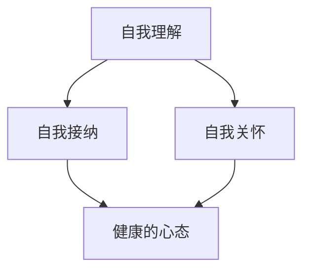

                 

# 文章标题：接纳不完美的自我：培养自我同情的能力

> 关键词：自我同情、心理健康、个人成长、自我理解、自我接纳

> 摘要：
本文深入探讨自我同情的重要性及其在个人成长和心理健康中的关键作用。通过分析自我同情的核心概念和培养方法，结合实际案例，本文旨在帮助读者理解并培养自我同情的能力，从而提升生活质量。

---

### 1.0 引言

在现代社会，个人成长和心理健康的议题日益受到关注。然而，许多人往往在追求完美中迷失自我，导致焦虑、抑郁等心理问题。自我同情，一种深刻的自我理解和关爱，正成为心理学领域的重要概念。本文《接纳不完美的自我：培养自我同情的能力》将围绕这一主题展开，探讨如何通过培养自我同情来促进个人成长和心理健康。

### 1.1 核心概念与联系

自我同情包括三个关键要素：自我理解、自我接纳和自我关怀。它们之间的关系可以用以下 Mermaid 流程图表示：

1. **自我理解**：指深入认识自己的情感、需求和价值观。
2. **自我接纳**：意味着接受自己的不完美，认识到每个人都有优点和缺点。
3. **自我关怀**：在困难时刻，给予自己支持和安慰，培养积极的生活态度。

这些要素相互关联，共同构成了一个健康的心理状态。

### 1.2 自我同情的重要性

自我同情对个人成长和心理健康具有深远的影响。它帮助我们从内心深处接纳自己，减少自我批评，增强心理韧性。以下是自我同情的重要性：

1. **减少焦虑和抑郁**：自我同情能帮助我们更好地应对生活中的压力和挫折，减少焦虑和抑郁的发生。
2. **增强心理韧性**：通过自我同情，我们能够更好地处理困难和挑战，从而增强心理韧性。
3. **提升生活质量**：自我同情能够改善我们的心理健康，进而提升整体的生活质量。

### 1.3 自我同情的培养方法

培养自我同情需要时间和实践。以下是一些具体的方法：

1. **自我理解**：通过内省和自我观察，了解自己的情感、需求和价值观。
2. **自我接纳**：接受自己的不完美，认识到每个人都有优点和缺点。
3. **自我关怀**：在困难时刻，给予自己支持和安慰，培养积极的生活态度。

### 1.4 自我同情在生活中的应用

自我同情在日常生活中有着广泛的应用。例如，当我们遇到挫折时，可以通过自我同情来调整心态，更好地应对困难。此外，在人际关系中，自我同情也有助于建立更加和谐的关系。

### 1.5 测量自我同情水平

通过自我同情量表，我们可以测量自己的自我同情水平。了解自己的水平有助于进一步培养和提高自我同情能力。

### 1.6 案例分析

本文将通过多个案例分析，展示自我同情在不同情境中的应用。通过这些案例，读者可以更好地理解自我同情的培养方法。

### 1.7 总结

自我同情是一种重要的心理品质，它对我们的成长和幸福具有深远的影响。通过本文的学习，读者可以掌握培养自我同情的方法，从而建立更加健康、积极的心态。

---

### 第2章：自我理解的培养

自我理解是自我同情的基石。只有深入了解自己的内心世界，我们才能更好地接纳自己，培养自我同情。

#### 2.1 内省与自我观察

内省和自我观察是培养自我理解的重要途径。通过这些方法，我们可以更好地认识自己的情感、需求和价值观。

**内省练习：**

- **每日反思**：每天花一些时间反思自己的行为和情感。可以写下当天的重要事件、自己的感受和反应。
- **情绪日记**：记录自己的情绪变化，分析触发情绪的原因。
- **自我反思**：思考自己的价值观和信念，了解它们如何影响自己的行为和决策。

**自我观察：**

- **观察行为**：注意自己在不同情境下的行为模式，了解自己的行为背后的动机。
- **观察反应**：观察自己对他人的反应，了解自己的情绪触发点。
- **他人反馈**：倾听他人的意见和反馈，从不同的角度认识自己。

#### 2.2 接纳自己的不完美

每个人都有优点和缺点，接纳自己的不完美是自我理解的关键一步。

**接纳不完美的练习：**

- **自我接纳清单**：列出自己的优点和缺点，接受自己的不完美。
- **优点放大镜**：专注于自己的优点，庆祝每一个小的进步。
- **缺点认知**：了解缺点，思考如何改进，而不是一味地自责。

#### 2.3 增强自我理解的方法

- **阅读**：通过阅读心理学、哲学和个人成长的书籍，学习他人的经验和观点。
- **咨询**：寻求专业心理咨询师的帮助，深入了解自己的心理状态。
- **日记**：坚持写日记，记录自己的思考、感受和行为，深入挖掘自己的内心。

---

### 第3章：自我接纳的实践

自我接纳是自我同情的核心。只有接纳自己的不完美，我们才能真正地关爱自己。

#### 3.1 接纳自己的不完美

接纳自己的不完美是一个逐步的过程，需要耐心和决心。

**接纳自己的不完美的步骤：**

1. **认识不完美**：承认每个人都有不完美的地方，这是人性的本质。
2. **放下自责**：停止对自己过高的要求，避免自责和批评。
3. **积极应对**：面对不完美，积极寻找改进的方法，而不是逃避。

**练习接纳自己的不完美：**

- **自我接纳练习**：每天花时间思考自己的不完美，接受它们，并尝试从中找到成长的机会。
- **感恩练习**：每天写下自己感激的事物，包括自己的优点和成就。
- **自我肯定**：每天对自己说一些积极的话，增强自我价值感。

#### 3.2 增强自我接纳的方法

**正念冥想**：

- **练习正念冥想**：通过正念冥想，提高对自己的觉知，接纳自己的不完美。
- **冥想步骤**：找一个安静的地方，坐下来，专注于呼吸，接受内心的所有情绪。

**感恩练习**：

- **每天感恩**：每天写下自己感激的事物，包括自己的优点和成就。
- **感恩清单**：定期回顾感恩清单，增强自我接纳。

**自我激励**：

- **设定小目标**：给自己设定小目标，每完成一个目标就庆祝一下。
- **自我奖励**：为自己设定奖励，当达成目标时给予自己奖励。

---

### 第4章：自我关怀的实践

自我关怀是自我同情的体现，它帮助我们在困难时刻给予自己支持和安慰。

#### 4.1 自我关怀的重要性

自我关怀不仅能帮助我们应对压力和挫折，还能提升我们的幸福感。

**自我关怀的重要性：**

- **缓解压力**：在压力和困难面前，自我关怀能帮助我们保持冷静，更好地应对挑战。
- **提升幸福感**：通过自我关怀，我们能够更好地照顾自己的身心健康，从而提升整体幸福感。
- **增强心理韧性**：自我关怀能够增强我们的心理韧性，让我们在逆境中更加坚强。

#### 4.2 自我关怀的方法

**日常自我关怀的方法：**

- **自我放松**：每天花一些时间放松自己，可以是冥想、深呼吸或简单的瑜伽。
- **健康饮食**：保持健康的饮食习惯，为身体提供充足的营养。
- **充足睡眠**：保证充足的睡眠时间，让身体和心灵得到充分的休息。
- **运动锻炼**：定期进行运动锻炼，提高身体的健康水平。

**紧急自我关怀的方法：**

- **情绪释放**：遇到困难时，找到适当的方式释放情绪，如倾诉、哭泣或写日记。
- **自我安慰**：在困难时刻，给自己一些安慰，如听音乐、看电影或和朋友聊天。
- **寻求支持**：在需要时，寻求家人、朋友或专业人士的支持和帮助。

#### 4.3 案例分析

**案例一**：小李，一个工作繁忙的程序员，因为长期加班和缺乏休息，感到身心疲惫。

**案例分析**：

- **自我关怀前**：小李在高压环境下工作，忽视了自我关怀，导致身心疲惫，工作效率下降。
- **自我关怀后**：小李开始每天进行自我关怀，如定期休息、健康饮食和锻炼。他还在工作中找到了平衡，提高了工作效率。

**案例二**：小王，一个年轻的创业者，因为创业过程中的挫折而感到沮丧。

**案例分析**：

- **自我关怀前**：小王在面对创业挫折时，感到无助和沮丧，缺乏自我关怀。
- **自我关怀后**：小王开始通过冥想、阅读和与朋友交流来调节情绪，同时寻求专业咨询帮助，逐渐走出了挫折。

---

### 第5章：自我同情在生活中的应用

自我同情在日常生活中有着广泛的应用。通过自我同情，我们能够更好地应对挑战，建立积极的人际关系。

#### 5.1 应对挫折

在日常生活中，我们难免会遇到挫折。自我同情能够帮助我们更好地应对这些挑战。

**应对挫折的步骤：**

1. **接受现实**：接受挫折是生活的一部分，每个人都会遇到。
2. **自我同情**：对自己表示同情，认识到每个人都会经历困难。
3. **积极应对**：寻找解决问题的方法，而不是逃避。

#### 5.2 建立积极的人际关系

自我同情不仅对个人有益，还能帮助我们建立更加和谐的人际关系。

**建立积极人际关系的步骤：**

1. **同理心**：尝试理解他人的感受和需求。
2. **支持他人**：在他人需要时给予支持和帮助。
3. **自我同情**：在处理人际关系时，对自己和他人都保持同情。

#### 5.3 实际应用案例

**案例一**：小张，一个学生，因为考试成绩不理想而感到沮丧。

**案例分析**：

- **自我同情前**：小张在考试失败后，自我批评和负面情绪占据了主导。
- **自我同情后**：小张开始自我同情，认识到每个人都会失败，重要的是从失败中学习。他制定了改进计划，并在下一次考试中取得了更好的成绩。

**案例二**：小王，一个职场人士，因为工作压力而与家人关系紧张。

**案例分析**：

- **自我同情前**：小王在高压工作环境下，对家人态度恶劣，导致家庭关系紧张。
- **自我同情后**：小王开始自我同情，意识到自己的行为对家人造成了伤害。他通过调整工作和生活方式，减少了压力，改善了与家人的关系。

---

### 第6章：测量自我同情水平

测量自我同情水平有助于我们了解自己的现状，并进一步培养自我同情能力。

#### 6.1 自我同情量表

自我同情量表是一种评估自我同情水平的工具。以下是一个简化的自我同情量表：

1. **我理解自己的感受和需求。**
2. **我能接受自己的不完美。**
3. **我在困难时刻能给予自己支持和安慰。**
4. **我能对他人的感受表示同情和理解。**
5. **我对他人的困难和挑战表示关心和支持。**

每个问题的答案分为1到5级，1代表非常不同意，5代表非常同意。通过计算总分，我们可以了解自己的自我同情水平。

#### 6.2 测量自我同情水平的方法

1. **自我评估**：通过自我同情量表进行自我评估，了解自己的自我同情水平。
2. **专业评估**：寻求专业心理咨询师的帮助，进行更全面的自我同情评估。
3. **定期反思**：定期反思自己的行为和心态，评估自我同情水平的变化。

#### 6.3 提高自我同情水平

1. **练习自我理解**：通过内省和自我观察，提高自我理解能力。
2. **练习自我接纳**：接受自己的不完美，培养自我接纳。
3. **练习自我关怀**：在困难时刻给予自己支持和安慰。

---

### 第7章：案例分析

通过以下案例分析，我们可以更深入地理解自我同情的培养和应用。

#### 案例一：职场压力下的自我同情

**案例背景**：李先生是一家公司的项目经理，工作压力巨大，常常感到焦虑和疲惫。

**自我同情实践**：

1. **内省与自我观察**：李先生开始每天记录自己的情绪和压力源，通过内省找到压力的根本原因。
2. **自我接纳**：李先生认识到每个人都有不完美，接受自己的压力和焦虑，并努力调整自己的期望。
3. **自我关怀**：李先生开始进行冥想和运动，以缓解压力，同时保持与家人和朋友的沟通，获得情感支持。

**结果**：通过自我同情，李先生的工作效率得到了提升，焦虑和压力减轻，家庭关系也得到了改善。

#### 案例二：人际关系中的自我同情

**案例背景**：王女士是一个全职母亲，在照顾孩子和家务中感到力不从心，与丈夫的关系也变得紧张。

**自我同情实践**：

1. **同理心与支持**：王女士开始尝试站在丈夫的角度考虑问题，给予丈夫更多的理解和支持。
2. **自我关怀**：王女士每天留出时间进行自我放松，如阅读或冥想，以缓解压力。
3. **家庭沟通**：王女士与丈夫进行深入的沟通，表达自己的需求和感受，共同寻找解决问题的方法。

**结果**：通过自我同情，王女士与丈夫的关系得到了改善，家庭氛围更加和谐。

---

### 第8章：总结与展望

自我同情是一种重要的心理品质，它对个人成长和心理健康具有深远的影响。通过自我同情，我们能够更好地接纳自己，提升生活质量，建立积极的人际关系。

**培养自我同情的方法**：

1. **自我理解**：通过内省和自我观察，深入了解自己的情感、需求和价值观。
2. **自我接纳**：接受自己的不完美，认识到每个人都有优点和缺点。
3. **自我关怀**：在困难时刻，给予自己支持和安慰，培养积极的生活态度。

**未来展望**：

随着心理学研究的不断深入，自我同情的重要性将得到更广泛的认可。通过培养自我同情，我们不仅能够提升自己的心理健康，还能为他人提供更多的支持和理解。

---

### 作者信息

**作者：AI天才研究院/AI Genius Institute & 禅与计算机程序设计艺术 /Zen And The Art of Computer Programming**

---

### 参考资料

1. **自我同情量表**：Self-Compassion Scale (SCS)，发展自自我同情心理学研究。
2. **正念冥想**：Mindfulness-Based Stress Reduction (MBSR) 研究与实践。
3. **感恩练习**：Gratitude Journal，有关感恩练习的研究和实践。
4. **自我激励**：Positive Psychology，自我激励的理论与实践。

---

### 结语

通过本文的探讨，我们希望读者能够认识到自我同情的重要性，并开始实践自我同情的培养。接纳不完美的自我，不仅能够提升个人心理健康，还能帮助我们建立更加积极、健康的人际关系。让我们共同迈向自我同情的旅程，开启更加美好的生活。

