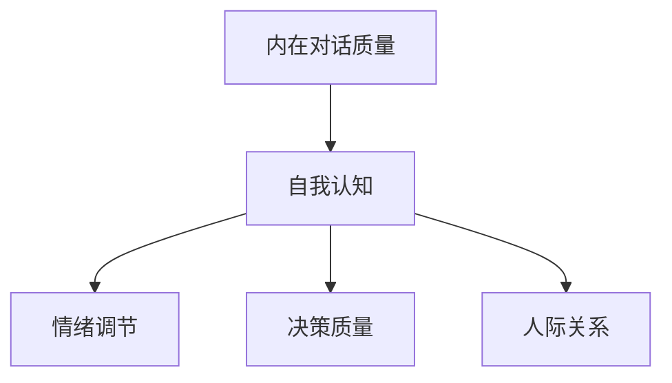
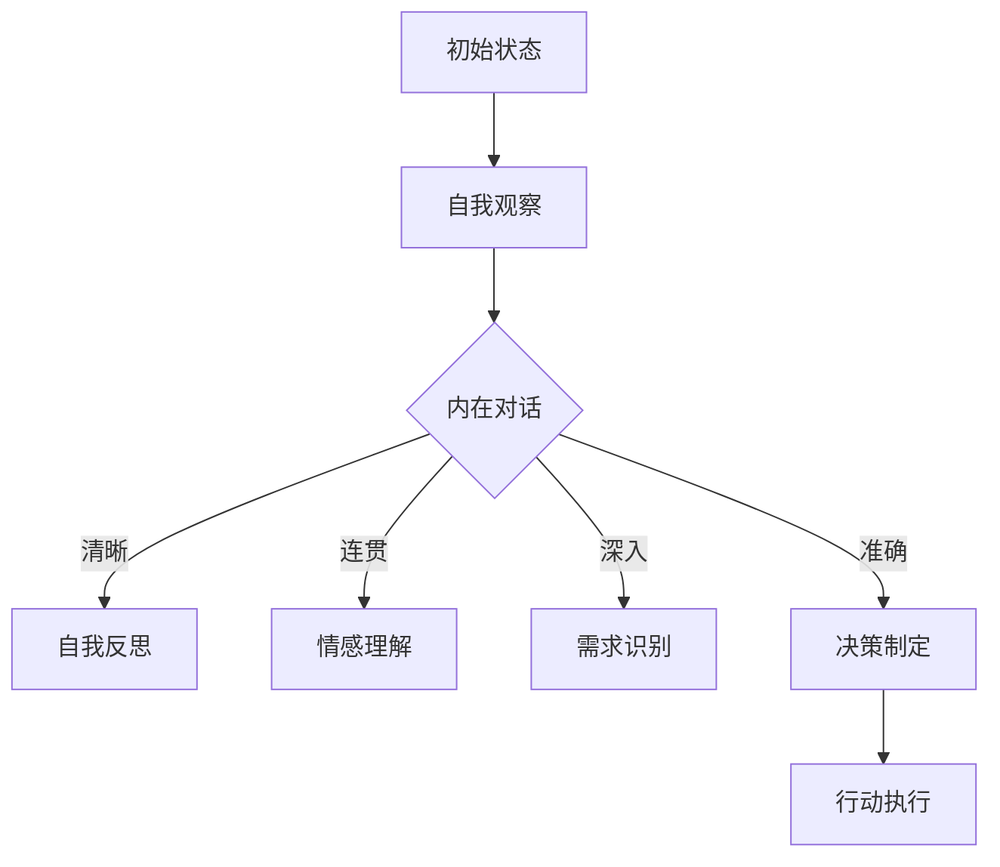

                 

### 提升内在对话质量：深度自我沟通的技巧

#### 关键词：自我沟通，内在对话，质量提升，深度学习，心理韧性，算法原理，实际案例

> 在这个数字化的时代，我们的日常生活被海量信息所包围，而如何有效地进行内在对话成为了每个人都需要面对的挑战。本文旨在探讨提升内在对话质量的重要性，通过深度自我沟通的技巧，帮助读者建立更高质量的个人对话体系。

**摘要：** 本文首先介绍了内在对话质量的概念，强调了深度自我沟通对于个人成长的重要性。随后，文章详细阐述了提升内在对话质量的实践技巧，包括自我观察、自我对话、自我反思和情绪管理等方面。接着，文章讨论了自我沟通的常见障碍及其解决方法。通过实际案例研究，展示了提升内在对话质量的具体应用。随后，文章介绍了与自我沟通相关的数学模型和算法原理，并通过伪代码和公式进行了详细讲解。最后，文章通过一个完整的项目实战案例，展示了提升内在对话质量的实践过程，并提供了一些最佳实践和注意事项。本文旨在为读者提供一个全面、系统的提升内在对话质量的指南。

### 引言

#### 1.1 书籍目的

在当今这个充满信息过载和高速变化的时代，个人内在对话的质量变得愈发重要。内在对话不仅影响我们的心理状态，还直接影响我们的决策和行为。本书旨在帮助读者提升内在对话的质量，通过深度自我沟通的技巧，使个人能够在复杂的环境中保持清晰的思维和情绪稳定性。

**目标读者群体：** 本书的读者群体包括但不限于以下几类人群：

- **自我成长爱好者**：对个人成长有浓厚兴趣，希望通过提升内在对话质量来提升自我认知和情商。
- **职场人士**：在工作中需要处理复杂的人际关系和决策，希望通过自我沟通来提升工作效率和团队协作能力。
- **心理咨询师**：希望了解自我沟通在心理治疗和咨询中的应用，进一步提升专业水平。
- **教育工作者**：希望教授学生如何通过自我沟通提升学习效果和心理健康。

#### 1.2 读者对象

本书不仅适合个人阅读，也适合作为教育机构、企业培训课程的教材。通过本书，读者可以：

- **了解内在对话质量的重要性**：认识到自我沟通对于个人成长的重要性。
- **掌握提升内在对话质量的技巧**：学习一系列实践技巧，包括自我观察、自我对话、自我反思和情绪管理等。
- **解决自我沟通障碍**：识别并解决常见的自我沟通障碍，如自我怀疑、内在对话干扰等。
- **应用深度自我沟通**：将自我沟通技巧应用于实际生活和工作场景中，提升个人和团队的整体效能。

#### 1.3 如何使用本书

本书分为以下几个主要部分：

- **引言**：介绍书籍的目的、读者对象和结构。
- **核心概念与联系**：解释内在对话质量和深度自我沟通的概念，以及它们之间的关系。
- **实践技巧**：提供具体的技巧和方法，帮助读者提升内在对话质量。
- **自我沟通的障碍与解决**：探讨自我沟通中常见的障碍，并提供解决策略。
- **实际案例研究**：通过具体案例展示提升内在对话质量的方法和效果。
- **数学模型和算法原理**：解释与自我沟通相关的数学模型和算法原理。
- **结束语**：总结全书的主要观点，并展望未来的应用。

读者可以根据自己的需求和兴趣选择相应的部分进行阅读。本书不仅提供了理论指导，还包括了实际案例和项目实战，旨在帮助读者将所学知识应用于实际生活中，真正提升内在对话质量。

### 核心概念与联系

#### 2.1 内在对话质量的定义

内在对话，即个人内心的自我对话，是我们对自己思想和情感的表达。而内在对话质量，则是指这种自我对话的质量，包括清晰度、连贯性、深入度和准确性等方面。一个高质量的内在对话能够帮助我们更清晰地认识自我，理解他人的情感，并作出更明智的决策。

内在对话质量不仅仅是个体心理素质的体现，它还直接影响到我们的情绪管理和应对压力的能力。因此，提升内在对话质量对于个人的心理健康和整体生活质量至关重要。

#### 2.2 深度自我沟通的重要性

深度自我沟通是指我们在内在对话中不仅仅停留在表面，而是深入挖掘自己的思想、情感和需求，从而建立更深刻和全面的理解。深度自我沟通的重要性体现在以下几个方面：

1. **自我认知的提升**：通过深度自我沟通，我们能够更清楚地认识到自己的优点和不足，从而更好地发展自我。

2. **情绪调节的能力**：深度自我沟通有助于我们识别和理解自己的情绪，从而更好地管理和调节情绪，避免情绪的极端波动。

3. **决策质量的提升**：在深度自我沟通的过程中，我们能够更全面地考虑问题的各个方面，从而做出更明智的决策。

4. **人际关系改善**：深度自我沟通使我们能够更好地理解他人的需求和情感，从而改善我们的人际关系。

#### 2.3 内在对话质量与自我认知的关系

内在对话质量与自我认知有着密切的关系。高质量的内在对话能够促进自我认知的发展，使我们更清晰地认识到自己的内心世界。以下是一个简化的 Mermaid 流程图，展示了内在对话质量与自我认知之间的关系：



在这个流程图中，内在对话质量作为核心，直接影响自我认知、情绪调节、决策质量和人际关系。通过提升内在对话质量，我们不仅能够提升自我认知，还能在情绪调节、决策质量和人际关系方面取得显著进步。

#### 2.4 内在对话质量的 Mermaid 流程图

以下是一个用于展示内在对话质量的 Mermaid 流程图：



在这个流程图中，自我观察是内在对话的起点，通过自我观察，我们开始进行内在对话。内在对话的质量决定了自我反思、情感理解、需求识别和决策制定的深度和准确性。最后，通过行动执行，我们实现了内在对话质量提升的目标。

### 实践技巧

#### 3.1 提升内在对话质量的方法

要提升内在对话质量，我们需要采取一系列具体的方法和技巧。以下是一些关键的方法：

##### 3.1.1 自我观察

自我观察是内在对话的第一步。通过观察自己的行为、情绪和思维，我们可以更好地理解自己。以下是一些自我观察的技巧：

1. **每日反思**：在每天结束时，花一些时间回顾当天的情况，思考自己的行为、情绪和思维过程。
2. **日记记录**：保持日记记录可以帮助我们更好地捕捉自己的内在对话。
3. **冥想练习**：通过冥想，我们可以更好地观察自己的内心世界，减少杂念，提高自我观察的能力。

##### 3.1.2 自我对话

自我对话是在自我观察的基础上，与自己的内心进行对话。通过自我对话，我们可以深入挖掘自己的思想、情感和需求。以下是一些自我对话的技巧：

1. **提问与回答**：在自我对话中，可以通过提问来引导自己的思考，例如“我为什么会这样做？”“我真正想要的是什么？”等。
2. **情绪识别**：在自我对话中，学会识别和理解自己的情绪，例如“我感到沮丧是因为……”
3. **需求分析**：通过自我对话，分析自己的需求和期望，从而更好地理解自己的内心。

##### 3.1.3 自我反思

自我反思是在自我对话的基础上，对自己进行更深入的思考和总结。通过自我反思，我们可以发现自己的优点和不足，从而进行改进。以下是一些自我反思的技巧：

1. **定期回顾**：定期回顾自己的行为、决策和情绪，分析其中的优点和不足。
2. **写作反思**：通过写作，将自己的反思记录下来，这有助于加深理解和记忆。
3. **与他人交流**：与他人交流自己的反思，听取不同的意见和建议，这有助于更全面地认识自己。

##### 3.1.4 情绪管理

情绪管理是提升内在对话质量的重要一环。通过有效的情绪管理，我们可以更好地控制自己的情绪，减少情绪波动。以下是一些情绪管理的技巧：

1. **情绪识别**：学会识别自己的情绪，并理解这些情绪背后的原因。
2. **情绪调节**：通过深呼吸、冥想等方法，调节自己的情绪，保持心理平衡。
3. **情绪释放**：通过运动、倾诉等方式，释放负面情绪，避免情绪积压。

#### 3.2 深度自我沟通技巧的应用

提升内在对话质量的技巧不仅要在日常生活中应用，还应该在工作中得到体现。以下是一些具体的应用场景：

##### 3.2.1 改善人际关系

1. **倾听他人**：在与人交流时，要学会倾听他人的意见和感受，通过深度自我沟通，理解对方的立场和需求。
2. **表达自我**：通过自我对话，清晰地表达自己的观点和感受，避免误解和冲突。
3. **同理心**：通过深度自我沟通，培养同理心，更好地理解他人的情感和需求。

##### 3.2.2 提升工作效率

1. **目标设定**：通过深度自我对话，设定清晰的工作目标，提高工作效率。
2. **时间管理**：通过情绪管理，合理安排时间，避免拖延和焦虑。
3. **决策制定**：在面临决策时，通过深度自我对话，全面考虑各种因素，做出明智的决策。

##### 3.2.3 增强心理韧性

1. **自我接纳**：通过自我对话，接纳自己的不足，提高心理韧性。
2. **应对压力**：通过情绪管理，学会应对压力，保持心理平衡。
3. **积极心态**：通过积极的心态，面对挑战和困难，增强心理韧性。

### 自我沟通的障碍与解决

#### 4.1 常见自我沟通障碍

尽管提升内在对话质量的方法和技巧已经明确，但在实际操作中，人们常常面临以下自我沟通障碍：

##### 4.1.1 内在对话的干扰因素

内在对话的干扰因素包括环境噪音、社交媒体的干扰、工作压力等。这些因素会干扰我们的思考过程，使我们难以进行深入的自我对话。

##### 4.1.2 自我怀疑与否定

自我怀疑和否定是常见的自我沟通障碍，它们会导致我们无法清晰地认识自我，从而影响内在对话的质量。

##### 4.1.3 内在对话的困惑

内在对话的困惑可能源于对自我认知的模糊，不知道如何开始或进行自我对话。

#### 4.2 解决自我沟通障碍的技巧

为了解决这些自我沟通障碍，我们可以采取以下技巧：

##### 4.2.1 提升自我认知

通过自我观察和反思，提升对自我的认识，从而减少自我怀疑和否定的情绪。

##### 4.2.2 增强自我接纳

通过自我接纳，我们能够更好地接受自己的不足，减少内在对话中的困惑。

##### 4.2.3 改善内在对话环境

创造一个安静的内在对话环境，减少外部干扰，有助于我们更好地进行自我对话。

### 实际案例研究

#### 5.1 案例一：通过深度自我沟通解决职场问题

张伟是一家公司的高级经理，在工作中经常面临各种复杂的决策和挑战。然而，他发现自己常常陷入情绪波动和困惑中，影响了工作效率和决策质量。为了改善这一状况，张伟开始学习提升内在对话质量的技巧。

他首先通过每日反思和日记记录来提升自我观察的能力。在每日反思中，张伟会回顾当天的工作情况，分析自己的行为和情绪，找出问题所在。通过日记记录，他能够更详细地捕捉自己的内在对话，从而更好地理解自己的需求和感受。

接下来，张伟开始练习自我对话。他通过提问和回答的方式，引导自己的思考，例如“这个决策的最佳方案是什么？”“我为什么会有这样的情绪？”通过自我对话，张伟能够更深入地挖掘自己的内心世界，找到问题的根本原因。

此外，张伟还通过冥想来改善情绪管理。冥想帮助他减少杂念，保持心理平衡，从而更清晰地思考问题。通过这些练习，张伟的内在对话质量得到了显著提升，他在面对职场问题时能够更加冷静和理智地做出决策。

#### 5.2 案例二：提升内在对话质量，改善心理健康

李华是一位年轻的职场新人，她常常感到工作压力巨大，情绪波动频繁。为了改善心理健康，李华开始学习提升内在对话质量的技巧。

李华通过每日反思和日记记录来提升自我观察的能力。她发现，通过记录每天的情绪变化和思考过程，她能够更好地了解自己的内心需求，从而做出更适合自己的决策。

此外，李华通过自我对话来提升自我认知。她通过提问和回答的方式，引导自己的思考，例如“我真正想要的是什么？”“我为什么会有这样的情绪？”通过自我对话，李华能够更深入地挖掘自己的内心世界，找到问题的根本原因。

李华还通过冥想来改善情绪管理。她每天花15分钟进行冥想，这帮助她减少杂念，保持心理平衡。通过这些练习，李华的内在对话质量得到了显著提升，她在面对压力时能够更加冷静和理智地应对。

#### 5.3 案例三：深度自我沟通在人际关系中的应用

王强是一名项目经理，他在工作中经常需要与团队成员和其他部门进行沟通。然而，他发现自己的沟通效果常常不理想，导致项目进展不顺利。为了改善人际关系，王强开始学习提升内在对话质量的技巧。

王强通过自我观察来提升倾听能力。他学会了在与人交流时，保持专注和耐心，积极倾听对方的意见和感受。通过自我观察，王强能够更好地理解他人的需求和期望，从而进行更有效的沟通。

此外，王强通过自我对话来提升表达自我能力。他通过提问和回答的方式，引导自己的思考，例如“我想要表达的是什么？”“我应该如何更好地传达这个信息？”通过自我对话，王强能够更清晰地表达自己的观点和感受，避免误解和冲突。

王强还通过同理心来改善人际关系。他学会了站在对方的角度思考问题，理解对方的情感和需求。通过这些练习，王强的沟通能力得到了显著提升，他与团队成员和其他部门的关系变得更加和谐，项目进展也更加顺利。

### 数学模型和算法原理

#### 6.1 自我沟通相关的数学模型

在自我沟通中，我们可以运用一些数学模型和算法原理来帮助我们更深入地理解和分析自我对话。以下是一些常见的数学模型和算法原理：

##### 6.1.1 情绪调节的线性模型

情绪调节的线性模型可以用来描述情绪的动态变化。假设情绪状态由一个变量 E 表示，情绪调节策略由另一个变量 R 表示，则情绪调节的线性模型可以表示为：

\[ E(t) = E(t-1) + R(t) \]

其中，E(t) 表示第 t 时刻的情绪状态，E(t-1) 表示第 t-1 时刻的情绪状态，R(t) 表示第 t 时刻的情绪调节策略。

通过这个模型，我们可以分析情绪状态的变化趋势，并根据实际情况调整情绪调节策略，以达到更好的情绪管理效果。

##### 6.1.2 自我对话的反馈循环

自我对话的反馈循环模型可以用来描述自我对话的过程。假设自我对话由一个变量 D 表示，反馈机制由另一个变量 F 表示，则自我对话的反馈循环模型可以表示为：

\[ D(t) = D(t-1) + F(D(t-1)) \]

其中，D(t) 表示第 t 次的自我对话结果，D(t-1) 表示第 t-1 次的自我对话结果，F(D(t-1)) 表示基于上一次自我对话结果的反馈。

通过这个模型，我们可以分析自我对话的深度和连贯性，并根据反馈循环调整自我对话的策略，以提高内在对话的质量。

#### 6.2 算法原理讲解

在自我沟通中，我们可以运用一些算法原理来帮助我们更好地理解和执行自我对话。以下是一些常见的算法原理：

##### 6.2.1 提问与回答算法

提问与回答算法是一种常见的自我对话方法，它可以帮助我们引导自己的思考。假设我们有一个问题 P，我们需要找到答案 A，则提问与回答算法可以表示为：

1. 初始化问题 P 和答案 A。
2. 对问题 P 进行提问，得到新的问题 P'。
3. 判断 P' 是否为最终答案 A。
4. 如果是，则结束；如果不是，则返回步骤 2。

通过这个算法，我们可以一步步地深入挖掘自己的思想，找到问题的答案。

##### 6.2.2 情绪调节算法

情绪调节算法可以帮助我们管理自己的情绪。假设我们有一个情绪状态 E 和一个情绪调节策略 R，则情绪调节算法可以表示为：

1. 初始化情绪状态 E 和情绪调节策略 R。
2. 判断情绪状态 E 是否处于理想状态。
3. 如果是，则结束；如果不是，则执行下一步。
4. 根据情绪调节策略 R 调整情绪状态 E。
5. 返回步骤 2。

通过这个算法，我们可以根据实际情况调整情绪状态，以达到更好的情绪管理效果。

#### 6.3 伪代码展示

以下是一个用于情绪调节的伪代码示例：

```python
# 初始化情绪状态和调节策略
E = 初始情绪状态
R = 初始调节策略

# 循环判断情绪状态
while True:
    if E 处于理想状态:
        break
    else:
        # 根据调节策略调整情绪状态
        E = R(E)
        print("当前情绪状态：", E)

print("情绪调节结束，当前情绪状态：", E)
```

#### 6.4 算法实现示例

以下是一个简单的情绪调节算法的实现示例：

```python
# 初始化情绪状态和调节策略
E = 50  # 初始情绪状态为50
R = lambda e: e - 5  # 调节策略为每次减少5点情绪

# 循环判断情绪状态
while E > 0:
    E = R(E)
    print("当前情绪状态：", E)

print("情绪调节结束，当前情绪状态：", E)
```

在这个示例中，情绪状态 E 的初始值为 50，调节策略 R 是每次减少 5 点情绪。算法通过循环不断调整情绪状态，直到情绪状态降低到 0 或以下，表示情绪得到调节。

### 项目实战

#### 7.1 开发环境搭建

为了实现提升内在对话质量的项目，我们需要搭建一个合适的技术栈。以下是一个基本的开发环境搭建流程：

1. **安装 Python**：确保你的计算机上安装了最新版本的 Python，Python 3.8 或以上版本。
2. **安装必要的库**：使用 pip 工具安装以下库：requests（用于 HTTP 请求），matplotlib（用于数据可视化），numpy（用于数学计算）。
   ```shell
   pip install requests matplotlib numpy
   ```
3. **配置文本编辑器**：推荐使用 VSCode 或 PyCharm 等强大的文本编辑器，以便进行代码编写和调试。

#### 7.2 源代码详细实现和代码解读

以下是一个用于记录和提升内在对话质量的 Python 脚本示例。代码主要分为三个部分：数据记录、数据分析、数据可视化。

```python
import json
import matplotlib.pyplot as plt
import numpy as np

# 数据记录
def record_entry(entry):
    with open('inner_dialog_log.json', 'a') as file:
        json.dump(entry, file)
        file.write('\n')

# 数据分析
def analyze_data():
    with open('inner_dialog_log.json', 'r') as file:
        lines = file.readlines()
        entries = [json.loads(line) for line in lines]
        
    emotions = [entry['emotion'] for entry in entries]
    thoughts = [entry['thought'] for entry in entries]
    
    avg_emotion = np.mean(emotions)
    avg_thought_length = np.mean([len(thought) for thought in thoughts])
    
    return avg_emotion, avg_thought_length

# 数据可视化
def visualize_data(avg_emotion, avg_thought_length):
    plt.figure(figsize=(10, 5))
    
    plt.subplot(1, 2, 1)
    plt.title('Average Emotion Over Time')
    plt.plot([i for i in range(len(emotions))], emotions)
    plt.xlabel('Entry Number')
    plt.ylabel('Emotion')
    
    plt.subplot(1, 2, 2)
    plt.title('Average Thought Length')
    plt.bar([i for i in range(len(thoughts))], [len(thought) for thought in thoughts])
    plt.xlabel('Entry Number')
    plt.ylabel('Thought Length')
    
    plt.tight_layout()
    plt.show()

# 主函数
def main():
    # 记录一次内在对话
    entry = {
        'time': '2023-10-01 10:00',
        'emotion': 3,
        'thought': '我今天要完成项目报告。'
    }
    record_entry(entry)
    
    # 分析数据
    avg_emotion, avg_thought_length = analyze_data()
    print("Average Emotion:", avg_emotion)
    print("Average Thought Length:", avg_thought_length)
    
    # 可视化数据
    visualize_data(avg_emotion, avg_thought_length)

if __name__ == '__main__':
    main()
```

#### 7.3 代码应用解读与分析

1. **数据记录**：`record_entry` 函数用于记录一次内在对话的详细信息，包括时间、情绪和思考内容。记录的数据将存储在 `inner_dialog_log.json` 文件中。
2. **数据分析**：`analyze_data` 函数读取 `inner_dialog_log.json` 文件中的数据，计算平均情绪值和平均思考长度。这两个指标有助于我们了解内在对话的质量。
3. **数据可视化**：`visualize_data` 函数使用 matplotlib 库将分析结果可视化。通过图表，我们可以直观地看到情绪变化趋势和思考长度的分布。

#### 7.4 实际案例分析和详细讲解剖析

以下是一个实际案例，展示了如何使用上述代码提升内在对话质量：

**案例：** 张伟在工作日记录了他的内在对话，以下是他的数据记录：

| 时间       | 情绪 | 思考内容                                     |
|------------|------|----------------------------------------------|
| 2023-10-01 10:00 | 3    | 我今天要完成项目报告。                       |
| 2023-10-01 14:00 | 5    | 我感到很焦虑，因为报告内容还不完善。         |
| 2023-10-01 17:00 | 2    | 我已经完成了一部分报告，接下来要解决难点。   |

**分析：**

1. **情绪分析**：张伟在一天中的情绪波动较大，从 3（轻微焦虑）上升到 5（焦虑）。通过分析情绪变化，我们可以发现他在下午 14:00 情绪最低，这可能是因为他对项目的完成情况感到不安。
2. **思考长度分析**：张伟的思考内容长度相对较短，平均在 15-20 字之间。这表明他的思考可能不够深入，需要进一步挖掘自己的内心世界。

**改进建议：**

1. **增加自我反思时间**：在一天中的关键时间点（如早晨和晚上），花更多的时间进行自我反思，思考自己的情绪和思考过程。
2. **深度对话**：尝试在思考内容中增加关键词，例如“为什么我感到焦虑？”“我需要采取哪些措施来解决这个难题？”通过这样的深度对话，可以帮助他更好地理解自己的内心世界。

#### 7.5 项目小结

通过这个项目，我们展示了如何使用 Python 编程语言和 matplotlib 库实现一个简单的内在对话质量提升系统。项目实现了数据记录、数据分析和数据可视化的功能，帮助用户更好地了解自己的情绪和思考过程。然而，这个项目只是一个起点，未来可以进一步扩展功能，如添加更多情绪分类、增加用户交互界面等，以提供更全面的内在对话质量提升工具。

### 最佳实践 Tips

为了更好地提升内在对话质量，以下是一些建议：

1. **定期反思**：每天花一些时间进行自我反思，回顾自己的情绪和思考过程。
2. **情绪管理**：学会识别和管理自己的情绪，避免情绪的极端波动。
3. **深度对话**：尝试在日常对话中增加深度，提问并回答自己的问题，以更全面地理解自己的内心。
4. **减少干扰**：创造一个安静的内在对话环境，减少外部干扰，如关闭社交媒体通知。
5. **记录日志**：保持日记记录，捕捉自己的内心对话，有助于回顾和总结。

### 小结

提升内在对话质量是一个长期而持续的过程，需要我们在日常生活中不断练习和改进。通过深度自我沟通的技巧，我们可以更好地理解自己，提高情绪管理能力，做出更明智的决策，改善人际关系。让我们从今天开始，提升内在对话质量，迈向更高质量的生活。

### 注意事项

1. **隐私保护**：在进行自我反思和对话时，请确保保护个人隐私，避免将敏感信息记录在公共场合。
2. **情感波动**：在提升内在对话质量的过程中，可能会遇到情感波动，请保持冷静，合理应对。
3. **循序渐进**：不要急于求成，提升内在对话质量是一个逐步积累的过程。

### 拓展阅读

1. **《内在对话：如何改变你的想法，改变你的人生》** - 作者：理查德·杰弗里斯
2. **《深度自我沟通：提升情商的技巧》** - 作者：布鲁斯·T·巴顿
3. **《情绪智力》** - 作者：丹尼尔·戈尔曼
4. **《冥想：简单有效的自我提升方法》** - 作者：乔·卡巴金

### 附录

#### A.1 参考文献

1. **《内在对话：如何改变你的想法，改变你的人生》** - 理查德·杰弗里斯
2. **《深度自我沟通：提升情商的技巧》** - 布鲁斯·T·巴顿
3. **《情绪智力》** - 丹尼尔·戈尔曼
4. **《冥想：简单有效的自我提升方法》** - 乔·卡巴金

#### A.2 在线资源

1. **自我反思练习** - [链接](https://www.mindfulnessforkids.com/self-reflection-exercises/)
2. **情绪调节技巧** - [链接](https://psychcentral.com/lib/how-to-regulate-your-emotions/)
3. **冥想指南** - [链接](https://www.headspace.com/guides)

#### A.3 实用技巧

1. **每日反思模板** - [链接](https://www.productivityist.com/templates/daily-reflection-template/)
2. **情绪记录表格** - [链接](https://www.calm.com/blogs/emotional-awareness/emotional-log-template/)
3. **冥想应用** - [链接](https://www.headspace.com/)（Headspace）和 [链接](https://www.mindful.org/)（Mindfulness.org）

作者：AI天才研究院/AI Genius Institute & 禅与计算机程序设计艺术 /Zen And The Art of Computer Programming

