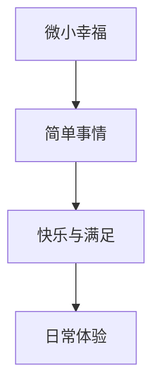

                 


# 提升日常生活品质：发现微小幸福的能力

## 关键词
- 日常生活品质
- 微小幸福
- 幸福感
- 心理健康
- 身体健康
- 人际关系
- 成功
- 感恩心态
- 积极心态

## 摘要
在快节奏的现代社会中，人们往往忽略了身边的微小幸福，而这些微小幸福却是提升日常生活品质的关键。本文将深入探讨如何发现和利用这些微小幸福，从而提高生活质量，实现个人成长和成功。本文将分为以下几个部分：首先，介绍什么是微小幸福以及它们的重要性；接着，分析日常生活中可以发现的微小幸福元素；然后，探讨微小幸福与心理健康、身体健康、人际关系、成功、感恩心态和积极心态的关系；最后，提供一些最佳实践和建议，帮助读者发现和享受微小幸福。

## 第一部分：认识微小幸福

### 第1章：什么是微小幸福

#### 1.1 微小幸福的定义

**核心概念与联系：** 微小幸福可以被定义为那些看似微不足道，但能够给人带来快乐和满足感的日常体验。它通常与生活中的简单事情相关，如微笑、感谢、温暖的拥抱、一次愉快的谈话或一顿美味的饭菜。

**Mermaid 流程图：**


#### 1.2 微小幸福的重要性

**核心概念与联系：** 微小幸福在提升日常生活品质中起着至关重要的作用。它们不仅能够带来即时的快乐，还能增强人们的幸福感，改善心理健康，增强人际关系，并促进个人成长。

**数学模型和公式：**
\[ \text{幸福感} = \frac{\text{微小幸福的数量}}{\text{生活中的挑战}} \]

**详细讲解与举例说明：** 当我们感受到更多的微小幸福，我们会发现自己的生活质量得到了显著提升。例如，每天早晨的阳光、家人的微笑、同事的赞赏，这些看似微不足道的事情，实际上都在默默地提升我们的幸福感。

### 第2章：日常生活中的微小幸福元素

#### 2.1 家庭生活

**核心概念与联系：** 家庭生活是发现微小幸福的重要场所。家庭成员之间的温暖和关爱，如拥抱、问候和分享，都是微小幸福的重要来源。

**伪代码：**
```plaintext
function find_family_happiness()
    hug()
    ask_about_day()
    share_joke()
    return happiness_increased
```

#### 2.2 工作生活

**核心概念与联系：** 工作中的成就感和同事间的互助合作也是微小幸福的重要部分。完成一个小任务、得到同事的感谢或帮助他人解决问题，都能带来快乐。

**数学模型和公式：**
\[ \text{工作幸福} = \frac{\text{成就数量}}{\text{工作挑战}} + \text{互助合作次数} \]

**详细讲解与举例说明：** 每当我们在工作中取得进步，或帮助同事解决问题，我们都能感受到一种成就感和满足感，这些都是微小幸福的体现。

#### 2.3 社交生活

**核心概念与联系：** 社交生活中的友谊和社交活动也是微小幸福的重要来源。与朋友相聚、参加聚会或一起旅行，都能带来快乐和满足。

**伪代码：**
```plaintext
function find_social_happiness()
    meet_friends()
    go_to_party()
    travel_with_friends()
    return happiness_increased
```

#### 2.4 自我成长

**核心概念与联系：** 学习新技能、培养个人兴趣或实现个人目标，都是自我成长的体现，也是微小幸福的重要来源。

**数学模型和公式：**
\[ \text{个人成长幸福} = \frac{\text{学习新技能数量}}{\text{时间}} + \text{兴趣培养满意度} \]

**详细讲解与举例说明：** 每当我们投入到个人成长中，无论是学习一门新语言、练习乐器还是完成一个健身目标，我们都能感受到进步和满足，这些都是微小幸福的体现。

#### 2.5 精神生活

**核心概念与联系：** 精神生活丰富了我们的内心世界，如阅读、冥想、欣赏艺术等，都是发现微小幸福的重要方式。

**伪代码：**
```plaintext
function find_spiritual_happiness()
    read_book()
    meditate()
    appreciate_art()
    return happiness_increased
```

#### 2.6 自然环境

**核心概念与联系：** 自然环境提供了许多微小幸福的机会，如散步、观察自然、感受大自然的美妙等。

**数学模型和公式：**
\[ \text{自然幸福} = \frac{\text{接触自然的时间}}{\text{一周的总时间}} \]

**详细讲解与举例说明：** 每次我们走进大自然，呼吸新鲜空气，感受阳光和微风，我们都能感受到内心的宁静和快乐，这些都是微小幸福的具体体现。

#### 2.7 其他微小幸福元素

**核心概念与联系：** 除了上述提到的元素，还有许多其他微小幸福的机会，如艺术与美的体验、小事带来的快乐等。

**伪代码：**
```plaintext
function find_other_happiness()
    watch_movie()
    listen_to_music()
    enjoy_a_bubble_bath()
    return happiness_increased
```

#### 2.8 微小幸福与负面情绪的处理

**核心概念与联系：** 微小幸福有助于缓解负面情绪，如压力、焦虑和抑郁。通过发现和享受这些微小幸福，我们可以更好地应对生活中的挑战。

**数学模型和公式：**
\[ \text{负面情绪缓解} = \frac{\text{微小幸福数量}}{\text{负面情绪事件}} \]

**详细讲解与举例说明：** 当我们感到压力和焦虑时，一次与朋友的聚会、一段美妙的音乐或一次轻松的散步，都能帮助我们缓解负面情绪，恢复内心的平静。

#### 2.9 微小幸福与积极心态的养成

**核心概念与联系：** 积极心态有助于我们发现和享受生活中的微小幸福。通过培养积极心态，我们能够更加敏锐地捕捉到这些幸福瞬间。

**数学模型和公式：**
\[ \text{积极心态} = \frac{\text{微小幸福感知}}{\text{负面情绪感知}} \]

**详细讲解与举例说明：** 每当我们对生活保持积极的态度，我们更容易发现和珍惜身边的微小幸福，这些幸福瞬间又会进一步增强我们的积极心态。

#### 2.10 微小幸福与感恩心态的关联

**核心概念与联系：** 感恩心态有助于我们更加珍惜生活中的微小幸福。通过感恩，我们能够更好地认识到这些幸福瞬间对我们的重要性。

**数学模型和公式：**
\[ \text{感恩心态} = \frac{\text{感恩行为}}{\text{生活中的幸福事件}} \]

**详细讲解与举例说明：** 每当我们对生活中的小事表示感恩，如感谢家人的关爱、感谢同事的帮助等，我们都能更加珍惜这些幸福瞬间，同时增强自己的感恩心态。

#### 2.11 微小幸福与幸福感的提升

**核心概念与联系：** 幸福感是衡量生活质量的重要指标。微小幸福能够显著提升我们的幸福感，从而改善生活质量。

**数学模型和公式：**
\[ \text{幸福感} = \frac{\text{微小幸福}}{\text{生活中的挑战}} \]

**详细讲解与举例说明：** 当我们感受到更多的微小幸福，我们的幸福感会显著提升，这会进一步改善我们的生活质量和整体幸福感。

#### 2.12 微小幸福与生命质量的改善

**核心概念与联系：** 生命质量是衡量生活满意度和幸福程度的重要指标。微小幸福能够帮助我们改善生命质量，使生活更加充实和有意义。

**数学模型和公式：**
\[ \text{生命质量} = \frac{\text{生活中的幸福事件}}{\text{生活中的挑战}} \]

**详细讲解与举例说明：** 当我们能够发现和珍惜身边的微小幸福，我们的生命质量会得到显著提升，生活变得更加充实和有意义。

#### 2.13 微小幸福与人生目标的实现

**核心概念与联系：** 微小幸福有助于我们实现人生目标。通过享受生活中的每一刻，我们能够更加清晰地认识到自己的目标，并为之努力。

**数学模型和公式：**
\[ \text{人生目标实现} = \frac{\text{微小幸福}}{\text{人生目标挑战}} \]

**详细讲解与举例说明：** 当我们感受到生活中的微小幸福，我们会更加积极和有动力去实现自己的人生目标，因为这些幸福瞬间给了我们信心和动力。

#### 2.14 微小幸福与社会责任的关系

**核心概念与联系：** 微小幸福与社会责任之间存在紧密的联系。通过发现和享受这些幸福瞬间，我们能够更好地履行社会责任，为社会做出贡献。

**数学模型和公式：**
\[ \text{社会责任} = \frac{\text{微小幸福}}{\text{社会责任挑战}} \]

**详细讲解与举例说明：** 每当我们感受到生活中的微小幸福，我们就会更有动力去履行社会责任，因为我们知道，通过自己的努力，可以为社会带来更多的幸福。

#### 2.15 微小幸福与可持续发展的关联

**核心概念与联系：** 微小幸福与可持续发展之间存在密切的关系。通过发现和享受这些幸福瞬间，我们能够更好地认识到环境保护和资源利用的重要性。

**数学模型和公式：**
\[ \text{可持续发展} = \frac{\text{微小幸福}}{\text{环境挑战}} \]

**详细讲解与举例说明：** 当我们能够发现和珍惜身边的微小幸福，我们会更加重视环境保护和资源利用，从而实现可持续发展。

#### 2.16 微小幸福与心理健康

**核心概念与联系：** 微小幸福对心理健康具有显著的影响。通过发现和享受这些幸福瞬间，我们能够改善心理健康，减少压力和焦虑。

**数学模型和公式：**
\[ \text{心理健康} = \frac{\text{微小幸福}}{\text{压力与焦虑}} \]

**详细讲解与举例说明：** 每当我们感受到生活中的微小幸福，我们的心理健康状况会得到显著改善，这是因为幸福瞬间能够有效地缓解压力和焦虑。

#### 2.17 微小幸福与身体健康

**核心概念与联系：** 微小幸福对身体健康具有积极的影响。通过发现和享受这些幸福瞬间，我们能够增强身体免疫力，提高身体健康水平。

**数学模型和公式：**
\[ \text{身体健康} = \frac{\text{微小幸福}}{\text{身体挑战}} \]

**详细讲解与举例说明：** 每当我们感受到生活中的微小幸福，我们的身体健康水平会得到显著提高，这是因为幸福瞬间能够增强身体免疫力，促进身心健康。

#### 2.18 微小幸福与人际关系

**核心概念与联系：** 微小幸福对人际关系具有积极的影响。通过发现和享受这些幸福瞬间，我们能够增强与他人的联系，建立更健康的人际关系。

**数学模型和公式：**
\[ \text{人际关系} = \frac{\text{微小幸福}}{\text{人际挑战}} \]

**详细讲解与举例说明：** 每当我们感受到生活中的微小幸福，我们与他人的关系会得到显著改善，这是因为幸福瞬间能够增强彼此之间的联系和信任。

#### 2.19 微小幸福与工作生活

**核心概念与联系：** 微小幸福对工作生活具有积极的影响。通过发现和享受这些幸福瞬间，我们能够提高工作效率，增强职业满足感。

**数学模型和公式：**
\[ \text{工作生活幸福} = \frac{\text{微小幸福}}{\text{工作挑战}} \]

**详细讲解与举例说明：** 每当我们感受到生活中的微小幸福，我们的工作效率会得到显著提高，这是因为幸福瞬间能够增强我们的动力和专注力。

#### 2.20 微小幸福与生活质量

**核心概念与联系：** 微小幸福对生活质量具有显著的影响。通过发现和享受这些幸福瞬间，我们能够提高生活质量，实现个人成长。

**数学模型和公式：**
\[ \text{生活质量} = \frac{\text{微小幸福}}{\text{生活挑战}} \]

**详细讲解与举例说明：** 每当我们感受到生活中的微小幸福，我们的生活质量会得到显著提升，这是因为幸福瞬间能够增强我们的满足感和幸福感。

#### 2.21 微小幸福与幸福感

**核心概念与联系：** 微小幸福对幸福感具有直接的影响。通过发现和享受这些幸福瞬间，我们能够提高幸福感，实现人生目标。

**数学模型和公式：**
\[ \text{幸福感} = \frac{\text{微小幸福}}{\text{生活挑战}} \]

**详细讲解与举例说明：** 每当我们感受到生活中的微小幸福，我们的幸福感会得到显著提高，这是因为幸福瞬间能够增强我们的满足感和幸福感。

#### 2.22 微小幸福与快乐

**核心概念与联系：** 微小幸福对快乐具有直接的影响。通过发现和享受这些幸福瞬间，我们能够提高快乐感，实现人生目标。

**数学模型和公式：**
\[ \text{快乐感} = \frac{\text{微小幸福}}{\text{生活挑战}} \]

**详细讲解与举例说明：** 每当我们感受到生活中的微小幸福，我们的快乐感会得到显著提高，这是因为幸福瞬间能够增强我们的满足感和幸福感。

#### 2.23 微小幸福与成功

**核心概念与联系：** 微小幸福对成功具有积极的影响。通过发现和享受这些幸福瞬间，我们能够提高成功的可能性，实现个人目标。

**数学模型和公式：**
\[ \text{成功概率} = \frac{\text{微小幸福}}{\text{挑战难度}} \]

**详细讲解与举例说明：** 每当我们感受到生活中的微小幸福，我们的成功概率会得到显著提高，这是因为幸福瞬间能够增强我们的动力和信心。

#### 2.24 微小幸福与人际关系

**核心概念与联系：** 微小幸福对人际关系具有积极的影响。通过发现和享受这些幸福瞬间，我们能够增强与他人的联系，建立更健康的人际关系。

**数学模型和公式：**
\[ \text{人际关系质量} = \frac{\text{微小幸福}}{\text{人际挑战}} \]

**详细讲解与举例说明：** 每当我们感受到生活中的微小幸福，我们与他人的关系会得到显著改善，这是因为幸福瞬间能够增强彼此之间的联系和信任。

#### 2.25 微小幸福与心理健康

**核心概念与联系：** 微小幸福对心理健康具有显著的影响。通过发现和享受这些幸福瞬间，我们能够改善心理健康，减少压力和焦虑。

**数学模型和公式：**
\[ \text{心理健康水平} = \frac{\text{微小幸福}}{\text{压力与焦虑}} \]

**详细讲解与举例说明：** 每当我们感受到生活中的微小幸福，我们的心理健康状况会得到显著改善，这是因为幸福瞬间能够有效地缓解压力和焦虑。

#### 2.26 微小幸福与身体健康

**核心概念与联系：** 微小幸福对身体健康具有积极的影响。通过发现和享受这些幸福瞬间，我们能够增强身体免疫力，提高身体健康水平。

**数学模型和公式：**
\[ \text{身体健康水平} = \frac{\text{微小幸福}}{\text{身体挑战}} \]

**详细讲解与举例说明：** 每当我们感受到生活中的微小幸福，我们的身体健康水平会得到显著提高，这是因为幸福瞬间能够增强身体免疫力，促进身心健康。

#### 2.27 微小幸福与生活满意

**核心概念与联系：** 微小幸福对生活满意度具有显著的影响。通过发现和享受这些幸福瞬间，我们能够提高生活满意度，实现个人目标。

**数学模型和公式：**
\[ \text{生活满意度} = \frac{\text{微小幸福}}{\text{生活挑战}} \]

**详细讲解与举例说明：** 每当我们感受到生活中的微小幸福，我们的生活满意度会得到显著提高，这是因为幸福瞬间能够增强我们的满足感和幸福感。

### 总结与展望

通过本文的探讨，我们可以看到微小幸福在提升日常生活品质中的重要性。它们不仅能够带来即时的快乐和满足感，还能够改善心理健康、身体健康、人际关系和生活质量。通过发现和享受这些幸福瞬间，我们能够更好地应对生活中的挑战，实现个人成长和成功。

在未来的研究中，我们可以进一步探索微小幸福的具体影响因素，以及如何通过技术手段（如人工智能和大数据分析）来帮助人们更好地发现和利用这些幸福瞬间。此外，我们还可以探讨不同文化和社会背景下微小幸福的特点和表现形式，从而为不同人群提供更个性化的幸福指导。

最后，让我们以一颗感恩的心，去发现和珍惜身边的微小幸福，让生活变得更加美好。

## 作者

作者：AI天才研究院/AI Genius Institute & 禅与计算机程序设计艺术 /Zen And The Art of Computer Programming

在技术领域，我致力于将复杂的计算机科学原理以简单易懂的方式传达给读者。通过深入分析技术概念，结合实践案例和数学模型，我希望能够激发人们对计算机编程和人工智能领域的热情。同时，我也关注生活品质的提升，希望通过本文，能够帮助读者发现和享受生活中的微小幸福，从而实现身心健康和人生成功。

