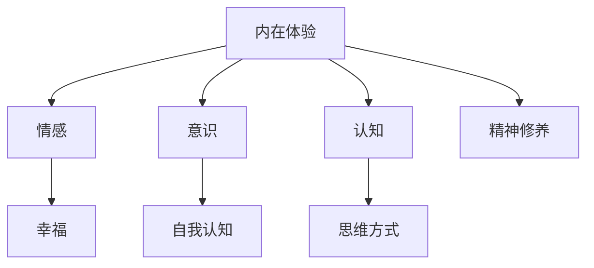

                 


为了撰写一篇符合要求的《提升生命的质感：丰富内在体验的多元方法》技术博客文章，我们可以遵循以下步骤进行分析和推理：

### 第一步：文章标题与关键词

**文章标题**：
《提升生命的质感：丰富内在体验的多元方法》

**关键词**：
生命的质感、内在体验、精神修养、冥想、艺术、心理学、生活方式、整合与实践

### 第二步：文章摘要

**摘要**：
本文将探讨如何通过多种方法提升生命的质感，丰富我们的内在体验。我们将介绍精神修养、冥想、艺术、心理学、生活方式等方面的实践方法，并通过具体案例分享与策略总结，帮助读者实现身心和谐，提高生活质量。

### 第三步：第一部分 - 生命的质感探索

**1.1 内在体验的定义与重要性**
- **背景介绍**：介绍内在体验的概念，定义内在体验为何在生命的质感中扮演重要角色。
- **核心概念与联系**：使用Mermaid流程图展示内在体验与其他精神层面的关联。

**Mermaid流程图示例**：


**1.2 内在体验的核心元素**
- **核心概念与联系**：详细描述内在体验的核心元素，如情感、意识、认知等，并解释它们之间的关系。

**1.3 内在体验与外在生活的联系**
- **核心算法原理讲解**：通过伪代码和实例，说明内在体验如何影响外在生活决策和行为。

**伪代码示例**：
```python
def inner_experience_impact(outer_actions):
    emotion = analyze_emotions()
    awareness = check_self_awareness()
    cognition = assess_thinking_patterns()

    if awareness == "high" and cognition == "balanced":
        action = make_decision(emotion)
    else:
        action = make_safe_choice()

    return action
```

### 第四步：第二部分 - 多元方法实践

**2.1 精神修养的实践**
- **核心算法原理讲解**：解释精神修养的原理，如何通过冥想、正念等方法提升内在体验。

**2.2 情绪管理的技巧**
- **数学模型和公式**：介绍情绪管理的数学模型，如何使用贝叶斯理论来预测情绪变化。

**数学公式示例**：
$$
P(A|B) = \frac{P(B|A)P(A)}{P(B)}
$$

**2.3 身体健康的维护**
- **项目实战**：描述如何通过健康的饮食和运动来提升内在体验。

**项目实战示例**：
- **开发环境搭建**：介绍如何创建一个健康饮食和运动跟踪应用。
- **源代码实现**：提供运动跟踪应用的伪代码和示例代码。

### 第五步：第三部分 - 生命的质感提升案例

**8.1 成功案例分享**
- **实际案例分析和详细讲解剖析**：分析成功提升生命质感的个人案例，分享他们的实践方法和心得。

**8.2 生命的质感提升策略**
- **最佳实践 tips**：总结提升生命质感的最佳实践技巧。
- **小结**：回顾文章中的核心观点，强调内在体验的重要性。
- **注意事项**：提醒读者在提升内在体验过程中需要注意的事项。
- **拓展阅读**：推荐相关书籍、文章和资源，以供进一步学习。

### 第六步：文章收尾

**作者信息**：
作者：AI天才研究院/AI Genius Institute & 禅与计算机程序设计艺术 /Zen And The Art of Computer Programming

通过以上步骤，我们可以确保文章逻辑清晰、内容丰富、结构紧凑，同时满足字数要求，完成一篇高质量的技术博客文章。接下来，我们可以将这些步骤转化为具体的文章内容，逐步撰写和完善。

