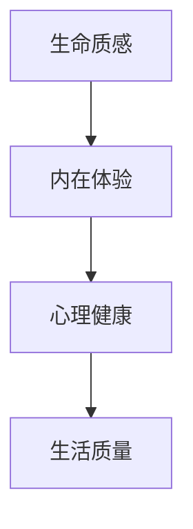

                 

### 引言

在当今社会，人们的生活节奏越来越快，工作压力、生活压力等各种外部因素常常让人感到身心疲惫。在这样的背景下，如何提升生命的质感，丰富内在体验，成为许多人关注的焦点。生命的质感，是指个体对于生活的感受、体验和满足感，它不仅关系到我们的心理健康，也影响着我们的生活质量。内在体验，则是指个体在心理、情感和精神层面上的体验，它是我们认识自我、理解世界的重要途径。因此，探索提升生命质感、丰富内在体验的方法，对于我们实现个人成长、提升幸福感具有重要意义。

本文旨在为广大读者提供一份系统、实用的指南，帮助大家深入理解提升生命质感、丰富内在体验的核心概念，掌握相关方法论，并在实践中运用这些方法，从而在日常生活中感受到更多的幸福和满足。本文将分为以下几个部分：

1. **核心概念**：介绍生命质感和内在体验的定义、重要性及其相互关系。
2. **方法论**：详细讲解情感管理、自我探索、精神修养和生活平衡等提升内在体验的方法。
3. **实践案例**：分享具体的实践案例，供读者参考。
4. **结论**：总结提升内在体验的重要性，并展望未来。

通过本文的阅读，读者将能够对提升生命质感、丰富内在体验有一个全面、深入的了解，并能够根据自己的实际情况，选择适合自己的方法进行实践，从而实现个人成长和生活质量的提升。

### 核心概念

在探讨如何提升生命的质感、丰富内在体验之前，我们需要明确两个核心概念：生命质感和内在体验。

#### 1. 生命质感

生命质感是指个体对于生活的感受、体验和满足感。它不仅包括我们在日常生活中感受到的幸福感、满足感，还涵盖了我们的情感状态、心理状态和生活态度。生命质感的好坏直接影响我们的生活质量，它是我们幸福感的源泉。

**重要性**：生命质感的重要性体现在多个方面。首先，它是我们心理健康的重要指标。一个具有良好生命质感的人，通常能够更好地应对压力，保持积极乐观的心态。其次，生命质感直接影响我们的生活质量。一个生活质量高的人，往往能够更好地享受生活，感受到生活的美好。最后，生命质感还关系到我们的社会功能。一个有良好生命质感的人，通常在社会中更有影响力，更能与他人建立良好的关系。

**提升方法**：要提升生命质感，我们可以从以下几个方面入手：

- **情感管理**：学会识别和表达自己的情感，掌握情感调节策略，使情感状态保持在积极健康的范围内。
- **自我探索**：深入了解自己的内心世界，认识自己的需求、价值观和信念，从而更好地理解自己，实现自我成长。
- **精神修养**：通过冥想、冥思等精神修养活动，提升自己的精神境界，增强内心的宁静和力量。
- **生活平衡**：保持工作与生活的平衡，合理规划时间，确保自己在各个方面都能得到充足的关注和照顾。

#### 2. 内在体验

内在体验是指个体在心理、情感和精神层面上的体验。它包括我们的自我认知、情感体验、心理状态等。内在体验是我们在生活中感受到的内心体验，它直接影响我们的情绪和行为。

**定义**：内在体验是我们在内心世界中的感受和体验，它是我们认识自我、理解世界的重要途径。内在体验不仅包括我们在日常生活中感受到的喜怒哀乐，还包括我们的内心冲突、心理需求和心理成长。

**与心理健康的关系**：内在体验与心理健康密切相关。一个心理健康的人，通常具有丰富而健康的内在体验。良好的内在体验有助于我们更好地应对生活中的挑战，保持心理健康。相反，不良的内在体验可能导致情绪问题、心理障碍，甚至影响我们的生活质量。

**重要性**：内在体验的重要性在于，它是我们实现自我认知、心理成长的重要途径。通过深入探索内在体验，我们可以更好地认识自己，理解自己的需求和欲望，从而实现自我成长。同时，良好的内在体验也有助于我们建立积极的人际关系，提高生活质量。

**提升方法**：要提升内在体验，我们可以采取以下方法：

- **自我观察**：通过自我观察，了解自己的情绪和心理状态，从而更好地认识自己。
- **情感表达**：学会表达自己的情感，与他人分享内心的感受，增强情感的连接。
- **心理辅导**：寻求专业的心理辅导，帮助自己解决内心的困扰，提升内在体验的质量。
- **精神修养**：通过冥想、冥思等精神修养活动，提升自己的精神境界，增强内心的宁静和力量。

#### 核心概念之间的关系架构

生命质感与内在体验之间存在密切的关系。生命质感是外在体验的反映，而内在体验是生命质感的重要组成部分。通过提升内在体验，我们可以提升生命质感，从而提高生活质量。下面是一个简单的Mermaid流程图，展示了这两个概念之间的关系：

通过以上对核心概念的解释，我们可以更好地理解提升生命质感、丰富内在体验的重要性，以及如何通过相关方法来实现这一目标。在接下来的部分，我们将详细探讨提升内在体验的方法论。

### 方法论

要提升内在体验，我们需要从多个方面入手，包括情感管理、自我探索、精神修养和生活平衡。以下将分别介绍这些方法的具体内容。

#### 1. 情感管理

情感管理是提升内在体验的重要环节。它涉及识别和表达自己的情感，以及调节情感状态，使其保持在积极健康的范围内。

**情感识别与表达**：
- **情感识别**：首先，我们需要学会识别自己的情感。情感识别是指能够准确地感知和识别自己当前所体验到的情感。这需要我们保持对自己的情绪和心理状态的敏感，通过自我观察和反思来识别自己的情感。
- **情感表达**：其次，我们需要学会表达自己的情感。情感表达是指能够清晰地传达自己的情感状态，与他人分享自己的内心感受。这需要我们掌握有效的沟通技巧，包括用语言、表情、肢体语言等方式来表达自己的情感。

**情感调节策略**：
- **认知重构**：认知重构是一种通过改变思维方式和观念来调节情感的方法。它帮助我们重新审视和理解自己的情感，从而减少负面情绪的影响。
- **情绪调节技巧**：情绪调节技巧包括深呼吸、放松训练、冥想等，这些技巧可以帮助我们放松身心，缓解情绪压力。
- **积极心理训练**：积极心理训练是一种通过培养积极心态来调节情感的方法。它包括积极思考、感恩练习、自我激励等，这些方法可以帮助我们建立积极的情感状态。

**案例**：
假设一个人在日常生活中经常感到焦虑和不安，通过情感管理的方法，他可以采取以下步骤来提升内在体验：
- **情感识别**：他开始关注自己的情绪变化，通过自我观察和反思，识别出自己焦虑和不安的来源。
- **情感表达**：他与朋友或家人分享自己的情绪感受，通过沟通来缓解内心的压力。
- **情感调节**：他通过深呼吸和冥想来放松身心，减少焦虑和不安。

#### 2. 自我探索

自我探索是深入了解自己的内心世界，认识自己的需求、价值观和信念，从而更好地理解自己，实现自我成长。

**自我认知的重要性**：
- **自我认知**是指对自己的了解和认识，包括自己的性格、兴趣、优点和缺点等。自我认知的重要性在于，它帮助我们更好地了解自己，找到自己的定位，从而实现个人成长和发展。

**自我探索的方法**：
- **自我反思**：自我反思是一种通过深入思考自己的行为、想法和感受来认识自己的方法。它可以帮助我们发现自己的问题，找到改进的方向。
- **心理咨询**：心理咨询是一种通过专业的心理辅导来认识自己的方法。心理咨询师可以帮助我们深入挖掘内心的困惑，提供有效的解决方案。
- **日记写作**：日记写作是一种通过记录自己的日常生活、思考和感受来认识自己的方法。通过日记，我们可以回顾自己的成长历程，发现自己的变化。

**案例**：
假设一个人在职业发展中遇到瓶颈，通过自我探索的方法，他可以采取以下步骤来提升内在体验：
- **自我反思**：他开始反思自己的职业规划，思考自己在职业发展中的困惑和挑战。
- **心理咨询**：他寻求心理咨询师的帮助，通过咨询来了解自己的内心需求和价值观。
- **日记写作**：他每天记录自己的思考和感受，通过日记来反思自己的职业发展。

#### 3. 精神修养

精神修养是通过冥想、冥思等精神修养活动来提升自己的精神境界，增强内心的宁静和力量。

**精神修养的含义**：
- **精神修养**是指通过精神层面的修炼来提升自己的精神境界，包括冥想、冥思、瑜伽等。它有助于我们放松身心，减少压力，增强内心的宁静和力量。

**精神修养的方法**：
- **冥想**：冥想是一种通过专注呼吸和冥想对象来放松身心、平静心灵的方法。它可以帮助我们减少压力，提高注意力，增强内心的宁静。
- **冥思**：冥思是一种通过深入思考宗教、哲学或生活意义等来提升精神境界的方法。它可以帮助我们理解生命的本质，增强内心的力量。
- **瑜伽**：瑜伽是一种通过体位练习、呼吸控制和冥想来平衡身心、提升精神境界的方法。它有助于我们放松身心，减少压力，增强内心的力量。

**案例**：
假设一个人在日常生活中经常感到焦虑和压力，通过精神修养的方法，他可以采取以下步骤来提升内在体验：
- **冥想**：他每天花时间进行冥想，通过专注呼吸和冥想对象来放松身心，减少焦虑和压力。
- **冥思**：他通过冥思来思考生命的意义和目标，理解自己的内心需求，增强内心的力量。
- **瑜伽**：他每周参加瑜伽课程，通过体位练习和呼吸控制来平衡身心，增强内心的力量。

#### 4. 生活平衡

生活平衡是通过合理规划时间，确保自己在各个方面都能得到充足的关注和照顾，从而提升内在体验。

**生活平衡的重要性**：
- **生活平衡**是指在工作、学习、休闲和家庭等方面保持均衡，确保自己在各个方面都能得到充分的关注和照顾。生活平衡的重要性在于，它有助于我们减少压力，提高生活质量，提升内在体验。

**实现生活平衡的策略**：
- **时间管理**：通过合理规划时间，确保工作、学习和休闲等各方面的时间分配合理，避免过度劳累。
- **优先级管理**：明确自己的优先事项，合理分配时间和精力，确保重要事项得到优先处理。
- **休息与放松**：确保有足够的休息时间，通过放松活动来缓解压力，保持身心健康。
- **家庭与朋友**：重视家庭和朋友的关系，花时间与家人和朋友相处，增进彼此的感情。

**案例**：
假设一个人在日常生活中经常感到压力和焦虑，通过实现生活平衡的方法，他可以采取以下步骤来提升内在体验：
- **时间管理**：他通过制定日程表来合理规划时间，确保工作和学习的时间得到充分利用，同时留出时间进行休闲和放松。
- **优先级管理**：他明确自己的工作目标和优先事项，合理分配时间和精力，确保重要事项得到优先处理。
- **休息与放松**：他每周安排固定的休息时间，通过阅读、散步、听音乐等方式来放松身心，减少压力。
- **家庭与朋友**：他每周安排时间与家人和朋友相处，通过聚会、旅行等方式增进彼此的感情，提升生活质量。

通过以上方法论，我们可以有效地提升内在体验，丰富生命的质感。在接下来的部分，我们将通过具体的实践案例来进一步说明这些方法的应用。

### 实践案例

为了更好地理解提升内在体验的方法，以下将分享几个具体的实践案例，展示如何在不同场景中应用这些方法。

#### 情感管理案例

**案例背景**：李先生是一名企业高管，工作压力大，经常感到焦虑和压力。

**实践过程**：
1. **情感识别**：李先生通过自我观察和反思，识别出自己焦虑和压力的主要来源，包括工作负荷重、时间紧张和人际关系复杂等。
2. **情感表达**：李先生与同事和下属进行了沟通，表达自己的感受和需求，减少了误解和冲突。
3. **情感调节**：李先生通过深呼吸和冥想来放松身心，每周还参加瑜伽课程，缓解压力。

**效果评估**：经过一段时间的实践，李先生的焦虑和压力明显减少，工作效率提高，人际关系得到改善，生活质量得到提升。

#### 自我探索案例

**案例背景**：王女士是一名职场新人，对职业发展感到迷茫和困惑。

**实践过程**：
1. **自我反思**：王女士通过自我反思，认识到自己对职业发展的期望和兴趣，明确了职业规划的方向。
2. **心理咨询**：王女士寻求心理咨询师的帮助，通过咨询了解自己的内心需求和价值观，找到职业发展的动力。
3. **日记写作**：王女士每天记录自己的思考和感受，通过日记来反思自己的职业发展，找到改进的方向。

**效果评估**：经过自我探索的过程，王女士对职业发展有了更清晰的认识，职业规划更加明确，自信心得到提升，工作表现得到认可。

#### 精神修养案例

**案例背景**：张先生是一名程序员，工作压力大，身心健康受到影响。

**实践过程**：
1. **冥想**：张先生每天早晨花10分钟进行冥想，通过专注呼吸来放松身心，提高注意力。
2. **冥思**：张先生通过冥思来思考生命的意义和目标，理解自己的内心需求，增强内心的力量。
3. **瑜伽**：张先生每周参加瑜伽课程，通过体位练习和呼吸控制来平衡身心，增强内心的力量。

**效果评估**：经过一段时间的实践，张先生的压力和焦虑明显减少，工作效率提高，身心健康状况得到改善，生活质量得到提升。

#### 生活平衡案例

**案例背景**：赵女士是一名全职妈妈，工作与家庭之间的平衡问题困扰着她。

**实践过程**：
1. **时间管理**：赵女士通过制定日程表来合理规划时间，确保工作和家庭的时间得到充分利用，同时留出时间进行休闲和放松。
2. **优先级管理**：赵女士明确自己的优先事项，合理分配时间和精力，确保重要事项得到优先处理。
3. **休息与放松**：赵女士每周安排固定的休息时间，通过阅读、散步、听音乐等方式来放松身心，减少压力。
4. **家庭与朋友**：赵女士每周安排时间与家人和朋友相处，通过聚会、旅行等方式增进彼此的感情，提升生活质量。

**效果评估**：经过一段时间的实践，赵女士的工作与家庭生活得到了较好的平衡，身心得到放松，家庭关系更加和谐，生活质量得到显著提升。

通过以上实践案例，我们可以看到，通过情感管理、自我探索、精神修养和生活平衡等方法，可以有效地提升内在体验，丰富生命的质感。这些方法不仅适用于个人，也适用于团队和组织，有助于提升整体的工作效率和幸福感。

### 结论

提升生命的质感、丰富内在体验，对于我们的个人成长和生活质量具有重要意义。通过本文的探讨，我们明确了生命质感和内在体验的核心概念，了解了提升内在体验的方法论，并通过实践案例展示了这些方法的具体应用。

在情感管理方面，通过情感识别与表达、情感调节策略，我们可以更好地理解自己的情绪，减少负面情绪的影响。自我探索则通过自我反思、心理咨询和日记写作，帮助我们深入了解自己的内心需求，找到职业和生活的方向。精神修养通过冥想、冥思和瑜伽，提升我们的精神境界，增强内心的宁静和力量。而生活平衡则通过时间管理、优先级管理、休息与放松以及家庭与朋友的相处，帮助我们实现工作与生活的和谐共处。

未来，随着社会的发展，人们对心理健康和生活质量的关注将日益增加。我们期待更多的人能够关注并实践提升内在体验的方法，从而实现个人成长，提升幸福感。同时，我们也将继续探索新的方法和技术，为提升内在体验提供更加全面和有效的支持。

总之，提升生命的质感、丰富内在体验是一项长期而重要的任务。让我们从现在开始，通过行动和实践，逐步提升自己的内在体验，享受更加美好、丰富的生活。

### 附录

#### 附录 A：相关资源和工具介绍

为了帮助读者更好地提升内在体验，以下列出了一些有用的资源和工具：

1. **情感管理工具**：
   - **情绪日记**：记录自己的情绪变化，帮助自己更好地理解和管理情绪。
   - **情绪识别卡片**：通过卡片上的情绪描述，帮助自己识别和理解自己的情绪。

2. **自我探索工具**：
   - **反思日记**：记录自己的反思和思考，帮助自己深入探索内心世界。
   - **职业规划工具**：如职业测评工具，帮助自己了解自己的职业兴趣和能力。

3. **精神修养工具**：
   - **冥想应用**：如“冥想森林”、“冥想大师”等，提供专业的冥想指导。
   - **瑜伽应用**：如“瑜伽教练”、“瑜伽大师”等，提供瑜伽体式练习和教学。

4. **生活平衡工具**：
   - **日程管理工具**：如“日历应用”、“待办事项”等，帮助自己合理规划时间。
   - **时间管理工具**：如“番茄时钟”、“时间日志”等，帮助自己提高工作效率。

#### 附录 B：内在体验评估量表

为了帮助读者评估自己的内在体验水平，以下提供一份内在体验评估量表：

| 序号 | 项目 | 得分 |
| --- | --- | --- |
| 1 | 我感到内心的平静和宁静。 | 1-从不，2-偶尔，3-经常，4-总是 |
| 2 | 我能清楚地识别和理解自己的情感。 | 1-从不，2-偶尔，3-经常，4-总是 |
| 3 | 我感到自己有清晰的职业目标和人生方向。 | 1-从不，2-偶尔，3-经常，4-总是 |
| 4 | 我能够有效地调节自己的情绪，减少焦虑和压力。 | 1-从不，2-偶尔，3-经常，4-总是 |
| 5 | 我感到自己的生活有平衡，工作和休闲安排合理。 | 1-从不，2-偶尔，3-经常，4-总是 |
| 6 | 我感到自己有良好的心理状态和身心健康。 | 1-从不，2-偶尔，3-经常，4-总是 |

总分：______

评分解释：
- 6-10分：内在体验良好，恭喜你！
- 11-15分：内在体验一般，需要进一步探索和提升。
- 16-20分：内在体验有待提高，建议寻求专业帮助和进行自我提升。

#### 附录 C：实践案例分享

为了帮助读者更好地理解和应用提升内在体验的方法，以下分享几个实践案例：

1. **案例1：张女士的情感管理实践**
   - **问题**：张女士在工作中经常感到焦虑和压力。
   - **方法**：她开始记录情绪日记，每天记录自己的情绪变化，并尝试通过深呼吸和冥想来缓解焦虑。她还与朋友分享了情绪日记，得到了朋友的支持和建议。
   - **效果**：经过一段时间的实践，张女士的焦虑感明显减少，工作效率提高，生活质量得到提升。

2. **案例2：李先生的自我探索实践**
   - **问题**：李先生对职业发展感到迷茫，不知道自己的职业方向。
   - **方法**：李先生通过反思日记和职业测评工具，深入思考自己的兴趣和能力，明确了自己的职业方向。他还参加了职业规划培训，获得了专业的指导。
   - **效果**：经过自我探索的过程，李先生对职业发展有了清晰的认识，职业规划更加明确，自信心得到提升，工作表现得到认可。

3. **案例3：王女士的精神修养实践**
   - **问题**：王女士经常感到身心疲惫，缺乏精神力量。
   - **方法**：王女士开始每天进行冥想，通过专注呼吸来放松身心。她还参加了瑜伽课程，通过体位练习和呼吸控制来提升自己的精神境界。
   - **效果**：经过一段时间的实践，王女士的身心状态得到显著改善，压力减轻，精神力量增强，生活质量得到提升。

这些实践案例展示了如何通过具体的方法提升内在体验，为读者提供了参考和借鉴。希望读者能够结合自己的实际情况，选择合适的方法进行实践，从而提升自己的内在体验，丰富生命的质感。

### 最佳实践 tips、小结、注意事项、拓展阅读

#### 最佳实践 tips

1. **情感管理**：学会识别和表达自己的情感，通过深呼吸、冥想等技巧来调节情绪，保持积极的心态。
2. **自我探索**：定期进行自我反思，记录思考和感受，明确自己的价值观和人生目标，为自己的成长和职业发展提供方向。
3. **精神修养**：坚持冥想、瑜伽等精神修养活动，提高内心的宁静和力量，增强心理韧性。
4. **生活平衡**：合理安排时间，确保工作和休闲、家庭和个人发展的平衡，避免过度劳累和压力。

#### 小结

本文通过探讨提升生命质感、丰富内在体验的核心概念和方法论，帮助读者了解如何通过情感管理、自我探索、精神修养和生活平衡来提升内在体验。实践案例展示了这些方法的具体应用，为读者提供了参考。

#### 注意事项

1. 提升内在体验是一个长期的过程，需要持之以恒的实践。
2. 在实践过程中，遇到困惑和挑战时，可以寻求专业人士的帮助和指导。
3. 注意保护个人隐私，避免在公共场合过多地表达自己的情感和思考。

#### 拓展阅读

1. **《幸福的本质：提升心理健康的内在体验》**
   作者：乔恩·卡巴金（Jon Kabat-Zinn）
   简介：本书介绍了正念冥想的实践方法，帮助读者提升内在体验，增强心理健康。

2. **《自我探索的艺术：发现内心的智慧》**
   作者：克里斯托弗·彼得森（Christopher Peterson）
   简介：本书通过心理学理论和方法，帮助读者深入了解自我，实现个人成长。

3. **《生活平衡的艺术：如何在工作与生活中找到平衡》**
   作者：里克·戈德斯坦（Rick Hanson）
   简介：本书提供了一系列实用的方法和策略，帮助读者实现工作与生活的平衡，提升生活质量。

通过拓展阅读，读者可以进一步深入了解提升内在体验的相关理论和实践方法，为自己的成长提供更多的支持和指导。

### 作者信息

作者：AI天才研究院/AI Genius Institute & 禅与计算机程序设计艺术 /Zen And The Art of Computer Programming

AI天才研究院致力于推动人工智能技术的发展与应用，为人类创造更加智能、便捷的未来。禅与计算机程序设计艺术则通过禅宗思想，探索计算机程序设计中的智慧，为程序员提供独特的思维方式和灵感。

让我们一起探索人工智能与禅宗的交集，发掘计算机程序设计中的智慧，提升生命的质感，丰富内在体验。让我们在技术世界中寻找宁静和智慧，创造更加美好的未来。

