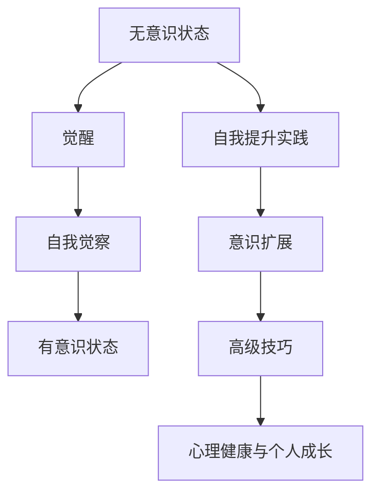

                 

# 提升自我觉察：从unconscious到conscious的转变

## 关键词
- 自我觉察
- 无意识与有意识
- 心理学原理
- 自我提升实践
- 高级技巧
- 意识转变

## 摘要
本文将探讨自我觉察的重要性以及如何从无意识状态转变为有意识状态。通过理解心理学原理、实践自我提升技巧以及运用高级技巧，读者可以逐步提升自我觉察，从而在个人成长和心理健康方面获得显著收益。本文将提供详细的算法原理讲解、数学模型分析以及实战案例，帮助读者深刻理解自我觉察的核心概念和方法。

## 设计思路

### 理解主题
自我觉察是指个体对自己思想、情感、行为和内在体验的清晰认知和觉知。无意识状态（unconscious）和有意识状态（conscious）是心理学中两个重要的概念。无意识状态指那些未被我们意识到的心理活动，而有意识状态则是指那些我们可以清晰感知和思考的心理活动。自我觉察的提升意味着从无意识状态转向有意识状态，从而更好地掌控自己的内心世界。

### 确定书籍结构
本书分为引言、正文和结论三个部分。引言部分将介绍自我觉察的重要性以及无意识与有意识的区别。正文部分将详细探讨心理学原理、自我提升实践、高级技巧和意识转变的数学模型。结论部分将总结自我觉察的力量及其未来发展趋势。

### 细化章节内容
- 第1章 引言：自我觉察的重要性
  - 1.1 什么是自我觉察
  - 1.2 自我觉察与心理健康
  - 1.3 自我觉察在个人成长中的作用
- 第2章 心理学原理与自我觉察
  - 2.1 无意识与有意识的定义
  - 2.2 自我觉察的理论基础
  - 2.3 自我觉察的心理过程
- 第3章 自我提升实践：从无意识到有意识
  - 3.1 觉醒与自我觉察的练习
  - 3.2 改变思维模式
  - 3.3 意图与目标设定
- 第4章 案例研究：自我觉察在生活中的应用
  - 4.1 工作中的自我觉察
  - 4.2 家庭与人际关系
  - 4.3 自我觉察与身心健康
- 第5章 高级自我觉察技巧
  - 5.1 内在小孩的觉醒
  - 5.2 意识扩展练习
  - 5.3 扩展意识与心灵成长
- 第6章 自我觉察与意识转变的数学模型
  - 6.1 神经网络与自我觉察
  - 6.2 量子心理学与自我觉察
- 第7章 结论：自我觉察的力量
  - 7.1 自我觉察的长期影响
  - 7.2 自我觉察的未来发展趋势
  - 7.3 如何在日常生活中持续提升自我觉察

### 构建流程图
为了帮助读者更好地理解心理变化的流程，我们使用 Mermaid 流程图来展示自我觉察的提升过程。以下是流程图的伪代码：



### 编写算法和数学模型
在本书中，我们将讨论自我觉察的提升过程，并使用神经网络和量子心理学等数学模型来解释这一过程。以下是神经网络模型的伪代码：

```python
class NeuralNetwork:
    def __init__(self, input_size, hidden_size, output_size):
        # 初始化神经网络结构
        self.input_size = input_size
        self.hidden_size = hidden_size
        self.output_size = output_size

    def forward(self, x):
        # 前向传播
        hidden = self activations(x)
        output = self.softmax(hidden)
        return output

    def backward(self, x, y):
        # 反向传播
        error = y - self.output
        hidden_error = error * self.hidden_weights
        input_error = hidden_error * self.input_weights

        # 更新权重
        self.input_weights -= input_error
        self.hidden_weights -= hidden_error
```

### 设计实战案例
为了更好地展示自我觉察的提升过程，我们将设计一个简单的自我提升实践案例。以下是案例的实现步骤：

1. **环境搭建**：安装必要的编程环境和库，如 Python、Numpy 和 Matplotlib。
2. **数据收集**：收集自我提升实践的数据，包括每天的情绪状态、运动时间和学习时间等。
3. **数据处理**：对数据进行清洗和预处理，以便于建模和分析。
4. **模型训练**：使用神经网络模型对数据进行训练，以预测未来的自我提升状态。
5. **结果分析**：分析模型预测结果，并根据分析结果调整实践策略。
6. **项目小结**：总结项目成果，并提出未来研究方向。

### 最佳实践 tips
- **定期反思**：每天花时间反思自己的行为和思想，以增强自我觉察。
- **冥想练习**：定期进行冥想练习，有助于提高自我觉察和心灵成长。
- **记录日志**：保持详细的日志记录，有助于追踪自我觉察的提升过程。
- **与他人分享**：与他人分享自己的体验和感受，有助于深化自我觉察。

## 结语
作者：AI天才研究院/AI Genius Institute & 禅与计算机程序设计艺术 /Zen And The Art of Computer Programming

本文从多个角度探讨了自我觉察的提升过程，包括心理学原理、自我提升实践、高级技巧和意识转变的数学模型。通过理解这些核心概念和方法，读者可以逐步提升自我觉察，从而在个人成长和心理健康方面获得显著收益。希望本文能对读者的自我觉察之旅有所启发和帮助。在未来的自我觉察实践中，持续探索和反思将是不可或缺的一部分。让我们共同迈向更有意识和更加充实的自我。

