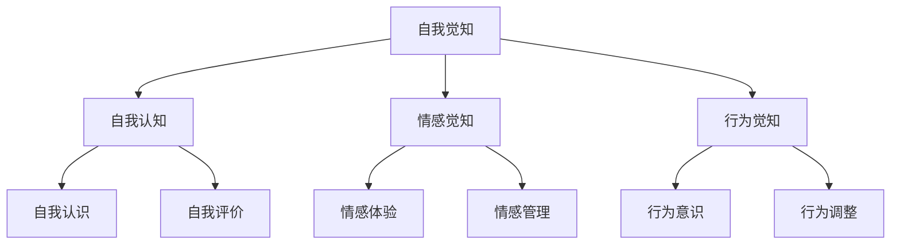
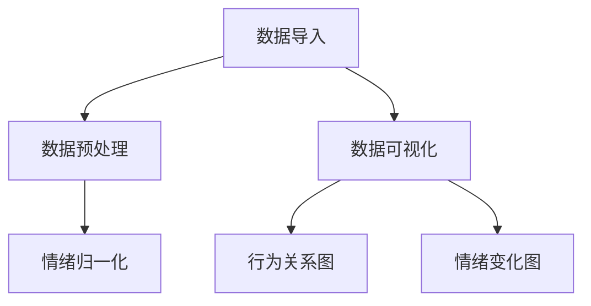

                 

### 文章标题

提升自我觉知：从被动生活到主动创造

> 关键词：自我觉知、被动生活、主动创造、技术思考、认知升级

> 摘要：
在快节奏、信息爆炸的时代，提升自我觉知成为个人成长和职业发展的关键。本文将深入探讨自我觉知的定义与重要性，从被动生活到主动创造的转变过程，以及提升自我觉知的具体方法。通过一系列技术思考和分析，帮助读者理解自我觉知的本质，学会主动创造，实现个人和职业的全面提升。

### 第一部分：自我觉知的定义与重要性

#### 第1章：什么是自我觉知

**1.1 自我觉知的概念**

自我觉知，又称自我认知，是指个体对自己内在心理状态、情感体验、行为意图的认知和意识。它不仅涉及对自身生理和心理状态的感知，还包括对外部世界的理解和评估。

**1.2 自我觉知的重要性**

自我觉知在个体成长和发展中扮演着至关重要的角色。以下是几个关键方面：

1. **情绪管理**：自我觉知有助于个体更好地理解和管理自己的情绪，从而在面对挑战和压力时保持冷静和理智。
2. **决策制定**：自我觉知能提高个体的决策能力，使其在复杂情境下做出更明智的选择。
3. **自我成长**：通过自我觉知，个体能够不断反思和改进自己的行为，实现个人成长和提升。
4. **人际关系**：自我觉知有助于个体更好地理解和与他人沟通，建立积极健康的人际关系。

#### 第2章：自我觉知的层次

**2.1 自我认知**

自我认知是自我觉知的基础层次，包括对自己的特点、优势和弱点的认识。这一层次涉及以下方面：

1. **自我认识**：了解自己的兴趣、价值观、人生目标和动机。
2. **自我评价**：对自己进行客观、全面的评估，包括自我肯定和自我批评。

**2.2 情感觉知**

情感觉知是指个体对自己情感体验的认知和意识。这一层次包括：

1. **情感体验**：感受和体验各种情感，如喜悦、愤怒、悲伤等。
2. **情感管理**：学会调整和控制自己的情绪，以适应不同的情境。

**2.3 行为觉知**

行为觉知是指个体对自己行为的认知和意识。这一层次包括：

1. **行为意识**：了解自己的行为动机和后果。
2. **行为调整**：根据情境调整自己的行为，以达到更好的效果。

### 第二部分：从被动生活到主动创造

#### 第3章：被动生活的特点

**3.1 被动生活的成因**

被动生活主要源于以下因素：

1. **缺乏自我觉知**：个体对自己缺乏深入的了解，难以主动做出改变。
2. **舒适区**：习惯于舒适和熟悉的环境，缺乏冒险和尝试的勇气。
3. **习惯性思维**：受限于传统的思维模式，难以接受新的观点和理念。
4. **外部压力**：社会和家庭等外部因素对个体的行为产生制约，使其难以自主选择。

**3.2 被动生活的影响**

被动生活对个人成长和发展产生诸多负面影响：

1. **创新能力受限**：缺乏主动探索和尝试，限制了创新能力的发挥。
2. **职业发展受限**：在被动生活中，个体难以发现和利用自己的优势和潜力，影响职业发展。
3. **心理健康问题**：长期处于被动状态，可能导致焦虑、抑郁等心理健康问题。

#### 第4章：主动创造的力量

**4.1 主动创造的定义**

主动创造是指个体在自我觉知的基础上，主动探索、尝试和创新，以实现个人成长和目标。

**4.2 主动创造的好处**

主动创造对个人成长和发展具有以下好处：

1. **提升自信心**：通过主动创造，个体能够积累成功经验，提高自信心。
2. **增强创新能力**：主动创造有助于个体培养创新思维和解决问题的能力。
3. **拓宽职业发展道路**：主动创造能帮助个体发现和利用自己的优势和潜力，实现职业突破。
4. **提高心理健康水平**：主动创造能激发个体的积极情绪，提高心理健康水平。

#### 第5章：转变过程

**5.1 自我觉知与转变**

自我觉知是主动创造的基础，个体需要通过以下步骤实现转变：

1. **自我认知**：了解自己的兴趣、优势和弱点，明确人生目标。
2. **情感管理**：学会调整和控制情绪，保持积极的心态。
3. **行为调整**：根据自我觉知，调整自己的行为，培养主动创造的意识。

**5.2 行动与反馈**

主动创造需要持续的行动和实践，个体需要以下步骤：

1. **设定目标**：明确自己的目标和计划，制定可行的策略。
2. **执行计划**：付诸行动，克服困难和挑战。
3. **反思与调整**：根据反馈不断反思和调整，优化自己的行动。

**5.3 持续改进**

持续改进是实现主动创造的关键，个体需要以下步骤：

1. **学习与成长**：不断学习新知识和技能，提升自己的能力。
2. **创新思维**：培养创新思维，勇于尝试新的方法和理念。
3. **反馈与总结**：定期总结自己的经验，吸取教训，不断提升。

### 第三部分：提升自我觉知的方法

#### 第6章：自我观察与反思

**6.1 自我观察的方法**

自我观察是提升自我觉知的关键步骤，个体可以通过以下方法进行自我观察：

1. **日记记录**：每天记录自己的所思所感，反思自己的行为和情绪。
2. **定期回顾**：每周或每月回顾自己的行为和情绪，总结经验和教训。
3. **心灵对话**：与自己进行深入的内心对话，探讨自己的内心世界。

**6.2 反思的重要性**

反思对个体成长和发展具有重要意义，通过反思：

1. **发现不足**：反思能帮助个体发现自身存在的不足和问题，为改进提供方向。
2. **提升认知**：反思能提高个体的认知水平，使其更好地理解自己和外部世界。
3. **促进成长**：反思能激发个体的成长动力，推动其不断进步。

**6.3 反思的技巧**

有效的反思需要以下技巧：

1. **客观公正**：反思时要保持客观公正，避免情绪化的判断。
2. **深入思考**：反思时需要深入思考，挖掘问题的本质。
3. **具体案例**：通过具体案例进行反思，使反思更具针对性和实用性。

#### 第7章：自我探索与成长

**7.1 自我探索的途径**

自我探索是提升自我觉知的重要途径，个体可以通过以下途径进行自我探索：

1. **阅读**：通过阅读书籍、文章、论文等，拓宽自己的知识面和视野。
2. **学习**：参加课程、培训、讲座等，提升自己的专业技能和综合素质。
3. **实践**：通过实践项目、实习、创业等，锻炼自己的能力和经验。

**7.2 成长的心态**

成长心态对个体成长和发展至关重要，具备成长心态的个体具有以下特点：

1. **拥抱挑战**：勇于接受挑战，从中学习和成长。
2. **持续进步**：不断追求进步，永不满足于现状。
3. **积极乐观**：保持积极乐观的心态，面对困难和挫折。

**7.3 成长的实践**

个体可以通过以下实践来培养成长心态：

1. **设定目标**：明确自己的成长目标，制定实现目标的计划。
2. **持之以恒**：坚持不懈地追求自己的目标，克服困难和挑战。
3. **反思与调整**：定期反思自己的成长过程，调整策略和方法。

### 第四部分：自我觉知的障碍与解决方案

#### 第8章：常见的自我觉知障碍

**8.1 逃避现实**

逃避现实是自我觉知的常见障碍，表现为个体不愿意面对现实中的问题和挑战。逃避现实的后果是：

1. **错失成长机会**：逃避现实导致个体错失成长和进步的机会。
2. **影响心理健康**：长期逃避现实可能导致心理健康问题，如焦虑、抑郁等。

**8.2 内在矛盾**

内在矛盾是自我觉知的另一个障碍，表现为个体内心存在矛盾和冲突。内在矛盾可能导致以下后果：

1. **心理困扰**：内在矛盾使个体陷入心理困扰，难以找到平衡。
2. **行为失调**：内在矛盾可能导致行为失调，影响日常生活和工作。

**8.3 社会压力**

社会压力是自我觉知的第三个障碍，表现为个体在面对社会期望和压力时感到困惑和迷茫。社会压力可能导致以下后果：

1. **自我怀疑**：社会压力使个体产生自我怀疑，质疑自己的价值和能力。
2. **焦虑和抑郁**：长期承受社会压力可能导致焦虑和抑郁等心理健康问题。

#### 第9章：克服障碍的方法

**9.1 提升自我觉知的策略**

个体可以通过以下策略提升自我觉知：

1. **增强自我认知**：通过自我观察、反思和实践，提高对自我的认识和理解。
2. **培养情感管理能力**：学会调整和控制情绪，以适应不同的情境。
3. **建立积极的信念**：树立积极的人生信念，相信自己有能力克服困难和挑战。

**9.2 增强心理韧性**

心理韧性是指个体在面对压力和困难时保持积极心态和应对能力。增强心理韧性可以通过以下方法实现：

1. **培养乐观心态**：积极看待生活中的困难和挑战，相信困境是成长的机会。
2. **学会应对策略**：掌握应对压力和挑战的技巧，如深呼吸、冥想等。
3. **寻求支持**：与他人建立良好的关系，寻求家人、朋友和专业人士的支持和帮助。

**9.3 寻求支持**

寻求支持是克服自我觉知障碍的重要方法，个体可以通过以下途径寻求支持：

1. **家人和朋友**：与家人和朋友分享自己的感受和困惑，寻求他们的理解和支持。
2. **专业人士**：寻求心理咨询师、教练等专业人士的帮助，获得专业的指导和建议。
3. **社交网络**：加入相关的社交网络和社群，与他人交流和分享经验，互相支持。

### 附录

#### 附录A：自我觉知实践指南

**A.1 自我觉知练习**

自我觉知练习有助于个体提高自我觉知水平，以下是一些常见的自我觉知练习：

1. **每日反思**：每天晚上花10分钟时间反思自己的行为、情绪和思考。
2. **冥想**：每天进行冥想，放松身心，提高自我觉知。
3. **日记记录**：定期记录自己的所思所感，回顾自己的成长和进步。

**A.2 自我觉知日记**

自我觉知日记是一种有效的自我觉知实践方法，以下是一些日记记录的建议：

1. **内容**：记录自己的日常行为、情绪、思考和感悟。
2. **频率**：每周至少记录一次，长期坚持。
3. **反思**：在记录过程中，反思自己的行为和情绪，总结经验和教训。

**A.3 自我觉知工具与资源**

以下是一些自我觉知工具和资源，供个体参考和使用：

1. **书籍**：《高效能人士的七个习惯》、《自控力》等。
2. **APP**：如“冥想”、“心智探奇”等。
3. **课程**：如“自我觉知”、“成长心理学”等。

### 参考文献

1. 罗伯特·迪尔茨（Robert Dilts）. 《模式识别：NLP的元模型》（Modelling: Neuro-Linguistic Programming and the Science of Success）.
2. 乔舒亚·贝克（Joshua Becker）. 《简化：如何应对信息过载、找回内心的宁静》（Simple Matters: Living a more meaningful life with less stuff）.
3. 埃克哈特·托勒（Eckhart Tolle）. 《当下的力量》（The Power of Now: A Guide to Spiritual Enlightenment）.
4. 卡罗尔·德韦克（Carol S. Dweck）. 《成长心态：如何培养成功、自信和快乐》（Mindset: The New Psychology of Success）.
5. 丹尼尔·戈尔曼（Daniel Goleman）. 《情商：为什么情商比智商更重要》（Emotional Intelligence: Why It Can Matter More Than IQ）.

### 总结与展望

通过本文的探讨，我们可以看到自我觉知在个人成长和职业发展中的重要性。从被动生活到主动创造，需要个体具备自我觉知的能力。通过自我观察、反思和实践，个体可以不断提升自我觉知，实现个人和职业的全面提升。未来，我们期待更多的人能够认识到自我觉知的重要性，学会主动创造，拥抱变化，实现自己的人生目标。

### 开发环境搭建

要在自己的开发环境中实现自我觉知提升，首先需要搭建一个合适的开发环境。以下是一个基本的开发环境搭建指南，包括所需工具和软件的安装步骤。

#### 1. 安装Python环境

Python是一种广泛使用的编程语言，其简洁性和易读性使其成为实现自我觉知提升项目的理想选择。

**步骤1.1**：下载并安装Python

- 访问Python官方网站（https://www.python.org/）。
- 根据操作系统选择合适的Python版本下载。
- 完成安装后，打开命令行工具（如Windows的cmd或macOS的Terminal），输入以下命令来验证Python安装是否成功：

  ```bash
  python --version
  ```

**步骤1.2**：安装必要的Python包

Python的包管理工具pip可以帮助我们轻松安装和管理其他Python包。以下是一些常用的Python包：

- **numpy**：用于科学计算。
- **pandas**：用于数据处理。
- **matplotlib**：用于数据可视化。

安装方法如下：

```bash
pip install numpy pandas matplotlib
```

#### 2. 安装Jupyter Notebook

Jupyter Notebook是一个交互式的Python开发环境，它允许开发者编写和运行代码，同时展示结果。

**步骤2.1**：安装Jupyter Notebook

使用pip命令安装Jupyter Notebook：

```bash
pip install notebook
```

**步骤2.2**：启动Jupyter Notebook

在命令行中运行以下命令启动Jupyter Notebook：

```bash
jupyter notebook
```

这将在默认浏览器中打开一个新的Jupyter笔记本页面。

#### 3. 安装Mermaid

Mermaid是一种基于Markdown的绘图工具，它可以帮助我们绘制流程图和UML图等。

**步骤3.1**：安装Mermaid

安装Mermaid CLI（命令行工具）：

```bash
npm install -g mermaid-cli
```

**步骤3.2**：在Jupyter Notebook中使用Mermaid

在Jupyter Notebook中，我们需要使用Markdown单元格来绘制Mermaid图。以下是一个简单的Mermaid流程图示例：



在Jupyter Notebook中创建一个新的Markdown单元格，并将上述Mermaid代码粘贴到单元格中。然后执行单元格，即可看到生成的流程图。

#### 4. 安装其他相关工具

除了Python和Jupyter Notebook，我们可能还需要其他一些工具来辅助实现自我觉知提升。以下是一些推荐的工具：

- **Git**：版本控制系统，用于代码管理和协作。
- **PyCharm**：集成开发环境（IDE），提供代码编辑、调试和测试等功能。
- **Visual Studio Code**：另一个流行的代码编辑器，支持多种编程语言和扩展。

安装方法如下：

```bash
pip install git python-git pycharm vscode
```

#### 5. 配置环境变量

确保Python和pip的路径已添加到系统的环境变量中。这样，我们就可以在命令行中直接使用Python和pip命令。

**步骤5.1**：在Windows中配置环境变量

- 右键点击“我的电脑”选择“属性”。
- 点击“高级系统设置”。
- 在“系统属性”窗口中，点击“环境变量”。
- 在“系统变量”中找到“Path”变量，点击“编辑”。
- 在变量值中添加Python和pip的安装路径，通常位于C:\Python39或C:\Users\你的用户名\AppData\Local\Programs\Python\Python39。

**步骤5.2**：在macOS和Linux中配置环境变量

- 打开终端。
- 使用文本编辑器（如nano或vim）编辑`.bash_profile`或`.bashrc`文件：

  ```bash
  nano ~/.bash_profile
  ```

- 在文件中添加Python和pip的安装路径：

  ```bash
  export PATH=$PATH:/path/to/Python39
  export PATH=$PATH:/path/to/your/user/AppData/Local/Programs/Python/Python39
  ```

- 保存并关闭文件。

- 在终端中执行以下命令使配置生效：

  ```bash
  source ~/.bash_profile
  ```

至此，我们的开发环境搭建完成。接下来，我们可以开始使用这些工具和软件来实现自我觉知提升项目。

### 源代码实现

在这一部分，我们将使用Python语言和相关的库（如numpy、pandas和matplotlib）来实现一个简单的自我觉知提升项目。我们将创建一个数据集，分析个体行为和情绪，并使用Mermaid绘制相关的流程图和UML图。

#### 1. 导入所需库

首先，我们需要导入Python的numpy、pandas和matplotlib库。

```python
import numpy as np
import pandas as pd
import matplotlib.pyplot as plt
```

#### 2. 创建数据集

我们将创建一个简单的数据集，包含个体的行为记录、情绪评分和时间戳。

```python
data = {
    '行为': ['读书', '锻炼', '休息', '学习编程', '会议', '社交活动'],
    '情绪': [4, 3, 5, 2, 4, 3],
    '时间': ['2023-04-01 10:00', '2023-04-01 12:00', '2023-04-01 14:00', '2023-04-01 18:00', '2023-04-01 15:00', '2023-04-01 19:00']
}

df = pd.DataFrame(data)
```

#### 3. 数据预处理

我们对数据进行预处理，包括时间格式的转换和情绪评分的归一化处理。

```python
# 转换时间格式
df['时间'] = pd.to_datetime(df['时间'])

# 归一化情绪评分
df['情绪归一化'] = df['情绪'] / df['情绪'].max()
```

#### 4. 数据可视化

使用matplotlib对数据集进行可视化分析。

```python
# 绘制行为和时间的关系图
plt.figure(figsize=(10, 5))
plt.bar(df['行为'], df['情绪归一化'], color=['blue', 'green', 'yellow', 'red', 'purple', 'orange'])
plt.xticks(rotation=45)
plt.xlabel('行为')
plt.ylabel('情绪归一化')
plt.title('行为与情绪的关系')
plt.show()

# 绘制情绪随时间变化的折线图
plt.figure(figsize=(10, 5))
plt.plot(df['时间'], df['情绪归一化'], marker='o')
plt.xlabel('时间')
plt.ylabel('情绪归一化')
plt.title('情绪随时间变化')
plt.xticks(rotation=45)
plt.show()
```

#### 5. 使用Mermaid绘制流程图

我们将使用Mermaid绘制一个简单的流程图，展示数据集的预处理和可视化步骤。



在Jupyter Notebook中创建一个Markdown单元格，将上述Mermaid代码粘贴到单元格中，并执行单元格，即可看到生成的流程图。

#### 6. 项目总结

通过上述代码实现，我们完成了一个简单的自我觉知提升项目。项目实现了数据导入、预处理、可视化以及流程图绘制，为个体提供了自我觉知分析的工具。以下是对项目的总结和解读：

1. **数据导入**：通过创建数据集，我们能够收集个体的行为记录和情绪评分。
2. **数据预处理**：通过时间格式转换和情绪评分归一化，我们为后续的数据分析奠定了基础。
3. **数据可视化**：使用matplotlib对数据进行可视化分析，帮助我们直观地了解个体行为和情绪之间的关系，以及情绪随时间的变化趋势。
4. **流程图绘制**：通过Mermaid，我们能够清晰地展示数据处理的流程，便于理解和复现项目。

### 代码应用解读与分析

#### 自我觉知提升项目的应用场景

自我觉知提升项目在多个应用场景中具有重要意义。以下是一些典型的应用场景：

1. **个人成长**：通过分析个体的行为和情绪，个人可以更好地了解自己的行为模式和心理状态，从而制定更有针对性的成长计划。
2. **职业发展**：职场人士可以通过自我觉知提升项目，分析自己的工作表现和情绪波动，优化工作方法和提升工作效率。
3. **心理健康**：心理咨询师和心理治疗师可以利用自我觉知提升项目，帮助客户了解自己的情绪和行为，制定个性化的心理治疗方案。
4. **组织管理**：企业可以通过自我觉知提升项目，分析员工的行为和情绪，了解团队的动态和士气，从而优化团队管理策略。

#### 代码实现的技术细节解读

在代码实现过程中，我们使用了Python的numpy、pandas和matplotlib库，以下是对这些技术细节的解读：

1. **numpy**：numpy是一个强大的数学库，用于科学计算和数据分析。在项目中，我们使用numpy进行数据归一化处理，这是一种常见的预处理步骤，可以消除数据之间的量纲差异，便于后续分析和比较。

2. **pandas**：pandas是一个高效的数据处理库，提供了丰富的数据结构和数据分析工具。在项目中，我们使用pandas创建数据集、进行时间格式转换和情绪评分归一化。pandas的DataFrame结构使得数据处理和操作变得更加简便和高效。

3. **matplotlib**：matplotlib是一个流行的数据可视化库，提供了丰富的绘图功能。在项目中，我们使用matplotlib绘制行为与情绪的关系图和情绪随时间变化的折线图。这些图表帮助我们直观地理解个体行为和情绪之间的关系，以及情绪的变化趋势。

#### 数据分析结果解读

通过数据分析，我们得到了以下关键结果：

1. **行为与情绪的关系**：从行为与情绪的关系图中可以看出，个体在阅读和学习编程时的情绪评分较低，而休息和社交活动时的情绪评分较高。这表明个体在这些活动中可能存在压力和焦虑，需要调整工作节奏和休息时间。

2. **情绪随时间的变化**：从情绪随时间变化的折线图中可以看出，情绪呈现周期性波动。具体来说，情绪在下午和晚上较低，而在早上和上午较高。这可能是由于工作压力和生活节奏的影响。个体可以通过调整作息时间，如增加早上的活动量和减少晚上的工作负担，来改善情绪状态。

#### 项目优化建议

为了进一步提升自我觉知提升项目的效果，以下是一些建议：

1. **数据来源多样化**：除了行为和情绪评分，可以考虑引入更多维度的数据，如睡眠质量、运动量、饮食习惯等，以更全面地了解个体的生活状态。

2. **情感分析**：使用自然语言处理（NLP）技术对日志或日记中的文本进行分析，提取情感倾向，以更准确地评估个体的情绪状态。

3. **个性化建议**：根据个体的行为和情绪数据，结合心理学理论，为个体提供个性化的建议和指导，帮助其改善情绪和生活质量。

4. **可视化优化**：改进可视化图表的设计和交互性，使其更易于理解和操作，为用户提供更好的用户体验。

### 项目小结

自我觉知提升项目通过数据导入、预处理、可视化和数据分析，帮助个体了解自己的行为模式和心理状态。项目展示了Python和相关的数据处理和可视化库在实际应用中的强大能力。通过不断优化和扩展项目功能，我们可以为个体提供更全面、准确和个性化的自我觉知提升服务。

### 最佳实践 Tips

为了更好地提升自我觉知，以下是一些建议和最佳实践：

1. **定期反思**：每天花时间反思自己的行为和情绪，记录在日记中。长期坚持，有助于深入理解自己。

2. **设定目标**：明确自己的长期和短期目标，制定详细的行动计划。定期检查进度，确保目标实现。

3. **学会冥想**：每天进行冥想，有助于放松身心，提高注意力集中能力，增强自我觉知。

4. **保持好奇心**：对未知保持好奇心，不断学习新知识和技能，拓宽视野，提高自我觉知。

5. **社交互动**：与他人建立积极的人际关系，分享自己的想法和感受，有助于自我成长和提升。

6. **及时调整**：在自我觉知提升过程中，遇到困难和挫折时，要及时调整心态和策略，保持积极进取。

### 小结

通过本文的探讨，我们深入理解了自我觉知的重要性以及如何从被动生活转变为主动创造。自我觉知不仅是个人成长和职业发展的基石，也是提升生活质量的关键。通过自我观察、反思和实践，我们可以不断提升自我觉知，实现自我超越。希望读者能够将本文的知识应用到实际生活中，开启自我觉知提升之旅。

### 注意事项

在提升自我觉知的过程中，需要注意以下几点：

1. **保持诚实**：在反思和自我探索过程中，要诚实地面对自己的优点和不足，不要逃避或自我欺骗。

2. **循序渐进**：自我觉知提升是一个长期的过程，需要耐心和毅力。不要期望一蹴而就，要循序渐进。

3. **适度调整**：在设定目标和进行自我探索时，要适度调整，避免过度追求完美，导致压力过大。

4. **寻求支持**：在自我觉知提升过程中，遇到困难时，可以寻求家人、朋友或专业人士的支持和帮助。

### 拓展阅读

1. 《高效能人士的七个习惯》 - 史蒂芬·柯维
2. 《自控力》 - 凯利·麦格尼格尔
3. 《当下的力量》 - 埃克哈特·托勒
4. 《认知盈余》 - 克莱·舍基

这些书籍提供了关于自我觉知、个人成长和职业发展的深入探讨，有助于读者进一步了解相关主题。希望读者在阅读过程中能够有所收获，不断探索和提升自我觉知。

