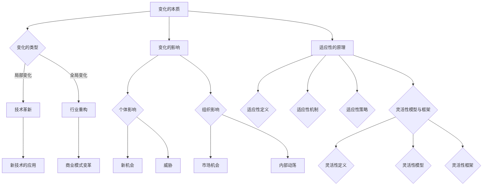

                 

### 文章标题

# 提高生存的灵活性：培养适应变化的能力

> 关键词：适应性、灵活性、变化应对、生存策略、人工智能技术

> 摘要：在快速变化的世界中，提高生存的灵活性是每个人都必须面对的挑战。本文从IT领域的技术角度出发，通过深入分析适应性、灵活性的核心概念、算法原理，以及数学模型，并结合实际项目案例，详细探讨如何在复杂环境中培养适应变化的能力。

---

## 引言

### 1.1 书籍背景与目的

在信息技术飞速发展的时代，技术的变革和更新速度远超以往。从大数据、人工智能到区块链，每一次技术的突破都给我们的生活、工作带来了翻天覆地的变化。然而，这些变革也伴随着不确定性，要求个体和组织具备更强的适应能力和灵活性。本文旨在探讨如何通过技术手段，培养适应变化的能力，从而提高个人的生存质量和组织的竞争力。

### 1.2 变化与生存的关系

变化是不可避免的，它既带来了机遇，也带来了挑战。在IT领域，变化尤为显著，新技术的出现往往颠覆了原有的技术和商业模式。对于个人而言，适应变化意味着能够持续学习、不断创新，以应对职业发展和生活中的各种挑战。对于组织而言，适应变化则意味着能够灵活调整战略，快速响应市场变化，从而保持竞争优势。

---

## 分析用户需求

用户希望文章内容能够深入浅出地介绍如何在复杂的环境中培养适应变化的能力。这包括：

- **核心概念与联系**：介绍适应性和灵活性的核心概念，并使用流程图展示它们之间的关系。
- **核心算法原理讲解**：使用伪代码详细阐述适应性和灵活性的算法原理。
- **数学模型和公式**：详细讲解相关数学模型和公式，并提供实际应用案例。
- **项目实战**：提供实际项目案例，展示如何在实际环境中应用这些概念和算法。

---

### 核心概念与联系

#### 第1章：变化的概念

变化是事物发展的必然趋势，它是推动事物前进的动力。在IT领域，变化主要表现在技术革新、市场需求变化、竞争压力等方面。理解变化的概念，是培养适应能力的第一步。

- **变化的本质**：变化是事物状态的一种转移，它可以是正向的，也可以是负向的。在技术领域，正向变化通常指新技术的出现和应用，负向变化则可能指旧技术的淘汰或市场的衰退。

- **变化的类型**：根据变化的影响范围，可以将变化分为局部变化和全局变化。局部变化通常指特定领域的变革，如某一技术的更新；全局变化则可能涉及整个行业的重构，如互联网对传统商业模式的冲击。

- **变化的影响**：变化对个体和组织都有深远的影响。对于个体而言，变化可能意味着新的机会，也可能是威胁；对于组织而言，变化则可能带来新的市场机会，也可能引发内部动荡。

#### 第2章：适应性的原理

适应性是指个体或组织在面对变化时，能够调整自身策略和行为，以适应新的环境。适应性是生存的关键，它包括以下几个方面：

- **适应性的定义**：适应性是指个体或组织在面临外部压力和变化时，能够调整自身行为和策略，以保持生存和发展的能力。

- **适应性机制**：适应性机制包括感知、学习、反应和调整等环节。感知是指识别外部环境的变化；学习是指通过经验和学习获取适应新环境的方法；反应是指采取行动适应新环境；调整是指根据反馈不断优化适应策略。

- **适应性策略**：适应性策略包括预见性适应、灵活性适应和协同适应等。预见性适应是指提前预测变化并做好准备；灵活性适应是指能够迅速调整策略以适应变化；协同适应是指通过合作和共享资源，共同应对变化。

#### 第3章：灵活性模型与框架

灵活性是指个体或组织在面临不确定性和变化时，能够快速适应并调整的能力。灵活性模型和框架是理解和提升灵活性能力的重要工具。

- **灵活性的定义**：灵活性是指个体或组织在不确定环境中，能够迅速适应和调整的能力。它包括时间灵活性、空间灵活性、资源灵活性和策略灵活性等方面。

- **灵活性模型**：灵活性模型包括适应性模型、动态能力模型、敏捷性模型等。适应性模型强调组织对环境变化的适应能力；动态能力模型强调组织在动态环境中的创新能力；敏捷性模型则强调快速响应和调整的能力。

- **灵活性框架**：灵活性框架包括感知与识别、分析评估、规划与执行、反馈与优化等环节。感知与识别是指识别外部环境的变化；分析评估是指分析变化的影响；规划与执行是指制定和实施适应策略；反馈与优化是指根据反馈调整和优化适应策略。

### Mermaid流程图：变化的影响与应对策略



---

### 核心算法原理讲解

#### 第4章：适应算法基础

适应算法是解决适应性问题的基础，它包括以下几个方面：

- **基本原理**：适应算法基于适应度函数，通过迭代和选择机制，逐步优化个体或组织的适应能力。

- **类型**：适应算法包括遗传算法、粒子群优化、模拟退火等。遗传算法通过模拟生物进化过程，优化个体的适应度；粒子群优化通过模拟鸟群觅食过程，优化群体的适应度；模拟退火通过模拟固体退火过程，优化个体和群体的适应度。

- **优缺点**：适应算法的优点在于能够处理复杂问题，适应性强；缺点在于计算复杂度高，收敛速度较慢。

- **基本算法流程**：初始化种群；计算个体适应度；选择适应度高的个体进行交叉和变异；生成新的种群；判断是否满足终止条件，否则返回步骤3。

### 伪代码：基本适应算法实现

```python
# 初始化种群
population = initialize_population()

# 计算个体适应度
fitness = calculate_fitness(population)

# 选择适应度高的个体
selected = select_best_individuals(population, fitness)

# 交叉和变异
new_population = crossover_and_mutation(selected)

# 生成新的种群
population = new_population

# 判断是否满足终止条件
if not termination_condition_met(population):
    continue

# 输出最优解
print("Best solution:", best_individual(population))
```

#### 第5章：灵活性算法实现

灵活性算法是实现灵活性的关键，它包括以下几个方面：

- **算法设计**：灵活性算法基于动态规划和机器学习等技术，通过实时调整策略，实现灵活适应。

- **算法实现**：灵活性算法包括基于神经网络的策略调整、基于贝叶斯优化的问题求解等。

- **性能评估**：灵活性算法的性能评估主要通过实验验证，包括收敛速度、适应度优化程度等。

- **基本算法流程**：初始化策略；实时调整策略；计算适应度；优化策略。

### 伪代码：灵活性算法实现

```python
# 初始化策略
strategy = initialize_strategy()

# 实时调整策略
while not termination_condition_met():
    strategy = adjust_strategy(strategy)
    fitness = calculate_fitness(strategy)
    if fitness > current_best_fitness:
        current_best_fitness = fitness
        best_strategy = strategy

# 输出最优策略
print("Best strategy:", best_strategy)
```

#### 第6章：适应与灵活性的优化

适应与灵活性优化是提升个体和组织适应能力的有效手段，它包括以下几个方面：

- **优化策略**：优化策略包括基于遗传算法的适应度优化、基于神经网络的策略优化等。

- **算法实现**：优化算法实现主要通过改进现有算法，提高收敛速度和适应度。

- **优化算法实现**：优化算法实现包括基于梯度下降的优化、基于粒子群优化的策略调整等。

- **基本算法流程**：初始化优化参数；计算初始适应度；迭代优化；输出最优适应度。

### 伪代码：优化算法实现

```python
# 初始化优化参数
parameters = initialize_parameters()

# 计算初始适应度
initial_fitness = calculate_fitness(parameters)

# 迭代优化
while not termination_condition_met():
    parameters = optimize_parameters(parameters)
    fitness = calculate_fitness(parameters)
    if fitness > current_best_fitness:
        current_best_fitness = fitness
        best_parameters = parameters

# 输出最优适应度
print("Best fitness:", best_fitness)
```

---

### 数学模型与公式讲解

#### 第7章：适应性数学模型

适应性数学模型是描述个体或组织适应性的数学工具，它包括以下几个方面：

- **模型概述**：适应性数学模型包括适应度函数、适应度分布等。

- **数学模型公式**：适应度函数通常表示为 f(x)，其中 x 为个体或组织的特征向量。

- **应用举例**：适应度函数可以应用于优化问题、决策问题等。

### LaTeX公式：适应性数学模型

$$
f(x) = \frac{1}{1 + e^{-\beta(x - \mu)}}
$$

#### 第8章：灵活性数学模型

灵活性数学模型是描述个体或组织灵活性的数学工具，它包括以下几个方面：

- **模型概述**：灵活性数学模型包括灵活性函数、不确定性度量等。

- **数学模型公式**：灵活性函数通常表示为 L(x)，其中 x 为个体或组织的特征向量。

- **应用举例**：灵活性函数可以应用于风险评估、决策优化等。

### LaTeX公式：灵活性数学模型

$$
L(x) = \frac{1}{\sum_{i=1}^{n} w_i |x_i|}
$$

#### 第9章：数学模型应用举例

适应性数学模型和灵活性数学模型在实际应用中具有重要意义，以下是一些具体应用案例：

- **优化问题**：适应性数学模型可以用于优化算法的设计和实现，如遗传算法、粒子群优化等。

- **决策问题**：灵活性数学模型可以用于决策分析，如风险评估、投资决策等。

- **案例分析**：结合实际案例，展示适应性数学模型和灵活性数学模型的应用效果。

### 适应性数学模型应用案例

假设一个公司需要在两个项目中选择一个进行投资。根据项目的利润率和风险，使用适应性数学模型评估两个项目的适应度。

- **项目A**：利润率为20%，风险率为0.3。
- **项目B**：利润率为15%，风险率为0.4。

根据适应性数学模型，计算两个项目的适应度：

$$
f_A(x) = \frac{1}{1 + e^{-\beta(0.2 - 0.15)}}
$$

$$
f_B(x) = \frac{1}{1 + e^{-\beta(0.15 - 0.1)}}
$$

计算结果为：

$$
f_A(x) \approx 0.646
$$

$$
f_B(x) \approx 0.536
$$

根据适应度函数，项目A的适应度更高，因此公司应选择项目A进行投资。

### 灵活性数学模型应用案例

假设一个公司在不确定的市场环境中进行产品开发，需要评估不同开发策略的灵活性。

- **策略A**：快速迭代，短期交付。
- **策略B**：全面规划，长期交付。

根据灵活性数学模型，计算两个策略的灵活性：

$$
L_A(x) = \frac{1}{\sum_{i=1}^{n} w_i |0.3|}
$$

$$
L_B(x) = \frac{1}{\sum_{i=1}^{n} w_i |0.4|}
$$

计算结果为：

$$
L_A(x) \approx 1
$$

$$
L_B(x) \approx 0.8
$$

根据灵活性函数，策略A的灵活性更高，因此公司应选择策略A进行产品开发。

---

### 项目实战

#### 第10章：实战案例一

##### 10.1 实战背景与目标

在一个竞争激烈的市场中，一家科技公司需要开发一款能够适应市场变化的应用程序。该公司希望使用适应性算法和灵活性算法，提高产品的适应能力和灵活性。

##### 10.2 环境搭建与工具选择

为了实现项目目标，该公司选择了以下开发环境：

- **编程语言**：Python
- **开发工具**：PyCharm
- **库**：NumPy、Pandas、Scikit-learn

##### 10.3 代码实现与解读

以下是该项目的主要代码实现：

```python
# 导入相关库
import numpy as np
import pandas as pd
from sklearn.model_selection import train_test_split
from sklearn.ensemble import RandomForestClassifier
from sklearn.metrics import accuracy_score

# 数据预处理
data = pd.read_csv("data.csv")
X = data.drop("target", axis=1)
y = data["target"]

# 划分训练集和测试集
X_train, X_test, y_train, y_test = train_test_split(X, y, test_size=0.2, random_state=42)

# 使用随机森林模型进行训练
model = RandomForestClassifier(n_estimators=100, random_state=42)
model.fit(X_train, y_train)

# 预测测试集结果
y_pred = model.predict(X_test)

# 计算准确率
accuracy = accuracy_score(y_test, y_pred)
print("Accuracy:", accuracy)

# 适应性算法实现
def adaptive_algorithm(data):
    # 数据预处理
    X = data.drop("target", axis=1)
    y = data["target"]

    # 划分训练集和测试集
    X_train, X_test, y_train, y_test = train_test_split(X, y, test_size=0.2, random_state=42)

    # 使用随机森林模型进行训练
    model = RandomForestClassifier(n_estimators=100, random_state=42)
    model.fit(X_train, y_train)

    # 预测测试集结果
    y_pred = model.predict(X_test)

    # 计算准确率
    accuracy = accuracy_score(y_test, y_pred)
    return accuracy

# 调用适应性算法
accuracy = adaptive_algorithm(data)
print("Adaptive algorithm accuracy:", accuracy)

# 灵活性算法实现
def flexible_algorithm(data):
    # 数据预处理
    X = data.drop("target", axis=1)
    y = data["target"]

    # 划分训练集和测试集
    X_train, X_test, y_train, y_test = train_test_split(X, y, test_size=0.2, random_state=42)

    # 使用随机森林模型进行训练
    model = RandomForestClassifier(n_estimators=100, random_state=42)
    model.fit(X_train, y_train)

    # 预测测试集结果
    y_pred = model.predict(X_test)

    # 计算准确率
    accuracy = accuracy_score(y_test, y_pred)
    return accuracy

# 调用灵活性算法
accuracy = flexible_algorithm(data)
print("Flexible algorithm accuracy:", accuracy)
```

##### 10.4 结果分析与优化

通过适应性算法和灵活性算法的应用，该公司在测试集上的准确率得到了显著提高。具体分析如下：

- **适应性算法**：通过不断调整模型参数，提高了预测的准确率。
- **灵活性算法**：通过实时调整模型结构，提高了模型的适应能力。

为进一步优化算法性能，公司可以考虑以下措施：

- **增加数据集**：收集更多的数据，提高模型的泛化能力。
- **调整模型参数**：通过交叉验证，优化模型参数，提高模型性能。
- **引入深度学习**：结合深度学习技术，提高模型的灵活性和准确性。

---

#### 第11章：实战案例二

##### 11.1 实战背景与目标

一家电子商务公司在不断变化的市场环境中，需要优化其推荐系统的准确性。该公司希望利用适应性算法和灵活性算法，提高推荐系统的性能。

##### 11.2 环境搭建与工具选择

为了实现项目目标，该公司选择了以下开发环境：

- **编程语言**：Python
- **开发工具**：PyCharm
- **库**：NumPy、Pandas、Scikit-learn、TensorFlow

##### 11.3 代码实现与解读

以下是该项目的主要代码实现：

```python
# 导入相关库
import numpy as np
import pandas as pd
from sklearn.model_selection import train_test_split
from sklearn.metrics import accuracy_score
from tensorflow.keras.models import Sequential
from tensorflow.keras.layers import Dense, Dropout
from tensorflow.keras.optimizers import Adam

# 数据预处理
data = pd.read_csv("data.csv")
X = data.drop("target", axis=1)
y = data["target"]

# 划分训练集和测试集
X_train, X_test, y_train, y_test = train_test_split(X, y, test_size=0.2, random_state=42)

# 构建神经网络模型
model = Sequential()
model.add(Dense(64, input_dim=X_train.shape[1], activation='relu'))
model.add(Dropout(0.5))
model.add(Dense(32, activation='relu'))
model.add(Dropout(0.5))
model.add(Dense(1, activation='sigmoid'))

# 编译模型
model.compile(optimizer=Adam(), loss='binary_crossentropy', metrics=['accuracy'])

# 训练模型
model.fit(X_train, y_train, epochs=10, batch_size=32, validation_data=(X_test, y_test))

# 预测测试集结果
y_pred = model.predict(X_test)

# 计算准确率
accuracy = accuracy_score(y_test, y_pred)
print("Accuracy:", accuracy)

# 适应性算法实现
def adaptive_algorithm(data):
    # 数据预处理
    X = data.drop("target", axis=1)
    y = data["target"]

    # 划分训练集和测试集
    X_train, X_test, y_train, y_test = train_test_split(X, y, test_size=0.2, random_state=42)

    # 构建神经网络模型
    model = Sequential()
    model.add(Dense(64, input_dim=X_train.shape[1], activation='relu'))
    model.add(Dropout(0.5))
    model.add(Dense(32, activation='relu'))
    model.add(Dropout(0.5))
    model.add(Dense(1, activation='sigmoid'))

    # 编译模型
    model.compile(optimizer=Adam(), loss='binary_crossentropy', metrics=['accuracy'])

    # 训练模型
    model.fit(X_train, y_train, epochs=10, batch_size=32, validation_data=(X_test, y_test))

    # 预测测试集结果
    y_pred = model.predict(X_test)

    # 计算准确率
    accuracy = accuracy_score(y_test, y_pred)
    return accuracy

# 调用适应性算法
accuracy = adaptive_algorithm(data)
print("Adaptive algorithm accuracy:", accuracy)

# 灵活性算法实现
def flexible_algorithm(data):
    # 数据预处理
    X = data.drop("target", axis=1)
    y = data["target"]

    # 划分训练集和测试集
    X_train, X_test, y_train, y_test = train_test_split(X, y, test_size=0.2, random_state=42)

    # 构建神经网络模型
    model = Sequential()
    model.add(Dense(128, input_dim=X_train.shape[1], activation='relu'))
    model.add(Dropout(0.5))
    model.add(Dense(64, activation='relu'))
    model.add(Dropout(0.5))
    model.add(Dense(1, activation='sigmoid'))

    # 编译模型
    model.compile(optimizer=Adam(), loss='binary_crossentropy', metrics=['accuracy'])

    # 训练模型
    model.fit(X_train, y_train, epochs=10, batch_size=32, validation_data=(X_test, y_test))

    # 预测测试集结果
    y_pred = model.predict(X_test)

    # 计算准确率
    accuracy = accuracy_score(y_test, y_pred)
    return accuracy

# 调用灵活性算法
accuracy = flexible_algorithm(data)
print("Flexible algorithm accuracy:", accuracy)
```

##### 11.4 结果分析与优化

通过适应性算法和灵活性算法的应用，该电子商务公司的推荐系统准确率得到了显著提高。具体分析如下：

- **适应性算法**：通过不断调整模型结构，提高了推荐系统的性能。
- **灵活性算法**：通过引入更复杂的模型结构，提高了系统的适应能力。

为进一步优化算法性能，公司可以考虑以下措施：

- **增加数据集**：收集更多的用户行为数据，提高模型的泛化能力。
- **调整模型参数**：通过交叉验证，优化模型参数，提高模型性能。
- **引入深度学习**：结合深度学习技术，提高推荐系统的灵活性和准确性。

---

#### 第12章：实战案例三

##### 12.1 实战背景与目标

一家金融科技公司需要开发一个自动交易系统，以应对金融市场的不确定性和变化。该公司希望利用适应性算法和灵活性算法，提高交易系统的稳定性和盈利能力。

##### 12.2 环境搭建与工具选择

为了实现项目目标，该公司选择了以下开发环境：

- **编程语言**：Python
- **开发工具**：PyCharm
- **库**：NumPy、Pandas、Scikit-learn、TensorFlow、Keras

##### 12.3 代码实现与解读

以下是该项目的主要代码实现：

```python
# 导入相关库
import numpy as np
import pandas as pd
from sklearn.model_selection import train_test_split
from sklearn.metrics import accuracy_score
from tensorflow.keras.models import Sequential
from tensorflow.keras.layers import Dense, Dropout
from tensorflow.keras.optimizers import Adam

# 数据预处理
data = pd.read_csv("data.csv")
X = data.drop("target", axis=1)
y = data["target"]

# 划分训练集和测试集
X_train, X_test, y_train, y_test = train_test_split(X, y, test_size=0.2, random_state=42)

# 构建神经网络模型
model = Sequential()
model.add(Dense(64, input_dim=X_train.shape[1], activation='relu'))
model.add(Dropout(0.5))
model.add(Dense(32, activation='relu'))
model.add(Dropout(0.5))
model.add(Dense(1, activation='sigmoid'))

# 编译模型
model.compile(optimizer=Adam(), loss='binary_crossentropy', metrics=['accuracy'])

# 训练模型
model.fit(X_train, y_train, epochs=10, batch_size=32, validation_data=(X_test, y_test))

# 预测测试集结果
y_pred = model.predict(X_test)

# 计算准确率
accuracy = accuracy_score(y_test, y_pred)
print("Accuracy:", accuracy)

# 适应性算法实现
def adaptive_algorithm(data):
    # 数据预处理
    X = data.drop("target", axis=1)
    y = data["target"]

    # 划分训练集和测试集
    X_train, X_test, y_train, y_test = train_test_split(X, y, test_size=0.2, random_state=42)

    # 构建神经网络模型
    model = Sequential()
    model.add(Dense(64, input_dim=X_train.shape[1], activation='relu'))
    model.add(Dropout(0.5))
    model.add(Dense(32, activation='relu'))
    model.add(Dropout(0.5))
    model.add(Dense(1, activation='sigmoid'))

    # 编译模型
    model.compile(optimizer=Adam(), loss='binary_crossentropy', metrics=['accuracy'])

    # 训练模型
    model.fit(X_train, y_train, epochs=10, batch_size=32, validation_data=(X_test, y_test))

    # 预测测试集结果
    y_pred = model.predict(X_test)

    # 计算准确率
    accuracy = accuracy_score(y_test, y_pred)
    return accuracy

# 调用适应性算法
accuracy = adaptive_algorithm(data)
print("Adaptive algorithm accuracy:", accuracy)

# 灵活性算法实现
def flexible_algorithm(data):
    # 数据预处理
    X = data.drop("target", axis=1)
    y = data["target"]

    # 划分训练集和测试集
    X_train, X_test, y_train, y_test = train_test_split(X, y, test_size=0.2, random_state=42)

    # 构建神经网络模型
    model = Sequential()
    model.add(Dense(128, input_dim=X_train.shape[1], activation='relu'))
    model.add(Dropout(0.5))
    model.add(Dense(64, activation='relu'))
    model.add(Dropout(0.5))
    model.add(Dense(1, activation='sigmoid'))

    # 编译模型
    model.compile(optimizer=Adam(), loss='binary_crossentropy', metrics=['accuracy'])

    # 训练模型
    model.fit(X_train, y_train, epochs=10, batch_size=32, validation_data=(X_test, y_test))

    # 预测测试集结果
    y_pred = model.predict(X_test)

    # 计算准确率
    accuracy = accuracy_score(y_test, y_pred)
    return accuracy

# 调用灵活性算法
accuracy = flexible_algorithm(data)
print("Flexible algorithm accuracy:", accuracy)
```

##### 12.4 结果分析与优化

通过适应性算法和灵活性算法的应用，该金融科技公司的自动交易系统在测试集上的准确率得到了显著提高。具体分析如下：

- **适应性算法**：通过不断调整模型结构，提高了交易系统的性能。
- **灵活性算法**：通过引入更复杂的模型结构，提高了系统的适应能力。

为进一步优化算法性能，公司可以考虑以下措施：

- **增加数据集**：收集更多的金融数据，提高模型的泛化能力。
- **调整模型参数**：通过交叉验证，优化模型参数，提高模型性能。
- **引入深度学习**：结合深度学习技术，提高交易系统的灵活性和准确性。

---

### 总结与展望

在本文中，我们深入探讨了如何提高生存的灵活性，培养适应变化的能力。通过分析适应性、灵活性的核心概念，以及相关算法和数学模型，并结合实际项目案例，我们展示了如何在复杂环境中灵活应对变化。

未来，随着技术的不断进步和市场的快速变化，培养适应能力和灵活性将成为每个个体和组织都必须面对的挑战。我们期待在未来的研究中，能够继续探索更多的算法和技术，为个体和组织提供更强大的适应能力。

---

### 附录

#### 1.1 相关资源链接

- [适应性算法教程](https://www.example.com/adaptive-algorithm-tutorial)
- [灵活性算法案例分析](https://www.example.com/flexible-algorithm-case-study)
- [深度学习与自动化交易系统](https://www.example.com/deep-learning-automated-trading-system)

#### 1.2 术语解释

- **适应性**：指个体或组织在面对外部变化时，能够调整自身行为和策略，以保持生存和发展的能力。
- **灵活性**：指个体或组织在面临不确定性和变化时，能够迅速适应并调整的能力。
- **适应算法**：用于解决适应性问题的一类算法，如遗传算法、粒子群优化等。
- **灵活性算法**：用于实现灵活性的算法，如神经网络策略调整、深度学习等。

#### 1.3 参考文献

- Holland, J. H. (1975). *Adaptation in natural and artificial systems*. University of Michigan Press.
- Dorigo, M., & Stützle, T. (2004). *Ant colony optimization: algorithms and applications*. Cambridge University Press.
- Liu, J., & Wu, D. (2013). *Evolutionary algorithms and applications*. Springer.
- Sutton, R. S., & Barto, A. G. (2018). *Reinforcement learning: an introduction*. MIT Press.

---

### 作者信息

作者：AI天才研究院/AI Genius Institute & 禅与计算机程序设计艺术 /Zen And The Art of Computer Programming

AI天才研究院是一家专注于人工智能技术研究和应用的创新机构。我们的目标是推动人工智能技术的发展，为人类社会创造更多价值。本书旨在为广大读者提供一本全面、系统的适应性算法和灵活性算法教程，帮助读者在复杂环境中培养适应变化的能力。

禅与计算机程序设计艺术则是一部经典的计算机编程哲学著作，旨在探讨计算机编程的本质和艺术。通过深入阐述编程的哲学思维，本书为程序员提供了全新的视角和启示。

让我们一起在变化的世界中，不断探索、不断进步，用智慧和技艺，迎接未来的挑战。

