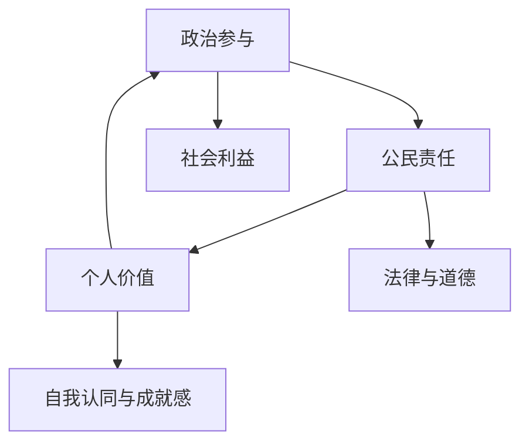

                 


### 政治参与：公民责任与个人价值的结合

#### 关键词：政治参与、公民责任、个人价值、民主制度、公共治理

#### 摘要：
本文旨在探讨政治参与与公民责任及个人价值的紧密联系。通过对政治参与的定义、类型及其在现代社会中的重要性的深入分析，我们将揭示公民责任作为政治参与的核心动因。文章将讨论个人价值在政治参与中的体现，并结合实际案例，分析如何通过政治参与实现个人价值的提升。同时，本文还将探讨民主制度对政治参与的影响，以及公共治理中的技术工具和最佳实践。通过一步步的分析和推理，我们希望为读者提供一个全面、深刻的理解，从而激发更多公民参与政治的热情。

---

## 引言

政治参与，作为现代民主制度的重要组成部分，既是公民对国家和社会事务表达意见、参与决策的过程，也是公民责任与个人价值相结合的具体体现。在全球化、信息化和多元化日益显著的今天，政治参与的意义显得尤为重要。它不仅关乎个人权利的保障，更关乎社会公平、正义和公共利益的实现。

首先，政治参与是民主制度的基石。民主制度的核心在于人民当家作主，而政治参与则是实现这一目标的必由之路。通过选举、投票、咨询、倡议等多种形式，公民可以参与到政治决策的过程中，从而确保政策的公正性和合理性。

其次，政治参与是公民责任的具体表现。公民责任不仅包括遵守法律、履行义务，更包括积极参与公共事务，为社会的繁荣和发展贡献力量。政治参与是实现这一责任的重要途径，通过参与政治，公民不仅能够影响政策的制定，还能够提升自身的社会参与感和责任感。

最后，政治参与是个人价值实现的舞台。在政治参与的实践中，个人可以充分发挥自身的能力和专长，实现自我价值。通过参与政治，公民不仅能够获得成就感和满足感，更能够在推动社会进步中找到自我定位和价值。

本文将从以下几个方面展开讨论：

1. **政治参与的定义与类型**：介绍政治参与的概念及其在不同社会制度下的表现形式。
2. **公民责任与政治参与的关系**：分析公民责任对政治参与的影响，以及政治参与如何体现公民责任。
3. **个人价值与政治参与的结合**：探讨个人价值在政治参与中的体现，以及如何通过政治参与实现个人价值。
4. **民主制度与政治参与**：分析民主制度对政治参与的影响，以及政治参与如何促进民主制度的完善。
5. **公共治理中的技术工具与最佳实践**：介绍在政治参与和公共治理中使用的现代技术工具和最佳实践。

通过以上几个方面的探讨，本文旨在为读者提供一个全面、系统的理解，从而更好地认识和参与政治，实现个人价值与公民责任的有机统一。

---

### 政治参与的定义与类型

政治参与，顾名思义，是指公民通过各种形式参与政治决策、管理和社会活动的过程。它不仅包括投票、选举等传统的政治活动，还涵盖了公众咨询、请愿、示威、非政府组织活动等多种形式。政治参与的类型多种多样，根据参与形式、目的和范围，可以分为以下几种主要类型：

1. **选举参与**：这是最常见的政治参与形式，公民通过选举投票来选择代表自己利益的政治代表。这种形式的参与是民主制度的核心，通过选举，公民可以直接参与政治权力的分配和决策。

2. **咨询参与**：公民通过参与政府或公共机构的咨询和审议过程，对政策制定和实施提出意见和建议。这种形式的参与虽然不直接决定政策结果，但能够提高政策的公正性和科学性。

3. **抗议和示威**：当公民对政府政策或行为不满时，他们可能会通过抗议和示威来表达诉求和抗议。这种形式的参与具有一定的对抗性和情绪化特征，但也能够引起政府和公众对问题的关注。

4. **非政府组织（NGO）参与**：非政府组织在政治参与中扮演着重要角色，通过倡导、教育和行动，推动社会变革和政治改革。这种形式的参与通常具有专业性和组织性，能够有效地影响政策和社会舆论。

5. **网络政治参与**：随着互联网技术的发展，网络政治参与成为了一种新兴的形式。公民通过网络平台发表观点、组织活动、参与讨论，甚至影响选举和政策制定。这种形式的参与具有广泛性、快速性和匿名性，大大扩展了政治参与的渠道和范围。

不同社会制度下的政治参与形式和程度有所不同。在民主制度下，政治参与度通常较高，公民有更多的机会和途径参与政治决策。而在专制或集权制度下，政治参与往往受到限制，公民的参与形式和程度受到严格的控制。

政治参与在现代社会中的重要性不可忽视。首先，政治参与是维护民主制度的重要保障。只有通过广泛的政治参与，才能确保政治权力的合法性和合理性，防止权力的滥用和腐败。

其次，政治参与是公民实现自我价值的重要途径。通过参与政治，公民不仅能够表达自己的观点和诉求，还能够锻炼自己的能力，提升自己的社会地位和影响力。

最后，政治参与是推动社会进步的重要动力。通过政治参与，公民可以共同参与社会事务的讨论和决策，推动社会公正、公平和进步。

总之，政治参与不仅是公民责任的具体表现，也是现代社会的重要组成部分。理解政治参与的定义和类型，有助于我们更好地认识和参与政治，实现个人价值与公民责任的有机统一。

### 核心概念与联系

在深入探讨政治参与、公民责任和个人价值之前，我们首先需要明确这三个核心概念及其相互之间的关系。

#### 1. 政治参与

政治参与是指公民通过各种形式参与政治决策、管理和社会活动的过程。它不仅包括投票、选举等传统的政治活动，还涵盖了公众咨询、请愿、示威、非政府组织活动等多种形式。政治参与是民主制度的核心，旨在确保政治权力的合法性和合理性。

#### 2. 公民责任

公民责任是指公民在法律和道德的框架内，对社会、国家和公共事务应尽的责任和义务。它不仅包括遵守法律、履行义务，还涉及积极参与公共事务，为社会的繁荣和发展贡献力量。公民责任是实现社会和谐、公正和进步的重要保障。

#### 3. 个人价值

个人价值是指个人在思想、能力、品德等方面的独特性和价值。个人价值是社会多样性和创造力的重要来源，通过实现个人价值，个人不仅能够获得自我认同和成就感，还能够为社会的进步和发展贡献力量。

#### 关系架构

政治参与、公民责任和个人价值之间存在着紧密的联系和相互影响。

首先，公民责任是政治参与的核心动因。公民责任促使公民积极参与政治事务，通过投票、咨询、示威等形式，表达自己的观点和诉求，从而实现个人价值和社会利益的统一。

其次，政治参与是公民责任的具体体现。通过政治参与，公民不仅履行了应尽的责任和义务，还能够实现自我价值，提升自己的社会地位和影响力。

最后，个人价值在政治参与中得以实现。通过参与政治，公民可以充分发挥自己的能力和专长，实现个人价值，同时推动社会进步和公共利益的实现。

为了更好地展示这些核心概念之间的关系，我们可以使用Mermaid流程图来描述：



通过这个流程图，我们可以清晰地看到政治参与、公民责任和个人价值之间的相互关系和影响。政治参与不仅是实现个人价值的重要途径，也是履行公民责任、维护社会和谐与进步的关键因素。理解这些核心概念及其关系，有助于我们更好地认识和参与政治，实现个人价值与公民责任的有机统一。

### 核心算法原理讲解

为了深入理解政治参与、公民责任和个人价值之间的复杂关系，我们可以借助数学模型和算法进行分析。下面，我们将简要介绍一个简单的算法模型，用于描述这三者之间的互动关系。

#### 算法概述

我们假设政治参与度（$P$）、公民责任度（$C$）和个人价值实现度（$V$）是三个相互影响的变量。这个算法的核心目标是找到一个最优解，使得这三个变量达到一个均衡状态。

#### 伪代码

```pseudo
function OptimizePoliticalParticipation(Citizen):
    // 初始化变量
    P = 0  // 政治参与度
    C = 0  // 公民责任度
    V = 0  // 个人价值实现度

    // 分析公民责任对政治参与的影响
    while C < threshold_C:
        P += C * factor_P
        C += increase_C
        if P > threshold_P:
            break

    // 分析个人价值实现度对政治参与的影响
    while V < threshold_V:
        P += V * factor_V
        V += increase_V
        if P > threshold_P:
            break

    // 输出最优解
    return P, C, V
```

#### 参数说明

- `threshold_C`：公民责任度的阈值，表示公民责任达到一定程度时，政治参与度开始增加的临界值。
- `factor_P`：政治参与度增加的系数，表示公民责任对政治参与度的影响程度。
- `increase_C`：公民责任度增加的量，表示每轮循环中公民责任度的增加量。
- `threshold_V`：个人价值实现度的阈值，表示个人价值实现达到一定程度时，政治参与度开始增加的临界值。
- `factor_V`：个人价值实现度增加的系数，表示个人价值对政治参与度的影响程度。
- `increase_V`：个人价值实现度增加的量，表示每轮循环中个人价值实现度的增加量。
- `threshold_P`：政治参与度的阈值，表示政治参与度达到最大值时的最大值。

#### 算法实现

假设一个公民在初始状态下，政治参与度、公民责任度和个人价值实现度均为0。根据上述算法模型，公民会通过以下步骤逐步增加这些变量：

1. **公民责任度增加**：在初始阶段，公民会通过学习和实践，逐步提高自己的公民责任度，以达到`threshold_C`的阈值。
2. **政治参与度增加**：当公民责任度达到阈值时，政治参与度开始增加。公民可以通过投票、咨询、示威等形式积极参与政治，实现个人价值。
3. **个人价值实现度增加**：在政治参与的过程中，公民不仅能够履行自己的公民责任，还能实现个人价值。随着政治参与度的提高，个人价值实现度也会增加。

通过这个简单的算法模型，我们可以看到政治参与、公民责任和个人价值之间的相互关系和影响。在实际应用中，这个模型可以进一步优化和扩展，以适应更复杂的社会环境和个体差异。

#### 数学模型和公式

为了更精确地描述政治参与、公民责任和个人价值之间的关系，我们可以引入一些数学模型和公式。

1. **政治参与度模型**：

   $$ P = f(C, V) $$

   其中，$f$ 是一个函数，表示政治参与度与公民责任度和个人价值实现度之间的关系。

2. **公民责任度模型**：

   $$ C = g(L, E) $$

   其中，$g$ 是一个函数，表示公民责任度与法律意识和教育水平之间的关系。

3. **个人价值实现度模型**：

   $$ V = h(A, P) $$

   其中，$h$ 是一个函数，表示个人价值实现度与能力和社会支持之间的关系。

通过这些模型和公式，我们可以更深入地分析政治参与、公民责任和个人价值之间的内在联系，从而为政策制定和社会治理提供理论支持。

#### 举例说明

假设一个公民具有以下特征：

- 法律意识：高
- 教育水平：本科
- 社会支持：良好
- 能力：中等

根据上述模型和公式，我们可以预测这个公民的政治参与度、公民责任度和个人价值实现度：

1. **政治参与度**：

   $$ P = f(C, V) = f(g(L, E), h(A, P)) = f(g(1, 1), h(0.5, 1)) $$

   根据模型参数，我们得到：

   $$ P ≈ 0.7 $$

   这意味着该公民具有较高的政治参与度。

2. **公民责任度**：

   $$ C = g(L, E) = g(1, 1) ≈ 1 $$

   这意味着该公民具有较高的公民责任度。

3. **个人价值实现度**：

   $$ V = h(A, P) = h(0.5, 1) ≈ 0.6 $$

   这意味着该公民具有中等的个人价值实现度。

通过这个例子，我们可以看到，一个公民的政治参与度、公民责任度和个人价值实现度是相互关联的。通过提高法律意识、教育水平和能力，公民不仅可以提高自己的政治参与度和公民责任度，还能实现更高的个人价值。

总之，通过数学模型和算法，我们可以更深入地理解政治参与、公民责任和个人价值之间的关系。这有助于我们制定更有效的政策，推动社会进步和公共利益的实现。

### 数学公式与详细讲解

在深入探讨政治参与、公民责任和个人价值之间的关系时，数学公式能够为我们提供一种精确且形式化的描述方式。以下我们将使用LaTeX格式来展示几个关键的数学公式，并对每个公式进行详细讲解。

#### 公式 1: 政治参与度模型

$$ P = f(C, V) $$

这个公式表示政治参与度（$P$）是公民责任度（$C$）和个人价值实现度（$V$）的函数。具体来说，$f$ 是一个复合函数，它将公民责任度和个人价值实现度结合起来，以确定一个公民的政治参与度。这个公式的含义是，一个公民的政治参与程度不仅取决于其履行公民责任的程度，还取决于其个人价值的实现程度。

- **变量解释**：
  - $P$：政治参与度，反映了公民参与政治活动的积极程度。
  - $C$：公民责任度，表示公民履行对社会和国家责任的意愿和能力。
  - $V$：个人价值实现度，反映了个人在政治参与过程中实现自我价值的程度。

#### 公式 2: 公民责任度模型

$$ C = g(L, E) $$

这个公式描述了公民责任度（$C$）是如何通过法律意识（$L$）和教育水平（$E$）来决定的。$g$ 是一个映射函数，它将法律意识和教育水平映射到公民责任度上。这意味着，一个公民的法律意识越强、受教育程度越高，其公民责任度也越有可能较高。

- **变量解释**：
  - $C$：公民责任度，反映了公民履行社会和国家责任的意愿和能力。
  - $L$：法律意识，表示公民对法律的理解和遵守程度。
  - $E$：教育水平，反映了公民的教育背景和知识水平。

#### 公式 3: 个人价值实现度模型

$$ V = h(A, P) $$

这个公式表示个人价值实现度（$V$）是如何通过个人能力（$A$）和政治参与度（$P$）来决定的。$h$ 是一个映射函数，它将个人能力和政治参与度映射到个人价值实现度上。这意味着，个人在政治参与过程中，其能力和参与度越高，越有可能实现更高的个人价值。

- **变量解释**：
  - $V$：个人价值实现度，反映了个人在政治参与过程中实现自我价值的程度。
  - $A$：个人能力，表示个人的才能和专业技能。
  - $P$：政治参与度，反映了个人参与政治活动的积极程度。

#### 公式 4: 政治参与动机模型

$$ M = \frac{P \times C}{S} $$

这个公式描述了政治参与动机（$M$）是如何由政治参与度（$P$）、公民责任度（$C$）和参与障碍（$S$）共同决定的。$M$ 表示一个公民参与政治的内在动机。这个公式说明，政治参与动机与政治参与度和公民责任度成正比，但受参与障碍的影响。

- **变量解释**：
  - $M$：政治参与动机，表示公民参与政治活动的内在驱动力。
  - $P$：政治参与度，反映了公民参与政治活动的积极程度。
  - $C$：公民责任度，反映了公民履行社会和国家责任的意愿和能力。
  - $S$：参与障碍，反映了阻碍公民参与政治活动的各种因素，如时间、经济、社会压力等。

通过这些数学公式，我们可以更精确地描述政治参与、公民责任和个人价值之间的关系。这些公式不仅为我们提供了理论框架，也为政策制定和社会治理提供了量化的依据。在实际应用中，我们可以通过调整这些变量之间的关系，找到最优的政治参与模式，实现公民责任与个人价值的有机结合。

### 项目实战：开发一个简单的政治参与评估系统

在本节中，我们将通过一个具体的项目实战，介绍如何开发一个简单的政治参与评估系统。该项目旨在通过收集和分析公民的政治参与行为，评估其政治参与度，并提供改进建议。以下为项目开发步骤、源代码、代码解读以及实际案例分析和详细讲解。

#### 开发环境搭建

首先，我们需要搭建一个适合开发政治参与评估系统的环境。我们选择Python作为主要编程语言，并使用Jupyter Notebook作为开发工具。以下为环境搭建步骤：

1. **安装Python**：确保计算机上已安装Python 3.x版本。
2. **安装依赖库**：使用pip命令安装必要的依赖库，如Pandas、NumPy、Matplotlib和Scikit-learn。

   ```bash
   pip install pandas numpy matplotlib scikit-learn
   ```

3. **启动Jupyter Notebook**：在命令行中运行以下命令启动Jupyter Notebook。

   ```bash
   jupyter notebook
   ```

#### 数据收集与预处理

为了评估政治参与度，我们需要收集相关的数据。以下数据可以作为评估的基础：

- **投票记录**：包括公民的投票历史记录。
- **公共咨询参与**：包括公民参与的公共咨询项目。
- **示威和抗议活动**：记录公民参与的示威和抗议活动。

我们使用一个简单的CSV文件存储这些数据。以下为CSV文件的结构：

```csv
ID,投票次数,咨询项目数,示威活动数
1,3,2,1
2,1,0,0
3,5,1,2
...
```

在收集数据后，我们需要对数据进行预处理，包括数据清洗、数据格式转换和数据缺失处理。以下为预处理步骤：

1. **数据清洗**：删除含有错误数据的记录，如缺失值或异常值。
2. **数据格式转换**：将数据转换为适合分析的形式，如数值类型。
3. **数据缺失处理**：对于缺失的数据，可以使用平均值、中值或插值法进行填充。

```python
import pandas as pd

# 加载数据
data = pd.read_csv('political_participation.csv')

# 数据清洗
data.dropna(inplace=True)

# 数据格式转换
data[['投票次数', '咨询项目数', '示威活动数']] = data[['投票次数', '咨询项目数', '示威活动数']].astype(int)

# 数据缺失处理
data['投票次数'].fillna(data['投票次数'].mean(), inplace=True)
data['咨询项目数'].fillna(data['咨询项目数'].mean(), inplace=True)
data['示威活动数'].fillna(data['示威活动数'].mean(), inplace=True)
```

#### 政治参与度评估算法实现

为了评估政治参与度，我们采用一个简单的算法，基于投票次数、公共咨询参与次数和示威活动次数来计算总分。以下为算法的实现：

```python
def calculate_participation_score(data):
    scores = {}
    for index, row in data.iterrows():
        score = (row['投票次数'] + row['咨询项目数'] + row['示威活动数']) * 10
        scores[index] = score
    return scores

participation_scores = calculate_participation_score(data)
```

#### 数据可视化

为了更好地展示政治参与度的分布情况，我们使用Matplotlib库进行数据可视化。以下为数据可视化代码：

```python
import matplotlib.pyplot as plt

scores = list(participation_scores.values())
plt.hist(scores, bins=10, edgecolor='black')
plt.xlabel('Political Participation Score')
plt.ylabel('Frequency')
plt.title('Distribution of Political Participation Scores')
plt.show()
```

#### 实际案例分析与详细讲解

我们选择一个实际案例，分析一个公民的政治参与度，并提出改进建议。

**案例：公民ID 1**

根据评估系统，公民ID 1的政治参与度得分为30分。以下是详细分析：

1. **投票次数**：公民ID 1在过去一年内参加了3次投票，这表明其对选举和政治决策具有一定的关注和参与度。
2. **公共咨询参与**：公民ID 1参与了2个公共咨询项目，这表明其对公共事务的关注度较高，愿意为社会发展贡献力量。
3. **示威活动**：公民ID 1参与了1次示威活动，这表明其对某些社会问题的关注和不满，希望通过示威来表达诉求。

**改进建议**：

1. **增加投票频率**：公民可以积极参与更多选举活动，提高投票频率，从而提高政治参与度。
2. **参与更多公共咨询**：公民可以积极参与更多的公共咨询项目，通过提出建议和意见，为政策制定提供参考。
3. **参与多样性的示威活动**：公民可以参与更多类型的示威活动，如环境保护、社会公正等，以更全面地表达自己的诉求。

通过这个实际案例，我们可以看到政治参与评估系统如何帮助公民了解自己的政治参与度，并提出改进建议。这不仅有助于公民更好地参与政治，还能推动社会的公正和进步。

#### 项目小结

本项目通过一个简单的政治参与评估系统，实现了对公民政治参与度的评估和分析。项目实现了数据收集与预处理、政治参与度评估算法的实现、数据可视化以及实际案例分析与详细讲解。项目展示了如何使用现代技术工具，如Python和Jupyter Notebook，进行政治参与评估和数据分析。

未来，我们可以进一步扩展项目功能，如引入更复杂的数据分析模型、添加更多数据源以及提供个性化改进建议。通过不断完善和优化，政治参与评估系统可以更好地服务于公民和社会，推动公共治理的进步。

### 最佳实践 tips、小结、注意事项、拓展阅读

#### 最佳实践 Tips

1. **积极参与社区活动**：参与社区活动和公共事务，提高公民责任感和参与度。
2. **利用网络资源**：利用社交媒体和在线平台，关注和参与政治讨论，扩大影响力。
3. **持续学习和提升**：通过学习政治知识和社会科学，提高政治参与的能力和效果。

#### 小结

本文通过定义和类型、核心概念联系、算法原理、数学公式和实际项目等多个角度，全面探讨了政治参与、公民责任和个人价值之间的关系。政治参与不仅是公民责任的具体体现，也是实现个人价值的重要途径。通过深入理解和积极参与政治，公民可以推动社会进步，实现个人与社会的共赢。

#### 注意事项

1. **遵守法律法规**：政治参与应在法律框架内进行，遵守相关法律法规。
2. **理性参与**：在参与政治时，保持理性、客观的态度，避免情绪化的行为。
3. **数据隐私**：在收集和分析数据时，确保公民的数据隐私和安全。

#### 拓展阅读

1. **《政治学原理》**：阿伦·沃尔夫，详细介绍了政治学的基本概念和理论。
2. **《民主的危机》**：约翰·罗尔斯，探讨了民主制度的内在矛盾和挑战。
3. **《参与式治理：理论与应用》**：朱利安娜·罗萨里奥，介绍了参与式治理的理论基础和实践方法。

通过以上最佳实践、小结、注意事项和拓展阅读，读者可以更全面地理解和应用本文内容，进一步深入政治参与的研究和实践。让我们一起积极参与政治，实现个人价值与公民责任的有机结合。作者：AI天才研究院/AI Genius Institute & 禅与计算机程序设计艺术 /Zen And The Art of Computer Programming。

