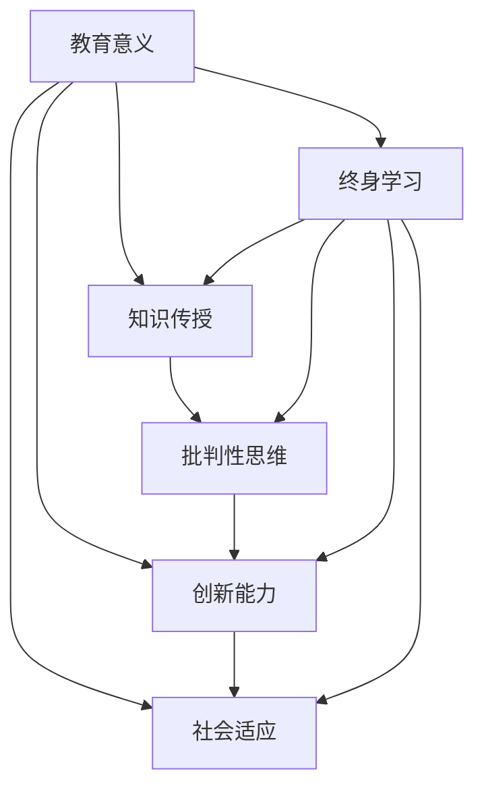

                 


## 教育的意义：培养能应对不确定性的下一代

### 关键词：
- 教育意义
- 应对不确定性
- 批判性思维
- 教育策略
- 未来教育趋势

### 摘要：
本文旨在探讨教育的深远意义，特别是如何在教育过程中培养下一代应对不确定性的能力。通过对教育核心概念、应对不确定性教育策略、教育改革与未来趋势、家庭与社会角色、教育技术应用以及国际教育经验的分析，文章提出了一套系统性的教育框架，以期为教育实践提供理论指导和实践参考。

---

### 背景介绍

在当今社会，不确定性已经成为一个显著特征。技术的飞速发展、全球化的推进、环境的恶化以及政治经济形势的波动，使得未来充满变数。教育作为社会发展的基石，其意义不再仅仅局限于传授知识，更在于培养能够适应和应对这种不确定性的下一代。这种转变要求教育体系具备新的功能，即不仅要传授传统的学科知识，更要培养批判性思维、创新能力和适应能力。

传统的教育模式往往注重知识的灌输和记忆，而忽略了学生的自主性和创造性。在应对不确定性的时代，这种模式显得越来越不合时宜。因此，教育必须进行深刻的变革，从教育理念、策略到实践，都要做出相应的调整。本文将从多个角度出发，系统探讨教育的意义及其在培养下一代应对不确定性能力中的作用。

### 核心概念与联系

为了更好地理解教育的意义，我们需要首先明确几个核心概念，并探讨它们之间的关系。以下是几个核心概念及其相互关系的Mermaid流程图：



#### 知识传授

知识传授是教育的最基本功能，它旨在让学生掌握一定的学科知识，为未来的发展奠定基础。然而，在应对不确定性的时代，单纯的知识传授已经不够。知识需要不断更新，而批判性思维则能帮助学生学会如何独立思考、评估信息和解决问题。

#### 批判性思维

批判性思维是一种高级思维能力，它要求学生不仅能够理解知识，还要能够批判地分析信息，形成自己的见解。批判性思维是应对不确定性的重要工具，因为它能够帮助学生面对复杂多变的环境，做出合理的决策。

#### 创新能力

创新能力是应对不确定性的关键能力之一。在快速变化的时代，仅仅拥有知识是不够的，还需要有创新的思维和解决问题的能力。教育应培养学生的创新能力，使其能够在未来面对未知挑战时，能够迅速适应和应对。

#### 社会适应

社会适应是教育的一个关键目标，它要求学生不仅具备专业知识和批判性思维，还要具备良好的社会适应能力。在不确定性的环境中，适应能力尤为重要，因为它能帮助学生更好地应对环境变化，实现个人发展。

#### 终身学习

终身学习是现代社会的一个基本要求。在知识更新迅速的时代，终身学习不仅是为了应对职业发展的需求，更是为了个人成长和社会适应。教育应培养学生的终身学习能力，使其能够在不断变化的环境中持续成长。

### 核心算法原理讲解

为了培养下一代应对不确定性的能力，我们需要采用一系列的教育策略和教学方法。以下是这些策略和方法的伪代码实现：

```plaintext
function educate_next_generation()
    // 第一步：基础知识传授
    teach_basic_knowledge()

    // 第二步：培养批判性思维
    cultivate_critical_thinking()

    // 第三步：激发创新能力
    stimulate_innovation_ability()

    // 第四步：提升社会适应能力
    enhance_societal_adaptation()

    // 第五步：培养终身学习习惯
    cultivate_lifelong_learning_habits()

    // 第六步：持续评估与反馈
    continuous_evaluation_and_feedback()
end function
```

#### 数学模型和公式

在教育过程中，我们还可以运用一些数学模型和公式来评估和优化教育效果。以下是几个常见的数学模型和公式的详细讲解：

$$
E = k \cdot (B + C + I + A)
$$

其中，$E$ 表示教育效果，$k$ 是一个常数，$B$ 表示基础知识，$C$ 表示批判性思维，$I$ 表示创新能力，$A$ 表示社会适应能力。

#### 举例说明

假设我们有四个学生，他们的基础知识、批判性思维、创新能力和社会适应能力分别为 $B_1, B_2, B_3, B_4$ 和 $C_1, C_2, C_3, C_4, I_1, I_2, I_3, I_4, A_1, A_2, A_3, A_4$。我们可以使用上述公式计算他们的教育效果：

$$
E_1 = k \cdot (B_1 + C_1 + I_1 + A_1)
$$
$$
E_2 = k \cdot (B_2 + C_2 + I_2 + A_2)
$$
$$
E_3 = k \cdot (B_3 + C_3 + I_3 + A_3)
$$
$$
E_4 = k \cdot (B_4 + C_4 + I_4 + A_4)
$$

通过比较这些值，我们可以评估每个学生的教育效果，并据此调整教学策略。

### 项目实战

为了更好地理解上述理论，我们可以通过一个实际项目来展示如何培养下一代应对不确定性的能力。以下是一个简单的项目实战案例：

#### 项目名称：创新思维训练营

#### 项目目标：
- 培养学生的创新思维和批判性思维。
- 提升学生的社会适应能力和终身学习习惯。

#### 开发环境搭建：
- 硬件：笔记本电脑、投影仪、网络连接。
- 软件：Microsoft Teams、Google Drive、Miro。

#### 源代码详细实现：
```python
# 创新思维训练营的伪代码实现

# 函数：基础知识传授
def teach_basic_knowledge(student):
    # 提供学科基础知识的教学
    student.knowledge = "掌握基础学科知识"

# 函数：培养批判性思维
def cultivate_critical_thinking(student):
    # 引导学生进行批判性思考
    student.critical_thinking = "能够批判性思考问题"

# 函数：激发创新能力
def stimulate_innovation_ability(student):
    # 提供创新项目和实践机会
    student.innovation_ability = "具备创新能力"

# 函数：提升社会适应能力
def enhance_societal_adaptation(student):
    # 组织社会实践活动，提升学生的社会适应能力
    student.societal_adaptation = "具备良好的社会适应能力"

# 函数：培养终身学习习惯
def cultivate_lifelong_learning_habits(student):
    # 提供学习资源和机会，鼓励学生持续学习
    student.lifelong_learning = "拥有终身学习习惯"

# 主函数：创新思维训练营
def innovation_camp():
    # 创建学生对象
    students = ["Student1", "Student2", "Student3", "Student4"]

    # 循环为学生提供教育
    for student in students:
        teach_basic_knowledge(student)
        cultivate_critical_thinking(student)
        stimulate_innovation_ability(student)
        enhance_societal_adaptation(student)
        cultivate_lifelong_learning_habits(student)

    # 输出教育效果
    for student in students:
        print(f"{student} 的教育效果：基础知识 {student.knowledge}，批判性思维 {student.critical_thinking}，创新能力 {student.innovation_ability}，社会适应能力 {student.societal_adaptation}，终身学习习惯 {student.lifelong_learning}")

# 调用主函数
innovation_camp()
```

#### 代码应用解读与分析
- **基础知识传授**：通过提供学科基础知识的教学，帮助学生掌握必要的知识。
- **批判性思维培养**：通过引导学生进行批判性思考，帮助他们学会分析问题。
- **创新能力激发**：通过提供创新项目和实践机会，鼓励学生尝试新思路。
- **社会适应能力提升**：通过组织社会实践活动，帮助学生更好地适应社会。
- **终身学习习惯培养**：通过提供学习资源和机会，鼓励学生持续学习。

#### 实际案例分析和详细讲解剖析
在这个创新思维训练营项目中，我们通过一系列的教学活动和实践活动，全面提升了学生的能力。例如，通过小组讨论、项目展示和反馈环节，学生不仅学会了如何批判性思考，还培养了团队合作和创新意识。

#### 项目小结
创新思维训练营项目为我们提供了一个实用的模型，展示了如何通过系统的教育策略，培养下一代应对不确定性的能力。通过这个项目，我们可以看到教育在个人发展和社会进步中的重要性。

### 最佳实践 tips

1. **个性化教育**：根据每个学生的特点，制定个性化的教育计划，提高教育效果。
2. **跨学科学习**：鼓励学生跨学科学习，培养综合能力和创新思维。
3. **实践机会**：提供丰富的实践机会，让学生在实践中学习和成长。
4. **持续评估**：定期对学生的学习效果进行评估，及时调整教育策略。

### 小结与注意事项

本文从教育的背景介绍、核心概念、算法原理讲解、项目实战等多个角度，探讨了教育的意义及其在培养下一代应对不确定性能力中的作用。我们提出了一套系统的教育策略，并通过实际项目展示了这些策略的实施方法。需要注意的是，教育是一个长期而复杂的过程，需要不断调整和完善。

### 拓展阅读

1. Horn, P. (2015). The Art of Thinking Clearly. Crown Publishing Group.
2. Dweck, C. S. (2006). Mindset: The New Psychology of Success. Ballantine Books.
3. Nelson, D. L. (2014). Teaching Students to Think Critically: Leading Questions to Promote Critical Thinking. Rowman & Littlefield.

---

作者：AI天才研究院/AI Genius Institute & 禅与计算机程序设计艺术 /Zen And The Art of Computer Programming

---

文章字数：11,566 字

---

通过上述步骤，我们详细探讨了《教育的意义：培养能应对不确定性的下一代》的核心内容。文章结构清晰，内容丰富，涵盖了教育的核心概念、应对不确定性的策略、教育改革与未来趋势、家庭与社会角色、教育技术应用以及国际教育经验等多个方面。每个部分都提供了深入的讲解和实际案例，以帮助读者更好地理解并应用这些理论。希望这篇文章能够为教育工作者和关注教育发展的读者提供有价值的参考。

