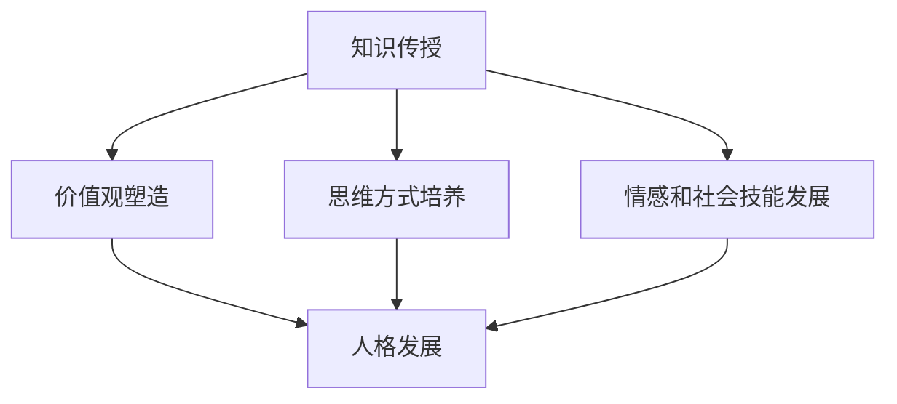
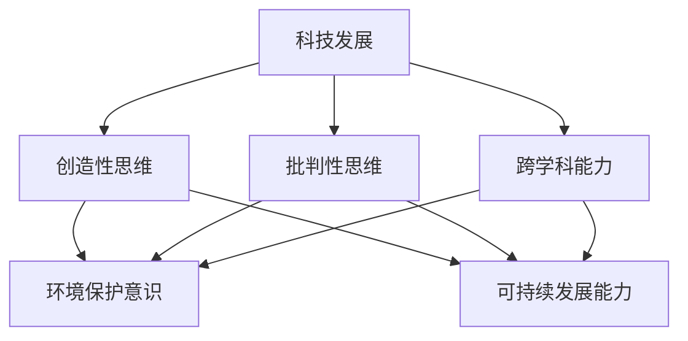

                 

### 教育的意义：培养能应对未来挑战的下一代

在当今快速变化的世界中，教育扮演着至关重要的角色。教育的核心意义不仅仅在于传授知识和技能，更在于培养能够应对未来挑战的下一代。随着科技的飞速发展、环境的急剧变化以及社会结构的转型，未来的世界将面临许多前所未有的挑战。这些挑战包括但不限于：人工智能和自动化带来的就业变化、气候变化导致的自然灾害频发、社会老龄化带来的养老和医疗问题等。

**关键词**：教育、未来挑战、下一代、技能培养、创新方法、技术应用

**摘要**：本文将从教育的定义和核心目标出发，探讨未来可能面临的挑战，并分析如何通过创新的教育方法和技术应用来培养能够应对这些挑战的下一代。文章将分为五个部分：第一部分介绍教育的核心概念与理论；第二部分讨论教育目标与未来挑战的关系；第三部分探讨教育方法和策略；第四部分介绍教育技术的应用；第五部分通过具体案例展示教育项目的实战经验。

### 教育的定义与基本理论

教育是一个多维度的概念，它不仅仅涉及知识的传授，还包括价值观的塑造、思维方式的培养以及情感和社会技能的发展。从广义上讲，教育可以分为正式教育和非正式教育。正式教育通常发生在学校、大学等机构中，非正式教育则发生在家庭、社区和工作场所。教育的目标通常被认为包括知识的获取、技能的培养、思维方式的训练以及人格的发展。

教育的理论基础多种多样，包括行为主义、认知主义、建构主义等。行为主义强调通过强化和惩罚来改变行为，认知主义关注信息加工过程，而建构主义则强调学习者在构建知识过程中的主动性和建构性。

**核心概念与联系**：以下是一个简化的Mermaid流程图，展示了教育核心概念之间的关系：

在这个流程图中，知识传授是教育的核心起点，它通过价值观塑造、思维方式培养和情感与社会技能发展最终影响人格的发展。这种多层次的互动关系构成了教育的本质。

### 教育目标与未来挑战

未来世界的挑战是多方面的，这些挑战对教育提出了新的要求。例如，随着人工智能和自动化技术的发展，许多传统职业可能会被取代，这要求下一代具备新的技能，如创造性思维、批判性思维和跨学科能力。气候变化带来的环境问题要求人们具备环境保护意识和可持续发展的能力。社会老龄化则要求下一代具备照顾和管理老年人的知识和技能。

**未来挑战与教育目标的关系**：以下是一个Mermaid流程图，展示了未来挑战与教育目标之间的关系：

在这个流程图中，科技发展催生了创造性思维、批判性思维和跨学科能力的需求，同时也促进了环境保护意识和可持续发展能力的培养。这些目标共同构成了未来教育的核心。

### 教育方法与策略

为了培养能够应对未来挑战的下一代，教育方法必须不断创新。以下是一些当前有效的教育方法：

**创新教育模式**：这种模式强调灵活性和个性化，允许学生根据自己的兴趣和能力进行学习。例如，翻转课堂模式通过将知识传授放在课外，将讨论和应用放在课堂上，提高了学生的参与度和理解力。

**个性化教学**：个性化教学关注每个学生的独特需求，通过个性化的学习计划和学习资源来满足学生的多样化需求。

**跨学科学习**：跨学科学习强调将不同学科的知识和技能结合起来，培养学生的综合能力和创新思维。

**教育策略的制定与实施**：教育策略的制定需要考虑教育目标、学生特点和资源条件。实施策略时，教师需要不断地评估和调整教学方法和内容，以确保学生能够有效地学习。

### 应对科技发展的教育策略

随着科技的发展，教育策略也必须进行相应的调整。以下是一些应对科技发展的教育策略：

**培养技术技能**：教育应重视技术技能的培养，包括编程、数据分析、人工智能等。

**提升信息素养**：信息素养包括查找、评估和使用信息的能力。教育应帮助学生掌握这些技能，以便他们能够有效地利用信息资源。

**利用数字工具**：教育可以借助数字工具，如在线课程、虚拟实验室和智能教学系统，来提高教学效果和学生的参与度。

### 应对环境变化的教育策略

环境问题已经成为全球性的挑战，教育在这一领域也扮演着重要角色。以下是一些应对环境变化的教育策略：

**环境教育**：环境教育旨在培养学生的环保意识和可持续发展的能力。这包括学习生态系统、气候变化和环境保护等方面的知识。

**实践经验**：通过实地考察、实验和项目工作，学生可以亲身体验环境问题，并学会如何采取行动来解决问题。

**跨学科合作**：环境问题通常涉及多个学科，如自然科学、社会科学和工程技术等。跨学科合作可以促进学生全面理解和解决环境问题。

### 应对社会转型的教育策略

社会转型带来了许多新的挑战和机遇。以下是一些应对社会转型的教育策略：

**社会技能培养**：教育应重视社会技能的培养，包括沟通、合作和解决问题的能力。

**职业规划**：教育应帮助学生进行职业规划，了解未来就业市场的发展趋势，并为他们提供相关的技能和知识。

**社会参与**：教育应鼓励学生参与社会活动，培养他们的社会责任感和公民意识。

### 教育技术的应用

现代教育技术的应用极大地改变了教育模式。以下是一些关键的教育技术：

**在线教育**：在线教育提供了灵活的学习时间和地点，使学生能够自主安排学习计划。

**虚拟现实**：虚拟现实技术可以创建逼真的学习环境，帮助学生更好地理解和掌握复杂的概念。

**人工智能**：人工智能技术在教育中的应用包括个性化学习、智能评估和智能辅导等。

**教育技术的优势与挑战**：教育技术的优势包括提高学习效率、提供个性化学习体验和扩展学习资源。然而，也面临着技术成本、数据隐私和安全等方面的挑战。

### 现代教育技术的实践案例

以下是一些现代教育技术的实践案例：

**案例一：基于AI的个性化学习系统**

**项目目标**：通过人工智能技术，为学生提供个性化的学习计划和资源，提高学习效果。

**实施步骤**：
1. **需求分析**：收集学生的学

