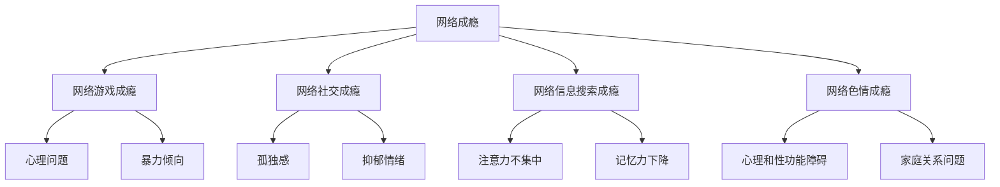
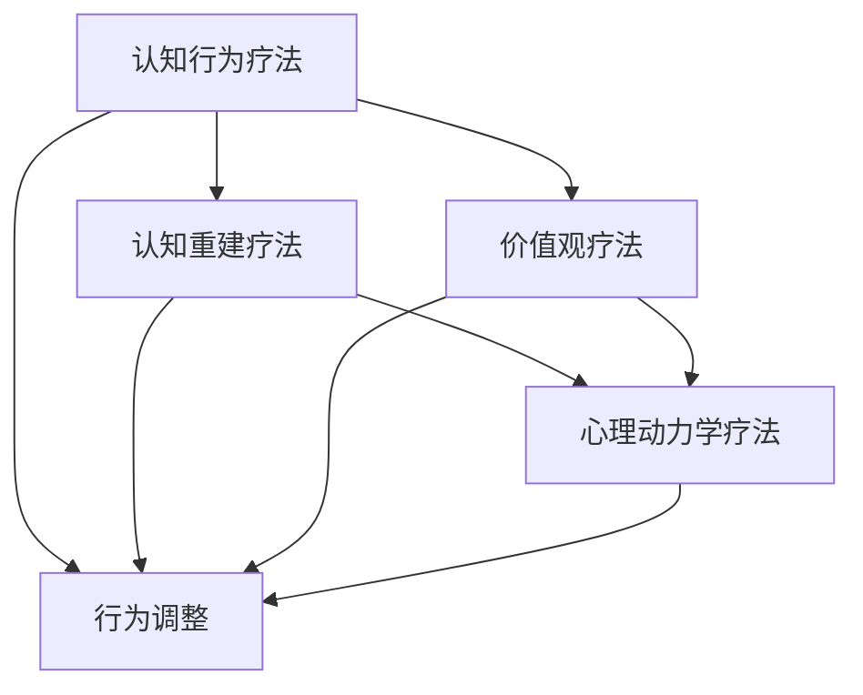

                 

# 数字detox度假村：网络成瘾的专业治疗中心

## 关键词
- 网络成瘾
- 数字detox
- 治疗中心
- 认知行为疗法
- 心理动力学疗法
- 价值观疗法

## 摘要
本文旨在探讨网络成瘾这一现代社会的普遍现象，并提出一种创新的治疗方法——数字detox度假村。通过分析网络成瘾的背景、定义、分类及其影响，本文介绍了数字detox度假村的概念和运营模式。随后，文章详细阐述了核心治疗方法，包括认知行为疗法、心理动力学疗法和价值观疗法，并通过Mermaid流程图展示了这些疗法之间的联系。此外，本文还介绍了数字detox度假村的运营与管理，提供了成功案例研究，并探讨了预防策略、政策与未来趋势。最后，文章以资源与工具的附录部分结束，为读者提供了进一步的学习和实践指南。

---

### 引言：网络成瘾问题的背景和重要性

#### 网络成瘾的定义和流行趋势

网络成瘾，又称为互联网成瘾或网络依赖，是指个体过度依赖网络活动，导致社会、职业、心理和身体健康受损的现象。随着互联网的普及和智能手机的广泛应用，网络成瘾已成为全球范围内日益关注的社会问题。

网络成瘾的定义可以根据不同的分类标准进行描述。从心理学角度来看，网络成瘾是一种行为成瘾，与药物成瘾、赌博成瘾等具有相似的特点，包括强烈的渴望、耐受性、戒断症状等。根据网络活动的性质，网络成瘾可以分为以下几类：

1. **网络游戏成瘾**：个体过度沉迷于网络游戏，导致日常生活和社交活动受到严重影响。
2. **网络社交成瘾**：过度依赖社交媒体平台，花费大量时间进行虚拟社交互动，忽视现实生活中的关系。
3. **网络信息搜索成瘾**：无法自控地花费大量时间在各种网站上搜索信息，影响正常的学习和工作。
4. **网络色情成瘾**：频繁访问和观看网络色情内容，导致心理和性功能障碍。

网络成瘾的流行趋势体现在以下几个方面：

1. **年龄趋势**：网络成瘾在青少年和年轻人中更为普遍，由于他们的互联网接触时间较长，更容易受到网络成瘾的影响。
2. **性别趋势**：尽管男性比女性更容易沉迷于网络游戏，但女性更可能沉迷于网络购物和社交媒体。
3. **社会文化趋势**：一些文化和社会背景下，对互联网的过度依赖被视为一种社交需求和自我表达方式，这可能导致网络成瘾问题的加剧。

#### 网络成瘾的危害和影响

网络成瘾对个体和社会的危害是多方面的，可以从身心健康、社交关系、职业发展等多个维度进行描述。

1. **身心健康问题**：
   - **心理问题**：网络成瘾可能导致焦虑、抑郁、自尊心下降等心理问题。长时间的网络活动可能导致注意力不集中，记忆力下降，甚至产生幻觉和妄想。
   - **身体健康问题**：长时间坐在电脑前或手机屏幕前可能导致视力下降、颈椎病、肥胖等健康问题。此外，缺乏运动和不规律的作息也可能影响身体健康。

2. **社交关系问题**：
   - **人际疏离**：过度沉迷于网络活动可能导致个体与现实生活中的人际关系疏远，减少面对面的社交互动。
   - **家庭关系问题**：网络成瘾可能导致家庭成员之间的沟通减少，影响家庭和谐。父母可能因为子女的网络成瘾而感到无助和焦虑。

3. **职业发展问题**：
   - **工作效率降低**：网络成瘾可能影响个体的工作效率，导致学习或工作表现下降。
   - **职业前景受限**：对于学生和职业人士，网络成瘾可能影响他们的学业和职业发展，甚至导致失业。

4. **社会问题**：
   - **网络安全风险**：网络成瘾可能导致个体更容易成为网络犯罪的受害者，例如网络诈骗、个人信息泄露等。
   - **社会成本**：网络成瘾对社会造成的经济损失和医疗费用不断增加，对社会的稳定和发展构成威胁。

#### 数字detox度假村的概念和目的

为了应对网络成瘾带来的负面影响，数字detox度假村作为一种新型治疗中心，应运而生。数字detox度假村的核心理念是通过提供一个远离互联网的环境，帮助成瘾者戒除对网络的依赖，恢复身心健康。

1. **概念**：
   - 数字detox度假村是一种专门为网络成瘾者提供治疗的康复中心，通过集中式的环境，帮助成瘾者戒除网络依赖，重新建立健康的生活方式。
   - 度假村通常位于自然环境优美的地区，远离城市喧嚣和互联网干扰，为成瘾者提供一个安静、舒适的环境，有助于他们进行心理和生理的调整。

2. **目的**：
   - **心理康复**：通过专业的心理治疗，帮助成瘾者解决内心的矛盾和焦虑，重建自我认知和自尊心。
   - **生理恢复**：通过适当的运动、饮食和休息，帮助成瘾者恢复身体健康，提高免疫力。
   - **生活方式重建**：通过参与各种活动，如户外探险、艺术创作、团队合作等，帮助成瘾者培养新的兴趣和爱好，减少对网络的依赖。

数字detox度假村的治疗过程通常包括以下几个阶段：

1. **评估和诊断**：通过专业心理医生对成瘾者的心理和生理状况进行评估，确定治疗目标和计划。
2. **戒断期**：在数字detox度假村的初期，成瘾者需要逐渐减少对互联网的使用，进行心理和生理的调整。
3. **心理治疗**：通过认知行为疗法、心理动力学疗法和价值观疗法等心理治疗方法，帮助成瘾者解决心理问题。
4. **生活方式重建**：通过参与各种活动和训练，帮助成瘾者培养新的生活方式，减少对网络的依赖。
5. **康复和回归**：在康复的最后阶段，成瘾者将逐渐适应恢复正常的生活，同时通过定期的复诊和心理支持，确保治疗的效果能够持续。

### 核心概念与联系：网络成瘾的定义、分类和影响

#### 网络成瘾的定义与心理学基础

网络成瘾是一种行为成瘾，其心理学基础包括以下几个方面：

1. **成瘾行为的特点**：
   - **渴求感**：网络成瘾者对网络活动产生强烈的渴求感，难以自控。
   - **耐受性**：随着成瘾程度的加深，网络成瘾者需要花费更多的时间或更大的刺激强度才能获得相同的满足感。
   - **戒断症状**：当网络成瘾者减少或停止网络活动时，可能出现焦虑、沮丧、易怒等戒断症状。

2. **心理学理论**：
   - **认知行为理论**：认知行为理论认为，网络成瘾是由于个体在认知和行为上的不良模式所导致。例如，网络成瘾者可能通过网络活动来逃避现实生活中的问题，或者通过网络上的社交互动来满足社交需求。
   - **心理动力学理论**：心理动力学理论认为，网络成瘾是潜意识冲突和情绪问题的外在表现。网络成瘾者可能通过网络活动来处理内心深处的焦虑和不安。

#### 网络成瘾的分类

网络成瘾可以根据网络活动的性质和个体行为的特征进行分类，常见的分类方法包括以下几种：

1. **网络游戏成瘾**：
   - **特点**：沉迷于网络游戏，花费大量时间进行虚拟战斗和角色扮演。
   - **影响**：可能影响学业和职业发展，导致人际关系疏远，甚至产生暴力倾向。

2. **网络社交成瘾**：
   - **特点**：过度依赖社交媒体平台，花费大量时间进行虚拟社交互动。
   - **影响**：可能影响现实生活中的社交关系，导致孤独感和抑郁情绪。

3. **网络信息搜索成瘾**：
   - **特点**：无法自控地花费大量时间在各种网站上搜索信息。
   - **影响**：可能影响正常的学习和工作，导致注意力不集中，记忆力下降。

4. **网络色情成瘾**：
   - **特点**：频繁访问和观看网络色情内容。
   - **影响**：可能导致心理和性功能障碍，影响人际关系和婚姻生活。

#### 网络成瘾的影响范围

网络成瘾的影响范围广泛，不仅涉及个体的身心健康，还影响到社交关系、职业发展和家庭生活。

1. **对身心健康的影响**：
   - **心理问题**：网络成瘾可能导致焦虑、抑郁、自尊心下降等心理问题。
   - **身体健康问题**：长时间坐在电脑前或手机屏幕前可能导致视力下降、颈椎病、肥胖等健康问题。

2. **对社交关系的影响**：
   - **人际疏离**：网络成瘾可能导致个体与现实生活中的人际关系疏远，减少面对面的社交互动。
   - **家庭关系问题**：网络成瘾可能导致家庭成员之间的沟通减少，影响家庭和谐。

3. **对职业发展的影响**：
   - **工作效率降低**：网络成瘾可能影响个体的工作效率，导致学习或工作表现下降。
   - **职业前景受限**：网络成瘾可能影响学生的学业和职业发展，甚至导致失业。

4. **对家庭生活的影响**：
   - **经济负担**：网络成瘾可能导致家庭经济负担加重，例如购买游戏装备、充值网络平台等。
   - **家庭暴力**：在一些极端情况下，网络成瘾可能导致家庭暴力事件的发生。

### 核心概念原理之间的联系架构

为了更清晰地理解网络成瘾的各个核心概念及其相互之间的关系，我们可以使用Mermaid流程图来展示这些概念之间的联系。

### 专业治疗方法介绍

#### 认知行为疗法

认知行为疗法（Cognitive Behavioral Therapy，CBT）是治疗网络成瘾最常用的方法之一。它基于以下核心原理：

1. **认知重建**：通过识别和纠正个体的错误认知，帮助成瘾者改变不良的思维模式。
2. **行为调整**：通过改变成瘾者的行为习惯，减少网络使用的频率和时间。

治疗流程包括以下步骤：

1. **评估和诊断**：了解成瘾者的网络成瘾程度和具体表现，确定治疗目标和计划。
2. **认知评估**：通过与成瘾者进行对话，识别其错误的认知和思维模式。
3. **认知重建**：帮助成瘾者识别并纠正错误的认知，例如通过认知重构技术，将“我必须在社交媒体上保持活跃”转变为“我在社交媒体上花费的时间过多，需要减少使用”。
4. **行为调整**：制定具体的行为计划，例如限制网络使用的时间，设定特定的活动来替代网络活动。

#### 认知重建疗法

认知重建疗法（Cognitive Restructuring Therapy，CRT）是认知行为疗法的一个分支，专注于改变个体的认知模式。其主要步骤包括：

1. **自我监测**：帮助成瘾者记录自己的网络使用情况，了解其网络行为的模式。
2. **认知重构**：通过认知重建技术，例如认知重构日记，帮助成瘾者识别和改变错误的认知。
3. **认知重建练习**：通过认知重构练习，如头脑风暴和思维导图，帮助成瘾者建立积极的认知模式。

#### 价值观疗法

价值观疗法（Value Therapy）基于个体的价值观和信仰系统来改变其行为。其核心原理包括：

1. **价值观评估**：帮助成瘾者识别和澄清自己的价值观。
2. **价值观重构**：通过价值观重构技术，帮助成瘾者建立更健康和积极的价值观。
3. **行动计划**：制定具体的行动计划，将新的价值观融入日常生活中。

### 心理动力学疗法

心理动力学疗法（Psychodynamic Therapy）是一种长程治疗方法，专注于潜意识冲突和情感问题。其核心原理包括：

1. **潜意识分析**：通过自由联想和梦境解析，帮助成瘾者探索潜意识中的冲突和情绪问题。
2. **情感表达**：通过情感表达技术，如角色扮演和情境模拟，帮助成瘾者处理内心深处的情感。
3. **行为调整**：在理解潜意识冲突的基础上，帮助成瘾者调整行为，减少网络成瘾。

### 核心治疗方法之间的联系

为了更清晰地理解各种治疗方法之间的联系，我们可以使用Mermaid流程图来展示这些治疗方法之间的关系。

### 治疗中心运营与管理

数字detox度假村作为一种专业的网络成瘾治疗中心，其运营与管理需要考虑多个方面，包括基础设施、人员配备、管理流程和收费模式。

#### 基础设施建设

数字detox度假村的基础设施建设是提供优质治疗服务的基础。基础设施应包括以下内容：

1. **住宿设施**：提供舒适的住宿环境，包括单人房间和多人宿舍，以满足不同成瘾者的需求。
2. **治疗区域**：设置专门的康复和治疗区域，包括心理咨询室、治疗室和活动室，以进行各种心理治疗和康复活动。
3. **娱乐设施**：提供适当的娱乐设施，如图书馆、健身房、游泳池等，帮助成瘾者在康复期间保持身心健康。
4. **自然环境**：选择自然环境优美的地点，远离城市的喧嚣，为成瘾者提供一个安静、放松的环境。

#### 人员配备与管理

数字detox度假村的人员配备是确保治疗服务质量和患者安全的关键。人员配备应包括以下角色：

1. **心理医生**：负责对成瘾者进行心理评估、诊断和治疗。他们应具备专业的心理治疗技能和丰富的临床经验。
2. **护理人员**：负责患者的日常生活照顾和健康监测，包括饮食、休息和锻炼等方面。
3. **治疗师**：负责实施各种治疗方法，如认知行为疗法、心理动力学疗法和价值观疗法等。他们应具备相关的专业知识和实践经验。
4. **管理人员**：负责度假村的整体运营和管理，包括人员调度、财务管理、活动组织等。

#### 管理流程与标准化操作

数字detox度假村需要建立一套完整的管理流程和标准化操作，以确保治疗服务的质量和安全。主要管理流程包括：

1. **入院流程**：包括患者的报名、评估、诊断和治疗计划的制定等环节。
2. **治疗流程**：包括各种治疗方法的实施，如心理咨询、康复活动、药物治疗等。
3. **出院流程**：包括患者的康复评估、出院指导和后续跟踪等环节。
4. **日常管理**：包括人员安排、财务管理、物资采购、安全管理等日常事务。

#### 费用与收费模式

数字detox度假村的收费模式应根据治疗服务的质量和成本进行合理设定。主要收费模式包括：

1. **按日收费**：按照患者住院的天数进行收费，适用于短期治疗。
2. **按疗程收费**：按照治疗疗程进行收费，适用于长期治疗。
3. **套餐收费**：提供多种套餐服务，包括住宿、治疗、康复活动等，以满足不同患者的需求。

#### 案例研究：数字detox度假村的成功案例

为了更好地了解数字detox度假村的运营模式，我们可以参考以下成功案例：

**案例一：XX数字detox度假村**

- **地理位置**：位于自然风光秀丽的山区，远离城市的喧嚣。
- **基础设施**：拥有舒适的住宿设施、专业的治疗区域和丰富的娱乐设施。
- **人员配备**：拥有经验丰富的心理医生、护理人员和治疗师。
- **管理流程**：建立了完善的入院、治疗和出院流程，确保治疗服务的质量和安全。
- **收费模式**：提供按日收费和套餐收费两种模式，满足不同患者的需求。

**案例二：YY数字detox度假村**

- **地理位置**：位于海滨城市，拥有美丽的海滩和清新的空气。
- **基础设施**：提供现代化的住宿设施、专业的治疗区域和多样的康复活动。
- **人员配备**：拥有专业的心理医生、治疗师和管理团队。
- **管理流程**：建立了严格的管理制度和高质量的治疗流程。
- **收费模式**：提供按疗程收费和套餐收费两种模式，同时提供分期付款服务，减轻患者经济负担。

通过这些成功案例，我们可以看到数字detox度假村的运营模式和治疗效果得到了广泛认可。这些案例的成功经验对于其他数字detox度假村的建立和运营具有重要的参考价值。

### 预防策略和社区参与

网络成瘾作为一种现代社会普遍存在的问题，需要全社会共同关注和参与，采取有效的预防策略和措施。以下是几种有效的预防策略和社区参与方式：

#### 学校教育

学校教育是预防网络成瘾的重要途径。通过在课程中融入网络成瘾相关知识，帮助学生了解网络成瘾的危害，提高他们的自我保护意识。以下是一些具体的学校教育策略：

1. **课程设置**：在中小学课程中增加网络成瘾相关内容，例如心理健康课程、计算机课程等。
2. **专题讲座**：邀请专家进行网络成瘾专题讲座，提高学生的认识和警惕。
3. **实践活动**：组织学生参与网络成瘾预防的实践活动，如制作宣传海报、举办主题班会等。
4. **家长参与**：鼓励家长参与学校教育，与教师共同关注学生的网络行为，共同制定预防策略。

#### 家庭教育

家庭教育在预防网络成瘾中起着关键作用。家长应关注孩子的网络行为，培养他们健康的上网习惯。以下是一些家庭教育策略：

1. **沟通与理解**：家长应与孩子保持良好的沟通，了解他们的网络使用情况和心理需求。
2. **设定规则**：家长可以制定合理的上网时间表，限制孩子每天使用网络的时间。
3. **监督与引导**：家长应监督孩子的网络行为，避免他们接触不良信息，引导他们正确使用网络资源。
4. **家庭活动**：家长可以组织家庭成员一起进行户外活动，减少孩子对网络的依赖。

#### 社区活动与宣传

社区活动是预防网络成瘾的有效手段。通过开展多样化的社区活动，提高社区居民对网络成瘾的认识，营造良好的网络环境。以下是一些社区活动与宣传策略：

1. **健康讲座**：邀请专家开展网络成瘾健康讲座，向居民普及网络成瘾的危害和预防方法。
2. **宣传活动**：通过宣传海报、宣传册、公益广告等形式，广泛宣传网络成瘾预防知识。
3. **志愿者服务**：组织志愿者开展网络成瘾预防志愿服务，为社区居民提供帮助和支持。
4. **网络环境整治**：与相关部门合作，整治社区网络环境，清理不良信息，保障网络安全。

#### 政策支持与倡导

政府应出台相关政策，支持网络成瘾的预防工作，为社区居民提供必要的帮助和支持。以下是一些政策支持与倡导策略：

1. **立法**：制定相关法律法规，规范网络使用行为，加大对网络成瘾的打击力度。
2. **资金支持**：为社区预防网络成瘾活动提供资金支持，鼓励社会力量参与网络成瘾预防工作。
3. **宣传教育**：开展全国性的网络成瘾预防宣传教育活动，提高公众的网络素养和自我保护意识。
4. **专业机构**：建立专业的网络成瘾预防机构，提供专业的咨询和治疗服务，为社区居民提供支持。

通过学校教育、家庭教育、社区活动与宣传以及政策支持与倡导，我们可以构建一个健康、安全的网络环境，有效预防网络成瘾问题的发生。

### 政策与未来趋势

#### 国内外政策比较

网络成瘾问题在全球范围内都受到关注，各国政府也采取了不同的政策措施来应对这一问题。以下是国内外在预防和治疗网络成瘾方面的政策比较：

1. **国内政策**：
   - **中国**：中国政府高度重视网络成瘾问题，近年来出台了多项政策法规。例如，2019年发布的《中华人民共和国网络安全法》明确规定了网络服务提供者的责任和义务，加强对网络行为的监管。此外，教育部、文化和旅游部等部门也相继发布了针对网络成瘾的指导意见，加强对青少年网络行为的引导和管理。
   - **香港**：香港特别行政区政府通过《防止儿童沉迷互联网条例》，限制未成年人使用互联网的时间，并通过教育宣传提高公众对网络成瘾的认识。

2. **国外政策**：
   - **美国**：美国政府对网络成瘾问题也有一定的关注。例如，美国国家卫生研究院（NIH）开展了多项关于网络成瘾的研究，并发布了相关的治疗指南。此外，一些州也通过了限制未成年人使用互联网的法案。
   - **欧洲**：欧洲各国对网络成瘾问题的政策有所不同。例如，芬兰政府通过《互联网安全法案》，规定网络服务提供者必须采取措施，防止未成年人沉迷网络。德国政府则通过加强学校教育和家庭指导，提高公众的网络素养。

#### 数字detox度假村的法律法规

数字detox度假村作为一种新兴的治疗方式，也需要相应的法律法规来规范其运营。以下是数字detox度假村的法律法规需求：

1. **监管机构**：应设立专门的监管机构，负责数字detox度假村的资质认证、服务质量监督和违规处理。
2. **资质认证**：数字detox度假村应获得相关资质认证，确保其具备专业的治疗能力和服务水平。
3. **收费标准**：制定统一的收费标准，防止过度收费，保障患者的权益。
4. **患者权益**：明确患者的权利和义务，保障患者的隐私和安全。

#### 未来趋势与挑战

数字detox度假村的发展前景广阔，但也面临着一系列挑战：

1. **市场潜力**：随着网络成瘾问题的日益严重，数字detox度假村的市场需求不断增加，具备较大的发展潜力。
2. **技术进步**：随着人工智能、虚拟现实等技术的不断发展，数字detox度假村的治疗方式将更加多样化和个性化。
3. **政策支持**：政府政策的支持将有助于数字detox度假村的规范发展，提高其社会认可度。
4. **挑战**：
   - **专业人才**：数字detox度假村需要大量专业人才，包括心理医生、治疗师、管理人员等，这对人才储备和培养提出了挑战。
   - **成本控制**：数字detox度假村的运营成本较高，需要有效的成本控制和盈利模式。
   - **社会认知**：公众对数字detox度假村的认识和接受度仍需提高，需要通过宣传和教育来增强社会认知。

### 附录：资源与工具

为了帮助读者进一步了解数字detox度假村的运作和相关研究，以下是一些推荐的资源和工具：

#### 网络资源

1. **官方网站**：数字detox度假村的官方网站提供了最新的治疗信息、案例研究和联系方式。
2. **学术期刊**：阅读相关学术期刊，如《网络心理学》、《行为成瘾》等，可以了解网络成瘾的最新研究成果。
3. **专业论坛**：加入专业论坛，如Reddit上的r/Addiction和r/Detox，可以与同行交流和分享经验。

#### 治疗工具

1. **心理评估工具**：使用专业的心理评估工具，如贝恩斯网络成瘾量表（BIS）、网络成瘾诊断问卷（IADQ）等，帮助进行初步评估。
2. **认知行为疗法工具**：如认知重构工具包、情绪日记等，用于治疗过程中的认知重建和行为调整。
3. **康复应用程序**：如Relax Melodies、Headspace等，提供放松训练和冥想指导，帮助成瘾者进行心理康复。

#### 案例资料来源

1. **学术研究**：参考相关学术研究，如《数字detox度假村的疗效评估：一项随机对照试验》等，了解成功的治疗案例和研究成果。
2. **新闻报道**：关注媒体报道，如《数字detox度假村：重拾生活的希望》等，了解数字detox度假村的实际应用和效果。
3. **用户反馈**：阅读成瘾者及其家属的反馈，如治疗前后对比、康复经历等，了解数字detox度假村的真实效果。

通过这些资源和工具，读者可以深入了解数字detox度假村的相关知识，为未来的研究和实践提供参考。同时，附录部分也为读者提供了进一步学习的方向，帮助他们更好地应对网络成瘾问题。

---

### 结论

本文通过深入探讨网络成瘾问题，提出了数字detox度假村作为一种创新的治疗方式。我们分析了网络成瘾的定义、分类和影响，介绍了认知行为疗法、心理动力学疗法和价值观疗法等核心治疗方法，并通过成功案例展示了数字detox度假村的运营和管理经验。此外，我们还探讨了预防策略、政策与未来趋势，并为读者提供了丰富的资源和工具。

网络成瘾问题的严重性不容忽视，数字detox度假村作为一种有效的治疗方式，为成瘾者提供了新的希望。然而，数字detox度假村的发展仍面临一系列挑战，包括专业人才短缺、成本控制和社会认知等问题。未来，随着技术的进步和政策支持，数字detox度假村有望在预防和治疗网络成瘾方面发挥更大的作用。

我们呼吁社会各界共同努力，关注网络成瘾问题，推动数字detox度假村的发展，为成瘾者提供更多的康复机会，创造一个健康、安全的网络环境。

### 最佳实践 Tips

1. **定期自我评估**：定期进行网络成瘾自我评估，及时发现并调整自己的网络行为。
2. **建立健康的上网习惯**：设定合理的上网时间，避免过度沉迷。
3. **寻求专业帮助**：如果感到自己难以控制网络行为，应寻求专业心理医生的帮助。
4. **家庭支持**：家庭的支持对于网络成瘾者的康复至关重要，家长应关注孩子的网络行为，提供必要的支持和鼓励。
5. **积极参与社区活动**：参加社区预防网络成瘾的活动，提高自身的网络素养和自我保护意识。

### 小结

本文从多个角度深入探讨了网络成瘾问题，提出了数字detox度假村作为一种有效的治疗方式。通过分析网络成瘾的定义、分类和影响，介绍核心治疗方法，展示成功案例，探讨预防策略和政策与未来趋势，我们为读者提供了一个全面的了解。数字detox度假村为网络成瘾者提供了新的康复机会，具有重要的社会价值。

### 注意事项

1. **隐私保护**：在数字detox度假村的治疗过程中，要特别注意保护患者的隐私，确保个人信息不被泄露。
2. **个性化治疗**：针对不同患者的具体情况，制定个性化的治疗计划，以提高治疗效果。
3. **长期跟踪**：治疗结束后，进行长期跟踪和复诊，确保治疗效果的持续和巩固。

### 拓展阅读

1. 《网络成瘾：诊断与治疗》，作者：约翰·卡罗尔
2. 《数字生活：成瘾与治疗》，作者：马丁·塞林格
3. 《数字detox度假村实践指南》，作者：数字detox度假村研究小组

---

**作者：AI天才研究院/AI Genius Institute & 禅与计算机程序设计艺术 /Zen And The Art of Computer Programming**

