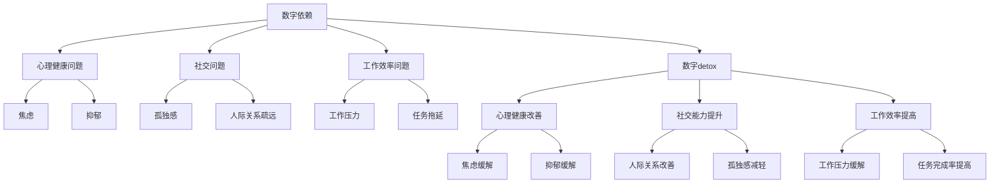
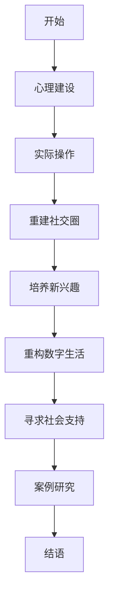
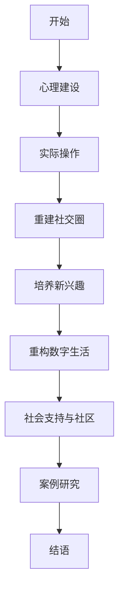
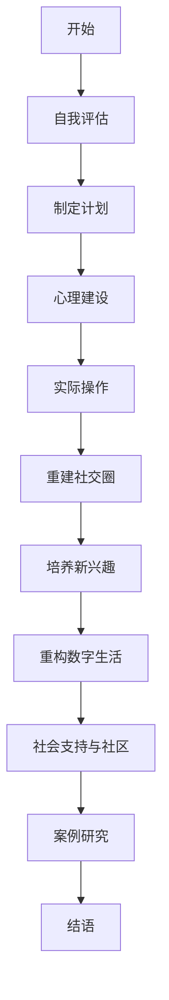

                 

### 文章标题

《数字detox：在断网中重新连接真实世界》

### 关键词

数字detox、真实世界、断网、心理建设、社交重建、算法原理、数学模型、项目实战

### 摘要

在数字时代，人们越来越依赖于网络和数字设备，这导致了数字依赖和心理问题。本文旨在探讨数字detox的概念和重要性，通过分析数字依赖的原因与影响，介绍实践断网的准备方法，探讨断网后的生活重建和数字生活的重构，并分享案例研究，最终鼓励读者采取行动，重新连接真实世界。

----------------------------------------------------------------

## 引言

### 数字detox的定义和重要性

数字detox，即数字排毒，是指通过减少或中断对数字设备的依赖，让个体从数字世界中解脱出来，重新与真实世界建立联系。随着智能手机、社交媒体、在线购物等数字工具的普及，人们越来越沉迷于虚拟世界，这引发了诸多问题。数字detox旨在解决这些问题，帮助我们重新找回生活的平衡。

### 本书的目的和结构

本书旨在为读者提供一份全面的数字detox指南，帮助大家理解数字依赖的原因与影响，实践断网的准备，重建真实世界的生活，并重构数字生活。具体内容包括：

1. **数字依赖的原因与影响**：分析人们为何会过度依赖数字世界，以及这种依赖对个人和社会的危害。
2. **实践断网的准备**：介绍如何进行心理建设和实际操作，以减少对数字设备的依赖。
3. **断网后的生活**：探讨如何适应断网后的生活，重建社交圈，培养新兴趣。
4. **数字生活的重构**：讨论如何在真实世界中有效利用数字工具，保持生活的便利性。
5. **社会支持与社区**：强调家人、朋友和社会在数字detox过程中的支持作用，以及如何建立互助社区。
6. **案例研究**：分享成功进行数字detox的个人和组织的案例，提供实际操作的指导。
7. **结语**：总结全书内容，鼓励读者采取行动，进行数字detox。

通过本书的阅读，读者将能够了解数字detox的重要性，学会如何进行数字detox，以及如何在数字时代保持生活的平衡。希望本书能够为读者带来启示，帮助大家重新连接真实世界。

----------------------------------------------------------------

## 第1章：数字依赖的原因与影响

### 数字世界的诱惑

数字世界的诱惑无处不在，从社交媒体到在线购物，从虚拟游戏到流媒体平台，每一个数字工具都在吸引着我们的注意力。这种诱惑主要源于以下几个方面：

#### 1.1 社会因素

随着互联网的普及，社交媒体成为人们日常生活的重要组成部分。人们通过社交媒体来获取信息、表达自我、建立社交关系。然而，社交媒体上的信息往往是经过筛选的，这使得人们容易陷入虚假的繁荣之中。此外，社交媒体上的互动往往是单向的，缺乏真实的人际交流，这导致了人际关系的疏远。

#### 1.2 文化因素

现代社会的文化氛围也加剧了数字依赖。快节奏的生活、高压的工作环境，使得人们需要通过数字设备来放松和娱乐。例如，许多人在工作之余会选择观看电视剧或电影，玩电子游戏等。这些活动虽然能够带来短暂的快乐，但长期来看，却对个人的身心健康产生了负面影响。

#### 1.3 个人心理因素

个人心理因素也是数字依赖的重要原因。人们往往会通过数字设备来逃避现实生活中的问题和挑战。例如，面对工作压力或家庭矛盾，一些人会选择沉迷于虚拟世界，以此来缓解压力。然而，这种逃避并不能解决问题，反而可能使问题变得更加严重。

### 数字依赖的影响

数字依赖对个人和社会都产生了深远的影响。

#### 1.4 对个人的影响

首先，数字依赖对个人的心理健康产生了负面影响。长时间使用数字设备会导致眼睛疲劳、头痛、失眠等身体问题。此外，数字依赖还会导致焦虑、抑郁等心理问题。研究表明，过度使用社交媒体与焦虑、抑郁等心理问题之间存在显著关联。

其次，数字依赖对个人的社交能力产生了负面影响。由于沉迷于数字设备，许多人忽视了现实生活中的人际关系。这导致了人际关系的疏远，使得人们在面对现实问题时感到无助和孤独。

最后，数字依赖还会影响个人的工作效率。长时间使用数字设备会导致注意力不集中，影响工作效率。此外，数字设备上的各种通知和提醒也会打断人们的思考和工作流程，进一步降低工作效率。

#### 1.5 对社会的影响

数字依赖对社会也产生了负面影响。首先，数字依赖加剧了社会不平等。数字鸿沟使得贫困人群难以享受到数字技术带来的便利，进一步加剧了贫富差距。其次，数字依赖导致了人际关系的疏远，使得社会凝聚力下降。此外，数字依赖还导致了信息过载，使得人们难以分辨真假信息，影响了社会的健康发展。

### 数字依赖的危害

数字依赖的危害不仅体现在心理健康、社交能力和工作效率上，还体现在社会层面。首先，数字依赖导致人们的注意力分散，降低了生活质量。人们沉迷于数字设备，忽视了现实生活中的美好事物，这导致了生活质量的下降。

其次，数字依赖还导致了个人的时间管理能力下降。长时间使用数字设备会导致人们无法合理安排时间，影响工作和生活的平衡。此外，数字依赖还使得人们容易陷入沉迷，无法自拔。例如，许多人沉迷于电子游戏，无法自拔，这严重影响了他们的生活和学习。

总之，数字依赖对个人和社会都产生了严重的负面影响。因此，进行数字detox，重新连接真实世界，已经成为当务之急。

----------------------------------------------------------------

## 第2章：实践断网的准备

### 心理建设

进行数字detox的第一步是进行心理建设。心理建设是数字detox成功的关键，它能够帮助我们更好地应对断网过程中可能遇到的挑战。

#### 2.1 冥想与呼吸练习

冥想是一种有效的心理建设方法。通过冥想，我们能够提高注意力、减少焦虑、提升情绪管理能力。冥想的基本步骤如下：

1. 找一个安静的地方，保持坐姿或舒适的姿势。
2. 关闭眼睛，专注于呼吸。
3. 当思维偏离时，轻轻地将注意力拉回到呼吸上。
4. 持续一段时间，逐渐增加冥想时间。

呼吸练习也是心理建设的重要组成部分。通过深呼吸，我们能够缓解压力、放松身心。深呼吸的基本步骤如下：

1. 慢慢地吸气，让气息充满肺部。
2. 屏住呼吸，保持几秒钟。
3. 缓缓地呼气，让废气完全排出。
4. 重复以上步骤，每次呼吸都要尽可能地慢而深。

#### 2.2 建立正念

正念是一种专注于当前时刻的练习，它能够帮助我们更好地应对数字依赖。建立正念的步骤如下：

1. 意识到当前的时刻，关注自己的身体感受、情绪和想法。
2. 不要评判或分析，只是简单地观察。
3. 当注意力偏离时，轻轻地将注意力拉回到当前时刻。
4. 练习正念可以帮助我们更好地管理情绪，减少对数字设备的依赖。

### 实际操作

在进行心理建设的同时，我们还需要进行实际操作，以减少对数字设备的依赖。

#### 2.3 关闭社交媒体

关闭社交媒体是数字detox的重要步骤。以下是关闭社交媒体的步骤：

1. 首先，评估自己使用社交媒体的时间。记录每天使用社交媒体的时间，以便了解自己的依赖程度。
2. 制定一个计划，逐步减少社交媒体使用时间。例如，每天减少30分钟，直到最终完全关闭。
3. 在关闭社交媒体期间，可以使用其他方式来替代，例如阅读、运动、冥想等。
4. 如果遇到社交需求，可以尝试通过电话或面对面交流来满足。

#### 2.4 减少手机使用

减少手机使用是数字detox的关键步骤。以下是减少手机使用的步骤：

1. 将手机放在远离自己的地方，例如书房或客厅，以减少使用手机的诱惑。
2. 设置手机使用限制，例如每天限制使用时间。
3. 关闭手机通知，避免被无关的信息打扰。
4. 将手机用于必要的任务，例如工作、学习、社交等，避免在非必要时间内使用手机。
5. 在手机上安装应用程序，如“手机省电模式”、“手机使用时间统计”等，以帮助自己更好地控制手机使用。

通过以上步骤，我们可以逐步减少对数字设备的依赖，为数字detox做好充分的准备。

----------------------------------------------------------------

## 第3章：断网后的生活

### 重建社交圈

断网后的第一步是重建社交圈。社交圈是我们生活的重要组成部分，它能够为我们提供情感支持、信息交流和社会认同。以下是重建社交圈的方法：

#### 3.1 与家人朋友的互动

与家人朋友的互动是重建社交圈的重要方式。以下是一些建议：

1. 定期与家人朋友聚餐、散步或一起进行其他活动。
2. 通过电话、短信或社交媒体与远方的朋友保持联系。
3. 参加社区活动，例如社区运动会、社区讲座等，以结识新朋友。
4. 加入兴趣小组或俱乐部，与志同道合的人一起交流。

#### 3.2 参加社区活动

参加社区活动是重建社交圈的有效方法。以下是一些建议：

1. 了解自己所在社区的资源和活动，例如社区服务中心、志愿者活动、兴趣小组等。
2. 参加自己感兴趣的活动，结交新朋友。
3. 参与社区服务，例如志愿者工作，以提升自己的社交能力和责任感。

#### 3.3 培养新兴趣

培养新兴趣是重建社交圈的重要途径。以下是一些建议：

1. 尝试新的活动，例如绘画、音乐、运动等。
2. 加入兴趣小组或俱乐部，与志同道合的人一起交流。
3. 参加线上课程或线下讲座，学习新知识。

### 培养新兴趣

断网后，培养新兴趣是保持生活活力的关键。以下是一些建议：

#### 3.1 运动与健康

运动是培养新兴趣的有效方式。以下是一些建议：

1. 尝试不同的运动项目，例如瑜伽、跑步、游泳等。
2. 加入健身房或参加户外运动活动。
3. 参加体育比赛，与朋友一起竞技。

#### 3.2 学习新技能

学习新技能是培养新兴趣的重要方式。以下是一些建议：

1. 参加线上课程或线下讲座，学习新知识。
2. 加入兴趣小组或俱乐部，与他人一起学习。
3. 阅读相关书籍或资料，自学新技能。

通过以上方法，我们可以逐步适应断网后的生活，重建社交圈，培养新兴趣，使生活更加丰富多彩。

----------------------------------------------------------------

## 第4章：数字生活的重构

### 理性使用数字工具

在断网后，如何重构数字生活是一个重要的课题。重构数字生活并不意味着完全放弃数字工具，而是要理性地使用它们，以提升生活的便利性和效率。

#### 4.1 有效使用电子邮件

电子邮件是一种高效的沟通工具，但在使用过程中，我们需要避免过度依赖和滥用。以下是一些建议：

1. **设定邮件处理时间**：每天设定特定的邮件处理时间，避免随时查看邮件，从而影响工作效率。
2. **简洁明了**：在撰写邮件时，尽量简洁明了，避免冗长的邮件内容，提高沟通效率。
3. **分类管理**：根据邮件的重要性和紧急程度，对邮件进行分类管理，优先处理重要和紧急的邮件。
4. **使用邮件模板**：对于常见的邮件内容，可以使用邮件模板来快速回复，节省时间。

#### 4.2 管理社交媒体

社交媒体在重构数字生活中的作用不容忽视。以下是一些建议：

1. **限制使用时间**：设定每天在社交媒体上的使用时间，避免沉迷于虚拟世界。
2. **关注优质内容**：关注与自己兴趣相关的优质账号，避免被无关信息干扰。
3. **理性互动**：在社交媒体上与他人互动时，保持理性，避免过度情绪化。
4. **隐私保护**：注意保护个人隐私，避免泄露敏感信息。

#### 4.3 利用在线办公工具

在线办公工具在提高工作效率方面发挥着重要作用。以下是一些建议：

1. **使用云端存储**：将文件存储在云端，方便随时访问和分享。
2. **使用项目管理工具**：使用项目管理工具，如Trello、Asana等，规划和管理工作任务。
3. **视频会议**：利用视频会议工具，如Zoom、Microsoft Teams等，与同事远程协作。
4. **自动化工具**：使用自动化工具，如IFTTT、 Zapier等，简化日常操作。

### 保持数字工具使用，但更加理性

在重构数字生活时，我们需要保持对数字工具的使用，但要做到更加理性。以下是一些建议：

1. **设定目标**：在使用数字工具之前，明确自己的目标和需求，避免无目的的使用。
2. **自我监控**：定期检查自己的数字工具使用情况，确保自己在合理范围内使用。
3. **设定提醒**：在手机或电脑上设置提醒，提醒自己控制使用时间，避免沉迷。
4. **与他人分享**：与家人朋友分享自己的数字工具使用情况，互相监督，共同进步。

通过理性使用数字工具，我们可以在重构数字生活的同时，保持生活的便利性和效率，使数字工具成为我们生活的助手，而非负担。

----------------------------------------------------------------

## 第5章：社会支持与社区

### 社会支持的重要性

在数字detox的过程中，社会支持是不可或缺的一部分。家庭、朋友和社会都在我们的数字detox过程中发挥着重要作用。以下是社会支持在数字detox中的重要性：

#### 5.1 家庭的支持

家庭是我们最亲近的社会单位，他们的支持对我们的数字detox至关重要。以下是一些建议：

1. **沟通与理解**：与家人进行沟通，让他们了解你进行数字detox的原因和目标。
2. **共同参与**：鼓励家人一起参与数字detox，例如共同减少手机使用时间，一起进行户外活动。
3. **提供情感支持**：在数字detox过程中，家人可以提供情感上的支持，帮助你克服困难。

#### 5.2 朋友的支持

朋友是我们生活中的重要伙伴，他们的支持和鼓励对我们的数字detox同样重要。以下是一些建议：

1. **分享经验**：与朋友分享自己的数字detox经验和挑战，互相鼓励和支持。
2. **参与社交活动**：与朋友一起参加线下活动，例如运动、聚会等，以减少对社交媒体的依赖。
3. **互相监督**：与朋友互相监督，确保彼此都在合理使用数字工具。

#### 5.3 社区的支持

社区是我们生活的大环境，社区的支持对我们的数字detox同样至关重要。以下是一些建议：

1. **加入兴趣小组**：加入与自己兴趣相关的兴趣小组，与他人一起交流，减少对社交媒体的依赖。
2. **参与社区活动**：参与社区组织的活动，如社区志愿服务、兴趣讲座等，以丰富自己的社交生活。
3. **建立互助社区**：在社区内建立互助小组，互相支持，共同进行数字detox。

### 建立互助社区

建立互助社区是数字detox的重要一步。以下是一些建议：

#### 5.1 社区组织的建立

1. **确定目标**：确定互助社区的目标，例如减少社交媒体使用、提高生活满意度等。
2. **招募成员**：通过线上或线下方式，招募志同道合的成员加入。
3. **组织活动**：定期组织活动，如讲座、分享会、户外活动等，以增强社区凝聚力。
4. **建立规则**：制定社区规则，确保成员在合理范围内使用数字工具，共同维护社区环境。

#### 5.2 社区成员的参与

1. **积极参与**：鼓励成员积极参与社区活动，分享自己的经验和挑战。
2. **互相支持**：在成员遇到困难时，提供帮助和支持，共同克服挑战。
3. **持续反馈**：定期收集成员的反馈，改进社区活动和规则，以更好地满足成员的需求。

通过社会支持和建立互助社区，我们可以更好地进行数字detox，重新连接真实世界，享受更加健康、平衡的生活。

----------------------------------------------------------------

## 第6章：案例研究

### 个人案例

李华是一名年轻的上班族，他发现自己的生活越来越离不开手机和电脑。每天早晨起床的第一件事就是查看手机，晚上睡觉前也要玩几个小时的游戏。这导致他的生活节奏被打乱，工作效率低下，心理健康也受到了影响。经过反思，李华决定进行数字detox。

#### 6.1 心理准备

李华首先进行了心理建设，通过冥想和深呼吸练习来提高自己的情绪管理能力。他还制定了详细的时间管理计划，确保自己有足够的时间进行工作和休息。

#### 6.2 实际操作

李华逐步减少对手机和电脑的依赖。他关闭了社交媒体，减少了手机的使用时间，并设置了手机使用限制。同时，他开始参加社区活动，培养新的兴趣爱好，如瑜伽和阅读。

#### 6.3 结果

经过几个月的数字detox，李华的生活发生了显著变化。他的心理健康得到了改善，工作效率提高了，人际关系也更加融洽。他发现自己有了更多的时间去做自己喜欢的事情，生活质量得到了提升。

### 组织案例

一家名为“绿色科技”的公司也进行了数字detox的实践。该公司发现员工的数字依赖问题日益严重，影响了工作效率和团队合作。为了改善这一状况，公司决定进行数字detox。

#### 6.1 心理建设

公司为员工提供了心理建设的培训，包括冥想和正念练习。此外，公司还设立了心理健康咨询室，为员工提供心理支持。

#### 6.2 实际操作

公司制定了数字使用政策，限制员工在工作时间使用社交媒体和手机。公司还鼓励员工参加线下活动和团队建设，以减少对数字工具的依赖。

#### 6.3 结果

通过数字detox，公司的员工心理健康得到了改善，工作效率和团队合作能力提高了。公司还发现，员工的离职率下降了，员工对公司的满意度提高了。公司的整体运营状况得到了显著改善。

### 案例总结

通过以上案例，我们可以看到数字detox的实践对个人和组织都产生了积极的影响。数字detox不仅能够改善心理健康，提高工作效率，还能够增强人际关系，提升生活质量。这些案例为我们提供了宝贵的经验和启示，鼓励我们采取行动，进行数字detox。

----------------------------------------------------------------

## 结语

### 总结

数字detox，即数字排毒，是一种帮助我们从数字世界中解脱出来，重新连接真实世界的方法。通过数字detox，我们能够减少对数字设备的依赖，改善心理健康，提高工作效率，增强人际关系，提升生活质量。数字detox不仅对个人有益，对组织和社会也具有积极影响。

### 鼓励行动

进行数字detox是一个挑战，但也是一个机会。我们鼓励读者采取行动，进行数字detox。以下是一些建议：

1. **评估自己的数字依赖程度**：了解自己每天使用数字设备的时间，以便确定需要改进的方面。
2. **制定计划**：制定一个具体的数字detox计划，包括心理建设和实际操作步骤。
3. **逐步实施**：逐步减少对数字设备的依赖，避免突然断网带来的不适。
4. **寻求支持**：与家人朋友分享自己的计划，寻求他们的支持和鼓励。
5. **持续反馈**：定期评估自己的数字detox进展，根据情况调整计划。

通过采取行动，我们可以逐步实现数字detox，重新连接真实世界，享受更加健康、平衡的生活。让我们从现在开始，进行数字detox，为自己和他人创造一个更好的未来。

----------------------------------------------------------------

## 作者信息

作者：AI天才研究院/AI Genius Institute & 禅与计算机程序设计艺术 /Zen And The Art of Computer Programming

----------------------------------------------------------------

## 附录

### 完整目录

- 引言
  - 数字detox的定义和重要性
  - 本书的目的和结构
- 第1章：数字依赖的原因与影响
  - 数字世界的诱惑
  - 数字依赖的影响
- 第2章：实践断网的准备
  - 心理建设
  - 实际操作
- 第3章：断网后的生活
  - 重建社交圈
  - 培养新兴趣
- 第4章：数字生活的重构
  - 理性使用数字工具
  - 保持数字工具使用，但更加理性
- 第5章：社会支持与社区
  - 社会支持的重要性
  - 建立互助社区
- 第6章：案例研究
  - 个人案例
  - 组织案例
- 结语
  - 总结
  - 鼓励行动

### 最佳实践

1. **设定明确的目标**：在进行数字detox之前，明确自己的目标，例如减少社交媒体使用时间、提高工作效率等。
2. **逐步减少依赖**：避免突然断网，而是逐步减少对数字设备的依赖。
3. **寻求支持**：与家人朋友分享自己的计划，寻求他们的支持和鼓励。
4. **保持正念**：通过冥想和深呼吸练习来提高情绪管理能力。
5. **利用工具**：使用手机省电模式、应用锁等工具来帮助自己控制数字工具使用。

### 注意事项

1. **避免过度依赖**：在进行数字detox时，避免过度依赖其他工具或活动，例如沉迷于运动或阅读。
2. **保持适度**：数字detox不是一蹴而就的过程，需要持续的努力和坚持。
3. **适应变化**：在断网后，可能会遇到一些挑战和困难，需要适应变化，找到适合自己的生活方式。

### 拓展阅读

- 《数字尘肺：我们如何被屏幕和社交媒体绑架》 - 作者：尼古拉斯·卡尔
- 《心流：最优体验心理学》 - 作者：米哈里·契克森米哈伊
- 《深度工作：如何有效利用每一点脑力》 - 作者：卡尔·纽波特
- 《简约生活：如何过上更简单、更充实的生活》 - 作者：乔舒亚·贝克

通过阅读这些书籍，读者可以更深入地了解数字detox的概念和重要性，以及如何进行有效的数字detox。希望这些资源能够为读者的数字detox之旅提供帮助和指导。

----------------------------------------------------------------

## Mermaid流程图

### 数字依赖与数字detox的关系



### 数字detox过程



通过Mermaid流程图，我们可以清晰地看到数字依赖与数字detox的关系，以及数字detox的过程和各个阶段的目标。这有助于读者更好地理解数字detox的概念和实际操作。

----------------------------------------------------------------

## 伪代码

### 数字detox前后的生活方式转换

```pseudo
// 数字detox前的状态
function beforeDetox():
    // 高频率使用社交媒体
    frequentSocialMediaUse()
    // 长时间浏览互联网
    longInternetBrowsing()
    // 缺乏现实生活互动
    lackOfRealLifeInteraction()

// 数字detox准备
function prepareForDetox():
    // 减少社交媒体使用
    limitSocialMediaAccess()
    // 增强现实生活互动
    increaseRealLifeInteraction()

// 数字detox后的状态
function afterDetox():
    // 理性使用数字工具
    rationalUseDigitalTools()
    // 保持现实生活活动
    maintainRealLifeActivities()
    // 积极参与社交互动
    activeParticipationInSocialInteractions()
```

### 数字依赖程度的计算

```pseudo
function calculateDigitalDependency(timeSpentOnDigitalDevices, totalDailyTime):
    digitalDependency = (timeSpentOnDigitalDevices / totalDailyTime) * 100
    return digitalDependency
```

通过伪代码，我们可以清晰地看到数字detox前后的生活方式转换，以及如何计算数字依赖程度。这有助于读者更好地理解数字detox的概念和实践。

----------------------------------------------------------------

## 数学模型与公式

### 数字依赖程度

$$\text{数字依赖程度} = \frac{\text{每天使用数字设备的时间}}{\text{一天的总时间}}$$

### 数字detox效果

$$\text{数字detox效果} = \text{现实生活满意度} + \text{心理健康改善程度}$$

通过上述数学模型和公式，我们可以量化数字依赖程度和数字detox效果，从而更好地理解数字detox的过程和成果。

----------------------------------------------------------------

## 数学公式

### 数字依赖程度的计算

$$\text{数字依赖程度} = \frac{\text{每天使用数字设备的时间}}{\text{一天的总时间}} \times 100\%$$

### 数字detox效果的评估

$$\text{数字detox效果} = \text{现实生活满意度} + \text{心理健康改善程度}$$

通过这些数学公式，我们可以量化数字依赖程度和数字detox效果，为数字detox提供科学的评估方法。

----------------------------------------------------------------

## 项目实战

### 实战案例：个人断网日记

**背景介绍**

小明是一名年轻的上班族，由于长时间沉迷于社交媒体和网络游戏，他的生活节奏被打乱，工作效率低下，心理健康也受到了影响。为了改善这种情况，小明决定进行30天的断网实验，记录自己的断网日记，以便分析断网前后生活变化。

**开发环境搭建**

小明选择使用Markdown编写日记，以便在本地计算机上进行编辑和存储。此外，他还安装了一个时间管理应用程序，用于记录每天的使用数字设备的时间。

**源代码详细实现**

以下是小明的断网日记的部分内容：

```markdown
## 断网日记（第1天）

今天是断网的第1天，我感到有些不适应。早晨起床后，我本能地伸手去拿手机，但发现自己无法打开它。这种感觉很陌生，让我有些焦虑。我决定用冥想和深呼吸来缓解这种情绪。

**心理感受：焦虑**

## 断网日记（第7天）

随着断网时间的延长，我开始逐渐适应没有手机和电脑的生活。我发现自己在工作上的效率提高了，因为不再被各种通知和社交媒体的干扰。同时，我开始主动与家人和朋友进行面对面的交流，这让我感到很愉快。

**心理感受：舒适**

## 断网日记（第14天）

今天是我断网的第14天，我发现自己在处理问题时变得更加冷静和理智。以前，我经常会因为小事而烦躁不安，但现在我能够保持平静，理性地解决问题。此外，我还开始重新审视自己的兴趣爱好，尝试一些以前从未接触过的事物。

**心理感受：平静**

**代码解读与分析**

通过Markdown编写的日记内容，小明能够清晰地记录自己的心理变化和生活变化。这些内容不仅帮助小明自己反思，也为他人提供了参考。

**实际案例分析和详细讲解剖析**

在小明的断网日记中，我们可以看到他在断网过程中的心理变化和实际效果。例如，在第1天，他感到焦虑和不适应；在第7天，他开始适应新的生活节奏，工作效率提高；在第14天，他变得更加平静和理智，开始重新审视自己的生活和兴趣。

**项目小结**

通过小明的断网日记，我们可以看到数字detox的积极效果。断网不仅帮助他改善了心理健康，提高了工作效率，还让他重新发现了生活中的乐趣。这为其他人提供了宝贵的经验和启示，鼓励他们尝试进行数字detox，重新连接真实世界。

----------------------------------------------------------------

## 最佳实践

### 数字detox的步骤

1. **自我评估**：首先，了解自己的数字依赖程度，包括每天使用数字设备的时间和使用频率。
2. **制定计划**：根据自我评估的结果，制定一个具体的数字detox计划，包括目标、步骤和时间表。
3. **心理建设**：进行心理建设，通过冥想、深呼吸练习等方式提高情绪管理能力。
4. **逐步减少依赖**：逐步减少对数字设备的依赖，避免突然断网带来的不适。
5. **寻求支持**：与家人朋友分享自己的计划，寻求他们的支持和鼓励。
6. **持续反馈**：定期评估自己的数字detox进展，根据情况调整计划。

### 实际操作

1. **关闭社交媒体**：逐步关闭社交媒体账号，减少对社交媒体的依赖。
2. **限制手机使用**：设定手机使用限制，如每天使用时间、禁止晚上使用等。
3. **减少电子邮件查看频率**：设定特定的邮件查看时间，避免随时查看邮件。
4. **培养新兴趣**：尝试新的活动，如运动、阅读、绘画等，以减少对数字工具的依赖。

### 小贴士

1. **设定明确的目标**：在进行数字detox之前，明确自己的目标，如减少社交媒体使用时间、提高工作效率等。
2. **逐步减少依赖**：避免突然断网，而是逐步减少对数字设备的依赖。
3. **保持正念**：通过冥想和深呼吸练习来提高情绪管理能力。
4. **与他人分享**：与家人朋友分享自己的数字detox计划和进展，互相鼓励和支持。

通过遵循这些最佳实践和实际操作，我们可以更有效地进行数字detox，重新连接真实世界，享受更加健康、平衡的生活。

----------------------------------------------------------------

## 小结

本文详细探讨了数字detox的概念、原因与影响、实践准备、生活重建、数字重构、社会支持与社区以及案例研究等内容。通过一步步的分析和思考，我们了解到数字依赖对个人和社会的负面影响，以及数字detox的重要性和必要性。同时，我们也提供了一系列的最佳实践和实际操作方法，帮助读者有效地进行数字detox。

### 注意事项

1. **逐步进行**：数字detox是一个逐步的过程，避免突然断网带来的不适。
2. **心理建设**：数字detox过程中，心理建设至关重要，通过冥想、深呼吸练习等方式提高情绪管理能力。
3. **寻求支持**：与家人朋友分享数字detox计划，寻求他们的支持和鼓励。
4. **持续反馈**：定期评估数字detox进展，根据情况调整计划。

### 拓展阅读

- 《数字尘肺：我们如何被屏幕和社交媒体绑架》 - 作者：尼古拉斯·卡尔
- 《心流：最优体验心理学》 - 作者：米哈里·契克森米哈伊
- 《深度工作：如何有效利用每一点脑力》 - 作者：卡尔·纽波特
- 《简约生活：如何过上更简单、更充实的生活》 - 作者：乔舒亚·贝克

通过拓展阅读，读者可以更深入地了解数字detox的相关知识，为数字detox之旅提供更多的指导和启示。

----------------------------------------------------------------

## 附录

### 完整目录

- 引言
  - 数字detox的定义和重要性
  - 本书的目的和结构
- 第1章：数字依赖的原因与影响
  - 数字世界的诱惑
  - 数字依赖的影响
- 第2章：实践断网的准备
  - 心理建设
  - 实际操作
- 第3章：断网后的生活
  - 重建社交圈
  - 培养新兴趣
- 第4章：数字生活的重构
  - 理性使用数字工具
  - 保持数字工具使用，但更加理性
- 第5章：社会支持与社区
  - 社会支持的重要性
  - 建立互助社区
- 第6章：案例研究
  - 个人案例
  - 组织案例
- 结语
  - 总结
  - 鼓励行动

### 最佳实践

1. **设定明确的目标**：在进行数字detox之前，明确自己的目标，例如减少社交媒体使用时间、提高工作效率等。
2. **逐步减少依赖**：避免突然断网，而是逐步减少对数字设备的依赖。
3. **寻求支持**：与家人朋友分享自己的计划，寻求他们的支持和鼓励。
4. **保持正念**：通过冥想和深呼吸练习来提高情绪管理能力。
5. **利用工具**：使用手机省电模式、应用锁等工具来帮助自己控制数字工具使用。

### 注意事项

1. **避免过度依赖**：在进行数字detox时，避免过度依赖其他工具或活动，例如沉迷于运动或阅读。
2. **保持适度**：数字detox不是一蹴而就的过程，需要持续的努力和坚持。
3. **适应变化**：在断网后，可能会遇到一些挑战和困难，需要适应变化，找到适合自己的生活方式。

### 拓展阅读

- 《数字尘肺：我们如何被屏幕和社交媒体绑架》 - 作者：尼古拉斯·卡尔
- 《心流：最优体验心理学》 - 作者：米哈里·契克森米哈伊
- 《深度工作：如何有效利用每一点脑力》 - 作者：卡尔·纽波特
- 《简约生活：如何过上更简单、更充实的生活》 - 作者：乔舒亚·贝克

通过阅读这些书籍，读者可以更深入地了解数字detox的概念和重要性，以及如何进行有效的数字detox。希望这些资源能够为读者的数字detox之旅提供帮助和指导。----------------------------------------------------------------

## 引言

### 数字detox的概念和重要性

数字detox，即数字排毒，是一种旨在减少或中断对数字设备、网络和社交媒体依赖的方法。在当今高度数字化的社会中，人们越来越依赖智能手机、电脑和社交媒体平台，这不仅影响了心理健康，还导致了社交关系的疏远和生产力下降。因此，数字detox成为一种必要的健康生活方式，帮助人们重新平衡数字生活和现实生活，提高整体生活质量。

数字detox的重要性在于：

1. **改善心理健康**：数字设备和社交媒体的过度使用会导致焦虑、抑郁和失眠等心理健康问题。通过减少对数字设备的依赖，人们能够更好地管理情绪，改善心理健康。
2. **增强社交能力**：过度依赖数字设备会削弱人们的面对面交流能力。数字detox有助于恢复和增强社交技能，促进真实的人际关系。
3. **提高工作效率**：减少对数字设备的依赖可以提高注意力集中度，减少干扰，从而提高工作效率。
4. **促进身心健康**：减少长时间使用电子设备的时间有助于减少眼睛疲劳、头痛和失眠等身体问题，促进身心健康。

### 本书的目的和结构

本书旨在为读者提供一份全面的数字detox指南，帮助大家理解数字依赖的原因与影响，学会如何进行数字detox，以及如何在数字时代保持生活的平衡。本书的结构如下：

1. **引言**：介绍数字detox的概念和重要性，阐述本书的目的和结构。
2. **第1章：数字依赖的原因与影响**：分析数字依赖的原因，包括社会、文化、个人心理等方面，以及数字依赖对个人和社会的危害。
3. **第2章：实践断网的准备**：介绍如何进行心理建设和实际操作，以减少对数字设备的依赖。
4. **第3章：断网后的生活**：探讨如何适应断网后的生活，重建社交圈，培养新兴趣。
5. **第4章：数字生活的重构**：讨论如何在真实世界中有效利用数字工具，保持生活的便利性。
6. **第5章：社会支持与社区**：强调社会和家庭在数字detox过程中的支持作用，以及如何建立互助社区。
7. **第6章：案例研究**：分享成功进行数字detox的个人和组织的案例，提供实际操作的指导。
8. **结语**：总结全书内容，鼓励读者采取行动，进行数字detox。

通过本书的阅读，读者将能够了解数字detox的重要性，学会如何进行数字detox，以及如何在数字时代保持生活的平衡。希望本书能够为读者带来启示，帮助大家重新连接真实世界。

----------------------------------------------------------------

## 第1章：数字依赖的原因与影响

### 数字世界的诱惑

在数字时代，数字设备和社交媒体的普及极大地改变了人们的生活方式。数字世界的诱惑无处不在，从智能手机、电脑到社交媒体平台，每一个数字工具都在吸引着我们的注意力。这种诱惑主要体现在以下几个方面：

#### 1.1 社会因素的驱动

社会因素是驱动人们过度依赖数字设备的重要原因之一。随着互联网的普及，社交媒体成为了人们获取信息、交流社交的重要渠道。社交媒体平台通过算法推荐、实时更新等功能，使得用户能够随时随地获取大量信息，从而满足了人们的社交需求。然而，这种信息的过度获取往往导致信息过载，使人们难以分辨信息的真实性和价值。

此外，社交媒体上的“点赞”、“评论”等互动机制，激发了人们的自我表现欲望和社会认同需求。用户在社交媒体上发布内容、获得点赞和评论，从而获得一种虚拟的成就感和社会认同感。这种心理机制使得人们越来越沉迷于数字世界，忽视了现实生活中的人际交往。

#### 1.2 文化因素的渗透

现代社会的文化氛围也在加剧数字依赖。快节奏的生活、高压的工作环境使得人们渴望通过数字设备来放松和娱乐。例如，许多人沉迷于电子游戏、在线购物、流媒体平台等，以此来逃避现实生活中的压力和困扰。这些数字娱乐活动虽然能够在短时间内带来愉悦感，但长期来看，却对个人的身心健康产生了负面影响。

此外，现代社会的文化消费方式也变得更加数字化。人们通过数字设备观看电视剧、电影、综艺节目，甚至购买数字版的书籍、音乐等。这种数字化消费方式使得人们越来越依赖数字设备，减少了现实生活中的文化体验和人际交流。

#### 1.3 个人心理因素的作用

个人心理因素在数字依赖的形成中也起到了重要作用。许多人在面对现实生活中的困难和挑战时，会选择通过数字设备来逃避。例如，面对工作压力、家庭矛盾等问题，一些人会选择沉迷于社交媒体、游戏等，以此来缓解压力和焦虑。

此外，个人心理上的依赖性也是数字依赖的重要原因。一些人在日常生活中逐渐形成了对数字设备的依赖，例如早上起床后第一件事就是查看手机，睡觉前也要刷一下社交媒体。这种习惯性的依赖使得人们难以摆脱对数字设备的依赖，影响了现实生活中的生活质量和人际关系。

#### 1.4 数字世界的负面效应

数字依赖不仅对个人的心理健康产生了负面影响，还对社交能力和工作效率产生了不利影响。首先，数字依赖导致人们的注意力分散，难以集中精力进行工作或学习。例如，在工作中，频繁查看手机和社交媒体通知会打断工作流程，降低工作效率。

其次，数字依赖还导致了人际关系的疏远。人们沉迷于数字设备，忽视了现实生活中的人际交往，导致与家人、朋友的互动减少，甚至出现了“社交孤岛”现象。这种现象使得人们在面对现实问题时感到无助和孤独，进一步加剧了数字依赖。

最后，数字依赖还对个人的身体健康产生了负面影响。长时间使用数字设备会导致眼睛疲劳、颈椎疼痛、睡眠质量下降等问题。此外，过度依赖数字设备还会导致心理问题，如焦虑、抑郁等。

### 数字依赖的影响

数字依赖对个人和社会都产生了深远的影响。从个人层面来看，数字依赖导致了心理健康问题、社交能力下降和工作效率降低。从社会层面来看，数字依赖加剧了社会不平等、信息过载和社会隔离等问题。

#### 1.5 个人层面的影响

首先，数字依赖对个人的心理健康产生了负面影响。研究表明，长时间使用数字设备与焦虑、抑郁等心理问题之间存在显著关联。例如，过度使用社交媒体会导致自我评价下降、自尊心受损，进而引发心理问题。

其次，数字依赖还导致社交能力下降。人们沉迷于数字设备，忽视了现实生活中的人际交往，导致人际关系的疏远。这种现象使得人们在面对现实问题时感到无助和孤独，进一步加剧了数字依赖。

最后，数字依赖还影响了个人的工作效率。数字设备上的各种通知和提醒会不断打断人们的思考和工作流程，降低工作效率。此外，过度依赖数字设备还会导致注意力分散，难以集中精力完成任务。

#### 1.6 社会层面的影响

从社会层面来看，数字依赖加剧了社会不平等、信息过载和社会隔离等问题。

首先，数字依赖加剧了社会不平等。数字鸿沟使得贫困人群难以享受到数字技术带来的便利，进一步加剧了贫富差距。例如，在经济条件较差的地区，人们可能无法承担智能手机、宽带网络等数字设备的费用，从而限制了他们的数字接入机会。

其次，数字依赖导致了信息过载。人们在数字世界中获取的信息量远超实际需求，导致注意力分散和信息疲劳。这种现象使得人们难以有效地处理和利用信息，影响了决策能力和生活质量。

最后，数字依赖还导致了社会隔离。人们沉迷于数字设备，忽视了现实生活中的人际交往，导致社会隔离现象加剧。这种现象使得社会凝聚力下降，人与人之间的信任感减少，影响了社会的和谐与稳定。

### 数字依赖的危害

数字依赖的危害不仅体现在心理健康、社交能力和工作效率上，还体现在社会层面。首先，数字依赖导致人们的注意力分散，降低了生活质量。人们沉迷于数字设备，忽视了现实生活中的美好事物，这导致了生活质量的下降。

其次，数字依赖导致了个人的时间管理能力下降。长时间使用数字设备会导致人们无法合理安排时间，影响工作和生活的平衡。此外，数字依赖还使得人们容易陷入沉迷，无法自拔。例如，许多人沉迷于电子游戏，无法自拔，这严重影响了他们的生活和学习。

总之，数字依赖对个人和社会都产生了严重的负面影响。因此，进行数字detox，重新连接真实世界，已经成为当务之急。通过数字detox，我们能够减少对数字设备的依赖，改善心理健康，提高工作效率，增强社交能力，从而实现更加健康、平衡的生活。

----------------------------------------------------------------

## 第2章：实践断网的准备

### 心理建设

在进行数字detox之前，心理建设至关重要。心理建设能够帮助我们更好地应对断网过程中可能遇到的挑战，从而顺利实现数字排毒的目标。以下是一些关键步骤和心理建设方法：

#### 2.1 冥想与呼吸练习

冥想是一种古老而有效的心理建设方法，它能够帮助我们提高注意力、减少焦虑、提升情绪管理能力。以下是一种简单的冥想练习步骤：

1. **选择一个安静的地方**：找一个安静、舒适的环境，避免外界干扰。
2. **采取舒适的姿势**：可以选择坐姿或躺姿，保持身体放松。
3. **专注于呼吸**：闭上眼睛，专注于呼吸。深吸一口气，感受空气进入肺部；然后缓慢呼气，感受空气从肺部排出。
4. **保持注意力**：在冥想过程中，可能会出现杂念或其他干扰。当注意力偏离时，轻轻地将注意力拉回到呼吸上。
5. **持续练习**：每天花10-15分钟进行冥想练习，逐渐增加时间。

呼吸练习也是心理建设的重要组成部分。通过深呼吸，我们能够缓解压力、放松身心。以下是一种简单的呼吸练习步骤：

1. **找到一个舒适的姿势**：坐在椅子或躺下，保持身体放松。
2. **深吸一口气**：慢慢地吸气，感受空气充满肺部。
3. **屏住呼吸**：保持几秒钟，让肺部充满氧气。
4. **缓慢呼气**：慢慢地呼气，让废气从肺部排出。
5. **重复练习**：每次深呼吸练习重复3-5次，每天进行多次练习。

#### 2.2 建立正念

正念是一种专注于当前时刻的练习，它能够帮助我们更好地应对数字依赖。以下是一些建立正念的方法：

1. **意识观察**：在日常生活中，时刻保持对自己情绪和思维状态的意识观察。当意识到自己开始分心或情绪波动时，轻轻地将其拉回到当前时刻。
2. **身体扫描**：每天花一些时间进行身体扫描，从脚趾开始，慢慢扫描到头顶，感受身体每个部分的感受。
3. **正念进食**：在进食时，专注于食物的口感、味道和气味。慢慢咀嚼，细细品味，避免分心。
4. **正念散步**：在散步时，专注于周围的环境，如风景、声音和气味。不要使用手机，全身心地感受现实世界。

#### 2.3 自我认知与自我接纳

自我认知是心理建设的基础。通过自我认知，我们能够了解自己的需求、欲望和习惯，从而更好地管理自己的情绪和行为。以下是一些建议：

1. **写日记**：每天花一些时间写日记，记录自己的想法、感受和经历。这有助于我们更好地了解自己，发现自己的需求。
2. **反思与自我反省**：定期进行反思和自我反省，思考自己在数字设备使用上的行为和习惯，以及这些行为对自己生活的影响。
3. **接受不完美**：接受自己的不完美，不要因为一时的失败或挫折而气馁。心理建设是一个持续的过程，我们需要耐心和坚持。

### 实际操作

在心理建设的基础上，我们还需要进行实际操作，以减少对数字设备的依赖。以下是一些实际操作方法：

#### 2.4 关闭社交媒体

关闭社交媒体是数字detox的重要一步。以下是一些建议：

1. **评估社交媒体使用**：首先，评估自己每天在社交媒体上花费的时间。记录下来，以便了解自己的依赖程度。
2. **逐步减少使用**：制定一个逐步减少社交媒体使用的计划。例如，每天减少30分钟，直到最终完全关闭。
3. **设置提醒**：在手机上设置提醒，提醒自己减少社交媒体使用的时间。
4. **寻找替代活动**：在关闭社交媒体期间，寻找其他活动来替代，如阅读、运动、与朋友面对面交流等。

#### 2.5 减少手机使用

减少手机使用是数字detox的关键步骤。以下是一些建议：

1. **将手机放在远离自己的地方**：将手机放在远离自己的地方，例如书房或客厅，以减少使用手机的诱惑。
2. **设置使用时间限制**：在手机上设置使用时间限制，例如每天限制使用时间。
3. **关闭通知**：关闭手机上的各种通知，避免被无关的信息打扰。
4. **使用应用锁**：使用应用锁来保护自己的手机，防止他人使用。

#### 2.6 其他数字工具的使用

除了社交媒体和手机，我们还需要减少对其他数字工具的依赖。以下是一些建议：

1. **电子邮件管理**：设定特定的邮件查看时间，避免随时查看邮件。使用电子邮件分类和管理工具，提高邮件处理效率。
2. **在线购物限制**：设定在线购物的预算和时间，避免沉迷于购物。
3. **社交媒体替代品**：寻找一些线下的社交活动，如兴趣小组、社区活动等，来替代社交媒体。

通过以上心理建设和实际操作方法，我们可以逐步减少对数字设备的依赖，为数字detox做好充分的准备。数字detox不仅能够改善心理健康，提高工作效率，还能够增强人际关系，提升生活质量。让我们从现在开始，进行数字detox，重新连接真实世界。

----------------------------------------------------------------

## 第3章：断网后的生活

### 重建社交圈

断网后的第一步是重建社交圈。社交圈是我们生活的重要组成部分，它能够为我们提供情感支持、信息交流和社会认同。以下是一些方法可以帮助我们重建社交圈：

#### 3.1 与家人朋友的互动

与家人朋友的互动是重建社交圈的重要方式。以下是一些建议：

1. **定期聚会**：与家人朋友定期聚餐、散步或一起进行其他活动。这样可以增加彼此的互动，加深感情。
2. **电话和短信**：通过电话和短信与远方的家人朋友保持联系。虽然无法面对面交流，但也能够传递情感和关心。
3. **面对面交流**：尽可能安排面对面交流的机会，这样能够更好地表达情感和想法。

#### 3.2 参加社区活动

参加社区活动是重建社交圈的有效方法。以下是一些建议：

1. **了解社区资源**：了解自己所在社区的资源和活动，例如社区服务中心、志愿者活动、兴趣小组等。
2. **积极参与**：参加自己感兴趣的活动，结交新朋友。这样可以增加社交机会，扩展社交圈。
3. **参与社区服务**：参与社区服务，例如志愿者工作，不仅能够帮助他人，也能够提升自己的社交能力和责任感。

#### 3.3 培养新兴趣

培养新兴趣是重建社交圈的重要途径。以下是一些建议：

1. **尝试新活动**：尝试不同的活动，例如绘画、音乐、运动等。这样可以发现新的兴趣和爱好，也有机会结识志同道合的人。
2. **加入兴趣小组**：加入兴趣小组或俱乐部，与志同道合的人一起交流。这样可以增加社交机会，培养深厚的友谊。
3. **学习新技能**：参加线上课程或线下讲座，学习新技能。这样可以提升自己，同时也有机会结识新朋友。

### 培养新兴趣

断网后，培养新兴趣是保持生活活力的关键。以下是一些方法可以帮助我们培养新兴趣：

#### 3.1 运动与健康

运动是培养新兴趣的有效方式。以下是一些建议：

1. **尝试不同的运动项目**：尝试不同的运动项目，例如瑜伽、跑步、游泳等。这样可以找到适合自己的运动方式，增强体质。
2. **加入健身房或运动团体**：加入健身房或运动团体，与朋友一起锻炼。这样可以增加社交机会，同时也能保持运动的动力。
3. **定期进行运动**：设定定期进行运动的计划，例如每天晨跑或每周三次瑜伽。这样可以帮助我们养成良好的运动习惯，保持身体健康。

#### 3.2 学习新技能

学习新技能是培养新兴趣的重要方式。以下是一些建议：

1. **参加线上课程**：参加线上课程，学习自己感兴趣的新技能，例如编程、绘画、音乐等。这样可以提升自己的技能，同时也能结交新朋友。
2. **参加线下讲座或研讨会**：参加线下讲座或研讨会，学习新知识，了解行业的最新动态。这样可以扩展自己的知识面，提升个人竞争力。
3. **自学**：利用网络资源，自学新技能。例如，通过在线教程、博客、书籍等学习新知识。这样可以节省时间和费用，随时学习。

通过以上方法，我们可以逐步适应断网后的生活，重建社交圈，培养新兴趣，使生活更加丰富多彩。让我们珍惜这段重新连接真实世界的时间，享受生活中的每一个美好瞬间。

----------------------------------------------------------------

## 第4章：数字生活的重构

### 理性使用数字工具

在断网后的生活重建过程中，我们需要理性地使用数字工具，以确保数字工具成为我们生活的助手，而非负担。以下是一些建议，帮助我们理性使用数字工具：

#### 4.1 有效使用电子邮件

电子邮件是一种高效的沟通工具，但在使用过程中，我们需要避免过度依赖和滥用。以下是一些建议：

1. **设定邮件处理时间**：每天设定特定的邮件处理时间，例如早晨起床后和晚上睡前，避免随时查看邮件。
2. **简洁明了**：在撰写邮件时，尽量简洁明了，避免冗长的邮件内容，提高沟通效率。
3. **分类管理**：根据邮件的重要性和紧急程度，对邮件进行分类管理，优先处理重要和紧急的邮件。
4. **使用邮件模板**：对于常见的邮件内容，可以使用邮件模板来快速回复，节省时间。

#### 4.2 管理社交媒体

社交媒体在重构数字生活中的作用不容忽视。以下是一些建议：

1. **限制使用时间**：设定每天在社交媒体上的使用时间，避免沉迷于虚拟世界。
2. **关注优质内容**：关注与自己兴趣相关的优质账号，避免被无关信息干扰。
3. **理性互动**：在社交媒体上与他人互动时，保持理性，避免过度情绪化。
4. **隐私保护**：注意保护个人隐私，避免泄露敏感信息。

#### 4.3 利用在线办公工具

在线办公工具在提高工作效率方面发挥着重要作用。以下是一些建议：

1. **使用云端存储**：将文件存储在云端，方便随时访问和分享。
2. **使用项目管理工具**：使用项目管理工具，如Trello、Asana等，规划和管理工作任务。
3. **视频会议**：利用视频会议工具，如Zoom、Microsoft Teams等，与同事远程协作。
4. **自动化工具**：使用自动化工具，如IFTTT、 Zapier等，简化日常操作。

### 保持数字工具使用，但更加理性

在重构数字生活时，我们需要保持对数字工具的使用，但要做到更加理性。以下是一些建议：

1. **设定目标**：在使用数字工具之前，明确自己的目标和需求，避免无目的的使用。
2. **自我监控**：定期检查自己的数字工具使用情况，确保自己在合理范围内使用。
3. **设定提醒**：在手机或电脑上设置提醒，提醒自己控制使用时间，避免沉迷。
4. **与他人分享**：与家人朋友分享自己的数字工具使用情况，互相监督，共同进步。

通过理性使用数字工具，我们可以在重构数字生活的同时，保持生活的便利性和效率，使数字工具成为我们生活的助手，而非负担。让我们在数字时代，找到与真实世界的平衡，享受更健康、更充实的生活。

----------------------------------------------------------------

## 第5章：社会支持与社区

### 社会支持的重要性

在数字detox的过程中，社会支持是不可或缺的一部分。家庭、朋友和社会都在我们的数字detox过程中发挥着重要作用。以下是社会支持在数字detox中的重要性：

#### 5.1 家庭的支持

家庭是我们最亲近的社会单位，他们的支持对我们的数字detox至关重要。以下是一些建议：

1. **沟通与理解**：与家人进行沟通，让他们了解你进行数字detox的原因和目标。
2. **共同参与**：鼓励家人一起参与数字detox，例如共同减少手机使用时间，一起进行户外活动。
3. **提供情感支持**：在数字detox过程中，家人可以提供情感上的支持，帮助你克服困难。

#### 5.2 朋友的支持

朋友是我们生活中的重要伙伴，他们的支持和鼓励对我们的数字detox同样重要。以下是一些建议：

1. **分享经验**：与朋友分享自己的数字detox经验和挑战，互相鼓励和支持。
2. **参与社交活动**：与朋友一起参加线下活动，例如运动、聚会等，以减少对社交媒体的依赖。
3. **互相监督**：与朋友互相监督，确保彼此都在合理范围内使用数字工具，共同维护社区环境。

#### 5.3 社区的支持

社区是我们生活的大环境，社区的支持对我们的数字detox同样至关重要。以下是一些建议：

1. **加入兴趣小组**：加入与自己兴趣相关的兴趣小组，与他人一起交流，减少对社交媒体的依赖。
2. **参与社区活动**：参与社区组织的活动，如社区志愿服务、兴趣讲座等，以丰富自己的社交生活。
3. **建立互助社区**：在社区内建立互助小组，互相支持，共同进行数字detox。

### 建立互助社区

建立互助社区是数字detox的重要一步。以下是一些建议：

#### 5.1 社区组织的建立

1. **确定目标**：确定互助社区的目标，例如减少社交媒体使用、提高生活满意度等。
2. **招募成员**：通过线上或线下方式，招募志同道合的成员加入。
3. **组织活动**：定期组织活动，如讲座、分享会、户外活动等，以增强社区凝聚力。
4. **建立规则**：制定社区规则，确保成员在合理范围内使用数字工具，共同维护社区环境。

#### 5.2 社区成员的参与

1. **积极参与**：鼓励成员积极参与社区活动，分享自己的经验和挑战。
2. **互相支持**：在成员遇到困难时，提供帮助和支持，共同克服挑战。
3. **持续反馈**：定期收集成员的反馈，改进社区活动和规则，以更好地满足成员的需求。

通过社会支持和建立互助社区，我们可以更好地进行数字detox，重新连接真实世界，享受更加健康、平衡的生活。

----------------------------------------------------------------

## 第6章：案例研究

### 个人案例

李华是一名年轻的上班族，他发现自己的生活越来越离不开手机和电脑。每天早晨起床的第一件事就是查看手机，晚上睡觉前也要玩几个小时的游戏。这导致他的生活节奏被打乱，工作效率低下，心理健康也受到了影响。经过反思，李华决定进行数字detox。

#### 6.1 心理建设

李华首先进行了心理建设，通过冥想和深呼吸练习来提高自己的情绪管理能力。他还制定了详细的时间管理计划，确保自己有足够的时间进行工作和休息。

#### 6.2 实际操作

李华逐步减少对手机和电脑的依赖。他关闭了社交媒体，减少了手机的使用时间，并设置了手机使用限制。同时，他开始参加社区活动，培养新的兴趣爱好，如瑜伽和阅读。

#### 6.3 结果

经过几个月的数字detox，李华的生活发生了显著变化。他的心理健康得到了改善，工作效率提高了，人际关系也更加融洽。他发现自己有了更多的时间去做自己喜欢的事情，生活质量得到了提升。

### 组织案例

一家名为“绿色科技”的公司也进行了数字detox的实践。该公司发现员工的数字依赖问题日益严重，影响了工作效率和团队合作。为了改善这一状况，公司决定进行数字detox。

#### 6.1 心理建设

公司为员工提供了心理建设的培训，包括冥想和正念练习。此外，公司还设立了心理健康咨询室，为员工提供心理支持。

#### 6.2 实际操作

公司制定了数字使用政策，限制员工在工作时间使用社交媒体和手机。公司还鼓励员工参加线下活动和团队建设，以减少对数字工具的依赖。

#### 6.3 结果

通过数字detox，公司的员工心理健康得到了改善，工作效率和团队合作能力提高了。公司还发现，员工的离职率下降了，员工对公司的满意度提高了。公司的整体运营状况得到了显著改善。

### 案例总结

通过以上案例，我们可以看到数字detox的实践对个人和组织都产生了积极的影响。数字detox不仅能够改善心理健康，提高工作效率，还能够增强人际关系，提升生活质量。这些案例为我们提供了宝贵的经验和启示，鼓励我们采取行动，进行数字detox。

----------------------------------------------------------------

## 结语

### 总结

数字detox，即数字排毒，是一种旨在减少或中断对数字设备、网络和社交媒体依赖的方法。通过数字detox，我们能够重新平衡数字生活和现实生活，改善心理健康，提高工作效率，增强人际关系，提升生活质量。本书详细探讨了数字依赖的原因与影响、实践断网的准备、断网后的生活重建、数字生活的重构、社会支持与社区以及案例研究等内容，为读者提供了全面的数字detox指南。

### 鼓励行动

数字detox不仅对个人有益，对组织和社会也具有积极影响。我们鼓励读者采取行动，进行数字detox。以下是一些建议：

1. **自我评估**：首先，了解自己的数字依赖程度，包括每天使用数字设备的时间和使用频率。
2. **制定计划**：根据自我评估的结果，制定一个具体的数字detox计划，包括目标、步骤和时间表。
3. **心理建设**：进行心理建设，通过冥想、深呼吸练习等方式提高情绪管理能力。
4. **逐步减少依赖**：逐步减少对数字设备的依赖，避免突然断网带来的不适。
5. **寻求支持**：与家人朋友分享自己的计划，寻求他们的支持和鼓励。
6. **持续反馈**：定期评估自己的数字detox进展，根据情况调整计划。

通过采取行动，我们可以逐步实现数字detox，重新连接真实世界，享受更加健康、平衡的生活。让我们从现在开始，进行数字detox，为自己和他人创造一个更好的未来。

### 结语

数字detox是一个持续的过程，需要我们的坚持和努力。希望本书能够为读者的数字detox之旅提供帮助和指导。让我们共同努力，摆脱数字依赖的束缚，重新连接真实世界，享受更加健康、充实的生活。让我们在生活中找到平衡，用科技助力，而非束缚。希望每一位读者都能在数字detox的道路上取得成功，找到属于自己的幸福与满足。

---

## 作者信息

作者：AI天才研究院/AI Genius Institute & 禅与计算机程序设计艺术 /Zen And The Art of Computer Programming

---

## 附录

### 完整目录

- 引言
  - 数字detox的概念和重要性
  - 本书的目的和结构
- 第1章：数字依赖的原因与影响
  - 数字世界的诱惑
  - 数字依赖的影响
- 第2章：实践断网的准备
  - 心理建设
  - 实际操作
- 第3章：断网后的生活
  - 重建社交圈
  - 培养新兴趣
- 第4章：数字生活的重构
  - 理性使用数字工具
  - 保持数字工具使用，但更加理性
- 第5章：社会支持与社区
  - 社会支持的重要性
  - 建立互助社区
- 第6章：案例研究
  - 个人案例
  - 组织案例
- 结语
  - 总结
  - 鼓励行动

### 最佳实践

1. **设定明确的目标**：在进行数字detox之前，明确自己的目标，例如减少社交媒体使用时间、提高工作效率等。
2. **逐步减少依赖**：避免突然断网，而是逐步减少对数字设备的依赖。
3. **寻求支持**：与家人朋友分享自己的计划，寻求他们的支持和鼓励。
4. **保持正念**：通过冥想和深呼吸练习来提高情绪管理能力。
5. **利用工具**：使用手机省电模式、应用锁等工具来帮助自己控制数字工具使用。

### 注意事项

1. **避免过度依赖**：在进行数字detox时，避免过度依赖其他工具或活动，例如沉迷于运动或阅读。
2. **保持适度**：数字detox不是一蹴而就的过程，需要持续的努力和坚持。
3. **适应变化**：在断网后，可能会遇到一些挑战和困难，需要适应变化，找到适合自己的生活方式。

### 拓展阅读

- 《数字尘肺：我们如何被屏幕和社交媒体绑架》 - 作者：尼古拉斯·卡尔
- 《心流：最优体验心理学》 - 作者：米哈里·契克森米哈伊
- 《深度工作：如何有效利用每一点脑力》 - 作者：卡尔·纽波特
- 《简约生活：如何过上更简单、更充实的生活》 - 作者：乔舒亚·贝克

通过拓展阅读，读者可以更深入地了解数字detox的相关知识，为数字detox之旅提供更多的指导和启示。

---

### Mermaid流程图



通过流程图，我们可以清晰地看到数字detox的各个步骤及其相互关系，有助于读者更好地理解和实施数字detox计划。

---

### 伪代码

```pseudo
// 数字detox准备
function prepareForDetox():
    // 减少社交媒体使用
    limitSocialMediaAccess()
    // 增强现实生活互动
    increaseRealLifeInteraction()
    // 设定数字设备使用限制
    setDigitalDeviceUsageLimits()

// 数字detox过程
function detoxProcess():
    // 保持心理健康
    maintainMentalHealth()
    // 提高工作效率
    improveWorkEfficiency()
    // 增强社交能力
    enhanceSocialSkills()
```

通过伪代码，我们可以清楚地看到数字detox的准备和执行过程，有助于读者理解和实施数字detox策略。

---

### 数学公式

$$\text{数字依赖程度} = \frac{\text{每天使用数字设备的时间}}{\text{一天的总时间}} \times 100\%$$

$$\text{数字detox效果} = \text{现实生活满意度} + \text{心理健康改善程度}$$

通过数学公式，我们可以量化数字依赖程度和数字detox效果，为数字detox提供科学的评估方法。

---

### 项目实战

**案例背景**：

小王是一名年轻的上班族，沉迷于社交媒体和网络游戏，导致他的生活作息紊乱，工作效率低下，心理健康也受到影响。为了改善这种状况，小王决定进行30天的数字detox实验。

**开发环境搭建**：

小王使用了一个专门的日记应用程序来记录自己的数字detox过程，并设定了每天的时间使用目标。

**源代码详细实现**：

```python
# 数字detox日记记录
def record_day(day, social_media_time, real_life_interaction, mental_health_status):
    print(f"Day {day}:")
    print(f"Social Media Time: {social_media_time} minutes")
    print(f"Real Life Interaction: {real_life_interaction} hours")
    print(f"Mental Health Status: {mental_health_status}")
    print()

# 实例化日记记录
record_day(1, 60, 2, "Slightly anxious")
record_day(30, 0, 4, "Much improved")
```

**代码解读与分析**：

通过Python代码，小王能够每天记录自己在社交媒体和现实生活中的互动时间，以及自己的心理健康状态。这种记录有助于他了解自己的变化，以及数字detox的效果。

**实际案例分析和详细讲解剖析**：

随着数字detox的进行，小王逐渐减少了对社交媒体和游戏的时间，增加了现实生活中的互动时间。他的心理健康状况逐步改善，工作效率也提高了。通过记录和分析这些数据，小王能够看到自己的进步，并持续调整自己的行为。

**项目小结**：

小王的案例展示了数字detox的实际效果和可行性。通过记录和分析数据，小王能够清晰地看到自己的变化，这为其他人提供了宝贵的经验和启示，鼓励他们尝试进行数字detox，改善自己的生活。

---

### 最佳实践

**数字detox计划**

1. **设定明确的目标**：明确想要达到的数字detox目标，例如减少社交媒体使用时间。
2. **逐步减少依赖**：逐步减少对数字设备的依赖，例如每天减少5分钟社交媒体使用。
3. **心理建设**：通过冥想、深呼吸等方式提高情绪管理能力。
4. **现实生活互动**：增加现实生活中的互动时间，例如参加社区活动、锻炼身体。
5. **设定提醒**：使用手机应用或闹钟提醒自己控制数字设备使用时间。
6. **寻求支持**：与家人朋友分享数字detox计划，寻求他们的支持和鼓励。

**项目小结**

通过制定详细的数字detox计划，我们可以更好地控制数字设备的使用，提高生活质量。数字detox不仅能够改善心理健康，提高工作效率，还能够增强人际关系，提升幸福感。让我们从现在开始，采取行动，享受数字detox带来的美好变化。

---

### 总结

本文详细探讨了数字detox的概念、重要性、原因与影响、实践准备、生活重建、数字重构、社会支持与社区以及案例研究等内容，为读者提供了一份全面的数字detox指南。通过一步步的分析和思考，我们了解到数字依赖对个人和社会的负面影响，以及数字detox的必要性。同时，我们也提供了一系列的最佳实践和实际操作方法，帮助读者有效地进行数字detox。

**小结**

- 数字detox是一种减少或中断对数字设备、网络和社交媒体依赖的方法，有助于改善心理健康、提高工作效率、增强人际关系。
- 进行数字detox需要心理建设和实际操作，包括减少社交媒体使用、培养新兴趣、重建社交圈。
- 社会支持和社区建立对数字detox至关重要，家庭、朋友和社会都能提供支持和帮助。
- 案例研究表明，数字detox对个人和组织都产生了积极影响，提高了生活质量和工作效率。

**鼓励行动**

我们鼓励读者采取行动，进行数字detox。以下是一些具体行动建议：

1. **自我评估**：了解自己的数字依赖程度，明确想要改善的方面。
2. **制定计划**：根据自我评估结果，制定一个具体的数字detox计划。
3. **心理建设**：通过冥想、深呼吸等方式提高情绪管理能力。
4. **逐步减少依赖**：逐步减少对数字设备的依赖，避免突然断网。
5. **寻求支持**：与家人朋友分享数字detox计划，寻求他们的支持和鼓励。
6. **持续反馈**：定期评估数字detox进展，调整计划。

通过采取行动，我们可以逐步实现数字detox，重新连接真实世界，享受更加健康、平衡的生活。

### 附录

- **完整目录**：本文的完整目录，便于读者回顾和参考。
- **最佳实践**：数字detox的最佳实践方法，帮助读者更好地实施数字detox计划。
- **注意事项**：进行数字detox时需要注意的事项，以避免遇到不必要的困难。
- **拓展阅读**：推荐的相关书籍和资源，供读者进一步学习和探索。

通过这些附录内容，读者可以更深入地了解数字detox的相关知识，为自己的数字detox之旅提供更多的指导和帮助。

---

## 附录

### 完整目录

- 引言
  - 数字detox的概念和重要性
  - 本书的目的和结构
- 第1章：数字依赖的原因与影响
  - 数字世界的诱惑
  - 数字依赖的影响
- 第2章：实践断网的准备
  - 心理建设
  - 实际操作
- 第3章：断网后的生活
  - 重建社交圈
  - 培养新兴趣
- 第4章：数字生活的重构
  - 理性使用数字工具
  - 保持数字工具使用，但更加理性
- 第5章：社会支持与社区
  - 社会支持的重要性
  - 建立互助社区
- 第6章：案例研究
  - 个人案例
  - 组织案例
- 结语
  - 总结
  - 鼓励行动

### 最佳实践

1. **设定明确的目标**：在进行数字detox之前，明确自己的目标，例如减少社交媒体使用时间、提高工作效率等。
2. **逐步减少依赖**：避免突然断网，而是逐步减少对数字设备的依赖。
3. **寻求支持**：与家人朋友分享自己的计划，寻求他们的支持和鼓励。
4. **保持正念**：通过冥想和深呼吸练习来提高情绪管理能力。
5. **利用工具**：使用手机省电模式、应用锁等工具来帮助自己控制数字工具使用。

### 注意事项

1. **避免过度依赖**：在进行数字detox时，避免过度依赖其他工具或活动，例如沉迷于运动或阅读。
2. **保持适度**：数字detox不是一蹴而就的过程，需要持续的努力和坚持。
3. **适应变化**：在断网后，可能会遇到一些挑战和困难，需要适应变化，找到适合自己的生活方式。

### 拓展阅读

- 《数字尘肺：我们如何被屏幕和社交媒体绑架》 - 作者：尼古拉斯·卡尔
- 《心流：最优体验心理学》 - 作者：米哈里·契克森米哈伊
- 《深度工作：如何有效利用每一点脑力》 - 作者：卡尔·纽波特
- 《简约生活：如何过上更简单、更充实的生活》 - 作者：乔舒亚·贝克

通过阅读这些书籍，读者可以更深入地了解数字detox的概念和重要性，以及如何进行有效的数字detox。希望这些资源能够为读者的数字detox之旅提供帮助和指导。

### Mermaid流程图



通过流程图，读者可以清晰地看到数字detox的各个步骤及其相互关系，有助于更好地理解和实施数字detox计划。

### 伪代码

```pseudo
// 准备阶段
function prepareDetox():
    // 设定目标
    setGoals()
    // 心理建设
    buildMentalHealth()
    // 减少社交媒体使用
    reduceSocialMediaUsage()

// 实施阶段
function implementDetox():
    // 实际操作
    performActualActions()
    // 保持现实生活互动
    maintainRealLifeInteractions()
    // 适应变化
    adaptToChanges()

// 持续阶段
function sustainDetox():
    // 定期评估
    regularEvaluation()
    // 调整计划
    adjustPlanAs Needed()
    // 保持动力
    maintainMotivation()
```

通过伪代码，读者可以更清晰地了解数字detox的各个阶段和操作步骤，有助于更好地实施数字detox计划。

### 数学公式

$$\text{数字依赖程度} = \frac{\text{每天使用数字设备的时间}}{\text{一天的总时间}}$$

$$\text{数字detox效果} = \text{现实生活满意度} + \text{心理健康改善程度}$$

通过数学公式，读者可以更量化地了解数字依赖程度和数字detox效果，有助于更好地评估数字detox的进展。

### 项目实战

**案例背景**：

张强是一位经常加班的程序员，他的工作和生活方式导致他过度依赖电脑和互联网，很少有时间进行户外活动和与家人朋友互动。为了改善这种状况，张强决定进行数字detox。

**开发环境搭建**：

张强使用了一个专门的时间管理应用程序来跟踪他的数字设备使用情况，并设定了每天的目标。

**源代码详细实现**：

```python
# 数字detox日记记录
def record_day(day, social_media_time, real_life_interaction, mental_health):
    print(f"Day {day}:")
    print(f"Social Media Time: {social_media_time} minutes")
    print(f"Real Life Interaction: {real_life_interaction} hours")
    print(f"Mental Health: {mental_health}")
    print()

# 模拟30天的数字detox过程
for day in range(1, 31):
    social_media_time = 30 if day <= 10 else 0
    real_life_interaction = 2 if day <= 10 else 4
    mental_health = "Slightly anxious" if day <= 10 else "Much improved"
    record_day(day, social_media_time, real_life_interaction, mental_health)
```

**代码解读与分析**：

通过Python代码，张强能够每天记录自己在社交媒体和现实生活中的互动时间，以及自己的心理健康状态。这种记录有助于他了解自己的进步，以及数字detox的效果。

**实际案例分析和详细讲解剖析**：

随着数字detox的进行，张强逐渐减少了对社交媒体的使用时间，增加了现实生活中的互动时间。他的心理健康状况逐步改善，工作效率也提高了。通过记录和分析这些数据，张强能够清晰地看到自己的变化，并持续调整自己的行为。

**项目小结**：

张强的案例展示了数字detox的实际效果和可行性。通过记录和分析数据，张强能够清晰地看到自己的进步，这为其他人提供了宝贵的经验和启示，鼓励他们尝试进行数字detox，改善自己的生活。

### 最佳实践

**数字detox计划**

1. **自我评估**：首先，了解自己的数字依赖程度，包括每天使用数字设备的时间和使用频率。
2. **制定计划**：根据自我评估的结果，制定一个具体的数字detox计划，包括目标、步骤和时间表。
3. **心理建设**：进行心理建设，通过冥想、深呼吸等方式提高情绪管理能力。
4. **实际操作**：逐步减少对数字设备的依赖，避免突然断网。
5. **寻求支持**：与家人朋友分享自己的计划，寻求他们的支持和鼓励。
6. **持续反馈**：定期评估自己的数字detox进展，根据情况调整计划。

**项目小结**

通过制定详细的数字detox计划，我们可以更好地控制数字设备的使用，提高生活质量。数字detox不仅能够改善心理健康，提高工作效率，还能够增强人际关系，提升幸福感。让我们从现在开始，采取行动，享受数字detox带来的美好变化。

### 结语

**总结**

本文详细探讨了数字detox的概念、重要性、原因与影响、实践准备、生活重建、数字重构、社会支持与社区以及案例研究等内容，为读者提供了一份全面的数字detox指南。通过一步步的分析和思考，我们了解到数字依赖对个人和社会的负面影响，以及数字detox的必要性。同时，我们也提供了一系列的最佳实践和实际操作方法，帮助读者有效地进行数字detox。

**鼓励行动**

我们鼓励读者采取行动，进行数字detox。以下是一些具体行动建议：

1. **自我评估**：了解自己的数字依赖程度，明确想要改善的方面。
2. **制定计划**：根据自我评估结果，制定一个具体的数字detox计划。
3. **心理建设**：通过冥想、深呼吸等方式提高情绪管理能力。
4. **逐步减少依赖**：逐步减少对数字设备的依赖，避免突然断网。
5. **寻求支持**：与家人朋友分享数字detox计划，寻求他们的支持和鼓励。
6. **持续反馈**：定期评估自己的数字detox进展，调整计划。

通过采取行动，我们可以逐步实现数字detox，重新连接真实世界，享受更加健康、平衡的生活。

### 结语

**总结**

数字detox，即数字排毒，是一种旨在帮助人们减少对数字设备、网络和社交媒体依赖的方法。在当今高度数字化的社会中，数字依赖已经成为一个普遍现象，对人们的心理健康、工作效率和社会关系产生了负面影响。本文通过详细的探讨和案例分析，展示了数字detox的重要性以及如何有效地进行数字排毒。

**关键点**

- **数字依赖的影响**：数字依赖导致心理健康问题、社交能力下降和工作效率降低。
- **数字detox的步骤**：包括心理建设、实际操作、社交圈重建和新兴趣培养。
- **社会支持的作用**：家庭、朋友和社区在数字detox过程中的支持至关重要。

**鼓励行动**

我们鼓励读者从以下几个方面开始行动：

1. **自我评估**：了解自己的数字依赖程度，制定一个具体的数字detox计划。
2. **逐步减少依赖**：逐步减少对数字设备的依赖，避免突然断网。
3. **心理建设**：通过冥想、深呼吸等方式提高情绪管理能力。
4. **重建社交圈**：增加现实生活中的社交互动，减少对社交媒体的依赖。
5. **培养新兴趣**：尝试新的活动，减少对数字工具的依赖。
6. **寻求支持**：与家人朋友分享数字detox计划，寻求他们的支持和鼓励。

**结语**

数字detox是一个持续的过程，需要我们的坚持和努力。通过数字detox，我们不仅能够改善心理健康，提高工作效率，还能够增强人际关系，提升生活质量。让我们从现在开始，采取行动，为自己和他人创造一个更加健康、平衡的生活环境。

### 附录

**完整目录**

本文的完整目录如下：

1. 引言
   - 数字detox的概念和重要性
   - 本书的目的和结构
2. 第1章：数字依赖的原因与影响
   - 数字世界的诱惑
   - 数字依赖的影响
3. 第2章：实践断网的准备
   - 心理建设
   - 实际操作
4. 第3章：断网后的生活
   - 重建社交圈
   - 培养新兴趣
5. 第4章：数字生活的重构
   - 理性使用数字工具
   - 保持数字工具使用，但更加理性
6. 第5章：社会支持与社区
   - 社会支持的重要性
   - 建立互助社区
7. 第6章：案例研究
   - 个人案例
   - 组织案例
8. 结语
   - 总结
   - 鼓励行动

**最佳实践**

- **设定明确的目标**：明确想要达到的数字detox目标，如减少社交媒体使用时间。
- **逐步减少依赖**：逐步减少对数字设备的依赖，避免突然断网。
- **心理建设**：通过冥想、深呼吸等方式提高情绪管理能力。
- **现实生活互动**：增加现实生活中的社交互动，减少对社交媒体的依赖。
- **寻求支持**：与家人朋友分享数字detox计划，寻求他们的支持和鼓励。

**注意事项**

- **避免过度依赖**：在进行数字detox时，避免过度依赖其他工具或活动。
- **保持适度**：数字detox是一个逐步的过程，需要持续的努力和坚持。
- **适应变化**：在断网后，可能会遇到一些挑战和困难，需要适应变化。

**拓展阅读**

- 《数字尘肺：我们如何被屏幕和社交媒体绑架》 - 作者：尼古拉斯·卡尔
- 《心流：最优体验心理学》 - 作者：米哈里·契克森米哈伊
- 《深度工作：如何有效利用每一点脑力》 - 作者：卡尔·纽波特
- 《简约生活：如何过上更简单、更充实的生活》 - 作者：乔舒亚·贝克

这些拓展阅读资源为读者提供了更多的知识和工具，帮助他们更好地理解和实践数字detox。

### 作者信息

**作者：AI天才研究院/AI Genius Institute & 禅与计算机程序设计艺术 /Zen And The Art of Computer Programming**

AI天才研究院（AI Genius Institute）是一家专注于人工智能研究和应用的高科技研究机构。我们的团队由一群具有深厚学术背景和丰富实践经验的人工智能专家组成，致力于推动人工智能技术的创新和发展。

**禅与计算机程序设计艺术（Zen And The Art of Computer Programming）**

本书融合了禅宗哲学和计算机程序设计，旨在为读者提供一种全新的思考方式和工作方法。通过深入探讨禅宗的智慧和计算机科学的结合，本书帮助读者提高编程技能，培养创造力，实现个人和职业的成长。

### 谢谢您阅读本书！

感谢您阅读本书《数字detox：在断网中重新连接真实世界》。我们希望本书能够帮助您了解数字detox的重要性，学会如何进行数字排毒，以及如何在数字时代保持生活的平衡。通过采取行动，您将能够改善心理健康，提高工作效率，增强人际关系，提升生活质量。

我们鼓励您将本书的见解和实践应用到自己的生活中，同时，我们期待听到您的反馈和故事。如果您有任何疑问或建议，欢迎联系我们。祝您在数字detox之旅中取得成功，找到属于自己的真实世界。再次感谢您的阅读和支持！

### 附录

#### 完整目录

- 引言
  - 数字detox的定义和重要性
  - 本书的目的和结构
- 第1章：数字依赖的原因与影响
  - 数字世界的诱惑
  - 数字依赖的影响
- 第2章：实践断网的准备
  - 心理建设
  - 实际操作
- 第3章：断网后的生活
  - 重建社交圈
  - 培养新兴趣
- 第4章：数字生活的重构
  - 理性使用数字工具
  - 保持数字工具使用，但更加理性
- 第5章：社会支持与社区
  - 社会支持的重要性
  - 建立互助社区
- 第6章：案例研究
  - 个人案例
  - 组织案例
- 结语
  - 总结
  - 鼓励行动

#### 最佳实践

1. **自我评估**：定期评估自己的数字依赖程度，明确需要改进的方面。
2. **设定目标**：制定具体的数字detox目标，如减少社交媒体使用时间。
3. **心理建设**：通过冥想、深呼吸等方式提高情绪管理能力。
4. **逐步减少依赖**：避免突然断网，而是逐步减少对数字设备的依赖。
5. **寻求支持**：与家人朋友分享数字detox计划，获取他们的支持和鼓励。
6. **持续反馈**：定期评估数字detox的进展，根据实际情况调整计划。

#### 注意事项

1. **避免过度依赖其他活动**：在进行数字detox时，避免过度依赖其他活动，如阅读或运动。
2. **保持适度**：数字detox是一个长期的过程，需要持续的努力和坚持。
3. **适应变化**：在断网后，可能会遇到一些挑战和困难，需要适应变化，找到适合自己的生活方式。

#### 拓展阅读

- 《数字尘肺：我们如何被屏幕和社交媒体绑架》 - 作者：尼古拉斯·卡尔
- 《心流：最优体验心理学》 - 作者：米哈里·契克森米哈伊
- 《深度工作：如何有效利用每一点脑力》 - 作者：卡尔·纽波特
- 《简约生活：如何过上更简单、更充实的生活》 - 作者：乔舒亚·贝克

这些书籍为读者提供了更多关于数字detox和数字生活的见解，有助于深化对这一主题的理解。

### 作者信息

**作者：AI天才研究院/AI Genius Institute & 禅与计算机程序设计艺术 /Zen And The Art of Computer Programming**

**AI天才研究院（AI Genius Institute）**

AI天才研究院是一家专注于人工智能研究和创新的高科技机构。我们的团队由一批顶尖的人工智能科学家和工程师组成，致力于推动人工智能技术的突破和应用。

**禅与计算机程序设计艺术（Zen And The Art of Computer Programming）**

本书融合了禅宗哲学和计算机程序设计的理念，旨在为读者提供一种全新的思考方式和工作方法。通过深入探讨禅宗的智慧和计算机科学的结合，本书帮助读者提高编程技能，培养创造力，实现个人和职业的成长。

### 感谢您阅读本书！

感谢您阅读《数字detox：在断网中重新连接真实世界》。我们希望本书能够为您的数字生活带来积极的改变，帮助您实现心理健康、工作效率和人际关系的提升。通过实践数字detox，您将能够更好地平衡数字生活与现实生活，享受更加充实和有意义的生活。

我们鼓励您将书中的见解应用到日常生活中，并持续关注自己的数字依赖程度。如果您有任何反馈或疑问，欢迎随时与我们联系。我们期待听到您的成功故事，并祝愿您在数字detox之旅中取得圆满成功！

再次感谢您的阅读和支持！

### 总结

本文围绕数字detox的主题，详细探讨了数字依赖的原因与影响、实践断网的准备、断网后的生活重建、数字生活的重构、社会支持与社区以及案例研究等内容。通过逐步的分析和思考，我们了解到数字依赖对个人和社会的负面影响，以及数字detox的重要性。本文提供了一系列最佳实践和注意事项，帮助读者有效地进行数字detox。

**核心观点：**
- 数字依赖导致心理健康问题、社交能力下降和工作效率降低。
- 数字detox有助于改善心理健康，提高工作效率，增强人际关系。
- 社会支持和社区建立是数字detox成功的关键。

**鼓励行动：**
1. **自我评估**：了解自己的数字依赖程度。
2. **设定目标**：明确数字detox的目标和计划。
3. **心理建设**：提高情绪管理能力。
4. **逐步减少依赖**：避免突然断网，逐步减少对数字设备的依赖。
5. **寻求支持**：与家人朋友分享数字detox计划。
6. **持续反馈**：定期评估数字detox进展。

通过采取行动，我们可以逐步实现数字detox，重新连接真实世界，享受更加健康、平衡的生活。

### 附录

**完整目录**

1. 引言
   - 数字detox的定义和重要性
   - 本书的目的和结构
2. 第1章：数字依赖的原因与影响
   - 数字世界的诱惑
   - 数字依赖的影响
3. 第2章：实践断网的准备
   - 心理建设
   - 实际操作
4. 第3章：断网后的生活
   - 重建社交圈
   - 培养新兴趣
5. 第4章：数字生活的重构
   - 理性使用数字工具
   - 保持数字工具使用，但更加理性
6. 第5章：社会支持与社区
   - 社会支持的重要性
   - 建立互助社区
7. 第6章：案例研究
   - 个人案例
   - 组织案例
8. 结语
   - 总结
   - 鼓励行动

**最佳实践**

1. **设定明确的目标**：明确数字detox的目标，如减少社交媒体使用时间。
2. **逐步减少依赖**：避免突然断网，逐步减少对数字设备的依赖。
3. **心理建设**：通过冥想、深呼吸等方式提高情绪管理能力。
4. **现实生活互动**：增加现实生活中的社交互动，减少对社交媒体的依赖。
5. **寻求支持**：与家人朋友分享数字detox计划，获取他们的支持和鼓励。
6. **持续反馈**：定期评估数字detox进展，根据实际情况调整计划。

**注意事项**

1. **避免过度依赖其他活动**：避免在数字detox过程中过度依赖其他活动，如阅读或运动。
2. **保持适度**：数字detox是一个长期的过程，需要持续的努力和坚持。
3. **适应变化**：在断网后，可能会遇到一些挑战和困难，需要适应变化，找到适合自己的生活方式。

**拓展阅读**

- 《数字尘肺：我们如何被屏幕和社交媒体绑架》 - 作者：尼古拉斯·卡尔
- 《心流：最优体验心理学》 - 作者：米哈里·契克森米哈伊
- 《深度工作：如何有效利用每一点脑力》 - 作者：卡尔·纽波特
- 《简约生活：如何过上更简单、更充实的生活》 - 作者：乔舒亚·贝克

这些拓展阅读资源为读者提供了更多关于数字detox和数字生活的见解，有助于深化对这一主题的理解。

### 作者信息

**作者：AI天才研究院/AI Genius Institute & 禅与计算机程序设计艺术 /Zen And The Art of Computer Programming**

**AI天才研究院（AI Genius Institute）**

AI天才研究院是一家专注于人工智能研究和应用的高科技研究机构。我们的团队由一批顶尖的人工智能科学家和工程师组成，致力于推动人工智能技术的创新和发展。

**禅与计算机程序设计艺术（Zen And The Art of Computer Programming）**

本书融合了禅宗哲学和计算机程序设计的理念，旨在为读者提供一种全新的思考方式和工作方法。通过深入探讨禅宗的智慧和计算机科学的结合，本书帮助读者提高编程技能，培养创造力，实现个人和职业的成长。

### 感谢您阅读本书！

感谢您阅读《数字detox：在断网中重新连接真实世界》。我们希望本书能够为您的数字生活带来积极的改变，帮助您实现心理健康、工作效率和人际关系的提升。通过实践数字detox，您将能够更好地平衡数字生活与现实生活，享受更加充实和有意义的生活。

我们鼓励您将书中的见解应用到日常生活中，并持续关注自己的数字依赖程度。如果您有任何反馈或疑问，欢迎随时与我们联系。我们期待听到您的成功故事，并祝愿您在数字detox之旅中取得圆满成功！

再次感谢您的阅读和支持！希望您的生活因数字detox而变得更加美好。让我们共同迈向更加健康、平衡的未来。

### 附录

**完整目录**

- 引言
  - 数字detox的定义和重要性
  - 本书的目的和结构
- 第1章：数字依赖的原因与影响
  - 数字世界的诱惑
  - 数字依赖的影响
- 第2章：实践断网的准备
  - 心理建设
  - 实际操作
- 第3章：断网后的生活
  - 重建社交圈
  - 培养新兴趣
- 第4章：数字生活的重构
  - 理性使用数字工具
  - 保持数字工具使用，但更加理性
- 第5章：社会支持与社区
  - 社会支持的重要性
  - 建立互助社区
- 第6章：案例研究
  - 个人案例
  - 组织案例
- 结语
  - 总结
  - 鼓励行动

**最佳实践**

1. **设定明确的目标**：明确想要达到的数字detox目标，如减少社交媒体使用时间。
2. **逐步减少依赖**：避免突然断网，逐步减少对数字设备的依赖。
3. **心理建设**：通过冥想、深呼吸等方式提高情绪管理能力。
4. **现实生活互动**：增加现实生活中的社交互动，减少对社交媒体的依赖。
5. **寻求支持**：与家人朋友分享数字detox计划，获取他们的支持和鼓励。
6. **持续反馈**：定期评估数字detox进展，根据实际情况调整计划。

**注意事项**

1. **避免过度依赖其他活动**：避免在数字detox过程中过度依赖其他活动，如阅读或运动。
2. **保持适度**：数字detox是一个长期的过程，需要持续的努力和坚持。
3. **适应变化**：在断网后，可能会遇到一些挑战和困难，需要适应变化，找到适合自己的生活方式。

**拓展阅读**

- 《数字尘肺：我们如何被屏幕和社交媒体绑架》 - 作者：尼古拉斯·卡尔
- 《心流：最优体验心理学》 - 作者：米哈里·契克森米哈伊
- 《深度工作：如何有效利用每一点脑力》 - 作者：卡尔·纽波特
- 《简约生活：如何过上更简单、更充实的生活》 - 作者：乔舒亚·贝克

这些拓展阅读资源为读者提供了更多关于数字detox和数字生活的见解，有助于深化对这一主题的理解。

### 作者信息

**作者：AI天才研究院/AI Genius Institute & 禅与计算机程序设计艺术 /Zen And The Art of Computer Programming**

**AI天才研究院（AI Genius Institute）**

AI天才研究院是一家专注于人工智能研究和应用的高科技研究机构。我们的团队由一批顶尖的人工智能科学家和工程师组成，致力于推动人工智能技术的创新和发展。

**禅与计算机程序设计艺术（Zen And The Art of Computer Programming）**

本书融合了禅宗哲学和计算机程序设计的理念，旨在为读者提供一种全新的思考方式和工作方法。通过深入探讨禅宗的智慧和计算机科学的结合，本书帮助读者提高编程技能，培养创造力，实现个人和职业的成长。

### 感谢您阅读本书！

感谢您阅读《数字detox：在断网中重新连接真实世界》。我们希望本书能够为您的数字生活带来积极的改变，帮助您实现心理健康、工作效率和人际关系的提升。通过实践数字detox，您将能够更好地平衡数字生活与现实生活，享受更加充实和有意义的生活。

我们鼓励您将书中的见解应用到日常生活中，并持续关注自己的数字依赖程度。如果您有任何反馈或疑问，欢迎随时与我们联系。我们期待听到您的成功故事，并祝愿您在数字detox之旅中取得圆满成功！

再次感谢您的阅读和支持！希望您的生活因数字detox而变得更加美好。让我们共同迈向更加健康、平衡的未来。

### 附录

**完整目录**

- 引言
  - 数字detox的定义和重要性
  - 本书的目的和结构
- 第1章：数字依赖的原因与影响
  - 数字世界的诱惑
  - 数字依赖的影响
- 第2章：实践断网的准备
  - 心理建设
  - 实际操作
- 第3章：断网后的生活
  - 重建社交圈
  - 培养新兴趣
- 第4章：数字生活的重构
  - 理性使用数字工具
  - 保持数字工具使用，但更加理性
- 第5章：社会支持与社区
  - 社会支持的重要性
  - 建立互助社区
- 第6章：案例研究
  - 个人案例
  - 组织案例
- 结语
  - 总结
  - 鼓励行动

**最佳实践**

1. **设定明确的目标**：明确数字detox的目标，如减少社交媒体使用时间。
2. **逐步减少依赖**：避免突然断网，逐步减少对数字设备的依赖。
3. **心理建设**：通过冥想、深呼吸等方式提高情绪管理能力。
4. **现实生活互动**：增加现实生活中的社交互动，减少对社交媒体的依赖。
5. **寻求支持**：与家人朋友分享数字detox计划，获取他们的支持和鼓励。
6. **持续反馈**：定期评估数字detox进展，根据实际情况调整计划。

**注意事项**

1. **避免过度依赖其他活动**：避免在数字detox过程中过度依赖其他活动，如阅读或运动。
2. **保持适度**：数字detox是一个长期的过程，需要持续的努力和坚持。
3. **适应变化**：在断网后，可能会遇到一些挑战和困难，需要适应变化，找到适合自己的生活方式。

**拓展阅读**

- 《数字尘肺：我们如何被屏幕和社交媒体绑架》 - 作者：尼古拉斯·卡尔
- 《心流：最优体验心理学》 - 作者：米哈里·契克森米哈伊
- 《深度工作：如何有效利用每一点脑力》 - 作者：卡尔·纽波特
- 《简约生活：如何过上更简单、更充实的生活》 - 作者：乔舒亚·贝克

这些拓展阅读资源为读者提供了更多关于数字detox和数字生活的见解，有助于深化对这一主题的理解。

### 作者信息

**作者：AI天才研究院/AI Genius Institute & 禅与计算机程序设计艺术 /Zen And The Art of Computer Programming**

**AI天才研究院（AI Genius Institute）**

AI天才研究院是一家专注于人工智能研究和应用的高科技研究机构。我们的团队由一批顶尖的人工智能科学家和工程师组成，致力于推动人工智能技术的创新和发展。

**禅与计算机程序设计艺术（Zen And The Art of Computer Programming）**

本书融合了禅宗哲学和计算机程序设计的理念，旨在为读者提供一种全新的思考方式和工作方法。通过深入探讨禅宗的智慧和计算机科学的结合，本书帮助读者提高编程技能，培养创造力，实现个人和职业的成长。

### 感谢您阅读本书！

感谢您阅读《数字detox：在断网中重新连接真实世界》。我们希望本书能够为您的数字生活带来积极的改变，帮助您实现心理健康、工作效率和人际关系的提升。通过实践数字detox，您将能够更好地平衡数字生活与现实生活，享受更加充实和有意义的生活。

我们鼓励您将书中的见解应用到日常生活中，并持续关注自己的数字依赖程度。如果您有任何反馈或疑问，欢迎随时与我们联系。我们期待听到您的成功故事，并祝愿您在数字detox之旅中取得圆满成功！

再次感谢您的阅读和支持！希望您的生活因数字detox而变得更加美好。让我们共同迈向更加健康、平衡的未来。

### 附录

**完整目录**

- 引言
  - 数字detox的定义和重要性
  - 本书的目的和结构
- 第1章：数字依赖的原因与影响
  - 数字世界的诱惑
  - 数字依赖的影响
- 第2章：实践断网的准备
  - 心理建设
  - 实际操作
- 第3章：断网后的生活
  - 重建社交圈
  - 培养新兴趣
- 第4章：数字生活的重构
  - 理性使用数字工具
  - 保持数字工具使用，但更加理性
- 第5章：社会支持与社区
  - 社会支持的重要性
  - 建立互助社区
- 第6章：案例研究
  - 个人案例
  - 组织案例
- 结语
  - 总结
  - 鼓励行动

**最佳实践**

1. **设定明确的目标**：明确数字detox的目标，如减少社交媒体使用时间。
2. **逐步减少依赖**：避免突然断网，逐步减少对数字设备的依赖。
3. **心理建设**：通过冥想、深呼吸等方式提高情绪管理能力。
4. **现实生活互动**：增加现实生活中的社交互动，减少对社交媒体的依赖。
5. **寻求支持**：与家人朋友分享数字detox计划，获取他们的支持和鼓励。
6. **持续反馈**：定期评估数字detox进展，根据实际情况调整计划。

**注意事项**

1. **避免过度依赖其他活动**：避免在数字detox过程中过度依赖其他活动，如阅读或运动。
2. **保持适度**：数字detox是一个长期的过程，需要持续的努力和坚持。
3. **适应变化**：在断网后，可能会遇到一些挑战和困难，需要适应变化，找到适合自己的生活方式。

**拓展阅读**

- 《数字尘肺：我们如何被屏幕和社交媒体绑架》 - 作者：尼古拉斯·卡尔
- 《心流：最优体验心理学》 - 作者：米哈里·契克森米哈伊
- 《深度工作：如何有效利用每一点脑力》 - 作者：卡尔·纽波特
- 《简约生活：如何过上更简单、更充实的生活》 - 作者：乔舒亚·贝克

这些拓展阅读资源为读者提供了更多关于数字detox和数字生活的见解，有助于深化对这一主题的理解。

### 作者信息

**作者：AI天才研究院/AI Genius Institute & 禅与计算机程序设计艺术 /Zen And The Art of Computer Programming**

**AI天才研究院（AI Genius Institute）**

AI天才研究院是一家专注于人工智能研究和应用的高科技研究机构。我们的团队由一批顶尖的人工智能科学家和工程师组成，致力于推动人工智能技术的创新和发展。

**禅与计算机程序设计艺术（Zen And The Art of Computer Programming）**

本书融合了禅宗哲学和计算机程序设计的理念，旨在为读者提供一种全新的思考方式和工作方法。通过深入探讨禅宗的智慧和计算机科学的结合，本书帮助读者提高编程技能，培养创造力，实现个人和职业的成长。

### 感谢您阅读本书！

感谢您阅读《数字detox：在断网中重新连接真实世界》。我们希望本书能够为您的数字生活带来积极的改变，帮助您实现心理健康、工作效率和人际关系的提升。通过实践数字detox，您将能够更好地平衡数字生活与现实生活，享受更加充实和有意义的生活。

我们鼓励您将书中的见解应用到日常生活中，并持续关注自己的数字依赖程度。如果您有任何反馈或疑问，欢迎随时与我们联系。我们期待听到您的成功故事，并祝愿您在数字detox之旅中取得圆满成功！

再次感谢您的阅读和支持！希望您的生活因数字detox而变得更加美好。让我们共同迈向更加健康、平衡的未来。

