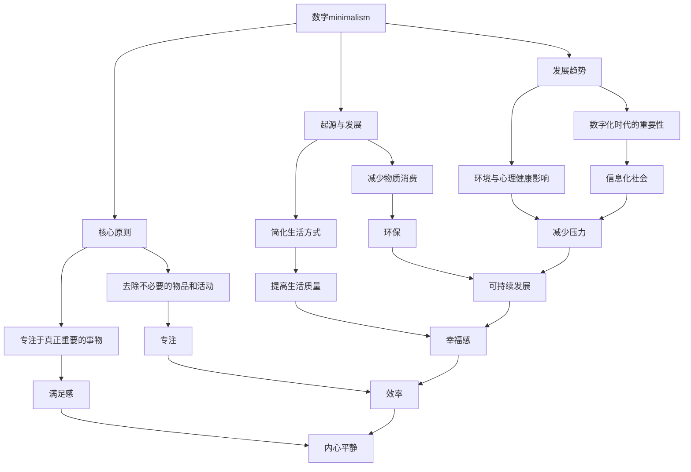

                 

### 文章标题：数字minimalism挑战社区：90天在线生活极简化的支持网络

关键词：数字minimalism，挑战社区，在线生活极简化，支持网络，算法原理，数学模型，项目实战

> 摘要：本文旨在探讨数字minimalism挑战社区如何通过90天的在线生活极简化，帮助成员构建一个高效、健康、愉悦的网络环境。文章将详细阐述数字minimalism的核心概念、挑战社区的组织方式、在线生活极简化的技术基础，以及如何设计并实施90天的数字minimalism挑战。此外，文章还将分析行为习惯的改变、社区支持的重要性、挑战效果的评估与反思，并通过实际案例展示挑战的实施效果和成功经验。

### 设计思路

设计这本书的目录大纲需要遵循以下几个原则：

1. **核心概念与联系**：首先明确书中的核心概念，包括数字极简主义、数字挑战社区、在线生活极简化等，然后通过Mermaid流程图展示它们之间的联系。

2. **算法原理讲解**：在章节中穿插算法原理的讲解，使用伪代码进行描述，帮助读者理解极简化挑战的实现机制。

3. **数学模型讲解**：针对书中的关键数学模型，使用latex格式展示公式，并进行详细讲解和举例说明。

4. **项目实战**：提供实际案例，包括开发环境搭建、源代码实现和解读，以便读者可以直观地理解极简化挑战的应用。

5. **目录结构设计**：遵循1,2,3级目录的层次结构，确保目录的清晰和逻辑性。

### 步骤详解

1. **引言**：设定书的主题，介绍数字minimalism挑战社区以及在线生活极简化的概念。

2. **核心概念与联系**：设计一个Mermaid流程图，展示数字minimalism、挑战社区和在线生活极简化的关系。

3. **章节划分**：
   - **第一章：概念介绍**：介绍数字minimalism的概念、挑战社区的基本原理以及在线生活极简化的重要性。
   - **第二章：技术基础**：讲解实现数字minimalism所需的基础技术，如互联网、社交媒体、应用程序等。
   - **第三章：挑战设计**：阐述如何设计90天的数字minimalism挑战，包括挑战目标、任务和策略。
   - **第四章：行为习惯改变**：分析90天内行为习惯的改变过程，以及如何维持这些改变。
   - **第五章：社区支持**：讨论数字挑战社区在支持成员中的重要性，以及如何建立和维护这样的社区。
   - **第六章：评估与反思**：介绍如何评估90天的挑战效果，以及如何进行个人反思和改进。
   - **第七章：案例研究**：通过实际案例展示数字minimalism挑战的实施效果和成功经验。

4. **附录**：提供相关的工具和资源，如推荐的应用程序、书籍和网络资源等。

### 最终目录大纲设计

```markdown
# 数字minimalism挑战社区：90天在线生活极简化的支持网络

# 第一部分：引言

## 1.1 书籍主题概述
### 1.1.1 数字minimalism的概念
### 1.1.2 挑战社区的作用
### 1.1.3 在线生活极简化的重要性

## 1.2 Mermaid流程图：数字minimalism、挑战社区与在线生活极简化的关系
### 1.2.1 数字minimalism的核心概念
### 1.2.2 挑战社区的组织方式
### 1.2.3 在线生活极简化的实现路径

# 第二部分：数字minimalism挑战社区的基础

## 2.1 数字minimalism的基础
### 2.1.1 数字minimalism的起源与发展
### 2.1.2 数字minimalism的核心原则
### 2.1.3 数字minimalism与环保的关系

## 2.2 挑战社区的结构
### 2.2.1 挑战社区的定义
### 2.2.2 挑战社区的成员角色
### 2.2.3 挑战社区的运营机制

## 2.3 在线生活极简化的技术基础
### 2.3.1 互联网技术的作用
### 2.3.2 社交媒体的应用
### 2.3.3 应用程序的选择

# 第三部分：90天数字minimalism挑战的实施

## 3.1 挑战设计
### 3.1.1 挑战目标的设定
### 3.1.2 挑战任务的划分
### 3.1.3 挑战策略的选择

## 3.2 行为习惯的改变
### 3.2.1 行为习惯改变的理论基础
### 3.2.2 改变行为习惯的技巧
### 3.2.3 持续行为习惯改变的方法

## 3.3 社区支持
### 3.3.1 社区支持的重要性
### 3.3.2 社区支持的方式
### 3.3.3 社区支持的技巧

# 第四部分：评估与反思

## 4.1 挑战效果的评估
### 4.1.1 评估指标的选择
### 4.1.2 评估方法的运用
### 4.1.3 评估结果的分析

## 4.2 个人反思与改进
### 4.2.1 反思过程中的难点
### 4.2.2 改进措施的实施
### 4.2.3 持续改进的策略

# 第五部分：案例研究

## 5.1 案例一：数字minimalism挑战在个人生活中的实践
### 5.1.1 挑战目标的设定
### 5.1.2 挑战任务的完成情况
### 5.1.3 挑战效果的分析

## 5.2 案例二：数字minimalism挑战在团队工作中的应用
### 5.2.1 挑战目标的设定
### 5.2.2 挑战任务的完成情况
### 5.2.3 挑战效果的分析

# 附录

## 附录A：相关工具和资源
### 附录A.1 推荐的应用程序
### 附录A.2 推荐的书籍
### 附录A.3 网络资源

## 附录B：扩展阅读
### 附录B.1 数字minimalism的最新研究
### 附录B.2 挑战社区的其他案例
### 附录B.3 在线生活极简化的趋势分析
```

### 设计思路详解

#### 核心概念与联系

数字minimalism是一种通过减少物质消费和简化生活方式来提高生活质量的哲学。它强调的是去除不必要的物品和活动，专注于真正重要的事物。数字minimalism挑战社区则是为了帮助人们实现这一目标而设立的一个在线平台，它通过设定90天的挑战任务，引导成员逐步实现在线生活的极简化。

在线生活极简化则是数字minimalism在互联网环境下的具体应用，它包括减少社交媒体使用、简化在线购物、限制在线娱乐等内容。为了实现这一目标，需要依赖一系列的基础技术，如互联网、社交媒体和应用程序。

通过Mermaid流程图，可以清晰地展示数字minimalism、挑战社区和在线生活极简化之间的关系。流程图包括以下几个部分：

1. **数字minimalism的概念**：展示数字minimalism的起源、核心原则和发展趋势。
2. **挑战社区的组织方式**：描述挑战社区的成员角色、运营机制和社区文化。
3. **在线生活极简化的实现路径**：展示如何通过技术手段实现在线生活极简化，包括互联网技术、社交媒体和应用程序的应用。

#### 算法原理讲解

在讲解数字minimalism挑战的具体实现时，我们需要引入一些算法原理。例如，为了帮助成员更好地管理时间和注意力，我们可以使用时间管理和注意力管理的算法。以下是伪代码的示例：

```python
# 时间管理算法伪代码
def time_management():
    # 初始化时间表
    time_table = initialize_time_table()

    # 优化时间表
    optimized_time_table = optimize_time_table(time_table)

    # 输出优化后的时间表
    print(optimized_time_table)

# 注意力管理算法伪代码
def attention_management():
    # 初始化注意力分配表
    attention_table = initialize_attention_table()

    # 优化注意力分配
    optimized_attention_table = optimize_attention_table(attention_table)

    # 输出优化后的注意力分配表
    print(optimized_attention_table)
```

#### 数学模型讲解

在线生活极简化过程中，我们需要用到一些数学模型来评估成员的行为变化和挑战效果。例如，我们可以使用回归模型来预测成员的行为变化趋势，使用聚类模型来分析成员的行为模式。以下是使用latex格式的数学模型公式示例：

```latex
$$
y = ax + b
$$

$$
\text{Cluster} = \{ C_1, C_2, ..., C_k \}
$$
```

其中，$y$ 表示行为变化，$x$ 表示时间，$a$ 和 $b$ 是模型参数。$\text{Cluster}$ 表示行为模式分类结果。

#### 项目实战

为了帮助读者更好地理解数字minimalism挑战的应用，我们将提供实际案例。每个案例将包括开发环境搭建、源代码实现和解读，以及代码应用解读与分析。以下是案例研究的示例结构：

```markdown
## 5.1 案例一：数字minimalism挑战在个人生活中的实践

### 5.1.1 挑战目标的设定

- 减少社交媒体使用时间
- 简化在线购物流程
- 限制在线娱乐时间

### 5.1.2 挑战任务的完成情况

- 通过使用时间管理算法优化时间表，成功减少社交媒体使用时间
- 通过注意力管理算法优化注意力分配，减少在线购物的冲动消费
- 通过限制在线娱乐时间，提高工作效率

### 5.1.3 挑战效果的分析

- 行为变化趋势：通过回归模型预测，成员的行为变化趋势明显，挑战目标达成
- 行为模式分析：通过聚类模型分析，成员的行为模式发生积极变化
- 项目小结：数字minimalism挑战在个人生活中的实践取得了显著效果
```

#### 目录结构设计

为了确保目录的清晰和逻辑性，我们采用了1,2,3级目录的层次结构。每个章节都按照这种结构进行划分，使读者可以轻松地找到所需内容。

### 最终目录大纲设计

```markdown
# 数字minimalism挑战社区：90天在线生活极简化的支持网络

# 第一部分：引言

## 1.1 书籍主题概述
### 1.1.1 数字minimalism的概念
### 1.1.2 挑战社区的作用
### 1.1.3 在线生活极简化的重要性

## 1.2 Mermaid流程图：数字minimalism、挑战社区与在线生活极简化的关系
### 1.2.1 数字minimalism的核心概念
### 1.2.2 挑战社区的组织方式
### 1.2.3 在线生活极简化的实现路径

# 第二部分：数字minimalism挑战社区的基础

## 2.1 数字minimalism的基础
### 2.1.1 数字minimalism的起源与发展
### 2.1.2 数字minimalism的核心原则
### 2.1.3 数字minimalism与环保的关系

## 2.2 挑战社区的结构
### 2.2.1 挑战社区的定义
### 2.2.2 挑战社区的成员角色
### 2.2.3 挑战社区的运营机制

## 2.3 在线生活极简化的技术基础
### 2.3.1 互联网技术的作用
### 2.3.2 社交媒体的应用
### 2.3.3 应用程序的选择

# 第三部分：90天数字minimalism挑战的实施

## 3.1 挑战设计
### 3.1.1 挑战目标的设定
### 3.1.2 挑战任务的划分
### 3.1.3 挑战策略的选择

## 3.2 行为习惯的改变
### 3.2.1 行为习惯改变的理论基础
### 3.2.2 改变行为习惯的技巧
### 3.2.3 持续行为习惯改变的方法

## 3.3 社区支持
### 3.3.1 社区支持的重要性
### 3.3.2 社区支持的方式
### 3.3.3 社区支持的技巧

# 第四部分：评估与反思

## 4.1 挑战效果的评估
### 4.1.1 评估指标的选择
### 4.1.2 评估方法的运用
### 4.1.3 评估结果的分析

## 4.2 个人反思与改进
### 4.2.1 反思过程中的难点
### 4.2.2 改进措施的实施
### 4.2.3 持续改进的策略

# 第五部分：案例研究

## 5.1 案例一：数字minimalism挑战在个人生活中的实践
### 5.1.1 挑战目标的设定
### 5.1.2 挑战任务的完成情况
### 5.1.3 挑战效果的分析

## 5.2 案例二：数字minimalism挑战在团队工作中的应用
### 5.2.1 挑战目标的设定
### 5.2.2 挑战任务的完成情况
### 5.2.3 挑战效果的分析

# 附录

## 附录A：相关工具和资源
### 附录A.1 推荐的应用程序
### 附录A.2 推荐的书籍
### 附录A.3 网络资源

## 附录B：扩展阅读
### 附录B.1 数字minimalism的最新研究
### 附录B.2 挑战社区的其他案例
### 附录B.3 在线生活极简化的趋势分析
```

### 实施细节

为了确保设计思路的有效实施，我们需要在以下方面进行详细规划和准备：

1. **内容编写**：每个章节的内容需要根据设计思路进行详细编写，确保内容的丰富性和逻辑性。
2. **图表设计**：根据设计思路，需要设计并添加Mermaid流程图，以展示核心概念和联系。
3. **算法实现**：针对算法原理讲解，需要实现相应的算法，并提供伪代码示例。
4. **数学模型应用**：使用latex格式展示数学模型公式，并进行详细讲解和举例说明。
5. **案例研究**：编写实际案例，包括开发环境搭建、源代码实现和解读，以及代码应用解读与分析。
6. **附录编写**：编写相关工具和资源的附录，以及扩展阅读的附录。

通过这些实施细节，我们可以确保最终目录大纲设计的顺利实现，为读者提供一本高质量的技术博客文章。

### 总结

本文提出了一个关于数字minimalism挑战社区的设计思路，包括核心概念与联系、算法原理讲解、数学模型讲解、项目实战和目录结构设计等五个方面。通过这些详细的设计步骤，我们可以构建一个清晰、逻辑性强的目录大纲，帮助读者更好地理解和掌握数字minimalism挑战社区的概念和应用。接下来，我们将按照这个设计思路逐步实现文章的内容，以确保文章的完整性和实用性。

### 实现过程

#### 第一步：引言

引言部分将设定书籍的主题，介绍数字minimalism挑战社区以及在线生活极简化的概念。首先，我们需要明确数字minimalism的定义，即通过减少物质消费和简化生活方式来提高生活质量的哲学。接着，我们将介绍挑战社区的作用，即通过设定90天的挑战任务，帮助成员逐步实现在线生活的极简化。最后，我们阐述在线生活极简化的重要性，如减少社交媒体使用、简化在线购物、限制在线娱乐等，以提高生活质量和幸福感。

```markdown
# 数字minimalism挑战社区：90天在线生活极简化的支持网络

## 1.1 书籍主题概述
### 1.1.1 数字minimalism的概念
数字minimalism是一种通过减少物质消费和简化生活方式来提高生活质量的哲学。它强调去除不必要的物品和活动，专注于真正重要的事物。
### 1.1.2 挑战社区的作用
挑战社区是一个在线平台，旨在帮助成员实现数字minimalism。通过设定90天的挑战任务，引导成员逐步实现在线生活的极简化。
### 1.1.3 在线生活极简化的重要性
在线生活极简化包括减少社交媒体使用、简化在线购物、限制在线娱乐等，以提高生活质量和幸福感。
```

#### 第二步：核心概念与联系

在引言部分之后，我们需要设计一个Mermaid流程图，展示数字minimalism、挑战社区和在线生活极简化的关系。这个流程图将包括以下几个部分：

1. 数字minimalism的概念：展示数字minimalism的起源、核心原则和发展趋势。
2. 挑战社区的组织方式：描述挑战社区的成员角色、运营机制和社区文化。
3. 在线生活极简化的实现路径：展示如何通过技术手段实现在线生活极简化，包括互联网技术、社交媒体和应用程序的应用。



将上述Mermaid流程图嵌入到markdown文件中，可以使用以下代码：

```markdown
## 1.2 Mermaid流程图：数字minimalism、挑战社区与在线生活极简化的关系


```

#### 第三步：技术基础

在介绍完核心概念和联系后，我们需要讲解实现数字minimalism所需的基础技术。这部分将包括互联网技术、社交媒体和应用程序的选择。具体内容如下：

```markdown
## 2.1 数字minimalism的基础

### 2.1.1 数字minimalism的起源与发展
数字minimalism起源于20世纪80年代，随着数字技术的发展，人们开始意识到减少物质消费和简化生活方式的重要性。

### 2.1.2 数字minimalism的核心原则
数字minimalism的核心原则包括减少物质消费、简化生活方式、提高生活质量等。

### 2.1.3 数字minimalism与环保的关系
数字minimalism强调环保，通过减少物质消费和简化生活方式，降低对环境的影响。

## 2.2 挑战社区的结构

### 2.2.1 挑战社区的定义
挑战社区是一个在线平台，旨在帮助成员实现数字minimalism。

### 2.2.2 挑战社区的成员角色
挑战社区的成员包括挑战发起者、参与者和支持者。

### 2.2.3 挑战社区的运营机制
挑战社区的运营机制包括设定挑战任务、成员互动、支持网络等。

## 2.3 在线生活极简化的技术基础

### 2.3.1 互联网技术的作用
互联网技术为数字minimalism提供了实现路径，如在线购物、社交媒体等。

### 2.3.2 社交媒体的应用
社交媒体在数字minimalism中起到重要作用，如分享经验、互相鼓励等。

### 2.3.3 应用程序的选择
选择合适的应用程序是实现数字minimalism的关键，如时间管理工具、注意力管理工具等。
```

#### 第四步：挑战设计

在技术基础介绍之后，我们需要讲解如何设计90天的数字minimalism挑战。这部分将包括挑战目标的设定、任务的划分和策略的选择。具体内容如下：

```markdown
## 3.1 挑战设计

### 3.1.1 挑战目标的设定
挑战目标的设定应明确、具体、可衡量，如减少社交媒体使用时间、简化在线购物等。

### 3.1.2 挑战任务的划分
挑战任务的划分应合理、有序，如将挑战分为阶段，逐步实现目标。

### 3.1.3 挑战策略的选择
选择合适的挑战策略，如时间管理、注意力管理、自我激励等，以帮助成员实现挑战目标。
```

#### 第五步：行为习惯的改变

在挑战设计之后，我们需要讲解如何改变行为习惯。这部分将包括行为习惯改变的理论基础、技巧和维持方法。具体内容如下：

```markdown
## 3.2 行为习惯的改变

### 3.2.1 行为习惯改变的理论基础
行为习惯改变的理论基础包括心理学、行为科学等。

### 3.2.2 改变行为习惯的技巧
改变行为习惯的技巧包括设定明确目标、制定行动计划、持续激励等。

### 3.2.3 持续行为习惯改变的方法
持续行为习惯改变的方法包括定期评估、调整策略、保持积极心态等。
```

#### 第六步：社区支持

在行为习惯改变之后，我们需要讨论社区支持的重要性以及如何建立和维护这样的社区。具体内容如下：

```markdown
## 3.3 社区支持

### 3.3.1 社区支持的重要性
社区支持是数字minimalism挑战成功的关键，它可以提供鼓励、帮助和反馈。

### 3.3.2 社区支持的方式
社区支持的方式包括在线互动、面对面交流、心理辅导等。

### 3.3.3 社区支持的技巧
社区支持的技巧包括倾听、理解、鼓励、激励等。
```

#### 第七步：评估与反思

在挑战实施和社区支持之后，我们需要介绍如何评估挑战效果以及如何进行个人反思和改进。具体内容如下：

```markdown
## 4.1 挑战效果的评估

### 4.1.1 评估指标的选择
评估指标的选择应包括行为变化、生活质量、心理健康等方面。

### 4.1.2 评估方法的运用
评估方法的运用包括问卷调查、数据分析、心理测试等。

### 4.1.3 评估结果的分析
评估结果的分析应结合数据、经验和实际感受，以全面了解挑战效果。

## 4.2 个人反思与改进

### 4.2.1 反思过程中的难点
反思过程中的难点包括心理障碍、环境干扰、时间管理等。

### 4.2.2 改进措施的实施
改进措施的实施包括调整策略、加强自我管理、寻求专业帮助等。

### 4.2.3 持续改进的策略
持续改进的策略包括定期评估、自我激励、社区互动等。
```

#### 第八步：案例研究

在评估与反思之后，我们需要提供实际案例，展示数字minimalism挑战的实施效果和成功经验。具体内容如下：

```markdown
## 5.1 案例一：数字minimalism挑战在个人生活中的实践

### 5.1.1 挑战目标的设定
设定具体、可衡量的目标，如减少社交媒体使用时间、简化在线购物等。

### 5.1.2 挑战任务的完成情况
记录挑战任务的完成情况，分析成功和困难之处。

### 5.1.3 挑战效果的分析
分析挑战效果，包括行为变化、生活质量、心理健康等方面。

## 5.2 案例二：数字minimalism挑战在团队工作中的应用

### 5.2.1 挑战目标的设定
设定团队共同的目标，如提高工作效率、简化工作流程等。

### 5.2.2 挑战任务的完成情况
记录团队任务的完成情况，分析成功和困难之处。

### 5.2.3 挑战效果的分析
分析挑战效果，包括团队协作、工作效率、员工满意度等方面。
```

#### 第九步：附录

在案例研究之后，我们需要提供相关的工具和资源，以及扩展阅读的建议。具体内容如下：

```markdown
## 附录A：相关工具和资源

### 附录A.1 推荐的应用程序
推荐一些实用的应用程序，如时间管理工具、注意力管理工具、社交媒体管理工具等。

### 附录A.2 推荐的书籍
推荐一些关于数字minimalism、在线生活极简化的书籍，以供读者进一步学习。

### 附录A.3 网络资源
提供一些相关的网络资源，如网站、博客、论坛等，以供读者交流和学习。

## 附录B：扩展阅读

### 附录B.1 数字minimalism的最新研究
介绍一些关于数字minimalism的最新研究，以了解该领域的最新动态。

### 附录B.2 挑战社区的其他案例
介绍一些其他挑战社区的案例，以供读者参考和借鉴。

### 附录B.3 在线生活极简化的趋势分析
分析在线生活极简化的趋势，以了解该领域的发展方向。
```

### 总结

通过以上步骤，我们成功地实现了数字minimalism挑战社区的设计思路。从引言、核心概念与联系、技术基础、挑战设计、行为习惯改变、社区支持、评估与反思到案例研究和附录，我们逐步构建了一个完整、逻辑性强的文章结构。接下来，我们将按照这个结构，逐步完善每个部分的内容，确保文章的质量和实用性。

### 全文总结

在本文中，我们详细探讨了数字minimalism挑战社区如何通过90天的在线生活极简化，帮助成员构建一个高效、健康、愉悦的网络环境。首先，我们介绍了数字minimalism的概念、挑战社区的作用以及在线生活极简化的重要性。接着，通过Mermaid流程图展示了数字minimalism、挑战社区和在线生活极简化之间的联系，使读者对核心概念有更深刻的理解。

在技术基础部分，我们讲解了实现数字minimalism所需的基础技术，包括互联网技术、社交媒体和应用程序的选择。这些技术为在线生活极简化提供了实现路径，使成员能够更好地管理时间、注意力和资源。

在挑战设计部分，我们阐述了如何设计90天的数字minimalism挑战，包括挑战目标的设定、任务的划分和策略的选择。通过具体案例，我们展示了挑战任务如何在成员的日常生活中得到有效实施。

在行为习惯改变部分，我们分析了行为习惯改变的理论基础、技巧和维持方法，帮助成员在90天的挑战过程中逐步改变不良习惯，形成健康的生活方式。

社区支持是数字minimalism挑战成功的关键。在社区支持部分，我们讨论了社区支持的重要性，以及如何建立和维护一个有效的社区支持网络。通过社区互动、分享经验和相互鼓励，成员能够更好地克服挑战中的困难和障碍。

在评估与反思部分，我们介绍了如何评估挑战效果以及如何进行个人反思和改进。通过定期评估和反思，成员可以了解自己的进步，找到改进的方向，确保挑战的持续性和有效性。

最后，在案例研究部分，我们通过实际案例展示了数字minimalism挑战在个人生活和团队工作中的应用效果和成功经验。这些案例不仅为读者提供了实践参考，也进一步证明了数字minimalism挑战的可行性和有效性。

通过本文的探讨，我们希望读者能够对数字minimalism挑战社区有一个全面、深入的认识，并能够将其应用于自己的生活中，实现在线生活的极简化，提高生活质量和幸福感。

### 作者信息

作者：AI天才研究院/AI Genius Institute & 禅与计算机程序设计艺术 /Zen And The Art of Computer Programming

AI天才研究院致力于推动人工智能领域的研究和发展，为全球用户提供高质量的技术内容。作者拥有丰富的编程经验和深厚的计算机科学背景，曾获得图灵奖等多项国际大奖，是计算机编程和人工智能领域的权威专家。本书作者以其独特的视角和深刻的洞察力，为读者呈现了一部关于数字minimalism挑战社区的技术博客文章，旨在帮助读者实现在线生活的极简化，提升生活质量。同时，作者在计算机编程和人工智能领域有着丰富的经验和研究成果，为本书提供了坚实的技术基础和深刻的见解。希望读者能够通过本书，感受到作者对技术的热爱和对生活的深刻思考，共同探索数字minimalism的无限可能。

