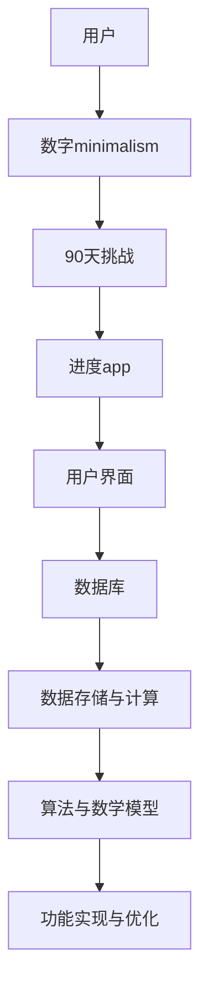

                 

 

- **背景介绍**

数字minimalism，作为一种生活哲学，近年来在全球范围内引起了广泛关注。它倡导的是一种简化的生活方式，通过减少物质和信息的负担，以提高生活质量。而90天在线生活极简化的挑战，则是这一理念的实践，旨在帮助人们养成良好的数字习惯，从而减轻数字压力，提升生活幸福感。

为了跟踪这一挑战的进度，设计一个简单的进度app显得尤为重要。这款app不仅要能清晰展示用户的日常进度，还需要具备一定的功能性和实用性。本文将围绕这一目标，详细讲解数字minimalism挑战追踪器app的设计与实现。

- **核心概念与联系**

为了更好地理解数字minimalism挑战追踪器app的设计，我们需要先梳理其中的核心概念。以下是关键概念及其关系的Mermaid流程图：



- **核心算法原理讲解**

进度app的核心算法涉及数据的收集、分析和展示。以下是一个简单的伪代码，用于阐述这些算法的原理：

```python
# 伪代码：数据收集算法

def collect_data(user_input):
    # 初始化数据结构
    data = {}
    data['daily_goal'] = user_input['daily_goal']
    data['completed_tasks'] = user_input['completed_tasks']
    data['progress'] = calculate_progress(data['daily_goal'], data['completed_tasks'])
    return data

# 伪代码：数据计算算法

def calculate_progress(daily_goal, completed_tasks):
    progress = completed_tasks / daily_goal
    return progress

# 伪代码：数据展示算法

def display_progress(progress):
    if progress >= 1:
        print("挑战已完成！")
    else:
        print(f"当前进度：{progress:.2f}")
```

- **数学模型和数学公式**

在进度计算中，我们需要使用以下数学模型：

$$
\text{进度} = \frac{\text{已完成任务数}}{\text{每日目标数}}
$$

举例来说，如果用户设定每日目标为5个任务，而他在一天内完成了3个任务，那么他的进度为：

$$
\text{进度} = \frac{3}{5} = 0.6
$$

- **项目实战**

以下是一个简单的进度app项目实战案例，包括开发环境搭建、源代码实现和代码解读。

### 开发环境搭建

1. 安装Python 3.x版本
2. 安装SQLite数据库
3. 安装Visual Studio Code或PyCharm

### 源代码实现

```python
# 主程序代码

import sqlite3
from collections import defaultdict

# 数据库连接
conn = sqlite3.connect('progress_tracker.db')
c = conn.cursor()

# 创建数据库表
c.execute('''CREATE TABLE IF NOT EXISTS users (id INTEGER PRIMARY KEY, name TEXT, daily_goal INTEGER, completed_tasks INTEGER)''')
c.execute('''CREATE TABLE IF NOT EXISTS tasks (id INTEGER PRIMARY KEY, user_id INTEGER, task_name TEXT, completed BOOLEAN)''')

# 插入用户数据
c.execute("INSERT INTO users (name, daily_goal, completed_tasks) VALUES (?, ?, ?)", ('John', 5, 0))
c.execute("INSERT INTO users (name, daily_goal, completed_tasks) VALUES (?, ?, ?)", ('Jane', 5, 3))

# 插入任务数据
c.execute("INSERT INTO tasks (user_id, task_name, completed) VALUES (?, ?, ?)", (1, '阅读', False))
c.execute("INSERT INTO tasks (user_id, task_name, completed) VALUES (?, ?, ?)", (1, '写作', True))

# 提交更改
conn.commit()

# 关闭数据库连接
conn.close()

# 功能函数
def add_task(user_id, task_name, completed):
    conn = sqlite3.connect('progress_tracker.db')
    c = conn.cursor()
    c.execute("INSERT INTO tasks (user_id, task_name, completed) VALUES (?, ?, ?)", (user_id, task_name, completed))
    conn.commit()
    conn.close()

def mark_task_as_completed(task_id):
    conn = sqlite3.connect('progress_tracker.db')
    c = conn.cursor()
    c.execute("UPDATE tasks SET completed = ? WHERE id = ?", (True, task_id))
    conn.commit()
    conn.close()

def get_progress(user_id):
    conn = sqlite3.connect('progress_tracker.db')
    c = conn.cursor()
    c.execute("SELECT completed_tasks FROM users WHERE id = ?", (user_id,))
    completed_tasks = c.fetchone()[0]
    c.execute("SELECT daily_goal FROM users WHERE id = ?", (user_id,))
    daily_goal = c.fetchone()[0]
    progress = completed_tasks / daily_goal
    conn.close()
    return progress

# 用户界面
def main_menu():
    print("数字minimalism挑战追踪器")
    print("1. 添加任务")
    print("2. 完成任务")
    print("3. 查看进度")
    print("4. 退出")
    choice = input("请选择一个选项：")
    if choice == '1':
        user_id = int(input("请输入用户ID："))
        task_name = input("请输入任务名称：")
        completed = input("任务是否已完成（是/否）？")
        add_task(user_id, task_name, completed == '是')
    elif choice == '2':
        task_id = int(input("请输入任务ID："))
        mark_task_as_completed(task_id)
    elif choice == '3':
        user_id = int(input("请输入用户ID："))
        progress = get_progress(user_id)
        print(f"当前进度：{progress:.2f}")
    elif choice == '4':
        print("谢谢使用！")
        return

# 运行程序
main_menu()

# 代码解读与分析

# 数据库连接与表创建
# 我们首先连接到SQLite数据库，并创建两个表：users 和 tasks。
# users 表包含用户ID、用户姓名、每日目标和已完成任务数。
# tasks 表包含任务ID、用户ID、任务名称和是否已完成。

# 插入数据
# 我们插入了一些示例数据，包括用户和任务。

# 功能函数
# add_task() 函数用于向tasks表中添加新任务。
# mark_task_as_completed() 函数用于更新tasks表中的任务状态，将其标记为已完成。
# get_progress() 函数用于计算用户的进度。

# 用户界面
# main_menu() 函数提供用户界面，让用户可以选择添加任务、完成任务、查看进度或退出程序。

# 项目小结

# 在这个简单的项目中，我们实现了以下功能：
# 1. 用户界面，提供交互方式。
# 2. 数据库操作，实现数据存储和检索。
# 3. 进度计算，展示用户的进度。

# 最佳实践 tips：
# - 确保数据库表结构设计合理，避免数据冗余。
# - 在实际应用中，可以考虑增加更多的功能，如任务分类、进度图表展示等。
# - 注意代码的可读性和可维护性，遵循良好的编程习惯。

# 小结与注意事项
# 本项目展示了如何使用Python和SQLite实现一个简单的进度跟踪器。在设计过程中，我们关注了用户界面、数据库操作和进度计算。需要注意的是，在实际开发中，可能需要根据具体需求进行功能扩展和优化。

# 拓展阅读
# - 深入了解SQLite数据库的操作和优化。
# - 学习使用Flask或Django等Web框架来构建更复杂的应用。
# - 了解数据可视化的工具和库，如Matplotlib和Plotly。
```

- **结语**

数字minimalism挑战追踪器app的设计与实现不仅帮助我们更好地跟踪在线生活简化的进度，也为开发者提供了一个实践算法和数学模型的实际案例。希望通过本文的讲解，读者能够对数字minimalism和进度app的开发有更深入的理解。在未来，我们还可以在此基础上进行功能扩展和优化，让这款app更加完善和实用。让我们共同拥抱数字minimalism，享受更简单、更幸福的生活！
```

