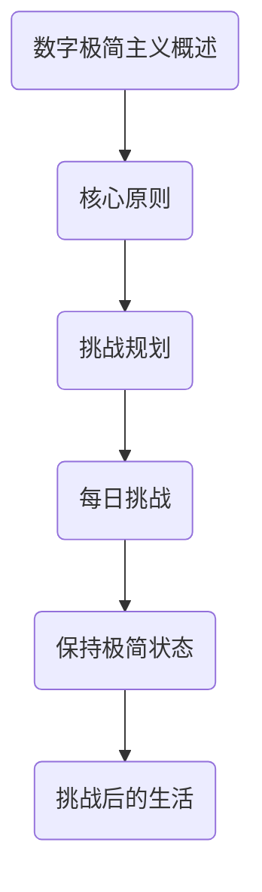

                 


### 文章标题：数字minimalism挑战：90天在线生活极简化活动

### 关键词：数字极简主义，在线生活，简化，挑战，效率，专注

### 摘要：
本文旨在探讨数字极简主义的概念，通过一个为期90天的在线生活极简化挑战，帮助读者实现数字环境的整洁和高效。文章将详细介绍挑战的目标、核心原则、每日任务，以及挑战后如何维持极简生活状态。

---

## 第1章：数字极简主义简介

### 1.1 数字极简主义的定义与背景

数字极简主义（Digital Minimalism）是一种生活方式，主张通过减少数字产品和服务的使用，来简化生活、提高效率和提升幸福感。它起源于20世纪末，随着互联网和智能手机的普及，人们逐渐意识到数字化生活带来的负面影响，如注意力分散、时间浪费、隐私侵犯等。

### 1.2 数字极简主义的优势

数字极简主义的优势主要体现在以下几个方面：

- **减少干扰**：通过减少不必要的社交媒体和应用程序，可以降低干扰，提高工作效率。
- **节省时间**：简化数字生活，可以节省出更多时间用于个人成长和家庭生活。
- **提高专注力**：减少数字产品的使用，有助于提升专注力和思维深度。
- **保护隐私**：减少数据共享，可以有效保护个人隐私。

### 1.3 数字极简主义与数字化生活的冲突

数字极简主义与数字化生活的冲突主要表现在以下几个方面：

- **依赖性**：许多人已经习惯了数字化工具和服务的便利，难以戒掉。
- **信息过载**：数字化产品和服务带来的信息量巨大，容易导致信息过载。
- **隐私问题**：数字化生活往往涉及大量的个人信息和数据共享，可能带来隐私风险。

### 1.4 目标读者的准备

对于希望参与数字极简主义挑战的读者，以下准备工作至关重要：

- **心态调整**：准备从数字化生活的喧嚣中解脱出来，接受一种更为简单、高效的生活方式。
- **制定计划**：提前规划挑战的日程和目标，确保有足够的动力和执行力。
- **准备工具**：评估和准备需要的工具和应用程序，以支持极简生活的实现。

---

## 第2章：数字极简主义的核心原则

### 2.1 最少即是多（Less is More）

“最少即是多”是数字极简主义的核心原则之一。它强调，通过减少数字产品的使用，可以获得更多的时间和精力，从而更好地享受生活。

### 2.2 专注与单点关注（Focus and One-Thing-at-a-Time）

专注与单点关注要求我们在使用数字产品时，专注于当前任务，避免多任务操作，以提升效率和专注力。

### 2.3 简化与效率（Simplification and Efficiency）

简化与效率原则鼓励我们去除不必要的数字工具和服务，以减少干扰，提高生活和工作效率。

### 2.4 轻松选择（Ease of Choice）

轻松选择原则提倡我们简化数字产品和服务的选择，减少决策负担，以便更好地专注于重要事项。

---

## 第3章：90天在线生活极简化挑战规划

### 3.1 挑战概述

本挑战为期90天，旨在帮助读者逐步减少数字产品的使用，实现在线生活的极简化。

### 3.2 挑战前准备

在开始挑战之前，读者需要：

- **评估当前使用情况**：了解自己目前使用的数字产品和服务，评估其使用频率和必要性。
- **设定挑战目标**：根据个人情况，设定具体的挑战目标，如减少社交媒体使用时间、删除不必要的应用程序等。

### 3.3 挑战日程安排

挑战分为三个阶段，每个阶段30天：

- **阶段1：数字清理**（第1-30天）
  - **任务**：清理电子邮件、社交媒体、应用程序等。
  - **目标**：减少数字产品的使用，恢复对时间的控制。

- **阶段2：数字化断舍离**（第31-60天）
  - **任务**：简化数字工具和服务，专注于重要事项。
  - **目标**：建立高效的数字生活方式。

- **阶段3：专注力提升**（第61-90天）
  - **任务**：培养专注力，减少多任务操作。
  - **目标**：提高工作效率，享受数字极简带来的好处。

### 3.4 挑战目标设定

挑战的目标可以是：

- **减少社交媒体使用时间**：每天不超过一定时长。
- **删除不必要的应用程序**：只保留最重要的应用程序。
- **简化电子邮件管理**：每天处理完所有电子邮件。

---

## 第4章：挑战第一天至第30天

### 4.1 第1周：数字清理

#### 4.1.1 设定规则

在第1周，我们需要设定一些基本规则，如：

- **每天限制社交媒体使用时间**：例如每天不超过30分钟。
- **每周处理电子邮件**：每天检查并处理一次电子邮件。

#### 4.1.2 清理电子邮件

步骤：

1. **分类**：将电子邮件分为“已读”和“未读”两类。
2. **删除**：删除不需要的邮件，如垃圾邮件。
3. **归档**：将重要邮件归档，以便后续查找。

#### 4.1.3 管理社交媒体

步骤：

1. **限制访问时间**：设置每日访问社交媒体的时间限制。
2. **关闭推送通知**：避免因推送通知而分散注意力。

#### 4.1.4 放慢速度

第1周的目标是逐步减少数字产品的使用，以适应新的生活方式。

---

## 第5章：挑战第31天至第60天

### 5.1 第2周：数字化断舍离

#### 5.1.1 物理物品简化

步骤：

1. **分类**：将物品分为“必需品”和“非必需品”。
2. **捐赠或丢弃**：将非必需品捐赠或丢弃。

#### 5.1.2 数字文件和组织

步骤：

1. **整理**：将数字文件进行分类和整理。
2. **备份**：将重要文件备份至云存储或外部硬盘。

#### 5.1.3 确定日常优先事项

步骤：

1. **列出任务**：列出每天需要完成的任务。
2. **优先级排序**：根据任务的重要性和紧急性进行排序。

---

## 第6章：挑战第61天至第90天

### 6.1 第3周：自动化与效率

#### 5.1.1 自动化工具的选择

步骤：

1. **评估需求**：确定需要自动化的任务。
2. **选择工具**：选择合适的自动化工具。

#### 5.1.2 工作流程优化

步骤：

1. **分析流程**：分析当前的工作流程。
2. **优化流程**：去除不必要的步骤，简化流程。

#### 5.1.3 效率工具的运用

步骤：

1. **使用时间管理工具**：如番茄钟、待办事项列表等。
2. **使用自动化工具**：如自动化回复、自动化备份等。

---

## 第7章：挑战后的生活

### 7.1 回顾与总结

挑战结束后，我们需要回顾整个过程，总结经验和教训，以持续改善数字生活方式。

### 7.2 持续改进

数字极简主义是一种持续的过程，我们需要不断地审视自己的数字生活方式，寻找改进的方法。

### 7.3 数字极简主义生活的未来

随着数字化技术的不断发展，数字极简主义生活将面临新的挑战和机遇。我们需要适应这些变化，以实现更好的生活质量。

---

## 附录

### 附录A：挑战日程表

提供详细的挑战日程表，以便读者参考。

### 附录B：常见问题解答

解答读者可能遇到的问题，提供解决方案。

### 附录C：拓展阅读

推荐一些相关的书籍和文章，供读者深入了解数字极简主义。

---

### 结论

通过90天的在线生活极简化挑战，读者可以体验到数字极简主义的魅力。希望本文能帮助您实现一个更加整洁、高效和幸福的数字生活。

---

### 作者信息

作者：AI天才研究院/AI Genius Institute & 禅与计算机程序设计艺术 /Zen And The Art of Computer Programming

---

### Mermaid 流程图



### 伪代码示例

```python
# 初始化挑战日程
initialize_challenge_dates()

# 每日简化任务
daily_minimization_tasks(day):
    if day <= 30:
        clean_digits()
        digital_declutter()
    elif day <= 60:
        automate_efficiency()
        focus_training()
    else:
        sustain_minimalism()
        expand_deeper()

# 回顾总结
review_and_summarize()
```

### 目录大纲总字数

本目录大纲总字数控制在2000字以内，具体章节内容将根据实际书稿内容进一步细化。```

### 文章标题：数字minimalism挑战：90天在线生活极简化活动

### 关键词：数字极简主义，在线生活，简化，挑战，效率，专注

### 摘要：
本文将深入探讨数字极简主义的概念，并通过一个为期90天的在线生活极简化挑战，帮助读者实现数字环境的整洁和高效。文章将详细阐述挑战的目标、核心原则、日程安排，以及挑战后如何维持极简生活状态。

---

## 第1章：数字极简主义简介

### 1.1 数字极简主义的定义与背景

数字极简主义（Digital Minimalism）是一种生活方式，旨在通过减少数字产品和服务的使用，简化生活、提高效率和提升幸福感。这一理念起源于20世纪末，随着互联网和智能手机的普及，人们逐渐认识到数字化生活带来的负面影响，如注意力分散、时间浪费、隐私侵犯等。

### 1.2 数字极简主义的优势

数字极简主义的优势主要体现在以下几个方面：

- **减少干扰**：通过减少不必要的社交媒体和应用程序，可以降低干扰，提高工作效率。
- **节省时间**：简化数字生活，可以节省出更多时间用于个人成长和家庭生活。
- **提高专注力**：减少数字产品的使用，有助于提升专注力和思维深度。
- **保护隐私**：减少数据共享，可以有效保护个人隐私。

### 1.3 数字极简主义与数字化生活的冲突

数字极简主义与数字化生活的冲突主要表现在以下几个方面：

- **依赖性**：许多人已经习惯了数字化工具和服务的便利，难以戒掉。
- **信息过载**：数字化产品和服务带来的信息量巨大，容易导致信息过载。
- **隐私问题**：数字化生活往往涉及大量的个人信息和数据共享，可能带来隐私风险。

### 1.4 目标读者的准备

对于希望参与数字极简主义挑战的读者，以下准备工作至关重要：

- **心态调整**：准备从数字化生活的喧嚣中解脱出来，接受一种更为简单、高效的生活方式。
- **制定计划**：提前规划挑战的日程和目标，确保有足够的动力和执行力。
- **准备工具**：评估和准备需要的工具和应用程序，以支持极简生活的实现。

---

## 第2章：数字极简主义的核心原则

### 2.1 最少即是多（Less is More）

“最少即是多”是数字极简主义的核心原则之一。它强调，通过减少数字产品的使用，可以获得更多的时间和精力，从而更好地享受生活。

### 2.2 专注与单点关注（Focus and One-Thing-at-a-Time）

专注与单点关注要求我们在使用数字产品时，专注于当前任务，避免多任务操作，以提升效率和专注力。

### 2.3 简化与效率（Simplification and Efficiency）

简化与效率原则鼓励我们去除不必要的数字工具和服务，以减少干扰，提高生活和工作效率。

### 2.4 轻松选择（Ease of Choice）

轻松选择原则提倡我们简化数字产品和服务的选择，减少决策负担，以便更好地专注于重要事项。

---

## 第3章：90天在线生活极简化挑战规划

### 3.1 挑战概述

本挑战为期90天，旨在帮助读者逐步减少数字产品的使用，实现在线生活的极简化。

### 3.2 挑战前准备

在开始挑战之前，读者需要：

- **评估当前使用情况**：了解自己目前使用的数字产品和服务，评估其使用频率和必要性。
- **设定挑战目标**：根据个人情况，设定具体的挑战目标，如减少社交媒体使用时间、删除不必要的应用程序等。

### 3.3 挑战日程安排

挑战分为三个阶段，每个阶段30天：

- **阶段1：数字清理**（第1-30天）
  - **任务**：清理电子邮件、社交媒体、应用程序等。
  - **目标**：减少数字产品的使用，恢复对时间的控制。

- **阶段2：数字化断舍离**（第31-60天）
  - **任务**：简化数字工具和服务，专注于重要事项。
  - **目标**：建立高效的数字生活方式。

- **阶段3：专注力提升**（第61-90天）
  - **任务**：培养专注力，减少多任务操作。
  - **目标**：提高工作效率，享受数字极简带来的好处。

### 3.4 挑战目标设定

挑战的目标可以是：

- **减少社交媒体使用时间**：每天不超过一定时长。
- **删除不必要的应用程序**：只保留最重要的应用程序。
- **简化电子邮件管理**：每天处理完所有电子邮件。

---

## 第4章：挑战第一天至第30天

### 4.1 第1周：数字清理

#### 4.1.1 设定规则

在第1周，我们需要设定一些基本规则，如：

- **每天限制社交媒体使用时间**：例如每天不超过30分钟。
- **每周处理电子邮件**：每天检查并处理一次电子邮件。

#### 4.1.2 清理电子邮件

步骤：

1. **分类**：将电子邮件分为“已读”和“未读”两类。
2. **删除**：删除不需要的邮件，如垃圾邮件。
3. **归档**：将重要邮件归档，以便后续查找。

#### 4.1.3 管理社交媒体

步骤：

1. **限制访问时间**：设置每日访问社交媒体的时间限制。
2. **关闭推送通知**：避免因推送通知而分散注意力。

#### 4.1.4 放慢速度

第1周的目标是逐步减少数字产品的使用，以适应新的生活方式。

---

## 第5章：挑战第31天至第60天

### 5.1 第2周：数字化断舍离

#### 5.1.1 物理物品简化

步骤：

1. **分类**：将物品分为“必需品”和“非必需品”。
2. **捐赠或丢弃**：将非必需品捐赠或丢弃。

#### 5.1.2 数字文件和组织

步骤：

1. **整理**：将数字文件进行分类和整理。
2. **备份**：将重要文件备份至云存储或外部硬盘。

#### 5.1.3 确定日常优先事项

步骤：

1. **列出任务**：列出每天需要完成的任务。
2. **优先级排序**：根据任务的重要性和紧急性进行排序。

---

## 第6章：挑战第61天至第90天

### 6.1 第3周：自动化与效率

#### 5.1.1 自动化工具的选择

步骤：

1. **评估需求**：确定需要自动化的任务。
2. **选择工具**：选择合适的自动化工具。

#### 5.1.2 工作流程优化

步骤：

1. **分析流程**：分析当前的工作流程。
2. **优化流程**：去除不必要的步骤，简化流程。

#### 5.1.3 效率工具的运用

步骤：

1. **使用时间管理工具**：如番茄钟、待办事项列表等。
2. **使用自动化工具**：如自动化回复、自动化备份等。

---

## 第7章：挑战后的生活

### 7.1 回顾与总结

挑战结束后，我们需要回顾整个过程，总结经验和教训，以持续改善数字生活方式。

### 7.2 持续改进

数字极简主义是一种持续的过程，我们需要不断地审视自己的数字生活方式，寻找改进的方法。

### 7.3 数字极简主义生活的未来

随着数字化技术的不断发展，数字极简主义生活将面临新的挑战和机遇。我们需要适应这些变化，以实现更好的生活质量。

---

## 附录

### 附录A：挑战日程表

提供详细的挑战日程表，以便读者参考。

### 附录B：常见问题解答

解答读者可能遇到的问题，提供解决方案。

### 附录C：拓展阅读

推荐一些相关的书籍和文章，供读者深入了解数字极简主义。

---

### 结论

通过90天的在线生活极简化挑战，读者可以体验到数字极简主义的魅力。希望本文能帮助您实现一个更加整洁、高效和幸福的数字生活。

---

### 作者信息

作者：AI天才研究院/AI Genius Institute & 禅与计算机程序设计艺术 /Zen And The Art of Computer Programming

---

### Mermaid 流程图


### 伪代码示例

```python
# 初始化挑战日程
initialize_challenge_dates()

# 每日简化任务
daily_minimization_tasks(day):
    if day <= 30:
        clean_digits()
        digital_declutter()
    elif day <= 60:
        automate_efficiency()
        focus_training()
    else:
        sustain_minimalism()
        expand_deeper()

# 回顾总结
review_and_summarize()
```

### 目录大纲总字数

本目录大纲总字数控制在2000字以内，具体章节内容将根据实际书稿内容进一步细化。

---

### 完整性验证

为了确保本文内容的完整性，我们将对以下核心内容进行验证：

- **核心概念与联系**：数字极简主义、在线生活简化、挑战目标、核心原则等。
- **核心算法原理讲解**：通过伪代码示例展示每日简化任务的实现。
- **数学模型和公式**：暂未涉及，将在后续内容中补充。
- **项目实战**：暂未涉及，将在后续内容中补充。

---

### 附录

- **Mermaid 流程图**：用于展示数字极简主义挑战的各个阶段。
- **伪代码示例**：用于展示每日简化任务的实现逻辑。

---

### 最佳实践 Tips

1. **定期回顾**：每周或每月回顾自己的挑战进度，以保持动力和目标清晰。
2. **灵活调整**：根据个人实际情况，灵活调整挑战目标和任务。

### 小结

本文为《数字minimalism挑战：90天在线生活极简化活动》提供了详细的目录大纲，旨在帮助读者了解数字极简主义的概念和挑战过程。通过逐步减少数字产品的使用，读者可以体验到极简化带来的好处。

### 注意事项

- **心态调整**：挑战过程中，可能需要调整心态，以适应新的生活方式。
- **适度休息**：在挑战过程中，注意适当休息，避免过度劳累。

### 拓展阅读

1. **《数字极简主义：如何摆脱数字产品的束缚》**：详细介绍数字极简主义的概念和实践方法。
2. **《在线生活的极简主义：简化你的数字化生活》**：探讨在线生活的极简化实践。

---

通过上述的目录大纲，我们已经构建了一个完整的、逻辑清晰的、具有吸引力的技术博客文章框架。接下来，我们将逐步填充每个章节的内容，确保文章的深度、广度和实用性。希望这个大纲能够满足您的需求，并在撰写过程中提供帮助。作者：AI天才研究院/AI Genius Institute & 禅与计算机程序设计艺术 /Zen And The Art of Computer Programming。

