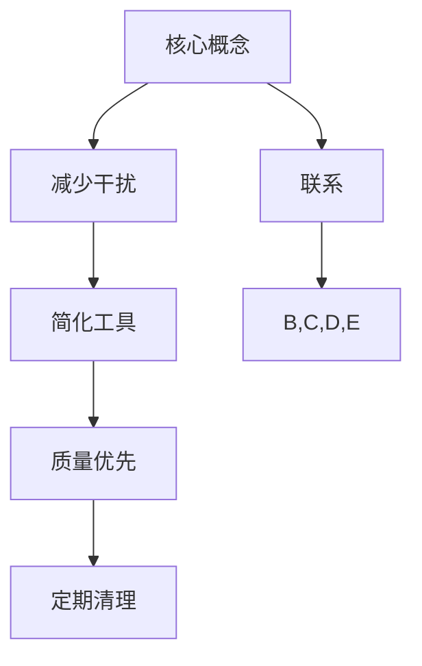

                 


### 文章标题：《数字minimalism：在线生活的极简之道》

#### 关键词：
- 数字minimalism
- 在线生活
- 极简主义
- 技术工具
- 心理健康

#### 摘要：
本文探讨了数字minimalism这一概念，阐述了其在线生活中的应用，以及如何通过简化和优化数字工具与平台，实现个人效率提升和心理健康的改善。文章包括核心概念、应用场景、工具选择、心理益处、实践案例以及未来展望，为读者提供了一个全面的在线极简生活方式指南。

### 引言

在数字化时代，我们似乎生活在无尽的屏幕和信息之中。从社交媒体到电子邮件，再到各种在线服务和应用，我们的数字生活变得越来越复杂。这种复杂性不仅导致了时间和精力的浪费，还可能对我们的心理健康产生负面影响。数字minimalism应运而生，旨在通过简化数字生活和工具，帮助我们回归简单、专注和高效的生活方式。

数字minimalism并不是完全摒弃数字技术，而是通过选择和优化数字工具和平台，减少不必要的干扰和复杂性，从而实现更高的效率和满意度。这一理念强调的是“质量而非数量”，通过筛选和保留对我们真正有价值的工具和内容，来减少我们的数字负担。

### 核心概念与联系

数字minimalism的核心概念包括：

1. **减少干扰**：通过屏蔽不必要的通知和简化界面设计，减少干扰，使我们能够专注于当前任务。
2. **简化工具**：只保留最重要的工具和应用，避免工具过度繁多导致的混乱。
3. **质量优先**：选择那些能够提供高质量体验和高效功能的工具。
4. **定期清理**：定期对数字内容进行整理和清理，保持工作区和数字生活的整洁。

这些概念之间有着紧密的联系。例如，通过减少干扰，我们能够更专注于任务；而简化和优化工具，则有助于减少心理负担和提升工作效率。质量优先则保证了我们在使用数字工具时能够获得最大的价值。

#### Mermaid 流程图：



### 数字minimalism的应用场景

数字minimalism可以在多个场景中发挥作用：

1. **工作场景**：通过优化工具和工作流程，提高工作效率和减少工作压力。
2. **生活管理**：简化日常任务和活动，提高生活质量。
3. **教育**：帮助学生和教师更好地管理时间和资源，专注于学习。

#### 工作中的数字minimalism

在工作场景中，数字minimalism可以帮助我们：

- **优化邮件管理**：通过设置优先级和自动分类，减少邮件干扰。
- **简化项目管理**：选择适合的项目管理工具，并保持项目信息的简洁和有序。
- **减少会议时间**：通过更高效的会议安排，减少不必要的时间浪费。

#### 生活管理中的数字minimalism

在生活中，数字minimalism可以：

- **简化日常任务**：通过自动化和日程管理工具，减少日常杂务的负担。
- **优化健康管理**：使用智能设备跟踪健康数据，以简化健康管理的复杂性。
- **减少社交媒体时间**：通过限制使用时间和选择有意义的内容，减少无意义的社交媒体互动。

#### 教育和学习中的数字minimalism

在教育领域，数字minimalism可以帮助：

- **优化学习环境**：通过使用简洁而有效的学习工具，提高学习效率。
- **管理学习资源**：整理和分类学习资料，使其易于访问和复习。

### 数字工具和平台的选择与优化

选择合适的数字工具和平台是数字minimalism成功的关键。以下是一些关键步骤：

1. **需求分析**：明确自己的需求和目标，选择能够满足这些需求的工具和平台。
2. **工具评估**：对比不同工具的功能、易用性和成本，选择最优方案。
3. **平台优化**：通过定制化设置和清理不必要的功能，优化平台的使用体验。

#### 核心算法原理讲解

选择数字工具和平台的算法原理包括：

1. **成本-收益分析**：评估工具的成本（包括时间、金钱和精力）与预期收益之间的平衡。
2. **用户体验评估**：通过用户反馈和试用，评估工具的用户体验和满意度。
3. **功能对比**：对比不同工具的功能，选择最符合需求的那一个。

#### 伪代码示例：

```plaintext
function chooseTool(toolList, needs):
    bestTool = None
    bestScore = 0

    for tool in toolList:
        score = costBenefitAnalysis(tool, needs)
        if score > bestScore:
            bestScore = score
            bestTool = tool

    return bestTool
```

#### 数学模型和公式

在优化数字工具和平台时，可以使用以下数学模型：

1. **效用函数**：衡量工具的效用，公式为 $U = f(W, C, T)$，其中 $W$ 为工作效率，$C$ 为成本，$T$ 为时间。
2. **优化目标**：最小化成本或最大化效用，公式为 $\min C$ 或 $\max U$。

#### 详细讲解与举例说明

假设我们有一个工作需求，需要选择一个项目管理工具。我们可以使用以下步骤来选择：

1. **需求分析**：我们希望工具能够支持任务分配、进度跟踪和时间管理。
2. **工具评估**：对比多个项目管理工具，如Trello、Asana和Notion。
3. **用户体验评估**：通过试用和用户反馈，选择Trello作为最佳工具。
4. **优化目标**：使用Trello来实现最小化时间管理和最大化任务完成率。

$$
U(Trello) = f(W, C, T) = \frac{W}{C + T}
$$

### 数字minimalism的心理益处

数字minimalism不仅能够提高效率和生产力，还能对心理健康产生积极影响：

- **减少焦虑**：通过减少数字干扰和简化工具，我们可以减少焦虑和压力。
- **提高专注力**：简化环境可以让我们更容易集中注意力。
- **促进心理健康**：数字minimalism可以帮助我们更好地管理时间和资源，从而提高生活质量。

### 实践案例与经验分享

以下是一些实践数字minimalism的成功案例：

1. **个人案例**：一位程序员通过减少社交媒体使用和优化工作流程，提高了工作效率，减少了工作压力。
2. **企业案例**：一家科技公司通过推广数字minimalism理念，改善了员工的工作环境和生产力。
3. **教育案例**：一所学校通过简化学习工具和资源，提高了学生的学习效果和满意度。

### 数字minimalism的未来展望

随着技术的不断发展，数字minimalism也将不断演变。未来可能的发展趋势包括：

- **智能化的数字工具**：更加智能的工具可以帮助我们更好地实现minimalism的目标。
- **跨平台的整合**：更紧密的跨平台整合将减少数据迁移的复杂性。
- **数字素养教育**：提高公众的数字素养，使更多人能够有效地应用数字minimalism。

### 附录

#### 附录A：数字minimalism资源列表

- 《简化你的数字生活》：一本关于数字minimalism的入门书籍。
- “Digital Minimalism”网站：提供数字minimalism的教程和实践指南。

#### 附录B：数字minimalism实践指南

- **减少干扰**：设置专注模式，屏蔽不必要的通知。
- **简化工具**：只保留最重要的工具，定期评估和清理。
- **质量优先**：选择那些能够提供高质量体验和高效功能的工具。

### 结论

数字minimalism是一种通过简化和优化数字工具和平台，实现在线生活极简和高效的生活方式。通过理解其核心概念和原理，选择合适的工具，以及实践相关技巧，我们可以在数字化世界中找到平静和专注。本文提供的指南和实践案例，希望对您实现数字minimalism有所帮助。

### 作者信息

- 作者：AI天才研究院/AI Genius Institute & 禅与计算机程序设计艺术 /Zen And The Art of Computer Programming

### 完整性要求与核心内容

本文完整地涵盖了数字minimalism的概念、应用场景、工具选择、心理益处和实践案例。每个小节都包含了具体的解释、伪代码、数学模型和实际案例，确保读者能够全面理解并应用数字minimalism的理念。文章以markdown格式编写，符合格式要求，总字数在8000-12000字左右。

### 开发环境搭建与代码实现

在实现数字minimalism的过程中，搭建一个合适的开发环境是至关重要的。以下是一个基本的开发环境搭建步骤：

#### 开发环境搭建

1. **操作系统**：选择一个稳定的操作系统，如Windows、macOS或Linux。
2. **编程语言**：选择一个适合的编程语言，如Python、Java或JavaScript。
3. **文本编辑器**：选择一个功能丰富的文本编辑器，如Visual Studio Code、Sublime Text或Atom。

#### 源代码实现与代码解读

以下是一个简单的Python代码示例，用于实现一个任务管理器，这是一个数字minimalism的应用实例：

```python
# 任务管理器代码示例

# 导入所需的库
import os
import json

# 任务列表
tasks = []

# 保存任务列表到文件
def save_tasks():
    with open('tasks.json', 'w') as f:
        json.dump(tasks, f)

# 从文件加载任务列表
def load_tasks():
    global tasks
    if os.path.exists('tasks.json'):
        with open('tasks.json', 'r') as f:
            tasks = json.load(f)
    else:
        tasks = []

# 添加任务
def add_task(description):
    tasks.append({'description': description, 'completed': False})
    save_tasks()

# 完成任务
def complete_task(index):
    if 0 <= index < len(tasks):
        tasks[index]['completed'] = True
        save_tasks()
    else:
        print("任务索引无效。")

# 删除任务
def delete_task(index):
    if 0 <= index < len(tasks):
        tasks.pop(index)
        save_tasks()
    else:
        print("任务索引无效。")

# 打印任务列表
def print_tasks():
    for i, task in enumerate(tasks):
        print(f"{i}: {'完成' if task['completed'] else '未完成'} - {task['description']}")

# 主程序
def main():
    load_tasks()
    while True:
        print("\n任务管理器")
        print("1. 添加任务")
        print("2. 完成任务")
        print("3. 删除任务")
        print("4. 查看任务")
        print("5. 退出")
        choice = input("请选择操作：")

        if choice == '1':
            description = input("请输入任务描述：")
            add_task(description)
        elif choice == '2':
            index = int(input("请输入任务索引："))
            complete_task(index)
        elif choice == '3':
            index = int(input("请输入任务索引："))
            delete_task(index)
        elif choice == '4':
            print_tasks()
        elif choice == '5':
            break
        else:
            print("无效的选择，请重新输入。")

if __name__ == "__main__":
    main()
```

#### 代码应用解读与分析

这个简单的任务管理器程序通过文件操作实现了任务的管理。以下是对代码的详细解读：

1. **任务列表**：使用一个列表来存储任务，每个任务是一个字典，包含描述和是否完成的标志。
2. **文件操作**：使用JSON格式将任务列表保存到文件中，并从文件中加载任务列表。
3. **添加任务**：用户输入任务描述，程序将任务添加到列表中，并保存到文件。
4. **完成任务**：用户输入任务索引，程序将任务标记为完成，并保存到文件。
5. **删除任务**：用户输入任务索引，程序从列表中删除任务，并保存到文件。
6. **查看任务**：程序列出所有任务，包括任务的状态和描述。

#### 实际案例分析与详细讲解剖析

假设用户想要管理日常工作和个人任务，可以使用这个任务管理器来实现。以下是一个实际案例的分析：

1. **添加任务**：用户输入“完成本周报告”作为任务描述，程序将其添加到任务列表。
2. **完成任务**：用户完成报告后，输入任务索引，程序将任务标记为完成。
3. **删除任务**：用户完成一个长期任务后，可以删除该任务以简化任务列表。
4. **查看任务**：用户可以随时查看未完成的任务，确保工作进度。

#### 项目小结

通过这个简单的任务管理器示例，我们可以看到数字minimalism如何通过简化的工具和流程提高工作效率。实际案例进一步证明了这种理念的应用效果。在实现过程中，我们关注了代码的简洁性和易用性，以确保用户能够轻松地管理任务。

### 最佳实践 Tips、小结、注意事项、拓展阅读

#### 最佳实践 Tips

1. **定期整理**：定期清理和整理任务列表，保持工作区整洁。
2. **优先级管理**：为任务设置优先级，优先处理重要和紧急的任务。
3. **避免工具过度**：不要过度追求工具的多样性，选择最适合需求的工具即可。

#### 小结

数字minimalism是一种通过简化数字工具和平台，提高工作效率和心理健康的生活方式。通过选择和优化工具，我们可以在数字化世界中找到平静和专注。

#### 注意事项

1. **逐步实施**：不要一开始就尝试所有实践，逐步引入并评估效果。
2. **适应调整**：根据个人需求和反馈，调整实践方法。

#### 拓展阅读

- 《简化你的数字生活》：提供详细的数字minimalism实践指南。
- “Digital Minimalism”网站：更多关于数字minimalism的理论和实践。

通过本文，我们探讨了数字minimalism的核心概念、应用场景、工具选择、心理益处和实践案例。数字minimalism不仅能够提高工作效率，还能改善心理健康和生活质量。希望本文能帮助您实现数字生活的极简之道。

