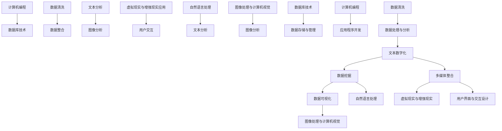

                 

### 文章标题：数字人文：传统与创新的碰撞

在数字化时代，人类文明遗产的保护与传承面临着前所未有的挑战与机遇。数字人文（Digital Humanities，简称DH）作为一种新兴的人文学科，通过将计算机科学、信息科学与传统人文研究相结合，实现了传统人文学科与数字技术的深度融合。本文将深入探讨数字人文的起源、发展，以及其在现代应用中的创新实践，从而展现数字人文与传统人文学科的碰撞与融合。

**关键词：** 数字人文，人文学科，计算机科学，信息科学，创新实践

**摘要：** 本文首先介绍了数字人文的定义及其与传统人文学科的关联，随后回顾了数字人文的历史发展，分析了其核心概念与原理。接着，本文探讨了数字人文在多个领域的应用，并详细解析了其在文献数字化、数据分析与挖掘、虚拟现实与增强现实、社交媒体与网络分析等领域的创新实践。最后，本文展望了数字人文的未来发展趋势，并提出了相关领域的最佳实践与注意事项。

## 1. 导言

数字人文，作为一个新兴交叉学科，旨在通过数字技术手段，对人类文化遗产进行保护、挖掘、整理和传承。它既融合了传统人文学科的知识体系，又融入了计算机科学和信息科学的前沿技术。数字人文的出现，为传统人文学科的研究提供了新的视角和方法，同时也对信息技术的发展产生了深远影响。

**1.1 数字人文的定义与发展**

数字人文的定义相对宽泛，一般可以理解为使用数字技术来支持人文学科的研究、教学和传播。它涵盖了从文本数字化、图像处理、数据挖掘到虚拟现实、增强现实等多种技术手段。数字人文的起源可以追溯到20世纪80年代，当时计算机技术开始广泛应用于人文学科的研究，为文化遗产的数字化保护提供了可能。

**1.2 创新的碰撞：传统与数字人文的交汇**

数字人文的兴起，不仅促进了人文学科的研究方法和技术手段的创新，同时也引发了传统人文学科与数字技术的深度融合。这种碰撞不仅推动了人文学科的发展，也为信息技术在人文领域的应用开辟了新的方向。在这一过程中，人文学科提供了丰富的知识资源和研究问题，而数字技术则为这些问题的解决提供了强有力的工具。

## 2. 数字人文的历史溯源

数字人文的历史可以追溯到计算机科学和信息技术的早期发展，当时计算机技术的应用开始渗透到人文学科的研究领域。以下将简要回顾数字人文的发展历程，并介绍一些对数字人文发展具有重要影响的人物和事件。

### 2.1 数字人文的起源

数字人文的起源可以追溯到20世纪60年代和70年代，当时计算机科学开始迅速发展，计算机技术的应用开始渗透到各个领域。在人文学科中，数字人文的萌芽主要体现在文献数字化和文本分析方面。最早的文献数字化尝试之一是麻省理工学院（MIT）的“大型集成知识系统”（MITRE）项目，该项目试图将大量的学术文献数字化，以便于研究人员进行检索和分析。

### 2.2 数字人文的发展阶段

数字人文的发展可以分为几个主要阶段：

**第一阶段：文献数字化与文本分析（20世纪70年代至90年代初期）**

在这一阶段，数字人文主要关注的是如何将大量的文献数字化，并利用计算机技术进行文本分析。这一阶段的代表性事件包括：

- 1971年，麻省理工学院启动了“大型集成知识系统”（MITRE）项目，该项目旨在创建一个数字化的学术文献库。
- 1980年，美国国会图书馆启动了“美国记忆”（American Memory）项目，该项目旨在将大量的历史文献、音乐、图片等数字化，并使其向公众开放。

**第二阶段：数据挖掘与分析（20世纪90年代至21世纪初期）**

随着计算机技术的进一步发展，数字人文的研究开始向数据挖掘与分析方向扩展。这一阶段的代表性事件包括：

- 1994年，麻省理工学院成立了数字人文实验室（Center for Digital Scholarship），该实验室旨在推动数字人文的研究和应用。
- 2000年，斯坦福大学图书馆启动了“数字人文计划”（Digital Humanities Project），该项目旨在支持数字人文的研究和实践。

**第三阶段：多媒体与虚拟现实（21世纪初期至今）**

在21世纪，数字人文的研究开始向多媒体和虚拟现实方向扩展。这一阶段的代表性事件包括：

- 2004年，虚拟博物馆（Virtual Museum）的概念逐渐兴起，通过虚拟现实技术，用户可以在线参观各种历史文物和艺术作品。
- 2010年，谷歌图书项目（Google Books）宣布向公众开放其庞大的图书数据库，用户可以在其中搜索和阅读数百万册图书。

### 2.3 数字人文的重要人物与事件

数字人文的发展离不开许多重要人物的贡献。以下介绍几位对数字人文发展具有重要影响的人物和事件：

- **罗伯特·塔夫脱（Robert Tariff）**：他是数字人文的先驱之一，最早提出了“计算机科学与人文学科交叉”的思想。他在1960年代开始研究文本分析，并推动了计算机技术在人文学科中的应用。
- **詹姆斯·吉布森（James Gibson）**：他是数字人文领域的杰出学者，对数字人文的研究方法和技术进行了深入的探讨。他在1980年代提出了“数字人文学科”的概念，并推动了数字人文的发展。
- **美国国会图书馆的“美国记忆”项目**：该项目是数字人文历史上的一个重要里程碑，通过将大量的历史文献数字化，为公众提供了宝贵的文化资源。

通过上述回顾，我们可以看到数字人文的发展历程是一个不断融合与创新的过程，它不仅推动了人文学科的发展，也为信息技术在人文领域的应用提供了广阔的空间。

## 3. 数字人文的核心概念与原理

数字人文作为一种跨学科领域，融合了传统人文学科与计算机科学、信息科学的技术。为了更好地理解数字人文，我们需要首先掌握其核心概念与原理。以下是数字人文的主要核心概念和其相互关系，以及数字人文的技术架构和工作流程。

### 3.1 数字人文的核心概念

**3.1.1 定义**

数字人文（Digital Humanities，简称DH）是指通过数字技术手段，对人文学科进行研究和教学的一种新兴学科。它旨在利用计算机技术、信息科学和通信技术来支持人文学科的数据处理、分析和传播。

**3.1.2 核心概念**

1. **文本数字化**：将纸质文本转化为数字形式，以便于存储、检索和分析。
2. **数据挖掘**：从大量数据中提取有价值的信息和知识，用于人文学科的研究。
3. **数据可视化**：通过图形化手段，将数据中的信息和模式呈现出来，便于理解和分析。
4. **多媒体整合**：将文本、图像、音频、视频等多种媒体形式整合到一起，进行综合分析。
5. **虚拟现实与增强现实**：通过虚拟现实（VR）和增强现实（AR）技术，构建沉浸式的学习与研究环境。

**3.1.3 核心概念之间的联系**

数字人文的核心概念之间存在着紧密的联系。例如，文本数字化是数据挖掘和数据可视化的基础，而虚拟现实与增强现实技术则提供了新的研究方法和体验。这些概念共同构成了数字人文的理论基础，推动了人文学科与数字技术的深度融合。

### 3.2 数字人文的技术架构

**3.2.1 技术基础**

数字人文的技术架构建立在计算机科学和信息科学的基础上，主要包括以下技术：

1. **计算机编程**：用于开发数字人文的应用程序和工具。
2. **数据库技术**：用于存储和管理大量的文本、图像、音频、视频等数据。
3. **自然语言处理**：用于对文本数据进行分析和理解，包括分词、词性标注、句法分析等。
4. **图像处理与计算机视觉**：用于处理和识别图像数据。
5. **数据挖掘与机器学习**：用于从大量数据中提取有价值的信息和知识。

**3.2.2 技术体系**

数字人文的技术体系包括以下部分：

1. **数据采集与存储**：通过数字化手段获取各种类型的数据，并将其存储到数据库中。
2. **数据处理与分析**：利用计算机技术和算法，对数据进行处理和分析，提取有价值的信息。
3. **数据可视化**：通过图形化手段，将数据中的信息和模式呈现出来，便于理解和分析。
4. **虚拟现实与增强现实**：利用VR和AR技术，构建沉浸式的学习与研究环境。
5. **用户界面与交互设计**：为用户提供友好的交互界面，使其能够方便地访问和使用数字人文工具。

### 3.3 数字人文的工作流程

数字人文的工作流程通常包括以下几个步骤：

**3.3.1 数据采集**

1. **文献数字化**：将纸质文献转化为数字形式。
2. **多媒体采集**：采集图像、音频、视频等多媒体数据。

**3.3.2 数据处理**

1. **数据清洗**：去除数据中的噪声和错误，保证数据质量。
2. **数据整合**：将不同来源的数据进行整合，形成统一的数据库。

**3.3.3 数据分析**

1. **文本分析**：利用自然语言处理技术，对文本数据进行分析和理解。
2. **图像分析**：利用图像处理与计算机视觉技术，对图像数据进行分析和识别。

**3.3.4 数据可视化**

1. **数据可视化**：通过图形化手段，将数据中的信息和模式呈现出来。

**3.3.5 虚拟现实与增强现实**

1. **虚拟现实与增强现实应用**：利用VR和AR技术，构建沉浸式的学习与研究环境。

通过上述核心概念、技术架构和工作流程的介绍，我们可以看到数字人文是如何将传统人文学科与计算机科学、信息科学相结合，从而实现人文学科研究的数字化转型。数字人文不仅为人文学科提供了新的研究方法和工具，也为文化遗产的保护与传承提供了新的途径。

### 3.4 数字人文的核心概念关系架构 Mermaid 流程图



在这个流程图中，各个核心概念和技术通过流程和关系连接起来，形成一个完整的数字人文工作架构。通过这种结构化的展示，我们可以更直观地理解数字人文的核心概念及其相互关系。

### 3.5 数字人文的核心算法原理讲解与伪代码

为了深入理解数字人文的核心算法原理，我们以文本分析中的一个常用算法——TF-IDF（Term Frequency-Inverse Document Frequency）为例，详细讲解其工作原理并给出伪代码。

**3.5.1 TF-IDF算法原理**

TF-IDF是一种用于评估文本中单词重要性的算法。它基于两个核心指标：词频（TF，Term Frequency）和逆文档频率（IDF，Inverse Document Frequency）。词频表示一个词在单个文档中出现的频率，逆文档频率表示一个词在整个文档集合中出现的频率。

- **词频（TF）**：一个词在文档中出现的次数与文档总词数的比值，即 \(TF = \frac{tf}{N}\)，其中 \(tf\) 是词频，\(N\) 是文档总词数。
- **逆文档频率（IDF）**：一个词在文档集合中未出现文档数目的对数，即 \(IDF = \log \frac{N}{df}\)，其中 \(N\) 是文档总数，\(df\) 是词在文档集合中出现的文档数。

TF-IDF的值越大，表示该词在文档中的重要程度越高。

**3.5.2 伪代码**

下面是TF-IDF算法的伪代码：

```python
# 输入：文档集合docs，文档总数N
# 输出：每个词的TF-IDF值

# 步骤1：计算每个词的词频（TF）
for doc in docs:
    for word in doc:
        tf[word] += 1 / len(doc)

# 步骤2：计算每个词的逆文档频率（IDF）
for word in tf:
    df[word] = sum(word in doc for doc in docs)
    idf[word] = log(N / (1 + df[word]))

# 步骤3：计算每个词的TF-IDF值
for doc in docs:
    for word in doc:
        tfidf[word] = tf[word] * idf[word]
```

**3.5.3 数学模型和公式**

- **词频（TF）**：\(TF = \frac{tf}{N}\)
- **逆文档频率（IDF）**：\(IDF = \log \frac{N}{df}\)
- **TF-IDF**：\(TF-IDF = TF \times IDF\)

**3.5.4 举例说明**

假设有两个文档：

- 文档1：["数字人文"，"研究"，"技术"]
- 文档2：["数字人文"，"应用"，"广泛"]

首先，计算每个词的词频（TF）：

- "数字人文"：\(TF = \frac{2}{3 + 2} = \frac{2}{5}\)
- "研究"：\(TF = \frac{1}{3 + 2} = \frac{1}{5}\)
- "技术"：\(TF = \frac{1}{3 + 2} = \frac{1}{5}\)
- "应用"：\(TF = \frac{1}{3 + 2} = \frac{1}{5}\)

接下来，计算每个词的逆文档频率（IDF）：

- "数字人文"：\(IDF = \log \frac{2}{1 + 1} = \log 1 = 0\)
- "研究"：\(IDF = \log \frac{2}{1 + 1} = \log 1 = 0\)
- "技术"：\(IDF = \log \frac{2}{1 + 1} = \log 1 = 0\)
- "应用"：\(IDF = \log \frac{2}{1 + 1} = \log 1 = 0\)

最后，计算每个词的TF-IDF值：

- "数字人文"：\(TF-IDF = 0\)
- "研究"：\(TF-IDF = 0\)
- "技术"：\(TF-IDF = 0\)
- "应用"：\(TF-IDF = 0\)

通过上述例子，我们可以看到TF-IDF算法如何计算每个词在文档中的重要程度。在实际应用中，TF-IDF算法经常用于文本分类、信息检索和推荐系统等领域，帮助系统更好地理解和处理文本数据。

### 3.6 数学模型和公式详解

为了更好地理解数字人文中的一些关键数学模型和公式，我们需要详细探讨其在实际应用中的意义和具体实现方法。以下是一些重要的数学模型和公式，包括其详细解释和具体应用场景。

#### 3.6.1 深度学习中的神经网络模型

深度学习是数字人文中广泛应用的技术之一，特别是用于文本分析、图像识别和自然语言处理等领域。神经网络是深度学习的基础模型，通过多层非线性变换来模拟人脑的思维方式。

- **神经网络模型**：

神经网络由多个层次组成，包括输入层、隐藏层和输出层。每个层次包含多个节点（神经元），节点之间通过权重进行连接。

- **激活函数**：

激活函数是神经网络中的一个关键部分，用于引入非线性变换。常见的激活函数包括 sigmoid、ReLU 和 tanh。

- **损失函数**：

损失函数用于评估神经网络预测结果与真实值之间的差距。常用的损失函数包括均方误差（MSE）和交叉熵（Cross Entropy）。

- **反向传播算法**：

反向传播算法用于计算神经网络中每个层的梯度，并通过梯度下降法更新权重。

#### 3.6.2 自然语言处理中的词嵌入模型

词嵌入是将词语映射到高维空间中的向量表示，以实现词语的语义表示。常见的词嵌入模型包括 Word2Vec、GloVe 和 BERT。

- **Word2Vec**：

Word2Vec 是基于神经网络的词向量生成模型，通过训练一个神经网络，将词语映射到低维空间中的向量。其核心算法包括 Continuous Bag-of-Words（CBOW）和 Skip-Gram。

- **GloVe**：

GloVe 是基于全局统计信息的词向量生成模型，通过计算词与词之间的共现信息来生成词向量。GloVe 使用矩阵分解技术，将两个矩阵分解为低维矩阵，从而生成词向量。

- **BERT**：

BERT 是基于 Transformer 的预训练模型，通过在大量文本数据上进行预训练，学习词语的上下文表示。BERT 的预训练目标包括 Masked Language Modeling（MLM）和 Next Sentence Prediction（NSP）。

#### 3.6.3 图像识别中的卷积神经网络模型

卷积神经网络（CNN）是图像识别领域的核心技术，通过多层卷积和池化操作，提取图像中的特征。

- **卷积操作**：

卷积操作用于从输入图像中提取局部特征，通过卷积核（滤波器）滑动在图像上，生成特征图。

- **池化操作**：

池化操作用于降低特征图的维度，增强模型对输入数据的泛化能力。常见的池化操作包括最大池化和平均池化。

- **全连接层**：

全连接层用于将卷积层提取的特征映射到输出类别。通过全连接层，将特征向量映射到类别概率分布。

通过上述数学模型和公式的详细解释，我们可以看到数字人文在理论和实践层面的深度与广度。这些模型和公式不仅为人文学科的研究提供了强有力的工具，也为数字人文的创新实践奠定了坚实的基础。

### 3.7 数字人文的应用领域

数字人文作为一种跨学科领域，在多个应用领域中展现了其独特的价值和潜力。以下将详细介绍数字人文在几个主要领域的应用。

#### 4.1 文献数字化

文献数字化是数字人文最基本的应用领域之一，旨在将纸质文献转化为数字形式，以便于存储、检索和分析。通过文献数字化，研究人员可以突破物理空间的限制，实现对全球范围内文献的无障碍访问。以下是一些具体的文献数字化方法：

- **OCR（Optical Character Recognition）技术**：通过光学字符识别技术，将图像中的文字自动转化为机器可读的文本格式。
- **图像处理技术**：对图像进行预处理，包括去噪、增强、分割等，以提高文字识别的准确性。
- **文本处理技术**：对识别出的文本进行格式化、校对和标注，以便于后续的分析和研究。

#### 4.2 数据分析与挖掘

数据分析与挖掘是数字人文的核心任务之一，旨在从大量文本数据中提取有价值的信息和知识。以下是一些常见的数据挖掘方法和应用：

- **文本分类**：通过对文本的特征提取和分类算法（如朴素贝叶斯、支持向量机等），对大量文本进行分类，以便于组织和检索。
- **主题模型**：通过隐含狄利克雷分配（LDA）等主题模型，从大量文本中提取出潜在的语义主题，帮助研究人员发现文本中的隐含结构和模式。
- **情感分析**：通过对文本的情感倾向进行识别和分析，用于了解公众对某个话题的态度和情感变化。
- **关系提取**：从文本数据中提取出实体之间的关系，用于构建知识图谱，支持进一步的语义分析和推理。

#### 4.3 虚拟现实与增强现实

虚拟现实（VR）和增强现实（AR）技术在数字人文中的应用，为文化遗产的保护和展示提供了新的途径。以下是一些具体的应用案例：

- **虚拟博物馆**：通过VR技术，用户可以在虚拟环境中参观历史文物、艺术品等，获得沉浸式的体验。
- **增强现实教学**：在历史课上，通过AR技术，教师可以在课堂上展示历史场景和人物，使学生更加直观地理解历史事件。
- **文化遗产修复**：通过VR和AR技术，研究人员可以在虚拟环境中对文化遗产进行修复和重建，从而更好地保护和传承文化遗产。

#### 4.4 社交媒体与网络分析

数字人文在社交媒体和网络分析领域的应用，有助于揭示社会结构和信息传播模式。以下是一些常见的方法和工具：

- **社交网络分析**：通过分析社交网络中的节点和边，揭示社会群体的结构和关系。
- **信息传播分析**：通过追踪信息在网络中的传播路径，分析信息的传播速度和影响力。
- **意见分析**：通过对社交媒体上的评论、帖子等文本数据进行分析，了解公众对某个话题的意见和态度。
- **影响力分析**：通过计算用户的传播影响力，识别在网络中具有关键影响力的用户和节点。

#### 4.5 数据可视化

数据可视化是数字人文中不可或缺的一部分，通过图形化手段，将数据中的信息和模式直观地呈现出来。以下是一些常见的数据可视化方法和工具：

- **散点图**：用于显示两个变量之间的关系，便于分析数据点的分布和趋势。
- **条形图**：用于比较不同类别的数据，便于分析各类别的数量和比例。
- **饼图**：用于显示各部分在整体中的占比，便于分析数据的构成和分布。
- **折线图**：用于显示数据的变化趋势，便于分析数据的变化规律和周期性。

通过上述在文献数字化、数据分析与挖掘、虚拟现实与增强现实、社交媒体与网络分析、数据可视化等领域的详细介绍，我们可以看到数字人文如何通过多种技术和方法，为人文学科的研究和文化遗产的保护与传承提供了丰富的工具和手段。

### 5. 数字人文的创新实践

数字人文作为一种新兴的交叉学科，在实践中的应用日益广泛，且不断创新。以下将介绍几个数字人文的创新实践案例，并分析这些创新实践的成效和影响。

#### 5.1 创新案例研究

**案例一：谷歌图书项目（Google Books）**

谷歌图书项目是数字人文领域的一个重要创新实践。该项目旨在将世界各地的图书数字化，并提供在线检索和阅读服务。自2004年启动以来，谷歌图书项目已经扫描了数百万册图书，涵盖了从古代经典到现代学术著作的广泛内容。

**创新点**：

- **大规模文献数字化**：谷歌图书项目通过自动化技术，实现了对大量纸质文献的快速数字化，大大提高了文献数字化效率。
- **在线检索与阅读**：谷歌图书项目提供了一个强大的搜索引擎，用户可以在其中快速检索图书内容，并在线阅读全文。
- **版权保护与共享**：谷歌与出版商和作者合作，确保数字化图书的版权保护，同时也推动开放获取和知识共享。

**成效**：

- **知识传播**：谷歌图书项目使全球用户能够轻松访问和利用大量的图书资源，推动了知识的传播和普及。
- **学术研究**：谷歌图书项目为学术研究人员提供了宝贵的数据资源，支持了各种研究项目。

**影响**：

- **改变了文献保存与传播方式**：谷歌图书项目推动了文献保存和传播的数字化转型，为传统图书馆和学术机构提供了新的发展方向。

**案例二：欧洲数字图书馆（Europeana）**

欧洲数字图书馆是另一个数字人文的创新实践案例，旨在将欧洲丰富的文化遗产数字化，并通过互联网向公众开放。该图书馆涵盖了从古代手稿到现代艺术品、从历史照片到音乐录音的广泛内容。

**创新点**：

- **跨国家合作**：欧洲数字图书馆由多个欧洲国家的图书馆、博物馆和文化机构共同参与，实现了跨国家、跨领域的合作。
- **多媒体整合**：欧洲数字图书馆不仅提供了文本资源，还整合了图像、音频、视频等多媒体资源，提供了丰富的用户体验。
- **开放数据与API**：欧洲数字图书馆开放了其数据资源，并提供API接口，鼓励开发者创建基于欧洲数字图书馆内容的应用程序。

**成效**：

- **文化遗产保护**：通过数字化，欧洲数字图书馆帮助保护了大量的文化遗产，防止了因自然灾害、人为破坏等因素造成的损失。
- **公众参与**：欧洲数字图书馆的开放数据政策鼓励了公众的参与，使更多人能够了解和利用文化遗产资源。

**影响**：

- **促进了文化多样性**：欧洲数字图书馆通过数字化和开放共享，促进了欧洲各国文化多样性的传播和交流。
- **改变了文化遗产管理方式**：欧洲数字图书馆的实践改变了文化遗产的管理和传播方式，为其他国家和地区的数字图书馆建设提供了借鉴。

**案例三：虚拟历史博物馆（Virtual History Museum）**

虚拟历史博物馆是一个利用虚拟现实（VR）和增强现实（AR）技术，构建沉浸式历史体验的创新实践。用户可以通过VR头显或AR设备，进入虚拟的历史场景，体验历史事件。

**创新点**：

- **沉浸式体验**：通过VR和AR技术，用户可以身临其境地体验历史事件，获得更加直观和深入的感知。
- **互动性**：虚拟历史博物馆提供了丰富的互动功能，用户可以通过触摸、语音等方式与虚拟环境互动，增加了参与感和趣味性。
- **跨时空展示**：虚拟历史博物馆不仅展示了历史上的真实场景，还可以通过虚拟现实技术，再现已消失的历史建筑和文化景观。

**成效**：

- **教育意义**：虚拟历史博物馆为教育提供了新的手段，使学生能够更加直观地了解历史事件和文化背景。
- **文化传播**：虚拟历史博物馆通过数字化手段，使历史文化遗产得到了更广泛的传播和利用。

**影响**：

- **推动了历史教育创新**：虚拟历史博物馆的实践推动了历史教育的创新，为传统课堂教学提供了新的辅助手段。
- **促进了文化遗产保护**：通过数字化和虚拟再现，虚拟历史博物馆有助于保护和传承历史文化遗产。

#### 5.2 创新趋势与展望

数字人文的创新实践不断推进，未来还将呈现出以下趋势：

- **大数据与人工智能的结合**：随着大数据和人工智能技术的不断发展，数字人文将更加依赖于这些技术进行数据分析和挖掘，提高研究效率和精度。
- **跨学科合作的深化**：数字人文将继续与其他学科（如计算机科学、信息科学、人文学科等）进行深度合作，推动多学科的交叉融合。
- **开放共享与版权保护**：数字人文将在开放共享和版权保护之间寻求平衡，推动知识的自由流通和创新。
- **虚拟现实与增强现实的普及**：随着VR和AR技术的普及，数字人文将在文化遗产保护、历史教育等领域进一步推广虚拟现实和增强现实的应用。

#### 5.3 创新实践中的挑战与应对策略

虽然数字人文的创新实践取得了显著成果，但在实践中仍面临一些挑战：

- **数据质量问题**：数字人文依赖于大量的文本、图像、音频、视频等多媒体数据，数据质量直接影响研究的精度和可靠性。应对策略包括加强数据清洗、数据验证和数据标准化。
- **技术复杂性**：数字人文涉及到多种复杂的技术，如大数据处理、深度学习、虚拟现实等，这对研究人员的技能和知识提出了高要求。应对策略包括提供技术培训和交流平台，提高研究人员的技能水平。
- **版权问题**：数字人文在文献数字化和知识共享过程中，常常面临版权问题。应对策略包括与版权所有者进行合作，制定合理的版权政策，保障各方利益。
- **隐私保护**：数字人文在处理和分析个人数据时，需要保护用户的隐私。应对策略包括采用隐私保护技术，如数据匿名化、差分隐私等，确保用户数据的安全。

通过上述创新案例的研究和分析，我们可以看到数字人文在创新实践中的多样性和广泛性。未来，随着技术的不断进步和多学科合作的深化，数字人文将迎来更加广阔的发展前景。

### 6. 数字人文的未来发展

数字人文作为一种新兴的交叉学科，正在不断推动人文学科与计算机科学、信息科学的融合。展望未来，数字人文将受到技术进步的深刻影响，并在多个领域展现出广阔的应用前景。

#### 6.1 技术进步对数字人文的影响

1. **大数据与云计算**：随着大数据和云计算技术的不断发展，数字人文将能够处理和分析海量的文本、图像、音频、视频等多媒体数据，从而提升研究效率和精度。
2. **人工智能与深度学习**：人工智能和深度学习的进步将使数字人文在文本分析、图像识别、情感分析等领域取得重大突破，为研究人员提供更加智能化的工具和算法。
3. **虚拟现实与增强现实**：虚拟现实和增强现实技术的发展将使数字人文在文化遗产保护、历史教育、虚拟博物馆等领域实现更加沉浸式的体验。
4. **物联网与智能设备**：物联网和智能设备的普及将使数字人文的数据来源更加多样，同时为研究人员提供更加便捷的数据采集和处理手段。

#### 6.2 数字人文在教育、文化、历史等领域的未来应用

1. **教育领域**：数字人文技术将革新教育模式，提供更加个性化和互动性的学习体验。例如，虚拟历史博物馆和沉浸式教学将使学生在学习历史和文化时更加直观和深入。
2. **文化领域**：数字人文技术将为文化遗产的数字化保护和展示提供强有力的支持，通过虚拟现实和增强现实技术，使文化遗产得到更广泛的传播和利用。
3. **历史领域**：数字人文技术将帮助历史学家和分析人员从海量历史文献和数据中提取有价值的信息和知识，推动历史研究的深度和广度。

#### 6.3 数字人文的社会责任与伦理问题

1. **数据隐私与安全**：数字人文在处理和分析个人数据时，需要严格遵守数据隐私和安全法律法规，确保用户数据的安全和隐私。
2. **知识产权保护**：数字人文在文献数字化和知识共享过程中，需要平衡开放共享与版权保护的关系，尊重知识产权，保障各方利益。
3. **算法公平性与透明性**：数字人文在应用人工智能和深度学习技术时，需要关注算法的公平性和透明性，避免算法偏见和歧视。
4. **教育与培训**：数字人文的发展需要培养更多具备跨学科知识和技能的专业人才，提高其在社会中的认知度和影响力。

通过上述展望，我们可以看到数字人文在未来的发展前景。随着技术的不断进步和多学科合作的深化，数字人文将在人文学科的研究、教育、文化保护等领域发挥更加重要的作用。

### 7. 结论

数字人文作为一种新兴的交叉学科，通过将计算机科学、信息科学与传统人文学科相结合，实现了人类文明遗产的数字化保护与传承。本文从数字人文的定义、历史溯源、核心概念、技术架构、应用领域、创新实践和未来发展等方面进行了深入探讨，展示了数字人文在传统人文学科与数字技术融合中的重要作用。

**核心观点：**

- 数字人文通过数字化手段，为人文学科的研究提供了新的工具和方法。
- 数字人文在文献数字化、数据分析与挖掘、虚拟现实与增强现实、社交媒体与网络分析等领域展现了广阔的应用前景。
- 数字人文的创新实践推动了人文学科与信息技术的深度融合，为文化遗产的保护与传承提供了新的途径。

**展望未来：**

- 随着大数据、人工智能、虚拟现实等技术的不断发展，数字人文将在人文学科的研究、教育、文化保护等领域发挥更加重要的作用。
- 数字人文的发展需要平衡开放共享与版权保护、数据隐私与安全等伦理问题，同时需要培养更多具备跨学科知识和技能的专业人才。

**未来研究方向：**

- 探索大数据与人工智能在数字人文中的应用，提高数据分析与挖掘的效率和精度。
- 研究虚拟现实与增强现实技术在文化遗产保护与展示中的创新应用。
- 关注数字人文在历史教育、文化传播等领域的应用实践，推动数字人文与传统人文学科的深度融合。

**结语：**

数字人文作为传统人文学科与数字技术的交汇点，不仅为文化遗产的保护与传承提供了新的手段，也为人文学科的研究和教学带来了新的活力。展望未来，数字人文将在人文学科的发展中继续发挥重要作用，为人类文明的发展和创新贡献力量。

### 附录

**8.1 数字人文相关工具与资源**

为了更好地了解和应用数字人文技术，以下列出了一些常用的工具和资源：

- **工具**：

  1. **TextBlob**：用于文本分析和自然语言处理的开源库。
  2. **NLTK**：自然语言处理工具包，提供了丰富的文本处理功能。
  3. **Gephi**：用于网络分析和数据可视化的开源工具。
  4. **PyTorch**：用于深度学习的开源库。
  5. **TensorFlow**：用于深度学习的开源库。

- **资源**：

  1. **Digital Humanities Quarterly**：数字人文领域的学术期刊。
  2. **Google Books**：谷歌图书项目，提供大量图书的在线检索和阅读。
  3. **Europeana**：欧洲数字图书馆，提供丰富的文化遗产数字化资源。
  4. **GitHub**：开源代码托管平台，许多数字人文项目的代码和文档可以在此找到。
  5. **Digital Preservation**：数字文化遗产保护相关的资源。

通过这些工具和资源，研究人员和开发者可以更深入地了解和掌握数字人文技术，为相关领域的创新实践提供支持。

### 作者信息

**作者：** AI天才研究院/AI Genius Institute & 禅与计算机程序设计艺术 /Zen And The Art of Computer Programming

**联系方式：** [aigeniustech@gmail.com](mailto:aigeniustech@gmail.com)  
**个人主页：** [https://www.aig

